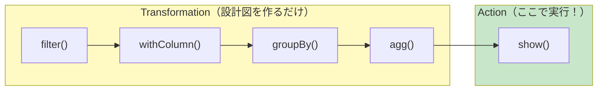
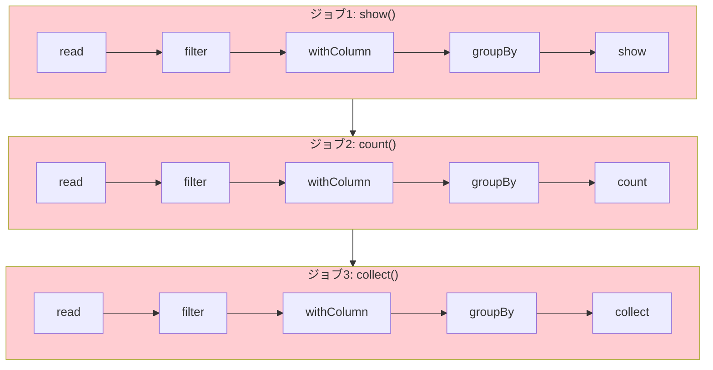
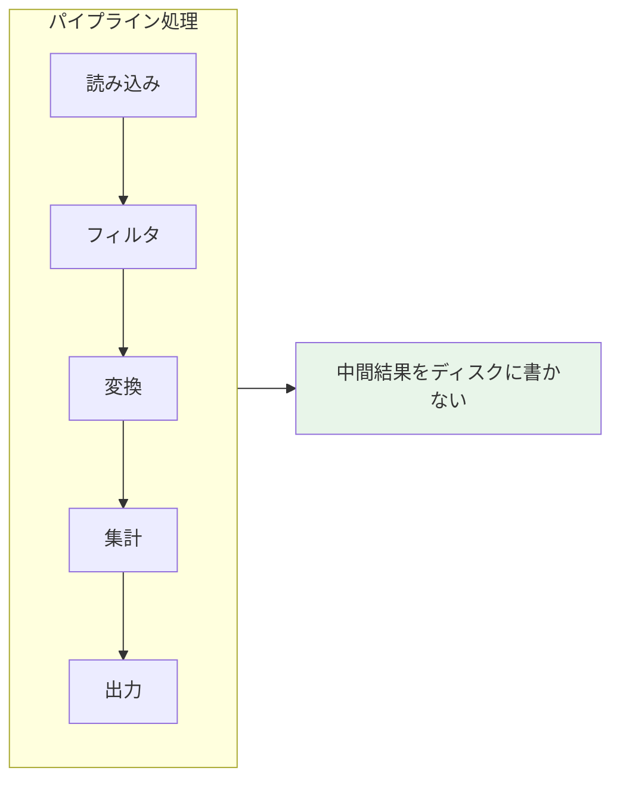

# はじめに

「Sparkは遅延評価」という説明を読んだことがある方は多いと思います。でも、実際に**どこで何が起きているか**を体感できていますか？

この記事では、Spark UIを使って「今、何も起きていない」「今、動いた！」を**目で見て理解**することを目指します。

## この記事で学べること

- 遅延評価の仕組みを体感レベルで理解する
- Spark UIでジョブの実行状況を確認する方法
- cache()が必要な理由を実感する
- explain()で実行計画を読む基本

## 対象読者

- Sparkを触り始めた初学者
- 「遅延評価」を言葉では知っているが実感がない方
- pandasから移行してきて「なんか違う」と感じている方

## 動作確認環境

サンプルノートブックはこちらです。この記事のコードはDatabricksで動作確認しています。

https://github.com/taka-yayoi/spark-lazy-evaluation/tree/main

なお、Free Editionを使っている場合はサーバレスコンピュートなので、Spark UIが使えず、キャッシュの箇所はエラーになります。本記事のコードを試す場合には、以下のように有料版でクラスターを作成ください。


ノートブックをクラスターにアタッチして、**クラスター > Spark UI**を選択します。


これでSpark UIが開きます。別ウィンドウにしておくと確認しやすくなります。


# 1. 遅延評価とは？（30秒で理解）

Sparkの操作は2種類に分かれます。

| 種類 | 何をする？ | 例 |
|-----|----------|-----|
| **Transformation** | 変換の「設計図」を作る | filter, select, withColumn, join, groupBy |
| **Action** | 設計図を実行する | show, count, collect, write, take |

**料理に例えると**：
- Transformation = レシピを書いている（まだ料理していない）
- Action = 実際に料理する（ここで初めて材料を使う）



# 2. 体感①：何も起きていないことを確認する

まず、Transformationだけでは何も実行されないことを確認しましょう。

```python
from pyspark.sql.functions import col
from pyspark.sql import functions as F

# 巨大なデータセット（NYC Taxiデータ）を読み込む
# このセルを実行しても一瞬で終わる！
sdf = spark.read.format("delta").load("/databricks-datasets/nyctaxi/tables/nyctaxi_yellow")

# フィルタリング
sdf = sdf.filter(col("fare_amount") > 50)

# 新しいカラムを追加
sdf = sdf.withColumn("tip_rate", col("tip_amount") / col("fare_amount"))

# 集計
sdf = sdf.groupBy("payment_type").agg(
    F.count("*").alias("count"),
    F.avg("tip_rate").alias("avg_tip_rate")
)

print("✅ セル実行完了！")
```
```
✅ Transformation完了（でも何も実行されていない）

👉 Spark UI > Jobs タブを確認してください
   → ジョブが増えていないはず！
```

**🔍 確認してみよう**：
1. 上のセルを実行する
2. Spark UI を開く（クラスター名の横のリンク、または右上の「View Spark UI」）
3. **Jobs** タブを確認

**結果**: ジョブが0件のはず！


何百万行ものデータに対して複雑な処理を書いたのに、一瞬で終わって何も起きていない。これが遅延評価です。

# 3. 体感②：Actionで初めて動く

次に、Actionを実行して初めてジョブが走ることを確認しましょう。

```python
# これを実行した瞬間にジョブが走る！
sdf.show()
```
```
=== show() を実行 ===
+------------+-------+--------------------+
|payment_type|  count|        avg_tip_rate|
+------------+-------+--------------------+
|         NA |    294| 0.00101149357833006|
|         CSH|3835235|2.169227226815231...|
|   No Charge|   3441|0.003350421579143...|
|         DIS|  18844|0.001616262978891...|
|         CRD|6589771| 0.17908416374872954|
|         Cre| 113897| 0.14130016384219107|
|        CASH| 114710|5.414680606942378E-7|
|         CAS|  50567|9.078644323087296E-5|
|         Dis|    398|0.002811996966359...|
|         UNK|  16932| 0.17539690013471898|
|         CRE|  14408| 0.14617670324808457|
|      Credit| 202146| 0.13762811084025553|
|         NOC|  55129|0.001777176394998...|
|         Cas|  34813|9.547683717789813E-4|
|        Cash|  74534|0.001054568332993706|
|     Dispute|   1004|0.001947189241313...|
|         No |   1208|0.003141984155836...|
|      CREDIT|  12489| 0.13645576016405664|
|           3|  44708|3.926530149692506...|
|           1|4046018|  0.1922712777825199|
+------------+-------+--------------------+
only showing top 20 rows

👉 Spark UI > Jobs タブを確認してください
   → ジョブが1つ増えたはず！
```


**🔍 確認してみよう**：
1. 上のセルを実行する
2. 実行に時間がかかることを確認（数秒〜数十秒）
3. Spark UI の **Jobs** タブを確認

**結果**: ジョブが1件登場！


**確認ポイント**：
- Jobs タブにジョブが表示される
- Stages タブで複数のステージが確認できる
- 「さっきの全処理（read → filter → withColumn → groupBy → agg）がここで一気に実行された」ことを実感


:::note info
**補足: Spark UIで「skipped」と表示される理由**

Spark UIでタスクが「skipped」と表示されることがあります。これは主に以下の理由によるものです：

- **Delta Lakeのデータスキッピング**: Deltaはファイルごとに統計情報（min/max値など）を保持しており、フィルタ条件を満たすデータがないファイルは読み込み自体をスキップします
- **Adaptive Query Execution (AQE)**: Spark 3.0以降でデフォルト有効な機能で、実行時にクエリプランを動的に最適化し、空のパーティションなど不要なタスクをスキップします
- **キャッシュヒット**: `cache()`済みのデータを読む場合、元データの読み込みステージがスキップされます
 
これらの最適化により、見た目上のジョブ数やタスク数は変動しますが、「Actionのたびに再計算が発生する」という本質は変わりません。
:::

# 4. 体感③：Actionのたびに再計算される

ここが最も重要なポイントです。**Actionを呼ぶたびに、最初から再計算されます**。

```python
from pyspark.sql.functions import col
from pyspark.sql import functions as F

# データ準備（Transformation）
sdf = spark.read.format("delta").load("/databricks-datasets/nyctaxi/tables/nyctaxi_yellow")
sdf = sdf.filter(col("fare_amount") > 50)
sdf = sdf.withColumn("tip_rate", col("tip_amount") / col("fare_amount"))
sdf = sdf.groupBy("payment_type").agg(
    F.count("*").alias("count"),
    F.avg("tip_rate").alias("avg_tip_rate")
)

print("=== 1回目のAction ===")
sdf.show()  # ← ジョブ1

print("=== 2回目のAction ===")
print(f"件数: {sdf.count()}")  # ← ジョブ2（また最初から計算！）

print("=== 3回目のAction ===")
data = sdf.collect()  # ← ジョブ3（また最初から！）
print(f"取得件数: {len(data)}")
```
```
==================================================
=== 1回目: show() ===
==================================================
+------------+-------+--------------------+
|payment_type|  count|        avg_tip_rate|
+------------+-------+--------------------+
|         NA |    294| 0.00101149357833006|
|         CSH|3835235|2.169227226815231...|
|   No Charge|   3441|0.003350421579143...|
|         DIS|  18844|0.001616262978891...|
|         CRD|6589771| 0.17908416374872954|
|         Cre| 113897| 0.14130016384219107|
|        CASH| 114710|5.414680606942378E-7|
|         CAS|  50567|9.078644323087296E-5|
|         Dis|    398|0.002811996966359...|
|         UNK|  16932| 0.17539690013471898|
|         CRE|  14408| 0.14617670324808457|
|      Credit| 202146| 0.13762811084025553|
|         NOC|  55129|0.001777176394998...|
|         Cas|  34813|9.547683717789813E-4|
|        Cash|  74534|0.001054568332993706|
|     Dispute|   1004|0.001947189241313...|
|         No |   1208|0.003141984155836...|
|      CREDIT|  12489| 0.13645576016405664|
|           3|  44708|3.926530149692506...|
|           1|4046018|  0.1922712777825199|
+------------+-------+--------------------+
only showing top 20 rows
⏱️ 所要時間: 6.60秒

==================================================
=== 2回目: count() ===
==================================================
件数: 41
⏱️ 所要時間: 3.69秒

==================================================
=== 3回目: collect() ===
==================================================
取得件数: 41
⏱️ 所要時間: 6.57秒

==================================================
👉 Spark UI > Jobs タブを確認してください
   → ジョブが3つ増えたはず（毎回最初から再計算！）
==================================================
```


**🔍 確認してみよう**：
1. 上のセルを実行する
2. Spark UI の **Jobs** タブを確認

**結果**: ジョブが3つ登場！それぞれ同じような処理を繰り返している




pandasでは変数に結果が保持されますが、Sparkでは**変数は設計図への参照**でしかありません。

# 5. 体感④：cache()で再計算を防ぐ

`cache()`を使うと、最初のAction時に結果をメモリに保持し、以降のActionではキャッシュから読み込みます。

```python
from pyspark.sql.functions import col
from pyspark.sql import functions as F

# データ準備（Transformation）
sdf = spark.read.format("delta").load("/databricks-datasets/nyctaxi/tables/nyctaxi_yellow")
sdf = sdf.filter(col("fare_amount") > 50)
sdf = sdf.withColumn("tip_rate", col("tip_amount") / col("fare_amount"))
sdf = sdf.groupBy("payment_type").agg(
    F.count("*").alias("count"),
    F.avg("tip_rate").alias("avg_tip_rate")
)

# ★ キャッシュを指定（これ自体はTransformationなので何も起きない）
sdf.cache()

print("=== 1回目のAction（計算してキャッシュに保存）===")
sdf.show()  # ← ジョブ1

print("=== 2回目のAction（キャッシュから読む）===")
print(f"件数: {sdf.count()}")  # ← ジョブ2（超速い！）

print("=== 3回目のAction（キャッシュから読む）===")
data = sdf.collect()
print(f"取得件数: {len(data)}")

# 使い終わったらキャッシュを解放
sdf.unpersist()
```
```
==================================================
=== 1回目: show() (計算してキャッシュに保存) ===
==================================================
+------------+-------+--------------------+
|payment_type|  count|        avg_tip_rate|
+------------+-------+--------------------+
|      -52.19|      1|                 0.0|
|         NA |    294| 0.00101149357833006|
|      -54.58|      1|                 0.0|
|           3|  44708|3.926530149692506...|
|      -58.64|      1|                 0.0|
|         CSH|3835235|2.169227226815231...|
|   No Charge|   3441|0.003350421579143...|
|           0|     42|                 0.0|
|         DIS|  18844|0.001616262978891...|
|      -50.56|      1|                 0.0|
|         -58|      1|                 0.0|
|      -53.71|      1|                 0.0|
|           5|      3|                 0.0|
|         CRD|6589771| 0.17908416374872954|
|         Cre| 113897| 0.14130016384219107|
|        CASH| 114710|5.414680606942378E-7|
|         CAS|  50567|9.078644323087296E-5|
|      -50.64|      1|                 0.0|
|       -58.5|      1|                 0.0|
|         Dis|    398|0.002811996966359...|
+------------+-------+--------------------+
only showing top 20 rows
⏱️ 所要時間: 8.82秒

==================================================
=== 2回目: count() (キャッシュから読む) ===
==================================================
件数: 41
⏱️ 所要時間: 1.99秒

==================================================
=== 3回目: collect() (キャッシュから読む) ===
==================================================
取得件数: 41
⏱️ 所要時間: 1.45秒

==================================================
📊 比較: 1回目 8.82秒 → 2回目 1.99秒 → 3回目 1.45秒
👉 2回目以降が明らかに速い！

👉 Spark UI > Storage タブを確認してください
   → キャッシュされたDataFrameが表示されている
==================================================
```


**🔍 確認してみよう**：
1. 上のセルを実行する
2. **2回目、3回目が明らかに速い**ことを体感する
3. Spark UI の **Storage** タブを確認 → キャッシュされたDataFrameが表示される
4. Spark UI の **Jobs** タブで、2回目以降のジョブがシンプルになっていることを確認

**確認ポイント**：
- Storage タブの **RDDs** セクションにキャッシュされたDataFrameが表示される（Storage Level: Disk Memory Deserialized 1x Replicated）
- 2回目以降のジョブでは、多くのStageがスキップされている


# 6. 体感⑤：explain()で設計図を見る

`explain()`を使うと、Actionを実行せずに実行計画（設計図）だけを見ることができます。

```python
from pyspark.sql.functions import col
from pyspark.sql import functions as F

# データ準備
sdf = spark.read.format("delta").load("/databricks-datasets/nyctaxi/tables/nyctaxi_yellow")
sdf = sdf.filter(col("fare_amount") > 50)
sdf = sdf.withColumn("tip_rate", col("tip_amount") / col("fare_amount"))
sdf = sdf.groupBy("payment_type").agg(F.avg("tip_rate").alias("avg_tip_rate"))

# 実行計画を表示（実行はしない）
print("=== 基本の実行計画 ===")
sdf.explain()
```

**出力例**：
```
============================================================
=== 基本の実行計画 ===
（下から上に読む: FileScan → Filter → Project → Aggregate）
============================================================
== Physical Plan ==
AdaptiveSparkPlan isFinalPlan=false
+- == Initial Plan ==
   ColumnarToRow
   +- PhotonResultStage
      +- PhotonGroupingAgg(keys=[payment_type#824], functions=[finalmerge_avg(merge sum#904, count#905L) AS avg(tip_rate#850)#890])
         +- PhotonShuffleExchangeSource
            +- PhotonShuffleMapStage
               +- PhotonShuffleExchangeSink hashpartitioning(payment_type#824, 200)
                  +- PhotonGroupingAgg(keys=[payment_type#824], functions=[partial_avg(tip_rate#850) AS (sum#904, count#905L)])
                     +- PhotonProject [payment_type#824, (tip_amount#828 / fare_amount#825) AS tip_rate#850]
                        +- PhotonScan parquet [payment_type#824,fare_amount#825,tip_amount#828] DataFilters: [isnotnull(fare_amount#825), (fare_amount#825 > 50.0)], DictionaryFilters: [(fare_amount#825 > 50.0)], Format: parquet, Location: PreparedDeltaFileIndex(1 paths)[dbfs:/databricks-datasets/nyctaxi/tables/nyctaxi_yellow], OptionalDataFilters: [], PartitionFilters: [], ReadSchema: struct<payment_type:string,fare_amount:double,tip_amount:double>, RequiredDataFilters: [isnotnull(fare_amount#825), (fare_amount#825 > 50.0)]


== Photon Explanation ==
The query is fully supported by Photon.
```

**読み方のポイント**：
- **下から上に読む**（データの流れ）
- Photon有効環境では各オペレータに`Photon`プレフィックスが付く
- `PhotonScan` → `PhotonProject` → `PhotonGroupingAgg`
- `DataFilters`はPredicate Pushdownが効いている証拠（FilterがScanに組み込まれている）
- `PhotonShuffleExchange`はシャッフル（ネットワーク転送）を意味する


## より詳細な実行計画

```python
# 詳細版（Parsed → Analyzed → Optimized → Physical の4段階）
print("=== 詳細な実行計画 ===")
sdf.explain(True)
```

```python
# フォーマット済み（Spark 3.0+）
print("=== フォーマット済み実行計画 ===")
sdf.explain("formatted")
```
```
============================================================
=== フォーマット済み実行計画 ===
============================================================
== Physical Plan ==
AdaptiveSparkPlan (10)
+- == Initial Plan ==
   ColumnarToRow (9)
   +- PhotonResultStage (8)
      +- PhotonGroupingAgg (7)
         +- PhotonShuffleExchangeSource (6)
            +- PhotonShuffleMapStage (5)
               +- PhotonShuffleExchangeSink (4)
                  +- PhotonGroupingAgg (3)
                     +- PhotonProject (2)
                        +- PhotonScan parquet  (1)


(1) PhotonScan parquet 
Output [3]: [payment_type#824, fare_amount#825, tip_amount#828]
DictionaryFilters: [(fare_amount#825 > 50.0)]
Location: PreparedDeltaFileIndex [dbfs:/databricks-datasets/nyctaxi/tables/nyctaxi_yellow]
ReadSchema: struct<payment_type:string,fare_amount:double,tip_amount:double>
RequiredDataFilters: [isnotnull(fare_amount#825), (fare_amount#825 > 50.0)]

(2) PhotonProject
Input [3]: [payment_type#824, fare_amount#825, tip_amount#828]
Arguments: [payment_type#824, (tip_amount#828 / fare_amount#825) AS tip_rate#850]

(3) PhotonGroupingAgg
Input [2]: [payment_type#824, tip_rate#850]
Arguments: [payment_type#824], [partial_avg(tip_rate#850) AS (sum#904, count#905L)], [sum#902, count#903L], [payment_type#824, sum#904, count#905L], false

(4) PhotonShuffleExchangeSink
Input [3]: [payment_type#824, sum#904, count#905L]
Arguments: hashpartitioning(payment_type#824, 200)

(5) PhotonShuffleMapStage
Input [3]: [payment_type#824, sum#904, count#905L]
Arguments: ENSURE_REQUIREMENTS, [id=#1104]

(6) PhotonShuffleExchangeSource
Input [3]: [payment_type#824, sum#904, count#905L]

(7) PhotonGroupingAgg
Input [3]: [payment_type#824, sum#904, count#905L]
Arguments: [payment_type#824], [finalmerge_avg(merge sum#904, count#905L) AS avg(tip_rate#850)#890], [avg(tip_rate#850)#890], [payment_type#824, avg(tip_rate#850)#890 AS avg_tip_rate#889], true

(8) PhotonResultStage
Input [2]: [payment_type#824, avg_tip_rate#889]

(9) ColumnarToRow
Input [2]: [payment_type#824, avg_tip_rate#889]

(10) AdaptiveSparkPlan
Output [2]: [payment_type#824, avg_tip_rate#889]
Arguments: isFinalPlan=false


== Photon Explanation ==
The query is fully supported by Photon.
```

# 7. よくある誤解と正しい理解

| ❌ 誤解 | ✅ 正しい理解 |
|--------|-------------|
| 変数に入れたら計算される | 変数はただの設計図への参照 |
| filterしたらデータが減る | Actionまで何も起きない |
| 2回showしても同じ結果だから1回分 | 2回計算している |
| cache()したら即座にメモリに載る | 最初のActionで初めてキャッシュされる |
| 処理を書いた順番で実行される | Catalystが最適化して順序を変える |

## 誤解しやすいコード例

```python
# ❌ 誤解: これで処理が完了したと思っている
sdf = spark.read.format("delta").load("/data")
sdf = sdf.filter(col("status") == "active")
sdf = sdf.groupBy("category").count()
print("処理完了！")  # ← 実は何も処理していない

# ✅ 正しい理解: Actionを呼ぶまで何も起きていない
sdf = spark.read.format("delta").load("/data")
sdf = sdf.filter(col("status") == "active")
sdf = sdf.groupBy("category").count()
sdf.show()  # ← ここで初めて処理が実行される
print("処理完了！")
```

# 8. 遅延評価のメリット

「なぜわざわざこんな仕組みになっているのか？」

## メリット①：最適化の機会

全体の計画を見てから最適なプランを作れます。

```python
# こう書いても...
sdf = spark.read.format("delta").load("/data")
sdf = sdf.select("*")  # 全カラム
sdf = sdf.filter(col("x") > 10)
sdf = sdf.select("x", "y")  # 2カラム

# Catalystが最適化して、最初から2カラムだけ読む
```

## メリット②：無駄な計算の回避

途中で処理を変えても、最終的なActionだけが実行されます。

```python
# 試行錯誤中...
sdf = spark.read.format("delta").load("/data")
sdf_v1 = sdf.filter(col("x") > 10)
sdf_v2 = sdf.filter(col("x") > 20)  # やっぱりこっち
sdf_v3 = sdf.filter(col("x") > 15)  # いや、これで

# v1, v2 の計算は一切実行されない
sdf_v3.show()  # v3 だけが実行される
```

## メリット③：パイプライン効率

中間結果をディスクに書かずに、ストリーム的に処理できます。



# 9. 実践Tips

## 開発時のTips

```python
# ❌ 開発中に毎回全データで確認
sdf = spark.read.format("delta").load("/huge/data")  # 10億行
sdf = sdf.filter(...).withColumn(...)
sdf.show()  # 重い！

# ✅ サンプルで開発、本番で全データ
sdf_full = spark.read.format("delta").load("/huge/data")
sdf_sample = sdf_full.limit(10000).cache()  # 1万行でキャッシュ

# 開発中はサンプルで
sdf_result = sdf_sample.filter(...).withColumn(...)
sdf_result.show()  # 軽い！

# 本番は全データで
sdf_result_full = sdf_full.filter(...).withColumn(...)
sdf_result_full.show()
```

## 本番前のチェック

```python
# 実行前にプランを確認
sdf.explain("formatted")

# 特に確認すべきポイント
# - Exchange（シャッフル）の数
# - BroadcastHashJoin vs SortMergeJoin
# - Filter が FileScan の近くにあるか
```

## cache/unpersistのパターン

```python
# 再利用するDFはキャッシュ
sdf_master = spark.read.format("delta").load("/master").cache()

# 複数の処理で使い回す
result1 = sdf_master.join(df1, "key")
result2 = sdf_master.join(df2, "key")
result3 = sdf_master.join(df3, "key")

# 使い終わったら解放
sdf_master.unpersist()
```

# 10. Transformation と Action の一覧

覚える必要はありませんが、参考までに主要なものを載せておきます。

## Transformation（設計図を作る）

| メソッド | 説明 |
|---------|------|
| select() | カラム選択 |
| filter() / where() | 行のフィルタリング |
| withColumn() | カラム追加・変更 |
| drop() | カラム削除 |
| groupBy() | グループ化 |
| agg() | 集計 |
| join() | 結合 |
| union() | 縦結合 |
| orderBy() / sort() | ソート |
| distinct() | 重複削除 |
| limit() | 行数制限 |
| cache() / persist() | キャッシュ指定 |

## Action（実行する）

| メソッド | 説明 |
|---------|------|
| show() | 結果表示 |
| count() | 件数取得 |
| collect() | 全データ取得（危険） |
| take(n) | n件取得 |
| first() / head() | 先頭取得 |
| write | ファイル書き込み |
| toPandas() | pandas変換 |
| foreach() | 各行に処理適用 |

# まとめ

| ポイント | 内容 |
|---------|------|
| 遅延評価とは | Transformationは設計図、Actionで実行 |
| Spark UIで確認 | Jobsタブでジョブ数を見る |
| 再計算問題 | Actionのたびに最初から計算される |
| 解決策 | cache()で結果を保持 |
| 実行計画 | explain()で事前確認 |
| 最適化 | Catalystが自動で効率化 |

**遅延評価を理解すれば、Sparkの動きが見えてくる。**

# 参考リンク

- [Apache Sparkとは何か](https://qiita.com/taka_yayoi/items/31190da754106b2d284e)
- [DatabricksとSpark UIで学ぶSparkのパーティション](https://qiita.com/taka_yayoi/items/68ee7ba3d555f27c6978)
- [pandasの常識を捨てよう：PySparkで求められる思考法シフト](https://qiita.com/taka_yayoi/items/cfa29d078353861b3ae9) - 遅延評価の理解が前提
- [Sparkにおけるデータキャッシュ](https://qiita.com/taka_yayoi/items/0fe326871e34be403d65)

---

最後までお読みいただきありがとうございました。実際に手を動かしてSpark UIを見ながら体感すると、理解が深まります。ぜひお試しください！

### はじめてのDatabricks

[はじめてのDatabricks](https://qiita.com/taka_yayoi/items/8dc72d083edb879a5e5d)

### Databricks無料トライアル

[Databricks無料トライアル](https://databricks.com/jp/try-databricks)
