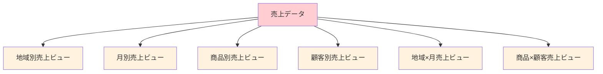
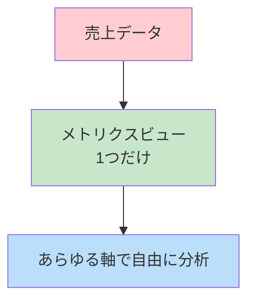
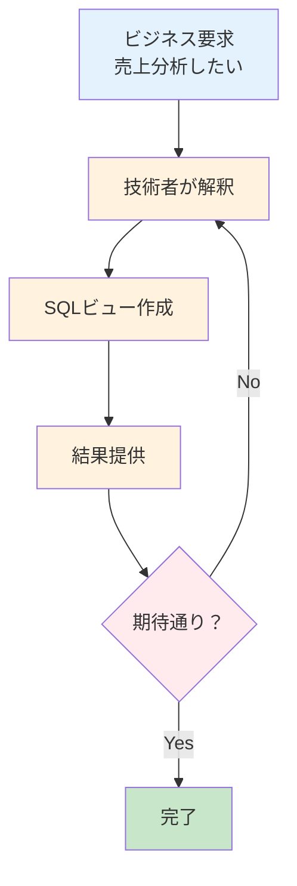
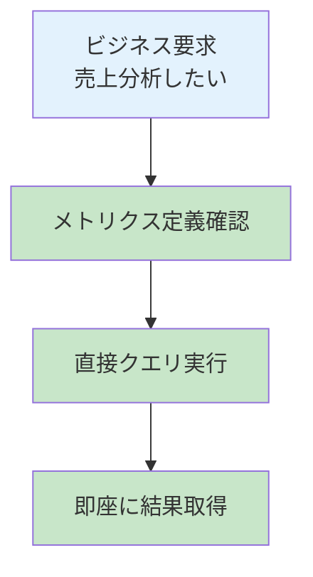
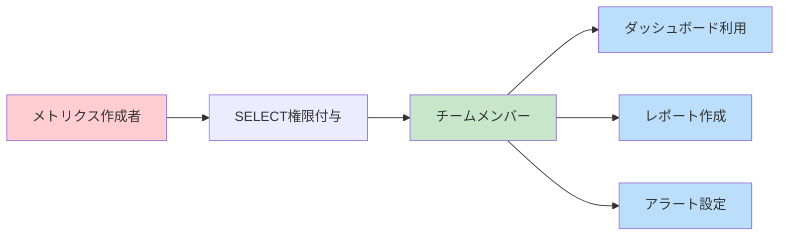

こちらのアップデートです。

https://docs.databricks.com/aws/ja/release-notes/product/2025/may#metric-views-are-in-public-preview

> **メトリクスビューのパブリックプレビュー**
> Unity Catalogのメトリクスビューは、一貫性があり、再利用可能で統治されたコアとなるビジネスメトリクスを定義、管理するための集中管理された手段を提供します。複雑なビジネスロジックを集中管理された定義に抽象化し、企業は一度キーとなるパフォーマンスインジケーターを定義すると、ダッシュボード、Genieスペース、アラートのようなレポーティングツールで一貫性を持って活用することができます。メトリクスビューを操作するには、プレビューチャネルのSQLウェアハウスかDatabricksランタイム16.4以降のコンピュート資源を使います。[Unity Catalog メトリクス ビュー](https://docs.databricks.com/aws/ja/metric-views/)をご覧ください。

もう少し噛み砕きます。気になるのは従来のビューとの違いです。

Databricksメトリクスビューとは、**複雑なビジネスロジックを一元的に定義し、組織全体で一貫して利用できる仕組み**です。現在パブリックプレビュー段階で、Unity Catalogに登録されるYAML形式で定義されます。

# メトリクスビューの構成要素

| 要素 | 説明 | 具体例 |
|------|------|---------|
| **ディメンション** | データを整理・フィルタリングするカテゴリ属性 | 製品名、顧客タイプ、地域 |
| **メジャー** | ビジネス活動を集計する値（SUM、AVGなど） | 売上合計、平均顧客単価 |
| **ソース** | データの元となるテーブル、ビュー、SQLクエリ | 注文テーブル、顧客マスタ |

## ディメンション(Dimension) :「どの軸で切り分けるか」

ディメンションはデータを分類・グループ化するためのカテゴリです。分析の「切り口」を提供します。

## メジャー(Measure) :「何を測るか」

メジャーは数値で表現される計測可能な指標です。ビジネスの成果や活動量を表します。


# YAML定義の構造

```yaml
version: 0.1
source: samples.tpch.orders
filter: o_orderdate > '1990-01-01'
dimensions:
  - name: Order Month
    expr: DATE_TRUNC('MONTH', o_orderdate)
  - name: Order Status
    expr: CASE WHEN o_orderstatus = 'O' then 'Open' END
measures:
  - name: Order Count
    expr: COUNT(1)
  - name: Total Revenue
    expr: SUM(o_totalprice)
```

# メリット、嬉しさ

## 組織レベルでのメリット

**1. 一貫性のあるメトリクス定義**
- 複数のチームが同じKPIを使用する際の定義ブレを防止
- ダッシュボード、レポート、アラート全体で統一された指標を実現

**2. 開発効率の劇的向上**
- 一度定義すれば、あらゆるツールで再利用可能
- 複雑な集計ロジックを何度も書く必要がなくなる

**3. データガバナンスの強化**
- Unity Catalogの権限モデルによる適切なアクセス制御
- メトリクスの変更履歴とバージョン管理

## 従来の標準ビューとの決定的な違い

**標準ビューの課題**
```sql
-- 標準ビューの例：地域別売上（固定的）
CREATE VIEW regional_sales AS
SELECT 
    region,
    SUM(revenue) as total_revenue,
    COUNT(DISTINCT customer_id) as unique_customers
FROM sales_data
GROUP BY region;

-- 問題：月別で見たい場合は新しいビューが必要
CREATE VIEW monthly_sales AS
SELECT 
    DATE_TRUNC('month', order_date) as month,
    SUM(revenue) as total_revenue,
    COUNT(DISTINCT customer_id) as unique_customers
FROM sales_data
GROUP BY DATE_TRUNC('month', order_date);
```

**メトリクスビューの革新性**

```yaml
# 一度定義すれば、あらゆる軸で分析可能
measures:
  - name: Total Revenue
    expr: SUM(revenue)
  - name: Unique Customers
    expr: COUNT(DISTINCT customer_id)
dimensions:
  - name: Region
    expr: region
  - name: Month
    expr: DATE_TRUNC('month', order_date)
```

```sql
-- 同じメトリクスビューで地域別も月別も自由に
SELECT region, MEASURE(Total Revenue) FROM sales_metrics GROUP BY region;
SELECT month, MEASURE(Total Revenue) FROM sales_metrics GROUP BY month;
-- さらに地域×月のクロス分析も可能
SELECT region, month, MEASURE(Total Revenue) FROM sales_metrics GROUP BY region, month;
```

**具体的な違いの比較表**

| 観点 | 標準ビュー | メトリクスビュー |
|------|------------|------------------|
| **定義方法** | 固定的なGROUP BY | ディメンション・メジャー分離定義 |
| **柔軟性** | 作成時に決めた軸のみ | 実行時に自由な軸組み合わせ |
| **ビュー数** | 分析軸ごとに複数必要 | 1つで全ての軸に対応 |
| **再集計安全性** | ❌ 比率計算で不正確になりがち | ✅ 常に正確な再計算 |
| **保守コスト** | 高（複数ビューの管理） | 低（単一定義の管理） |
| **学習コスト** | 中（SQL GROUP BY理解） | 低（MEASURE関数のみ） |

## メトリクスビューの嬉しさ

### 1つ定義で無限の分析軸

従来は「売上を見たい軸」ごとに別々のビューを作成する必要がありました：



**メトリクスビューなら：**




### データサイエンティストとビジネスユーザーの橋渡し

従来は「技術的な実装」と「ビジネス要求」の間にギャップがありました：



**メトリクスビューなら：**



# ウォークスルー

こちらの手順に従って作成、クエリーしてみます。

https://docs.databricks.com/aws/ja/metric-views/create

## メトリクスビューの作成

カタログエクスプローラにアクセスして、ソースとなるテーブルを開きます。左上の**作成 > メトリクスビュー**を選択します。


YAMLエディタが表示されます。この時点ではソースしか定義されていません。


以下のように書き換えます。ここでディメンションとメジャーを一元管理できるということですね。

```yaml
version: 0.1

source: samples.tpch.orders
filter: o_orderdate > '1990-01-01'

dimensions:
  - name: Order Month
    expr: DATE_TRUNC('MONTH', o_orderdate)

  - name: Order Status
    expr: CASE
      WHEN o_orderstatus = 'O' then 'Open'
      WHEN o_orderstatus = 'P' then 'Processing'
      WHEN o_orderstatus = 'F' then 'Fulfilled'
      END

  - name: Order Priority
    expr: SPLIT(o_orderpriority, '-')[1]

measures:
  - name: Order Count
    expr: COUNT(1)

  - name: Total Revenue
    expr: SUM(o_totalprice)

  - name: Total Revenue per Customer
    expr: SUM(o_totalprice) / COUNT(DISTINCT o_custkey)

  - name: Total Revenue for Open Orders
    expr: SUM(o_totalprice) FILTER (WHERE o_orderstatus='O')
```


保存するカタログとスキーマ、名称を指定します。


テーブルや関数のようにUnity Catalogで管理されます。ここのメジャーやメトリクスにコメントやタグも


## メトリクスの利用

SQLからアクセスしてみます。[MEASURE関数](https://docs.databricks.com/aws/ja/sql/language-manual/functions/measure)を使います。

```sql
SELECT
 `Order Month`,
 `Order Status`,
 MEASURE(`Order Count`),
 MEASURE(`Total Revenue`),
 MEASURE(`Total Revenue per Customer`)
FROM
 takaakiyayoi_catalog.metrics_view.oreders_metrics
GROUP BY ALL
ORDER BY 1 ASC
```

|Order Month|Order Status|measure(Order Count)|measure(Total Revenue)|measure(Total Revenue per Customer)|
|---|---|---|---|---|
|1992-01-01T00:00:00.000+00:00|Fulfilled|96647|14632465461.03|167978.801972586070|
|1992-02-01T00:00:00.000+00:00|Fulfilled|90518|13702881250.25|166837.705310289409|
|1992-03-01T00:00:00.000+00:00|Fulfilled|95930|14471982842.46|167016.535977611079|
|1992-04-01T00:00:00.000+00:00|Fulfilled|93774|14154839483.68|167022.696508236183|
|1992-05-01T00:00:00.000+00:00|Fulfilled|96001|14488605743.39|167179.435105175100|
|1992-06-01T00:00:00.000+00:00|Fulfilled|93497|14141698293.18|167062.792155607272|


## 権限管理と共有



# 注意点

現時点では以下の制限が存在します。

| 制限項目 | 詳細 | 対処法 |
|----------|------|---------|
| **リネージ未対応** | データの流れが追跡できない | 別途ドキュメント化が必要 |
| **Delta Sharing未対応** | 外部組織との共有不可 | 通常のビューを併用 |
| **クエリ時JOIN不可** | 実行時の動的結合は不可 | CTEを使用した前処理 |
| **SELECT * 不可** | 全カラム選択は不可 | 明示的なカラム指定が必要 |

# まとめ

Databricksメトリクスビューは、データ分析の世界に**一元管理と柔軟性**という新たな価値をもたらします。従来の標準ビューでは実現困難だった「一度定義して、どこでも使える」メトリクス管理により、組織のデータ活用レベルを大幅に向上させることができます。

### はじめてのDatabricks

[はじめてのDatabricks](https://qiita.com/taka_yayoi/items/8dc72d083edb879a5e5d)

### Databricks無料トライアル

[Databricks無料トライアル](https://databricks.com/jp/try-databricks)
