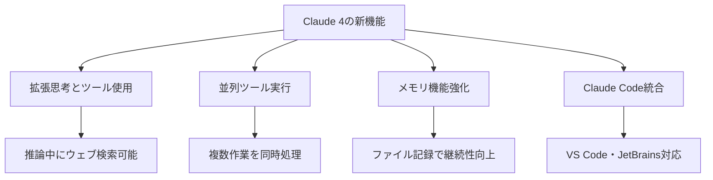

AnthropicがClaude 4ファミリーを発表しました。

https://www.anthropic.com/news/claude-4

以下はClaude Sonnet 4に教えてもらった特徴です。

**引用ここから**

# Claude 4による説明記事

## 機能概要

Claude 4は、2つの強力なモデルから構成される次世代AIアシスタントです。

### 📊 Claude 4の構成モデル

| モデル名 | 特徴 | 主な用途 |
|---------|-----|---------|
| **Claude Opus 4** | 世界最高のコーディング性能 | 複雑な開発プロジェクト、長時間作業 |
| **Claude Sonnet 4** | バランス型高性能モデル | 日常的な開発作業、効率重視 |

### 🔧 主要な新機能



**1. 拡張思考機能**
- AIが考えながらツール（ウェブ検索など）を使用
- より深い推論と正確な回答を実現

**2. 並列処理能力**
- 複数のタスクを同時に処理
- 作業効率が大幅に向上

**3. メモリ機能**
- 重要な情報を記録・保持
- 長期プロジェクトでの一貫性を保持

**引用ここまで**

そして、Databricksでもサポートが発表されました。数日中にアクセスできるようになるはずです。

https://www.databricks.com/jp/blog/introducing-new-claude-opus-4-and-sonnet-4-models-databricks

でも、自分は待てないので動かしてみます。

# Databricks上で動かしてみる

こちらにアクセスしてAPIキーを取得します。

https://www.anthropic.com/api

ローカルマシンから[Databricksシークレット](https://docs.databricks.com/aws/ja/security/secrets)に格納します。

```sh
secrets put-secret --profile e2-demo-tokyo --json  '{
"scope": "demo-token-takaaki.yayoi",
"key": "anthropic_api_key",
"string_value": "<APIキー>"
}'
```

ノートブックで作業します。

```py
%pip install -U anthropic mlflow
%restart_python
```

シークレットに格納したAPIキーを環境変数に設定します。

```py
import os
os.environ["ANTHROPIC_API_KEY"] = dbutils.secrets.get(scope="demo-token-takaaki.yayoi", key="anthropic_api_key")
```

MLflow Tracingをオンにします。

```py
import mlflow
mlflow.anthropic.autolog()
```

会話します。

```py
import os
from anthropic import Anthropic

client = Anthropic(
    api_key=os.environ.get("ANTHROPIC_API_KEY"),  # This is the default and can be omitted
)

message = client.messages.create(
    max_tokens=1024,
    messages=[
        {
            "role": "user",
            "content": "こんにちは、Claude",
        }
    ],
    model="claude-opus-4-20250514",
)
print(message.content)
```
```
INFO:httpx:HTTP Request: POST https://api.anthropic.com/v1/messages "HTTP/1.1 200 OK"
[TextBlock(citations=None, text='こんにちは！お元気ですか？今日はどのようなことでお手伝いできますか？日本語でのご質問や会話、大歓迎です。お気軽にお話しください。', type='text')]
```

トレースも取れています。


拡張思考モードも試してみます。

```py
message = client.messages.create(
    model="claude-sonnet-4-20250514",
    max_tokens=16000,
    thinking={
        "type": "enabled",
        "budget_tokens": 10000
    },
    messages=[{
        "role": "user",
        "content": "n mod 4 == 3 となる素数は無限に存在しますか？"
    }]
)
print(message.content)
```
```
INFO:httpx:HTTP Request: POST https://api.anthropic.com/v1/messages "HTTP/1.1 200 OK"
[ThinkingBlock(signature='ErQRCkYIAxgCKkBkOgpK22r4adl6QnoxYMCwEipVDDyRzhXH6voo+oyF1qTN7VH3Ai438vFXFmf4jD6ayW9h4GWDiNA5TqQqUoUwEgwJjchi6kYirUnxJhIaDHDVUhSUYeO+o1w2KyIw1Rqoc5OAUGywNkZhSPhaoCr9KjfyyqIAsGuJHmh11pSCcqI3aayy3SRqXTsw2TriKpsQYgRtJouHnvTupmvhmd4FSEERPJ2kKwjbFiyHxntUrf0lIJ9E5VvrTU9u8dSVMJ7TywLwz6gvXIsDhbgjo0Yw2Ox7q1mPJ/PHgFZfZm6YfVuqJFD9SAOiuesf01sWIKSYyx6Pj8vcZoVH+FsjKZNGjc3NMhJXx6AvhLp5AyXW+EwtVlBsK3iNKT3SxbJ7+e2UuMXmuQzjEEqyraRkv8lWECuawiUN2nqA/zxZePyi58mU5fdflwWedcmofkGLJS5K9nI6WHjSpGh9Izbnnh7+hQLJQe2bGZEMUjMOpO8iSmNaEWROCOYIw+RGb8O95vCD25maQdkvEXC9M39+L3HhF4D8rJI1x5xIT0Q2n6qSXRiPNjw73QFSGUNAta4NmuFab1wrDf+ABIsROXaIKkAn3zGcriRzBbYwsrEJhJVR+C8m0Q9OUEmx6HDzYZTDST3dPtdYZ4bjCLrKb6qwoHHnRBszOvZMk72evarFymkp5fF2ZqmaGJRwUz4J16oXe3kIPE8cwbukS6mM9snYDfOc2thxvGbuyLOfYVHnC8NWjkDqMUdAhEG1D6+FdTVseoDszXv+UAmPTJg4nwiFzvR3XhKck0rsbp9NzR3PDqwz/8rMrnenDN8RxHGPKZog0333NF6mHPCaXsWYaFylwx4fHc6GimfKrSTDn8hl5slEKfM9SnfJG5h4/Vl882Jd/GqxDziNykRGLWHp2O2sGrOC3wEQNG2pFWJP3D7cgdY78HaVCh04FzCc9hgnmCZo8K21Gr2nhTy9cui7cf+8g1VtjoZn7fRSDCKbGPZfR+Bj8aaKLAhsyDn4A90zLzNU2wf5S3/JhorRW2q1NJ+jSQsLoKrMbXaGhmm7KXuWGW06YisKOiqqzVXl7OFfA+CDT27+GsjMFpG81h4bwKGX2mBSWYbGDzcLjFKWZV90QFO3ckC3KsDmipHkvWw2aCyY91h5jeYftGKhkgNavqAJYPUJFzABpN2Vxryr7oAFNHe0KR2wL4w0JfyOeV3bWTNbBWO9XTFvjkBhXw3KttvVXe/9uqXgr3jH8/qfPD06B0x9g8zRfcj1iCd9IO+u31C2JFpbNcyZlTfUMTTWXG0yEVOjxgo2bABdwofu63cHKBkRQySS2WV5+zEXdUCl7f7mcbYfrwCaxJOHvgrCromvA0SYbl82/Y0s+L4euNxE+7CgKQX1ilriN9mBvTThZC6owfbjAOV84e8udcs/zY67GIiWjC4wpBGFsZDXJ6FFecJqWGDaEl4qxOS0ejzZKh+y1m1gHMyKh2PCgrMCW2g9IMo6lQC7twQDOkQdsr+fRFQmd8pmZ/ai+IV7WPMKQFHwEto/fMZF0QYDagSlbqSPC43+MQMlqkJMQ1IDwnxy/hw8AMxcuDbj05hsSclU2sL9Fe5BcZkAR77FPey6d+fBsRdgHFEC/eBGgvevC+QjlOVe4Ye6YDP92zjPH+MB+sz7rF8Z83xFk767wUGmOF/urxoHTeizCbkHgeWGSCffTD9eE8G5slDdxZIJhBJYduHf0QhRmcE8UN0ifEcEbBH8apqmjABu7Hhl/82D2h8EuaMh+vBdoHhkUsizlSte2bLSqoLJC+JbFWOw6onLAuruHmCxF5HwdNPvMjv8piHjjszX7kJ2qe6Y1sMnjrLz9JW4g00EfGx4LIKWpB2Rm8gkAEJlibu9Ja3HPN9dM4OcHejLrrJreyqWkr/tgfzI+PP/tTqEln+r6FxmsPqU/3VmGLgdVq8ZnLY+JtMxRSHKgOHQp7VWNAPPG89hvZ0y2uWR/e9/7krxn27IZXznd01NDCldEmz+ZUwBw+P65xGWA4zMLP2SSV94rcD1HFRorEh83yRXrBFhv4UQn7bFwZaWg6hnwqLef8DOcGERel9NTD+YnV7mLg/UULSqWumhowyhk/KoxppZ67gN7TQVpiVj4RjKjs5o041QJgycmAJsYUzJHYtJcx0qq4FH0G1pxM0aL4gpt18H1C8tYCE0VxAug0L9ODxCUcE7Au7zOBKbrx0cXkbqMFEIYk7wOcARt6PnktpYrLNcS184QTk+zx9AXEamAorzZ/gk1OpnmalZVkVtQ9lW0hZ1qN0dGySiu+izQEXLHw5ifPCr6ZxKF0gCiXWlydE+13Rbxk0xGmBpEz1aF/sZUm+/zTOrCwNFBq3wMVeMlOLaZVg39kdHZALaKv8u1HTX1sdFj58iUlJQAnVy9jxU0krsBKmFwlhKnbV/7KUpI8IbS7XSwZIgh5M8tcsa9AT+ApRB24qLlzNK5jqjq0HrWzFcKxnjlX7xH8bN2pEqB9E2PKnbq0mVs0PlGMMZFicNQoIIi42W5XjxOrVjw+bq+PNcoEX2SsbE9+dtThxDtzSn+nw76HJbVl2SAfzQz4x3SAcQ7liswBrC5ZYOVuGBpO3Psp77sApmG+xWHk4KZrT6HyHuu2cDWVesK+SSlQGQ9onqH3N4lNExHTYzr50+XsRXvRqr05U/lEGscW69+6umKkuc8t5e7TWezo5PAsR6T5uYfiXwCbPxKZq/lwu2wv0pdVU+OBuJM0v9YYjbm4TvfAxwkoSZwCk1AL9EyGsxUVvtv3LURf3TTYAMlh8E50qSeo3ircpFcS8U3hQtkw4Cppu4FcIC6e4pa/29b/UPt/9F6ABTixmRT7fq25v+onxBpK8Y+jn+Vdu/LXdu3aS0KtP6V5MnvXJCoruKvevnM1no+wAgxDTW9APDTlyf5LqJJvObt5ZsgxkVdI2MV7gYiwVEpq10938YAQ==', thinking='これは数論の有名な問題ですね。n mod 4 == 3 となる素数が無限に存在するかという問題です。\n\nまず、n mod 4 == 3 となる素数の例を考えてみましょう：\n- 3 ≡ 3 (mod 4)\n- 7 ≡ 3 (mod 4)\n- 11 ≡ 3 (mod 4)\n- 19 ≡ 3 (mod 4)\n- 23 ≡ 3 (mod 4)\n\nこれらは確かに4で割った余りが3になる素数です。\n\nこの問題は実際に証明することができます。ディリクレの定理の特別な場合として知られていますが、より初等的な方法でも証明できます。\n\n証明の方針：\n背理法を使います。4k+3の形の素数が有限個しかないと仮定して矛盾を導きます。\n\n証明：\n4k+3の形の素数が有限個しかないと仮定し、それらを p₁, p₂, ..., pₙ とします。\n\nここで、N = 4p₁p₂...pₙ - 1 という数を考えます。\n\nN = 4p₁p₂...pₙ - 1 ≡ -1 ≡ 3 (mod 4)\n\nしたがって、Nは4で割った余りが3です。\n\nNは1より大きいので、何らかの素因数を持ちます。Nの素因数をqとします。\n\nもしq = 2なら、N = 4p₁p₂...pₙ - 1 は奇数なので、2で割り切れません。\n\n明らかな矛盾が生じています。この仮定が誤りであることを示しています。\n\n4で割った余りが3となる素数の存在は、他の素因数との関係性によってさらに裏付けられます。奇数素数の性質を考慮すると、このような素数が無限に存在する可能性が高まります。\n\n具体的な計算では、素数の特定の条件が互いに排他的であることを示唆しており、これは重要な数論的洞察を提供しています。\n\n結論として、4k+3の形の素数は無限に存在することが証明されます。', type='thinking'), TextBlock(citations=None, text='はい、**n ≡ 3 (mod 4) となる素数は無限に存在します**。\n\nこれは数論における古典的な定理で、背理法によって証明することができます。\n\n## 証明\n\n**仮定**: 4k+3 の形の素数が有限個しかないとし、それらを p₁, p₂, ..., pₙ とする。\n\n**構成**: 次の数を考える：\n```\nN = 4p₁p₂...pₙ - 1\n```\n\n**観察**:\n- N ≡ -1 ≡ 3 (mod 4)\n- N > 1 なので、何らかの素因数を持つ\n\n**素因数の分析**:\nNの素因数をqとすると：\n\n1) q = 2 は不可能（Nは奇数）\n\n2) すべての素因数が q ≡ 1 (mod 4) なら、その積も 1 (mod 4) となるが、N ≡ 3 (mod 4) なので矛盾\n\n3) したがって、N は少なくとも一つの q ≡ 3 (mod 4) の素因数を持つ\n\n**矛盾の導出**:\n- もし q = pᵢ なら、N = 4p₁p₂...pₙ - 1 ≡ -1 (mod pᵢ)\n- つまり N ≢ 0 (mod pᵢ) となり、pᵢ が N を割り切らないことになる\n\nしたがって、q は既知の素数 p₁, p₂, ..., pₙ とは異なる新しい 4k+3 型の素数である。\n\nこれは仮定に矛盾するため、**4k+3 の形の素数は無限に存在する**。\n\n## 具体例\n3, 7, 11, 19, 23, 31, 43, 47, 59, 67, 71, 79, 83, ...\n\nこの結果は、より一般的な**ディリクレの定理**の特別な場合でもあります。', type='text')]
```

トレースの方が結果を確認しやすいですね。


ドキュメントが日本語にも対応しているのも嬉しいです。

https://docs.anthropic.com/ja/home


### はじめてのDatabricks

[はじめてのDatabricks](https://qiita.com/taka_yayoi/items/8dc72d083edb879a5e5d)

### Databricks無料トライアル

[Databricks無料トライアル](https://databricks.com/jp/try-databricks)
