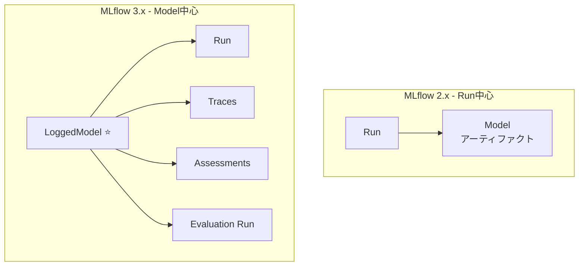
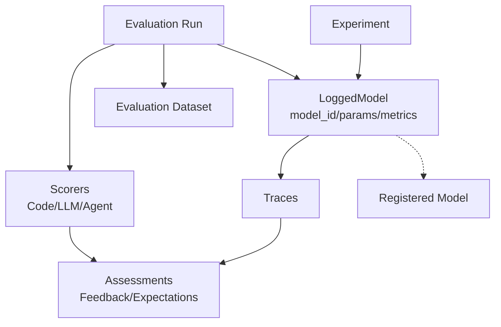

以前こちらの記事を書きました。

https://qiita.com/taka_yayoi/items/7e1481ad8a988eb54aeb

(Claudeの力を借りて)データモデルの観点でまとめました。アーティファクトにもしています。エクスペリメント、LoggedModel、トレースなどいろいろなエンティティの関係性を理解したいという意図です。

https://claude.ai/public/artifacts/b153e15f-5bdb-4703-be2c-a905d7655ee9


**MLflow 3の中核となるLoggedModelデータモデルを徹底解説。エクスペリメント、トレース、評価、スコアラーの関係性と、MLflow 2からの移行ガイドを含む包括的なガイド。**

MLflow 3は、生成AI開発のゲームチェンジャーです。従来のRun中心のアーキテクチャから**Model中心のアーキテクチャ**へと根本的に変革され、新しい**LoggedModel**エンティティがファーストクラスシチズンとして導入されました。

本記事では、MLflow 3のデータモデルを徹底的に解説し、Experiment、LoggedModel、Trace、Assessment、Scorer、Evaluation Runなどの主要エンティティとその関係性を明らかにします。さらに、MLflow 2からの移行ガイドも提供します。

## 目次

- [MLflow 3の概要](#mlflow-3の概要)
- [MLflow 3の新機能](#mlflow-3の新機能)
- [データモデルの全体像](#データモデルの全体像)
- [主要エンティティの詳細](#主要エンティティの詳細)
- [MLflow 2から3への移行](#mlflow-2から3への移行)
- [推奨ワークフロー](#推奨ワークフロー)
- [ベストプラクティス](#ベストプラクティス)
- [まとめ](#まとめ)

# MLflow 3の概要

**MLflow LoggedModel**は、MLflow 3で導入されたファーストクラスエンティティで、AIモデル、エージェント、GenAIアプリケーションを追跡・管理するための中核的な概念です。

## 主要な特徴

- ✅ **一意のmodel_id**でライフサイクル全体を通じて永続化
- ✅ **自動トレースリンク**による包括的な観測性
- ✅ **統合された評価**フレームワーク（Code-based、LLM Judge、Agent Judge）
- ✅ **Unity Catalogとの統合**によるエンタープライズガバナンス
- ✅ **GenAI特化の機能**（Prompt Engineering、Human Feedback等）

# MLflow 3の新機能

## 1. LoggedModel - ファーストクラスエンティティ 🆕

MLflow 3の最大の変更点は、**Run中心からModel中心**へのアーキテクチャ変更です。

### MLflow 2.x（Run中心）の課題

```
Run (run_id)
  ├── Model (artifact)
  ├── Parameters
  └── Metrics
```

- モデルはRunのアーティファクトとして保存
- モデルバージョン間の比較が困難
- Traceとモデルの関連付けが手動

### MLflow 3.x（Model中心）の利点

```
LoggedModel (model_id) ⭐
  ├── Run (run_id)
  ├── Traces (自動リンク)
  ├── Assessments (評価結果)
  └── Evaluation Runs
```

- LoggedModelが独立したエンティティ
- 一意のmodel_idで永続的に追跡
- Trace、評価結果、メトリクスが自動的にリンク
- バージョン間の比較が容易

## 2. 包括的なトレーシング 🔍

生成AIアプリケーションの複雑な実行フローを階層的に可視化します。

```python
import mlflow

# 1行でアプリケーション全体をインストゥルメント
mlflow.langchain.autolog()

@mlflow.trace(name="customer_support")
def answer_question(question):
    # トレースは実行ツリー全体を自動キャプチャ
    vectorstore = Chroma.from_documents(documents, embeddings)
    qa_chain = RetrievalQA.from_chain_type(
        llm=ChatOpenAI(temperature=0),
        retriever=vectorstore.as_retriever()
    )
    result = qa_chain({"query": question})
    return result
```

**主な機能:**
- LLM呼び出し、検索、ツール実行を含む全実行フローをキャプチャ
- レイテンシー、トークン使用量、コストの追跡
- LangChain、OpenAI、Anthropic等の自動インストゥルメンテーション
- 画像サポート付きの改善されたTrace UI

## 3. 生成AI評価フレームワーク 📊

LLMアプリケーションの品質を体系的に測定・改善する3種類のスコアラー。

### (1) コードベースのスコアラー

```python
from mlflow.genai.scorers import scorer

@scorer
def response_length(outputs: str) -> int:
    return len(outputs.split())

@scorer
def contains_citation(outputs: str) -> str:
    return "yes" if "[source]" in outputs else "no"
```

### (2) LLMジャッジスコアラー

```python
from mlflow.genai.scorers import (
    Correctness,
    RelevanceToQuery,
    Safety,
    Guidelines
)

scorers = [
    Correctness(),
    RelevanceToQuery(),
    Safety(),
    Guidelines(
        name="company_policy",
        guidelines="Response must follow company policy"
    )
]
```

### (3) Agent-as-a-Judge 🆕 (v3.4)

v3.4ではエージェントジャッジも。

https://mlflow.org/docs/3.4.0/genai/eval-monitor/scorers/llm-judge/agentic-overview/

```python
from mlflow.genai.judges import make_judge

performance_judge = make_judge(
    name="performance_analyzer",
    instructions="""
    Analyze the {{ trace }} for performance issues.
    Check for:
    - Operations taking longer than 2 seconds
    - Redundant API calls
    - Inefficient data processing
    Rate as: 'optimal', 'acceptable', 'needs_improvement'
    """,
    model="openai:/gpt-4"
)
```

## 4. その他の主要機能

- **Prompt Engineering & Optimization**: 評価フィードバックを使った自動プロンプト最適化
- **UI/UX改善**: 再設計されたExperiment Home View、Trace Table View
- **パフォーマンス**: FastAPI + Uvicornへの移行
- **OpenTelemetry統合**: Metricsエクスポートによる監視強化

# データモデルの全体像

## アーキテクチャ比較図



## エンティティ関係図



## データモデル階層構造

```
Experiment (エクスペリメント)
    └── LoggedModel (model_id) ⭐
            ├── Traces (トレース)
            │   ├── Spans (中間ステップ)
            │   └── Assessments (アセスメント)
            │       ├── Feedback (Scorerからの評価)
            │       └── Expectations (期待値)
            ├── Evaluation Runs (評価ラン)
            │   ├── Evaluation Dataset (評価データ)
            │   ├── Scorers (3種類)
            │   └── Generated Traces (生成されたトレース)
            └── Model Registry (モデルレジストリ)
                └── Model Versions (バージョン管理)
```

# 主要エンティティの詳細

## 1. Experiment（エクスペリメント）

各アプリケーションまたはユースケースのトップレベルコンテナ。

```python
import mlflow

# Experimentの作成
mlflow.set_experiment("my-genai-app")

# または明示的に作成
experiment = mlflow.create_experiment("my-genai-app")
```

**役割:**
- すべてのLoggedModel、Trace、評価結果を組織化
- プロジェクトやアプリケーションごとに1つのExperimentを推奨

## 2. LoggedModel（ログドモデル）🆕

MLflow 3の中核となるファーストクラスエンティティ。

**主要属性:**

| 属性 | 説明 |
|------|------|
| `model_id` | ⭐ 一意識別子（ライフサイクル全体で永続化） |
| `name` | モデル名（検索可能） |
| `model_type` | agent, model, application等 |
| `params` | パラメータ（alpha, temperature等） |
| `metrics` | メトリクス（accuracy, loss等） |
| `artifact_uri` | モデルアーティファクトの場所 |

**使用例:**

```python
# LoggedModelの作成
model_info = mlflow.sklearn.log_model(
    sk_model=model,
    name="my_classifier",  # artifact_pathではなくname
    params={"alpha": 0.5},
    input_example=train_x
)

# LoggedModelの取得
logged_model = mlflow.get_logged_model(model_info.model_id)
print(f"Model ID: {logged_model.model_id}")

# LoggedModelの検索
models = mlflow.search_logged_models(
    filter_string="params.alpha > 0.3",
    order_by=["metrics.accuracy DESC"]
)
```

## 3. Trace（トレース）

生成AIアプリケーションの1回の完全な実行ログ。

**含まれる情報:**
- 入力パラメータ
- 出力結果
- 中間ステップ（Span）
- レイテンシー、トークン使用量等のメトリクス

**自動トレースリンク:**

```python
# アクティブモデル設定で自動トレースリンク
mlflow.set_active_model(name="customer_support_agent")
mlflow.langchain.autolog()

# すべてのTraceが自動的にモデルにリンク
@mlflow.trace(name="qa_agent")
def answer_question(question):
    result = agent.invoke({"question": question})
    return result

# Traceの検索
traces = mlflow.search_traces(
    experiment_names=["my-experiment"],
    filter_string="attributes.status = 'OK'"
)
```

## 4. Assessment（アセスメント）

Traceに対する品質評価。2つのカテゴリに分類されます。

### Feedback（フィードバック）
- スコアラーによる自動評価の結果
- 人間による手動評価
- スコア、根拠、メタデータを含む

### Expectations（期待値）
- 正解データやグラウンドトゥルース
- オフライン評価での基準値

## 5. Scorer（スコアラー）🆕

Traceの品質を自動的に評価する関数。3種類のScorerが利用可能。

**比較表:**

| タイプ | 説明 | 例 | 用途 |
|--------|------|-----|------|
| コードベース | ヒューリスティックなロジック | response_length, format_check | シンプルなルールベース評価 |
| LLMジャッジ | LLMによる評価 | Correctness, Safety | セマンティックな品質評価 |
| Agent-as-a-Judge | ツールを使った深い分析 | make_judge with MCP tools | 複雑なトレース分析 |

## 6. Evaluation Dataset（評価データセット）

オフラインテスト用の厳選された入力セット。

```python
# 評価データセットの作成
dataset = mlflow.data.from_dict({
    "inputs": [
        {"question": "What is MLflow?"},
        {"question": "How do I log a model?"}
    ],
    "expectations": {
        "expected_outputs": [
            "MLflow is an open-source platform...",
            "To log a model, use mlflow.log_model()..."
        ]
    }
})

# Unity Catalogでのバージョン管理
mlflow.genai.datasets.create_dataset(
    uc_table_name="catalog.schema.eval_data"
)
```

## 7. Evaluation Run（評価ラン）

生成AIアプリの評価結果を整理・保存するMLflow Run。

**含まれる要素:**
- 評価データセットの各入力に対する1つのTrace
- Scorerから各Traceに付与されたFeedback
- すべての評価例の集約統計メトリクス
- 評価構成に関するメタデータ

```python
# 評価の実行
results = mlflow.genai.evaluate(
    data=test_dataset,
    predict_fn=my_app,
    scorers=[
        Correctness(),
        Safety(),
        RelevanceToQuery()
    ],
    model_id=logged_model.model_id
)

# 結果へのアクセス
print(f"Run ID: {results.run_id}")
print(f"Correctness: {results.metrics['correctness/mean']}")
```

## 8. Model Version（モデルバージョン）

Model Registryに登録されたモデルの各バージョン。

```python
# Model Registryへの登録
mlflow.register_model(
    model_uri=f"models:/{logged_model.model_id}",
    name="customer_support_agent"
)

# エイリアスの設定
client = mlflow.MlflowClient()
client.set_registered_model_alias(
    name="customer_support_agent",
    alias="champion",  # @champion
    version=2
)
```

**Unity Catalogとの統合:**
MLflow 3で作成されたモデルをUnity Catalogに登録すると、すべてのエクスペリメントとワークスペースにわたって、パラメータやメトリクスなどのデータを一元的に表示できます。

# MLflow 2から3への移行

## 主要なAPI変更

| 項目 | MLflow 2.x | MLflow 3.x | 変更理由 |
|------|-----------|-----------|----------|
| **モデルログ** | `artifact_path="model"` | `name="my_model"` | LoggedModelの名前ベース検索を可能に |
| **保存場所** | Run artifactsに保存 | Models artifacts locationに保存 | モデル中心のアーキテクチャ |
| **アクティブモデル** | ❌ なし | `set_active_model()` | 自動トレースリンクのため |
| **評価API** | `mlflow.evaluate()` | `mlflow.genai.evaluate()` | GenAI特化の評価フレームワーク |
| **モデル検索** | ❌ なし | `search_logged_models()` | メトリクス・パラメータベースの検索 |

## コード移行例

### 1. モデルのログ

**❌ MLflow 2.x**
```python
with mlflow.start_run():
    mlflow.sklearn.log_model(
        sk_model=model,
        artifact_path="model"  # 非推奨
    )
```

**✅ MLflow 3.x**
```python
with mlflow.start_run():
    mlflow.sklearn.log_model(
        sk_model=model,
        name="my_classifier"  # nameを使用
    )
```

### 2. アクティブモデルとトレーシング（新機能）

```python
# アクティブモデルを設定
mlflow.set_active_model(name="customer_support_agent")

# Autologgingを有効化
mlflow.langchain.autolog()

# すべてのTraceが自動的にモデルにリンク
response = agent.invoke({"question": "..."})
```

### 3. 評価の実行

**❌ MLflow 2.x**
```python
mlflow.evaluate(
    model=model_uri,
    data=test_data,
    targets="label",
    model_type="classifier"
)
```

**✅ MLflow 3.x**
```python
mlflow.genai.evaluate(
    data=test_dataset,
    predict_fn=my_app,
    scorers=[
        Correctness(),
        Safety()
    ],
    model_id=logged_model.model_id
)
```

## 破壊的変更（Breaking Changes）

⚠️ **削除された機能:**
- **MLflow Recipes（Pipelines）**: 完全削除
- **`custom_metrics`パラメータ**: 新しいカスタムメトリクスアプローチを使用
- **`higher_is_better`**: `greater_is_better`に統一
- **`code_path`, `requirements_file`, `inference_config`**: 各種パラメータの削除

## 移行のステップ

1. **MLflow 3.xをインストール**
   ```bash
   pip install --upgrade mlflow>=3.0.0
   ```

2. **artifact_pathをnameに変更**
   - すべての`log_model()`呼び出しを更新

3. **評価コードの更新**
   - GenAIアプリの場合は`mlflow.genai.evaluate()`を使用

4. **削除されたパラメータの削除**
   - `code_path`, `requirements_file`等を削除

5. **アクティブモデルパターンの採用**
   - トレースの自動リンクのため`set_active_model()`を使用

# 推奨ワークフロー

## 1. 開発フェーズ

```python
import mlflow

# Experimentの設定
mlflow.set_experiment("my-genai-app")

# モデルのログ（name指定）
with mlflow.start_run():
    model_info = mlflow.langchain.log_model(
        lc_model=agent,
        name="customer_support_v1",
        params={"temperature": 0.1, "max_tokens": 2000},
        input_example={"question": "How do I..."}
    )
    logged_model = mlflow.get_logged_model(model_info.model_id)

# アクティブモデルの設定
mlflow.set_active_model(name="customer_support_v1")

# Autologgingの有効化
mlflow.langchain.autolog()

# アプリケーション実行（Traceが自動リンク）
response = agent.invoke({"question": "..."})
```

## 2. 評価フェーズ

```python
# 評価データセットの準備
dataset = mlflow.data.from_dict({
    "inputs": [
        {"question": "What is MLflow?"},
        {"question": "How do I log a model?"}
    ],
    "expectations": {
        "expected_outputs": [
            "MLflow is an open-source platform...",
            "To log a model, use mlflow.log_model()..."
        ]
    }
})

# Scorersの定義
from mlflow.genai.scorers import Correctness, Safety

scorers = [
    Correctness(),
    Safety(),
    custom_scorer  # カスタムScorer
]

# 評価の実行
results = mlflow.genai.evaluate(
    data=dataset,
    predict_fn=agent,
    scorers=scorers,
    model_id=logged_model.model_id
)

# 結果の分析
print(f"Correctness: {results.metrics['correctness/mean']}")
print(f"Safety: {results.metrics['safety/mean']}")
```

## 3. 本番デプロイフェーズ

```python
# Model Registryへの登録
mlflow.register_model(
    model_uri=f"models:/{logged_model.model_id}",
    name="customer_support_agent"
)

# Unity Catalogでのバージョン管理
# エイリアスの設定
client = mlflow.MlflowClient()
client.set_registered_model_alias(
    name="customer_support_agent",
    alias="champion",
    version=2
)

# Model Servingへのデプロイ（Databricks環境）
# 本番環境での監視（Traceは引き続きLoggedModelにリンク）
```

# ベストプラクティス

## 1. LoggedModelの活用

- ✅ 必ず`name`パラメータを指定（検索可能にする）
- ✅ アクティブモデルパターンを使用（自動トレースリンク）
- ✅ `model_id`でライフサイクル全体を追跡
- ✅ `search_logged_models()`で効率的に検索

```python
# 良い例
mlflow.sklearn.log_model(
    sk_model=model,
    name="fraud_detector_v2",  # 説明的な名前
    params={"n_estimators": 100},
    input_example=X_train[:5]
)
```

## 2. トレーシングの最適化

- ✅ Autologgingを積極的に活用
- ✅ ビジネスコンテキストをTagsとして追加
- ✅ PII Maskingを設定（個人情報保護）
- ✅ OpenTelemetry Metricsでモニタリング

```python
mlflow.langchain.autolog()

@mlflow.trace(name="support_query")
def handle_query(question, customer_tier):
    result = agent.invoke({"question": question})
    
    # ビジネスコンテキストを追加
    mlflow.update_current_trace(
        tags={
            "customer_tier": customer_tier,
            "question_category": classify(question)
        }
    )
    return result
```

## 3. 評価戦略

- ✅ 複数のScorerを組み合わせて使用
- ✅ 評価データセットを継続的に更新
- ✅ Human Feedbackを収集・統合
- ✅ Prompt Optimizationで自動改善

```python
# 包括的な評価
scorers = [
    # 品質
    Correctness(),
    RelevanceToQuery(),
    
    # 安全性
    Safety(),
    
    # カスタム
    Guidelines(
        name="brand_voice",
        guidelines="Response matches brand voice"
    ),
    
    # コードベース
    response_length,
    contains_citation
]
```

## 4. Unity Catalogとの統合

- ✅ すべてのモデルをUnity Catalogに登録
- ✅ エイリアス（@champion、@candidate）を活用
- ✅ ワークスペース間でメトリクスを共有
- ✅ ガバナンスとアクセス制御を適切に設定

# まとめ

## MLflow 3の重要なポイント

1. **LoggedModel中心のアーキテクチャ**: Run中心からModel中心への移行により、モデルのライフサイクル全体を一貫して追跡

2. **包括的なトレーシング**: GenAIアプリケーションの複雑な実行フローを階層的に可視化し、デバッグと最適化を容易に

3. **統合された評価**: Code-based、LLM Judge、Agent Judgeの3種類のScorerで、あらゆる評価ニーズに対応

4. **自動化の強化**: Autologging、自動トレースリンク、プロンプト最適化により、開発者の生産性が向上

5. **Unity Catalogとの統合**: 企業レベルのガバナンスとバージョン管理で、本番環境での安心感を提供

## データモデル階層（再掲）

```
Experiment
    └── LoggedModel (model_id) ⭐ NEW
            ├── Traces ⭐ Enhanced
            │   └── Assessments ⭐ NEW
            │       ├── Feedback (from Scorers)
            │       └── Expectations (from Dataset)
            ├── Evaluation Runs ⭐ Enhanced
            │   ├── Evaluation Dataset
            │   ├── Scorers (3 types) ⭐ NEW
            │   └── Generated Traces
            └── Model Registry
                └── Model Versions (Unity Catalog)
```

## 次のステップ

1. **MLflow 3.xをインストールして試す**
   ```bash
   pip install --upgrade mlflow>=3.0.0
   ```

2. **既存のMLflow 2.xコードを移行**
   - `artifact_path` → `name`に変更
   - 評価APIを`mlflow.genai.evaluate()`に更新

3. **LoggedModelパターンを採用**
   - アクティブモデルの設定
   - 自動トレースリンクの活用

4. **GenAI評価フレームワークを活用**
   - 複数のScorerを組み合わせて使用
   - 継続的な評価・改善サイクルを確立

5. **Unity Catalogとの統合を設定**
   - モデルの一元管理
   - エイリアスによるバージョン管理

# 参考リンク

- [MLflow 3 公式ドキュメント](https://mlflow.org/docs/latest/genai/mlflow-3/)
- [MLflow 3 発表ブログ](https://mlflow.org/blog/mlflow-3-launch)
- [Breaking Changes ガイド](https://mlflow.org/docs/latest/genai/mlflow-3/breaking-changes/)
- [Databricks MLflow ドキュメント](https://docs.databricks.com/aws/ja/mlflow3/genai/)
- [MLflow GitHub リポジトリ](https://github.com/mlflow/mlflow)

### はじめてのDatabricks

[はじめてのDatabricks](https://qiita.com/taka_yayoi/items/8dc72d083edb879a5e5d)

### Databricks無料トライアル

[Databricks無料トライアル](https://databricks.com/jp/try-databricks)
