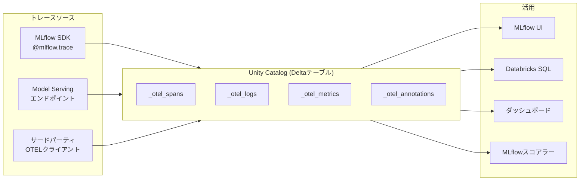

# はじめに

MLflow 3のトレーシングは、GenAIアプリやエージェントの入出力、中間ステップ、メタデータを記録する強力な可観測性機能です。従来、トレースはMLflowエクスペリメント単位でMLflowコントロールプレーンに保存されていましたが、新たにUnity Catalog(UC)のDeltaテーブルにOpenTelemetry(OTEL)形式で保存できるようになりました(ベータ版)。

https://docs.databricks.com/aws/ja/mlflow3/genai/tracing/trace-unity-catalog

この記事では、最新のAPI(MLflow 3.11.0)を使ってトレースをUCに保存する方法を解説します。

# 従来のトレース保存との違い

従来方式とUC保存方式の違いを整理します。

| 項目 | 従来方式(MLflowコントロールプレーン) | UC保存方式(OTEL形式) |
|---|---|---|
| 保存先 | MLflowサービス内 | Unity CatalogのDeltaテーブル |
| アクセス制御 | エクスペリメントレベルのACL | UCスキーマ/テーブル権限 |
| トレースID形式 | `tr-<UUID>` | URI形式(外部システムとの互換性向上) |
| 保存容量 | 制限あり | 無制限(Deltaテーブル) |
| SQLクエリ | 不可 | Databricks SQLウェアハウスで直接クエリ可能 |
| 外部ツール連携 | MLflow固有 | OTEL準拠のサードパーティクライアントから書き込み可能 |
| ビジネスデータとの結合 | 困難 | SQLで結合・分析可能 |
| ガバナンス | エクスペリメント単位 | UCのカラムマスキング、行フィルタリング等が適用可能 |

# アーキテクチャ



トレースがDeltaテーブルとして保存されることで、レイクハウス上の他のデータと同様にETLパイプライン、ダッシュボード、Genieによる自然言語分析、PII管理等のガバナンスを適用できるようになります。

# 前提条件

- Unity Catalog対応のワークスペース
- ワークスペースのPreviewsページで「OpenTelemetry on Databricks」が有効化済み


- CAN USE権限を持つDatabricks SQLウェアハウス
- MLflow 3.11.0以降
- サポートリージョン: `us-east-1`, `us-east-2`, `us-west-2`, `ca-central-1`, `ap-southeast-1`, `ap-southeast-2`, `ap-northeast-1`(東京), `ap-northeast-2`, `ap-south-1`, `eu-central-1`, `eu-west-1`, `eu-west-2`, `sa-east-1`

# セットアップ

## ライブラリのインストール

```python
%pip install "mlflow[databricks]>=3.11.0" --upgrade --force-reinstall
dbutils.library.restartPython()
```

## UCトレース場所を使用してエクスペリメントを作成

最新のAPIでは`mlflow.set_experiment`の`trace_location`パラメータで、エクスペリメント作成時にUCトレース場所を直接バインドします。従来の`set_experiment_trace_location`は不要になりました。

```python
import os
import mlflow
from mlflow.entities.trace_location import UnityCatalog

mlflow.set_tracking_uri("databricks")
os.environ["MLFLOW_TRACING_SQL_WAREHOUSE_ID"] = "<SQL_WAREHOUSE_ID>"

catalog_name = "<UC_CATALOG_NAME>"
schema_name = "<UC_SCHEMA_NAME>"
table_prefix = "<UC_TABLE_PREFIX>"
experiment_name = "/Users/<your_email>/uc_trace_demo"

# スキーマの作成(存在しない場合)
spark.sql(f"CREATE CATALOG IF NOT EXISTS {catalog_name}")
spark.sql(f"CREATE SCHEMA IF NOT EXISTS {catalog_name}.{schema_name}")

# mlflow.set_experimentはupsert操作
experiment = mlflow.set_experiment(
    experiment_name=experiment_name,
    trace_location=UnityCatalog(
        catalog_name=catalog_name,
        schema_name=schema_name,
        table_prefix=table_prefix,
    ),
)
print(f"Experiment ID: {experiment.experiment_id}")
print(f"OTELスパンテーブル: {experiment.trace_location.full_otel_spans_table_name}")
```

:::note warn
**注意**: エクスペリメントをUCトレース場所にバインドすると、別のUCトレース場所に再割り当てすることはできません。ただし、複数のエクスペリメントが同じUCトレース場所を共有できます。
:::

## テーブルの確認

セットアップコードを実行すると、スキーマ内に4つのテーブルが自動作成されます。

- `<table_prefix>_otel_annotations`
- `<table_prefix>_otel_logs`
- `<table_prefix>_otel_metrics`
- `<table_prefix>_otel_spans`

```python
display(spark.sql(f"SHOW TABLES IN {catalog_name}.{schema_name}"))
```


ここでは、2つのビューが含まれています。

# トレースの記録

## シンプルな関数のトレース

`@mlflow.trace`デコレータでトレースを記録します。

```python
@mlflow.trace
def add(x, y):
    return x + y

@mlflow.trace
def multiply(x, y):
    return x * y

@mlflow.trace
def calculate(x, y):
    """加算と乗算を行い、結果を返す"""
    sum_result = add(x, y)
    mul_result = multiply(x, y)
    return {"sum": sum_result, "product": mul_result}

result = calculate(3, 5)
print(f"結果: {result}")
```


:::note info
**注意:** トレースをUnity Catalogに保存した場合、ノートブックのセル出力にインラインのトレースビューが表示されません。トレースの確認はMLflowエクスペリメントUIのTracesタブから行ってください。
:::

ちなみに、エクスペリメントには**概要**タブも追加されていました。


## LLMコールのトレース

Foundation Model APIを使用したLLMコールをトレースします。

```python
from mlflow.deployments import get_deploy_client

client = get_deploy_client("databricks")

@mlflow.trace(span_type="CHAIN")
def ask_llm(question: str) -> str:
    """LLMに質問を送り、回答を得る"""
    response = client.predict(
        endpoint="databricks-claude-sonnet-4-6",
        inputs={
            "messages": [
                {"role": "system", "content": "あなたは親切なアシスタントです。簡潔に回答してください。"},
                {"role": "user", "content": question},
            ],
            "max_tokens": 256,
        },
    )
    return response["choices"][0]["message"]["content"]

answer = ask_llm("Databricksにおけるunity catalogの主な利点を3つ教えてください。")
print(answer)
```


## RAGパイプラインのトレース

検索 → コンテキスト構築 → LLM生成の典型的なRAGフローをトレースします。

```python
@mlflow.trace(span_type="RETRIEVER")
def retrieve_documents(query: str) -> list:
    """ダミーのドキュメント検索"""
    docs = [
        {"content": "Unity CatalogはデータとAI資産の統合ガバナンスを提供します。", "score": 0.95},
        {"content": "Delta Lakeはオープンソースのストレージフレームワークです。", "score": 0.82},
        {"content": "MLflowはMLライフサイクル管理のためのプラットフォームです。", "score": 0.78},
    ]
    return docs

@mlflow.trace(span_type="PARSER")
def build_context(documents: list) -> str:
    """検索結果からコンテキストを構築"""
    return "\n".join([doc["content"] for doc in documents])

@mlflow.trace(span_type="CHAIN")
def rag_pipeline(question: str) -> str:
    """RAGパイプライン全体"""
    docs = retrieve_documents(question)
    context = build_context(docs)

    prompt = f"""以下のコンテキストに基づいて質問に回答してください。

コンテキスト:
{context}

質問: {question}
"""
    response = client.predict(
        endpoint="databricks-claude-sonnet-4-6",
        inputs={
            "messages": [{"role": "user", "content": prompt}],
            "max_tokens": 512,
        },
    )
    return response["choices"][0]["message"]["content"]

answer = rag_pipeline("Databricksのデータガバナンス機能について教えてください。")
print(answer)
```


# トレースの検索

## Python SDKによる検索

`mlflow.search_traces()`の`locations`パラメータでUCトレース場所を指定します(従来の`experiment_ids`は非推奨)。

```python
traces_df = mlflow.search_traces(
    locations=[f"{catalog_name}.{schema_name}.{table_prefix}"],
)
# Arrow変換エラーを回避するため、object型の列を文字列に変換
for col in traces_df.columns:
    if traces_df[col].dtype == "object":
        traces_df[col] = traces_df[col].astype(str)
display(traces_df)
```

## SQLによる直接クエリ

UCのDeltaテーブルに保存されているため、SQLで直接クエリできます。これが従来方式にはなかった大きなメリットです。

```sql
SELECT
  trace_id,
  name,
  start_time_unix_nano,
  end_time_unix_nano,
  (end_time_unix_nano - start_time_unix_nano) / 1e6 AS duration_ms,
  status.code AS status_code
FROM <catalog>.<schema>.<table_prefix>_otel_spans
ORDER BY start_time_unix_nano DESC
LIMIT 20
```


# 本番運用モニタリングの有効化

UCに保存されたトレースに対して[本番運用モニタリング](https://docs.databricks.com/aws/ja/mlflow3/genai/eval-monitor/production-monitoring)を使用する場合は、エクスペリメントにSQLウェアハウスIDを設定します。

```python
from mlflow.tracing import set_databricks_monitoring_sql_warehouse_id

set_databricks_monitoring_sql_warehouse_id(
    sql_warehouse_id=sql_warehouse_id,
    experiment_id=experiment.experiment_id,
)
```

:::note info
**注意**: この設定は、エクスペリメントにMLflowスコアラーを登録して初めて意味を持ちます。スコアラーを登録すると、モニタリングジョブが本番トレースに対してスコアラークエリを自動実行し、品質評価を継続的に行います。スコアラーを使用しない段階ではこのステップは不要で
:::

# 制限事項

- トレースデータの取り込みは、ワークスペースあたり毎秒200トレース、テーブルあたり毎秒100MBに制限
- UCトレース保存時、ノートブックのセル出力にインラインのトレースビューが表示されない場合がある。トレースの確認はMLflowエクスペリメントUIのTracesタブから行う
- エクスペリメントはエクスペリメント作成時にのみUCトレース場所にバインド可能(後から再割り当て不可)
- 2TBを超えるトレースデータではUIパフォーマンスが低下する可能性あり
- 個別トレースの削除はUI/APIからはできず、SQLでテーブルから直接削除が必要
- MLflow MCPサーバーはUCに保存されたトレースとのやり取りをサポートしていない
- Knowledge AssistantおよびSupervisor Agentではサポートされていない

# まとめ

MLflowトレースをUnity Catalogに保存することで、トレースデータがレイクハウスのファーストクラスのデータになります。従来のMLflowコントロールプレーンへの保存と比較して、UCのガバナンス、SQL分析、ビジネスデータとの結合、スケーラブルなストレージなど、エンタープライズ運用に求められる機能が利用可能になります。

# 参考リンク

- [MLflowトレースをUnity Catalogに保存する](https://docs.databricks.com/aws/ja/mlflow3/genai/tracing/trace-unity-catalog)
- [MLflow Databricks SQLを使用してMLflowトレースをクエリする](https://docs.databricks.com/aws/ja/mlflow3/genai/tracing/observe-with-traces/query-dbsql)

### はじめてのDatabricks

[はじめてのDatabricks](https://qiita.com/taka_yayoi/items/8dc72d083edb879a5e5d)

### Databricks無料トライアル

[Databricks無料トライアル](https://databricks.com/jp/try-databricks)
