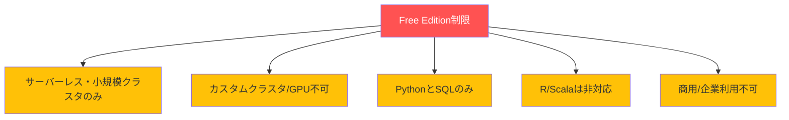
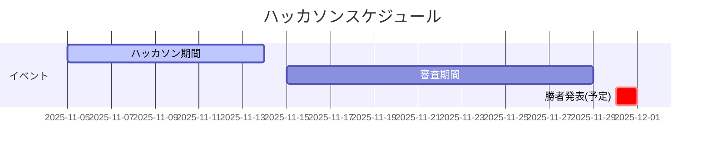

こちらは、Databricksが2025年11月5日から14日まで開催する無料のハッカソンイベントです。Databricks Free Editionを使用して、データパイプライン、機械学習モデル、AIアプリケーション、ダッシュボードなどを自由に作成し、5分間のデモ動画をLinkedInに投稿することで参加できます。優勝者には最大1,000ドルの賞金が授与され、全参加者にも賞品が用意されています。無料アカウントで誰でも参加でき、実践的なデータエンジニアリングとAI開発のスキルを身につける絶好の機会となっています。

https://www.databricks.com/resources/free-edition-hackathon

# はじめに

DatabricksがFree Edition(無料版)を使った**バーチャルハッカソン**を開催しています!なんと**全参加者に賞金のチャンス**があり、1位は$1,000のVisa ギフトカードがもらえます。

期間は**2025年11月5日〜14日**。自分のデータセットやサンプルデータを使って、5分のデモ動画を作成してLinkedInに投稿するだけです。

# 賞金について

全参加者に賞金が授与されるチャンスがあり、以下の賞金が用意されています:

- **1位**: $1,000 USD バーチャルVisaギフトカード
- **2位**: $500 USD バーチャルVisaギフトカード  
- **3位**: $250 USD バーチャルVisaギフトカード

勝者には11月30日頃に通知され、賞金の受け取り方法が記載されたメールが送信されます。

# 参加方法

## ステップ1: アカウント作成と準備

1. [Databricks Free Edition](https://www.databricks.com/signup/free-edition?provider=DB_FREE_TIER&l=ja-JP)にサインアップ
2. [Free Editionのドキュメント](https://docs.databricks.com/aws/ja/getting-started/free-edition)で基本を学習

## ステップ2: データセットの選択

サンプルデータセット例(Kaggleより):
- [Uber乗車データ](https://www.kaggle.com/datasets/yashdevladdha/uber-ride-analytics-dashboard)
- [Netflixムービーデータ](https://www.kaggle.com/datasets/rohitgrewal/netflix-data)
- [プレミアリーグ統計](https://www.kaggle.com/datasets/mohamadsallah5/english-premier-league-stats20212024)
- [中古車販売データ](https://www.kaggle.com/datasets/msnbehdani/mock-dataset-of-second-hand-car-sales)

もちろん、[Kaggle](https://www.kaggle.com/datasets)で自分の好きなデータセットを探すこともできます!

## ステップ3: プロジェクト開発

5つのカテゴリから選択可能です。

# 🎨 プロジェクトアイデア5選

1. AIアプリケーション
    - 基盤モデル実験
    - AIエージェント構築
    - モデル評価
1. データサイエンス/ML
    - MLモデル構築
    - リアルタイム共同作業
    - 結果の公開
1. データ探索/分析
    - SQLクエリ実行
    - データ可視化
    - 実データ分析
1. ダッシュボード
    - AI/BI Genie活用
    - 自然言語プロンプト
    - インタラクティブ可視化
1. データパイプライン
    - Lakeflow使用
    - ETLワークフロー
    - サーバーレス処理

## 1. AIアプリケーションとエージェント
データの準備・処理、基盤モデルの実験、AIシステムのデプロイとテスト、モデル評価まで、すべてをコラボレーティブなノートブックワークスペース内で実行します。

## 2. データサイエンスと機械学習プロジェクト
共有ノートブックでリアルタイムコラボレーション、MLモデルの構築、結果の公開を行います。

## 3. データ探索と分析
実際のデータセットをインポート、SQLクエリを実行、結果を可視化し、実データ分析の実践的な経験を構築します。

## 4. インタラクティブダッシュボード
AI/BI Genieなどのツールと自然言語プロンプトを使用して、ダッシュボードと可視化をインタラクティブに作成します。

## 5. データパイプライン
Lakeflowなどのサーバーレスツールを使用して、ETL(抽出、変換、ロード)ワークフロー用のデータパイプラインを設計、取り込み、変換、オーケストレーションを行います。

# Free Editionの制限事項

事前に知っておくべき制限:

- サーバーレスの小規模コンピュートクラスタのみ(カスタムクラスタやGPUは使用不可)
- Python と SQL のみサポート(R や Scala は非対応)
- 商用・企業利用は不可
- 詳細は[Free Editionの制限事項](https://docs.databricks.com/aws/ja/getting-started/free-edition-limitations)を参照

# 提出要件

応募には以下が必要です:

1. Free Editionで構築したプロジェクト
2. プロジェクトの機能を説明するテキスト
3. LinkedInやRedditの投稿リンク
4. 5分のデモ動画へのリンク

# 審査員

- **Reynold Xin** - Databricks共同創業者、チーフアーキテクト
- **Franco Patano** - プリンシパルソリューションアーキテクト
- **Holly Smith** - スタッフデベロッパーアドボケート
- **Will Valori** - シニアプロダクトマネージャー

# 困ったときは

[Databricks Community](https://community.databricks.com/)に参加して質問できます。提出期間中はDatabricksのスタッフが[グループ](https://community.databricks.com/t5/databricks-free-trial-help/bd-p/Databricks-Express-Setup)でサポートしています。

# Databricks Assistantでコーディング支援

Free Editionには**Databricks Assistant**が含まれており、ノートブック内で直接コーディング支援を受けられます:

- コード提案
- コードの説明
- エラーのデバッグサポート

AIペアプログラマーと一緒に開発できる感覚です!

# 重要な日程

- **ハッカソン期間**: 2025年11月5日〜14日
- **勝者通知**: 2025年11月30日頃

# まとめ

Databricks Free Edition Hackathonは、以下のような方に最適です:

- Databricksを無料で試してみたい  
- データエンジニアリング/分析スキルを実践で磨きたい  
- ポートフォリオに追加できるプロジェクトを作りたい  
- 賞金を獲得したい!  

期間は11月14日まで。今すぐ[サインアップ](https://www.databricks.com/signup/free-edition?provider=DB_FREE_TIER&l=ja-JP)して、あなたのアイデアを形にしましょう!

参加前に必ず[公式ルール](https://www.databricks.com/sites/default/files/2025-10/free-edition-hackathon-official-rules-doc.pdf)を確認してください。

**参考リンク:**
- [ハッカソン公式ページ](https://www.databricks.com/resources/free-edition-hackathon)
- [Free Editionサインアップ](https://www.databricks.com/signup/free-edition?provider=DB_FREE_TIER&l=ja-JP)
- [Free Editionドキュメント](https://docs.databricks.com/aws/ja/getting-started/free-edition)
- [Databricks Community](https://community.databricks.com/)

### はじめてのDatabricks

[はじめてのDatabricks](https://qiita.com/taka_yayoi/items/8dc72d083edb879a5e5d)

### Databricks無料トライアル

[Databricks無料トライアル](https://databricks.com/jp/try-databricks)
