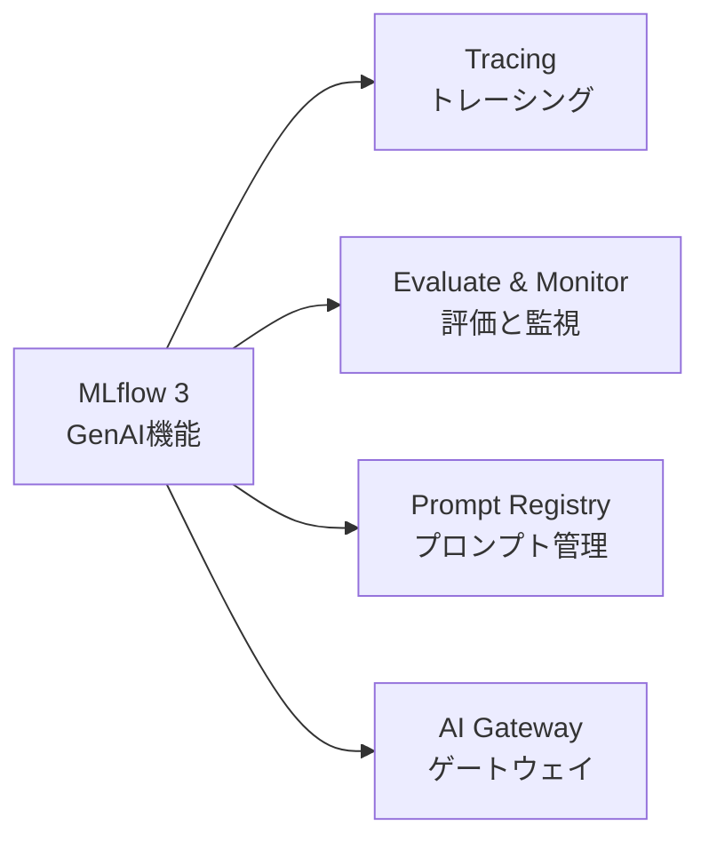

# はじめに

2026年4月20日、[『MLflowで実践するLLMOps――生成AIアプリケーションの実験管理と品質保証』](https://gihyo.jp/book/2026/978-4-297-15573-5)(技術評論社・エンジニア選書)を出版しました。Databricks Japanの同僚4名との共著で、私が企画と全体の取りまとめ、各章の執筆を担当しています。

https://gihyo.jp/book/2026/978-4-297-15573-5

おかげさまで4月の電子書籍ランキングでは6位デビューを果たすことができました。日本ではLLMOpsとMLflowを正面から扱った専門書はこれが初めて、ということになるそうです。

この記事では、なぜこの本を書いたのか、執筆の過程で何に苦しんだのか、そして何より「AIエージェントが当たり前になりつつある今このタイミングで運用観点の本を出せたこと」にどんな意味を感じているのかを書き残しておきたいと思います。同じように技術書の執筆を考えている人、そしてLLMアプリケーションの品質に頭を悩ませている実践者の方に、何かしら届くものがあれば幸いです。

# きっかけは積み重ねてきたQiita記事だった

そもそもの始まりは、自分が[Qiita](https://qiita.com/taka_yayoi)で書き続けていたLLMOps関連の記事でした。MLflowを使った実験管理や評価の話を、一本また一本と地道に投稿してきたところ、技術評論社の編集の方の目に留まり、書籍化のお声がけをいただいたのです。特定の一本がきっかけというより、長く続けてきた発信の蓄積そのものが評価された、という感覚に近いです。

正直に言うと、最初から「日本初のLLMOps×MLflow本を書くぞ」と狙っていたわけではありません。日々の検証や業務で得た知見を記事にしていただけで、それが結果として一冊の本になり、振り返ってみたら国内に同種の専門書がまだなかった、というのが実際のところです。狙って一番乗りになったのではなく、必要だと思って書き続けていたら、たまたまそこが空白地帯だった。そういう順番でした。

このことは、技術書を書きたいと考えている人へのささやかな示唆かもしれません。最初から「本を書く」と気負わなくても、自分が必要だと感じたことをアウトプットし続けていれば、その積み重ねが思わぬ形で評価されることがある、ということです。

# MLflow開発者たちとの共著という幸運

この本は私一人で書いたものではありません。共著者には、MLflowのテックリードとして可観測性・評価機能の設計をリードするエンジニア、MLflow本体やAIエージェントフレームワークDSPyの開発者、2019年からのコントリビューターで現在はメンテナーを務めるエンジニアといった、OSSの最前線に立つDatabricks Japanの仲間たちが加わってくれました。

ツールを日々作っている当事者が書き手にいるというのは、振り返るととても恵まれた体制でした。「なぜこの機能はこう設計されているのか」という背景を、設計した本人の言葉で確かめながら書ける。これは普通の執筆ではなかなか得られない贅沢で、本書の解説に厚みを与えてくれたと思っています。一方で、5人で一冊を作るということは、表記も粒度も自然には揃いません。ここが次の苦労につながっていきます。

# MLflowのバージョンアップに振り回された執筆過程

執筆で一番手を焼いたのは、MLflowそのものの進化の速さでした。

本書は[MLflow 3が打ち出した4つのGenAI機能](https://docs.databricks.com/aws/ja/mlflow3/genai/)を軸に構成しています。

問題は、これらのAPIが執筆期間中に凄まじい勢いで変化し続けたことです。書いた内容が次のリリースで古くなる、ということが何度も起きました。なかでも記憶に残っているのは、入稿直前のタイミングでバージョンアップが入り、画面が変わってしまってスクリーンショットを撮り直したことです。締切が目前に迫るなか、UIが変わるたびに本文・コード・図版の整合性を取り直す作業は、地味ですが相当こたえました。

ここから得た教訓のひとつは、**動くサンプルコードを正とすること**でした。本文中のコードとリポジトリのコードに食い違いが生じたとき、最終的に信頼できるのは「実際に動くコード」です。本書には[コンパニオンリポジトリ](https://github.com/takaaki-yayoi/mlflow_llmops)を用意していて、読者が手元で実行した結果と本の説明が一致するように整備を続けています。

もうひとつの教訓は、**用語の統一は早めにルール化しておくべきだった**ということです。執筆がある程度進んでから表記ルールを固めたために、全章にわたって手戻りが発生しました。「スコアラー」「LLMジャッジ」といった訳語の方針、製品名は英語のまま残すのか日本語化するのか——こうした判断を後回しにすると、終盤になって全体を見直すはめになります。

それから、出典の検証も妥協できないポイントでした。執筆を効率化するうえで生成AIの助けも借りていますが、もっともらしい統計値が出典をたどれないケースがありました。市場規模を示すような数字は、検証できないものは載せない、という方針で臨みました。事実に基づかない権威づけは、技術書では百害あって一利なしだと考えています。

# 出版の喜びと、ITエンジニア冥利

生成AIの勃興はもちろんのこと、AIエージェントの開発も猛烈な勢いで進んでいます。そんな状況のなかで、測定・評価・是正という運用の重要性が十分に重視されているとは、正直なところ思えませんでした。

だからこそ、LLMOpsのガイドになりうるかもしれない本を、このタイミングで世に出せたことには、ITエンジニアとしてこれ以上ない喜びを感じています。新しいものを作る熱気のなかで、ともすれば後回しにされがちな「ちゃんと動かし続けるための技術」を、一冊にまとめて手渡せた。エンジニアとして仕事をしてきて、これほど冥利に尽きる経験はそうありません。

# なぜ今、LLMOpsなのか

ここが、この記事で一番伝えたいことです。発売前の[紹介記事](https://qiita.com/taka_yayoi/items/05f16a5bf5661cc2de02)では「作るのは簡単だが、本番で動かし続けるのは難しい」という話を書きましたが、ここではもう一歩踏み込んで、AIエージェントの文脈で考えてみたいと思います。

いま注目が集まっているのは、もっぱら「エージェントをどう作るか」です。自律的に判断し、ツールを呼び、タスクを連鎖させていくエージェントは確かに強力で、作ること自体に大きな魅力があります。

しかし、エージェントならではのメリットは、同時に複雑性をもたらします。複数のステップが連鎖し、判断が自律的に下されるほど、「期待したとおりに動かない」ケースは増えていくはずです。どこで品質が劣化したのか、なぜその出力になったのか——作るだけでは、この問いに答えられません。

私が憂いているのは、この計測・評価・是正のループを確立しないまま、エージェントが本番にデプロイされていく状況です。これは非常にリスクが高い。

このループがあって初めて、エージェントは「動いているように見える」状態から「品質が担保されている」状態へと進めます。トレーシングで何が起きたかを可視化し、評価で品質を定量化し、その結果をもとに是正する。そしてまた計測する。地味ですが、これなしに自律的なシステムを運用するのは、計器のない飛行機を飛ばすようなものだと思っています。

エージェントを作ることに価値がないと言いたいのではありません。作ることと、作ったものを責任を持って運用し続けることは、両輪だということです。後者の足場がないまま前者だけが突き進む——いまの空気には、その危うさを感じます。

だからこそ、このタイミングでLLMOpsの本を出版できたことに、かつてないほどの喜びを感じているのです。

# 本書で扱ったこと

本書は、MLflow 3のGenAI機能(Tracing / Evaluate & Monitor / Prompt Registry / AI Gateway)を軸に、環境構築から可観測性、評価、プロンプトエンジニアリング、サービング、監視、事例、エンタープライズ(Databricks)での活用までを一気通貫で扱っています。機能の紹介ではなく、「計測・評価・是正のループを実際にどう回すか」という運用の視点で全体を構成したつもりです。

章構成や想定読者などの詳しい中身は、発売前に書いた[紹介記事](https://qiita.com/taka_yayoi/items/05f16a5bf5661cc2de02)にまとめています。書籍そのものの情報は技術評論社の[書籍ページ](https://gihyo.jp/book/2026/978-4-297-15573-5)を、コードはすべて[コンパニオンリポジトリ](https://github.com/takaaki-yayoi/mlflow_llmops)に置いていますので、そちらをご覧ください。本書の説明と手元での実行結果が一致するように、リポジトリの整備はいまも続けています。

# おわりに

一冊の本を書くというのは、自分がその分野で何を理解しているかを、他者に伝わる言葉に変換し続ける長い作業でした。MLflowの激しい進化に振り回され、用語の手戻りに苦しみ、入稿直前にスクショを撮り直しながら、それでも書き切れたのは、この内容がいま必要だという確信があったからだと思います。

AIエージェントの時代に、運用の足場を示す一冊を残せたこと。これが、自分にとっての何よりの収穫でした。本書がLLMアプリケーションの品質に向き合うみなさんの一助になれば、これに勝る喜びはありません。

感想やご指摘は、X([@taka_aki](https://x.com/taka_aki))や[リポジトリのIssue](https://github.com/takaaki-yayoi/mlflow_llmops/issues)でお待ちしています。
