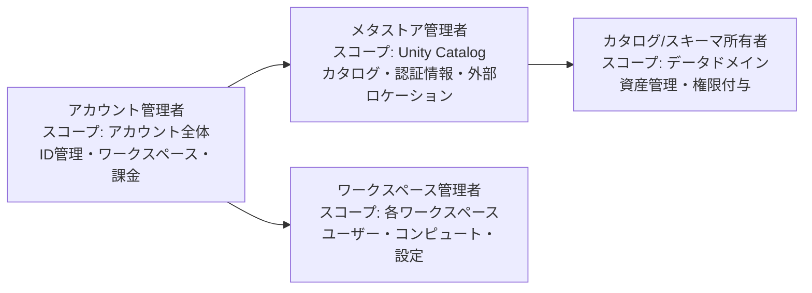
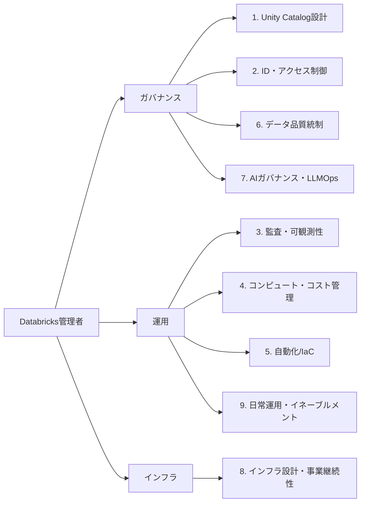
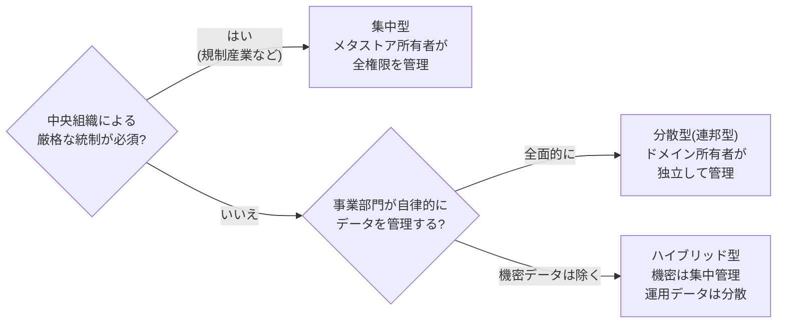
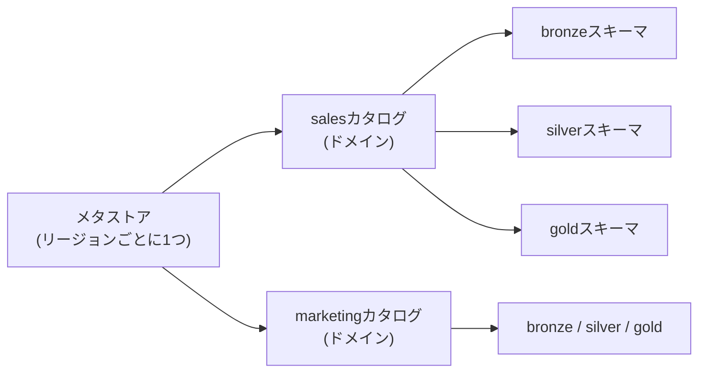
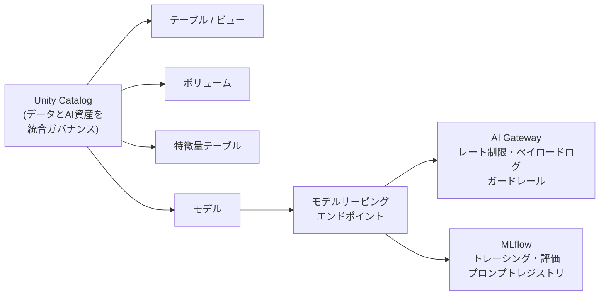

# はじめに

Databricksを組織で活用する上で、プラットフォーム管理者(アドミニストレーター)の役割はここ数年で大きく変化しています。かつてはワークスペースのユーザー追加やクラスターの管理が中心でしたが、Unity Catalogの普及によってガバナンスの中核を担うようになり、さらに生成AI・エージェントの本番活用が進んだことで、AI資産のガバナンスまでが守備範囲に入ってきました。

本記事では、[Databricks Well-Architectedフレームワークのデータ・AIガバナンスのベストプラクティス](https://docs.databricks.com/aws/ja/lakehouse-architecture/data-governance/best-practices)、[Databricks本番運用計画ガイド](https://docs.databricks.com/aws/ja/lakehouse-architecture/deployment-guide/)、Databricks Academyの管理者向けラーニングパスをベースに、2026年時点でDatabricks管理者に求められるスキルを整理します。

# 管理者ロールの整理

一口に「管理者」と言っても、Databricksでは責務のレベルが分かれています。まずはこの階層を理解することが出発点です。

| ロール | 主な責務 |
|---|---|
| アカウント管理者 | アカウントコンソールでのワークスペース管理、メタストア作成、ID管理(SCIM/SSO)、課金・利用状況の把握 |
| メタストア管理者 | Unity Catalogメタストアの所有、カタログ・ストレージ認証情報・外部ロケーションの管理 |
| ワークスペース管理者 | ワークスペース内のユーザー・グループ、コンピュート、ワークスペース設定の管理 |
| カタログ/スキーマ所有者 | 分散型ガバナンスにおけるドメイン単位のデータ資産管理と権限付与 |

小規模な組織ではこれらを一人が兼務することも多いですが、スキルを棚卸しする際にはどのレイヤーの話かを意識すると整理しやすくなります。詳細は[Databricks管理の概要](https://docs.databricks.com/aws/ja/admin/)を参照してください。

# 全体像: 本番運用計画の10フェーズ

管理者スキルの全体像を掴むには、[Databricks本番運用計画ガイド](https://docs.databricks.com/aws/ja/lakehouse-architecture/deployment-guide/)が最適です。エンタープライズでの本番導入を10のフェーズに分解しており、そのまま管理者に求められるスキルの目次として読むことができます。

| フェーズ | 内容 |
|---|---|
| 1. アカウント | アカウント管理とID管理戦略の設定 |
| 2. ワークスペース戦略 | 組織構造・セキュリティ要件・運用ニーズに基づくワークスペースアーキテクチャの計画 |
| 3. Unity Catalog | メタストアパターン、カタログ構造、アクセス制御モデルの設計 |
| 4. ネットワーク | コンピュートとデータプレーン接続を支えるネットワーク設計 |
| 5. ストレージ | ワークスペースストレージとデータストレージの戦略設計 |
| 6. Delta Lake | Delta Lakeのストレージアーキテクチャとデータ編成パターン |
| 7. IaC | リソースのデプロイと管理を自動化するIaC戦略 |
| 8. コンピュート | パフォーマンス・コスト・セキュリティを最適化するコンピュート戦略 |
| 9. 可観測性 | 運用エクセレンスのためのモニタリング戦略 |
| 10. HA/DR | 高可用性と災害復旧による事業継続性の確保 |

新規導入なら順次、既存環境なら該当フェーズを反復的に見直す使い方が想定されています。

ただし注意したいのは、この10フェーズはあくまで「導入・設計時」の計画ガイドだという点です。管理者の仕事にはもう1つの時間軸、つまり日常の運用サイクルがあります。権限申請への対応とアクセス権の定期棚卸し、コストの監視と是正、インシデント対応、プラットフォームのリリース追随、そしてユーザーへの教育・イネーブルメントといった観点は、10フェーズでは可観測性(フェーズ9)が一部カバーするのみで、明示的には扱われていません。

本記事では、このフェーズ構成に加えて、次に紹介するWell-Architectedフレームワークと運用期の観点も踏まえて、管理者に求められるスキルを9つの領域に再編しました。

# スキル領域の全体像

9つのスキル領域を、ガバナンス・運用・インフラの3つの軸で整理すると次のようになります。各領域の詳細は後半で順に説明します。

# 全体像: Well-Architectedフレームワークの7つの柱

10フェーズが「いつ・何を設計するか」の時間軸だとすると、[Well-Architectedフレームワーク](https://docs.databricks.com/aws/ja/lakehouse-architecture/well-architected)の7つの柱は「何を満たすべきか」の品質軸です。管理者としては、各柱の原則とベストプラクティスを押さえておくことで、個別の設定作業を設計判断に昇華させることができます。各柱と、先ほどの9つのスキル領域との対応は次の通りです。

| 柱 | どんな考え方か / 主な内容 | 関連するスキル領域 |
|---|---|---|
| [データとAIのガバナンス](https://docs.databricks.com/aws/ja/lakehouse-architecture/data-governance/) ([ベストプラクティス](https://docs.databricks.com/aws/ja/lakehouse-architecture/data-governance/best-practices)) | データとAIが価値を生みビジネス戦略を支えるよう統制する考え方。ガバナンスモデル、カタログ設計、リネージ、データ品質、AI資産の管理 | Unity Catalog設計、監査・可観測性、データ品質統制、AIガバナンス・LLMOps |
| [相互運用性とユーザビリティ](https://docs.databricks.com/aws/ja/lakehouse-architecture/interoperability-and-usability/) ([ベストプラクティス](https://docs.databricks.com/aws/ja/lakehouse-architecture/interoperability-and-usability/best-practices)) | 他システムとのつながりやすさ(相互運用性)と利用者にとっての使いやすさ(ユーザビリティ)。統合標準、オープンフォーマット、データ共有、セルフサービス | Unity Catalog設計、日常運用・イネーブルメント |
| [オペレーショナルエクセレンス](https://docs.databricks.com/aws/ja/lakehouse-architecture/operational-excellence/) ([ベストプラクティス](https://docs.databricks.com/aws/ja/lakehouse-architecture/operational-excellence/best-practices)) | 運用の卓越性。運用プロセスを標準化・自動化して安定稼働を保つ考え方。ビルド/リリースの最適化、デプロイ自動化、容量・クォータ管理、モニタリング | 監査・可観測性、コンピュート・コスト管理、自動化/IaC、日常運用・イネーブルメント |
| [セキュリティ、コンプライアンス、プライバシー](https://docs.databricks.com/aws/ja/lakehouse-architecture/security-compliance-and-privacy/) ([ベストプラクティス](https://docs.databricks.com/aws/ja/lakehouse-architecture/security-compliance-and-privacy/best-practices)) | データと資産を脅威から守り法令・規制に適合させる考え方。ID管理、データ保護、ネットワーク、セキュリティモニタリング | ID・アクセス制御、監査・可観測性、インフラ設計・事業継続性 |
| [信頼性](https://docs.databricks.com/aws/ja/lakehouse-architecture/reliability/) ([ベストプラクティス](https://docs.databricks.com/aws/ja/lakehouse-architecture/reliability/best-practices)) | 障害から回復し機能し続けるシステムの能力。ACIDトランザクション(Delta Lake)、ジョブの自動再試行とタイムアウト、DRのテスト | データ品質統制、インフラ設計・事業継続性 |
| [パフォーマンス効率](https://docs.databricks.com/aws/ja/lakehouse-architecture/performance-efficiency/) ([ベストプラクティス](https://docs.databricks.com/aws/ja/lakehouse-architecture/performance-efficiency/best-practices)) | 負荷の変化に適応するシステムの能力。クラスターサイジング、サーバレス、予測的最適化、クエリ・ジョブのパフォーマンス監視 | コンピュート・コスト管理 |
| [コスト最適化](https://docs.databricks.com/aws/ja/lakehouse-architecture/cost-optimization/) ([ベストプラクティス](https://docs.databricks.com/aws/ja/lakehouse-architecture/cost-optimization/best-practices)) | 提供する価値を最大化するようコストを管理する考え方。コスト効率の高いリソース選択、動的スケーリング、タグ付けによるコスト帰属(チャージバック)、コスト監視 | コンピュート・コスト管理 |

特にオペレーショナルエクセレンスのベストプラクティスは、専任のDatabricks運用チームの設置、SCM/CI/CDの標準化、環境分離戦略、容量とクォータの管理、モニタリング体制の確立と、管理者の日常業務に直結する内容が多いので一読をおすすめします。

# スキル領域1: Unity Catalog設計とガバナンスモデル

2026年の管理者スキルの中心はUnity Catalogの設計力です。単に権限を付与できるだけでなく、組織構造をカタログ構造に翻訳できることが求められます。

**ガバナンスモデルの選択**

- 集中型: メタストア所有者が全オブジェクトの所有権と権限管理を担う。強い中央IT組織と厳格なコンプライアンス要件を持つ組織向け
- 分散型(連邦型): カタログをデータドメインとし、ドメイン所有者が独立してガバナンスを管理。自律的な事業部門を持つ大規模組織向け
- ハイブリッド型: 機密データは集中管理、運用データは連邦型。多くの企業に最適とされる構成

**カタログ・スキーマ構造の設計**

- ドメインベースのカタログ(sales、marketing、financeなど)が推奨
- 環境ベース(dev/staging/prod)やデータライフサイクルベースのパターンとの使い分け
- メダリオンアーキテクチャに対応したスキーマ設計(sales.bronze_transactionsのような命名)
- リージョンごとに1メタストアの原則、マルチクラウド時のメタストア分離

必要な知識としては、[Unity Catalogのベストプラクティス](https://docs.databricks.com/aws/ja/data-governance/unity-catalog/best-practices)、命名規則、所有権パターン、MANAGE権限の委譲設計が挙げられます。

# スキル領域2: ID・アクセス制御

最小権限の原則に基づくアクセス制御の設計・運用スキルです。

- SCIMプロビジョニングとSSO(IdP連携)によるID管理の自動化
- ユーザー個人ではなくグループへの権限付与を徹底する運用設計
- Unity Catalogの権限モデル(セキュリティ保護可能なオブジェクト、所有者、権限の継承)の理解
- [行フィルターと列マスク](https://docs.databricks.com/aws/ja/data-governance/unity-catalog/filters-and-masks)によるきめ細かなアクセス制御
- サービスプリンシパルの管理と、人間のユーザーとの使い分け

セキュリティ観点の詳細は[セキュリティ、コンプライアンス、プライバシーのベストプラクティス](https://docs.databricks.com/aws/ja/lakehouse-architecture/security-compliance-and-privacy/best-practices)にまとまっています。

# スキル領域3: 監査・コンプライアンス・可観測性

ガバナンスは設計して終わりではなく、継続的な監視が必要です。本番運用計画ではフェーズ9(可観測性)として独立して扱われている領域でもあります。

- [監査ログ](https://docs.databricks.com/aws/ja/admin/account-settings/audit-logs)の構成(ワークスペースレベル/アカウントレベル)と、必要に応じた詳細監査ログの有効化
- [システムテーブル](https://docs.databricks.com/aws/ja/admin/system-tables/)(system.access、system.billingなど)を使った利用状況・アクセスの分析
- データリネージを活用した影響分析、変更管理、コンプライアンス対応(GDPR、個人情報保護法など)
- データ共有([OpenSharing、旧Delta Sharing](https://docs.databricks.com/aws/ja/delta-sharing/))イベントの監査。2026年6月にDelta Sharingから発展する形で、AIモデルやエージェントスキルの共有にも対応したLinux Foundationホストのオープンプロトコルになっています
- ジョブ・パイプラインの実行状況やSLAのモニタリング、[アラート](https://docs.databricks.com/aws/ja/sql/user/alerts)設計(Webhookによるインシデント管理システム連携を含む)
- [データ品質モニタリング](https://docs.databricks.com/aws/ja/data-governance/unity-catalog/data-quality-monitoring)や[推論テーブル](https://docs.databricks.com/aws/ja/ai-gateway/inference-tables-serving-endpoints)など、プラットフォームネイティブの監視機能の使い分け

システムテーブルはSQLで分析できるため、AI/BIダッシュボードやGenieスペースと組み合わせて「管理者自身が使う監視基盤」を構築するスキルも実務では重宝します。

# スキル領域4: コンピュートとコストの管理

FinOps的な視点は近年ますます重要になっています。

- クラスターポリシーによるコンピュート構成の標準化とコスト統制
- サーバーレスコンピュート(SQLウェアハウス、ジョブ、ノートブック)の特性理解と使い分けの指針策定
- system.billing.usageを使ったDBU消費の可視化、部門別のコスト配賦(タグ設計)
- 予算アラートの設定と異常検知
- 容量とクォータの管理: [Databricksのリソース制限](https://docs.databricks.com/aws/ja/resources/limits)とクラウド側のクォータ(VMインスタンス数など)を把握したキャパシティプランニング(需要予測に基づく容量計画)
- パフォーマンスとコストの両立: [予測的最適化](https://docs.databricks.com/aws/ja/optimizations/predictive-optimization)によるテーブルメンテナンスの自動化や、クエリプロファイルを使ったボトルネック分析

# スキル領域5: 自動化とInfrastructure as Code

手作業での管理はスケールしません。Databricks Academyの管理者コースでも自動化は主要トピックになっています。

- [Databricks CLI](https://docs.databricks.com/aws/ja/dev-tools/cli/)とSDKによる管理タスクの自動化
- [Terraform](https://docs.databricks.com/aws/ja/dev-tools/terraform/)によるワークスペース、Unity Catalogオブジェクト、権限のコード管理
- [宣言型自動化バンドル(Declarative Automation Bundles、旧Databricks Asset Bundles)](https://docs.databricks.com/aws/ja/dev-tools/bundles/)によるデプロイの標準化。2026年に改称されましたが、bundleコマンドや既存の設定はそのまま利用できます
- Gitフォルダーを起点とした[CI/CD](https://docs.databricks.com/aws/ja/dev-tools/ci-cd)プロセスの標準化と、ブループリント(テンプレート)の整備による組織展開
- 新規ワークスペースやカタログのプロビジョニングをテンプレート化する設計力

# スキル領域6: データ品質の統制

管理者がデータ品質を直接作り込むわけではありませんが、品質基準を組織に定着させる仕組み作りは管理者の仕事です。

- 正確性、完全性、一貫性、適時性、信頼性といったデータ品質基準の文書化と展開
- Lakeflow Spark宣言型パイプラインの[期待値(expectations)](https://docs.databricks.com/aws/ja/ldp/expectations)を使った品質制約の標準パターン整備
- テーブル・カラムへのコメントとタグの付与ルール策定(AI生成コメントの活用とレビュー体制を含む)
- カタログエクスプローラーを前提としたデータディスカバリーの促進

# スキル領域7: AIガバナンスとLLMOps

2026年の管理者スキルとして最も差がつく領域です。「高品質のデータがなければAIはあり得ず、データガバナンスがなければ高品質のデータは持てない」という原則の通り、データとAIのガバナンスは一体で考える必要があります。

- Unity Catalog上のモデル管理(アクセス制御、監査、モデルリネージ、エイリアスによるデプロイ)
- 特徴量テーブルのガバナンス
- [AI Gateway](https://docs.databricks.com/aws/ja/ai-gateway/)による外部モデル・エンドポイントの統制(レート制限、ペイロードログ、ガードレール)

さらに、生成AIアプリケーションが本番稼働する組織では、統制だけでなく品質保証のサイクルを回すLLMOpsの理解が不可欠になっています。MLflow 3の4本柱で言えば以下の通りです。

- トレーシング: エージェントやRAGの実行過程を記録し、監査・デバッグ・コスト分析の基盤にする
- 評価とモニタリング: LLM-as-a-Judgeなどによるオフライン評価と本番モニタリングの継続的な運用
- プロンプトレジストリ: プロンプトのバージョン管理と変更統制
- AI Gateway: 前述の通り、エンドポイントレベルでのガバナンス

管理者の視点では、これらを「開発チーム任せ」にせず、トレースの保存先(Unity Catalog)、評価結果の管理、プロンプト変更の承認フローといった形でガバナンスに組み込む設計力が問われます。この領域を体系的に学ぶには、拙共著『[MLflowで実践するLLMOps――生成AIアプリケーションの実験管理と品質保証](https://gihyo.jp/book/2026/978-4-297-15573-5)』(技術評論社)がまさにこの4本柱の構成で解説していますので、あわせて参考にしてください。

従来の「プラットフォーム管理者」と「MLOpsエンジニア」の境界領域ですが、アクセス制御と監査という観点では管理者の守備範囲に入ってきています。

# スキル領域8: インフラ設計と事業継続性

エンタープライズの本番展開では、クラウドアーキテクトと協働してインフラレイヤーを設計するスキルも求められます。本番運用計画のフェーズ2、4、5、10に対応する領域です。

- ワークスペース戦略: 組織構造・セキュリティ要件に基づくワークスペース分割(単一/複数、環境分離、リージョン展開)の設計
- ネットワーク: カスタマーマネージドVPC、CIDR設計、Private Linkなどのデータプレーン接続の理解
- ストレージ: マネージドストレージの階層設計、外部ロケーションとの使い分け、カスタマーマネージドキー
- HA/DR: 事業継続性要件の整理と、メタストア・データ・ジョブの復旧戦略の策定

これらはクラウド側の知識(AWS/Azure/GCP)との掛け算になる領域で、Databricks Academyでもクラウド別のPlatform Architectパスとして扱われています。すべてを管理者一人で担うのではなく、要件をクラウドチームと翻訳し合えるレベルの理解が現実的な目標です。

# スキル領域9: 日常運用とイネーブルメント

前述の通り、本番運用計画の10フェーズは設計・構築の観点が中心で、日常運用の観点は明示的にカバーされていません。しかし実際の管理者の稼働時間の多くを占めるのはこちらです。

- 権限申請・払い出しのワークフロー設計と、アクセス権の定期棚卸し
- セルフサービス化: 環境プロビジョニング、SSOによるユーザー同期、データアクセスの申請承認を自動化し、人手の介在を最小化する設計(相互運用性とユーザビリティの柱で推奨されているアプローチ)
- インシデント対応: 障害切り分け(Databricks側/クラウド側/自組織側)、ステータスページの活用、サポートケースの起票と情報整理
- リリース追随: プラットフォームの更新(プレビュー機能、非推奨化、挙動変更)をキャッチアップし、影響を評価して利用者に展開する
- ユーザー教育・イネーブルメント(利用者が自走できるよう定着・活用を支援する活動): オンボーディング資料の整備、ベストプラクティスの社内展開、活用度の低いチームへの伴走

特にリリース追随とイネーブルメントは、プラットフォームの進化が速いDatabricksでは管理者の価値を大きく左右します。ドキュメントやリリースノートの定点観測に加えて、コミュニティやイベントから情報を得る習慣も含めてスキルと捉えるのが良いと思います。

# スキルマップまとめ

| スキル領域 | 主な要素 | 重要度の変化 |
|---|---|---|
| Unity Catalog設計 | ガバナンスモデル、カタログ構造、メタストア設計 | 中心スキルとして定着 |
| ID・アクセス制御 | SCIM/SSO、グループ設計、行フィルター/列マスク | 継続して必須 |
| 監査・コンプライアンス・可観測性 | 監査ログ、システムテーブル、リネージ、モニタリング | 上昇中 |
| コンピュート・コスト管理 | クラスターポリシー、サーバーレス、FinOps | 上昇中 |
| 自動化/IaC | CLI、SDK、Terraform、宣言型自動化バンドル | 必須化 |
| データ品質統制 | 品質基準、期待値、メタデータ整備 | 継続して重要 |
| AIガバナンス・LLMOps | モデル管理、AI Gateway、トレーシング、評価、プロンプト管理 | 新規かつ急上昇 |
| インフラ設計・事業継続性 | ワークスペース戦略、ネットワーク、ストレージ、HA/DR | エンタープライズで必須 |
| 日常運用・イネーブルメント | 権限申請運用、インシデント対応、リリース追随、教育 | 継続して重要(10フェーズ外) |

# 学習リソース

Databricks Academyには管理者向けの体系的なラーニングパスが用意されています。

- [Get Started with Databricks Platform Administration](https://www.databricks.com/training/catalog/get-started-with-databricks-platform-administration-1509): ワークスペースの概要、Unity Catalogのガバナンス原則、メタストアとコンピュートの管理、アクセス制御を5モジュールで学ぶ入門コース
- [Databricks Platform Administration Fundamentals](https://www.databricks.com/training/catalog/databricks-platform-administration-fundamentals-1230): アーキテクチャ、セキュリティモデル、管理者ロール、クラウドリソース管理に加え、SDK/CLI/Terraformによる自動化までカバー(日本語対応)
- [Databricks Platform Administrator Accreditation](https://www.databricks.com/learn/certification/platform-administrator-accreditation): 管理者ラーニングパスの最終試験。合格するとバッジが取得できます

あわせて、ドキュメントでは以下の2つが体系的な学習の軸になります。

- [Databricks本番運用計画](https://docs.databricks.com/aws/ja/lakehouse-architecture/deployment-guide/): アカウント設定からHA/DRまでの10フェーズで、エンタープライズ展開の設計判断を整理したガイド
- [Well-Architectedフレームワーク](https://docs.databricks.com/aws/ja/lakehouse-architecture/well-architected): 前述の7つの柱ごとに原則とベストプラクティスがまとまっています。管理者としてはまずデータとAIのガバナンス、オペレーショナルエクセレンス、セキュリティ・コンプライアンス・プライバシー、コスト最適化の4本から読むのがおすすめです

# おわりに

Databricks管理者の役割は「ワークスペースの番人」から「データとAIのガバナンスアーキテクト」へと進化しています。特にUnity Catalogの設計力、IaCによる自動化、そしてAIガバナンスとLLMOpsは、2026年時点でキャッチアップしておきたい領域です。組織でのスキル定義や育成計画の参考になれば幸いです。

### はじめてのDatabricks

[はじめてのDatabricks](https://qiita.com/taka_yayoi/items/8dc72d083edb879a5e5d)

### Databricks無料トライアル

[Databricks無料トライアル](https://databricks.com/jp/try-databricks)
