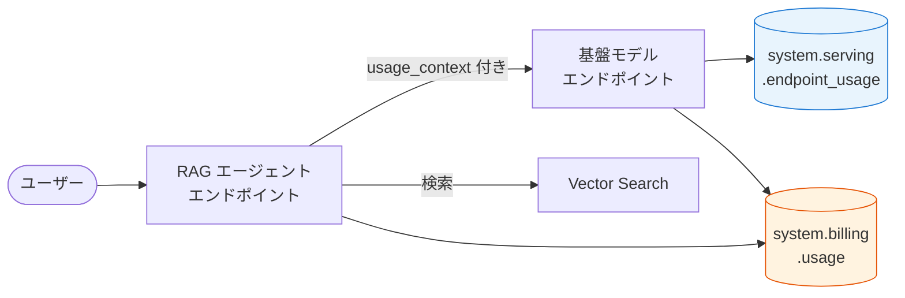

# なぜLLMOps基盤でコスト管理が難しいのか

LLMアプリケーション基盤のコスト管理には、従来のWebアプリやバッチ処理にはない固有の難しさがあります。

第一に、**従量性と変動幅**です。トークン単位の従量課金は、入出力の長さ次第で1リクエストのコストが桁単位で変わります。RAGエージェントが検索結果を5件コンテキストに入れるか10件入れるかで入力トークン数は倍になります。事前に「月額いくら」と見積もるのが困難です。

第二に、**消費者の不透明さ**です。共有のモデルサービングエンドポイントを複数のアプリケーションやユーザーが叩く場合、デフォルトでは「誰の・どの用途の消費か」が見えません。請求書にはエンドポイント全体の消費が1行で出るだけで、部門やプロジェクトへの按分ができません。

第三に、**品質とのトレードオフ**です。コストを下げようとモデルを小さくしたりコンテキストを削ったりすると、品質が落ちます。コスト管理は品質管理と切り離せません。

本記事は特定のツールの実装手順ではなく、これらの性質に対処するための**考え方の枠組み**を示します。共著書[『Databricks&MLflowで実践するLLMOps入門』](https://www.amazon.co.jp/dp/4295603082)が扱う実験管理・品質保証の隣にある「運用コストの統制」という位置づけです。枠組みを示した後、Databricks上のRAGエージェントを最小サンプルとして添えます。

# コストの二層構造

LLMOps基盤のコストは2つの層で捉えます。

**インフラのコスト**は、ジョブの実行やエンドポイントの稼働といった計算資源のコストです。エンドポイントが起動している時間やクラスタのスケールに比例し、リクエストが来なくても発生します。

**トークンのコスト**は、エージェントが内部で叩く基盤モデルのトークン消費に応じて発生するコストです。消費したトークン数に応じた課金が発生し、リクエストの内容(入出力の長さ)に依存します。

この2つを分けて捉える理由は、**属性付けの手段が異なる**からです。インフラのコストはジョブやエンドポイントにタグを付けて属性付けします。トークンのコストはリクエストごとにタグを付けて属性付けします。粒度も違えば、使える仕組みも違います。どちらか一方だけでは「誰のどの用途の消費か」を完全には捉えられません。



上の図で、トークンのコストは左の経路(エージェント→基盤モデル→`endpoint_usage`)に、リクエスト単位の粒度で記録されます。インフラのコストは右の経路(`billing.usage`)に、集約された粒度で記録されます。

# 属性付けの設計

コストを測れるようになったら、次は「誰の・何の消費か」を意味のある軸で割り当てる**属性付け**の設計です。

## 属性付けの軸

典型的な軸として以下があります。

| 軸 | 例 | 用途 |
|---|---|---|
| プロジェクト | `rag-cicd-cost` | プロジェクト別のコスト把握 |
| ユースケース | `rag` / `summarization` / `classification` | 用途別の比較・最適化 |
| 課金対象ユーザー | `user_a` / `user_b` | ユーザー別の消費追跡 |
| 部門(コストセンター) | `sales` / `marketing` / `platform` | 部門へのチャージバック |

トークンのコストでは、エージェントのコード内でリクエストごとにこれらの軸をタグとして付与します。インフラのコストでは、ジョブやエンドポイントにタグや予算ポリシーを紐づけます。

## 記録時に固定するか、集計時に解決するか

ここで重要な設計選択が1つあります。

属性の値を**記録時に固定する**(エージェント側で解決して書き込む)のか、**集計時に外部マスタとJOINして解決する**のか、という選択です。

プロジェクトやユースケースのようにリクエスト時点で確定する属性は、記録時に固定するのが自然です。一方、部門(コストセンター)のようにユーザーの異動で変わりうる属性は、集計時にJOINするほうが優れます。

理由は3つです。

- **関心の分離**: エージェントは推論の責務だけを持ち、「このユーザーはどの部門か」という組織構造の知識を持たなくてよい
- **鮮度**: 対応表を更新するだけで、過去ぶんも含めて最新のマッピングで集計し直せる。エージェントの再デプロイが不要
- **保守**: エージェントの設定に組織構造を焼き込む必要がなく、設定の不整合リスクが構造的に消える

エージェントはユーザーIDだけを`usage_context`に載せ、どの部門に属するかは集計側の関心事とする。この分離が設計の要点です。

# 統制への展開

属性付けしたコストをどう活用するかを、4つの段階で整理します。

## (a) 可視化

時系列推移、ユーザー別・部門別の内訳をダッシュボードで見えるようにします。見えるだけで「自分のチームがどれだけ消費しているか」への意識が変わり、不要な呼び出しの抑制に繋がります。まずはここから始めるのが現実的です。

## (b) チャージバック

部門ごとの消費を対応表とJOINして按分し、部門の予算から引き落とします。「使った分だけ払う」構造ができると、コスト意識が組織に根付きます。ショーバック(請求はしないが消費を見せる)から始めて、チャージバック(実際に按分課金する)へ段階的に移行するのが一般的です。

## (c) 予算とアラート

期間あたりの上限を設定し、閾値を超えたら通知します。インフラのコストには[予算ポリシー](https://docs.databricks.com/aws/ja/admin/usage/budget-policies)を、トークンのコストにはAI Gatewayスコープの[予算](https://docs.databricks.com/aws/ja/admin/account-settings/budgets)を使うことで、二層それぞれに統制が掛けられます。

## (d) CI/CDゲートでの統制

新バージョンのデプロイ前に評価ゲートでコストをチェックし、閾値を超えたら昇格を止めます。ただし、閾値は**実測の分布から逆算すべきもの**です。最初から決め打ちはできません。

推奨する順序は(a)→(b)→(c)→(d)です。(a)〜(c)で実測を積み、コストの分布が見えてから(d)に進みます。順序を間違えて閾値から決めると、根拠のない数字で開発が止まるリスクがあります。

# 品質と不可分なコスト

コストは品質から切り離して語れません。応答あたりのコストを半分にしても、正答率が半分になっては意味がありません。

そこで有効なのが **成功応答あたりコスト(cost per successful output)** という複合指標です。

$$
\text{cost per successful output} = \frac{\text{総トークン消費}}{\text{品質基準を満たした応答数}}
$$

この指標なら、モデルを小さくしてコストが下がっても品質低下で分母が減れば指標は悪化し、トレードオフを正しく反映します。逆に、品質を上げるためにコンテキストを増やしてトークンが増えても、成功率が十分上がれば指標は改善します。

CI/CDの昇格判断では、**品質ゲート**(正答率 >= 閾値)と**コストゲート**(成功応答あたりコスト <= 閾値)を並置し、どちらか一方でも不合格なら昇格を止める、という設計になります。閾値は本番の実測分布から決めるもので、初期はゲートなしで実測を積むのが現実的です。

# Databricksでの具体化

ここまでの考え方が、Databricks上でどの機能に対応するかを最小限のコードで示します。

## 考え方とプラットフォーム機能の対応

| 考え方 | Databricks での実現 |
|---|---|
| トークンのコスト計測 | `system.serving.endpoint_usage` テーブル |
| トークンの属性付け | LLM 呼び出し時の `usage_context` |
| インフラのコスト計測 | `system.billing.usage` テーブル |
| インフラの属性付け | エンドポイントタグ / [予算ポリシー](https://docs.databricks.com/aws/ja/admin/usage/budget-policies) |
| 部門按分(集計時JOIN) | `endpoint_usage` と対応表の SQL JOIN |
| 予算アラート | [予算の作成と監視](https://docs.databricks.com/aws/ja/admin/account-settings/budgets) / [AI Gateway](https://docs.databricks.com/aws/ja/ai-gateway/configure-ai-gateway-endpoints) |

## サンプル: トークンの属性付け

RAGエージェントが内部でLLMを呼び出す際に、`usage_context`でリクエストを属性付けします。ポイントは、エージェントは`end_user`(誰が使ったか)だけを載せ、部門の解決はここでは行わないことです。

```python
# agent.py から抜粋
completion = client.chat.completions.create(
    model=LLM_ENDPOINT,
    messages=[
        {"role": "system", "content": SYSTEM_PROMPT},
        {"role": "user", "content": f"コンテキスト:\n{context}\n\n質問: {query}"},
    ],
    extra_body={
        "usage_context": {
            "use_case": "rag",
            "project": PROJECT,
            "end_user_to_charge": end_user,
        }
    },
)
```

この`usage_context`は、エージェントが内部で叩く基盤モデルエンドポイント側の`system.serving.endpoint_usage`テーブルに記録されます。エージェント自身のエンドポイント行ではなく、内部のLLM呼び出し側の行に記録される点に注意してください。また、テーブルへの反映には数分の遅延があります。


エージェントの構築方法の詳細は[ResponsesAgentでエージェントを作成する](https://docs.databricks.com/aws/ja/generative-ai/agent-framework/author-agent)を参照してください。

## サンプル: 集計時JOINによる部門按分

`endpoint_usage`に記録された`end_user_to_charge`を、対応表(`user_dept`)とJOINして部門別に集計します。

```sql
SELECT COALESCE(d.cost_center, 'unknown') AS cost_center,
       u.usage_context['end_user_to_charge'] AS end_user,
       SUM(u.input_token_count)  AS in_tokens,
       SUM(u.output_token_count) AS out_tokens
FROM   system.serving.endpoint_usage u
LEFT JOIN takaakiyayoi_catalog.rag_cicd.user_dept d
       ON u.usage_context['end_user_to_charge'] = d.end_user
WHERE  u.usage_context['project'] = 'rag-cicd-cost'
GROUP BY ALL
ORDER BY cost_center
```

実行結果:

| cost_center | end_user | in_tokens | out_tokens |
|---|---|---|---|
| marketing | user_b | 1868 | 313 |
| platform | user_demo_001 | 5505 | 759 |
| sales | user_a | 2918 | 370 |
| unknown | anonymous | 823 | 87 |


対応表にない`anonymous`は`COALESCE`で`unknown`に寄ります。対応表を更新すれば、過去の記録も含めて最新のマッピングで集計し直せます。エージェントの再デプロイは不要です。

# まとめ

本記事では、LLMOps基盤におけるコスト管理の考え方を整理しました。枠組みを3ステップで再掲します。

**ステップ1: 測る・属性付ける**。エージェントのLLM呼び出しに`usage_context`を載せ、ジョブやエンドポイントにタグを付けます。これだけでコストが「誰の・何の消費か」が見える状態になります。

**ステップ2: 可視化・按分する**。ダッシュボードで傾向を掴み、対応表JOINで部門へチャージバックします。部門のような変動する属性は記録時に固定せず、集計時にJOINで解決するのが設計の要点です。

**ステップ3: 実測を踏まえてCI/CDの閾値を決める**。十分な分布が得られてから、品質ゲートとコストゲートを設定します。コストは品質と不可分なので、成功応答あたりコスト(cost per successful output)のような複合指標で判断します。

順序が重要です。閾値から決めるのではなく、まず測るところから始めます。CI/CDゲートの実装については次回の記事で扱う予定です。

### はじめてのDatabricks

[はじめてのDatabricks](https://qiita.com/taka_yayoi/items/8dc72d083edb879a5e5d)

### Databricks無料トライアル

[Databricks無料トライアル](https://databricks.com/jp/try-databricks)
