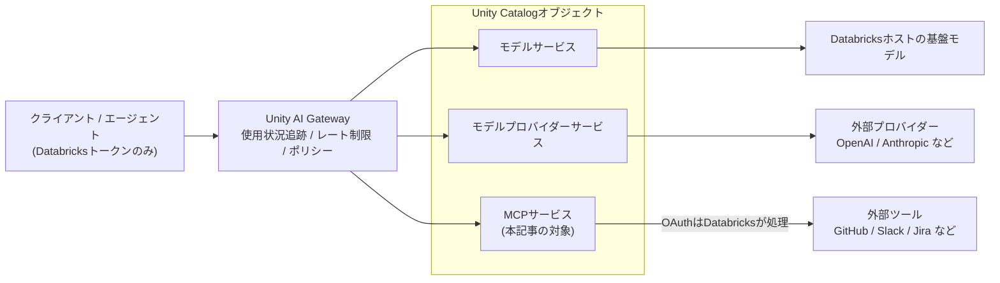

# はじめに

前回の[DatabricksモデルプロバイダーサービスでOpenAIをUnity Catalogに登録する](https://qiita.com/taka_yayoi/items/841b52ced4f922cc0693)では、外部モデルプロバイダーがUnity Catalogのセキュラブルオブジェクトになったことを実機で検証しました。今回はその続きとして、同じUnity AI Gateway (ベータ) の**MCPサービス**を取り上げます。

- [MCPサービスの登録](https://docs.databricks.com/aws/ja/ai-gateway/register-mcp-service)

MCPサービスは、MCPサーバーをUnity Catalogのセキュラブルオブジェクトとして登録し、エージェントからの利用を統治する仕組みです。モデルサービス、モデルプロバイダーサービスに続いて、エージェントのツール (MCP) もUCの一級市民になった、という位置づけです。本記事では、ビルトインで提供されるGitHub MCPサービスを題材に、認証、ツール構成、Playgroundからの利用、使用状況追跡までを実機で検証します。

なお、Unity AI Gatewayは現時点でベータ版です。アカウント管理者がアカウントコンソールの[プレビューページ](https://docs.databricks.com/aws/ja/admin/workspace-settings/manage-previews)から有効化する必要があります。ベータ期間中は料金が発生しません。

# MCPサービスとは

MCPサービスは、MCPサーバーを登録してエージェントがそれをどのように使用するかを管理する、Unity Catalogのセキュラブルオブジェクトです。テーブルやモデルプロバイダーサービスと同じく`catalog.schema.mcp_service`の3部構成の名前で指定し、AIトラフィックのコントロールプレーンであるUnity AI Gatewayを介して呼び出します。

これでUnity AI Gatewayが統治するサービスは3種類になりました。



ポイントを整理します。

- **権限モデルは共通**: デフォルトではMCPサービスの所有者のみが呼び出せます。他のユーザー、グループ、サービスプリンシパルには`EXECUTE`を付与します。1つの`EXECUTE`付与で、そのサービスのすべてのツールが対象になります。モデルプロバイダーサービスとまったく同じUC権限の世界です。
- **認証はUnity Catalog HTTP接続**: 外部MCPサーバーへの認証はmanaged MCPプロキシとUC HTTP接続で処理され、OAuthフローとトークン更新はDatabricksが担うため、エンドユーザーにトークンは見えません。さらに、Unity CatalogはID (ユーザー) ごとにトークンを格納します。つまり**サービスは共有、認証は個人ごと**で、エージェントは呼び出したユーザー本人の権限で外部ツールにアクセスします。
- **ビルトインサービスが最初から用意されている**: GitHub、Slack、Google Drive、Jira/Confluenceなど、一般的なSaaSアプリ用のMCPサービスがDatabricksから提供されます。
- **ベータ期間中の制限**: `CREATE MCP SERVICE`のようなSQL DDLは使えず、UIまたはREST APIで作成・管理します。また、独自に登録できるのは外部MCPサーバーのみで、GenieやApps、Unity CatalogエンティティをMCPサービスとして登録することは現時点でサポートされていません。

# MCPタブを見る

サイドバーのAIゲートウェイからMCPタブを開きます。


「注目のMCP」としてGenie、Atlassian、GitHub、Slackのカードが並び、その下に`system.ai`配下のビルトインMCPサービス (google_calendar、github、sharepoint、google_drive、atlassian、gmail、slack) が一覧表示されます。基盤モデルと同じ`system.ai`スキーマにビルトインMCPサービスが同居している、というのが面白いところで、「Databricksホストのモデルもビルトインのツールも同じカタログの住人」という構図です。右上の「+ MCPを作成する」から外部MCPサーバーの登録もできます (本記事ではビルトインを使うため踏み込みません)。

なお、前回記事の時点ではタブが「モデル/プロバイダー/MCP/スキル/エージェント」の5つでしたが、この画面ではスキルタブが見当たらず4タブ構成になっています。ベータ期間中はUIの構成が変わりうる点はご承知おきください。

# GitHub MCPサービスの詳細画面と認証

一覧から`system.ai.github`を開きます。


タブ構成は「概要/メトリクス/権限/ポリシー」です。概要にはツール一覧と「始めましょう」ウィザードが表示されますが、最初は「このMCPサービスには認証が必要です」という警告が出ています。前述の通りUnity CatalogはユーザーごとにGitHubのトークンを格納するため、サービス自体はビルトインで存在していても、各ユーザーが最初にLoginボタンからGitHubへのOAuth認証を済ませる必要があります。ログインする前にMCPサービスを呼び出すと、AI Gatewayから認証を求めるエラーが返る仕様です。

Loginボタンを押すとGitHubのOAuthフローが走り、完了すると画面右上のボタンが「認証情報を取り消し」に変わります。トークン自体はDatabricks側が管理するため、ユーザーがトークンを目にすることはありません。

右ペインのガバナンス設定パネルは「1/3のタスクが完了」で、内訳は以下です。

- **Usage tracking**: 最初から有効。`system.ai_gateway.usage`に記録
- **レート制限**: サービスまたはユーザーごとの1分あたりのリクエスト数を制限
- **ポリシー**: ガードレールの設定

モデルプロバイダーサービスのパネルは推論テーブルを含む4タスクでしたが、MCPサービスには推論テーブルがなく3タスクです。使用状況追跡・レート制限・ポリシーというガバナンスの骨格は共通で、サービス種別ごとに適用できる機能が少しずつ違う、という構成になっています。

## ツール一覧: 読み取り系に絞られた構成

概要タブのツール一覧を見てみます。


`get_commit`、`get_file_contents`、`get_latest_release`、`get_me`、`issue_read`など、リポジトリやIssueの情報を取得するツールが3ページにわたって並んでいます。一通り確認したところ、現時点で公開されているのはすべて読み取り系のツールでした。実際、PlaygroundでIssueの作成を指示してみたところ、書き込み用のツールが存在しないため完遂できませんでした。エージェントに外部ツールを渡す際は、まずツール一覧で何ができるかを確認しておくのが確実です。

一覧の右上には「編集ツール」ボタンがあり、公開するツールを絞り込むツールフィルタリングの入口になっています。エージェントに渡すツールをサービスの供給側で制御できる、というのはMCPサービスをUCオブジェクト化した意味そのものです。

# PlaygroundからGitHub MCPサービスを使う

詳細画面の「Playgroundで試す」から、モデルにこのMCPサービスをツールとして付与した状態でAI Playgroundが開きます。今回はClaude Opus 4.7に「自分のリポジトリにはどんなものがありますか」と聞いてみました。


エージェントの動きが見事で、まず`get_me`で認証済みユーザーの情報を取得してGitHubのユーザー名 (taka-yayoi) を特定し、続けて`search_repositories`を`{"query": "user:taka-yayoi", "sort": "updated", "perPage": 100}`で呼び出しました。1つの質問に対して2つのツールが自律的に連鎖しています。

`get_me`が本人のGitHubアカウント情報を返している点は、ユーザーごとの認証がそのまま効いている証拠でもあります。エージェントは「誰かの資格情報」ではなく、Playgroundを操作している私自身のGitHub権限で動いています。


最終的な回答では、54個のパブリックリポジトリが「最近更新されたリポジトリTop 10」「テーマ別カテゴリ (AI/LLM/エージェント関連、学習コンテンツ、Databricks/Spark関連)」「スター数Top 5」として整理されました。コードを1行も書かずに、自然言語からGitHubの情報を集約するエージェント体験がここまで動きます。

なお、MCPサービスをプログラムから直接呼び出す場合のエンドポイントは以下の形式です。

```bash
curl \
  -X POST "https://<ワークスペースURL>/ai-gateway/mcp-services/system.ai.github" \
  -H "Authorization: Bearer $DATABRICKS_TOKEN" \
  -H "Content-Type: application/json" \
  -d '{"jsonrpc": "2.0", "method": "tools/list", "id": 1}'
```

面白いのは3部名前の指定方法の違いです。モデルプロバイダーサービスは`Databricks-Model-Provider-Service`**ヘッダー**でUCオブジェクトを名指ししましたが、MCPサービスは**URLパス**に3部名前を埋め込み、ボディはMCPの標準であるJSON-RPCです。ウィザードのコードサンプルにはcURL/Pythonに加えてClaude Code/OpenAI Codex/Cursorのタブも用意されており、コーディングエージェントからの利用が最初から想定されています。

# 使用状況の追跡: mcp_metadataでツール発火まで見える

MCPサービスの使用状況も、モデルプロバイダーサービスと同じ`system.ai_gateway.usage`システムテーブルに記録されます。このテーブルにはMCP専用のカラムが用意されています。

| カラム | 内容 |
|---|---|
| service_type | `MCP_SERVICE` (モデルサービス、モデルプロバイダーサービスと共通のテーブルで区別) |
| service_name | UCの3部名前 (`system.ai.github`) |
| mcp_metadata | MCP固有のメタデータ。`tool_name` / `server_type` / `client_name` / `json_rpc_method` |
| request_id / invocation_id | `invocation_id`は推論呼び出しごとの一意なID。同一`request_id`を共有する複数の呼び出しを区別 |

つまり、どのMCPサービスが呼ばれたかだけでなく、**どのツールが発火したか**まで記録されます。先ほどのPlaygroundの1問 (`get_me` → `search_repositories`) は、2つのツール呼び出しが別レコードとして記録されるはずです。

```sql
SELECT
  event_time,
  service_type,
  service_name,
  mcp_metadata.tool_name,
  mcp_metadata.client_name,
  mcp_metadata.json_rpc_method,
  requester,
  latency_ms,
  status_code
FROM system.ai_gateway.usage
WHERE service_type = 'MCP_SERVICE'
  AND service_name = 'system.ai.github'
ORDER BY event_time DESC;
```

ツール別の利用集計も1クエリです。

```sql
SELECT
  service_name,
  mcp_metadata.tool_name,
  COUNT(*) AS call_count,
  AVG(latency_ms) AS avg_latency_ms
FROM system.ai_gateway.usage
WHERE service_type = 'MCP_SERVICE'
GROUP BY service_name, mcp_metadata.tool_name
ORDER BY call_count DESC;
```

このテーブルの参照はアカウント管理者に限定されており、反映はリアルタイムではなくデータは1日を通して更新されます。詳細は[Unity AI Gatewayサービスのモデル使用状況](https://docs.databricks.com/aws/ja/ai-gateway/usage-tracking-beta)をご覧ください。

# まとめ

MCPサービスによって、エージェントが使う外部ツール (MCPサーバー) もUnity Catalogのセキュラブルオブジェクトとして統治されるようになりました。モデルサービス、モデルプロバイダーサービスに続く3つ目のサービスです。

実機で確認できたことを整理します。

- ビルトインのMCPサービス (GitHub、Slack、Google Driveなど) が`system.ai`配下に最初から用意されている
- サービスは共有しつつ、認証はUnity CatalogがユーザーごとにOAuthトークンを管理する。エージェントは呼び出したユーザー本人の権限で外部ツールにアクセスする
- 公開ツールは供給側で制御でき、ビルトインGitHubは現時点で読み取り系のツール構成
- Playgroundからは、1つの質問に対して複数のツールが自律的に連鎖するエージェント体験がコードなしで動く
- 使用状況は`system.ai_gateway.usage`に`MCP_SERVICE`として記録され、`mcp_metadata.tool_name`でツール単位の発火まで追跡できる

誰がどの外部ツールをどのツール単位で使ったかまで、データと同じガバナンスの流儀で見える。エージェント時代のツール統制の形として、モデルプロバイダーサービスとあわせて押さえておきたい機能です。

# 参考リンク

- [MCPサービスの登録](https://docs.databricks.com/aws/ja/ai-gateway/register-mcp-service)
- [Unity AI GatewayによるAIガバナンス](https://docs.databricks.com/aws/ja/ai-gateway/)
- [Unity AI Gatewayサービスのモデル使用状況](https://docs.databricks.com/aws/ja/ai-gateway/usage-tracking-beta)
- [DatabricksモデルプロバイダーサービスでOpenAIをUnity Catalogに登録する](https://qiita.com/taka_yayoi/items/841b52ced4f922cc0693)
- [Databricks Unity AI Gateway 最新ガイド — 新しいタブ構成 (モデル/プロバイダー/MCP) を実機で触る](https://qiita.com/taka_yayoi/items/ad26c6ce5165ef691e00)

### はじめてのDatabricks

[はじめてのDatabricks](https://qiita.com/taka_yayoi/items/8dc72d083edb879a5e5d)

### Databricks無料トライアル

[Databricks無料トライアル](https://databricks.com/jp/try-databricks)
