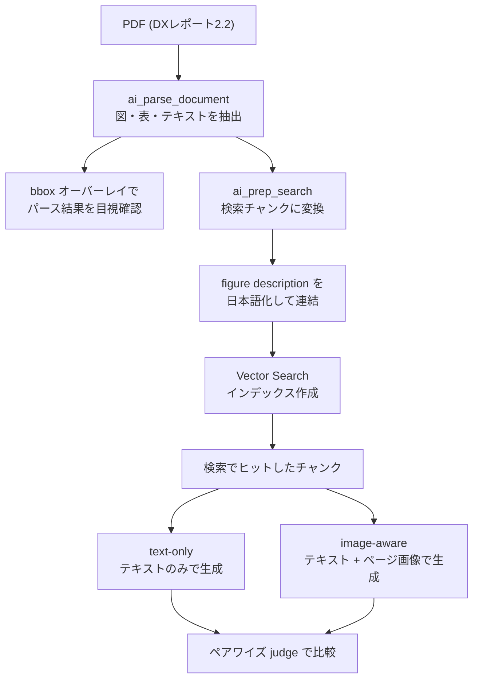

# はじめに

役所のいわゆるポンチ絵のように、1枚に矢印・吹き出し・色分けされたボックスがびっしり詰まった図入りのドキュメントは、RAG にとって難所です。図の中にこそ重要な情報があるのに、テキスト抽出だけではその情報がごっそり抜け落ちてしまうからです。

本記事では、Databricks の [ai_parse_document](https://docs.databricks.com/aws/ja/sql/language-manual/functions/ai_parse_document) を入口に、図入りの日本語ドキュメントがどこまでパースできるのか、そしてパースしきれない図の情報を RAG でどこまで拾えるのかを検証します。検証の結論を先に述べると、図中の数値を問う質問に対しては、検索でヒットしたチャンクのページ画像を生成モデルに渡す image-aware な構成が、テキストのみの構成を明確に上回りました。

検証に使ったノートブックは Databricks 上でそのまま実行できる形でまとめています。

# 検証の題材: DXレポート2.2

題材には経済産業省の「[DXレポート2.2 (概要)](https://www.meti.go.jp/policy/it_policy/dx/002_05_00.pdf)」を選びました。理由は、日本語のテキスト密度が高い図が多く、図入りドキュメントの難所をひととおり踏むからです。具体的には、色分けされたボックスと矢印で構成された概念図、複数の棒グラフと折れ線グラフ、横棒グラフなどが1枚のスライドに同居しています。

「図のパース限界」を素直に観察するには英語ドキュメントのほうが向いていますが、今回はあえて「日本語×高密度の図」という、最も崩れやすい組み合わせを選んでいます。

# 検証パイプラインの全体像

本記事で構築する検証パイプラインの全体像は次のとおりです。PDF をパースし、検索チャンクに変換し、日本語の図説明を連結したうえで Vector Search に載せ、最後に2つの回答生成経路を比較します。



# 図をパースする

まずはボリュームに置いた PDF を `ai_parse_document` で解析します。図領域を目視で確認したいので、ページ画像をボリュームに書き出す `imageOutputPath` と、図の説明文を生成させる `descriptionElementTypes` を有効にしています。

```sql
SELECT
  path,
  ai_parse_document(
    content,
    map(
      'version', '2.0',
      'imageOutputPath', '/Volumes/<catalog>/<schema>/<volume>/parsed_images',
      'descriptionElementTypes', 'figure'
    )
  ) AS parsed
FROM READ_FILES('/Volumes/<catalog>/<schema>/<volume>/dxreport_2_2.pdf', format => 'binaryFile')
```

出力の `elements` を展開すると、各要素が type (text, table, figure, title, caption, section_header など)、content、confidence、bbox、そして figure 向けの description を持っていることがわかります。bbox の座標は `imageOutputPath` に書き出したページ画像のピクセル座標と一致するので、ページ画像に各要素の領域を重ねて描画すれば、何がどう切り出されたかを一目で確認できます。Databricks の [ドキュメント解析の UI](https://docs.databricks.com/aws/ja/generative-ai/agent-bricks/document-parsing) でも同様の確認ができます。


オーバーレイで見えてきた挙動は次のとおりです。

複数の独立したグラフが1つの figure 要素にまとめて括られることがあります。たとえば「提出企業数のグラフ」と「平均スコアのグラフ」が左右に並んでいても、1つの figure として扱われ、bbox も1つになります。グラフ単位で分離したい用途では、ここがまず壁になります。

グラフのタイトルは section_header として figure とは別の要素に切り出されます。つまり「どのタイトルがどのグラフのものか」という紐付けは構造的に切れていて、位置関係から推測するしかありません。

グラフ内の数値 (たとえば 248 / 307 / 486 や平均スコアの 1.8 / 2.0 / 2.4) は figure の中に閉じ込められるため、table のような構造化抽出としては出てきません。出てくるとすれば figure の description の文章の中だけです。ここがまさに「図からデータを取り出す限界」が現れる部分です。

一方で、出典を示す caption やページ番号といった定型要素はきれいに取れていました。

# 図はRAGにどう乗るか

パース結果を RAG の検索チャンクに変換するには [ai_prep_search](https://docs.databricks.com/aws/ja/sql/language-manual/functions/ai_prep_search) を使います。この関数は `ai_parse_document` の構造化出力をチャンクに変換し、ドキュメントタイトルやセクションヘッダーといったコンテキストでチャンクを補強します。

ここで重要なのは、図についてはその要約 (description) がチャンクのテキストに織り込まれる、という点です。つまり figure が RAG でヒットするかどうかは、description にどれだけ意味が言語化されたかでほぼ決まります。逆に言えば、`descriptionElementTypes` をオフにすると figure には検索可能なテキストが付かず、その図は RAG から実質まるごと欠落します。

もう1つの課題は、この description が英語で生成されることです。日本語クエリでの検索精度を上げるため、figure の説明を [ai_query](https://docs.databricks.com/aws/ja/large-language-models/ai-functions) で日本語で生成し直し、チャンクの埋め込みテキストに連結する後処理を入れました。

```sql
SELECT
  element_id,
  page_id,
  ai_query(
    'databricks-claude-sonnet-4',
    CONCAT(
      '以下はPDFから抽出された図の情報です。図の内容を日本語で簡潔に説明してください。',
      ' 図中テキスト: ', COALESCE(content, '(なし)'),
      ' 英語の説明: ', COALESCE(description, '(なし)')
    )
  ) AS description_ja
FROM <elements_table>
WHERE type = 'figure'
```

この日本語の説明を、チャンクが含む全ページの figure 分まとめて `chunk_to_embed` に連結し、これを埋め込みソースにした [Vector Search](https://docs.databricks.com/aws/ja/generative-ai/vector-search/) インデックスを作成します。チャンクは複数のページをまたぐことがあるため、先頭ページの figure だけを拾うのではなく、`pages_json` を展開して全ページ分を集約するのがポイントでした。埋め込みモデルには日本語に強い multilingual 系のモデルを選んでいます。

# text-only と image-aware を比較する

図の限界を埋められるかを検証するため、回答生成の経路を2つ用意して比較します。

text-only は、検索でヒットしたチャンクのテキストのみを生成モデルに渡す構成です。image-aware は、同じテキストに加えて、チャンクが含むページ画像も vision model に渡す構成です。description が取りこぼした視覚情報 (グラフの数値、矢印の向き、色分けの意味) を、生成のときに図そのもので補える、という発想です。

画像の渡し方には注意が必要でした。当初はチャンクの先頭ページの画像だけを渡していたのですが、これだと複数ページをまたぐチャンクで、質問対象のグラフが後続ページにある場合に図が渡らず、数値を読めませんでした。`pages_json` を展開してチャンクの全ページ画像を渡すように直したところ、はっきり効くようになりました。

```python
def _page_uris(row):
    """チャンクが含む全ページの image_uri を返す (先頭ページだけにしない)"""
    uris = []
    pj = row.get("pages_json")
    if pj:
        for p in json.loads(pj):
            if p.get("image_uri"):
                uris.append(p["image_uri"])
    if not uris and row.get("first_page_image_uri"):
        uris = [row["first_page_image_uri"]]
    return uris
```

採点は ground truth なしのペアワイズ比較にしました。判定モデルに2つの回答を見せ、質問に対してどちらがより正確か (特に図表中の数値や関係に正しく答えているか) を選ばせます。順序バイアスを避けるため、2回答の提示順は質問ごとにランダム化しています。

質問は、図中の数値を問う figure 系と、本文テキストで答えられる text 系を混ぜて用意しました。

# 検証結果

figure 系の質問では、image-aware が text-only に対して3戦全勝という結果になりました。

最もわかりやすいのが、DX推進指標の提出企業数の推移を問う質問です。同じ検索結果を渡しているにもかかわらず、回答は次のように分かれました。

| 経路 | 回答の要旨 |
| --- | --- |
| image-aware | 2019年 248社 → 2020年 307社 → 2021年 486社、と具体的な数値で回答 |
| text-only | 着実に増えているが、具体的な数値は記載されていない、と回答 |

平均スコアを問う質問でも同様で、image-aware は 2019年 1.8 → 2020年 2.0 → 2021年 2.4 を正しく読み取りましたが、text-only は数値を出せませんでした。これらの数値は、最初のオーバーレイで確認したグラフの値と一致しており、vision model のハルシネーションではなく、図を正しく読めていることが確認できます。


```python
import plotly.express as px

cnt = df_eval.groupby(["type", "winner"]).size().reset_index(name="n")
fig = px.bar(
    cnt, x="type", y="n", color="winner", barmode="stack", text="n",
    category_orders={"winner": ["image-aware", "tie", "text-only"]},
    labels={"type": "質問タイプ", "n": "件数", "winner": "勝者"},
    title="text-only と image-aware の勝敗 (質問タイプ別)",
)
fig.show()
```

ここで強調したいのは、「単に画像を1枚足すだけでは図の限界は埋まらなかった」という点です。先頭ページの画像だけを渡していた時点では、数値を問う質問はどちらの経路も引き分けでした。チャンクの全ページ画像を正しく渡して初めて、image-aware が勝ち越したのです。図の限界を埋めるには、図のあるページを生成モデルに確実に届けることが要件になります。

# 考察

検証から得られた主な結論は、図中の数値や関係を問う質問では、ページ画像を生成に渡す image-aware な構成が有効だということです。`ai_parse_document` の description だけではグラフの数値までは安定して拾えませんが、生成段階で図そのものを見せることで、その限界を実務的に埋められます。

一方で、興味深い副次的な発見もありました。text 系の質問では、image-aware がむしろ不利になる場面があったのです。「2025年の崖」の定義を問う質問では、テキストに直接の定義がないとき、image-aware 側が記載のない内容を推測気味に答えたのに対し、text-only 側は「記載なし」と正確に述べて、判定で勝ちました。

つまり、常に画像を渡せばよいわけではありません。テキストで十分に答えられる質問にまで画像を渡すと、かえって憶測や冗長を招くことがあります。実運用では、質問が図に関わるかどうかを軽く分類し、図関連のときだけ画像を添付する出し分けにすると、コストと精度の両取りができそうです。

# まとめ

図入りの日本語ドキュメントを RAG する流れを、`ai_parse_document` でのパースから、`ai_prep_search` でのチャンク化、日本語 description の繋ぎ込み、そして text-only と image-aware の比較まで通して検証しました。

PoC として確認できたのは次の点です。図中の数値は figure の description には安定して落ちないこと。その限界は、検索でヒットしたチャンクの全ページ画像を生成に渡すことで埋められること。ただし画像が効くのは図に関わる質問であり、テキストで足りる質問では逆効果になりうること。

本番のアプリケーションに向けては、複数ドキュメントのインジェスト自動化、図を含むページを優先して渡す画像枚数の最適化、質問タイプによる経路の出し分け、評価の作り込みといった課題が残ります。これらは今回の PoC で見えた要件をそのまま発展させたものです。

検証に使ったノートブックは [GitHub リポジトリ](https://github.com/taka-yayoi/databricks-multimodal-rag)に置いています。Databricks 上でボリュームに PDF を置けば、そのまま追試できる形になっています。

### はじめてのDatabricks

[はじめてのDatabricks](https://qiita.com/taka_yayoi/items/8dc72d083edb879a5e5d)

### Databricks無料トライアル

[Databricks無料トライアル](https://databricks.com/jp/try-databricks)
