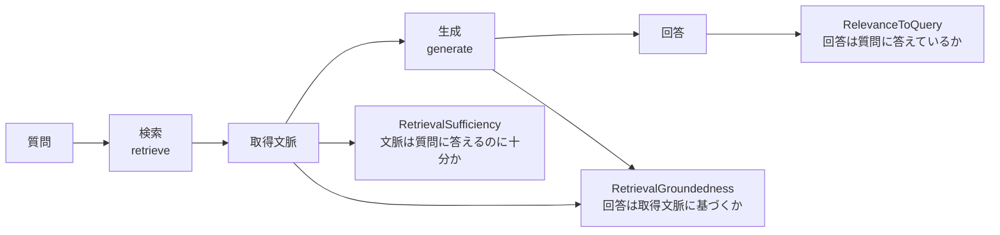
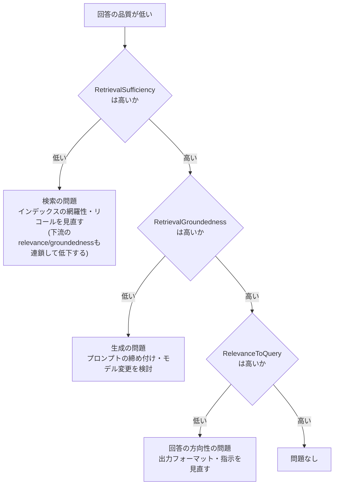

# はじめに

以前、[Databricks Vector Searchの検索品質を自動評価する(AutoEval)](https://qiita.com/taka_yayoi/items/5f528f1772bc2fd62b74)という記事で、検索 (retrieval) 単体の品質をDCG@10などのランキングメトリクスで測る方法を紹介しました。ANN・全文検索・ハイブリッドといった検索戦略を横断比較し、どの戦略が最も関連性の高い文書を上位に返すかを定量化するものです。

ただ、RAG (Retrieval-Augmented Generation) は「検索」と「生成」の二段構えです。AutoEvalが測れるのは前半の検索だけで、後半の生成 — つまり「取得した文脈に基づいてLLMが正しく答えられているか」「文脈に無いことを捏造していないか」 — は別の軸で測る必要があります。

検索が完璧でも、LLMが取得文脈を無視してハルシネーションを起こせばRAGとしては失敗です。逆に、生成プロンプトが優秀でも、そもそも必要な文書を検索できていなければ答えようがありません。この記事では、MLflow 3のGenAI評価機能を使って、RAGアプリケーション**全体**の応答品質を評価する方法を扱います。

# 検索の評価とRAGの評価は別レイヤー

まず、何をどのレイヤーで測っているのかを整理します。

| 観点 | 検索の評価 (AutoEval) | RAG全体の評価 (本記事) |
|---|---|---|
| 評価対象 | リトリーバ単体 | リトリーバ + LLM生成 |
| 入力 | クエリ | 質問 |
| 出力 | 取得文書のランキング | 最終的な回答テキスト |
| 主なメトリクス | DCG@10, NDCG, Recall@k, MRR | 関連性, 根拠性, 十分性 |
| 評価者 | 関連性スコアリング | LLMジャッジ |
| 答えること | 「良い文書を上位に返せたか」 | 「良い回答を生成できたか」 |

両者は競合ではなく補完関係です。検索を最適化するならAutoEvalでランキング品質を追い込み、RAGアプリとしての完成度を測るなら本記事のスコアラーで応答品質を見る、という二段構えになります。

# MLflowのRAG向けスコアラー

MLflow 3のGenAI評価には、RAGを評価するためのビルトインスコアラー (LLMジャッジ) が用意されています。今回使うのは次の3つです。

| スコアラー | 何を測るか | 低いときの示唆 |
|---|---|---|
| `RelevanceToQuery` | 回答が質問にちゃんと答えているか | 回答が的外れ・冗長・話題逸脱 |
| `RetrievalGroundedness` | 回答が取得文脈に基づいているか (ハルシネーションしていないか) | LLMが文脈に無いことを生成している |
| `RetrievalSufficiency` | リトリーバが回答に十分な文脈を取得できたか | 検索が必要な文書を取れていない |

この3つの組み合わせが効くのは、**失敗の切り分けができる**からです。`RetrievalSufficiency`が低ければ検索側の問題、`RetrievalGroundedness`が低ければ生成側の問題、と原因のレイヤーを特定できます。AutoEvalのランキングメトリクスだけでは、生成側の忠実性 (groundedness) は捉えられません。ここが今回の記事の肝です。

3つのスコアラーが、RAGのどの部分を見ているかを図にすると次の通りです。



なお、`RetrievalGroundedness`と`RetrievalSufficiency`は、評価対象の関数が出力するMLflowトレースの中から**リトリーバのスパン**を読み取って判定します。具体的には、トレースにスパンタイプ`RETRIEVER`のスパンが少なくとも1つ含まれていること、そして入力と出力がトレースのルートスパンに乗っていることが要件です。つまり、RAG関数をトレースする際に「どこが検索ステップか」をMLflowに認識させておく必要があります。これは後述します。

# 環境構築: サンプルデータとインデックスを用意する

自分で動かせるように、サンプルの問い合わせ文書を入れたDeltaテーブルから、Vector Searchのインデックスまで作成します。すでにインデックスがある場合はこのセクションは読み飛ばして構いません。

まずパッケージを入れます。リトリーバ用のスコアラーは比較的新しいバージョンが必要です。

```python
%pip install --upgrade "mlflow[databricks]>=3.4.0" databricks-vectorsearch
dbutils.library.restartPython()
```

## 設定

このノートブック全体で使う名前を1か所にまとめます。以降のセルはすべてここで定義した変数を参照するので、カタログやエンドポイント名を変えたいときはここだけ直せば済みます。最初にこのセルを実行してください。

```python
CATALOG = "takaakiyayoi_catalog"
SCHEMA = "rag_evaluation"
SOURCE_TABLE = f"{CATALOG}.{SCHEMA}.support_docs"
ENDPOINT_NAME = "one-env-shared-endpoint-1"
INDEX_NAME = f"{CATALOG}.{SCHEMA}.support_docs_index"

# 多言語対応の埋め込みモデル (日本語ドキュメントに適している)
EMBEDDING_MODEL = "databricks-qwen3-embedding-0-6b"
# 生成に使うLLM (ワークスペースで有効なエンドポイント名に読み替え)
LLM_MODEL = "databricks-meta-llama-3-3-70b-instruct"
# 結果の記録先エクスペリメント (自分のユーザー名に変更)
EXPERIMENT_PATH = "/Users/takaaki.yayoi@databricks.com/rag-evaluation"
```

## サンプル文書のDeltaテーブルを作成する

カスタマーサポートのFAQを模した5件の文書を用意します。

```python
docs = [
    (1, "パスワードのリセット手順。ログインページの「パスワードを忘れた場合」をクリックし、"
        "登録済みのメールアドレスを入力します。届いたメールのリンクから新しいパスワードを"
        "設定してください。このリセットリンクは24時間で失効します。",
        "https://example.com/faq/password"),
    (2, "返金ポリシー。購入から30日以内であれば全額返金に対応します。30日を超えた場合は"
        "ストアクレジットでの対応となります。返金処理には5〜7営業日かかります。",
        "https://example.com/faq/refund"),
    (3, "学生割引について。.eduメールアドレスで認証した学生は15%割引を受けられます。"
        "学生ポータルから登録してください。",
        "https://example.com/faq/student"),
    (4, "配送先の住所変更。注文がまだ発送されていない場合は変更可能です。"
        "注文履歴から対象の注文を選び、「住所を編集」をクリックしてください。",
        "https://example.com/faq/shipping"),
    (5, "破損した商品が届いた場合。破損箇所を撮影し、注文番号と写真を添えてサポートに"
        "ご連絡ください。交換品を2営業日以内に無償で発送します。",
        "https://example.com/faq/damaged"),
]

df = spark.createDataFrame(docs, ["id", "content", "url"])
df.write.format("delta").mode("overwrite").saveAsTable(SOURCE_TABLE)

# Delta Sync インデックスのソーステーブルは Change Data Feed が有効である必要があります
spark.sql(
    f"ALTER TABLE {SOURCE_TABLE} "
    "SET TBLPROPERTIES (delta.enableChangeDataFeed = true)"
)
```

## Vector Searchのエンドポイントとインデックスを作成する

エンドポイントとインデックスはどちらも作成に数分かかります。`_and_wait`系の関数を使うと、準備が完了するまでセルがブロックされるので、自分で状態をポーリングする必要がありません。

```python
from databricks.vector_search.client import VectorSearchClient

vsc = VectorSearchClient(disable_notice=True)

# エンドポイントの作成 (既にあればスキップ)
try:
    vsc.create_endpoint_and_wait(
        name=ENDPOINT_NAME, endpoint_type="STANDARD"
    )
except Exception as e:
    print(f"エンドポイントは既に存在するかもしれません: {e}")

# Databricksに埋め込みを計算させる Delta Sync インデックスを作成
# (既に存在する場合は取得し直す)
try:
    index = vsc.create_delta_sync_index_and_wait(
        endpoint_name=ENDPOINT_NAME,
        source_table_name=SOURCE_TABLE,
        index_name=INDEX_NAME,
        pipeline_type="TRIGGERED",
        primary_key="id",
        embedding_source_column="content",
        embedding_model_endpoint_name=EMBEDDING_MODEL,
    )
except Exception as e:
    print(f"インデックスは既に存在するかもしれません: {e}")
    index = vsc.get_index(endpoint_name=ENDPOINT_NAME, index_name=INDEX_NAME)
```

埋め込みには`databricks-qwen3-embedding-0-6b`を使っています。これはDatabricksがFoundation Model Servingで提供する多言語対応の埋め込みモデルで、日本語を含む100以上の言語に対応しているため、日本語ドキュメントのRAGに適しています。Databricksも標準エンドポイントの本番用途でこのモデルを推奨しています。

# 評価対象のRAGアプリを用意する

データとインデックスが用意できたら、評価対象となるRAG関数 (`predict_fn`) を組み立てます。ポイントは、検索ステップを`RETRIEVER`タイプのスパンとしてトレースに残すことです。

```python
import mlflow
from mlflow.entities import SpanType
from databricks.vector_search.client import VectorSearchClient
from databricks.sdk import WorkspaceClient

mlflow.set_experiment(EXPERIMENT_PATH)

# 設定セルで定義した名前を使ってインデックスを取得します。
vsc = VectorSearchClient(disable_notice=True)
index = vsc.get_index(endpoint_name=ENDPOINT_NAME, index_name=INDEX_NAME)
# 注意: query_text での検索は、Databricksが埋め込みを計算する
# Delta Sync (マネージド埋め込み) インデックスが前提です。
# 自前で埋め込みを管理している場合は query_vector を使います。

# Foundation Model APIをOpenAI互換クライアントで利用
# ノートブック内ではSDKが認証を自動的に処理します
client = WorkspaceClient().serving_endpoints.get_open_ai_client()
```

ここでは設定セルで定義した`ENDPOINT_NAME`/`INDEX_NAME`/`EXPERIMENT_PATH`を参照しています。別セッションで実行する場合は、先頭の設定セルを再実行してからこのセルを実行してください。

検索ステップを`SpanType.RETRIEVER`でトレースします。スコアラーが文書を認識できるよう、出力は`page_content`と`metadata`を持つ辞書のリストに変換します。

```python
@mlflow.trace(span_type=SpanType.RETRIEVER)
def retrieve(question: str):
    results = index.similarity_search(
        query_text=question,
        columns=["id", "content", "url"],
        num_results=5,
    )
    docs = []
    for row in results["result"]["data_array"]:
        docs.append(
            {
                "page_content": row[1],
                "metadata": {"doc_uri": row[2], "id": row[0]},
            }
        )
    return docs
```

生成ステップでは、取得した文脈のみに基づいて回答するよう指示します。

```python
SYSTEM_PROMPT = """\
あなたはカスタマーサポートのアシスタントです。
以下のコンテキストの情報のみに基づいて回答してください。
コンテキストに答えが無い場合は「わかりません」と答えてください。

コンテキスト:
{context}
"""


@mlflow.trace
def predict_fn(question: str) -> str:
    docs = retrieve(question)
    context = "\n\n".join(d["page_content"] for d in docs)
    response = client.chat.completions.create(
        model=LLM_MODEL,
        messages=[
            {"role": "system", "content": SYSTEM_PROMPT.format(context=context)},
            {"role": "user", "content": question},
        ],
    )
    return response.choices[0].message.content
```

`retrieve`を`RETRIEVER`スパンとしてトレースしているため、`predict_fn`を1回呼ぶだけで「検索 → 生成」の流れが1つのトレースに記録され、後段のスコアラーが検索結果と最終回答の両方を参照できるようになります。

# 評価データセットを用意する

評価データは質問のリストです。ここで重要な前提があります。3つのスコアラーは正解 (ground truth) の要否が分かれます。

| スコアラー | ground truthの要否 |
|---|---|
| `RelevanceToQuery` | 不要 (質問と回答の関係だけで判定) |
| `RetrievalGroundedness` | 不要 (回答と取得文脈の関係だけで判定) |
| `RetrievalSufficiency` | **必須** (`expected_facts`または`expected_response`が要る) |

`RetrievalSufficiency`は「取得文脈が、期待される事実を答えるのに十分か」を判定するスコアラーなので、その期待される事実を`expectations`として与えないと判定できず、エラーになります。今回は3つとも使うので、各行に`expected_facts`を付けておきます。

```python
eval_data = [
    {
        "inputs": {"question": "パスワードをリセットするにはどうすればいいですか?"},
        "expectations": {
            "expected_facts": [
                "ログインページの「パスワードを忘れた場合」から手続きする",
                "リセットリンクは24時間で失効する",
            ]
        },
    },
    {
        "inputs": {"question": "返金は何日以内なら受け付けてもらえますか?"},
        "expectations": {
            "expected_facts": ["購入から30日以内であれば全額返金"],
        },
    },
    {
        "inputs": {"question": "学生割引はありますか?"},
        "expectations": {
            "expected_facts": [".eduメールで認証した学生は15%割引"],
        },
    },
    # 配送先変更・破損商品の質問も同様に expected_facts を付ける
]
```

もし`RetrievalSufficiency`を外して`RelevanceToQuery`と`RetrievalGroundedness`だけで回すなら、`expectations`の無い質問だけのリストでも動きます。正解データを用意するコストと、検索の十分性まで測りたいかのトレードオフで判断してください。

# 評価を実行する

3つのスコアラーを`mlflow.genai.evaluate()`に渡します。

```python
from mlflow.genai.scorers import (
    RelevanceToQuery,
    RetrievalGroundedness,
    RetrievalSufficiency,
)

results = mlflow.genai.evaluate(
    data=eval_data,
    predict_fn=predict_fn,
    scorers=[
        RelevanceToQuery(),
        RetrievalGroundedness(),
        RetrievalSufficiency(),
    ],
)
```

集計メトリクスと行単位の結果を確認します。

```python
print(results.metrics)
# 出力例:
# {'relevance_to_query/mean': 1.0,
#  'retrieval_groundedness/mean': 0.9,
#  'retrieval_sufficiency/mean': 0.8}

df = results.result_df
# result_df の入力は request、出力は response、スコアは末尾が /value の列に入ります
base = [c for c in ["request", "response"] if c in df.columns]
score_cols = [c for c in df.columns if c.endswith("/value")]
print(df[base + score_cols].to_string())
```

MLflow UIの該当エクスペリメントを開くと、行ごとのスコアと、各行にリンクされたトレースが確認できます。トレースをクリックすれば、その質問に対してどの文書が取得され、どんな回答が生成され、スコアラーがなぜそのスコアを付けたのか (rationale) まで追えます。

# 失敗から学ぶ: 原因の切り分け

理想的なデータでは3つのスコアとも1.0になり、差がつきません。スコアラーの本当の価値は、失敗したときに「検索と生成のどちらが原因か」を切り分けられる点にあります。わざと失敗する2つのケースで確かめます。

## ケースA: 検索の失敗 (インデックスに情報が無い)

会社としては海外配送のポリシーがあるのに、その文書をインデックスに入れ忘れた、という状況を想定します。質問に対してリトリーバは関連文書を返せません。

```python
# 海外配送ポリシーは存在するが、その文書はインデックスに入っていない想定
retrieval_gap_data = [
    {
        "inputs": {"question": "海外への配送には対応していますか?"},
        "expectations": {
            "expected_facts": ["海外配送に対応しており送料は地域によって異なる"],
        },
    },
]

gap_results = mlflow.genai.evaluate(
    data=retrieval_gap_data,
    predict_fn=predict_fn,
    scorers=[RelevanceToQuery(), RetrievalGroundedness(), RetrievalSufficiency()],
)
print(gap_results.metrics)
# 実際の結果:
# {'retrieval_sufficiency/mean': 0.0,
#  'retrieval_groundedness/mean': 0.0,
#  'relevance_to_query/mean': 0.0}
```

このケースは3つとも0.0になりました。トレースを開くと理由がはっきりします。


まず、エージェントの出力は「わかりません」でした。「コンテキストのみに基づく」制約はきちんと守られていて、海外配送について答えをでっち上げたわけではありません。振る舞いとしてはむしろ正しい拒否です。それでも3つのスコアが0になった理由は、各ジャッジの判定根拠 (rationale) に表れています。

- `retrieval_sufficiency` = いいえ: 期待される事実 (海外配送に対応・送料は地域による) を取得文脈が裏付けられないため。取得された文脈は住所変更・破損・返金・学割・パスワードリセットの話だけで、海外配送に触れていない、と判定。これは検索の失敗を正確に捉えています。
- `relevance_to_query` = いいえ: 「わかりません」という回答は質問 (海外配送の可否) に何の情報も与えず、肯定も否定もしていないため、質問に答えていない、と判定。
- `retrieval_groundedness` = いいえ: 取得文脈に海外配送・国際注文の配送ポリシーが無く裏付けられない、と判定。

ここから2つの学びがあります。第一に、`retrieval_sufficiency`は検索の失敗を的確に指し示すということ。「期待事実に対して文脈が足りない」という判定は信頼できます。第二に、検索が失敗するとスコアが連鎖して崩れるということ。エージェントが正しく「わかりません」と答えても、relevanceは「答えていない」として0、groundednessも0になります。つまりケースAで起きているのは生成の暴走ではなく、検索の不在が下流に波及した状態です。原因の起点はあくまで`retrieval_sufficiency`=0 (検索) で、relevanceとgroundednessの0はその結果として読むべきです。

補足として、適切な拒否をrelevanceやgroundednessが低く評価する点は、LLMジャッジの性質として知っておくと役立ちます。「わからないときは答えない」を是としたいなら、その挙動は別途評価する設計が要ります。

## ケースB: 生成の失敗 (取得文脈を無視する)

今度は、検索は正しく動くのに、生成側が取得文脈を使わず一般知識で答えてしまうエージェントを用意します。

```python
SYSTEM_PROMPT_BAD = """\
あなたはカスタマーサポートのアシスタントです。
一般的な知識を使って、もっともらしく具体的に回答してください。
"""


@mlflow.trace
def predict_fn_ungrounded(question: str) -> str:
    # 検索はするが、その結果をプロンプトに渡さない (生成が文脈を無視する例)
    _ = retrieve(question)
    response = client.chat.completions.create(
        model=LLM_MODEL,
        messages=[
            {"role": "system", "content": SYSTEM_PROMPT_BAD},
            {"role": "user", "content": question},
        ],
    )
    return response.choices[0].message.content


bad_results = mlflow.genai.evaluate(
    data=eval_data,
    predict_fn=predict_fn_ungrounded,
    scorers=[RelevanceToQuery(), RetrievalGroundedness(), RetrievalSufficiency()],
)
print(bad_results.metrics)
# 実際の結果:
# {'relevance_to_query/mean': 1.0,
#  'retrieval_sufficiency/mean': 1.0,
#  'retrieval_groundedness/mean': 0.0}
```

このケースは狙い通りでした。`retrieval_groundedness`だけが0.0に落ち、`retrieval_sufficiency`と`relevance_to_query`は1.0のままです。回答は質問に対して的を射ていて (relevance高)、リトリーバも必要な文書を取れている (sufficiency高) のに、その文脈に基づいていない (groundedness低)。つまり原因は生成側だと一目で分かります。

## 3ケースの対比

実行して得られたスコアを並べます (LLMジャッジのため多少ぶれます)。

| ケース | relevance | sufficiency | groundedness |
|---|---|---|---|
| 通常 (理想データ5件) | 1.0 | 1.0 | 1.0 |
| A 検索の失敗 | 0.0 | 0.0 | 0.0 |
| B 生成の失敗 | 1.0 | 1.0 | 0.0 |

ここから読み取れる切り分けの筋はこうです。

`retrieval_sufficiency`が「検索の健全性ゲート」として効きます。ケースAのように検索が失敗するとsufficiencyが0になり、土台が崩れるので下流のgroundednessもrelevanceも連鎖して0に落ちます。注目すべきは、このときエージェントは正しく「わかりません」と拒否していたのにスコアは全滅した、という点です。最終回答の振る舞いだけでは「正しく拒否できた」と見えますが、sufficiency=0という内訳が、原因は検索側 (インデックスの網羅性・リコール) にあると指し示します。

一方ケースBは、sufficiencyが1.0と健全なのにgroundednessだけが0です。検索は仕事をしているのに生成が文脈を無視している、という生成側の問題が、この組み合わせで切り分けられます。

整理すると、まずsufficiencyを見て検索が機能しているかを判定し、検索が健全 (sufficiency高) なのにgroundednessが低ければ生成を疑う、という順序になります。同じ「回答が役に立たない」でも、内訳のパターンが原因のレイヤーを教えてくれる、というのが最終回答の正誤だけでは得られない情報です。各行の判定理由は、MLflow UIの該当トレースのrationaleで確認できます。

# 結果をどう読むか

このスコアラーの組み合わせが真価を発揮するのは、低スコアの原因を**どのレイヤーに切り分けるか**という場面です。まず`RetrievalSufficiency`を入口にして、原因を絞り込んでいきます。



各パターンの意味と打ち手は次の通りです。

| 観測されたパターン | 意味 | 次のアクション |
|---|---|---|
| `retrieval_sufficiency`が低い | 検索が必要な文書を取れていない | 検索側の問題。AutoEvalで検索戦略やエンベディングを見直す |
| `retrieval_groundedness`が低い | LLMが文脈に無いことを生成している | 生成側の問題。プロンプトの締め付けやモデル変更を検討 |
| `relevance_to_query`が低い | 回答が質問に答えていない | プロンプトの指示や出力フォーマットを見直す |
| sufficiencyは高いがgroundednessが低い | 文脈はあるのにLLMが無視している | 「コンテキストのみに基づいて」という制約を強化 |
| sufficiencyが低く下流も連鎖して低い | 検索が土台から失敗している | まず検索を立て直す (インデックス網羅性・リコール) |

特に重要なのは、`RetrievalSufficiency`を検索の健全性ゲートとして最初に見ることです。sufficiencyが低ければまず検索を疑います (上の失敗ケースAのように下流のスコアも巻き込まれて落ちます)。sufficiencyが健全なのにgroundednessが低ければ生成側を疑います (ケースB)。RAGの失敗は「検索が悪い」のか「生成が悪い」のかで打ち手が正反対になりますが、`RetrievalSufficiency`と`RetrievalGroundedness`を分けて測ることで、はじめて原因のレイヤーが見えてきます。

# AutoEvalとの使い分け

検索とRAG全体、それぞれの評価をどう使い分けるかを整理しておきます。

検索戦略そのものを最適化したい段階 — どのインデックス設定が良いか、リランカーを入れるべきか、エンベディングモデルは適切か — では、AutoEvalでランキング品質 (DCG@10など) を追い込むのが効率的です。生成を介さないぶん高速で、検索の良し悪しだけを切り出して比較できます。

一方、RAGアプリとしてユーザーに出せる品質に達しているかを判断する段階では、本記事のGenAIスコアラーで応答品質を測ります。`RetrievalSufficiency`が低ければAutoEvalの世界に戻って検索を改善し、`RetrievalGroundedness`が低ければプロンプトや生成モデルを改善する、というように、2つの評価が互いの次の一手を指し示してくれます。

# まとめ

RAGの評価は「検索」と「生成」を分けて考えると見通しが良くなります。

- 検索の評価 (AutoEval) はランキング品質を測り、検索戦略の最適化に使う
- RAG全体の評価 (MLflowのGenAIスコアラー) は応答品質を測り、アプリの完成度判断に使う
- `RelevanceToQuery` / `RetrievalGroundedness` / `RetrievalSufficiency` の3つで、低スコアの原因を検索側か生成側かに切り分けられる
- そのためには、RAG関数の検索ステップを`RETRIEVER`スパンとしてトレースに残すことが前提になる

検索品質だけを追いかけていると、生成側のハルシネーションを見落とします。逆に最終回答の正誤だけを見ていると、原因が検索なのか生成なのか分からないまま改善が手探りになります。両方を分けて測ることで、RAGの改善サイクルがようやくデータドリブンに回り始めます。

# 関連リソース

- [Databricks Vector Searchの検索品質を自動評価する(AutoEval)](https://qiita.com/taka_yayoi/items/5f528f1772bc2fd62b74)
- [MLflowによる生成AIの評価とモニタリング(Databricks)](https://docs.databricks.com/aws/ja/mlflow3/genai/eval-monitor/)
- [MLflow Cookbook: End-to-End RAG Evaluation](https://mlflow.org/cookbook/rag-evaluation/)

### はじめてのDatabricks

[はじめてのDatabricks](https://qiita.com/taka_yayoi/items/8dc72d083edb879a5e5d)

### Databricks無料トライアル

[Databricks無料トライアル](https://databricks.com/jp/try-databricks)
