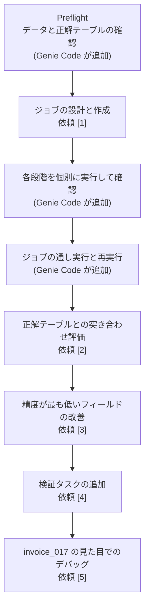
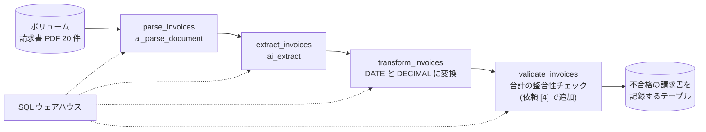
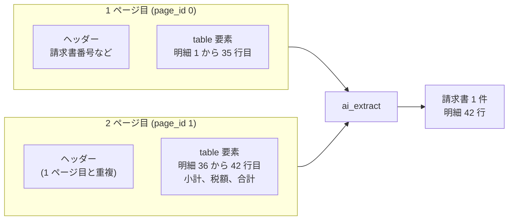
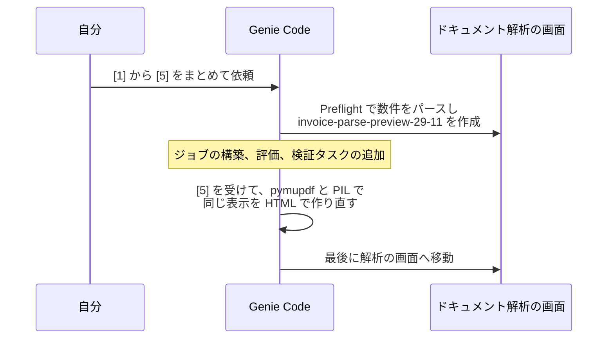

# はじめに

Databricks のドキュメントに、Genie Code でドキュメント処理パイプラインを構築するページがあります。

- [インテリジェントな文書処理に Genie Code を使用する](https://docs.databricks.com/aws/ja/large-language-models/genie-code-document-processing)

冒頭には「Genie Code は、パース、分類、抽出、検証をオーケストレーションすることで、ドキュメント処理パイプラインをエンドツーエンドで構築します」とあります。新しい関数が増えたわけではありません。`ai_parse_document` や `ai_extract` といった既存の AI Functions を、Genie Code が組み合わせてジョブにしてくれる、という話です。

ドキュメントでは、ジョブを作るだけでなく、正解データに対する評価と改善のループ (ヒルクライミング) まで面倒を見ると説明されています。実際に架空の請求書 PDF を 20 件用意して、ジョブの構築から評価、検証タスクの追加、見た目でのデバッグまで一通り頼んでみました。途中で、頼まなくてよかった指示を出していたことにも気づいたので、そのあたりも含めて書いていきます。

# Genie Code のドキュメント処理でできること

ドキュメントの「Genie Codeで何ができるのですか？」の節には、次の 5 つが挙がっています。

- エンドツーエンドのドキュメント処理ジョブを構築する
- 評価とヒルクライミングによる抽出品質の向上
- 結果の検証と例外のルーティング
- ドキュメントを視覚的にデバッグする
- 既存のパイプラインを検査およびトラブルシューティングする

使われる関数は次の 3 つで、関数ごとに独立したタスクになると説明されています。

| 関数 | 役割 |
|---|---|
| [ai_parse_document](https://docs.databricks.com/aws/ja/sql/language-manual/functions/ai_parse_document) | PDF などをテキスト、表、レイアウトを含む構造化データに変換する |
| [ai_classify](https://docs.databricks.com/aws/ja/sql/language-manual/functions/ai_classify) | ドキュメントを指定したラベルに分類する |
| [ai_extract](https://docs.databricks.com/aws/ja/sql/language-manual/functions/ai_extract) | スキーマに沿ってフィールドを抽出する |

要件は、Genie Code のエージェント機能の要件と AI Functions の要件を満たしていること、ソースのボリュームと結果を書き込むスキーマへの Unity Catalog の権限があることです。

# 検証用の請求書を用意する

評価とヒルクライミングを試すには、正解が分かっているドキュメントが必要です。そこで、架空の請求書 PDF を Python で 20 件生成し、正解テーブルも同時に作りました。会社名と住所はすべて架空です。

挙動を観察しやすいよう、5 種類の請求書を混ぜています。

| test_case | 件数 | 内容 |
|---|---|---|
| standard | 12 | 1 ページの通常の請求書 |
| multipage | 2 | 明細が 35 行以上あり、複数ページにまたがる |
| total_mismatch | 2 | 印字された合計が、小計と税額の和と一致しない |
| scanned | 2 | テキスト層のない画像 PDF。わずかに傾け、ノイズを加えている |
| date_format | 2 | 日付が `August 14, 2026` や `14 Aug 2026` の書式 |

テキスト PDF は reportlab で描きました。サーバーレスのノートブックでは最初にインストールします。

```python
%pip install reportlab
```

```python
dbutils.library.restartPython()
```

scanned の 2 件は Pillow で画像として描き、そのまま PDF として保存しています。PDF にテキスト層がないので、パースには OCR が必要になります。

```python
from PIL import Image

# 描画済みの画像 img をスキャン風にする: わずかに傾け、点状のノイズを加える
img = img.rotate(rnd.uniform(-1.2, 1.2), resample=Image.BICUBIC, fillcolor=255)
px = img.load()
for _ in range(6000):
    x, y = rnd.randrange(W), rnd.randrange(H)
    px[x, y] = rnd.randint(90, 200)

# 画像のまま PDF にする。テキスト層は付かない
img.save(path, "PDF", resolution=150.0)
```


正解テーブルは、請求書単位の `invoice_eval` と明細単位の `invoice_eval_line_items` の 2 つです。どちらも `file_name` で抽出結果と突き合わせます。

| テーブル | 主な列 |
|---|---|
| invoice_eval | file_name, test_case, vendor_name, invoice_number, invoice_date, due_date, currency, subtotal, tax_amount, total_amount, line_item_count, total_is_consistent |
| invoice_eval_line_items | file_name, line_no, description, quantity, unit_price, amount |

`test_case` と `total_is_consistent` は検証用の目印で、抽出する項目ではありません。`total_amount` には PDF に印字された合計を入れているので、total_mismatch の 2 件ではこの値が小計と税額の和と一致しません。

Genie Code が評価に使う正解テーブルの形式はドキュメントに書かれていなかったので、`file_name` で突き合わせる素直な形にしています。

素材を作った段階で、通常、複数ページ、画像 PDF の 3 件に `ai_parse_document` をかけ、いずれもパースが通ることを確かめてから Genie Code に渡しました。

# Genie Code に依頼する

Genie Code は、Jobs & Pipelines ページか SQL エディタから開けます。最終的に作られるのがジョブなので、今回は Jobs & Pipelines ページから開きました。

依頼は 5 段階に分けて書き、まとめて 1 回で送りました。

```text
[1] ジョブの構築
@takaakiyayoi_catalog.genie_docproc.invoices に請求書の PDF があります。各請求書を解析し、次の項目を抽出して takaakiyayoi_catalog.genie_docproc スキーマにテーブルとして書き込むジョブを作ってください。
- ベンダー名、請求書番号、請求日、支払期日、通貨、小計、税額、合計
- 明細 (行番号、説明、数量、単価、金額)
請求日と支払期日は YYYY-MM-DD の日付型にしてください。

[2] 評価
抽出結果を正解テーブル @takaakiyayoi_catalog.genie_docproc.invoice_eval (明細は @takaakiyayoi_catalog.genie_docproc.invoice_eval_line_items) と file_name で突き合わせて評価し、精度が最も低いフィールドを特定してください。test_case 列と total_is_consistent 列は抽出対象ではありません。

[3] 改善
精度が最も低いフィールドについてスキーマと指示を改善し、評価を再実行して変更前と変更後を表示してください。

[4] 検証と振り分け
明細の金額の合計が小計と一致すること、小計と税額の和が合計と一致することを検証するタスクを追加し、検証に失敗した請求書は別のテーブルに残してください。

[5] 見た目でのデバッグ
invoice_017.pdf の解析結果を元のページの横に表示してください。
```

送ると、Genie Code はまず 8 項目の計画 (Plan) を立てました。

- Preflight: explore data sources
- Design and create IDP job
- Validate stages
- End-to-end run + replay
- Evaluate against ground truth
- Improve lowest accuracy field
- Add validation task
- Visual debug invoice_017


依頼にはなかった「Validate stages」と「End-to-end run + replay」が入っています。ジョブを作ったらすぐ評価に進むのではなく、各段階を個別に確かめてから通しで実行し、さらにもう一度実行して結果が変わらないことを確かめる、という手順です。

依頼した [1] から [5] と、計画の各項目の対応を図にすると次のようになります。



# 下調べでデータと正解テーブルを確認する

最初の Preflight では、ボリュームの中身と正解テーブルのスキーマを確認し、数件の請求書を実際にパースしていました。正解テーブルの `currency` の値が何種類あるかもクエリで確かめ、「通貨は全て USD です」と判断してから設計に進んでいます。

この段階で、アセットとして `invoice-parse-preview-29-11` が作られていました。これがドキュメント解析の画面 ([Document Parsing UI](https://docs.databricks.com/aws/ja/agents/agent-bricks/document-parsing)) です。後の節で触れますが、これが最後の [5] の話につながります。

# ジョブは SQL タスクの直列で作られる

Genie Code はワークスペースに `invoice_processing` フォルダを作り、SQL ファイルを 3 つ書きました。

| タスク | SQL ファイル | 役割 |
|---|---|---|
| parse_invoices | 01_parse_invoices.sql | `ai_parse_document` で PDF を解析 |
| extract_invoices | 02_extract_invoices.sql | `ai_extract` でフィールドを抽出 |
| transform_invoices | 03_transform_invoices.sql | VARIANT から型付きテーブル (DATE, DECIMAL) に変換 |

分類は頼んでいないので、`ai_classify` のタスクはありません。ドキュメントの説明どおり、関数ごとにタスクが分かれています。

最終的には [4] で検証タスクが加わり、次の構成になりました。4 つのタスクはどれも同じ SQL ウェアハウスで実行されます。



ジョブを作る前には、変更内容が差分で表示され、承認を求められます。


差分を見ると、各タスクは `sql_task` で、`file` の `source` が `WORKSPACE`、実行先は `warehouse_id` で指定された SQL ウェアハウスです。サーバーレスのジョブコンピュートではなく、SQL ウェアハウスで動くジョブになります。SQL ファイルを実行するタスクなので、当然といえば当然です。コストを見積もるときは、ウェアハウスのサイズと起動時間を前提にすることになります。

差分の下には「This change was flagged as potentially unsafe: New tasks added; runs code that wasn't in the original job.」という注意が出ます。元のジョブになかったコードが実行されるようになる変更は、承認を経て反映される作りです。

## 各段階を個別に確かめてからジョブを流す

Genie Code はジョブ全体を流す前に、各 SQL ファイルをウェアハウス上で 1 つずつ実行して確かめていました。

最初のパースの検証では、次のように実行前に止まりました。


SQL に `CREATE OR REPLACE TABLE` が含まれていて、既存の `parsed_invoices` テーブルを上書きするため、破壊的な操作として実行前に確認を求めています。残りの処理は読み取りと表示だけなので安全だ、という判断まで添えられていました。承認するとそのまま進みます。

パース、抽出、変換の 3 段階がそれぞれ通ったあと、「ヘッダー 20 件、明細 154 件 — 正解テーブルと件数が一致しています」と確認してから、ジョブの通し実行に移りました。ジョブの実行は `databricks jobs run-now` で、これも実行前に確認が入ります。


通し実行は 3 分ほどで、3 タスクとも成功しました。

# 評価では全フィールドが 100% だった

続いて正解テーブルとの突き合わせです。結果は、ヘッダー 8 フィールドと明細 4 フィールドの計 12 フィールドがすべて 100% 正解でした。

Genie Code は 100% という結果をそのまま受け取らず、突き合わせで漏れた行がないかを両方向から確認していました。JOIN できなかった行があると、見かけ上の精度が上がってしまうためです。不一致の行もゼロでした。


その結果、[3] の改善は「改善すべきフィールドがない状態です」となり、スキップされました。

ここは素材の側の問題です。画像 PDF の 2 件も、日付の書式が違う 2 件も、明細が 40 行近くある 2 件も、すべて正しく読めていました。

素材を作ったノートブックで `ai_parse_document` の出力を見ると、その理由が分かります。テキスト PDF の invoice_001 では、ほとんどの要素の `confidence` が `1` で、表の要素だけが `0.9954` でした。画像 PDF の invoice_017 でも、すべての要素が `0.98` から `0.99` 台に収まっています。OCR を通した分だけ信頼度は下がりますが、下がり幅はごくわずかでした。

複数ページの invoice_013 では、表がページごとに別々の `table` 要素として返ってきました。請求書番号などのヘッダー部分も、2 ページ目で重複して出ています。



それでも抽出結果の明細は 154 行で正解と一致したので、ページをまたいだ表は `ai_extract` の段階で 1 件の請求書としてまとめられていたことになります。

reportlab で描いた請求書はレイアウトが整いすぎていて、今回の構成では抽出を間違える余地がほとんどなかったのだと思います。ヒルクライミングの動きを見るには、もっと崩れた素材が必要です。

# 検証タスクが 4 つ目のタスクとして追加される

[4] の検証では、`04_validate_invoices.sql` が作られ、ジョブに 4 つ目のタスクとして追加されました。


`validate_invoices` は `transform_invoices` に依存し、`run_if: ALL_SUCCESS` で前のタスクがすべて成功したときだけ動きます。検証に失敗した請求書は、別のテーブルに記録される形になりました。


また、[4] に取りかかる前に、ジョブをもう一度流す「Replay run the job for idempotency check」を実行していました。同じジョブを 2 回流しても結果が変わらないか (冪等性) を確かめるためです。計画にあった「End-to-end run + replay」の replay がこれです。

振り分けられるべきなのは total_mismatch の invoice_015 と invoice_016 の 2 件です。どの請求書が別テーブルに入ったかは、今回は確認できていません。

# 見た目でのデバッグは頼まなくても付いてくる

最後の [5] では、Genie Code が pymupdf と PIL で PDF のページ画像にバウンディングボックスを重ね、抽出結果と並べた HTML を `displayHTML` で描きました。


その後、ドキュメント解析の画面に移動して終わっています。


こちらがドキュメントの「ドキュメントを視覚的にデバッグする」で説明されている画面です。左に元のページとバウンディングボックス、右にパース結果が並びます。表の領域にカーソルを合わせると「テーブル | 信頼度 0.99」のように、要素の種類と信頼度が表示されます。

ここが今回の一番の気づきでした。この画面は、下調べの段階で Genie Code が数件をパースしたときに、`invoice-parse-preview-29-11` として最初から作られていました。つまり、見た目でのデバッグ画面は頼まなくても付いてきます。

時系列で並べると次のとおりです。



[5] はドキュメントのプロンプト例 (「PDFの解析結果を元のページの横に表示してください」) を参考に書いたものですが、すでに画面がある状態でこれを頼んだため、Genie Code は同じ表示を HTML で作り直すことになりました。途中で抽出結果を取り直す手間も発生しています。パースの結果を見たいだけなら、アセット一覧にある解析のプレビューを開けば足ります。

# 操作の承認について

今回の流れでは、次の操作で実行前に確認が入りました。

- 既存テーブルを上書きする SQL (`CREATE OR REPLACE TABLE`) の実行
- ジョブの作成と、タスクの追加
- CLI からのジョブ実行 (`databricks jobs run-now`)

確認の欄では「毎回確認」と「常に現在のチャットで許可」を選べます。読み取りだけのクエリは「常に現在のチャットで許可」にしておき、書き込みやジョブの変更は毎回見る、という使い分けができます。作られた SQL ファイルやジョブはアセット一覧に並び、「すべて承認」「すべて拒否」でまとめて扱えます。

# まとめ

Genie Code にドキュメント処理パイプラインを作らせてみて分かったことをまとめます。

- ジョブは `ai_parse_document`、`ai_extract`、変換の SQL タスクの直列で作られる。後から検証タスクが 4 つ目として追加される
- **タスクは SQL ファイルを SQL ウェアハウスで実行する形。サーバーレスのジョブコンピュートではない**
- ジョブを流す前に、各段階を個別に実行して件数まで確かめる。依頼していない手順だが計画に自動で入る
- 評価で 100% が出ても、突き合わせで漏れた行がないかを両方向から確認する
- 既存テーブルの上書き、ジョブの変更、ジョブの実行は、実行前に確認が入る
- **ドキュメント解析の画面は、下調べでパースした時点でアセットとして作られる。見た目でのデバッグを別途頼む必要はない**
- 整ったレイアウトの合成 PDF では全フィールドが 100% になり、改善のループは動かなかった

一番の収穫は、ドキュメントのプロンプト例をそのまま全部並べる必要はない、と分かったことでした。例に挙がっている操作の中には、Genie Code が頼まなくても手順に組み込むものがあります。まず目的だけを伝えて、何が自動で出てくるかを見てから、足りない部分を頼むほうが無駄がなさそうです。評価と改善のループは今回動かせなかったので、印字のかすれや罫線のない表、ラベルの表記揺れを混ぜた素材で改めて試してみます。

# 参考リンク

- [インテリジェントな文書処理に Genie Code を使用する](https://docs.databricks.com/aws/ja/large-language-models/genie-code-document-processing)
- [Document Parsing UI](https://docs.databricks.com/aws/ja/agents/agent-bricks/document-parsing)
- [ai_parse_document 関数](https://docs.databricks.com/aws/ja/sql/language-manual/functions/ai_parse_document)
- [ai_classify 関数](https://docs.databricks.com/aws/ja/sql/language-manual/functions/ai_classify)
- [ai_extract 関数](https://docs.databricks.com/aws/ja/sql/language-manual/functions/ai_extract)
- [AI Functions を活用したドキュメントインテリジェンス](https://docs.databricks.com/aws/ja/agents/agent-bricks/idp-pipeline-tutorial)
- [Genie Code の機能とケイパビリティ](https://docs.databricks.com/aws/ja/genie-code/features-capabilities)

### はじめてのDatabricks

[はじめてのDatabricks](https://qiita.com/taka_yayoi/items/8dc72d083edb879a5e5d)

### Databricks無料トライアル

[Databricks無料トライアル](https://databricks.com/jp/try-databricks)
