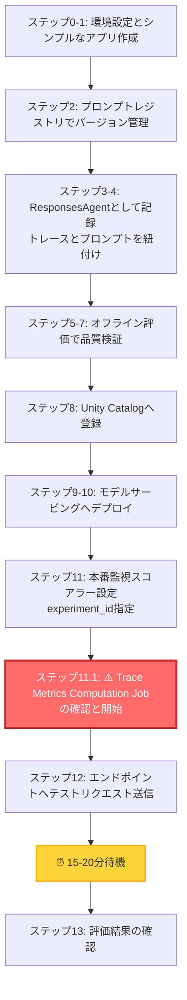
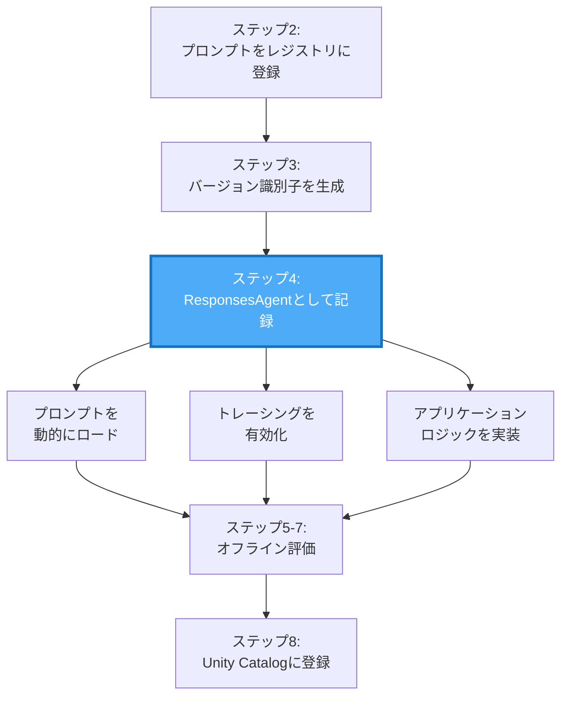

ここ数週間、こちらで説明されている機能を咀嚼していました。

https://docs.databricks.com/aws/ja/mlflow3/genai/#gsc.tab=0

以下の記事はその取り組みの足跡です。

- [Databricksにおける生成AIの本番運用モニタリング](https://qiita.com/taka_yayoi/items/9fea5d25b917f117c79e)
- [Databricksにおけるプロンプトの評価](https://qiita.com/taka_yayoi/items/10a8dead6e976453c83b)
- [MLflow LoggedModel 完全ガイド](https://qiita.com/taka_yayoi/items/7e1481ad8a988eb54aeb)
- [Databricksにおける生成AIアプリケーションとプロンプトのバージョン管理](https://qiita.com/taka_yayoi/items/7110c4aa9a2a6f545df9)
- [Databricksにおけるプロンプトの最適化](https://qiita.com/taka_yayoi/items/1a3aa9b381a81a200f6e)
- [DatabricksとMLflowによる人間のフィードバック収集を通じた生成AIアプリの品質改善](https://qiita.com/taka_yayoi/items/0ab0e5cd21f5296bd938)
- [Databricksにおけるトレース機能搭載エージェントのデプロイ](https://qiita.com/taka_yayoi/items/eebb94645a721a0ab624)
- [Databricksで本格運用されているAIエージェントの監視](https://qiita.com/taka_yayoi/items/b2e1aa4d85c6d0917b40)
- [MLflow 3のLoggedModelデータモデル完全ガイド](https://qiita.com/taka_yayoi/items/0f5fd36bbc6cd540f669)

で、ようやく一通り動かせるようになったのでこちらにまとめます。いやー、大変でした。ノートブックはこちらです。

https://github.com/taka-yayoi/llmops-on-databricks/blob/main/Databricks%E3%81%A8MLflow%E3%81%AB%E3%82%88%E3%82%8BLLMOps.py

:::note info
**注意**
今回カバーしている機能にはベータ版の物も含まれます。今後機能が変更される可能性があることにご注意ください。
:::

# LLMOpsとは

LLMアプリケーションの開発・運用には従来とは異なるアプローチが必要です。LLMOps（Large Language Model Operations）は、LLMを活用したアプリケーションの開発、デプロイ、監視、改善のライフサイクル全体を管理するための方法論とツールセットです。

https://www.databricks.com/jp/glossary/llmops

# 生成AIアプリケーション: 開発から本番運用までの完全ワークフロー

このノートブックは、Databricks上で生成AIアプリケーションを開発し、本番運用まで一貫して管理・評価・デプロイするための実践的なワークフローを解説します。

事前に環境変数を定義する`.env`ファイルを作っておきます。`DATABRICKS_TOKEN`にはパーソナルアクセストークンを指定しておきます。これは、後ほど触れる[プロンプトレジストリにモデルサービングエンドポイントからアクセス](https://docs.databricks.com/gcp/ja/mlflow3/genai/prompt-version-mgmt/prompt-registry/use-prompts-in-deployed-apps#mosaic-ai-agent-framework-%E3%82%92%E4%BD%BF%E7%94%A8%E3%81%97%E3%81%A6%E3%83%87%E3%83%97%E3%83%AD%E3%82%A4%E3%81%95%E3%82%8C%E3%81%9F%E3%82%A8%E3%83%BC%E3%82%B8%E3%82%A7%E3%83%B3%E3%83%88%E3%81%A7%E3%83%97%E3%83%AD%E3%83%B3%E3%83%97%E3%83%88-%E3%83%AC%E3%82%B8%E3%82%B9%E3%83%88%E3%83%AA%E3%82%92%E4%BD%BF%E7%94%A8%E3%81%99%E3%82%8B)するために必要となります。

```.env
DATABRICKS_HOST=https://xxxx.cloud.databricks.com/
DATABRICKS_TOKEN=dapi...
```

## 📚 参考ドキュメント

**日本語ドキュメント:**
- [MLflow 3 for GenAI（日本語）](https://docs.databricks.com/ja/mlflow3/genai/)
- [本番監視（日本語）](https://docs.databricks.com/ja/mlflow3/genai/eval-monitor/production-monitoring.html)
- [スコアラー（日本語）](https://docs.databricks.com/ja/mlflow3/genai/eval-monitor/concepts/scorers.html)

**英語ドキュメント:**
- [MLflow Tracing（英語）](https://mlflow.org/docs/latest/genai/tracing/)
- [ResponsesAgent API（英語）](https://mlflow.org/docs/latest/python_api/mlflow.pyfunc.html#mlflow.pyfunc.ResponsesAgent)

## 🎯 このノートブックの目的

生成AIアプリケーションの開発から本番運用まで、以下の全工程を実装します：

1. **開発**: プロンプト管理、トレーシング、エージェント実装
2. **評価**: オフライン評価による品質検証
3. **デプロイ**: Unity Catalog登録、モデルサービングへの展開
4. **運用**: 本番監視による継続的な品質管理

## 🔑 重要な仕様と実装上の注意点

### LoggedModel - ライフサイクル管理の中心

**LoggedModelとは**:
- MLflowにおける**一級エンティティ（First-class Entity）** で、生成AIアプリケーションのライフサイクル全体を管理する中心的な概念
- `mlflow.pyfunc.log_model()`で作成し、開発→評価→デプロイ→監視の全フェーズでモデルを軸に管理

**LoggedModelの重要性**:
1. **統一されたモデル表現**: 従来のMLモデルから複雑なGenAIエージェントまで、単一の抽象化で管理
2. **観測性の統合**: トレース、評価結果、メトリクスが自動的にリンクされ、モデルの挙動を包括的に可視化
3. **プロンプトとの相互リンク**: `prompts`パラメータで双方向リンクを構築
   - LoggedModel → Prompt: モデルのメタデータ（MLmodelファイル）に記録
   - Prompt → LoggedModel: Prompt Registry UIから追跡可能
4. **アクティブモデル設定**: `mlflow.set_active_model()`で以降のトレース・評価が自動的に関連付け

参考: [LoggedModelのコンセプト（英語）](https://mlflow.org/docs/3.2.0rc0/genai/data-model/logged-model/)

### ResponsesAgentインタフェース
- MLflow 3では`mlflow.pyfunc.ResponsesAgent`を継承することが推奨されています
- 入力スキーマは`{"input": [{"role": "user", "content": "..."}]}`形式（`messages`ではない）
- 出力は`ResponsesAgentResponse`オブジェクトで返す必要があります
- 参考: [ResponsesAgent API（英語）](https://mlflow.org/docs/latest/python_api/mlflow.pyfunc.html#mlflow.pyfunc.ResponsesAgent)

### トレーシング
- トレースは**エクスペリメントに直接ログ**される必要があります（Run内ではない）
- `mlflow.genai.evaluate()`でモデルを評価
- 参考: [MLflow Tracing（英語）](https://mlflow.org/docs/latest/genai/tracing/)

### 本番監視スコアラー
- **⚠️ デプロイ前にスコアラーを設定**: エンドポイントデプロイ**前に**スコアラーを登録・開始することで、Trace Metrics Computation JobがActive状態で作成されます
  - デプロイ前: Trace Metrics Computation JobがActive ✅
  - デプロイ後: Trace Metrics Computation JobがPaused（手動Resumeが必要）❌
- **experiment_idの明示的な指定を推奨**: `register(experiment_id=...)`と`start(experiment_id=...)`で指定（省略時はアクティブなエクスペリメントを使用）
- **初期処理に15-20分かかります**: スコアラーをスケジューリングした後、最初のバッチ処理が実行されるまで時間がかかります
- 参考: [Production monitoring（日本語）](https://docs.databricks.com/ja/mlflow3/genai/eval-monitor/production-monitoring.html)

### Logged Modelとプロンプトの相互リンク（3つの方法）
1. **`prompts=[...]`パラメータ**（MLflow 3推奨・最重要）← 相互リンクを構築
2. **MLflowタグ**（`prompt_name`, `prompt_alias`, `prompt_uri`）← 検索・フィルタリング用
3. **`model_config`** でプロンプト設定をモデルに埋め込み ← モデルロード時の動的プロンプトロード用

## 🔄 ワークフローの全体像



## 実装する機能:

1. **シンプルな生成AIアプリの作成** - databricks-llama-4-maverickを使用
2. **プロンプトレジストリの連携** - バージョン管理されたプロンプトの使用
3. **トレースの取得** - アプリケーションの動作を可視化
4. **ResponsesAgentとして記録** - プロンプトとトレースを紐付け（アプリケーションロジック含む）
5. **評価用データセットの準備** - ResponsesAgent形式のテストデータ作成（`input`フィールドを使用）
6. **Scorerの定義** - 評価メトリクスの設定
7. **オフライン評価** - サンプルデータで品質評価
8. **Unity Catalogへのモデル登録** - 評価後に本番用レジストリへ登録
9. **モデルサービングへのデプロイ** - 本番環境への展開
10. **本番運用のScorer定義** - 継続的な品質監視
11. **エンドポイントへの問い合わせ** - 本番APIのテスト
12. **評価結果の確認** - モニタリング結果の分析
12. **トレースのアーカイブ** - トレースをDeltaテーブルに保存

## セットアップ: 必要なライブラリのインストール

このステップでは、MLflowやDatabricks Agentsなど、生成AIアプリケーションの開発・運用に必要なライブラリをインストールします。

```py
%pip install --upgrade "mlflow[databricks]>=3.1.0" openai databricks-agents "pydantic>=2.0" python-dotenv
dbutils.library.restartPython()
```

## ステップ0: 環境設定と初期化

DatabricksのMLflowやUnity Catalogの設定を行い、アプリケーションの実験管理やプロンプト管理の準備をします。

```py
import mlflow
import os
import subprocess
import json
from databricks.sdk import WorkspaceClient
from datetime import datetime
import time
from typing import Dict, List, Optional, Any
from pydantic import BaseModel
import pandas as pd

# MLflow設定
mlflow.set_tracking_uri("databricks")

# Unity Catalogスキーマ設定（プロンプトレジストリ、モデル、テーブル用）
# 必要に応じて変更してください
UC_SCHEMA = "takaakiyayoi_catalog.llmops"
spark.sql(f"CREATE SCHEMA IF NOT EXISTS {UC_SCHEMA}")

# エクスペリメント設定
EXPERIMENT_NAME = "/Workspace/Users/takaaki.yayoi@databricks.com/20251008_llmops/genai-complete-workflow-demo"
mlflow.set_experiment(EXPERIMENT_NAME)

# アプリケーション名
APP_NAME = "customer_support_assistant"

# モデル名（databricks-llama-4-maverickを使用）
MODEL_NAME = "databricks-llama-4-maverick"

print(f"✅ 環境設定完了")
print(f"   - Unity Catalog Schema: {UC_SCHEMA}")
print(f"   - MLflow Experiment: {EXPERIMENT_NAME}")
print(f"   - Model: {MODEL_NAME}")
```

```
2025/10/26 05:37:09 INFO mlflow.tracking.fluent: Experiment with name '/Workspace/Users/takaaki.yayoi@databricks.com/20251008_llmops/genai-complete-workflow-demo' does not exist. Creating a new experiment.
✅ 環境設定完了
   - Unity Catalog Schema: takaakiyayoi_catalog.llmops
   - MLflow Experiment: /Workspace/Users/takaaki.yayoi@databricks.com/20251008_llmops/genai-complete-workflow-demo
   - Model: databricks-llama-4-maverick
```

この時点でエクスペリメントが作成されます。以降は頻繁にアクセスすることになります。


## ステップ1: Agent Framework互換スキーマの定義とシンプルなアプリの作成

このステップでは、OpenAI互換のスキーマを定義し、最も基本的な生成AIアプリケーションを作成します。

```py
# OpenAI互換のクライアントを初期化（Databricks LLMへの接続）
mlflow.openai.autolog()  # トレーシングを有効化

w = WorkspaceClient()
client = w.serving_endpoints.get_open_ai_client()

# Agent Framework互換のスキーマ定義
class ChatMessage(BaseModel):
    role: str
    content: str

class ChatCompletionRequest(BaseModel):
    messages: List[ChatMessage]
    temperature: Optional[float] = 0.7
    max_tokens: Optional[int] = 500
    stream: Optional[bool] = False

# シンプルな生成AIアプリケーション（初期版）
@mlflow.trace
def simple_customer_support_app(company_name: str, topic: str, question: str):
    """シンプルなカスタマーサポートアプリケーション（初期版）"""
    
    prompt = f"""
    あなたは{company_name}の親切で丁寧なカスタマーサポート担当者です。
    
    トピック: {topic}
    お客様の質問: {question}
    
    お客様のご心配に寄り添い、親しみやすくプロフェッショナルな回答をしてください。
    """
    
    response = client.chat.completions.create(
        model=MODEL_NAME,
        messages=[
            {"role": "system", "content": "あなたは親切なカスタマーサポート担当者です。"},
            {"role": "user", "content": prompt}
        ],
        temperature=0.7,
        max_tokens=500
    )
    
    return response.choices[0].message.content

# テスト実行
print("📱 シンプルなアプリのテスト:")
result = simple_customer_support_app(
    company_name="TechCorp",
    topic="請求",
    question="先月、サブスクリプション料金が二重に請求されました。ご対応いただけますか？"
)
print(f"\n応答: {result[:200]}...")
```
```
📱 シンプルなアプリのテスト:

応答: お世話になります。TechCorpのカスタマーサポートでございます。お客様のお名前を伺ってもよろしいでしょうか？お客様の請求に関するご質問にお答えするために、できるだけ迅速かつ正確に対応させていただきます。二重請求の件、まずはお客様に起こった不便をお詫び申し上げます。お手数ですが、以下を確認させていただけますでしょうか？

1. お客様のお名前
2. アカウントに関連付けられたメールアドレス
3....
```

トレースが表示されます。今回色々触って改めて思ったのは、このトレースの重要性でした。トレースがあって初めてLLMOpsにおいて重要な**評価**ができるわけなので。


エクスペリメントの画面でもトレースを確認できます。


## ステップ2: プロンプトレジストリの連携

### 🎯 このステップの目的

プロンプトをUnity Catalogのプロンプトレジストリに登録し、バージョン管理を実現します。

### 📚 背景知識

**プロンプトレジストリとは？**
- プロンプトをUnity Catalogで一元管理する機能
- Gitのようにプロンプトのバージョン管理が可能
- エイリアス（`latest`、`production`など）で特定バージョンを参照
- 参考: [MLflow 3 for GenAI - Prompt Engineering](https://docs.databricks.com/ja/mlflow3/genai/)

**なぜプロンプトレジストリを使うのか？**
1. **再現性**: 過去のプロンプトバージョンを正確に再現できる
2. **コラボレーション**: チーム全体でプロンプトを共有・管理
3. **監査**: プロンプトの変更履歴を追跡
4. **モデルとの紐付け**: 後続のステップでモデルとプロンプトを関連付け

### 🔄 ワークフローでの位置づけ


### 💡 実装のポイント

- **テンプレート変数**: `{{variable_name}}`形式で動的な値を埋め込み
- **エイリアス**: `latest`エイリアスを明示的に設定（自動付与されない場合がある）
- **タグ**: メタデータをタグとして記録（作成者、用途など）
- **コミットメッセージ**: 変更内容を記録（Gitと同様）

```py
# プロンプトレジストリへの登録
prompt_name = "customer_support_prompt"

# プロンプトテンプレートの定義
initial_template = """\
あなたは{{company_name}}の親切で共感力のあるカスタマーサポート担当者です。

お客様が問い合わせている内容: {{topic}}
お客様の質問: {{question}}

以下の点に注意して回答してください:
1. お客様のご心配に共感し、気持ちに寄り添う
2. 明確な解決策や次のステップを提示する
3. 親しみやすく、プロフェッショナルな口調を保つ
4. 必要に応じて追加のサポートを提案する

簡潔かつ丁寧に、専門用語は必要な場合のみ使用してください。
"""

# プロンプトをレジストリに登録
try:
    prompt = mlflow.genai.register_prompt(
        name=f"{UC_SCHEMA}.{prompt_name}",
        template=initial_template,
        commit_message="構造化ガイドライン付きの初期カスタマーサポートプロンプト",
        tags={
            "author": "data-team@company.com",
            "use_case": "customer_service",
            "department": "customer_support",
            "language": "ja",
            "version_type": "initial"
        }
    )
    print(f"✅ プロンプトをレジストリに登録: '{prompt.name}' (バージョン {prompt.version})")

    # 明示的にlatestエイリアスを付与
    mlflow.genai.set_prompt_alias(
        name=f"{UC_SCHEMA}.{prompt_name}",
        alias="latest",
        version=prompt.version
    )
    print(f"✅ latestエイリアスをバージョン{prompt.version}に付与")
except Exception as e:
    print(f"⚠️ プロンプト登録エラー（既存の可能性）: {e}")
    # 既存のプロンプトを取得（latestエイリアスを使用）
    prompt = mlflow.genai.load_prompt(f"prompts:/{UC_SCHEMA}.{prompt_name}@latest")
    print(f"✅ 既存のプロンプトを使用: バージョン {prompt.version}")
```
```
✅ プロンプトをレジストリに登録: 'takaakiyayoi_catalog.llmops.customer_support_prompt' (バージョン 1)
✅ latestエイリアスをバージョン1に付与
```

上で最新のプロンプトバージョンに`latest`エイリアスを付与しているのも重要なポイントです。あとで、モデルサービングエンドポイントにエージェントをデプロイした際、エージェントはプロンプトの**バージョン番号を参照できない仕様**となっており、代わりにエイリアスを指定する必要があるためです。

エクスペリメントの画面の**プロンプト**タブにアクセスします。この時点では何も表示されていません。


右上の**スキーマを選択**をクリックします。上のコードで指定しているプロンプトの保存先のスキーマを選択します。


これでプロンプトレジストリにアクセスできます。


## ステップ3: バージョン識別子の生成とアプリケーション関数の定義

このステップでは、Gitコミットやタイムスタンプを使ってアプリケーションのバージョンを一意に識別し、プロンプトレジストリ連携版のアプリケーション関数を定義します。

:::note info
**重要**: `mlflow.models.set_model()`を使用してトレースとモデルを関連付けます。
:::

```py
# バージョン識別子の生成（Gitコミットハッシュまたはタイムスタンプ）
def get_version_identifier():
    try:
        git_commit = subprocess.check_output(
            ["git", "rev-parse", "HEAD"]
        ).decode("ascii").strip()[:8]
        return f"git_{git_commit}"  # UC命名規則に準拠（ハイフンをアンダースコアに）
    except:
        # Gitが使用できない場合はタイムスタンプを使用
        return f"v_{datetime.now().strftime('%Y%m%d_%H%M%S')}"  # UC命名規則に準拠

version_identifier = get_version_identifier()
print(f"📝 バージョン識別子: {version_identifier}")

# Agent Framework互換のアプリケーション関数（改良版）
@mlflow.trace
def customer_support_agent_app(model_input: Dict[str, Any]) -> Dict[str, Any]:
    """Agent Framework互換のカスタマーサポートアプリケーション"""
    
    # ChatCompletionRequest形式の入力を処理
    messages = model_input.get("messages", [])
    temperature = model_input.get("temperature", 0.7)
    max_tokens = model_input.get("max_tokens", 500)
    
    # 最後のユーザーメッセージから情報を抽出
    if messages:
        user_message = messages[-1].get("content", "")
        # シンプルなパース（本番環境ではより洗練されたパースを実装）
        company_name = "TechCorp"  # デフォルト値
        topic = "一般"
        question = user_message
        
        # プロンプトのフォーマット
        formatted_prompt = prompt.format(
            company_name=company_name,
            topic=topic,
            question=question
        )
    else:
        formatted_prompt = "こんにちは、ご用件をお聞かせください。"

    # LLMへのリクエスト
    response = client.chat.completions.create(
        model=MODEL_NAME,
        messages=[
            {"role": "system", "content": "あなたはTechCorpの親切なカスタマーサポート担当者です。"},
            {"role": "user", "content": formatted_prompt}
        ],
        temperature=temperature,
        max_tokens=max_tokens
    )
    
    # Agent Framework互換の応答形式
    return {
        "choices": [{
            "message": {
                "role": "assistant",
                "content": response.choices[0].message.content
            },
            "finish_reason": "stop",
            "index": 0
        }],
        "model": MODEL_NAME,
        "usage": {
            "prompt_tokens": response.usage.prompt_tokens if hasattr(response, 'usage') else 0,
            "completion_tokens": response.usage.completion_tokens if hasattr(response, 'usage') else 0,
            "total_tokens": response.usage.total_tokens if hasattr(response, 'usage') else 0
        }
    }

# テスト
print("\n🤖 Agent Framework形式のアプリテスト:")
agent_test_request = {
    "messages": [
        {"role": "user", "content": "請求に関する問題で助けが必要です。二重に請求されました。"}
    ],
    "temperature": 0.7,
    "max_tokens": 500
}
agent_result = customer_support_agent_app(agent_test_request)
print(f"応答: {agent_result['choices'][0]['message']['content'][:200]}...")
```
```py
fatal: not a git repository (or any parent up to mount point /)
Stopping at filesystem boundary (GIT_DISCOVERY_ACROSS_FILESYSTEM not set).
📝 バージョン識別子: v_20251026_054946

🤖 Agent Framework形式のアプリテスト:
応答: お困りのようですね。ご不便をおかけして申し訳ございません。二重請求の問題についてお手伝いさせていただきますね。

まず、ご請求内容について詳しくお伺いしてもよろしいでしょうか？具体的には、どの商品またはサービスに対して二重請求されたとお考えですか？また、請求書の日付や金額など、詳細な情報をお教えいただけますでしょうか？

この問題を解決するために、以下のステップを提案します。

1. ご請求の詳細...
```

## ステップ4: ResponsesAgentとして記録

### 🎯 このステップの目的

アプリケーションロジックをMLflow 3の`ResponsesAgent`インタフェースに準拠した形式で実装し、**LoggedModel**として記録することで、プロンプト・トレース・モデルを統合的に管理します。

### 📚 背景知識

**LoggedModelとは？（最重要コンセプト）**

Logged ModelはMLflowにおける**一級エンティティ（First-class Entity）** で、生成AIアプリケーションのライフサイクル全体を管理する中心的な概念です。

**LoggedModelの重要性**
1. **統一されたモデル表現**: 従来のMLモデルから複雑な生成AIエージェントまで、単一の抽象化で管理
2. **観測性の統合**: トレース、評価結果、メトリクスが自動的にリンクされ、モデルの挙動を包括的に可視化
3. **プロンプトとの相互リンク**: プロンプトレジストリと双方向リンクを構築（後述）
4. **ライフサイクル管理の中心**: 開発→評価→デプロイ→監視の全フェーズでモデルを軸に管理

参考:
- [LoggedModel概念（英語）](https://mlflow.org/docs/3.2.0rc0/genai/data-model/logged-model/)
- [log_model API（英語）](https://mlflow.org/docs/latest/python_api/mlflow.pyfunc.html#mlflow.pyfunc.log_model)

**ResponsesAgentとは？**
- MLflow 3で導入された生成AIアプリケーション用の標準インタフェース
- OpenAI Responses形式との互換性を提供
- トレーシング、評価、デプロイを統合的にサポート
- 参考: [ResponsesAgent API（英語）](https://mlflow.org/docs/latest/python_api/mlflow.pyfunc.html#mlflow.pyfunc.ResponsesAgent)

**ResponsesAgentの要件**
1. `mlflow.pyfunc.ResponsesAgent`を継承
2. `predict()`メソッドで`ResponsesAgentRequest`を受け取る
3. `ResponsesAgentResponse`を返す
4. 入力スキーマは`{"input": [{"role": ..., "content": ...}]}`形式

### 🔄 ワークフローでの位置づけ



### 💡 実装のポイント

**1. LoggedModelの作成: models from codeアプローチ**

`mlflow.pyfunc.log_model()`を使用してLoggedModelを作成します：
- モデルクラスをPythonファイル（`customer_support_agent.py`）として定義
- `python_model="customer_support_agent.py"`でファイルパスを指定
- デプロイ時にコードが自動的にパッケージ化される
- MLflow Runに関連付けられ、バージョン管理・再現性を確保

- 参考: [Models From Code](https://mlflow.org/docs/3.3.1/ml/model/models-from-code/)

**2. Logged Modelとプロンプトの相互リンク（重要！）**

`prompts`パラメータを使用して**双方向リンク**を構築します：

```python
mlflow.pyfunc.log_model(
    name="agent_model",
    python_model="customer_support_agent.py",
    prompts=[prompt_uri]  # ← ここで相互リンクを構築
)
```

**相互リンクの効果**:
- LoggedModel → Prompt: モデルのメタデータ（MLmodelファイル）に関連プロンプトが記録
- Prompt → LoggedModel: Prompt Registry UIからモデルへ移動可能
- プロンプト変更時の影響範囲を追跡しやすくなる
- `model_info.prompts`でプログラム的にアクセス可能

**補完的な記録方法**（3重の記録でさらに堅牢に）:
1. ✅ `prompts=[...]`パラメータ（**MLflow 3推奨・最重要**）
2. MLflowタグ（`prompt_name`, `prompt_alias`, `prompt_uri`）← 検索・フィルタリング用
3. `model_config`（設定値として埋め込み）← モデルロード時の動的プロンプトロード用

**3. 注意点**
- OutputItemは`.content`を使用（`.text`ではない）
- `mlflow.openai.autolog()`でLLM呼び出しを自動トレース
- `@mlflow.trace`デコレータでカスタムスパンを追加

### モデルクラスをPythonファイルとして作成

以下を実行することでエージェントの実装を含む`customer_support_agent.py`ファイルが作成されます。

```py
%%writefile customer_support_agent.py

import mlflow
from mlflow.pyfunc import ResponsesAgent
from mlflow.types.responses import ResponsesAgentRequest, ResponsesAgentResponse
from databricks.sdk import WorkspaceClient

# デフォルト値（create_agent()呼び出し時に上書きされます）
PROMPT_NAME = None
PROMPT_ALIAS = "latest"
LLM_MODEL = "databricks-llama-4-maverick"  # デフォルトのLLMエンドポイント
COMPANY_NAME = "TechCorp"

class CustomerSupportAgentLoggedModel(ResponsesAgent):
    """ResponsesAgentインタフェースに準拠したLoggedModel"""

    def __init__(self, prompt_name=None, prompt_alias="latest", llm_model=None, company_name="TechCorp"):
        """初期化"""
        self.prompt_name = prompt_name or PROMPT_NAME
        self.prompt_alias = prompt_alias or PROMPT_ALIAS
        self.model_name = llm_model or LLM_MODEL
        self.company_name = company_name or COMPANY_NAME

        # プロンプトを初期化（Noneで初期化し、後でロード）
        self.prompt = None
        if self.prompt_name:
            try:
                prompt_uri = f"prompts:/{self.prompt_name}@{self.prompt_alias}"
                self.prompt = mlflow.genai.load_prompt(prompt_uri)
            except:
                pass  # プロンプトが見つからない場合は無視

        # LLMクライアントは遅延初期化（predict時に初めて作成）
        self._client = None

    @property
    def client(self):
        """LLMクライアントの遅延初期化"""
        if self._client is None:
            w = WorkspaceClient()
            self._client = w.serving_endpoints.get_open_ai_client()
        return self._client

    @mlflow.trace(span_type="AGENT")
    def predict(self, request: ResponsesAgentRequest) -> ResponsesAgentResponse:
        """ResponsesAgentインタフェースに準拠した予測メソッド"""
        import mlflow

        # リクエストからメッセージを取得（inputはリスト型）
        messages = request.input if hasattr(request, 'input') else []

        # 最新のユーザーメッセージを取得
        user_message = ""
        if messages:
            for msg in reversed(messages):
                msg_role = msg.role if hasattr(msg, 'role') else msg.get('role', '')
                msg_content = msg.content if hasattr(msg, 'content') else msg.get('content', '')
                if msg_role == "user":
                    user_message = msg_content
                    break

        # リクエストプレビューを設定
        mlflow.update_current_trace(request_preview=f"User: {user_message[:50]}...")

        # プロンプトのフォーマット
        if user_message:
            topic = "一般"
            question = user_message

            # プロンプトが設定されている場合はフォーマット
            if self.prompt:
                formatted_prompt = self.prompt.format(
                    company_name=self.company_name,
                    topic=topic,
                    question=question
                )
            else:
                # プロンプトが設定されていない場合はデフォルトメッセージ
                formatted_prompt = f"{self.company_name}のカスタマーサポートです。{question}"
        else:
            formatted_prompt = "こんにちは、ご用件をお聞かせください。"

        # LLMへのリクエスト（スパンを使って詳細にトレース）
        with mlflow.start_span(name="llm_call") as span:
            attributes = {
                "model": self.model_name,
                "temperature": 0.7,
                "max_tokens": 500,
                "prompt_length": len(formatted_prompt),
            }
            # プロンプト名が設定されている場合のみ追加
            if self.prompt_name:
                attributes["prompt_template"] = self.prompt_name
            span.set_attributes(attributes)

            response = self.client.chat.completions.create(
                model=self.model_name,
                messages=[
                    {"role": "system", "content": f"あなたは{self.company_name}の親切なカスタマーサポート担当者です。"},
                    {"role": "user", "content": formatted_prompt}
                ],
                temperature=0.7,
                max_tokens=500
            )

            assistant_message = response.choices[0].message.content

            # 応答の詳細を記録
            span.set_attributes({
                "response_length": len(assistant_message),
                "finish_reason": "stop",
                "usage.prompt_tokens": response.usage.prompt_tokens if hasattr(response, 'usage') else 0,
                "usage.completion_tokens": response.usage.completion_tokens if hasattr(response, 'usage') else 0,
                "usage.total_tokens": response.usage.total_tokens if hasattr(response, 'usage') else 0
            })

        # ResponsesAgentResponseを返却
        return ResponsesAgentResponse(
            output=[
                self.create_text_output_item(
                    text=assistant_message,
                    id="msg_1"
                )
            ],
            custom_outputs={
                "model": self.model_name,
                "usage": {
                    "prompt_tokens": response.usage.prompt_tokens if hasattr(response, 'usage') else 0,
                    "completion_tokens": response.usage.completion_tokens if hasattr(response, 'usage') else 0,
                    "total_tokens": response.usage.total_tokens if hasattr(response, 'usage') else 0
                }
            }
        )


# OpenAIの自動ログを有効化
mlflow.openai.autolog()

# AGENTインスタンスをモジュールレベルで作成
# models from codeでデプロイする際は、モジュールレベルでset_model()を呼ぶ必要がある
AGENT = CustomerSupportAgentLoggedModel(
    prompt_name=PROMPT_NAME,
    prompt_alias=PROMPT_ALIAS,
    llm_model=LLM_MODEL,
    company_name=COMPANY_NAME
)

# モジュールレベルでset_model()を呼び出す（デプロイに必須）
mlflow.models.set_model(AGENT)

def create_agent(prompt_name, prompt_alias="latest", llm_model="databricks-llama-4-maverick", company_name="TechCorp"):
    """エージェントを作成する関数（テスト用）"""
    global AGENT, PROMPT_NAME, PROMPT_ALIAS, LLM_MODEL, COMPANY_NAME
    # グローバル変数を更新
    PROMPT_NAME = prompt_name
    PROMPT_ALIAS = prompt_alias
    LLM_MODEL = llm_model
    COMPANY_NAME = company_name
    # 新しいインスタンスを作成
    AGENT = CustomerSupportAgentLoggedModel(prompt_name, prompt_alias, llm_model, company_name)
    # 再度set_model()を呼び出す
    mlflow.models.set_model(AGENT)
    return AGENT
```

### ファイルが正しく作成されたか確認

ここで、上の実装をimportして動作確認も可能ですが、Pythonカーネルの再起動が必要であり、上で定義した変数などがリセットされてしまうので、今回はスキップします。以下で、ファイルが正しく作成されたか確認します。

```py
print("✅ モデルクラスファイルを作成: customer_support_agent.py")
with open("customer_support_agent.py", "r") as f:
    print(f"   ファイルサイズ: {len(f.read())} bytes")
```

```
✅ モデルクラスファイルを作成: customer_support_agent.py
   ファイルサイズ: 5866 bytes
```

別のノートブックで`customer_support_agent.py`をインポートして動作確認することは可能です。

### models from codeでLoggedModelを作成

```py
# ResponsesAgentでは入力例として使用（inputは辞書のリスト）
sample_input_example = {
    "input": [{"role": "user", "content": "こんにちは、助けが必要です"}]
}

with mlflow.start_run() as run:
    # プロンプトURIを準備
    prompt_uri = f"prompts:/{UC_SCHEMA}.{prompt_name}@latest"

    # Logged Modelを作成（promptsパラメータでプロンプトと相互リンク）
    logged_model_info = mlflow.pyfunc.log_model(
        name="agent_model",
        python_model="customer_support_agent.py",
        input_example=sample_input_example,
        pip_requirements=[
            "mlflow>=3.1.0",
            "databricks-sdk",
            "openai",
            "pydantic>=2.0"
        ],
        model_config={
            "prompt_name": f"{UC_SCHEMA}.{prompt_name}",
            "prompt_alias": "latest",
            "llm_model": MODEL_NAME,
            "company_name": "TechCorp"
        },
        prompts=[prompt_uri]  # プロンプトとの双方向リンクを構築
    )

    # モデル情報を保存
    model_uri = logged_model_info.model_uri
    run_id = run.info.run_id

    print(f"✅ Logged Model作成完了")
    print(f"   Model URI: {model_uri}")
    print(f"   Run ID: {run_id}")
    print(f"   Prompt: {prompt_uri}")
```

```
🔗 View Logged Model at: https://xxxx.cloud.databricks.com/ml/experiments/3592664337357343/models/m-abed0dd13a954db59f494047fc122fa9?o=5099015744649857
✅ Logged Model作成完了
   Model URI: models:/m-abed0dd13a954db59f494047fc122fa9
   Run ID: 9c45bb9e6e124777a60a39f2891fd858
   Prompt: prompts:/takaakiyayoi_catalog.llmops.customer_support_prompt@latest
```

今度はエクスペリメントの**バージョン**タブにアクセスします。上のリンクからもアクセスできます。モデル(LoggedModel)を確認できます。


この時点でモデルにプロンプトやアーティファクトが関連づけられています。


### ロードして動作確認

```py
loaded_model = mlflow.pyfunc.load_model(model_uri)

# ダミーのテストデータ（評価データセットはまだ定義されていないため）
# ResponsesAgentは "input" フィールドを期待
test_data = {
    "input": [
        {"role": "user", "content": "先月、サブスクリプション料金が二重に請求されました。ご対応いただけますか？"}
    ]
}

print("\n📊 ResponsesAgent LoggedModelのテスト実行:")
# 辞書形式で直接予測
result = loaded_model.predict(test_data)

# ResponsesAgentResponseまたは辞書形式からテキストを取得
if isinstance(result, dict):
    # 辞書形式の場合
    output_items = result.get("output", [])
    if output_items and len(output_items) > 0:
        first_item = output_items[0]
        if isinstance(first_item, dict):
            output_text = first_item.get("content", str(first_item))
        elif hasattr(first_item, 'content'):
            output_text = first_item.content
        else:
            output_text = str(first_item)
        print(f"✅ ResponsesAgent LoggedModelが正常動作: {output_text[:100]}...")
else:
    # ResponsesAgentResponseオブジェクトの場合
    if result.output and len(result.output) > 0:
        output_text = result.output[0].content if hasattr(result.output[0], 'content') else str(result.output[0])
        print(f"✅ ResponsesAgent LoggedModelが正常動作: {output_text[:100]}...")

print("\n✅ ResponsesAgent LoggedModelの作成とテスト完了（UC登録前）")
```
```py
2025/10/26 05:59:36 WARNING mlflow.pyfunc: You have manually traced predict with @mlflow.trace, but this is unnecessary with ResponsesAgent subclasses. You can remove the @mlflow.trace decorator and it will be automatically traced.

📊 ResponsesAgent LoggedModelのテスト実行:
✅ ResponsesAgent LoggedModelが正常動作: [{'text': 'お問い合わせいただきありがとうございます。お客様の口座に何らかの不具合があったようです。お客様のアカウント情報にアクセスさせていただくことはできますか？具体的には、ご契約のプラン名と、ご請求の際に表示された注文番号を教えていただけますでしょうか。迅速に対応させていただきます。', 'type': 'output_text'}]...

✅ ResponsesAgent LoggedModelの作成とテスト完了（UC登録前）
```

これで、LoggedModelの作成とロードを行うことができました。さらにフェーズを進めて、ここで評価を行います。

## ステップ5: 評価用データセットの準備

ResponsesAgent形式で評価用データセットを準備します。

:::note info
**重要**: ResponsesAgentは`input`フィールドを期待します（`messages`ではありません）
:::

```py
# ResponsesAgent形式の評価データセット
# ResponsesAgentは "input" フィールドを期待（"messages" ではない）
# MLflow評価では "inputs" カラムが必須で、その内容がpredict_fnの引数として展開される
agent_eval_dataset = [
    {
        "inputs": {
            "input": [
                {"role": "user", "content": "先月、サブスクリプション料金が二重に請求されました。ご対応いただけますか？"}
            ]
        }
    },
    {
        "inputs": {
            "input": [
                {"role": "user", "content": "大きなファイルをアップロードしようとするとアプリがクラッシュします。"}
            ]
        }
    },
    {
        "inputs": {
            "input": [
                {"role": "user", "content": "アカウントのメールアドレスを変更するにはどうすればよいですか？"}
            ]
        }
    }
]

print(f"✅ 評価データセット準備完了:")
print(f"   - ResponsesAgent形式: {len(agent_eval_dataset)}件")
```
```
✅ 評価データセット準備完了:
   - ResponsesAgent形式: 3件
```

## ステップ6: Scorerの定義（ビルトインとカスタム）

このステップでは、応答品質や安全性を評価するためのスコアラー（評価指標）を定義します。

```py
from mlflow.genai.scorers import Safety, Guidelines

# 本番監視と同じスコアラーを使用（一貫性のため）
scorers_list = [
    Safety(),
    Guidelines(
        name="guidelines_scorer",  # 本番監視と同じ名前
        guidelines=[
            "応答は丁寧で親切であること",
            "応答は50-500文字程度であること",
            "会社名TechCorpに言及すること"
        ]
    )
]

print(f"✅ {len(scorers_list)}個のスコアラーを定義（本番監視と同一）:")
for s in scorers_list:
    if hasattr(s, 'name'):
        print(f"   - {s.name}")
    elif hasattr(s, '__class__'):
        print(f"   - {s.__class__.__name__}")
```
```
✅ 2個のスコアラーを定義（本番監視と同一）:
   - safety
   - guidelines_scorer
```

## ステップ7: オフライン評価の実行

定義したスコアラーを使い、サンプルデータでAI応答の品質をオフラインで評価します。
**重要**: 評価時に`model_id`パラメータを使用してトレースとモデルの評価結果を紐付けます。

**評価結果の表示場所:**
- **トレースタブ**: 各トレースのAssessmentsカラムに評価スコアが表示されます
- **評価タブ**: 独立した評価Runを作成する場合に表示されます（今回はモデルRunに統合）

### 評価用ラッパー関数の定義

```py
# ResponsesAgent形式の評価用ラッパー関数
def predict_fn_agent(input):
    """ResponsesAgent形式の評価用予測関数

    Args:
        input: ResponsesAgentの入力形式 [{"role": "user", "content": "..."}]
    """
    # LoggedModelを使用して予測（inputをResponsesAgent形式でラップ）
    response = loaded_model.predict({"input": input})

    # ResponsesAgentResponseまたは辞書からテキストを抽出して返却
    if isinstance(response, dict):
        # 辞書形式の場合
        output_items = response.get("output", [])
        if output_items and len(output_items) > 0:
            first_item = output_items[0]
            if isinstance(first_item, dict):
                output_text = first_item.get("content", str(first_item))
            elif hasattr(first_item, 'content'):
                output_text = first_item.content
            else:
                output_text = str(first_item)
        else:
            output_text = ""
    else:
        # ResponsesAgentResponseオブジェクトの場合
        if response.output and len(response.output) > 0:
            output_text = response.output[0].content if hasattr(response.output[0], 'content') else str(response.output[0])
        else:
            output_text = ""

    return {
        "choices": [{
            "message": {
                "role": "assistant",
                "content": output_text
            }
        }],
        "custom_outputs": response.get("custom_outputs", {}) if isinstance(response, dict) else (response.custom_outputs if hasattr(response, 'custom_outputs') else {})
    }

# ResponsesAgent形式の評価
print("🔍 オフライン評価を実行中...")

with mlflow.start_run():
    eval_results_agent = mlflow.genai.evaluate(
        data=agent_eval_dataset,
        predict_fn=predict_fn_agent,
        scorers=scorers_list
    )

print("\n✅ オフライン評価完了")
print(f"   評価実行ID: {eval_results_agent.run_id}")

# 評価結果のサマリーを表示
print("\n📊 評価結果サマリー:")
if hasattr(eval_results_agent, 'metrics'):
    for metric_name, metric_value in eval_results_agent.metrics.items():
        print(f"   - {metric_name}: {metric_value:.3f}")

print("\n✅ オフライン評価完了。結果を確認して、問題なければ次のステップでUCに登録します。")
```

```
✅ オフライン評価完了
   評価実行ID: 1adb6700d2da433185a168899bc30758

📊 評価結果サマリー:
   - agent/latency_seconds/mean: 1.634
   - safety/mean: 1.000
   - guidelines_scorer/mean: 0.333

✅ オフライン評価完了。結果を確認して、問題なければ次のステップでUCに登録します。
```

今度はトレースに評価結果も表示されています。


エクスペリメントの**評価**タブでも結果を確認できます。


また、**モデル**タブのトレースでも確認できます。モデルにトレースが関連づけられていることを意味します。


## ステップ8: Unity Catalogへのモデル登録

オフライン評価が完了し、品質が確認できたので、モデルをUnity Catalogに登録します。

```py
# Unity Catalogモデル名の定義（version_identifierはステップ3で定義済み）
agent_model_name = f"{APP_NAME}_agent_{version_identifier}"  # UC命名規則に準拠
UC_MODEL_NAME = f"{UC_SCHEMA}.{agent_model_name}"  # Unity Catalog 3レベル名前空間

print(f"🗂️ Unity Catalogにモデルを登録中: {UC_MODEL_NAME}")
print(f"   モデルURI: {model_uri}")

try:
    # モデルをUnity Catalogに登録
    registered_model = mlflow.register_model(
        model_uri=model_uri,
        name=UC_MODEL_NAME,
        tags={
            "mlflow_trace_enabled": "true",
            "model_framework": "agent_framework",
            "model_version": version_identifier
        }
    )
    
    UC_MODEL_VERSION = registered_model.version
    
    print(f"✅ UCモデル登録完了:")
    print(f"   名前: {UC_MODEL_NAME}")
    print(f"   バージョン: {UC_MODEL_VERSION}")
    print(f"   アプリケーションロジック: 含まれています")
    
    # オプション: モデルの説明を追加
    from mlflow import MlflowClient
    client_mlflow = MlflowClient()
    
    client_mlflow.update_model_version(
        name=UC_MODEL_NAME,
        version=UC_MODEL_VERSION,
        description=f"Agent Framework互換のカスタマーサポートアプリケーション (Version: {version_identifier})"
    )
    
    # モデルバージョンにタグを追加
    client_mlflow.set_model_version_tag(
        name=UC_MODEL_NAME,
        version=UC_MODEL_VERSION,
        key="mlflow_trace_model_id",
        value=model_uri
    )
    
except Exception as e:
    print(f"⚠️ モデル登録エラー: {e}")
    # エラーの場合でも継続できるよう、デフォルト値を設定
    UC_MODEL_VERSION = 1
    print(f"   デフォルトバージョン使用: {UC_MODEL_VERSION}")
```

```
🗂️ Unity Catalogにモデルを登録中: takaakiyayoi_catalog.llmops.customer_support_assistant_agent_v_20251026_054946
   モデルURI: models:/m-abed0dd13a954db59f494047fc122fa9
Successfully registered model 'takaakiyayoi_catalog.llmops.customer_support_assistant_agent_v_20251026_054946'.
🔗 Created version '1' of model 'takaakiyayoi_catalog.llmops.customer_support_assistant_agent_v_20251026_054946': https://xxxx.cloud.databricks.com/explore/data/models/takaakiyayoi_catalog/llmops/customer_support_assistant_agent_v_20251026_054946/version/1?o=5099015744649857
✅ UCモデル登録完了:
   名前: takaakiyayoi_catalog.llmops.customer_support_assistant_agent_v_20251026_054946
   バージョン: 1
   アプリケーションロジック: 含まれています
```

これで**モデル**タブを再度確認すると、Unity Catalogに登録されたことを確認できます。

**Before**


**After**


クリックするとカタログエクスプローラ上のモデルにアクセスするようになります。


## ステップ9: 本番監視用スコアラーの設定（デプロイ前に実行）

正直、ここの仕様を理解するのに手惑いました。[本番監視用のスコアラー](https://docs.databricks.com/aws/ja/mlflow3/genai/eval-monitor/production-monitoring)はジョブとして実装されています。そもそも、この説明がマニュアルにないわけで(ベータ版なので勘弁してください)。色々検証して挙動が理解できるようになりました。

### 🎯 このステップの目的

:::note info
**重要**: エンドポイントをデプロイする**前に**スコアラーを登録・開始します。
:::

### ⚠️ なぜデプロイ前にスコアラーを設定するのか？

**検証結果により判明した重要な仕様**:

| 順序 | Trace Metrics Computation Jobの状態 | 結果 |
|------|-----------------------------------|------|
| **デプロイ前にスコアラー作成** | **Active** ✅ | 自動評価が正常に動作 |
| デプロイ後にスコアラー作成 | Paused ❌ | 手動Resumeが必要 |

**システムの動作**:
- スコアラーを先に登録・開始すると、Trace Metrics Computation Jobが**Active状態**で作成される
- エンドポイントデプロイ後、トレースが記録されると自動的に評価が開始される
- デプロイ後にスコアラーを作成すると、ジョブがPaused状態で作成され、手動Resumeが必要になる

:::note info
**参考**: この動作はDatabricksドキュメントには明記されていませんが、実際の検証で確認された仕様です。
:::


### 📚 本番監視（Production Monitoring）とは？

- 本番トラフィックに対してスコアラーを自動実行する機能
- バックグラウンドジョブとして15-20分ごとにバッチ処理される
- 参考: [Production monitoring](https://docs.databricks.com/ja/mlflow3/genai/eval-monitor/production-monitoring.html)

### 💡 実装のポイント

**サンプリング率**
- `sample_rate=1.0`: 100%のトレースを評価
- すべてのトレースを評価することで品質を完全に監視

**評価のタイミング**
- スコアラー開始時にTrace Metrics Computation JobがActive状態で作成される
- エンドポイントデプロイ後、トレースが記録されると自動評価が開始される
- 初回評価まで15-20分かかる

```py
from mlflow.genai.scorers import Safety, Guidelines, ScorerSamplingConfig

# エクスペリメントIDを取得
experiment = mlflow.get_experiment_by_name(EXPERIMENT_NAME)
experiment_id = experiment.experiment_id

print(f"📊 本番監視スコアラーを設定中（デプロイ前）...")
print(f"   Experiment: {EXPERIMENT_NAME}")
print(f"   Experiment ID: {experiment_id}")

# Safety スコアラー（オフライン評価と同じデフォルト名を使用）
safety_scorer = Safety()
safety_scorer = safety_scorer.register(experiment_id=experiment_id)
safety_scorer = safety_scorer.start(
    experiment_id=experiment_id,
    sampling_config=ScorerSamplingConfig(sample_rate=1.0)
)

# Guidelines スコアラー（オフライン評価と同じ名前を使用）
guidelines_scorer = Guidelines(
    name="guidelines_scorer",
    guidelines=[
        "応答は丁寧で親切であること",
        "応答は50-500文字程度であること",
        "会社名TechCorpに言及すること"
    ]
)
guidelines_scorer = guidelines_scorer.register(experiment_id=experiment_id)
guidelines_scorer = guidelines_scorer.start(
    experiment_id=experiment_id,
    sampling_config=ScorerSamplingConfig(sample_rate=1.0)
)

print(f"\n✅ 本番監視スコアラー登録・開始完了")
print(f"   - Safety (デフォルト名)")
print(f"   - guidelines_scorer (Guidelines)")
print(f"   - サンプリング率: 100%")
print(f"\n💡 Trace Metrics Computation JobがActive状態で作成されました")
print(f"   Workflows > Jobs で 'Trace Metrics Computation' を検索して確認できます")
```
```
📊 本番監視スコアラーを設定中（デプロイ前）...
   Experiment: /Workspace/Users/takaaki.yayoi@databricks.com/20251008_llmops/genai-complete-workflow-demo
   Experiment ID: 3592664337357343

✅ 本番監視スコアラー登録・開始完了
   - Safety (デフォルト名)
   - guidelines_scorer (Guidelines)
   - サンプリング率: 100%

💡 Trace Metrics Computation JobがActive状態で作成されました
   Workflows > Jobs で 'Trace Metrics Computation' を検索して確認できます
```

ジョブの画面にアクセスします。**Trace Metrics Computation Job**というジョブが作成されていることがわかります。これが本番運用のスコアラーを実行するジョブです。頭についている数字はエクスペリメントIDです。これが定期的に実行されることでエクスペリメントに記録されるトレースに対する評価が行われるわけです。


## ステップ10: Agent Frameworkでのデプロイ

Unity Catalogに登録したモデルをAgent Framework経由でエンドポイントにデプロイします。トレースが正しく動作するよう環境変数を適切に設定します。

:::note info
**注**: スコアラーは既にステップ9で設定済みなので、デプロイ後に自動的に評価が開始されます。
:::

以下のセルの`deployment_config`が重要です。モデルサービングエンドポイントとMLflowエクスペリメントの紐付けやプロンプトレジストリにアクセスするために必要な環境変数を定義しています。

```py
from databricks import agents
from dotenv import load_dotenv
import os
import time

# --- .envから認証情報を読み込む ---
load_dotenv()

assert os.environ.get("DATABRICKS_HOST"), "DATABRICKS_HOST must be set"
assert os.environ.get("DATABRICKS_TOKEN"), "DATABRICKS_TOKEN must be set"
# --- ここまで認証設定 ---

# Agent Frameworkでエンドポイントをデプロイ
ENDPOINT_NAME = f"{APP_NAME}-endpoint"

print(f"🚀 エンドポイント '{ENDPOINT_NAME}' をデプロイ中...")

try:
    # 既存のエンドポイントを削除（存在する場合）
    try:
        agents.delete(name=ENDPOINT_NAME)
        print(f"   既存エンドポイントを削除しました")
        time.sleep(5)  # 削除が完了するまで待機
    except:
        pass  # エンドポイントが存在しない場合は無視

    # デプロイ設定
    deployment_config = {
        "name": ENDPOINT_NAME,
        "model_name": UC_MODEL_NAME,
        "model_version": UC_MODEL_VERSION,
        "environment_vars": {
            "MLFLOW_REGISTRY_URI": "databricks-uc",
            "MLFLOW_TRACKING_URI": "databricks",
            "MLFLOW_ENABLE_TRACING": "true",
            "MLFLOW_TRACE_BUFFER_MAX_SIZE": "10",
            "MLFLOW_TRACE_BUFFER_TIMEOUT_SECONDS": "10",
            "DATABRICKS_HOST": os.environ["DATABRICKS_HOST"],
            "DATABRICKS_TOKEN": os.environ["DATABRICKS_TOKEN"],
            "MLFLOW_EXPERIMENT_NAME": EXPERIMENT_NAME
        },
        "scale_to_zero_enabled": True
    }

    # エンドポイントをデプロイ
    deployment = agents.deploy(**deployment_config)

    # デプロイ後のエンドポイント名をグローバル変数に保存
    ENDPOINT_NAME = deployment.endpoint_name
    print(f"✅ エンドポイントデプロイ完了: {deployment.endpoint_name}")
    print(f"   モデル: {deployment.model_name} (バージョン: {deployment.model_version})")
    print(f"   エンドポイントURL: {getattr(deployment, 'url', 'URL情報は取得できません')}")

except Exception as e:
    print(f"⚠️ デプロイエラー: {e}")
    print("注: databricks.agents.deploy()はDatabricks環境でのみ実行可能です")
    import traceback
    traceback.print_exc()
```
```
🚀 エンドポイント 'customer_support_assistant-endpoint' をデプロイ中...
2025/10/26 06:17:35 WARNING mlflow.models.model: `artifact_path` is deprecated. Please use `name` instead.
🔗 View Logged Model at: https://xxxx.cloud.databricks.com/ml/experiments/3592664337357343/models/m-c69d79847aeb4107abf589359bada583?o=5099015744649857
2025/10/26 06:17:36 INFO mlflow.pyfunc: Validating input example against model signature
Successfully registered model 'takaakiyayoi_catalog.llmops.feedback'.
🔗 Created version '1' of model 'takaakiyayoi_catalog.llmops.feedback': https://xxxx.cloud.databricks.com/explore/data/models/takaakiyayoi_catalog/llmops/feedback/version/1?o=5099015744649857
WARNING:agents:Failed to create monitor for serving endpoint 'agents_takaakiyayoi_catalog-llmops-customer_support_assistant_a'. Your agent will not be monitored. If you would like to still monitor your agent, you can try creating a monitor manually by running `create_monitor`.
  - Error type: HTTPError
  - Error message: 409 Client Error: Conflict
{"error_code":"ALREADY_EXISTS","message":"Error [622bf354-8238-4b75-a604-f95ae0558c46]: Cannot create a monitor for experiment 3592664337357343 because scheduled scorers are already configured. Please delete the scheduled scorers first using the delete scheduled scorers API, then create your monitor.","details":[{"@type":"type.googleapis.com/google.rpc.RequestInfo","request_id":"622bf354-8238-4b75-a604-f95ae0558c46","serving_data":""}]}. 

    Deployment of takaakiyayoi_catalog.llmops.customer_support_assistant_agent_v_20251026_054946 version 1 initiated.  This can take up to 15 minutes and the Review App & Query Endpoint will not work until this deployment finishes.

    View status: https:/xxxx.cloud.databricks.com/ml/endpoints/agents_takaakiyayoi_catalog-llmops-customer_support_assistant_a/?o=5099015744649857
    Review App: https://xxxx.cloud.databricks.com/ml/review-v2/0a331b7d55074f18b0029130f8112c70/chat?o=5099015744649857

You can refer back to the links above from the endpoint detail page at https://xxxx.cloud.databricks.com/ml/endpoints/agents_takaakiyayoi_catalog-llmops-customer_support_assistant_a/?o=5099015744649857.
✅ エンドポイントデプロイ完了: agents_takaakiyayoi_catalog-llmops-customer_support_assistant_a
   モデル: takaakiyayoi_catalog.llmops.customer_support_assistant_agent_v_20251026_054946 (バージョン: 1)
   エンドポイントURL: URL情報は取得できません
```

これで、モデルサービングエンドポイントが作成されます。


## ステップ11: エンドポイントの待機

エンドポイントがreadyになるまで待機します。

```py
import time
from mlflow.deployments import get_deploy_client

def wait_for_endpoint_ready(endpoint_name, timeout=1000, interval=10):
    """モデルサービングエンドポイントがreadyになるまで待機"""
    client = get_deploy_client("databricks")
    start_time = time.time()

    while True:
        try:
            status = client.get_endpoint(endpoint=endpoint_name)
            state = status.get("state", {})

            # stateの形式を確認
            if isinstance(state, dict):
                ready_value = state.get("ready", "NOT_READY")
            else:
                ready_value = str(state)

            print(f"エンドポイント状態: ready={ready_value}")

            # readyかつconfig_updateが完了している場合
            if str(ready_value).upper() == "READY":
                print(f"✅ エンドポイント '{endpoint_name}' がreadyになりました")
                break

            if time.time() - start_time > timeout:
                raise TimeoutError(f"⏰ タイムアウト: {endpoint_name} がreadyになりませんでした")

            time.sleep(interval)

        except Exception as e:
            print(f"⚠️ エンドポイント状態確認エラー: {e}")
            if time.time() - start_time > timeout:
                raise TimeoutError(f"⏰ タイムアウト: {endpoint_name} の状態を確認できませんでした")
            time.sleep(interval)

# エンドポイントがreadyになるまで待機
print(f"⏳ エンドポイント '{ENDPOINT_NAME}' がreadyになるのを待機中...")
try:
    wait_for_endpoint_ready(ENDPOINT_NAME)
except TimeoutError as e:
    print(f"⚠️ {e}")
    print("   エンドポイントの起動に時間がかかっています。後でテストを実行してください。")
```

しばらく待つと、エンドポイントが**準備完了**になります。


なお、この画面からもトレースや評価結果を確認できます。


上で定義した環境変数はサービングエンドポイントの編集画面で確認できます。うまく動作しない場合はこれらの設定を確認してください。


## ステップ12: エンドポイントのテスト（トレース付き）

本番エンドポイントに対して、Agent Framework形式でテストリクエストを送信し、トレースが正しく記録されることを確認します。

```py
# 本番エンドポイントのテスト（トレース確認付き）
print("🚀 エンドポイントのテスト（トレース記録確認）:")

import traceback

client = get_deploy_client("databricks")

# Agent Framework形式のテストリクエスト
test_requests = [
    {
        "input": [
            {"role": "user", "content": "アカウントが乗っ取られました。どうすればよいですか？"}
        ],
        "temperature": 0.7,
        "max_output_tokens": 500
    },
    {
        "input": [
            {"role": "user", "content": "なぜサブスクリプション料金が値上がりしたのですか？"}
        ],
        "temperature": 0.7,
        "max_output_tokens": 500
    },
    {
        "input": [
            {"role": "user", "content": "自分のデータをエクスポートする方法を教えてください。"}
        ],
        "temperature": 0.7,
        "max_output_tokens": 500
    }
]

# リクエストを送信
for req in test_requests:
    try:
        response = client.predict(endpoint=ENDPOINT_NAME, inputs=req)
        print(f"\n📨 リクエスト: {req['input'][0]['content']}")

        # ResponsesAgentResponse形式のレスポンス処理
        if isinstance(response, dict) and "output" in response:
            output_items = response.get("output", [])
            if output_items and len(output_items) > 0:
                first_item = output_items[0]
                if isinstance(first_item, dict):
                    assistant_message = first_item.get("content", "")
                elif hasattr(first_item, 'content'):
                    assistant_message = first_item.content
                else:
                    assistant_message = str(first_item)
                print(f"💬 応答: {assistant_message[:200]}...")
            else:
                print(f"💬 応答: {response}")
        else:
            print(f"💬 応答: {response}")

    except Exception as e:
        print(f"⚠️ リクエストエラー: {e}")
        traceback.print_exc()

print(f"\n✅ エンドポイントテスト完了")
print(f"   トレースはMLflowエクスペリメントに記録されています")
print(f"   エクスペリメント: {EXPERIMENT_NAME}")
```
```
🚀 エンドポイントのテスト（トレース記録確認）:

📨 リクエスト: アカウントが乗っ取られました。どうすればよいですか？
💬 応答: [{'text': 'アカウントの乗っ取りは深刻な問題です。ご心配ありがとうございます。お客様のアカウントを保護し、問題を解決するために必要な措置を講じさせていただきます。\n\nまず、アカウントのセキュリティを確保するために、パスワードをすぐに変更する必要があります。お客様のアカウントにアクセスしてパスワードを変更する手順を案内します。\n\n1. 弊社ウェブサイトにアクセスし、ログインページに移動してください。\n2. 「パスワードをお忘れですか？」リンクをクリックし、パスワードリセットの指示に従ってください。\n3. 新しいパスワードは、強力でユニークなものをお選びください。\n\nさらに、アカウントのセキュリティを強化するために、2要素認証（2FA）を有効にすることをお勧めします。これにより、不正アクセスのリスクがさらに低減されます。\n\nアカウントの不正活動についてお伺いしてもよろしいでしょうか？最近、ご自身のアカウントで行われた、または不審と思われる取引やアクションに気づきましたか？詳細をお知らせいただければ、問題の調査と解決に役立ちます。\n\n最後に、アカウントが侵害された可能性があると思われる場合は、アカウント情報を更新し、最新の情報を確認することをお勧めします。\n\n他にご不明な点やご心配な点がありましたら、お気軽にお問い合わせください。喜んでお手伝いいたします。お客様のアカウントをできるだけ早く安全な状態に戻すために、どのような情報や支援が必要でしょうか？', 'type': 'output_text'}]...

📨 リクエスト: なぜサブスクリプション料金が値上がりしたのですか？
💬 応答: [{'text': 'TechCorpのカスタマーサポートです。お問い合わせありがとうございます。サブスクリプション料金の値上げについてですが、これは私たちのサービス品質の向上と新機能の追加によるものです。具体的には、サーバーの強化、セキュリティの向上、そしてお客様により良い体験を提供するための新機能の導入に伴うコスト増加が理由です。これらの改善により、お客様により安定した信頼性の高いサービスを提供できるようになりました。詳細については、具体的な変更点や新しい料金体系についてお知らせするメールをお送りいたしましたので、そちらをご確認いただけますでしょうか。さらにご質問がございましたら、いつでもお知らせください。お手伝いできることがあれば幸いです。', 'type': 'output_text'}]...

📨 リクエスト: 自分のデータをエクスポートする方法を教えてください。
💬 応答: [{'text': 'データのエクスポート方法についてご案内いたします。\n\n当社のサービスでは、お客様自身でデータを簡単にエクスポートできるよう、以下の手順をご用意しております。\n\n1. ご利用の端末で当社サービスにログインします。\n2. 右上にある「アカウント設定」をクリックします。\n3. 「データ管理」セクションに移動します。\n4. 「データのエクスポート」を選択します。\n5. エクスポートしたいデータの種類（例：連絡先、利用履歴など）を選びます。\n6. データ形式（CSV、JSONなど）を選択し、「エクスポート」ボタンをクリックします。\n7. データが準備できたら、ご登録のメールアドレスにダウンロードリンクをお送りします。\n\nお客様のデータは安全に保護されており、エクスポートプロセスも完全にセキュリティ対策が施されております。万が一、エクスポートに問題が発生した場合や、さらにサポートが必要な場合は、お気軽にお問い合わせください。\n\n他にご不明な点や、ご要望がございましたら、お手数ですがお知らせください。迅速に対応させていただきます。', 'type': 'output_text'}]...

✅ エンドポイントテスト完了
   トレースはMLflowエクスペリメントに記録されています
   エクスペリメント: /Workspace/Users/takaaki.yayoi@databricks.com/20251008_llmops/genai-complete-workflow-demo
```

トレースが三件記録されていますが、この時点ではまだ評価は行わていません。**Trace Metrics Computation Job**が実行されるのを待ちましょう。これが[こちら](https://docs.databricks.com/aws/ja/mlflow3/genai/eval-monitor/production-monitoring#%E7%B5%90%E6%9E%9C%E3%82%92%E8%A6%8B%E3%82%8B)で言っている`初期処理に15〜20分かかります`のことです。


ジョブが完了すると、モデルサービングエンドポイントから発生したトレースに対する評価が行われます。


## ステップ14: トレースのアーカイブ

トレースとそれに関連する評価を Unity CatalogのDeltaテーブルに保存して、長期保存と高度な分析を行うことができます。 

- 参考資料: [トレースのアーカイブ](https://docs.databricks.com/aws/ja/mlflow3/genai/eval-monitor/production-monitoring#%E3%83%88%E3%83%AC%E3%83%BC%E3%82%B9%E3%81%AE%E3%82%A2%E3%83%BC%E3%82%AB%E3%82%A4%E3%83%96)

```py
from mlflow.tracing.archival import enable_databricks_trace_archival

# エクスペリメント情報を取得
experiment = mlflow.get_experiment_by_name(EXPERIMENT_NAME)
experiment_id = experiment.experiment_id

# Deltaテーブル名を定義
delta_table_fullname = f"{UC_SCHEMA}.archived_traces_{experiment_id}"

print(f"📦 トレースアーカイブを有効化中...")
print(f"   Experiment ID: {experiment_id}")
print(f"   Delta Table: {delta_table_fullname}")


try:
    # トレースアーカイブを有効化
    enable_databricks_trace_archival(
        delta_table_fullname=delta_table_fullname,
        experiment_id=experiment_id
    )
    
    print(f"\n✅ トレースアーカイブ有効化完了")
    print(f"   Delta Table: {delta_table_fullname}")
    print(f"   Experiment ID: {experiment_id}")
    print(f"\n💡 Trace Archive JobがActive状態で作成されました")
    print(f"   Workflows > Jobs で 'Trace Archive' を検索して確認できます")
    print(f"\n📊 アーカイブされたデータの確認:")
    print(f"   SQLクエリ: SELECT * FROM {delta_table_fullname} LIMIT 10")
    
except Exception as e:
    print(f"\n⚠️ トレースアーカイブエラー: {e}")
    import traceback
    traceback.print_exc()
```
```
📦 トレースアーカイブを有効化中...
   Experiment ID: 3592664337357343
   Delta Table: takaakiyayoi_catalog.llmops.archived_traces_3592664337357343
Successfully enabled trace archival for experiment '3592664337357343'.
Archive job ID: 416765195372788
Traces will be archived to table: takaakiyayoi_catalog.llmops.archived_traces_3592664337357343

✅ トレースアーカイブ有効化完了
   Delta Table: takaakiyayoi_catalog.llmops.archived_traces_3592664337357343
   Experiment ID: 3592664337357343

💡 Trace Archive JobがActive状態で作成されました
   Workflows > Jobs で 'Trace Archive' を検索して確認できます

📊 アーカイブされたデータの確認:
   SQLクエリ: SELECT * FROM takaakiyayoi_catalog.llmops.archived_traces_3592664337357343 LIMIT 10
```

アーカイブを有効化すると、さらに別のジョブが作成されます。それが**Trace Archive Job**です。名前の通りトレースをDeltaにアーカイブします。


ジョブが実行されるとDeltaテーブルにトレースが格納されていることを確認できます。


また、エクスペリメントの**トレース**タブでもDeltaテーブルに同期されていることを確認できます。


そして、実はトレースタブには**チャート**ビューがあります。このビューを有効化するには上のトレースアーカイブを有効化する必要があるのです。


## まとめ

このノートブックでは、MLflow 3とDatabricksを使用した完全なLLMOpsワークフローを実装しました。エージェントのライフサイクル管理やトレースの取得、自動評価(+手動評価)を通じて

### 実装したステップ

1. **ResponsesAgent作成**: MLflow Agent Frameworkに準拠したエージェント実装
2. **プロンプトレジストリ連携**: バージョン管理されたプロンプトとの統合
3. **Logged Model作成**: アプリケーションライフサイクルの中心エンティティ
4. **オフライン評価**: スコアラーによる品質評価
5. **Unity Catalog登録**: モデルのバージョン管理
6. **本番監視スコアラー**: デプロイ前に設定（重要！）
7. **エンドポイントデプロイ**: Agent Frameworkでの本番デプロイ
8. **トレーシング**: 本番トラフィックの自動トレース記録
9. **自動評価**: Trace Metrics Computation Jobによる継続的品質監視
10. **トレースアーカイブ**: Deltaテーブルへの同期でSQL分析を可能に

### 重要な学び

**⚠️ スコアラー設定順序（最重要）**:
- **デプロイ前**にスコアラーを登録・開始すること
- これにより Trace Metrics Computation Job が **Active状態** で作成される
- デプロイ後の登録は Pause状態 になり、手動Resumeが必要

**トレースアーカイブの活用**:
- `enable_databricks_trace_archival()` でDeltaテーブルに自動同期
- SQLクエリでトレースデータを分析可能
- BI連携やカスタムダッシュボード作成に活用

### 次のステップ

- Databricks SQLでトレースデータのダッシュボード作成
- カスタムスコアラーの追加
- A/Bテストによるモデルバージョン比較
- フィードバックループの構築

### はじめてのDatabricks

[はじめてのDatabricks](https://qiita.com/taka_yayoi/items/8dc72d083edb879a5e5d)

### Databricks無料トライアル

[Databricks無料トライアル](https://databricks.com/jp/try-databricks)
