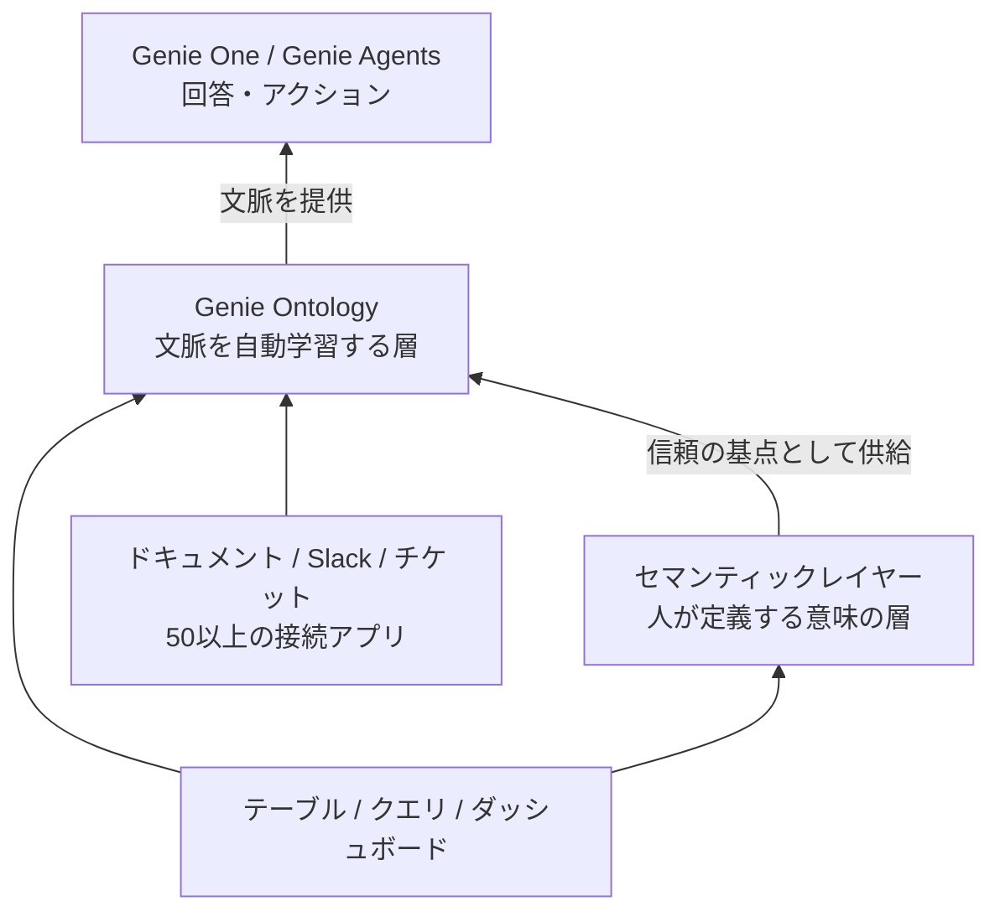

# はじめに

Databricks Genie Ontology(ジーニー オントロジー)は、2026年6月16日のData + AI Summit 2026(DAIS 2026)で発表された、Genieを支えるコンテキストレイヤー(AIエージェントに業務文脈をまとめて渡す層)です。発表時点でプレビュー段階であり、利用にはアカウントチームへの申請が必要なため、本記事は手元のワークスペースでの検証ではなく、Databricks公式ブログ・公式ドキュメントおよび各種報道・解説をもとにした調査ベースのまとめです。

技術記事として正確性を担保するため、本記事では一次情報(Databricks公式ブログ・プレス・公式docs)と二次情報(報道・サードパーティ解説)を区別して扱います。特にコンテキストレイヤーを自社製品として提供するベンダーの解説には立場上のバイアスが含まれうるため、引用は事実部分に絞っています。プレビュー段階の機能であり、UI上の露出や挙動は今後変わりうる点もあらかじめお断りしておきます。

# 用語の整理

横文字が多くなるため、本記事で使う主な言葉を、訳しづらいものを中心に先に整理しておきます。

- Genie Ontology(読みは「ジーニー オントロジー」): Genieに業務文脈を渡すために、社内のデータや業務アプリから知識を自動で集めて整理した「知識のネットワーク」。本記事では「オントロジー」と略すこともあります。
- スニペット(snippet): オントロジーが抽出する知識の最小単位。「アクティブ顧客とは何か」といった定義1件分のメモのようなものです。
- ontorank(オントランク): スニペットの信頼度を自動で順位付けする仕組み。Web検索のPageRankに着想を得たもので、出典の素性・利用頻度・新しさなどから「どの定義を信じるべきか」を決めます。
- コンテキストレイヤー(context layer): AIエージェントに、自社の業務文脈(用語の意味・どのデータが正しいか・誰が何を見てよいか)をまとめて渡す層のこと。2026年に各社が一斉に使い始めた言葉で、Genie OntologyはこのコンテキストレイヤーのDatabricksによる実装にあたります。次のセマンティックレイヤーが「指標の意味の定義」に閉じるのに対し、コンテキストレイヤーはそれに加えて関係性・信頼度・権限まで含む、より広い概念です。
- セマンティックレイヤー / metric view: KPIの定義(売上、アクティブ顧客など)を一度だけ正式に決めて、どこからでも同じ結果で使えるようにする「意味の定義層」。Databricksでの実装がmetric viewです。
- ナレッジストア(knowledge store): Genie Space単位で持つ、手動寄りの文脈設定(サンプルSQL、結合関係、用語定義など)の集まりです。
- アンカー(anchor): オントロジーが最も信頼する「基点」。認証済みの定義などが高い権威を持ち、回答の拠り所になります。

# Genie Ontologyとは何か

Genie Ontologyは、組織のデータとビジネスを自動で学習し続ける「自己改善型のコンテキストレイヤー」です。Databricksは、テーブル・クエリ・ダッシュボード・パイプライン・接続アプリから知識の断片(スニペット)を自動抽出し、「会社がどう動いているか」「データが実際に何を意味するか」を表す生きたグラフ(living graph)として整理する、と説明しています。

ここで言うコンテキストには、メトリクスの定義、ビジネス用語、独自の計算ロジック、そして概念・メトリクス・テーブル・チーム間の関係性が含まれます。

背景にある問題意識はシンプルです。ビジネスでデータを使うために必要な文脈は、ダッシュボード、クエリ、パイプライン、wiki、チケット、ドキュメント、チャットスレッドに散在しています。文脈が見つからないとAIは推測で穴埋めし、汎用的あるいは誤った回答を生む。Databricksはこれを「インテリジェンスの問題ではなくコンテキストの問題」と整理し、エージェント時代のキーワード「Choice, Context, Control」のうち「Context」を担うのがGenie Ontologyだとしています。

全体像を図にすると次のようになります。データソースを土台に、人が定義するセマンティックレイヤーと自動学習するオントロジーが乗り、その上でGenieが回答する、という階層関係です。

# 仕組み: スニペットとontorank

## 自動抽出されるスニペット

公式ドキュメントによると、オントロジーはGenie Oneが自動生成・維持する「データとビジネスの地図」であり、テーブル・クエリ・ダッシュボード・ドキュメント・接続アプリからスニペットを抽出します。スニペットの例として、ドキュメントでは次のような種類が挙げられています。

- メトリクス定義: 例「アクティブユーザーとは、全プラットフォームで重複排除した一意のユーザー」
- 権威あるソース: 例「売上は main.finance.certified テーブルから取得すべき」
- ビジネスルール: 例「商談予約後にのみ有効リードとしてカウント」

接続先は、Databricks内部のデータに加え、Slack、Jira、Google Drive、SharePoint、Salesforceなど50以上のアプリケーションに及ぶとされています。

## ontorankによる権威付け

オントロジーの中核は、PageRankに着想を得た権威付けの仕組みで、登壇では「ontorank」と呼ばれました。各スニペットには権威スコアが付き、その算定要素として、定義がどこから来たか、作成者の相対的な権威、利用頻度、認証済み(certified)・広く使われている資産との結びつき、鮮度が挙げられています。同じ用語に複数の定義が存在する場合(例: 財務と営業で「売上」の定義が異なる)に、最も信頼できる定義を選ぶことが狙いです。

加えて、各スニペットはUnity Catalogの権限でゲートされ、ユーザーが閲覧を許可されているソースだけが回答に使われます。

## ユーザーから見える接点

オントロジー自体には専用の管理画面がほとんどなく、基本は裏で動く層です。ユーザーが実際に触れる接点は、回答に付く引用(citation)です。公式ドキュメントには、回答中の引用アイコンをクリックすると、Genie Oneがその回答に使ったナレッジソースを確認できる、と記載されています。つまりオントロジーは、回答の根拠としてこの引用の形で表に現れます。

質問から回答までの流れは次のとおりです。

1. ユーザーが質問する(例: 先月のアクティブ顧客は?)
2. Genie Ontologyが、質問に関連するスニペットを収集する
3. ontorankで各スニペットの信頼度を順位付けし、定義の衝突を解消する
4. Unity Catalogの権限で、ユーザーが見てよいソースだけに絞り込む
5. 使った定義・出典を引用として添えて回答する

このうち2〜4がGenie Ontologyの内部処理にあたり、ユーザーから見えるのは1の質問と5の回答(と引用)です。

# 従来のGenieから何が変わるか

これまでGenie(Genie Spaces)を使ってきた人にとって、最大の関心は「何が違って、何が変わるのか」だと思います。一言でいうと、これまでSpace単位の設定でしか作れなかった文脈を、Spaceの境界に限定せず、アカウント横断で自動的に構築・提供できるようにした、というのが本質です。

ただし「手動だったものが自動になった」という単純な対比ではない点に注意が必要です。従来のSpaceにも半自動の仕組み(ナレッジマイニング)があり、UCメタデータのPK/FKから結合関係を自動生成したり、サムズアップされたクエリからSQL式を提案したりしていました。つまり変化の芯は「手動から自動へ」ではなく、「Space内に閉じた限定的な自動化」から「横断的な自動化」への拡大です。

本当の飛躍はスコープ(対象範囲)の広がりにあります。

| 観点 | 従来のGenie(Genie Spaces) | 新しいGenie(Genie Ontology) |
|---|---|---|
| 文脈の範囲 | Space単位(ローカル) | アカウント/ワークスペース横断 |
| 文脈の作り方 | 人の設定が中心 + Space内の半自動提案 | 自動抽出が中心 + 人による信頼の基点付け |
| 対象データ | 構造化データ中心 | ダッシュボード・パイプライン・50以上の外部アプリ・非構造化まで |
| 質問の境界 | Spaceの中に閉じる | Spaceの境界を越えて回答 |
| 定義の衝突 | Space内で作り込むため起きにくい | 横断ゆえに発生し、ontorankで権威付けして解決 |

横断的に文脈を集めると、同じ用語に複数の定義が出てきて衝突する(例: 財務と営業で「売上」の定義が違う)という、従来は起きにくかった課題が新たに生まれます。これをontorankで「どの定義を信じるか」を自動で順位付けして解く、という役割が加わったのも変化の1つです。

一方で、変わらない点もあります。Space単位のナレッジストアは引き続き使え、手で作り込んだ定義は捨てられるのではなく、信頼の基点(高権威アンカー)としてオントロジーに供給されます。これまでの作り込みは無駄にならず、むしろ精度向上の土台になります(詳細は後述の「既存のナレッジストアとの関係」を参照)。

# セマンティックレイヤー(metric view)との関係

調査していて最も誤解されやすいと感じたのが、metric view(Unity Catalog Business Semantics / Metrics)との関係です。結論として、Genie Ontologyはmetric viewを自動生成するものではありません。

metric viewは、measureの定義を、グループ化・フィルタ・集計に使うフィールドから分離し、一度定義すれば実行時にクエリできるようにする、Unity Catalogビジネスセマンティクスの中核実装です。SQLやUIで作成し、Unity Catalogで統制する、人が意図的に作る成果物です。「agentic authoring」という機能もありますが、これはオントロジーの機能ではなくUC Metrics側のオーサリング支援で、エージェントが定義を下書き・提案し、人がレビューして確定する、という位置づけです。

一方でオントロジーが「自動」で行うのは、metric viewの生成ではなく、テーブル間の関係・列のメトリクス・クエリの利用頻度シグナルといったグラフ用の文脈抽出です。たとえば、列レベルの利用頻度(Column-level Popularity)という派生シグナルがオントロジーに供給され、どの列が重要かをより鋭く把握できるようになる、といったものです。

両者の関係は「供給」です。Unity Catalogで定義したセマンティック基盤がGenie Ontologyに供給され、エージェントは断片から推測する代わりに検証済みの定義をクエリします。Business Glossary、Domains、Metricsはオントロジーに直接供給され、Unity Catalogでセマンティクスをモデル化するほどGenieの性能が上がる、とされています。

| | metric view(セマンティックレイヤー) | Genie Ontology |
|---|---|---|
| 作り方 | 人が定義(UI/SQL、エージェントの下書き支援あり) | 自動抽出(ontorankで権威付け) |
| 役割 | KPIの正確で再利用可能な定義 | 全体の文脈を底上げし信頼ソースを選ぶ |
| 関係 | オントロジーへの高権威アンカー(入力) | metric viewを参照・拡張する側 |
| 統制 | Unity Catalogで統制される明示的オブジェクト | 自動学習される横断レイヤー |

# 既存のナレッジストアとの関係

オントロジーがGenie Agent(旧Genie Space)でも効くとなると、従来のナレッジストアの立ち位置が気になります。ここも置き換えではなく共存で、スコープによる役割分担になります。

## ナレッジストアの正体

ナレッジストアは、Spaceレベルのメタデータ、プロンプトマッチング(format assistance / entity matching)、結合関係、SQL式(measures / filters / dimensions)といったキュレーション済みのセマンティック定義の集まりです。1つのGenie Spaceあたり最大200スニペットという上限があり、重要な点として、ナレッジストアの設定はSpaceにスコープされ、Unity Catalogのメタデータや他のDatabricksアセットには影響しません。つまり、そのSpaceの中だけで効くローカルな知識です。

## 従来からあった半自動化

「手動設定が必要」と言われがちですが、従来から半自動化は進んでいました。ナレッジマイニングが、接続テーブルのUCメタデータを分析してPK/FKを結合関係として自動保存したり、作者がサムズアップした応答やダウンロードしたクエリから有用なロジックを学んでSQL式を提案したりして、手動キュレーションを減らします。オントロジーは、この発想をアカウント横断・全ソースに広げた延長線上にあると捉えると理解しやすいです。

## スコープの違いと移行パス

ナレッジストアがSpaceローカルなのに対し、オントロジーはアカウント/ワークスペース横断で、UC Semantics/Metricsを高権威アンカーとして参照します。したがって、手動の成果を広く効かせたいなら置き場所が重要になります。Spaceローカルのストアに入れた定義はそのSpace内に閉じますが、UC Semantics(metric view)に定義すればオントロジーの高権威アンカーとして全体に効きます。

その橋渡しとして、Genie Spaceのコンテキストをmetric viewとしてエクスポートする導線が用意されています。Space内のデータとセマンティックコンテキストからmetric viewを作成できるため、これまでSpaceに貯めた手動資産を捨てずに、metric viewへ昇格させてオントロジーに供給する、という移行が想定されています。

スコープの違いと移行パスを図にすると次のようになります。Spaceローカルのナレッジストアは、Export to metric viewで横断レイヤーのmetric viewへ昇格し、そこからオントロジーの高権威アンカーになります。

## 「手動キュレーション不要」論の正確な理解

Databricksはオントロジーの売りとして、チームに手作業でキュレーションさせたり別の権限システムを管理させたりすることなく文脈問題を解決する、と打ち出しています。ただし、最新のベストプラクティスドキュメントでも、SQL式やサンプルSQLをテキストインストラクションより優先し、テキストはどの方法も当てはまらないグローバルな文脈にだけ使う、というキュレーション指針が現役です。手動がゼロになるわけではなく、役割が「全部を作り込む」から「重要な定義のアンカー付けと誤りの修正」に寄っていく、という理解が正確です。

# 適用範囲: Genie One と Genie Agents

オントロジーはGenie One専用ではありません。Databricksの発表では、Genie OneとGenie Agentsの両方がGenie Ontologyという自動コンテキストレイヤーで動いている、と明記されています。

名称も整理しておくと、Genie SpacesはGenie Agentsに改称され、再利用可能なGenie Skillsを持ち、Genie MCP経由で双方向に到達できるようになりました。位置づけとしては、業務ユーザーの入口がGenie Oneで、その下にオントロジーが自動で業務文脈を学習する層として入る構成です。

Genie Agent(旧Genie Space)は、もともと自前の文脈設定(インストラクション、サンプルSQL、信頼できる資産、ナレッジストア)を持っており、その上にオントロジーが乗る形になります。文脈を支えるエンジンとしてのオントロジーはGenieファミリー共通の基盤であり、Genie OneもGenie Agentも同じ土台を使う、と捉えると整理できます。

# ベンチマークと限界

Databricksは社内ベンチマークで大きな精度向上を主張しています。実世界のデータ分析28問のスイート(2026年6月、競合エージェントは匿名化)で、Genieは初回試行で84.5%を正答し、最も強力な汎用コーディングエージェントは52.4%、最弱は25%にとどまった、とされています。速度も最強のコーディングエージェントの2倍速いとされています。

ただしこれはベンダーの社内ベンチマークであり、第三者による独立検証ではない点に注意が必要です。報道では、Snowflakeも文脈付与によって複雑なクエリで80%超の精度に達したと自社数値を出しており、各社が自社条件で80%台を主張している、という相対的な見方が紹介されています。

精度の中身についても留保が必要です。84.5%が正答ということは、およそ6問に1問は依然として誤りであり、しかもエージェントはそれを不確実とは表示せず、正答と同じ自信で統制済みソースを引用して返しうる、という指摘があります。さらに本質的な限界として、オントロジーはメトリクスの「意味」をランク付けして提供しますが、その定義に対して「どの計算が妥当か」までは保証しません。定義がグラフ上で正しくても、時間軸や粒度(level of detail)をまたいだ集計が妥当でなければ、正しい定義から誤った数値が出うる、というものです。

これらは、自動抽出されたオントロジーが、人が手で構築したオントロジーと同等の信頼を得られるか、という未解決の論点につながります。記事としては、精度向上は方向性として有望だが、ベンダー公称値であり計算の妥当性は別問題、という温度感で扱うのが誠実だと考えます。

# 今すぐ確認できる隣接機能

オントロジー自体はプレビューで手元検証が難しい一方、関連する概念の多くは一般提供(GA)済みで、Free Editionを含む多くの環境で触れられます。記事の読者に「今できること」を示す足がかりとして挙げておきます(エンタイトルメントは各自の環境で要確認)。

- metric view: Catalog Explorerのポイント&クリックUIやBuilder mode(低コードのUI変換ツール)で作成・管理できます。オントロジーに供給される「人が定義する側」を実際に組めます。
- ナレッジストアとナレッジマイニング: Space単位のキュレーションと、PK/FKやサムズアップからの自動提案を体験できます。
- Export to metric view: Spaceのコンテキストをmetric viewへ昇格させる移行パスを試せます。
- Genie Spaceのagent modeの推論トレース: 回答に適用した定義を引用する挙動があり、「回答が使った定義を見せる」というオントロジーの引用体験に最も近い現行のアナログとして観察できます。

調査記事の中で、これらを「現時点で検証可能な周辺」として分け、オントロジー本体は「ドキュメントベースの解説」として明示的に切り分けると、未検証であることの誠実さと記事の実用性を両立できます。

# まとめ

調査ベースで整理すると、Genie Ontologyの位置づけは次のようになります。アカウント横断で自動学習されるコンテキストレイヤーが基盤にあり、Genie OneとGenie Agentsの両方を支えます。人が定義するmetric view(セマンティックレイヤー)はそれを置き換えるものではなく、高権威アンカーとして供給される入力であり、オントロジーはそれを参照・拡張します。Space単位のナレッジストアはローカルな文脈として共存し、Export to metric viewで上位レイヤーへ昇格させる移行パスが用意されています。

精度のベンチマークは魅力的ですが、ベンダー公称値であること、約6問に1問は依然誤りうること、定義のランク付けと計算の妥当性は別問題であることを併記するのが妥当です。そして本機能はプレビューであり、本記事の内容は手元検証ではなく公式情報と報道に基づく調査である、という前提を読者に共有することが、この段階の記事として最も重要だと考えます。

# 参考リンク

## 一次情報(Databricks公式)

- [Genie One、Genie Agents、Genie Ontologyのご紹介(Databricksブログ)](https://www.databricks.com/jp/blog/introducing-genie-one-genie-ontology-and-genie-agents)
- [Data + AI Summit 2026におけるUnity Catalogの最新情報(Databricksブログ)](https://www.databricks.com/jp/blog/whats-new-unity-catalog-data-ai-summit-2026)
- [Unity Catalog Business Semanticsの一般提供開始とオープンソース化を発表(Databricksブログ)](https://www.databricks.com/jp/blog/redefining-semantics-data-layer-future-bi-and-ai)
- [Databricks Genieの次世代(Databricksブログ)](https://www.databricks.com/jp/blog/next-generation-databricks-genie)
- [Genie Oneでチャットする(公式ドキュメント)](https://docs.databricks.com/aws/ja/genie-one/chat)
- [Unity Catalog メトリックビュー(公式ドキュメント)](https://docs.databricks.com/aws/ja/business-semantics/metric-views)
- [信頼性の高いGenieスペースのためのナレッジストア(公式ドキュメント)](https://docs.databricks.com/aws/ja/genie/knowledge-store)
- [効果的なGenieスペースのキュレーション(公式ドキュメント)](https://docs.databricks.com/aws/ja/genie/best-practices)
- [Genieスペースの作成と管理(公式ドキュメント)](https://docs.databricks.com/aws/ja/genie/set-up)

## 二次情報(報道・解説)

- [From RAG to ontology: Databricks bets on context(CIO)](https://www.cio.com/article/4186154/from-rag-to-ontology-databricks-bets-on-context-as-the-key-to-trusted-ai-agents-2.html)
- [Databricks' new agentic coworker Genie One(SiliconANGLE)](https://siliconangle.com/2026/06/16/databricks-new-agentic-coworker-genie-one-brings-ai-automation-every-part-business/)
- [Not pagerank, but ontorank(ITdaily)](https://itdaily.com/blogs/cloud/databricks-genie-ontology/)
- [What is Genie Ontology? Databricks' Context Layer, Explained(Atlan・コンテキストレイヤー提供ベンダーのため立場に留意)](https://atlan.com/know/ai-agent/databricks/genie-ontology/)
- [What Is Genie Ontology? Continuously Learned Context Layer Explained(typedef・限界に関する整理)](https://www.typedef.ai/blog/what-is-genie-ontology-databricks-continuously-learned-context-layer-explained)

### はじめてのDatabricks

[はじめてのDatabricks](https://qiita.com/taka_yayoi/items/8dc72d083edb879a5e5d)

### Databricks無料トライアル

[Databricks無料トライアル](https://databricks.com/jp/try-databricks)
