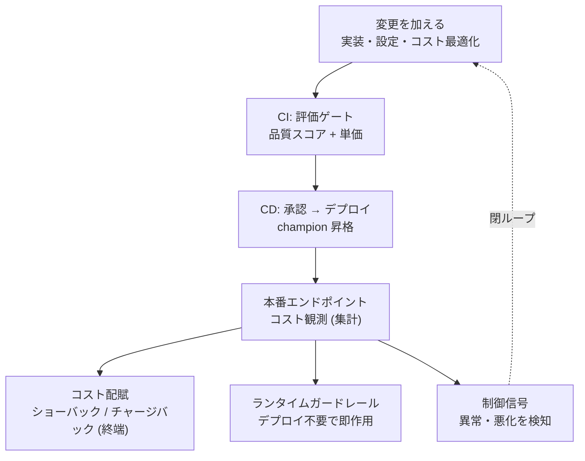
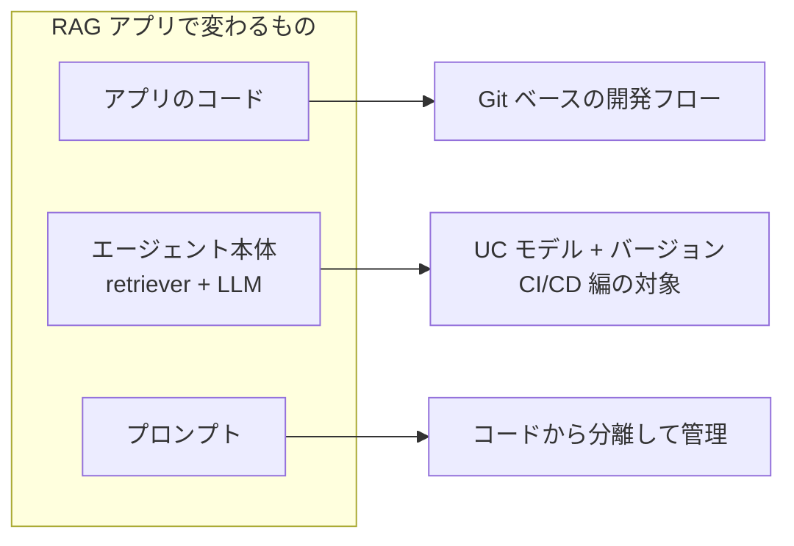
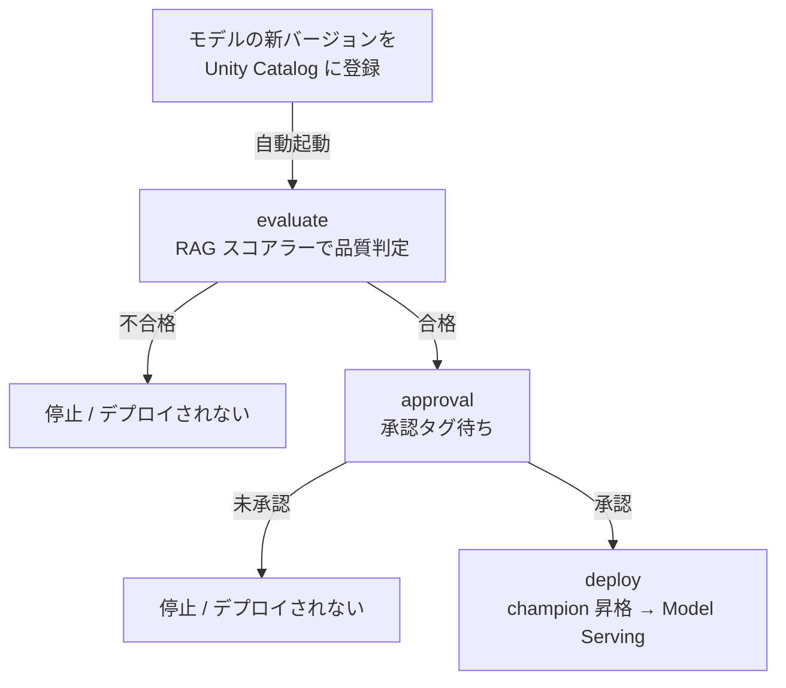

# 導入: CI/CDとコストは繋がっている

LLMOpsは多面的です。プロンプト管理、エージェント設計、評価、ガードレールなど、取り組むべき領域は多岐にわたります。その中で見落とされがちなのが**CI/CD**(モデルの昇格パイプライン)と**コスト管理**(消費の計測・属性付け・統制)の2つです。

この2つは独立したトピックではありません。コストはCI/CDパイプラインの**出力であり入力でもあります**。デプロイ前の評価ゲートでは単価を判定し、デプロイ後の本番観測ではランニングコストを計測し、その結果が次の変更サイクルの引き金になります。コスト最適化(安いモデルへの変更、プロンプト圧縮、検索k削減、キャッシュ導入)は品質を静かに劣化させうる変更なので、やはり評価ゲートを通す対象です。

本記事は、この2つの領域と両者の関係を俯瞰する「全体像」を示します。具体的には、以下を扱います。

1. CI/CDとコストが閉ループを成す全体像(単価と集計コストの区別、本番観測の3つの出口)
2. CI/CD編の要点: エージェント本体の昇格パイプライン(評価→承認→デプロイ)
3. コスト編の要点: トークンの属性付けと集計時JOINによる部門按分
4. 2つがどう繋がるか: 単価は評価ゲート、集計コストは制御ループ、コスト最適化もゲートを通す

各領域の詳細は以下の記事で扱っています。

- **CI/CD編**: [評価ゲートと承認で守るRAGのCI/CD - Databricks Free Editionで一周回す](https://qiita.com/taka_yayoi/items/b29bff54fa21004bc139)
- **コスト編**: [LLMOps基盤のコスト管理 ── 測る・属性付ける・統制する、の考え方](https://qiita.com/taka_yayoi/items/1f3a6c65603e520f5148)

# 全体像: 閉ループとしてのCI/CD × コスト

CI/CDとコスト管理は、以下の閉ループで繋がっています。

このループの各要素を順に説明します。

## コストの二面性: 単価と集計

コストは1つのメトリクスではなく、性質の違う2つの量に分かれます。

**単価** は、リクエスト1件あたりのトークン消費です。オフラインの評価データセットで測れるため、デプロイ前にCI(評価ゲート)の中で閾値判定できます。

**集計ランニングコスト** は、単価 × リクエスト量 × クエリ構成の掛け算です。本番トラフィックに依存するため、本番でしか観測できません。同じ単価でも、リクエスト量が増えたり入力の長いクエリが増えたりすれば集計コストは膨らみます。

この区別が重要なのは、**それぞれ統制する場所が違う**からです。単価はCIの評価ゲートで統制し、集計コストは本番の観測とガードレールで統制します。

### 参考: 品質を加味した単価指標(cost per successful output)

単価を評価する際、「応答あたりのコスト」と「正答率」を別々に見ていると判断を誤ることがあります。安いモデルに切り替えてコストが半分になっても、正答率も半分になったら、使える回答1件あたりの実質コストは変わっていません。

この問題に対処する指標として、本記事では **cost per successful output** を紹介します。

$$
\text{cost per successful output} = \frac{\text{総トークン消費(失敗ぶんを含む)}}{\text{品質基準を満たした応答数}}
$$

たとえば、100リクエストで合計20,000トークンを消費し、品質基準を満たしたのが70件なら、cost per successful output = 20,000 / 70 ≈ 286トークンです。同じトークン消費でも成功が50件に落ちれば20,000 / 50 = 400トークンに悪化します。分子に失敗ぶんのトークンも含むのは、失敗にも支払ったコストを使える回答だけで割るためです。

この指標は、品質評価の仕組みが整い、十分な実測データが蓄積された段階で導入を検討するのが現実的です。

## 本番コスト観測の3つの出口

本番エンドポイントで観測されたコストは、3つの異なる出口に流れます。これを一語で「モニタリング」とまとめると、それぞれの役割と受け手の違いが見えなくなります。

**コスト配賦(ショーバック / チャージバック)** は、FinOpsや経営が受け手の終端です。「どの部門がいくら使ったか」を可視化し、必要に応じて課金します。CI/CDパイプラインには戻りません。

**ランタイムガードレール(安全性フィルタ・予算アラート・レート制限・ルーティング)** は、デプロイを介さず本番に即作用する仕組みです。不適切な入出力をフィルタする、予算を超えたらアラートを出す、特定ユーザーのレートを制限する、といった対応をリアルタイムで行います。評価ゲートでもモニタリングでもない第3のカテゴリです。

**制御信号(コスト異常・悪化の検知)** は、次の変更サイクルの引き金になる情報です。「成功応答あたりコストが先週比で30%上がった」という検知は、原因調査と対策(プロンプト修正、モデル変更など)を駆動します。この対策は変更としてCI/CDパイプラインに入り、評価ゲートを通ってデプロイされます。制御信号がループを閉じます。

# CI/CD編の要点: モデル昇格のパイプライン

CI/CD編では、RAGエージェントのバージョン昇格をDatabricks上で自動化する方法を扱っています。

## 変わるもの3つの分離

RAGアプリケーションで変わるものは3つあり、それぞれ管理手段が異なります。

分ける理由は、変更のライフサイクルが異なるからです。アプリのコード(たとえばエージェントを呼ぶAPIサーバーやUI)はGitのマージで即反映されます。一方、エージェント本体(retriever + LLMの組み合わせとその設定)はUnity Catalogにモデルバージョンとして登録され、評価→承認→デプロイという昇格プロセスを経て初めて本番に出ます。品質への影響が大きいのは後者なので、ゲートで守る対象も後者です。CI/CD編はこのうち「エージェント本体」のバージョン昇格に焦点を絞っています。

## deployment jobの3タスク

エージェント本体の昇格は、[DAB(Declarative Automation Bundles)](https://docs.databricks.com/aws/ja/dev-tools/bundles/)で定義されたdeployment jobが担います。Unity Catalogへの新バージョン登録を引き金に自動起動し、3つのタスクを順に実行します。

1. **evaluate**: MLflowのRAGスコアラー(RetrievalSufficiency、RetrievalGroundedness、Correctness)で品質を判定します。不合格ならraiseで停止し、デプロイには進みません
2. **approval**: Unity Catalogのタグで承認を待ちます。初回は必ず失敗し、UIで承認ボタンを押すとタグが付与されてジョブが自動リペアで再開します
3. **deploy**: champion別名に昇格し、Model Servingエンドポイントにデプロイします

詳細とコード一式は[CI/CD編の記事](https://qiita.com/taka_yayoi/items/b29bff54fa21004bc139)を参照してください。

# コスト編の要点: 測る・属性付ける・統制する

コスト編では、LLMOps基盤でコストをどう捉え、どう統制するかの考え方を扱っています。

## 二層のコスト

コストは**インフラのコスト**(エンドポイント稼働やジョブ実行)と**トークンのコスト**(基盤モデルのトークン消費)の2層に分かれます。この2つは属性付けの手段が異なるため、分けて捉えます。

Databricksではそれぞれのコストがシステムテーブルに自動記録されます。`system.billing.usage`はDBU(課金単位)ベースの全消費を集約して記録するテーブルで、インフラのコストの把握に使います。`system.serving.endpoint_usage`はモデルサービングのリクエストをリクエスト単位で記録するテーブルで、トークン数や後述する`usage_context`が含まれます。

- インフラのコスト → `system.billing.usage` + ジョブやエンドポイントにタグ・[予算ポリシー](https://docs.databricks.com/aws/ja/admin/usage/budget-policies)を紐づけて属性付け
- トークンのコスト → `system.serving.endpoint_usage` + リクエストごとに`usage_context`を付けて属性付け

トークン層の統制では、[AI Gatewayの予算機能](https://docs.databricks.com/aws/ja/admin/account-settings/budgets)が有効です。目的別(社内QA用、顧客対応用など)にエンドポイントを分離し、エンドポイント単位で予算上限を設定することで、用途ごとのコストを構造的に分離できます。

## 集計時JOINによる按分

部門のように変動する属性は、エージェントに焼き込まず、集計時に対応表とJOINして解決します。エージェントはユーザーIDだけを`usage_context`に載せ、どの部門に属するかは集計側の関心事とする、という関心の分離が設計の要点です。

## 段階的な統制

統制は4段階で育てます。(a) 可視化、(b) チャージバック、(c) [予算](https://docs.databricks.com/aws/ja/admin/account-settings/budgets)とアラート、(d) CI/CDゲートでの統制。(a)〜(c)で実測を積み、分布が見えてから(d)に進むのが推奨順序です。

詳細とサンプルコードは[コスト編の記事](https://qiita.com/taka_yayoi/items/1f3a6c65603e520f5148)を参照してください。

# 2つはどう繋がるか

CI/CD編とコスト編は、冒頭の閉ループ図の中で以下のように接続されます。

## 単価は評価ゲートの中に置ける

参考として、cost per successful outputのような単価指標をdeployment jobのevaluateタスクに組み込み、品質スコアと並べてコスト閾値を判定する構成が考えられます。ただし、これは十分な実測データが蓄積され、閾値の根拠が明確になってから導入すべきものです。初期段階では品質ゲートの運用を優先し、コストゲートは実測の分布が見えてから検討するのが現実的です。

## 集計コストは制御ループを回す

本番の集計ランニングコストは、`system.serving.endpoint_usage`の`usage_context`で属性付けされ、ダッシュボードや部門チャージバックに使われます。コストの異常や悪化が検知されると、それが次の変更(モデル変更、プロンプト最適化、検索k削減など)の引き金になります。

## コスト最適化もゲートを通す

コスト削減のための変更(安いモデルへの切り替え、プロンプト圧縮、キャッシュ導入)は、品質を静かに劣化させるリスクがあります。したがって、これらの変更もCI/CDパイプラインの評価ゲートを通す対象です。コスト削減の結果として品質が回帰しないことを、ゲートが保証します。これが「回帰予算」という考え方です。コスト最適化はCI/CDの外で行うアドホックな作業ではなく、パイプラインの中で統制する対象です。

## タグ付与のガバナンス

コスト属性付けはタグに依存するため、タグが付いていないリソースがあると属性付けに穴が空きます。運用上は以下のような仕組みでタグ付与を強制することが有効です。

- **CIでのレビュー**: DABの定義ファイル(databricks.yml等)に必須タグが含まれていることをGitHub Actions等でチェックし、不足があればマージをブロックする
- **未タグリソースの検知**: `system.billing.usage`でタグが空のリソースを定期的にスキャンするジョブを作成し、検知したら通知する

# 補足: 本記事が扱わない層

本記事はエージェント本体の昇格とコスト管理に焦点を絞っています。RAGのCI/CDには本来もう2つの層があります。

**コードのGitフロー / CI** は、アプリケーションコードの変更をGitブランチ・PR・CIテストで管理する層です。冒頭の「変わるもの3つ」のうち「アプリのコード」に対応します。

**データ・インデックスのCI** は、知識ソース(Deltaテーブル)やVector Searchインデックスの変更を検知し、品質への影響を評価する層です。データが変わればエージェントの品質も変わりうるため、ここにもゲートが要ります。

# 参考リンク

- [評価ゲートと承認で守るRAGのCI/CD - Databricks Free Editionで一周回す](https://qiita.com/taka_yayoi/items/b29bff54fa21004bc139)(CI/CD編)
- [LLMOps基盤のコスト管理 ── 測る・属性付ける・統制する、の考え方](https://qiita.com/taka_yayoi/items/1f3a6c65603e520f5148)(コスト編)
- [Declarative Automation Bundles](https://docs.databricks.com/aws/ja/dev-tools/bundles/)
- [AI Gatewayをモデルサービングエンドポイントで構成する](https://docs.databricks.com/aws/ja/ai-gateway/configure-ai-gateway-endpoints)
- [サーバレス予算ポリシーで使用量を属性付けする](https://docs.databricks.com/aws/ja/admin/usage/budget-policies)
- [予算の作成と監視](https://docs.databricks.com/aws/ja/admin/account-settings/budgets)
- [ResponsesAgentでエージェントを作成する](https://docs.databricks.com/aws/ja/generative-ai/agent-framework/author-agent)

### はじめてのDatabricks

[はじめてのDatabricks](https://qiita.com/taka_yayoi/items/8dc72d083edb879a5e5d)

### Databricks無料トライアル

[Databricks無料トライアル](https://databricks.com/jp/try-databricks)
