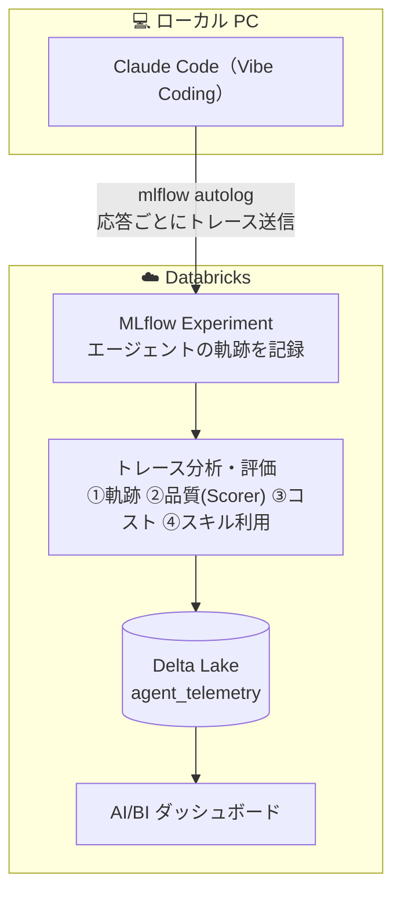
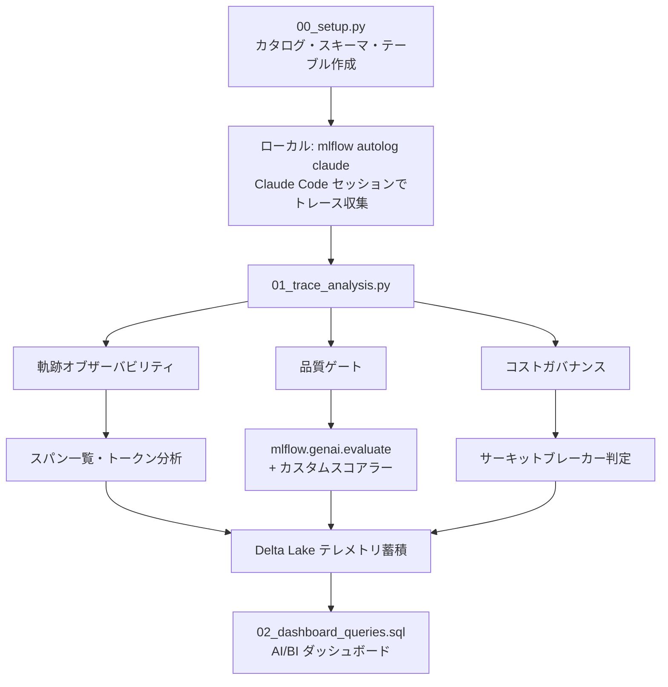

> **前編**: [CodingAgentOps——LLMOpsの先にあるコーディングエージェント時代の運用フレームワーク](https://qiita.com/taka_yayoi/items/b795a609a039387d8d23)

# はじめに

[前編](https://qiita.com/taka_yayoi/items/b795a609a039387d8d23)では、コーディングエージェント時代に求められる運用フレームワーク「**CodingAgentOps**」の6つの柱を提案しました。

- **柱1**: 軌跡オブザーバビリティ
- **柱2**: 品質ゲート
- **柱3**: コストガバナンス
- **柱4**: セキュリティ
- **柱5**: ガバナンス・監査
- **柱6**: 実験管理・ベンチマーク

本記事（実践編）では、このうち **柱1〜3**（軌跡オブザーバビリティ・品質ゲート・コストガバナンス）を **Databricks + MLflow 3.x** で実際に動かします。さらに、6本柱には無かった **コーディングエージェント固有の新しい観測軸「スキルオブザーバビリティ」**（どのスキルが・どれだけ使われたか）も実装します。ローカルの Claude Code セッションから自動収集したトレースを Databricks 上で分析・評価・蓄積する、エンドツーエンドの実装を解説します。

# 全体アーキテクチャ

まず、今回構築するシステムの全体像を示します。



ローカルの Claude Code から送られたトレースを、Databricks 側で「分析・評価 → 蓄積 → 可視化」する、という一本の流れです。分析・評価のステップで、次の4つの観点を扱います:

- **① 軌跡オブザーバビリティ** — スパン（ステップ）分析
- **② 品質ゲート** — LLM-as-Judge（Guidelines）＋カスタムスコアラー（`@scorer`）
- **③ コストガバナンス** — トークン予算・サーキットブレーカー
- **④ スキルオブザーバビリティ** — `tool_Skill` スパンからスキル利用を追跡

ポイントは以下の通りです:

- **ローカル環境**: `mlflow autolog claude` が Claude Code の全操作を自動トレースし、Databricks に送信
- **Databricks ワークスペース**: 受信したトレースに対して3本柱（オブザーバビリティ・品質ゲート・コストガバナンス）の分析を実行
- **Delta Lake**: テレメトリデータを蓄積し、AI/BI ダッシュボードで時系列分析

# デモのワークフロー

本デモは、仕組みを理解するための3つのノートブック（`00`〜`02`）と、運用向けの同期ノートブック（`03`）で構成されます。



| ノートブック | 役割 |
|---|---|
| `00_setup.py` | カタログ・スキーマ・テレメトリテーブルの作成 |
| `01_trace_analysis.py` | **（教材）** 最新1トレースの分析・品質評価・コスト・スキル追跡・Delta Lake 蓄積 |
| `02_dashboard_queries.sql` | AI/BI ダッシュボード用 SQL クエリ集 |
| `03_scheduled_sync.py` | **（運用）** 未処理トレースを冪等に一括同期。Lakeflow ジョブでスケジュール実行 |

加えて、Claude Code に分析させるサンプルデータとして以下を使用します:

| ファイル | 用途 |
|---|---|
| `sales_data_sample.csv` | 売上サンプルデータ |
| `sales_pipeline.py` | Claude Code が生成した売上分析パイプライン |

# 前提条件

- Databricks ワークスペース（Unity Catalog 有効）
- Claude Code（ローカルにインストール済み）
- Python 3.10+
- MLflow 3.x（`mlflow[databricks]>=3.14` を推奨。judge 応答のパースの都合で 3.14 以上が安全）

---

# Step 1: セットアップ（`00_setup.py`）

最初に、テレメトリデータを格納する Unity Catalog のスキーマとテーブルを作成します。

## 1.1 カタログ・スキーマの作成

```python
CATALOG = "takaakiyayoi_catalog"
SCHEMA = "coding_agent_ops"

spark.sql(f"CREATE SCHEMA IF NOT EXISTS {CATALOG}.{SCHEMA}")
```

## 1.2 テレメトリテーブルの作成

```python
spark.sql(f"""
CREATE TABLE IF NOT EXISTS {CATALOG}.{SCHEMA}.agent_telemetry (
    session_id STRING NOT NULL,
    task_description STRING,
    model_name STRING,
    timestamp TIMESTAMP,
    -- 軌跡オブザーバビリティ
    total_steps INT,
    step_details STRING,           -- JSON: 各ステップの詳細
    trace_id STRING,               -- MLflow trace ID
    -- 品質ゲート
    score_correctness DOUBLE,
    score_security DOUBLE,
    score_maintainability DOUBLE,
    quality_details STRING,        -- JSON: 評価理由
    -- コストガバナンス
    total_input_tokens INT,
    total_output_tokens INT,
    total_cost_usd DOUBLE,
    cost_breakdown STRING,         -- JSON: ステップ別コスト
    -- メタデータ
    generated_code STRING,
    execution_time_seconds DOUBLE
)
USING DELTA
COMMENT 'CodingAgentOps テレメトリデータ'
""")
```

テーブル設計のポイント:

- **軌跡**: `total_steps`, `step_details`（JSON）, `trace_id` でエージェントの行動履歴を記録
- **品質**: `score_correctness`, `score_security`, `score_maintainability` で3軸の品質スコアを保持
- **コスト**: `total_input_tokens`, `total_output_tokens`, `total_cost_usd` でトークン消費とコストを追跡

# Step 2: ローカルで Claude Code のトレースを有効化

Databricks ワークスペース側の準備が完了したら、ローカル環境で Claude Code の自動トレースを設定します。

```bash
#  1. 仮想環境の作成・有効化
python -m venv .venv
source .venv/bin/activate

#  2. MLflow のインストール（3.14 以上を推奨。理由は後述）
WHENEVER_NO_BUILD_RUST_EXT=1 pip install --upgrade "mlflow[databricks]>=3.14"

#  3. 環境変数の設定
export DATABRICKS_HOST="https://<ワークスペースURL>"
export DATABRICKS_TOKEN="<パーソナルアクセストークン>"

#  4. Claude Code の自動トレースを有効化
mlflow autolog claude -u databricks -e <実験ID>

#  5. Claude Code を起動してタスクを実行
claude
```

:::note info
**`-u databricks` が必須です!** このフラグを付けないとトレースがローカルにしか保存されず、Databricks ワークスペースに送信されません。
:::

:::note info
**「マーケットプレイスプラグイン方式」とは？** Claude Code には、機能を後付けできる**プラグイン**の仕組みと、それを配布する**マーケットプレイス**があります。MLflow はこの仕組みを使って、トレーシング機能を公式プラグイン `mlflow-tracing`（npm パッケージ `@mlflow/claude-code`）として提供するようになりました。`mlflow autolog claude` を実行すると、このプラグインがインストール・有効化され、Claude Code の応答完了時にトレースを Databricks へ送るフックが動きます。以前は `.claude/settings.json` に mlflow の CLI コマンドを直接書き込む方式でしたが、Claude Code 公式のプラグインとして配布・管理される形に変わった、という違いです。
:::

:::note warn
**旧方式のフックは新しい mlflow では動きません（mlflow 3.14〜）。** 以前の `.claude/settings.json` の Stop フック（`mlflow autolog claude stop-hook`）は、新しい mlflow では `moved to the marketplace plugin runtime` となり動作しません。`mlflow autolog claude` を（最新の mlflow が入った環境で）**再実行**すると `mlflow-tracing@mlflow-plugins` プラグインへ移行され、`.claude/settings.local.json` に `enabledPlugins` が追加されます。**プラグインの有効化には Claude Code の再起動が必要**です。
:::

## Claude Code でタスクを実行

今回のデモでは、Claude Code に以下のようなタスクを依頼します:

> 「`sales_data_sample.csv` を読み込んで、異常値除外・カテゴリ別集計・月次トレンド計算を行う PySpark パイプラインを作成してください」

Claude Code がファイルの読み取り、コード生成、テスト実行などを行う **すべてのステップが自動的にトレースとして記録** されます。

:::note info
**トレースは「アプリ終了時」ではなく「応答ごと（1ターンごと）」に送信されます。** Claude Code の `Stop` フックは、エージェントが一連の作業を終えてユーザーの入力待ちに戻るたびに発火します。したがって Claude Code を `/exit` しなくても、タスクを投げて応答が返るたびに、そのターンがトレースとして Databricks に届きます。同一セッションで複数のタスクを流せば、その数だけトレースが増えます。
:::

`mlflow autolog claude` を実行すると、次のようにプラグインがインストールされ、トレースの送信先（Tracking URI と Experiment ID）が設定されます。

```text
MLflow Claude Tracing Setup
Project: /path/to/coding_agent_ops
Installing plugin: MLflow Claude plugin for Claude Code
✓ Claude Code plugin installed

Setup Complete
Project: /path/to/coding_agent_ops
Tracking URI: databricks
Experiment ID: 1323310658880402

Next Steps
  1. Use Claude Code as usual in this directory.
  2. Visit the MLflow UI after a Claude conversation ends to inspect traces.
```

この状態で `claude` を起動してタスクを実行し、応答が完了すると、`.claude/mlflow/claude_tracing.log` に次のようなログが記録されます（応答ごとに1エントリ）。

```text
CLAUDE_TRACING - Stop hook: session=8b28deda-...
CLAUDE_TRACING - Creating MLflow trace for session: 8b28deda-...
CLAUDE_TRACING - Created MLflow trace: tr-9f643ede894f0cccc1ae85acfbf8519c
```

`Created MLflow trace: tr-xxxx` が出れば、トレースが Databricks の Experiment に送信されています。

---

# Step 3: 柱1 — 軌跡オブザーバビリティ

ここからは `01_trace_analysis.py` ノートブックの内容です。まず、自動収集されたトレースを取得・分析します。

:::note info
**`01_trace_analysis.py` は「仕組みを理解するための教材ノートブック」です。** 最新のトレース1件を取り出して、スパン分析・品質評価・コスト・スキル利用を1ステップずつ解説します。**実運用で全トレースをまとめて処理・可視化する場合は、後述の `03_scheduled_sync.py`（冪等な一括同期）を使います**（本記事末尾「運用に載せる」参照）。
:::

### Experiment の使い分け（重要）

このデモでは Experiment を**2つに分けて**扱います。教材ノートブック（`01`）の試行が、運用のトレースを汚さないようにするためです。

| Experiment | 中身 | 誰が書くか |
|---|---|---|
| **運用 Experiment**（`CodingAgentOps_Demo`） | Claude Code のトレース（`mlflow autolog claude` が送信） | ローカルの Claude Code／運用同期の `03` |
| **ノートブック Experiment**（自動作成） | `01` の `evaluate()` が生成する**評価 run** | 教材ノートブック `01` |

そのため `01` は **`mlflow.set_experiment(...)` を呼びません**。トレースは運用 Experiment から `search_traces(locations=[...])` で**読み取るだけ**にし、`evaluate()` の評価 run は Databricks が自動で用意する**このノートブック専用の Experiment** に入ります。

```python
# トレースの取得元（運用 Experiment）— 読み取り専用
TRACE_EXPERIMENT_NAME = "/Users/<ユーザー名>/CodingAgentOps_Demo"
trace_experiment = mlflow.get_experiment_by_name(TRACE_EXPERIMENT_NAME)

# set_experiment は呼ばない → evaluate() の run はノートブック Experiment に入る
```

:::note info
**`01` の `evaluate()` を実行しても、運用 Experiment には評価 run は増えません。** 評価 run は `01` を開いているノートブック自身の Experiment に記録されます。運用 Experiment の **Traces** タブに並ぶのは Claude Code 由来のトレースだけなので、運用データがすっきり保たれます。教材の評価結果は、ノートブック実行時に出力される `View the evaluation results at https://.../evaluation-runs?...` のリンクから確認できます。
:::

## 3.1 トレースの取得

```python
import mlflow
import mlflow.genai
from mlflow.genai.scorers import Guidelines, scorer
from mlflow.entities import Feedback, Trace
import json

# トレースの取得元（運用 Experiment）。set_experiment は呼ばず、読み取りだけに使う
TRACE_EXPERIMENT_NAME = "/Users/<ユーザー名>/CodingAgentOps_Demo"
trace_experiment = mlflow.get_experiment_by_name(TRACE_EXPERIMENT_NAME)

#  トレース一覧の取得（MLflow 3.x では experiment_ids は非推奨。locations を使う）
traces_df = mlflow.search_traces(
    locations=[trace_experiment.experiment_id],
)
print(f"取得したトレース数: {len(traces_df)}")

# traces_df には spans / assessments など複雑なオブジェクト列が含まれ、
# display() / Arrow 変換に失敗するため、それらを除いて表示する
_drop = [c for c in ["spans", "assessments", "trace"] if c in traces_df.columns]
display(traces_df.drop(columns=_drop))
```

出力例（`search_traces` は pandas DataFrame を返す。1 行が 1 セッションのトレース）:

```
取得したトレース数: 8
```

| trace_id | state | request_time | execution_duration | request_preview |
|---|---|---|---|---|
| tr-f37fd17a70b8637756f04daabb37b73a | OK | 2026-07-24 15:52:38 | 49.2s | Lakeflow パイプラインを作成して… |
| tr-24ab539ef6d3caf2bb8e782f15f70100 | OK | 2026-07-24 14:03:01 | 4.1s | 差分同期のロジックを確認して… |
| tr-9f643ede894f0cccc1ae85acfbf8519c | OK | 2026-07-24 14:02:52 | 91.3s | テレメトリテーブルの設計を… |
| tr-651a9c69e69d75c67faab595a824b178 | OK | 2026-07-24 14:02:41 | 18.9s | … |
| … | … | … | … | … |

各トレースの ID・ステータス・実行時刻・所要時間が一覧で確認できます。`traces_df` はそのまま次の評価ステップ（`mlflow.genai.evaluate()`）の入力にもなります。

## 3.2 スパン（ステップ）の分析

トレースは複数の **スパン**（＝エージェントの個々のステップ）で構成されます。Claude Code が行ったファイル読み取り、LLM 推論、コード生成などの各操作がスパンとして階層的に記録されています。

```python
#  最新のトレースを取得
trace = mlflow.get_trace(latest_trace_id)
spans = trace.data.spans

print(f"スパン数（エージェントのステップ数）: {len(spans)}")
print()
print("=" * 80)
print(f"{'スパン名':<30s} {'タイプ':<15s} {'所要時間(ms)':>12s}")
print("-" * 80)

for span in spans:
    name = span.name[:28]
    span_type = span.span_type or "-"
    duration = (span.end_time_ns - span.start_time_ns) / 1_000_000 \
               if span.end_time_ns and span.start_time_ns else 0
    print(f"  {name:<28s} {span_type:<15s} {duration:>12.0f}")
```

出力例:

```
スパン数（エージェントのステップ数）: 12

================================================================================
スパン名                          タイプ              所要時間(ms)
--------------------------------------------------------------------------------
  ChatCompletion                  CHAT_MODEL             3,421
  tool_call: read_file            TOOL                      45
  ChatCompletion                  CHAT_MODEL             5,892
  tool_call: write_file           TOOL                      32
  ...
```

これにより、エージェントが **どのような順序で** **何を行ったか** が完全に可視化されます。前編で述べた「AI生成コードのバグがデプロイ後30〜90日で顕在化する」問題に対して、**事後追跡可能な監査証跡** を確保できます。

## 3.3 トークン消費・コストの確認

```python
#  MLflow 3.x API: trace.info から取得
total_usage = getattr(trace.info, "token_usage", None)
total_cost_info = getattr(trace.info, "cost", None)

print("トークン使用量:", total_usage)

# スパン別のトークン消費
for span in spans:
    usage = (span.attributes or {}).get("mlflow.chat.tokenUsage")
    if usage:
        print(f"  {span.name[:40]:<40s} {usage}")
```

出力例（トレースレベルの集計と、スパン別の内訳）:

```
トークン使用量: {'input_tokens': 3, 'output_tokens': 2453, 'total_tokens': 2456}
  ChatCompletion                           {'input_tokens': 3, 'output_tokens': 2453, 'total_tokens': 2456}
```

:::note warn
MLflow のバージョンによっては `trace.info.cost` 属性が存在しない場合があります。`getattr` で安全にアクセスし、`None` の場合はスパンレベルのトークン情報にフォールバックしてください。本デモでは `trace.info.cost` が未対応の環境向けに、トークン数から推定コストを計算するフォールバックを Step 5 に用意しています。
:::


*MLflow Experiment UI のトレース詳細。左のスパンツリーでエージェントの軌跡（`claude_code_conversation` → `tool_Skill` → `llm` → `tool_Read` …）が、上部にトークン数・コスト・レイテンシーが確認できる*

---

# Step 4: 柱2 — 品質ゲート

## 4.1 カスタムコードスコアラー（`@scorer`）

MLflow の `@scorer` デコレータを使い、プログラム的にコード品質をチェックするスコアラーを定義します。

```python
@scorer
def code_structure_check(trace: Trace) -> list[Feedback]:
    """トレースの出力からコード構造を評価"""
    output_str = json.dumps(
        trace.data.spans[0].outputs or {}, ensure_ascii=False
    ) if trace.data.spans else ""

    results = []

    # エラーハンドリングの存在チェック
    has_error_handling = any(kw in output_str for kw in ["try", "except", "raise"])
    results.append(Feedback(
        name="has_error_handling",
        value="yes" if has_error_handling else "no",
        rationale="try/except または raise 文の存在を確認"
    ))

    # ハードコードされた認証情報のチェック
    has_hardcoded_secrets = any(
        kw in output_str.lower()
        for kw in ["password", "secret", "api_key=", "token="]
    )
    results.append(Feedback(
        name="no_hardcoded_secrets",
        value="yes" if not has_hardcoded_secrets else "no",
        rationale="ハードコードされた認証情報の有無を確認"
    ))

    return results
```

このスコアラーは **LLM を呼び出さず**、ルールベースで高速にチェックします。前編で「セキュリティ脆弱性が人間の2.74倍」というデータを紹介しましたが、こうしたプログラム的チェックはその対策の第一歩です。

## 4.2 Guidelines スコアラー（LLM-as-Judge）

次に、Databricks Foundation Model API のエンドポイント経由で **LLM-as-Judge** による評価を設定します。

```python
JUDGE_MODEL = "databricks:/databricks-claude-sonnet-4-5"

correctness_judge = Guidelines(
    name="code_correctness",
    guidelines=(
        "エージェントがユーザーの要求を正しく理解し、要求に沿った適切で正確な成果物"
        "（コード・設計・回答）を生成しているかを評価してください。"
        "特定のタスクに限らず、あらゆるタスク種別に適用します。"
    ),
    model=JUDGE_MODEL,
)

security_judge = Guidelines(
    name="code_security",
    guidelines=(
        "生成されたコードにセキュリティ上の脆弱性がないか評価してください。"
        "SQLインジェクション、ハードコードされた認証情報、不適切なファイルアクセスなどを確認してください。"
    ),
    model=JUDGE_MODEL,
)

maintainability_judge = Guidelines(
    name="code_maintainability",
    guidelines=(
        "生成されたコードの保守性を評価してください。"
        "適切な関数分割、命名規則、コメント、可読性の観点で確認してください。"
    ),
    model=JUDGE_MODEL,
)
```

:::note info
**Databricks Foundation Model API** を使うことで、外部 API キーの管理が不要になり、ガバナンスも一元管理できます。`databricks:/databricks-claude-sonnet-4-5` のように、ワークスペースに登録済みのエンドポイントを指定するだけです。

**判定モデルは世代交代する点に注意。** 筆者が最初に使っていた `databricks-claude-sonnet-4` は後に**非推奨（deprecated）**となり、READY 表示でも judge 実行時に `BAD_REQUEST: This endpoint ... is deprecated` で失敗しました。判定モデルは `databricks serving-endpoints list` で現行のエンドポイントを確認し、最新世代（本記事では `databricks-claude-sonnet-4-5`）を指定するのが安全です。

**guideline はタスク種別に依存しない汎用文言にする。** 「カテゴリ集計・異常値フィルタ・月次トレンドが含まれるか」のように特定タスク前提で書くと、それ以外のタスク（スキルを使った設計相談など）のトレースが軒並み「該当しない」と判定され、スコアが 0 になります。「要求を正しく理解し適切な成果物を生成したか」のように書けば、どのセッションでも意味のある評価になります。
:::

## 4.3 評価の実行

```python
eval_results = mlflow.genai.evaluate(
    data=traces_df.head(1),  # 最新のトレース1件
    scorers=[
        correctness_judge,
        security_judge,
        maintainability_judge,
        code_structure_check,
    ],
)

# メトリクス（スコアラーごとの集計値）
import pandas as pd
metrics_df = pd.DataFrame([eval_results.metrics])
display(metrics_df)
```

`eval_results.metrics` には各スコアラーの集計値（`<スコアラー名>/mean`）が入ります。出力例:

```python
{
    "code_correctness/mean": 1.0,
    "code_security/mean": 1.0,
    "code_maintainability/mean": 0.0,
    "has_error_handling/mean": 0.0,
    "no_hardcoded_secrets/mean": 1.0,
}
```

この 1 件のトレースでは、正確性・セキュリティは合格（`1.0`）、保守性は不合格（`0.0`）と判定されました。LLM-as-Judge が「該当しない」と一律 `0.0` を返しているわけではなく、観点ごとに異なる判定が出ている点が重要です（judge が正しく機能している証拠）。

:::note warn
**スコアが一律 `0.00` になったら疑うべき 3 点。** 筆者は当初すべての品質スコアが `0.00` になる問題に遭遇しました。原因は 3 つ重なっていました — ①judge モデル（`databricks-claude-sonnet-4`）が非推奨化 → 最新世代に変更、②メトリクスのキーは `code_correctness/mean`（`pass_rate` ではない）、③**DBR 内蔵の古い mlflow が judge 応答のコードフェンス付き JSON（` ```json{...}``` `）をパースできず `SCORER_ERROR` でスコア `0.0`**。冒頭の `%pip install --upgrade "mlflow[databricks]>=3.14"` ＋ `dbutils.library.restartPython()` で最新 mlflow に揃えると解決します。
:::

各トレースごとの判定理由（rationale）は `eval_results.result_df` で確認できます:

```python
# result_df にも複雑なオブジェクト列（spans/assessments/trace）が含まれ
# display() / Arrow 変換に失敗するため、それらを除いて表示する
_rdf = eval_results.result_df
_rdrop = [c for c in ["spans", "assessments", "trace"] if c in _rdf.columns]
display(_rdf.drop(columns=_rdrop))
```

`result_df` は 1 行が 1 トレースで、スコアラーごとの `value`（yes/no・0/1）と `rationale`（judge が下した判定理由の自然言語テキスト）が列に並びます。なぜそのスコアになったのかが各行に記録されるため、スコアだけでなく判定根拠まで追跡できます。

評価結果は MLflow UI からも確認できます。評価 run のトレース ID をクリックすると、そのトレースの詳細ビューが開き、**左のスパンツリー（エージェントの軌跡）・中央の入出力・右の評価パネル**が 1 画面に集約されます。評価パネルには各スコアラーの判定（`code_correctness: はい` など）と、その下に **「根拠」＝ judge が出力した rationale の全文**（「ユーザーの要求を正しく理解し、要求に沿った成果物を生成しているか…」といった判定理由）が表示されます。


*MLflow UI のトレース詳細ビュー。左のスパンツリー（エージェントの軌跡）、中央の入出力に加え、右の評価パネルに各スコアラーの判定結果と「根拠」（judge が下した rationale）が表示される（`01` の評価 run はノートブック自身の Experiment に記録される）*

`mlflow.genai.evaluate()` の結果は **MLflow に自動保存** されるため、MLflow UI からも確認できます。これにより、前編で述べた「PRあたりのインシデント増加率 +242.7%」に対する **継続的な品質モニタリング** が可能になります。

---

# Step 5: 柱3 — コストガバナンス

## 5.1 サーキットブレーカー

前編で「エージェントトークンの70%が浪費」「複雑タスクで100万〜350万トークン消費」というデータを示しました。サーキットブレーカーは、この問題に対する実践的な対策です。

```python
#  サーキットブレーカー: トークン上限設定
TOKEN_BUDGET = 50000    # 上限: 5万トークン
COST_BUDGET_USD = 0.50  # 上限: $0.50

#  トークン数の取得
if total_usage:
    if isinstance(total_usage, dict):
        current_tokens = total_usage.get("total_tokens", 0)
    else:
        current_tokens = getattr(total_usage, "total_tokens", 0)
else:
    current_tokens = 0

#  コストの取得（trace.info.cost が未対応ならトークン数から推定）
if total_cost_info:
    if isinstance(total_cost_info, dict):
        actual_cost = total_cost_info.get("total_cost", 0)
    else:
        actual_cost = getattr(total_cost_info, "total_cost", 0) or 0
else:
    # Claude Sonnet 4 pricing: $3/1M input, $15/1M output
    _in = total_usage.get("input_tokens", 0) if isinstance(total_usage, dict) \
          else getattr(total_usage, "input_tokens", 0) or 0 if total_usage else 0
    _out = total_usage.get("output_tokens", 0) if isinstance(total_usage, dict) \
           else getattr(total_usage, "output_tokens", 0) or 0 if total_usage else 0
    actual_cost = (_in * 3.0 + _out * 15.0) / 1_000_000

budget_usage_pct = current_tokens / TOKEN_BUDGET * 100

if current_tokens > TOKEN_BUDGET:
    print("サーキットブレーカー発動! トークン上限を超過しました。")
elif budget_usage_pct > 80:
    print("警告: トークン予算の80%を超過しています。")
else:
    print("予算内で正常に完了しました。")
```

出力例:

```
============================================================
サーキットブレーカー
============================================================
  トークン予算: 12,345 / 50,000 (24.7%)
  コスト予算:   $0.003210 / $0.50

  予算内で正常に完了しました。
```

:::note info
本デモでは事後分析として実装していますが、実運用では **エージェント実行中にリアルタイムで予算チェック** を行い、上限超過時に自動停止させる仕組みと組み合わせることを推奨します。
:::

---

# Step 5.5: 新しい観測軸 — スキルオブザーバビリティ

ここからが、コーディングエージェント時代ならではの新しい観測軸です。

Claude Code をはじめとするエージェントは、**スキル（Skill）** を使って専門的なタスクをこなします。「どのスキルが・どれだけ・適切に使われているか」は、LLM アプリの運用には無かった **CodingAgentOps 固有の関心事** です。組織で共有スキルを整備するほど、「そのスキルは本当に使われているのか」「使うと成果は上がるのか」を知りたくなります。

## 5.5.1 スキル呼び出しはトレースにどう残るか

`mlflow autolog claude` は、Claude Code のスキル呼び出しを **`tool_Skill` という名前のスパン**（`span_type=TOOL`）として記録します。スキル名はスパンの `inputs` に `{"skill": "<スキル名>"}` として入ります。

:::note warn
**スキルの起動方法によって追跡可能性が変わります。** これは実際に試して分かった重要な落とし穴です。

| 起動方法 | 例 | トレースへの記録 | 追跡 |
|---|---|---|---|
| **自然言語**でタスクを投げ、モデルが自律的にスキルを起動 | 「databricks-pipelines スキルを使って設計方針を教えて」 | `Skill` の tool_use（`tool_Skill` スパン） | **可能** |
| **スラッシュコマンド**を直接入力 | `/databricks-pipelines` | `<command-name>` 扱いで tool_use にならない | **不可** |

「適切なスキルが選ばれたか」という評価が意味を持つのは、モデルが自律判断する**自然言語ケース**です。デモでスキル利用を記録したいときは、必ず自然言語でタスクを投げてください。
:::

## 5.5.2 トレースからスキル利用を抽出する

```python
def extract_skills_from_trace(trace) -> list[str]:
    """Skill ツールのスパン（span 名 tool_Skill、span_type TOOL）からスキル名を抽出する。"""
    skills = []
    for span in trace.data.spans:
        tool_name = None
        if hasattr(span, "get_attribute"):
            tool_name = span.get_attribute("tool_name")
        if not tool_name:
            tool_name = (span.attributes or {}).get("tool_name")
        is_skill = (tool_name == "Skill") or (span.name in ("tool_Skill", "Skill"))
        if not is_skill:
            continue
        inputs = span.inputs or {}
        skill_name = None
        if isinstance(inputs, dict):
            skill_name = inputs.get("skill") or (
                inputs.get("input", {}).get("skill")
                if isinstance(inputs.get("input"), dict) else None
            )
        if skill_name:
            skills.append(skill_name)
    return skills

skills_used = extract_skills_from_trace(trace)
skill_count = len(skills_used)

print(f"スキル呼び出し回数: {skill_count}")
from collections import Counter
for name, cnt in Counter(skills_used).most_common():
    print(f"  - {name}: {cnt}回")
```

実行すると、そのセッションで使われたスキルと回数が得られます。

```
スキル呼び出し回数: 1
  - databricks-pipelines: 1回
```

抽出した `skills_used`（JSON 配列）と `skill_count` は、後述の `agent_telemetry` テーブルに列として追加し、ダッシュボードで集計します。

## 5.5.3 どこまでやったか —— スコープの線引き

本記事で実装したのは、**スキルが「使われたか」の追跡・集計**までです。

- ✅ どのスキルが何回使われたか（使用回数）
- ✅ スキル利用の有無で成果（品質スコア）に差があるか
- ⏳ **スキルが「適切に」使われたか**（呼ぶべき場面で正しいスキルを選んだかの LLM-as-Judge 評価）は **今回のスコープ外**

「適切さの評価」は、`@scorer` で「タスク内容 vs 呼ばれたスキル」の妥当性を判定する Scorer を追加すれば実現できます。使用状況の可視化がまず第一歩、適切さの自動評価はその次のステップ、という位置づけです。

---

# Step 6: テレメトリの Delta Lake 蓄積

3本柱の分析結果を Delta Lake テーブルに蓄積します。これにより、**セッションを跨いだ時系列分析** が可能になります。

```python
from pyspark.sql import Row
from pyspark.sql.types import (
    StructType, StructField, StringType,
    IntegerType, DoubleType, TimestampType,
)
from datetime import datetime

telemetry_row = Row(
    session_id=latest_trace_id[:8],
    task_description="Claude Code セッション（自動トレース）",
    model_name="claude-code (autolog)",
    timestamp=datetime.now(),
    total_steps=len(spans),
    step_details=json.dumps(
        [{"name": s.name, "span_type": str(s.span_type)} for s in spans],
        ensure_ascii=False,
    ),
    trace_id=latest_trace_id,
    score_correctness=float(eval_results.metrics.get("code_correctness/mean", 0) or 0),
    score_security=float(eval_results.metrics.get("code_security/mean", 0) or 0),
    score_maintainability=float(eval_results.metrics.get("code_maintainability/mean", 0) or 0),
    quality_details=json.dumps(eval_results.metrics, default=str, ensure_ascii=False),
    total_input_tokens=int(
        total_usage.get("input_tokens", 0)
        if isinstance(total_usage, dict)
        else getattr(total_usage, "input_tokens", 0) or 0
    ) if total_usage else 0,
    total_output_tokens=int(
        total_usage.get("output_tokens", 0)
        if isinstance(total_usage, dict)
        else getattr(total_usage, "output_tokens", 0) or 0
    ) if total_usage else 0,
    total_cost_usd=float(actual_cost),
    cost_breakdown=json.dumps(
        {"token_usage": str(total_usage), "cost": str(total_cost_info)},
        ensure_ascii=False,
    ),
    skills_used=json.dumps(skills_used, ensure_ascii=False),  # スキル利用
    skill_count=skill_count,
    generated_code=None,
    execution_time_seconds=exec_time_ms / 1000 if exec_time_ms else 0,
)

TABLE = f"{CATALOG}.{SCHEMA}.agent_telemetry"

#  明示的なスキーマ定義（None カラムの型推論エラーを回避）
telemetry_schema = StructType([
    StructField("session_id", StringType(), False),
    StructField("task_description", StringType()),
    StructField("model_name", StringType()),
    StructField("timestamp", TimestampType()),
    StructField("total_steps", IntegerType()),
    StructField("step_details", StringType()),
    StructField("trace_id", StringType()),
    StructField("score_correctness", DoubleType()),
    StructField("score_security", DoubleType()),
    StructField("score_maintainability", DoubleType()),
    StructField("quality_details", StringType()),
    StructField("total_input_tokens", IntegerType()),
    StructField("total_output_tokens", IntegerType()),
    StructField("total_cost_usd", DoubleType()),
    StructField("cost_breakdown", StringType()),
    StructField("skills_used", StringType()),      # 使用スキルの配列
    StructField("skill_count", IntegerType()),     # スキル呼び出し回数
    StructField("generated_code", StringType()),
    StructField("execution_time_seconds", DoubleType()),
])

df_telemetry = spark.createDataFrame([telemetry_row], schema=telemetry_schema)
df_telemetry.write.mode("append").saveAsTable(TABLE)
```

:::note warn
**実装上の注意点**: `spark.createDataFrame()` に `Row` オブジェクトを渡す際、`None` 値を含むカラムがあると `[CANNOT_DETERMINE_TYPE]` エラーが発生します。これを回避するために、`schema` 引数で明示的に `StructType` を指定しています。
:::

---

# Step 7: AI/BI ダッシュボード（`02_dashboard_queries.sql`）

蓄積されたテレメトリデータを AI/BI ダッシュボードで可視化するための SQL クエリ集です。

## クエリ1: 品質スコアの推移（折れ線グラフ）

```sql
SELECT
  session_id,
  timestamp,
  model_name,
  score_correctness,
  score_security,
  score_maintainability,
  (score_correctness + score_security + score_maintainability) / 3 AS avg_score
FROM takaakiyayoi_catalog.coding_agent_ops.agent_telemetry
ORDER BY timestamp
```

## クエリ2: セッション別コスト比較（棒グラフ）

```sql
SELECT
  session_id,
  timestamp,
  model_name,
  total_input_tokens,
  total_output_tokens,
  total_cost_usd,
  execution_time_seconds
FROM takaakiyayoi_catalog.coding_agent_ops.agent_telemetry
ORDER BY timestamp
```

## クエリ3: KPI サマリー（カウンター）

```sql
SELECT
  COUNT(*) AS total_sessions,
  ROUND(AVG(score_correctness), 2) AS avg_correctness,
  ROUND(AVG(score_security), 2) AS avg_security,
  ROUND(AVG(score_maintainability), 2) AS avg_maintainability,
  SUM(total_input_tokens) AS total_input_tokens,
  SUM(total_output_tokens) AS total_output_tokens,
  ROUND(SUM(total_cost_usd), 6) AS total_cost_usd,
  ROUND(AVG(execution_time_seconds), 1) AS avg_execution_time_sec
FROM takaakiyayoi_catalog.coding_agent_ops.agent_telemetry
```

## クエリ4: スキル別使用回数（棒グラフ｜スキルオブザーバビリティ）

```sql
WITH s AS (
  SELECT session_id,
         explode(from_json(skills_used, 'ARRAY<STRING>')) AS skill
  FROM takaakiyayoi_catalog.coding_agent_ops.agent_telemetry
  WHERE skills_used IS NOT NULL AND skills_used <> '[]'
)
SELECT skill, COUNT(*) AS invocation_count,
       COUNT(DISTINCT session_id) AS sessions_used
FROM s
GROUP BY skill
ORDER BY invocation_count DESC
```

## クエリ5: スキルの効果 — あり vs なし（棒グラフ｜スキルオブザーバビリティ）

```sql
SELECT
  CASE WHEN COALESCE(skill_count, 0) > 0 THEN 'スキルあり' ELSE 'スキルなし' END AS skill_usage,
  COUNT(*) AS sessions,
  ROUND(AVG((score_correctness + score_security + score_maintainability) / 3), 3) AS avg_quality_score,
  ROUND(AVG(total_cost_usd), 4) AS avg_cost_usd,
  ROUND(AVG(total_steps), 1) AS avg_steps
FROM takaakiyayoi_catalog.coding_agent_ops.agent_telemetry
GROUP BY 1
```

## ダッシュボード設定ガイド

| ウィジェット | クエリ | チャートタイプ | X軸 | Y軸 |
|---|---|---|---|---|
| 品質スコア推移 | クエリ1 | 折れ線グラフ | timestamp | score_correctness, score_security, score_maintainability |
| セッション別コスト | クエリ2 | 棒グラフ | session_id | total_cost_usd |
| KPIサマリー | クエリ3 | カウンター | - | total_sessions, total_cost_usd, avg_correctness |
| **スキル別使用回数** | **クエリ4** | **棒グラフ** | **skill** | **invocation_count** |
| **スキルの効果（あり vs なし）** | **クエリ5** | **棒グラフ** | **skill_usage** | **avg_quality_score** |


*完成した AI/BI ダッシュボード。KPI サマリー・品質スコア推移・セッション別コスト・スキル別使用回数・スキルの効果を一覧表示*

:::note info
ダッシュボードは Lakeview の API（`/api/2.0/lakeview/dashboards`）でコードから生成することもできます。SQL を「データセット」として登録し、ウィジェットを 6 カラムグリッドに配置する JSON を組み立てて POST するだけで、再現可能なダッシュボードとして管理できます。
:::

---

# 運用に載せる — `03_scheduled_sync.py` で継続的に同期

ここまでの `01_trace_analysis.py` は、最新の1トレースを取り出して仕組みを理解するための**教材**でした。実運用では、新しく増えたトレースを**継続的に評価・蓄積**してダッシュボードを最新に保ちたくなります。そのための冪等なバッチが `03_scheduled_sync.py` です。

**`01` と `03` の違い:**

| | `01_trace_analysis.py` | `03_scheduled_sync.py` |
|---|---|---|
| 目的 | 仕組みの理解（教材） | 継続的な同期（運用） |
| 処理範囲 | 最新の1トレース | 未処理の全トレース |
| 冪等性 | なし（再実行で重複） | あり（`agent_telemetry` の `trace_id` と突き合わせて新規のみ処理） |
| 実行方法 | ノートブックで対話的に | Lakeflow ジョブでスケジュール実行 |

`03` の中核は「まだ `agent_telemetry` に無いトレースだけを処理する」冪等ロジックです。

```python
# experiment 内の全トレース
traces_df = mlflow.search_traces(locations=[experiment.experiment_id])

# すでに処理済みの trace_id
processed = {r.trace_id for r in spark.table(TABLE).select("trace_id").distinct().collect()}

# 新規トレースだけを対象にする（冪等）
new_traces = traces_df[~traces_df["trace_id"].isin(processed)]
```

あとは新規トレースそれぞれに対して、Step 3〜5.5 と同じ処理（品質評価・コスト集計・スキル抽出）を回し、`agent_telemetry` に追記するだけです。

これを **Lakeflow ジョブ**に登録してスケジュール実行（例: 15分ごと）すれば、Claude Code のセッションが増えるたびにダッシュボードが自動更新される、継続的なモニタリング基盤になります。

:::note warn
`03` も `01` と同様に、判定モデルのコードフェンス問題を避けるため、冒頭で `%pip install --quiet --upgrade "mlflow[databricks]>=3.14"` ＋ `dbutils.library.restartPython()` を実行してから使ってください。
:::

---

# Claude Code が生成したコードの例

参考として、Claude Code に依頼して生成された売上分析パイプライン（`sales_pipeline.py`）の主要部分を示します。このコードが品質ゲートの評価対象になります。

```python
from pyspark.sql import functions as F
from pyspark.sql import Window

#  データ読み込み
df_raw = spark.table(f"{CATALOG}.{SCHEMA}.sales_data")

#  異常値フィルタ
df_filtered = df_raw.filter(
    (F.col("quantity") < 999) & (F.col("unit_price") < 1_000_000)
)

#  売上金額の計算
df_sales = df_filtered.withColumn(
    "sales_amount",
    F.round(
        F.col("quantity") * F.col("unit_price") * (1 - F.col("discount_rate")), 0
    ).cast("long"),
).withColumn(
    "order_month", F.date_format(F.col("order_date"), "yyyy-MM")
)

#  カテゴリ別集計
df_category_summary = (
    df_sales
    .groupBy("category")
    .agg(
        F.count("order_id").alias("order_count"),
        F.sum("quantity").alias("total_quantity"),
        F.sum("sales_amount").alias("total_sales"),
        F.avg("sales_amount").alias("avg_sales_per_order"),
        F.avg("discount_rate").alias("avg_discount_rate"),
    )
    .orderBy(F.desc("total_sales"))
)

#  月次トレンド + 前月比
window_prev = Window.partitionBy("category").orderBy("order_month")
df_monthly_trend = (
    df_sales
    .groupBy("order_month", "category")
    .agg(F.sum("sales_amount").alias("total_sales"))
    .withColumn("prev_month_sales", F.lag("total_sales").over(window_prev))
    .withColumn(
        "mom_growth_rate",
        F.when(
            F.col("prev_month_sales").isNotNull() & (F.col("prev_month_sales") > 0),
            F.round(
                (F.col("total_sales") - F.col("prev_month_sales"))
                / F.col("prev_month_sales"), 4
            ),
        ),
    )
)
```

---

# 実装で得られた知見とハマりポイント

## MLflow 3.x の API 差異に注意

MLflow 3.x は活発に開発が進んでおり、バージョンによって `TraceInfo` のアトリビュートが異なります。

| アトリビュート | 対応方法 |
|---|---|
| `trace.info.cost` | `getattr(trace.info, "cost", None)` で安全にアクセス |
| `trace.info.token_usage` | 同上。dict の場合と object の場合があるため `isinstance` で分岐 |
| `EvaluationResult.metrics_df` | MLflow 3.x では `metrics`（dict）に変更。表示時は `pd.DataFrame([eval_results.metrics])` |
| `EvaluationResult.eval_results_df` | `result_df` に変更 |

## Spark DataFrame の型推論エラー

`spark.createDataFrame()` に `None` を含む `Row` を渡すと `[CANNOT_DETERMINE_TYPE]` エラーが発生します。`StructType` でスキーマを明示的に定義することで回避できます。

## 品質スコアが常に 0.00 になる —— 3つの落とし穴

ダッシュボードの平均品質スコアが `0.00`、トレンドが真っ平ら。これは筆者が実際にハマった問題で、原因は**3つ重なっていました**。いずれも「judge は動いているように見えるのに評価が付かない」ため気づきにくいものです。

**① 判定モデルが deprecated だった**
最初に使っていた `databricks-claude-sonnet-4` は非推奨化されており、エンドポイント一覧では READY と表示されるのに、judge 実行時だけ `BAD_REQUEST: This endpoint ... is deprecated` で失敗していました。→ 現行世代の `databricks-claude-sonnet-4-5` に変更。

**② メトリクスのキー名が違った**
`eval_results.metrics` のキーは `code_correctness/pass_rate` **ではなく** `code_correctness/mean` です。存在しないキーを `.get(..., 0)` で引くと黙って 0 が返るため、スコアが常に 0 になっていました。

**③ DBR 内蔵の古い mlflow が judge 応答をパースできなかった（最大の落とし穴）**
ノートブックに `%pip install` を書かないと、DBR に内蔵された**古い mlflow** で実行されます。そのパーサーは、判定モデルが返す**コードフェンス付き JSON** を剥がせませんでした。

```
SCORER_ERROR: Failed to parse the response from the judge.
Response: ```json { "rationale": "...", "result": "yes" } ```
```

judge は正しく `"result": "yes"` を返しているのに、` ```json ... ``` ` で囲まれているためパースに失敗し、スコアが付かなかったのです。ローカルの mlflow 3.14 では複数モデル×複数回すべて成功したのに、DBR 内蔵版だけが失敗しました。

**対策**は、各ノートブックの冒頭で最新 mlflow に揃えることです。

```python
%pip install --quiet --upgrade "mlflow[databricks]>=3.14"
dbutils.library.restartPython()
```

`dbutils.library.restartPython()` で Python が再起動するため、ノートブックは必ず**上から全セル実行**してください（途中実行だと再起動で変数が失われます）。

この3点を直すと、各トレースの品質スコアが内容に応じて非ゼロで多様に入るようになります。

## トレースは Delta 同期しなくても「概要」に表示される

「Delta 同期（トレースアーカイブ）を有効にしていないのに、Experiment の概要にトレースが集計表示される」ことに気づくかもしれません。トレースの `trace_location` を確認すると `type=MLFLOW_EXPERIMENT`（`uc_schema=None`）で、アーカイブも UC ネイティブトレースも未設定でした。MLflow 3 では、標準の Experiment ストレージに入ったトレースを概要画面が直接集計表示します。

つまり **トレース閲覧・概要監視だけなら Delta 同期は不要**です。本記事の `agent_telemetry` のように、品質スコアやスキル利用を**独自に集計してダッシュボード化する**場合にのみ、Delta への書き込み（同期）が必要になります。

---

# 【発展・スコープ外】AI Gateway による実行時ガバナンス

本記事の実装は、トレースを集めてから評価・集計する **「事後（オフライン）」のオブザーバビリティ** に軸足を置いています。これに対して、Databricks の **AI Gateway** は、LLM 呼び出しの **「実行時（インライン）」** を守るガバナンス層で、両者はきれいに補完関係になります。今回は実装に含めていませんが、次の一手として何を足せるかを整理しておきます。

:::note info
**AI Gateway には新旧2つの形態があります。** 従来の「AI Gateway（サービングエンドポイント向け）」は、モデルサービングエンドポイント単位・ワークスペースレベルでレート制限や推論テーブルを構成するものでした。一方、新しい **Unity AI Gateway** は、モデルだけでなく **エージェント・MCP サーバー・ツール・外部 API 接続** といった実行時のインタラクションまで Unity Catalog の統制下に置くもので、ドキュメント上も従来型を置き換える位置づけです（執筆時点でベータ）。**特にエージェント自身の LLM 呼び出しや外部モデル呼び出しを統制したい場合は、Unity AI Gateway が現行の推奨パスです。**
:::

## 事後 vs 実行時 — 役割の違い

| | 本記事の実装（事後） | AI Gateway（実行時） |
|---|---|---|
| タイミング | 応答が完了した後に評価・集計 | リクエスト/レスポンスが通過する瞬間 |
| できること | 品質スコアリング・コスト集計・スキル利用の可視化 | ガードレール・レート制限・監査ログの自動記録 |
| 例え | 「起きたことを後から測る」 | 「起きる前に止める・記録する」 |

## 2つの連携ポイント

**① judge / scorer が呼ぶ LLM エンドポイントを統制する**

本記事の品質ゲートは、judge に Foundation Model API のサービングエンドポイント（`databricks:/databricks-claude-sonnet-4-5`）を使っています。このエンドポイントに対して（従来型なら）AI Gateway を構成する、あるいは Unity AI Gateway の統制下に置くことで、**評価処理そのもの**の使用量・コストを一元管理でき、`03_scheduled_sync` で大量トレースを一括評価する際の呼び出し上限もかけられます。judge がすでに Databricks のサービングエンドポイントなので、この連携は比較的取り込みやすい入口です。

**② コーディングエージェント自身の LLM トラフィックを統制する**

コーディングエージェント（Claude Code）の LLM 呼び出しや外部モデル呼び出しにガバナンスを効かせたい場合は、**Unity AI Gateway** が該当します。前掲のとおり、Unity AI Gateway はモデル単体にとどまらず、エージェント・ツール・外部 API 接続といった実行時インタラクションを Unity Catalog の統制下に置くため、エージェント本体のトラフィックにもレート制限・監査・ガードレールを適用できます。ここが柱3（コスト）・柱4（セキュリティ）の「実行時対策」の実体になります。

## 6本柱へのマッピング

AI Gateway の主な機能（[使用状況の監視](https://docs.databricks.com/aws/ja/ai-gateway/usage-tracking)、[リクエスト/レスポンスの監査（推論テーブル）](https://docs.databricks.com/aws/ja/ai-gateway/inference-tables)、[レート制限](https://docs.databricks.com/aws/ja/ai-gateway/rate-limits)、[トラフィック分割とフォールバック](https://docs.databricks.com/aws/ja/ai-gateway/configure-traffic-splitting)、ガードレール）を、CodingAgentOps の柱に対応づけると次のようになります。

| 柱 | 本記事の実装（事後） | AI Gateway で足せるもの（実行時） |
|---|---|---|
| 柱2 品質ゲート | `evaluate()` + Scorer で後から評価 | ガードレールで不適切な入出力をその場でブロック |
| 柱3 コストガバナンス | サーキットブレーカーは**事後判定** | レート制限・使用量上限で、超過する前にリアルタイムに遮断 |
| 柱4 セキュリティ | ハードコード認証情報の静的チェック | ガードレール（安全性フィルタ等）で機微情報の送受信を防ぐ |
| 柱5 ガバナンス・監査 | Delta の `agent_telemetry` に自前蓄積 | 推論テーブル／システムテーブルへ全リクエストを自動記録し、Unity Catalog の統制下に置く |
| 柱6 実験管理 | — | フォールバック／トラフィック分割でモデル障害時の切替や複数モデルの A/B に活用 |

特に **柱3** については、本記事のサーキットブレーカーが「使い切った後に気づく」事後判定なのに対し、AI Gateway のレート制限は「使い切る前に止める」実行時制御です。記事中で「実運用ではリアルタイムに予算チェックすることを推奨」と述べた部分は、まさに AI Gateway が受け持つ領域と言えます。

:::note warn
AI Gateway は機能の追加・改称が続いている領域で、従来型（サービングエンドポイント向け）と Unity AI Gateway で構成方法も呼称も異なります。実際に導入する際は、どちらを使うか・機能名・GA / ベータの状況・設定手順を必ず[公式ドキュメント](https://docs.databricks.com/aws/ja/ai-gateway/)で確認してください。ここでの記述は「どの柱に効くか」という設計レベルの整理です。
:::

---

# 前編の課題データとの対応

前編で提示した課題が、本実装でどのように対応されるかを整理します。

| 前編の課題 | 本実装での対応 |
|---|---|
| AI生成コードの問題発生率が1.7倍 | **品質ゲート**: `mlflow.genai.evaluate()` による自動品質チェック |
| セキュリティ脆弱性が2.74倍 | **カスタムスコアラー**: ハードコード認証情報のチェック + LLM-as-Judge によるセキュリティ評価 |
| エージェントトークンの70%が浪費 | **サーキットブレーカー**: トークン予算による上限管理 |
| バグがデプロイ後30〜90日で顕在化 | **軌跡オブザーバビリティ**: 全ステップの記録による事後追跡 |
| ガバナンスプロセス保有チーム38%のみ | **Delta Lake テレメトリ**: 構造化された監査証跡の自動蓄積 |

---

# まとめと次のステップ

本記事では、CodingAgentOps の **柱1〜3**（軌跡オブザーバビリティ、品質ゲート、コストガバナンス）に加え、**スキルオブザーバビリティ**を Databricks + MLflow 3.x で実装しました。

**実装したもの:**

1. **`mlflow autolog claude`** によるローカル Claude Code セッションの自動トレース
2. **`mlflow.search_traces()` / `mlflow.get_trace()`** によるトレース取得とスパン分析
3. **`@scorer` + `Guidelines`** によるプログラム的 & LLM-as-Judge 品質評価
4. **サーキットブレーカー** によるトークン予算管理
5. **`tool_Skill` スパンからのスキル利用抽出**（どのスキルが・どれだけ使われたか）
6. **Delta Lake** へのテレメトリ蓄積と **AI/BI ダッシュボード** による可視化（スキル利用パネルを含む）

**次のステップ:**

まず、今回のスキルオブザーバビリティは「**使われたか**」の追跡までです。「**適切に使われたか**」（呼ぶべき場面で正しいスキルを選んだか）の LLM-as-Judge 評価は、`@scorer` で「タスク内容 vs 呼ばれたスキル」の妥当性を判定する Scorer を足すことで実現できます。使用状況の可視化を第一歩に、適切さの自動評価へ発展させる流れです。

残る柱4〜6については、以下のような拡張が考えられます:

- **柱4（セキュリティ）**: プロンプトインジェクション検出スコアラーの追加、Databricks AI Gateway によるガードレール（PII 検知・レート制限）
- **柱5（ガバナンス・監査）**: Unity Catalog のアクセス制御と監査ログの統合
- **柱6（実験管理）**: 複数モデル（Claude Opus / Sonnet / Haiku）の A/B テストと MLflow Experiment による比較

また、本記事の「運用に載せる」章で紹介した `03_scheduled_sync.py` を **Lakeflow ジョブでスケジュール実行**すれば、新しいトレースを継続的に評価・蓄積してダッシュボードを自動更新する本番モニタリングになります。

コーディングエージェントの導入で差がつくのは「エージェント自体の性能ではなく、その周囲の運用基盤」です。本記事で構築した基盤を起点に、組織に合った CodingAgentOps を発展させてください。

---

# 参考資料

- [CodingAgentOps——LLMOpsの先にあるコーディングエージェント時代の運用フレームワーク（前編）](https://qiita.com/taka_yayoi/items/b795a609a039387d8d23)
- [MLflow Tracing — GenAI オブザーバビリティ](https://docs.databricks.com/ja/mlflow/mlflow-tracing.html)
- [AIエージェントの評価と監視](https://docs.databricks.com/ja/generative-ai/agent-evaluation/index.html)
- [基盤モデルを使用する — Foundation Model APIs](https://docs.databricks.com/ja/machine-learning/model-serving/score-foundation-models.html)
- [AI/BI ダッシュボード](https://docs.databricks.com/ja/dashboards/index.html)


### はじめてのDatabricks

[はじめてのDatabricks](https://qiita.com/taka_yayoi/items/8dc72d083edb879a5e5d)

### Databricks無料トライアル

[Databricks無料トライアル](https://databricks.com/jp/try-databricks)
