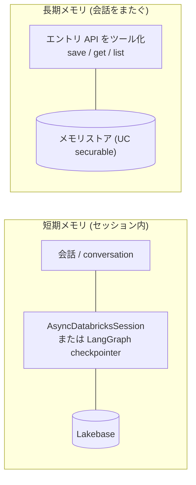
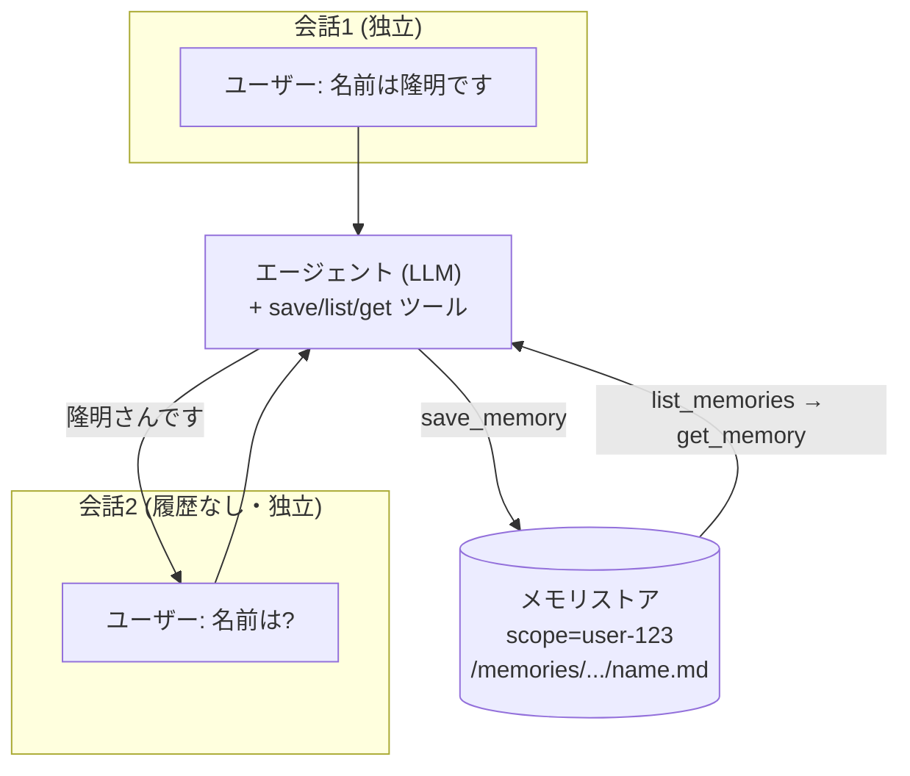

# マネージドエージェントメモリとは

Databricks の「マネージドエージェントメモリ (Managed Agent Memory)」は、エージェントの長期記憶を Unity Catalog のガバナンス配下で管理する機能です (現在ベータ)。ポイントは、記憶の保存先とスコープ分離を UC が丸ごと面倒を見てくれるところにあります。

構成要素は3つです。

- **メモリストア (memory store)**: メモリエントリのコンテナ。`catalog.schema.name` の3階層で名前付けされる UC のセキュリティ保護可能オブジェクト (securable) です。
- **メモリエントリ (memory entry)**: ストアの中に保存される個々のコンテンツ。`scope` (パーティションキー) と `path` (ソフトパス) で識別します。これが**長期記憶**の実体で、エージェントには後述のツールとして渡します。
- **会話 (conversation)**: 単一スコープにピン留めされた OpenAI 互換の会話状態。こちらは**短期 (セッション) メモリ**のレイヤーで、長期記憶とは役割が分かれています (後述)。

同じ「エージェントの記憶」でも、LangGraph の checkpointer / store を Lakebase Postgres に載せる[セルフマネージドなエージェントメモリ](https://docs.databricks.com/aws/ja/agents/agent-framework/stateful-agents)とは別ラインです。セルフマネージドが「Postgres を自分で持って自分でスキーマ設計する」のに対し、マネージド版は「UC の securable として記憶を宣言し、権限もスコープ分離も UC の枠組みで効かせる」という思想の違いがあります。

この記事では、ノートブックから、メモリストアの作成・エントリの CRUD・検索を試したうえで、最終的にエントリ API をエージェントのツールとして渡し、会話をまたいで記憶するエージェントを実際に動かします。公式リファレンスは[メモリ API リファレンス](https://docs.databricks.com/aws/ja/agents/agent-memory/memory-store-api)、ガイドは[マネージドエージェントメモリ](https://docs.databricks.com/aws/ja/agents/agent-memory/managed-memory)です。

# 前提条件

- ベータ機能なので、ワークスペース管理者が[プレビュー設定](https://docs.databricks.com/aws/ja/admin/workspace-settings/manage-previews)から有効化しておく必要があります。


- Unity Catalog が有効なワークスペース。
- メモリストアを作成する親スキーマに対する `CREATE MEMORY STORE` 権限。

権限モデルは操作ごとに分かれています。主なものを整理すると次の通りです。

| 操作 | 必要な権限 |
| --- | --- |
| メモリストア作成 | 親スキーマの `CREATE MEMORY STORE` |
| ストア取得・エントリ読み取り・検索 | ストアの `READ MEMORY STORE` |
| エントリ書き込み・更新・削除、会話作成 | ストアの `WRITE MEMORY STORE` |
| ストア更新・削除 | ストアの `MANAGE` |

# ノートブックで認証する

Databricks ノートブックなら、認証情報はノートブックコンテキストから取れるのでそのまま使えます。

```python
%pip install -U databricks-openai databricks-sdk
dbutils.library.restartPython()
```

```python
import requests

ctx = dbutils.notebook.entry_point.getDbutils().notebook().getContext()
HOST = ctx.apiUrl().get()          # 例: https://xxx.cloud.databricks.com
TOKEN = ctx.apiToken().get()
H = {"Authorization": f"Bearer {TOKEN}", "Content-Type": "application/json"}
```

コンテキストトークンは短命なので、セッションをまたいで使い回したい場合は `databricks auth login` の OAuth トークンに切り替えるのが無難です。

# メモリストアを作成する

`POST /api/2.1/unity-catalog/memory-stores` で作成します。`name` は `[A-Za-z0-9_-]+` に一致する1〜255文字で、親スキーマ内で一意である必要があります。

```python
r = requests.post(
    f"{HOST}/api/2.1/unity-catalog/memory-stores",
    headers=H,
    json={
        "name": "support_agent_memory",
        "catalog_name": "main",       # 自分の権限のあるカタログ/スキーマに変更
        "schema_name": "default",
        "description": "Long-term memory for the support agent",
    },
)
print(r.status_code, r.json())
```

成功すると `memory_store_id` (サーバー割り当ての UUID) や `securable_type: "MEMORY_STORE"`、作成者が `owner` として返ります。

```
200 {'name': 'support_agent_memory', 'catalog_name': 'main', 'schema_name': 'default',
     'full_name': 'main.default.support_agent_memory',
     'memory_store_id': '1a328680-feef-4c8b-bfab-6aec82b92a3f',
     'securable_type': 'MEMORY_STORE', 'owner': '...', 'created_by': '...', ...}
```

ストアの作成者はオーナーとして必要な権限をすべて持つため、自分で作って自分で読み書きするだけなら追加の権限付与は要りません。アプリのサービスプリンシパルなど別のプリンシパルに触らせる場合にのみ、`WRITE MEMORY STORE` / `READ MEMORY STORE` を明示的に付与します(会話 API のセクションで後述)。

# メモリエントリを操作する

## 書き込み

`POST /api/2.1/unity-catalog/memory-stores/{full_name}/entries` で作成します。`scope` はクエリパラメータ、本文がエントリです。

```python
store = "main.default.support_agent_memory"
r = requests.post(
    f"{HOST}/api/2.1/unity-catalog/memory-stores/{store}/entries",
    headers=H,
    params={"scope": "user-123"},
    json={
        "path": "/memories/preferences.md",
        "contents": "Prefers email. Timezone: JST. Enterprise subscription.",
        "description": "User 123 preferences",
    },
)
print(r.status_code, r.json())
```

各フィールドの役割は明確に分かれています。

- `scope`: エントリが属するパーティション。**ユーザー間の分離境界**です。エンドユーザー ID などを、モデルにではなく信頼できるコード側で設定します。
- `path`: スコープ内でエントリを識別するソフトパス。`/memories/` で始まる必要があり、不変です。
- `contents`: 自由形式の本文テキスト。
- `description`: 1行要約。リスト応答のインデックスフックとして機能します。

成功すると保存されたエントリがそのまま返り、`has_contents: True` になります。

```
200 {'path': '/memories/preferences.md',
     'contents': 'Prefers email. Timezone: JST. Enterprise subscription.',
     'description': 'User 123 preferences', 'scope': 'user-123',
     'memory_store_name': 'main.default.support_agent_memory',
     'create_time': '2026-07-02T06:45:58.327Z', 'has_contents': True, ...}
```

## 取得と一覧

`entries:get` は `scope` + `path` で単一エントリを取得し、`contents` 込みで返します。

```python
r = requests.get(
    f"{HOST}/api/2.1/unity-catalog/memory-stores/{store}/entries:get",
    headers=H,
    params={"scope": "user-123", "path": "/memories/preferences.md"},
)
print(r.status_code, r.json())
```

一方 `entries` (リスト) は `scope` 内のエントリを列挙しますが、`contents` は省略され、メタデータと `has_contents` だけを返します。大量のエントリを一覧するときに本文を引きずらない設計です。

```python
r = requests.get(
    f"{HOST}/api/2.1/unity-catalog/memory-stores/{store}/entries",
    headers=H,
    params={"scope": "user-123"},
)
print(r.status_code, r.json())
```

```
{'entries': [{'path': '/memories/preferences.md',
              'description': 'User 123 preferences', 'scope': 'user-123',
              'has_contents': True, ...}]}   # contents は省略される
```

# メモリを検索する

`entries:search` は、パス・コンテンツ・説明の各フィールドを対象に**キーワードで**検索します。ここが今回いちばん挙動を理解できた部分です。

同じエントリに対して、クエリを変えて叩いてみます。

```python
for q in ["preferences", "email", "communication preferences"]:
    r = requests.post(
        f"{HOST}/api/2.1/unity-catalog/memory-stores/{store}/entries:search",
        headers=H,
        json={"scope": "user-123", "query": q},
    )
    print(q, "->", r.status_code, r.json())
```

結果は次の通りでした。

- `preferences` -> score **2.0** でヒット (path と description の両方に含まれる)
- `email` -> score **1.0** でヒット (contents に含まれる)
- `communication preferences` -> **空 (0件)**

```
preferences -> 200 {'results': [{'memory_entry': {...}, 'score': 2.0}]}
email -> 200 {'results': [{'memory_entry': {...}, 'score': 1.0}]}
communication preferences -> 200 {}
```

ここから読み取れる挙動は2つです。

1つ目は、これはセマンティック検索ではなく**キーワード検索**だということ。`communication` という語はエントリのどのフィールドにも存在しないため、`email` と意味的に近くてもヒットしません。`score` が 2.0 / 1.0 と整数的なのも、ヒットしたフィールド数や出現に応じた単純加算に見え、キーワードベースという読みと整合します。

2つ目は、含まれる語 (`preferences`) と含まれない語 (`communication`) を混ぜたクエリが0件になった点。単語単体の `preferences` は当たるのに組み合わせると落ちるので、クエリ内の語がフィールドに見つからないと結果が絞り込まれる、全語一致寄りの挙動と観測できます。つまり語彙外の単語を1つ混ぜるだけでヒットが消えます。

## 実運用での示唆

検索の当たり幅を上げたいなら、**検索で引きたい語を意図的に `description` に盛り込む**のが効きます。今回なら description を `User 123 communication and email preferences` にしておけば、`communication` でも引けるようになります。`contents` が本文、`description` が検索命中率を上げる要約、という役割分担がここで実証できた形です。リファレンスが description を「リスト応答のインデックスフック」と位置づけているのは、まさにこの用途です。

実際、[公式ドキュメント](https://docs.databricks.com/aws/ja/agents/agent-memory/managed-memory)のサンプルも同じクエリ `communication preferences` を使っていますが、そちらの description は `User 123 communication preferences and account details` と、意図的に `communication` を含めてあります。だからサンプルではこのクエリがヒットします。検索語を description に仕込むのは、公式サンプルがそう設計しているという意味でも定石と言えます。

# 短期メモリと長期メモリを区別する

エージェントに記憶を持たせる段になると、ここが一番の勘所です。Databricks は記憶を2種類に分けています。

- **短期メモリ**: 単一セッション内の文脈。会話 (conversation) が担い、OpenAI Agents SDK の `AsyncDatabricksSession` や LangGraph の checkpointer (いずれも Lakebase 裏付け) で実装します。
- **長期メモリ**: 会話をまたいで残る知識。これがマネージドメモリ、つまり**メモリエントリ**の担当です。

長期メモリは、繋いでおけば自動で貯まるものではありません。「これは覚えておくべきだ」「さっきの話は前に聞いたはずだ」という判断と、それに対応する保存・取得の操作を、エージェント自身が行う必要があります。そのための道具が、これまで触ってきたエントリ API を関数化した5つのツール (save/get/list/update/delete) です。LLM がこれらをツールとして持ち、ユーザーが名前を告げれば `save_memory` を呼び、名前を聞かれれば `list_memories` で一覧を見て `get_memory` で読む、という流れを自分で判断して実行します。

思い出す側の手順が `list_memories → get_memory` で、`entries:search` を使わない点もポイントです。検索はクエリの語と一致するエントリだけを返すため、前節で見た通り語彙がずれると取りこぼします。対して `list_memories` はスコープ内のエントリを絞り込まず全件返すので、取りこぼしが起きません。全件の一覧 (パスと1行要約) を見たうえで、関連するものをエージェント自身が選んで `get_memory` で読む、という流れです。絞り込みを当てにならない検索ではなく LLM の判断に委ねる形で、これはエントリ件数が多くない前提での割り切りでもあります。公式の `managed-memory` スキル ([app-templates](https://github.com/databricks/app-templates) 同梱) もこの方式を採っています。

短期と長期の役割分担を図にすると、こうなります。



# エージェントに長期記憶を持たせる

ここからが本題です。ノートブック内で完結させるため、エントリ API を呼ぶ関数を用意し、それをツールとしてエージェントに渡す最小構成を作ります。会話バインドは使いません。

先に全体像です。独立した2つの会話を、メモリストアが橋渡しします。



まずツール実体です。検証済みの REST をそのまま関数化します。

```python
import json
store = "main.default.support_agent_memory"
BASE = f"{HOST}/api/2.1/unity-catalog/memory-stores/{store}/entries"

def save_memory(scope, path, description, contents=""):
    r = requests.post(BASE, headers=H, params={"scope": scope},
        json={"path": path, "description": description, "contents": contents})
    if r.status_code == 200:
        return f"saved {path}"
    if "ALREADY_EXISTS" in r.text:
        return f"already exists at {path} (use update to revise)"
    return f"error: {r.text}"

def list_memories(scope):
    items = requests.get(BASE, headers=H, params={"scope": scope}).json().get("entries", [])
    return "\n".join(f"- {e['path']}: {e.get('description','')}" for e in items) or "No memories yet."

def get_memory(scope, path):
    e = requests.get(f"{BASE}:get", headers=H, params={"scope": scope, "path": path}).json()
    return e.get("contents") or e.get("description") or "(empty)"

EXEC = {"save_memory": save_memory, "list_memories": list_memories, "get_memory": get_memory}
```

次に、これらをツールスキーマとして定義し、`responses.create` の function calling ループで回します。通常の Responses function calling なので、クライアントは `use_ai_gateway=True` で構築します (会話バインドを使わないので、ここは素直に通ります)。`scope` はユーザー間の分離境界なので、モデルに決めさせず、信頼できるコード側で固定するのが鉄則です。

```python
from databricks_openai import DatabricksOpenAI

client = DatabricksOpenAI(use_ai_gateway=True)
MODEL = "databricks-gpt-5-2"   # function calling が不安定なら databricks-claude-sonnet-4-5
SCOPE = "user-123"

TOOLS = [
  {"type": "function", "name": "save_memory",
   "description": "ユーザーについての永続的な事実/好みを1件保存する",
   "parameters": {"type": "object", "properties": {
       "path": {"type": "string", "description": "/memories/ で始まり .md で終わる安定したトピックパス"},
       "description": {"type": "string", "description": "1行要約。短い事実ならこれ自体が記憶"},
       "contents": {"type": "string", "description": "任意。1行に収まらない詳細"}},
     "required": ["path", "description"]}},
  {"type": "function", "name": "list_memories",
   "description": "保存済みメモリを全件 (path と description) 返す。想起はまずこれ",
   "parameters": {"type": "object", "properties": {}, "required": []}},
  {"type": "function", "name": "get_memory",
   "description": "path を指定してメモリの本文を読む",
   "parameters": {"type": "object", "properties": {"path": {"type": "string"}}, "required": ["path"]}},
]

MEMORY_INSTRUCTIONS = (
    "あなたはユーザーについて会話をまたぐ永続メモリを持つ。"
    "ユーザー個人に関わる質問では、まず list_memories を呼び、必要なら get_memory で本文を読んでから答える。"
    "確認せずに『分かりません』と言わない。"
    "ユーザーが述べた永続的な事実/好みだけを save_memory で保存し、保存したら一言伝える。"
)

def chat(user_text, scope=SCOPE):
    items = [{"role": "system", "content": MEMORY_INSTRUCTIONS},
             {"role": "user", "content": user_text}]
    while True:
        resp = client.responses.create(model=MODEL, input=items, tools=TOOLS)
        calls = [o for o in resp.output if getattr(o, "type", None) == "function_call"]
        if not calls:
            return resp.output_text
        items += resp.output   # モデルの function_call をそのまま差し戻す
        for c in calls:
            result = EXEC[c.name](scope, **json.loads(c.arguments or "{}"))
            items.append({"type": "function_call_output", "call_id": c.call_id, "output": result})
```

動作確認は、履歴を共有しない独立した2回の呼び出しで行います。ここで会話をまたいで想起できれば、コンテキストではなくメモリストアが記憶している証明になります。

```python
print(chat("私の名前は隆明です。覚えておいてください。"))
print(chat("私の名前は何でしたっけ?"))
```

実行結果です。独立した2回の呼び出しで、turn 2 (履歴なし) でも名前を復元しています。


turn 1 でエージェントは自分で `save_memory` を呼び、`/memories/user_profile/name.md` というパスまで自分で決めて保存しました。turn 2 は履歴を渡していない独立した呼び出しなのに、`list_memories → get_memory` をたどって名前を復元しています (出力の `**隆明**` はモデルがマークダウンの太字記号をそのまま返したもの)。会話をまたぐ長期記憶が、メモリストア経由で成立していることが確認できました。

実運用では、この5つのツールを OpenAI Agents SDK の `Agent` や LangGraph の `create_agent` に渡し、`scope` をリクエストごとに (デプロイ時は検証済みの OBO トークンから) 解決します。アプリとしてデプロイする場合は、アプリの Databricks サービスプリンシパルに対象ストアの `WRITE MEMORY STORE` / `READ MEMORY STORE` を付与しておきます (サービスプリンシパルはすべてのスコープを読めるため、スコープ設計は信頼できるコード側で固定します)。このあたりを丸ごと面倒みてくれるのが `managed-memory` スキルです。

ここで機能とスキルの関係を整理しておきます。記憶の本体はあくまで機能側、つまり UC のメモリストアとエントリ REST API で、この記事でノートブックから直接叩いてきたものがそれです。一方 `managed-memory` スキルは、その REST を5つのツールとしてエージェントに配線する組み込み作業を Claude Code に代行させる手順書であって、記憶がスキルの中にあるわけではありません。

スキルは必須ではなく、ドキュメントでも「マネージドメモリをエージェントに追加する最も簡単な方法」と位置づけられている、いわば一番ラクな入口です。使い方は、app-templates のテンプレートから始めるか既存プロジェクtrにスキルを置くかして、コーディングアシスタントに「エージェントに長期メモリを追加して」と頼むだけ。あとは Claude Code が SKILL.md を読み、ツールの実装・scope の解決 (検証済みユーザートークンから取得しモデルには決めさせない)・権限付与・エージェントへの指示文まで一式セットアップします。

この記事は、そのスキルが自動でやることを、あえて手作業で展開したものです。ツール関数の実装と function calling ループを自分で書くことで、スキルが Databricks Apps 向けに生成する中身をノートブック上に再現しています。だから、スキルの中で何が起きているか、なぜエントリのツール化が長期記憶の正体なのかが、手を動かしながら見える形になっています。

# まとめ

ノートブックからマネージドエージェントメモリを触ってみて、確認できたことは以下です。

- メモリストアは UC の securable として作成でき、権限も `READ / WRITE / MANAGE MEMORY STORE` として UC の枠組みで効く。オーナーは追加付与なしで読み書きでき、明示的な権限付与が要るのはアプリのサービスプリンシパルなど別プリンシパルに触らせる場合だけ。
- エントリは `scope` (ユーザー間の分離境界) と `path` (不変のソフトパス) で識別され、書き込み・取得・一覧・検索が REST でひと通り揃っている。list は本文を省いてメタデータだけ返す。
- 検索はセマンティックではなくキーワードベース。語彙外の単語を混ぜるとヒットが消えるため、`description` に検索用の語を仕込む設計が命中率に直結する。公式スキルが recall に検索を使わず `list → get` を選んでいるのも同じ理由。
- 記憶は短期 (会話 / セッション) と長期 (エントリ) で分かれる。長期記憶の正しい使い方は、エントリ API をエージェントのツールとして渡し、LLM に save/list/get を判断させること。会話バインドは短期メモリのレイヤーで、長期記憶とは役割が違う。

セルフマネージドな Lakebase ベースのメモリと比べると、マネージド版は「記憶を UC のガバナンス対象として宣言でき、スコープ分離を仕組みで担保できる」点、そして「エントリ API をツールとして渡すだけでエージェントに長期記憶を持たせられる」手軽さが強みです。一方で検索がキーワードベースなので、pgvector による意味検索を自前で組めるセルフマネージドとは得意分野が違います。用途に応じて使い分ける、あるいは併用するのが現実的だと思います。

### はじめてのDatabricks

[はじめてのDatabricks](https://qiita.com/taka_yayoi/items/8dc72d083edb879a5e5d)

### Databricks無料トライアル

[Databricks無料トライアル](https://databricks.com/jp/try-databricks)
