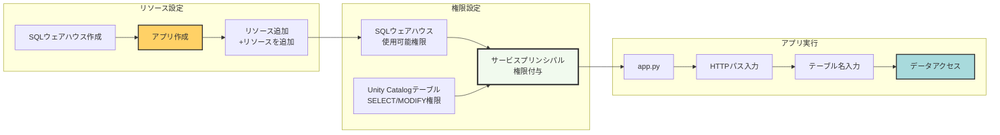
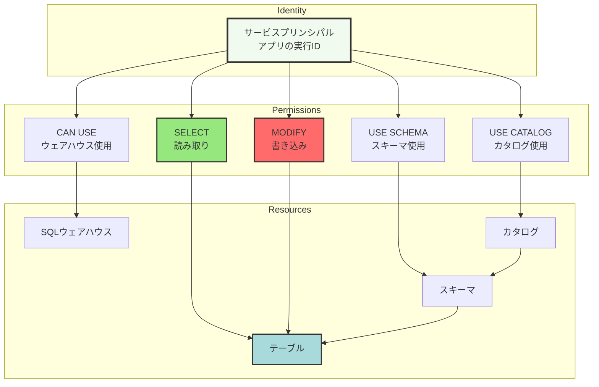

こちらをウォークスルーします。

https://docs.databricks.com/aws/ja/dev-tools/databricks-apps/tutorial-streamlit

大まかに以下の流れとなっています。

1. (無い場合は)SQLウェアハウスの作成
1. アプリの作成
1. コードの作成
1. テーブルの作成、権限付与
1. アプリへのコードのデプロイ
1. 動作確認



個人的に実感したのは、**権限設定は適切に！** ということです。今回は以下のようにアプリの[サービスプリンシパル](https://docs.databricks.com/aws/ja/admin/users-groups/service-principals)(人間に紐づかないユーザーアイデンティティ)に権限を付与しています。




# アプリの作成

**コンピュート**の**アプリ**タブにアクセスして、**アプリを作成**をクリックします。


今回は**カスタムアプリを作成**を選択します。後で触れますが、`app.yaml`を最初から作成してもらうならStreamlitのHello worldでもいいかもしれません。


適当に名前をつけます。


このチュートリアルではテーブルを操作するので、計算資源としての[SQLウェアハウス](https://docs.databricks.com/aws/ja/compute/sql-warehouse/)が必要となります。無い場合には作成する必要があります。そして、ここで[**アプリのリソース**](https://docs.databricks.com/aws/ja/dev-tools/databricks-apps/resources)として追加しておきます。これによって、アプリ(のサービスプリンシパル)への権限付与が自動で行われるようになります。このチュートリアルではGUIから別途SQLウェアハウスを指定する必要がありますが、`app.yaml`の定義から参照することもできます(これは別記事で取り上げます)。

ここで重要なのは、アプリで使うSQLウェアハウスなどのリソースをアプリが利用できるように適切な権限設定をする必要があるということです。

**+リソースを追加**をクリックしてSQLウェアハウスを選択します。


使用するSQLウェアハウスを選択し、権限で**使用可能**を選択します。


これでアプリが作成されますが、この時点では計算資源がデプロイされただけで、コードがデプロイされていないので動作しません。


以下のステップでコードをデプロイします。

# コードの作成

ワークスペースで適当にフォルダを作成します。

指示に従ってファイルを作成していきます。


## requirements.txt


```:requirements.txt
databricks-sdk
databricks-sql-connector
streamlit
pandas
```

## app.py

```py:app.py
import streamlit as st
from databricks import sql
from databricks.sdk.core import Config


cfg = Config()  # ローカルで実行する際はDATABRICKS_HOST環境変数を設定してください


@st.cache_resource # 接続はキャッシュされます
def get_connection(http_path):
    return sql.connect(
        server_hostname=cfg.host,
        http_path=http_path,
        credentials_provider=lambda: cfg.authenticate,
    )

def read_table(table_name, conn):
    with conn.cursor() as cursor:
        query = f"SELECT * FROM {table_name}"
        cursor.execute(query)
        return cursor.fetchall_arrow().to_pandas()

http_path_input = st.text_input(
    "Databricks HTTP Pathを入力してください:", placeholder="/sql/1.0/warehouses/xxxxxx"
)

table_name = st.text_input(
    "UCテーブル名を指定してください:", placeholder="catalog.schema.table"
)

if http_path_input and table_name:
    conn = get_connection(http_path_input)
    df = read_table(table_name, conn)
    st.dataframe(df)
```

## app.yaml

ドキュメントに記載されていませんが、カスタムアプリの場合は明示的に[app.yaml](https://docs.databricks.com/aws/ja/dev-tools/databricks-apps/app-runtime)ファイルを作成しなくてはなりません。今回は起動コマンドだけで十分ですが、ここで環境変数のマッピングを行うこともできます。

```yaml:app.yaml
command: [
  "streamlit", 
  "run",
  "app.py"
]
```

# テーブルの作成

[カタログエクスプローラ](https://docs.databricks.com/aws/ja/catalog-explorer/)にアクセスして、適切なカタログ、スキーマ配下にテーブルを作成します。以下のようなCSVファイルをアップロードして[テーブルを作成](https://docs.databricks.com/aws/ja/ingestion/file-upload/upload-data)します。

```
id,name,age
1,taka,52
2,polka,8
```


アプリからアクセスできるように、サービスプリンシパルに[権限を付与](https://docs.databricks.com/aws/ja/getting-started/create-table#%E3%82%B9%E3%83%86%E3%83%83%E3%83%97-2-%E3%83%86%E3%83%BC%E3%83%96%E3%83%AB%E3%81%AE%E3%82%A2%E3%82%AF%E3%82%BB%E3%82%B9%E8%A8%B1%E5%8F%AF%E3%82%92%E7%AE%A1%E7%90%86%E3%81%99%E3%82%8B)します。


# コードのデプロイメント

コードとテーブルの準備ができたので、アプリにコードをデプロイします。アプリの画面にアクセスして、右上の**デプロイ**ボタンをクリックします。そして、上で作成したコードが格納されているフォルダを選択します。


これでアプリにコードがデプロイされました。**実行中**になったら、その右のURLをクリックします。


アプリにアクセスする前に、アプリで指定するSQLウェアハウスの画面でHTTPパスをコピーしておきます。


同様に、テーブルのフルパスもコピーしておきます。


# アプリでの動作確認

二つのテキストボックスが表示されるので、上でコピーしたHTTPパスとテーブルパスを指定してEnterを押すとテーブルの中身が表示されました。成功です。


# 更新系アプリの実装

`app.py`を以下の内容で更新します。

```py:app.py
import pandas as pd
import streamlit as st
from databricks import sql
from databricks.sdk.core import Config


cfg = Config() # ローカルで実行する際にDATABRICKS_HOST環境変数を設定


@st.cache_resource
def get_connection(http_path):
    return sql.connect(
        server_hostname=cfg.host,
        http_path=http_path,
        credentials_provider=lambda: cfg.authenticate,
    )


def read_table(table_name: str, conn) -> pd.DataFrame:
    with conn.cursor() as cursor:
        cursor.execute(f"SELECT * FROM {table_name}")
        return cursor.fetchall_arrow().to_pandas()


def insert_overwrite_table(table_name: str, df: pd.DataFrame, conn):
    progress = st.empty()
    with conn.cursor() as cursor:
        rows = list(df.itertuples(index=False))
        values = ",".join([f"({','.join(map(repr, row))})" for row in rows])
        with progress:
            st.info("Databricks SQLを呼び出しています...")
        cursor.execute(f"INSERT OVERWRITE {table_name} VALUES {values}")
    progress.empty()
    st.success("変更が保存されました")


http_path_input = st.text_input(
    "Databricks SQLウェアハウスのHTTPパスを指定してください:",
    placeholder="/sql/1.0/warehouses/xxxxxx",
)

table_name = st.text_input(
    "カタログテーブル名を指定してください:", placeholder="catalog.schema.table"
)

if http_path_input and table_name:
    conn = get_connection(http_path_input)
    original_df = read_table(table_name, conn)
    edited_df = st.data_editor(original_df, num_rows="dynamic", hide_index=True)

    df_diff = pd.concat([original_df, edited_df]).drop_duplicates(keep=False)
    if not df_diff.empty:
        if st.button("変更を保存"):
            insert_overwrite_table(table_name, edited_df, conn)
else:
    st.warning("ウェアハウスパスとテーブル名の両方を指定してください。")
```

コードを更新したら再度デプロイします。アプリにアクセスすると、今度は編集可能なグリッドUIが表示されます。


行を追加して、**変更を保存**をクリックすると保存に成功した旨のメッセージが表示されます。


直接テーブルを確認すると、変更が反映されていることがわかります。


### はじめてのDatabricks

[はじめてのDatabricks](https://qiita.com/taka_yayoi/items/8dc72d083edb879a5e5d)

### Databricks無料トライアル

[Databricks無料トライアル](https://databricks.com/jp/try-databricks)
