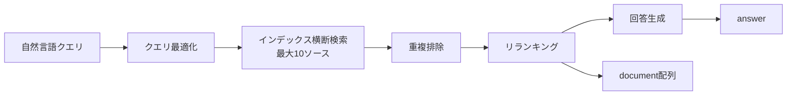

# はじめに

Databricks SQLに `ai_search()` 関数がBetaとして追加されました。ワークスペース管理者がプレビューページから有効化することで使えるようになります。


- [ai_search関数](https://docs.databricks.com/aws/ja/sql/language-manual/functions/ai_search)
- [Databricks AI Search](https://docs.databricks.com/aws/ja/ai-search/ai-search)

従来からある `vector_search()` 関数がベクトルインデックスへの素の類似検索だったのに対し、`ai_search()` は自然言語のクエリを受け取ると、検索クエリの最適化、複数インデックスの横断検索と重複排除、関連度によるリランキング、そして取得ドキュメントに基づいた回答の生成までをワンコールで実行します。SQL関数1つでRAGパイプラインが完結する、と言うと大げさに聞こえますが、実際に試してみるとかなりそれに近いことができました。

サンプルデータの準備からインデックス作成、`ai_search()` の各種オプションの挙動確認まで、エンドツーエンドで試した結果を書いていきます。

# vector_search()との違い

名前が紛らわしいのですが、この2つはレイヤーが違います。`ai_search()`の内部では以下の処理がワンコールで実行されます。



| 観点 | vector_search() | ai_search() |
|---|---|---|
| 位置づけ | 検索プリミティブ | リトリーバルパイプライン |
| 対象インデックス | 1つ | 最大10ソース横断 |
| クエリ | そのまま検索 | LLMがクエリを最適化生成 |
| リランキング | なし (素の類似度順) | あり |
| 回答生成 | なし | デフォルトあり |
| 制御方法 | query_type等のパラメータ | 自然言語のinstructions |
| ステータス | パブリックプレビュー | Beta (DBR 18.2以降) |

単純な類似検索で十分なら `vector_search()`、テーブルの1行ごとにRAGを回すようなバッチ処理なら `ai_search()`、という棲み分けになります。この違いは後半で実際の検索結果を比較すると分かりやすいので、まずは環境を作っていきます。

# 検証環境の準備

## 前提条件

- `ai_search` のBetaプレビューが有効化済みであること
- Databricks Runtime 18.2以降、またはサーバレスコンピュート
- ワークスペースがAI Search対応リージョンであること

サーバレスを使う場合は環境バージョン3以上が必要です。`ai_search()` の戻り値がVARIANT型のため、デフォルトの環境バージョンのままだと実行できません。ここが最初のハマりどころです。

## SDKのインストール

Mosaic AI Vector SearchはDatabricks AI Searchに名称変更されており、Python SDKも `databricks-vectorsearch` から `databricks-ai-search` にリネームされています。旧パッケージも当面は動きますが、新規で書くなら新しい方を使います。

```python
%pip install databricks-ai-search
dbutils.library.restartPython()
```

クライアントのクラス名も `VectorSearchClient` から `AISearchClient` に変わっています。

```python
from databricks.ai_search.client import AISearchClient

client = AISearchClient()
```

## サンプルデータの作成

ナレッジソースとなるDeltaテーブルを作ります。ここでは架空のプロダクトドキュメント8件を用意しました。後で `ai_search()` の設定に使う、本文の `content` 列、ドキュメントURIの `doc_uri` 列、メタデータフィルタ用の `product` / `language` 列を持たせています。Delta Syncインデックスを使うので、Change Data Feedの有効化を忘れないでください。

```python
CATALOG = "takaakiyayoi_catalog"
SCHEMA = "ai_search_demo"
SOURCE_TABLE = f"{CATALOG}.{SCHEMA}.product_docs"

spark.sql(f"CREATE SCHEMA IF NOT EXISTS {CATALOG}.{SCHEMA}")

docs = [
    (1, "SQLウェアハウスの自動停止は、デフォルトで10分間アイドル状態が続くと発動します。設定画面のAuto stopから変更でき、サーバレスSQLウェアハウスでは最短1分に設定できます。", "https://example.com/docs/sql-warehouse-autostop", "sql_warehouse", "ja"),
    (2, "SQLウェアハウスの自動スケーリングは、クラスター数の最小値と最大値を指定することで有効になります。同時実行クエリ数に応じてクラスターが追加され、負荷が下がると縮退します。", "https://example.com/docs/sql-warehouse-autoscaling", "sql_warehouse", "ja"),
    (3, "Unity Catalogのテーブルに対するアクセス権限は、GRANT文またはカタログエクスプローラーから付与できます。SELECT、MODIFY、ALL PRIVILEGESなどが指定可能です。", "https://example.com/docs/uc-permissions", "unity_catalog", "ja"),
    (4, "Delta Lakeのタイムトラベル機能を使うと、VERSION AS OFまたはTIMESTAMP AS OF句で過去のスナップショットをクエリできます。デフォルトの保持期間は30日です。", "https://example.com/docs/delta-time-travel", "delta_lake", "ja"),
    (5, "モデルサービングエンドポイントのスケールトゥゼロを有効にすると、リクエストがない間はコンピュートが解放され、コストを削減できます。コールドスタートには数十秒かかる場合があります。", "https://example.com/docs/model-serving-scale-to-zero", "model_serving", "ja"),
    (6, "ジョブの失敗時にはリトライポリシーを設定できます。最大リトライ回数とリトライ間隔を指定し、一時的なエラーからの自動復旧を実現します。", "https://example.com/docs/jobs-retry", "jobs", "ja"),
    (7, "サーバレスコンピュートでは、環境バージョンによって利用可能な機能が異なります。VARIANT型などの新機能を使うには環境バージョン3以上を指定してください。", "https://example.com/docs/serverless-environment", "serverless", "ja"),
    (8, "AI Searchインデックスは、ソースのDeltaテーブルが更新されると同期されます。TRIGGEREDモードでは手動またはスケジュール実行、CONTINUOUSモードでは数秒のレイテンシで自動同期されます。", "https://example.com/docs/ai-search-sync", "ai_search", "ja"),
]

df = spark.createDataFrame(docs, ["id", "content", "doc_uri", "product", "language"])

(df.write
   .format("delta")
   .mode("overwrite")
   .option("delta.enableChangeDataFeed", "true")
   .saveAsTable(SOURCE_TABLE))
```

## インデックスの作成

AI Searchエンドポイント上に、マネージド埋め込み (Databricksが埋め込みを計算) のDelta Syncインデックスを作成します。エンドポイントを新規作成する場合は `client.create_endpoint(name=..., endpoint_type="STANDARD")` を先に実行してください。

```python
ENDPOINT_NAME = "one-env-shared-endpoint-3"  # 使用するエンドポイント
INDEX_NAME = f"{CATALOG}.{SCHEMA}.product_docs_index"

index = client.create_delta_sync_index(
    endpoint_name=ENDPOINT_NAME,
    source_table_name=SOURCE_TABLE,
    index_name=INDEX_NAME,
    pipeline_type="TRIGGERED",
    primary_key="id",
    embedding_source_column="content",
    embedding_model_endpoint_name="databricks-gte-large-en",
)
```

インデックスがオンラインになるまで数分待ちます。

```python
import time

while True:
    status = index.describe().get("status", {})
    print(f"インデックス状態: {status.get('detailed_state', 'UNKNOWN')}")
    if status.get("ready", False):
        break
    time.sleep(30)
```

`PROVISIONING_PIPELINE_RESOURCES` から `ONLINE_TRIGGERED_UPDATE` に遷移すれば準備完了です。

# まずはvector_search()で素の類似検索

比較のため、従来の `vector_search()` で「ウェアハウスのオートスケール設定」を検索してみます。

```sql
SELECT * FROM vector_search(
  index => 'takaakiyayoi_catalog.ai_search_demo.product_docs_index',
  query_text => 'ウェアハウスのオートスケール設定',
  num_results => 3
)
```

結果は以下の通りです。

| 順位 | content (要約) | search_score |
|---|---|---|
| 1 | SQLウェアハウスの自動スケーリングは、クラスター数の最小値と最大値を指定... | 0.667 |
| 2 | サーバレスコンピュートでは、環境バージョンによって利用可能な機能が... | 0.659 |
| 3 | Unity Catalogのテーブルに対するアクセス権限は、GRANT文または... | 0.647 |

1位は正解ですが、2位以下には無関係なドキュメントが並び、スコアも0.667 / 0.659 / 0.647とほぼ団子状態です。素の埋め込み類似度だけでは、関連するものとしないものの分離が意外と難しいことが分かります。この結果を覚えておいてください。

# ai_search()の基本形

同じ質問を `ai_search()` に投げてみます。ナレッジソースの設定は `{type, config}` のJSON配列で渡します。`type` は現時点では `vector_search` (AI Searchインデックス) のみサポートされています。

```sql
SELECT ai_search(
  'SQLウェアハウスのオートスケーリングはどうやって設定しますか？',
  PARSE_JSON('[{
    "type": "vector_search",
    "config": {
      "index_name": "takaakiyayoi_catalog.ai_search_demo.product_docs_index",
      "text_col": "content",
      "doc_uri_col": "doc_uri",
      "filter_columns": "product,language"
    }
  }]')
) AS result
```

戻り値はVARIANTで、リランキング済みの `document` 配列と、生成された回答の `answer` フィールドを含みます。`answer` だけを取り出すには `:answer::STRING` を使います。

```sql
SELECT ai_search(
  'SQLウェアハウスのオートスケーリングはどうやって設定しますか？',
  PARSE_JSON('[{ ... 上と同じ ... }]')
):answer::STRING AS answer
```

得られた回答がこちらです。

> SQLウェアハウスのオートスケーリングは、クラスター数の最小値と最大値を設定することで有効にします。最小数と最大数を指定すると、同時実行クエリの数に応じて自動的にクラスターが追加され、負荷が低下したときにはクラスターが縮小します。これにより、需要に合わせたスケールアウト・スケールインが自動で行われます。

`vector_search()` では無関係なドキュメントが上位に混ざっていた同じ質問に対して、正しいドキュメントに基づいた回答が返ってきました。クエリ最適化とリランキングが挟まることの効果がよく分かる対比です。

# instructionsで検索と回答を制御する

第3引数の `instructions` には、最大4,000文字の自然言語の指示を渡せます。この指示はクエリ生成、メタデータフィルタの生成、リランキングに反映されます。

少し意地悪に、特定のドキュメント1件では答えられない「コストを抑える方法」を聞いてみます。

```sql
SELECT ai_search(
  'コストを抑える方法を教えてください',
  PARSE_JSON('[{ ... 同上 ... }]'),
  'コンピュートコストの削減に関するドキュメントを優先してください。回答は日本語で、設定手順を含めてください。'
):answer::STRING AS answer
```

返ってきた回答は、モデルサービングのスケールトゥゼロ、SQLウェアハウスの自動停止、自動スケーリングという、コストに関わる3つのドキュメントを統合し、それぞれ番号付きの設定手順に展開したものでした。単一チャンクの言い換えではなく、複数ソースを横断した統合が行われています。指示に含めた「設定手順を含めてください」もきちんと反映されました。


# generate_answer => falseでリトリーバルのみ実行する

回答生成が不要で、リトリーバルだけを使いたい場合は `options` で `generate_answer` を `false` にします。取得したドキュメントを自分の選んだモデルの `ai_query()` にチェーンして、出力フォーマットを自分で制御するパターンです。

`document` 配列はVARIANTなので、`variant_explode` で行に展開します。

```sql
WITH search_result AS (
  SELECT ai_search(
    'ジョブが失敗したときの対処',
    PARSE_JSON('[{ ... 同上 ... }]'),
    NULL,
    MAP('generate_answer', 'false')
  ) AS result
)
SELECT
  doc.value:page_content::STRING AS page_content,
  doc.value:doc_uri::STRING AS doc_uri
FROM search_result,
  LATERAL variant_explode(result:document) AS doc
```

実行してみると、1位にはリトライポリシーのドキュメントが正しく来た一方、**候補は足切りされず、インデックス内の8件全件が関連度順で返ってきました**。`vector_search()` の `num_results` に相当する件数指定オプションは現時点のシグネチャに見当たらないので、リトリーバルツールとして下流に渡す場合は、下流側で上位N件に絞る前提で設計する必要があります。

# バッチRAG: テーブル全体をエンリッチする

`ai_search()` の本領はここだと思います。サポートチケットのテーブルに対して、1行ごとに関連ドキュメントの検索と解決策の生成を、SQLだけで実行します。

```sql
SELECT
  ticket_id,
  customer_description,
  ai_search(
    customer_description,
    PARSE_JSON('[{ ... 同上 ... }]'),
    'このサポートチケットに関連するドキュメントを見つけ、日本語で解決策を提案してください。'
  ):answer::STRING AS suggested_resolution
FROM takaakiyayoi_catalog.ai_search_demo.support_tickets
```

例えば「先週削除してしまったテーブルのデータを復元したい」というチケットに対しては、タイムトラベルのドキュメントを引き当てた上で、`DESCRIBE HISTORY` でバージョンを確認し `VERSION AS OF` でクエリして復元テーブルを作る、という元ドキュメントには書かれていない具体的な手順まで補完した回答が生成されました。「モデルサービングの最初のリクエストだけ遅い」というチケットには、スケールトゥゼロのコールドスタートを原因として特定し、対策まで提示しています。


従来これをやろうとすると、リトリーバーの実装、プロンプトの組み立て、LLM呼び出しのバッチ処理をPythonで書く必要がありました。それがSELECT文1つになる。ETLパイプラインの中にRAGを1ステップとして組み込める、というのがこの関数の実務的な価値だと思います。

なお、Beta段階の生成AI機能である以上、`answer` の内容が常に正確とは限りません。生成された回答をそのまま顧客回答などに使うのではなく、人の確認を挟む、あるいは `generate_answer => 'false'` でリトリーバル結果だけを使い回答生成は自分で制御する、といった設計を推奨します。

# まとめ

`ai_search()` を試してみて分かったことをまとめます。

- `vector_search()` が素の類似検索プリミティブなのに対し、`ai_search()` はクエリ最適化・横断検索・リランキング・回答生成までを含むリトリーバルパイプライン
- **サーバレスで使う場合は環境バージョン3以上が必須。**VARIANT型が使えないと実行できない
- SDKは `databricks-vectorsearch` から `databricks-ai-search` に、クラス名は `VectorSearchClient` から `AISearchClient` にリネームされている
- 素の類似検索でスコアが団子状態になるようなクエリでも、リランキングを経た `ai_search()` は正しいドキュメントに基づく回答を返した
- `instructions` の自然言語指示は、複数ドキュメントの統合や回答フォーマットの制御にきちんと反映された
- **`generate_answer => 'false'` では件数の足切りがなく全候補が返る。**下流で上位N件に絞る前提の設計が必要
- ナレッジソースは最大10個。現時点でサポートされるタイプはAI Searchインデックスのみ

一番の収穫は、`vector_search()` との比較で見えたリランキングの効果でした。埋め込み類似度のスコアだけを見ていると「どれも0.6台だからどれも関連している」と誤解しがちですが、実際には無関係なドキュメントが紛れ込んでいます。この分離をSQL関数の内側でやってくれるのは、RAGの品質に悩んだ経験のある人ほど刺さる機能だと思います。

# 参考リンク

- [ai_search関数](https://docs.databricks.com/aws/ja/sql/language-manual/functions/ai_search)
- [vector_search関数](https://learn.microsoft.com/ja-jp/azure/databricks/sql/language-manual/functions/vector_search)
- [Databricks AI Search](https://docs.databricks.com/aws/ja/ai-search/ai-search)
- [AI Searchエンドポイントとインデックスの作成](https://docs.databricks.com/aws/ja/ai-search/create-ai-search)
- [AI Searchインデックスをクエリする](https://docs.databricks.com/aws/ja/ai-search/query-ai-search)
- [ai_prep_search関数](https://docs.databricks.com/aws/ja/sql/language-manual/functions/ai_prep_search)

### はじめてのDatabricks

[はじめてのDatabricks](https://qiita.com/taka_yayoi/items/8dc72d083edb879a5e5d)

### Databricks無料トライアル

[Databricks無料トライアル](https://databricks.com/jp/try-databricks)
