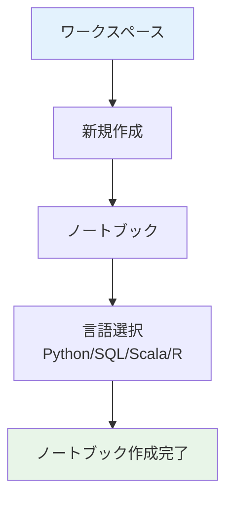

先日のDatabricks Free Editionの発表は個人的には衝撃的でした。以下の記事でも書いた通り、従来存在した無料版のCommunity Editionは機能の制限が多かったのですが、今回新たに生まれ変わったFree EditionではほとんどのDatabricksの機能が**無料**で利用できるようになったのです。

https://qiita.com/taka_yayoi/items/33e9cfa7ca9ca9febe72

今回は、Free Editionにサインアップすると表示されるチュートリアルをウォークスルーしていきたいと思います。


英語表記で恐縮ですが、サインアップを完了するとホームページに3つのチュートリアルが表示されます。左から、

- **自然言語を用いてあなたのデータと会話する** 新たな洞察を発見、可視化するために架空のパン屋の売上、在庫データに関して自然言語でAI/BI Genieに質問しましょう
- **AIを活用したノートブックでデータを探索** クエリーを生成し、結果を可視化するためにどのようにサンプルデータを分析し、人工知能(AI)を活用するのかを学びましょう
- **はじめてのAIエージェントの構築** 統制された洞察のために関数を作成し、Unity Catalogに登録して、アクション可能な洞察を生成するためにチャットベースのAIを構築しましょう

となっています。今回は中央にある**AIアシストノートブックによるデータの探索**をウォークスルーします。個人的に一番好きなインタフェースは[ノートブック](https://docs.databricks.com/aws/ja/notebooks/)です。と言うか一番使ってます。

これまでのDatabricks Free Editionチュートリアルの記事はこちら:

- [Databricks Free Editionで学ぶAI/BI Genie](https://qiita.com/taka_yayoi/items/d2d7b74f0806975a8d63)
- [Databricks Free Editionで学ぶDatabricksノートブック](https://qiita.com/taka_yayoi/items/3d7c642cbdda4669b8c4)
- [Databricks Free Editionで学ぶAIエージェント](https://qiita.com/taka_yayoi/items/a0f5eafb23d736039512)

# Databricksノートブックとは

Databricksノートブックは、データサイエンスと機械学習の分野で革命的な変化をもたらす統合開発環境です。複数のプログラミング言語に対応し、リアルタイムでの共同編集、自動バージョン管理、組み込みのデータビジュアライゼーション機能を提供します。本記事では、初心者でも理解できるよう、Databricksノートブックの基本機能から実践的な使い方まで、図表を交えて詳しく解説します。データ分析業務の効率化を目指す方必見の内容です。

## 機能概要

Databricksノートブックは、データサイエンスと機械学習のための統合開発環境として設計された強力なツールです。従来のJupyter Notebookの機能を大幅に拡張し、企業レベルでのデータ分析作業に必要な機能を網羅しています。

| 主要機能 | 説明 |
|---------|------|
| 多言語対応 | Python、SQL、Scala、R を同一ノートブック内で使用可能 |
| リアルタイム共同編集 | 複数のユーザーが同時にノートブックを編集 |
| 自動バージョン管理 | 変更履歴の自動保存と復元機能 |
| データビジュアライゼーション | グラフやチャートの組み込み表示 |
| ジョブスケジューラー | 定期実行やワークフロー自動化 |
| Git連携 | バージョン管理システムとの統合 |

## 対応プログラミング言語

- **Python:** データ分析・機械学習の主力    
- **SQL:** データクエリ・集計処理        
- **Scala:** 大規模データ処理・Apache Spark (Free Editionでは使用できません)
- **R:** 統計解析・可視化 (Free Editionでは使用できません)              

## メリット、嬉しさ

Databricksノートブックを使用することで得られる具体的なメリットは多岐にわたります。

### 1. 開発効率の劇的向上

**従来の開発フロー vs Databricks**

| 従来の方法 | Databricks |
|-----------|------------|
| 複数ツールの切り替え | 一つのインターフェース |
| 手動でのファイル管理 | 自動バージョン管理 |
| 結果の個別共有 | リアルタイム共有 |
| 環境構築の手間 | クラウド環境で即開始 |

### 2. チームコラボレーションの強化

複数のデータサイエンティストが同じノートブックで同時作業を行えるため、以下のような効果が期待できます：

- **コミュニケーション時間の短縮**: 50%以上の時間削減
- **知見の共有促進**: リアルタイムでの議論とコード共有
- **品質向上**: 相互レビューによるコード品質の向上

## 使い方の流れ

Databricksノートブックの基本的な使用フローを、ステップバイステップで説明します。

### ステップ1: ノートブックの作成



### ステップ2: サンプルノートブックのインポート（推奨）

初心者の方は、まずサンプルノートブックをインポートして学習することをお勧めします。

**インポート手順:**
1. ドキュメントページでサンプルノートブックを選択
2. 「インポート用のリンクをコピー」をクリック
3. ワークスペースでフォルダを右クリック → 「インポート」選択
4. 「URL」を選択してリンクを貼り付け
5. 「インポート」をクリックして完了

### ステップ3: 基本的な開発フロー


### ステップ4: データ分析の実践

**典型的なデータ分析ワークフロー:**

| フェーズ | 作業内容 | 使用言語 |
|---------|---------|---------|
| データ取得 | データベースからの読み込み | SQL |
| データ前処理 | クリーニング・変換 | Python |
| 分析・モデリング | 統計分析・機械学習 | Python/R |
| 可視化 | グラフ・ダッシュボード作成 | Python/SQL |
| 結果共有 | レポート・ダッシュボード | 全言語対応 |

### ステップ5: 自動化とスケジューリング

定期的なデータ処理や分析を自動化できます：


# 使ってみる

**Start exploring**をクリックします。


サンプルノートブックが作成されます。


英語ですが、ボタンをクリックしてアシスタントを呼び出します。**翻訳**と指示すれば日本語になります。


## Databricksノートブックへようこそ

ノートブックは、Databricksの主要なコード作成ツールです。これを使って、シンプルな探索的データ分析からMLモデルのトレーニング、複数段階のデータパイプラインの構築まで、何でも行うことができます。

ベイクハウスのデータを調査して、売上を分析してみましょう！

### ステップ1: 始めましょう

ノートブックセルでコードを実行するには、コードを入力して、セルの左上にある実行ボタンをクリックするか、`Cmd + Enter`を使用します。
</br>
</br>


提供されたステートメントを実行してみてください: `print("Let's execute some Python code!")`

```py
print("Let's execute some Python code!")
```
```
Let's execute some Python code!
```
#### コマンドパレットを試してみましょう

`[Cmd + Shift + P]` キーボードショートカットを使用して、コマンドパレットを開き、新しいセルの挿入、結果の並列表示などの主要なノートブックアクションを実行します。

これを使ってセルを挿入してみましょう。


#### ノートブックはマルチランゲージのオーサリング体験です

DatabricksではPythonだけでなく、SQLやMarkdownを使用してノートブックにコードを書いて実行することができます。

##### 右上のドロップダウンを使用して言語を変更してみましょう。

- コマンドパレットを使用して現在のセルの下に新しいセルを挿入します。
- 言語スイッチャーを使用してその言語をSQLに変更します。セルの上部に`%sql`が表示されることに注目してください。これは[マジックコマンド](https://docs.databricks.com/ja/notebooks/notebooks-code.html#mix-languages)と呼ばれます。
- `select "hello world";`と入力して実行ボタンを押します。

```sql
%sql
select "hello world";
```


### ステップ 3: データの探索と分析
私たちのベーカリーは複数の国でフランチャイズを展開しており、さまざまな製品を提供しています。

まず、Pythonを使用してサンプルデータをクエリし、最も人気のある製品を特定します。

### ステップ 2: サンプルデータにアクセスする

この演習では、ベーカリーフランチャイズデータをシミュレートしたsamples.bakehouseに保存されているBakehouseデータセットを使用します。まず、`samples.bakehouse.sales_transactions`テーブルを表示します。

ノートブックの左側で、カタログビューにアクセスしてカタログ、スキーマ、およびテーブルを参照します。

`sales_transactions`テーブルを見つけるには、左側のスキーマブラウザを開き、 をクリックして**Samples**に移動し、**bakehouse**スキーマを選択して**sales_transactions**テーブルを見つけ、テーブルの横にあるケバブメニュー  をクリックして**新しいセルでプレビュー**を選択します。


### ステップ 3: データの探索と分析
私たちのベーカリーは複数の国でフランチャイズを展開しており、さまざまな製品を提供しています。

まず、Pythonを使用してサンプルデータをクエリし、最も人気のある製品を特定します。

#### 最も人気の製品

**コメントを日本語に**でコメントも翻訳してもらいます。


```py
# サンプルのベイクハウスの取引とフランチャイズのデータセットを読み込み、PySpark DataFrameにロードする。
df_transactions = spark.read.table('samples.bakehouse.sales_transactions')
df_franchises = spark.read.table('samples.bakehouse.sales_franchises')

# PySpark DataFrameをPandas DataFrameに変換する
pdf_transactions = df_transactions.toPandas()
pdf_franchises = df_franchises.toPandas()

# 最も多くのユニットが売れた製品はどれか？
top_product = (pdf_transactions.groupby('product')['quantity']
          .sum()
          .reset_index()
          .sort_values(by='quantity', ascending=False)
         )
        
display(top_product)
```
|product|quantity|
|---|---|
|Golden Gate Ginger|3865|
|Outback Oatmeal|3733|
|Austin Almond Biscotti|3716|
|Tokyo Tidbits|3662|
|Pearly Pies|3595|
|Orchard Oasis|3586|

**ゴールデンゲートジンジャー**は当店のベストセラークッキーです！

その販売で最も業績の良い都市を特定するために、`transactions`テーブルと`franchises`テーブルを結合します。これにより、どの都市がゴールデンゲートジンジャーの販売数が最も多いかを分析できます。

#### franchisesとtransactionsテーブルの結合

```py
## ゴールデンゲートジンジャーのユニットを最も多く販売した都市
top_city = (pdf_franchises.merge(pdf_transactions[pdf_transactions['product'] == 'Golden Gate Ginger'], 
                            on='franchiseID', 
                            how='right')
            .groupby('city')['quantity']
            .sum()
            .reset_index()
            .sort_values(by='quantity', ascending=False)
            .rename(columns={'quantity': 'units'})
         )

display(top_city)
```
|city|units|
|---|---|
|Rome|474|
|Stockholm|316|
|Sydney|184|
|San Francisco|116|
|Kanazawa|93|
|Kyoto|92|
|Osaka|92|
|Chicago|90|
|Washington D.C.|83|
|Nashville|83|
|Boston|81|
|Los Angeles|81|
|Chiba|80|
|Nagoya|79|
|Aomori|79|
|Las Vegas|78|
|Okayama|78|
|Seattle|77|
|Gold Coast|75|
|Berlin|75|
|Kobe|74|
|Austin|74|
|Paris|73|
|Philadelphia|72|
|Adelaide|70|
|Niigata|68|
|Vancouver|64|
|Portland|64|
|Matsuyama|64|
|Melbourne|63|
|Kagoshima|63|
|Honolulu|62|
|Miami|62|
|Amsterdam|61|
|Suita|60|
|Denver|59|
|Hiratsuka|51|
|Brisbane|50|
|New Orleans|49|
|Kumamoto|46|
|Fukuoka|45|
|Sendai|40|
|Tokyo|40|
|Perth|37|
|Hiroshima|29|
|Naha|10|
|Sapporo|9|

### ステップ 4: 結果テーブルの検索とフィルタリング

**結果の並べ替え:**
上の結果テーブルで列名にカーソルを合わせ、表示される矢印アイコンをクリックしてその列の値で並べ替えます。
</br>

</br>

- 上の結果テーブルを昇順に並べ替えて、ゴールデンゲートジンジャークッキーの販売数が最も少ない都市を見つけてみてください。
</br>
</br>

**結果のフィルタリング:**
フィルタを作成するには、セル結果の右上にある  をクリックします。表示されるダイアログで、フィルタリングする列と適用するフィルタルールおよび値を選択します。
- `units > 100` と入力して、ゴールデンゲートジンジャーを100単位以上販売しているすべての都市をフィルタリングしてみてください。

### ステップ 5: データの可視化

***全店舗におけるゴールデンゲートジンジャーの週間販売***を可視化しましょう。

- 下のセルを実行してゴールデンゲートジンジャーの販売データを表示します。
- 可視化を作成するには、結果の上部にある **+** ボタンをクリックし、可視化ビルダーの手順に従います。
- 好みのチャートタイプを選択し、チャートの値を設定して可視化を完成させます。


- 下の結果セクションでゴールデンゲートジンジャーの販売テーブルをクリックして、サンプルの可視化を表示します。

```sql
%sql
-- すべての場所で毎週どれだけのGolden Gate Gingerが販売されているか？
SELECT
f.name as franchise_name, 
date_trunc('week',datetime) as week, 
sum(quantity) as quantity
FROM samples.bakehouse.sales_transactions t join samples.bakehouse.sales_franchises f on t.franchiseID = f.franchiseID
WHERE product = 'Golden Gate Ginger' 
GROUP BY 1,2

-- 結果セクションのGolden Gate Ginger Salesタブをクリック
```


### ステップ 6: コード提案のためのDatabricks Assistantの使用
ノートブックには、コンテキストに応じた[Databricks Assistant](https://docs.databricks.com/ja/notebooks/use-databricks-assistant.html)が装備されており、自然言語を使用してコードの生成、説明、および修正を支援します。
アシスタントを使用するには、新しいセルを作成し、`CMD+I`をクリックするか、新しいセルの右上にあるをクリックします。

以下のセルにアシスタントにコード提案を求めるプロンプトを入力します。以下はサンプルプロンプトです:
- _ゴールデンゲートジンジャーの総販売単位を表示するPythonコード。_

**生成**をクリックするか、プロンプトで**Enter**を押して、アシスタントがプロンプトに答えるコードを提案するのを見てみましょう。提案されたコードを保存するには「承認」をクリックし、セルを実行して結果を表示します！


#### AIアシスタントはエラー修正も支援します
以下のクエリを実行します。エラーが発生すると、**[クイックフィックス](https://docs.databricks.com/ja/notebooks/use-databricks-assistant.html)** が基本的な問題に対する解決策を自動的に提案します。これらの問題は単一行の変更で解決できます。
**承認して実行**をクリックして修正を適用し、コードの実行を続けましょう。

</br>


# まとめ

Databricksノートブックは、現代のデータ分析業務に欠かせない強力なツールです。多言語対応、リアルタイム共同編集、自動バージョン管理など、豊富な機能により開発効率を大幅に向上させることができます。

**主なメリット:**
- 開発効率の劇的な向上
- チームコラボレーションの強化
- 運用コストの大幅削減
- 統合された開発環境による作業の一元化

初心者の方は、まずサンプルノートブックのインポートから始めて、基本的な操作に慣れることをお勧めします。パフォーマンス、セキュリティ、コスト管理の注意点を押さえながら活用すれば、データ分析業務の質と効率を同時に向上させることができるでしょう。

データドリブンな意思決定が求められる現代において、Databricksノートブックは必要不可欠なツールとなっています。ぜひ積極的に活用して、データ分析スキルの向上と業務効率化を実現してください。

### はじめてのDatabricks

[はじめてのDatabricks](https://qiita.com/taka_yayoi/items/8dc72d083edb879a5e5d)

### Databricks無料トライアル

[Databricks無料トライアル](https://databricks.com/jp/try-databricks)
