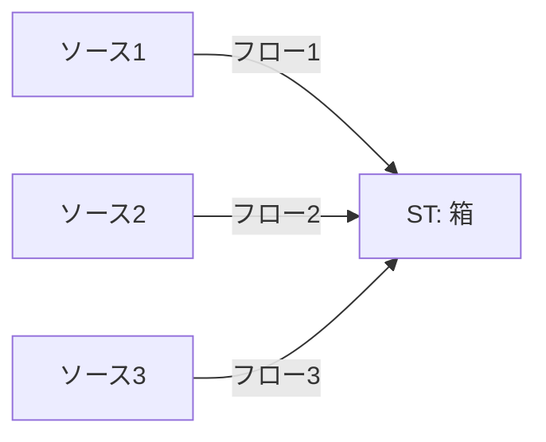
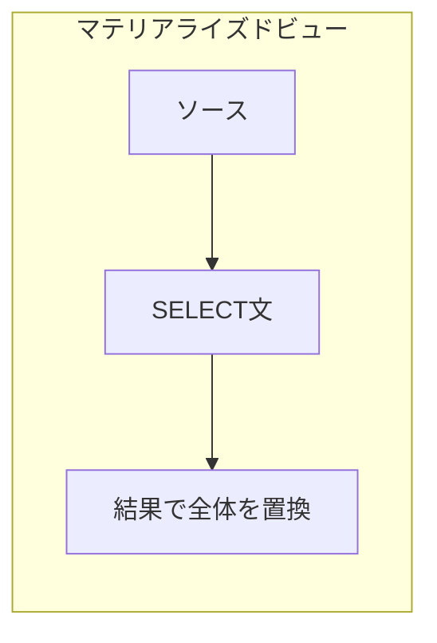
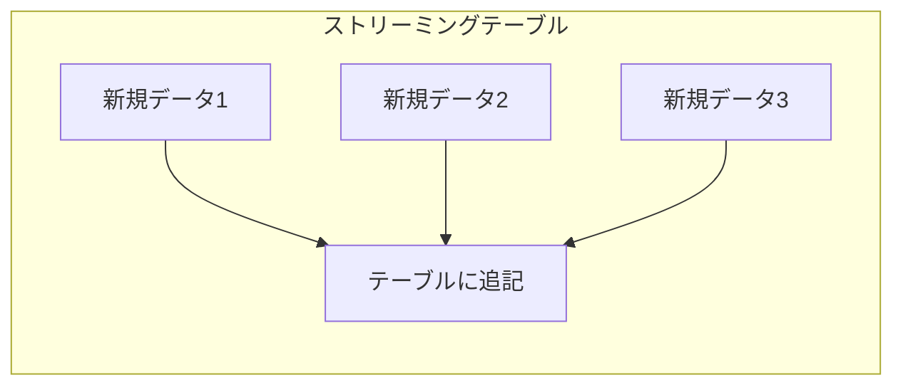

# はじめに

Level 3では、ストリーミングテーブル(ST)と増分処理を学びました。その中で、こんな構文が出てきました:

```sql
CREATE STREAMING TABLE bronze_orders;

CREATE FLOW ingest_orders AS
INSERT INTO bronze_orders BY NAME
SELECT * FROM STREAM read_files(...);
```

「なぜSTは2つの文に分かれているの？」「`CREATE FLOW`って何？」

この疑問に答えるのが今回のテーマです。

## Lakeflow SDP入門：基礎から実践まで

本記事は、SDPを段階的に学ぶ学習パス「**Lakeflow SDP入門：基礎から実践まで**」の一部です。

| Level | タイトル | 所要時間 | 学ぶ概念 |
|-------|---------|---------|--------|
| 1 | [SQLだけで始めるLakeflow SDP](https://qiita.com/taka_yayoi/items/e6368446040c9e979d0f) | 30分 | MV、パイプライン |
| 2 | [Lakeflow SDPでデータ品質を守るエクスペクテーション](https://qiita.com/taka_yayoi/items/0b525cb05a095ad0bbe1) | 30分 | エクスペクテーション |
| 3 | [Lakeflow SDPの増分処理とストリーミングテーブル](https://qiita.com/taka_yayoi/items/c38069b6ddd93fbaacab) | 45分 | ST、増分処理 |
| **4** | **Lakeflow SDPのフローを理解する(本記事)** | **45分** | **フロー、append_flow** |
| 5 | [Lakeflow SDPのAUTO CDCでマスターデータ同期](https://qiita.com/taka_yayoi/items/b1ee8cb73f9723ab1fed) | 60分 | AUTO CDC、SCD |

## この記事で学ぶこと

- フローとは何か
- なぜSTは「テーブル定義」と「フロー」が分離されているのか
- 複数ソースから1つのSTにデータを流す方法
- 1回だけ実行するフロー(バックフィル用)

## 前提条件

- Level 3を完了している、またはSTの基本を理解している
- SQLの基本が書ける

# フローとは

## 一言で説明すると

**「ストリーミングテーブルにデータを入れる経路」** です。

STを「箱」に例えると、フローは「箱にデータを入れるパイプ」です。



## MVとSTの構文の違い

マテリアライズドビュー(MV)とストリーミングテーブル(ST)を比較してみましょう。

**マテリアライズドビュー: 定義とソースが一体**

```sql
CREATE MATERIALIZED VIEW my_view AS
SELECT * FROM source_table;
```

MVは「何を格納するか」と「どこから取得するか」が1つの文で定義されています。

**ストリーミングテーブル: 定義とフローが分離**

```sql
-- Step 1: 箱(テーブル)を定義
CREATE STREAMING TABLE my_table;

-- Step 2: データの入れ方(フロー)を定義
CREATE FLOW my_flow AS
INSERT INTO my_table BY NAME
SELECT * FROM STREAM source_table;
```

STは「箱の定義」と「データの入れ方」が分離されています。

## なぜ分離されているのか

この設計には重要な理由があります。

### MVとSTの本質的な違い

まず、MVにフローがない理由を理解しましょう。

**MVは「再計算」**: 毎回SELECTを実行し、結果でテーブル全体を置き換える



**STは「追記」**: 新しいデータを既存のテーブルに追加していく



MVは「SELECT結果 = テーブル全体」なので、複数ソースから追記するという概念がありません。一方STは「追記していく」動作なので、どこから追記するか(=フロー)を複数定義できます。

### フローで実現できること

**1. 複数のソースから1つのテーブルにデータを入れられる**

```sql
CREATE STREAMING TABLE all_events;

-- ソース1からのフロー
CREATE FLOW from_source1 AS
INSERT INTO all_events BY NAME
SELECT * FROM STREAM source1;

-- ソース2からのフロー
CREATE FLOW from_source2 AS
INSERT INTO all_events BY NAME
SELECT * FROM STREAM source2;
```

**2. バックフィル(過去データの一括投入)ができる**

```sql
CREATE STREAMING TABLE events;

-- 通常の増分フロー
CREATE FLOW incremental AS
INSERT INTO events BY NAME
SELECT * FROM STREAM read_files('/data/new/');

-- 過去データの一括投入(1回だけ実行)
CREATE FLOW backfill_2023 AS
INSERT INTO ONCE events BY NAME
SELECT * FROM read_files('/data/archive/2023/');
```

**3. フローごとに異なる処理ができる**

```sql
CREATE STREAMING TABLE orders;

-- JSONソースからのフロー
CREATE FLOW from_json AS
INSERT INTO orders BY NAME
SELECT order_id, customer_id, amount
FROM STREAM read_files('/data/json/', format => 'json');

-- CSVソースからのフロー(カラム名が違う)
CREATE FLOW from_csv AS
INSERT INTO orders BY NAME
SELECT 
    id AS order_id, 
    cust_id AS customer_id, 
    total AS amount
FROM STREAM read_files('/data/csv/', format => 'csv');
```

# フローの基本構文

## 標準的なフロー

```sql
CREATE FLOW フロー名 AS
INSERT INTO ターゲットテーブル BY NAME
SELECT ...
FROM STREAM ソース;
```

- `BY NAME`: カラム名でマッピング(順序ではなく名前で対応付け)
- `STREAM`: 増分読み取り(新規データのみ処理)

## 1回だけ実行するフロー(ONCE)

```sql
CREATE FLOW フロー名 AS
INSERT INTO ONCE ターゲットテーブル BY NAME
SELECT ...
FROM ソース;  -- STREAMなし(全件読み取り)
```

- `ONCE`: このフローは1回だけ実行される
- `STREAM`なし: ソースから全件を読み取る

バックフィルや初期データ投入に使います。

# ハンズオン: 複数ソースからデータを統合する

実際にフローを使って、複数のソースから1つのSTにデータを統合してみましょう。

## シナリオ

オンラインストアと実店舗の注文データを1つのテーブルに統合します。

## Step 1: パイプラインとボリュームを準備

Level 3と同様に、パイプラインとボリュームを作成します。

```sql
-- ボリュームを作成(SQLエディタで実行)
CREATE VOLUME IF NOT EXISTS workspace.sdp.orders_volume;
```

ノートブックでディレクトリ構造を作成します:

```python
# 通常データ用とアーカイブ用のディレクトリを作成
dbutils.fs.mkdirs("/Volumes/workspace/sdp/orders_volume/current/")
dbutils.fs.mkdirs("/Volumes/workspace/sdp/orders_volume/archive/")
print("ディレクトリを作成しました")
```


## Step 2: オンライン注文データを作成

ノートブックで実行:

```python
online_orders = """order_id,customer_id,amount,order_date,channel
1001,C001,15000,2024-01-15,online
1002,C002,8500,2024-01-16,online
1003,C003,22000,2024-01-17,online
"""

dbutils.fs.put("/Volumes/workspace/sdp/orders_volume/current/online_batch1.csv", online_orders, overwrite=True)
print("オンライン注文データを作成しました")
```

## Step 3: 実店舗注文データを作成

```python
store_orders = """order_id,customer_id,amount,order_date,channel
2001,C004,5000,2024-01-15,store
2002,C005,12000,2024-01-16,store
"""

dbutils.fs.put("/Volumes/workspace/sdp/orders_volume/current/store_batch1.csv", store_orders, overwrite=True)
print("実店舗注文データを作成しました")
```


## Step 4: 統合テーブルと複数フローを定義

パイプラインエディタで:

```sql
-- 統合テーブル(箱)を定義
CREATE STREAMING TABLE all_orders (
    CONSTRAINT valid_amount EXPECT (amount > 0) ON VIOLATION DROP ROW
);

-- オンライン注文用フロー
CREATE FLOW online_orders AS
INSERT INTO all_orders BY NAME
SELECT *
FROM STREAM read_files(
    '/Volumes/workspace/sdp/orders_volume/current/',
    format => 'csv',
    header => 'true',
    schema => 'order_id INT, customer_id STRING, amount INT, order_date DATE, channel STRING'
)
WHERE channel = 'online';

-- 実店舗注文用フロー
CREATE FLOW store_orders AS
INSERT INTO all_orders BY NAME
SELECT *
FROM STREAM read_files(
    '/Volumes/workspace/sdp/orders_volume/current/',
    format => 'csv',
    header => 'true',
    schema => 'order_id INT, customer_id STRING, amount INT, order_date DATE, channel STRING'
)
WHERE channel = 'store';
```

:::note warn
CSVを読み込む際、`schema`を明示的に指定しないとファイルごとに型推論が異なり、`Failed to merge incompatible data types`エラーが発生することがあります。すべてのフローで同じスキーマを使用してください。
:::

**パイプラインを実行**をクリックします。

## Step 5: 結果を確認

実行後、`all_orders`テーブルを確認すると:
- オンライン注文: 3件
- 実店舗注文: 2件
- 合計: 5件

パイプライングラフでは、2つのフローが1つのSTに流れ込んでいることが視覚的に確認できます。


フローを確認するには、テーブル一覧でグラフマークをクリックします。


あるいは、三点リーダーから**フローを表示**をクリックします。


## Step 6: 追加データで増分処理を確認

```python
# オンライン注文の追加
online_orders_batch2 = """order_id,customer_id,amount,order_date,channel
1004,C006,9000,2024-01-18,online
"""
dbutils.fs.put("/Volumes/workspace/sdp/orders_volume/current/online_batch2.csv", online_orders_batch2, overwrite=True)

# 実店舗注文の追加
store_orders_batch2 = """order_id,customer_id,amount,order_date,channel
2003,C007,18000,2024-01-18,store
2004,C008,7500,2024-01-19,store
"""
dbutils.fs.put("/Volumes/workspace/sdp/orders_volume/current/store_batch2.csv", store_orders_batch2, overwrite=True)

print("追加データを作成しました")
```

パイプラインを再実行すると、各フローが新規ファイルだけを処理し、`all_orders`テーブルに追加されます。


# ハンズオン: バックフィルを実行する

過去データを一括で投入する「バックフィル」を体験しましょう。

## シナリオ

2024年からデータ収集を開始したが、2023年の過去データも取り込みたい。

## Step 1: 過去データを準備

バックフィル用のデータは、通常のデータとは**別のディレクトリ**に置きます(Step 1で`archive/`ディレクトリは作成済み)。

```python
# 2023年の過去データ
historical_data = """order_id,customer_id,amount,order_date,channel
9001,C101,20000,2023-06-15,online
9002,C102,15000,2023-07-20,store
9003,C103,8000,2023-08-10,online
9004,C104,30000,2023-09-05,store
9005,C105,12000,2023-10-25,online
"""

dbutils.fs.put("/Volumes/workspace/sdp/orders_volume/archive/historical_2023.csv", historical_data, overwrite=True)
print("2023年の過去データを作成しました")
```

:::note warn
`read_files`は再帰的にサブディレクトリも読み込みます。通常フローが親ディレクトリを指定していると、`archive/`配下のファイルも読み込まれてしまいます。通常データは`current/`、バックフィルデータは`archive/`と明確に分けてください。
:::

## Step 2: バックフィル用フローを追加

パイプラインに以下を追加:

```sql
-- 2023年データのバックフィル(1回だけ実行)
CREATE FLOW backfill_2023 AS
INSERT INTO ONCE all_orders BY NAME
SELECT *
FROM read_files(
    '/Volumes/workspace/sdp/orders_volume/archive/historical_2023.csv',
    format => 'csv',
    header => 'true',
    schema => 'order_id INT, customer_id STRING, amount INT, order_date DATE, channel STRING'
);
```

**ポイント:**
- `INSERT INTO ONCE`: このフローは1回だけ実行される
- `STREAM`なし: ファイルから全件を読み取る

## Step 3: 実行して確認

**パイプラインを実行**をクリックします。

実行後:
- `all_orders`テーブルに2023年のデータ5件が追加されている
- パイプライングラフで`backfill_2023`フローが表示される


## Step 4: 再実行しても重複しないことを確認

パイプラインを再度実行しても、`backfill_2023`フローは実行されません(`ONCE`指定のため)。


これにより、バックフィルデータが重複して投入される心配がありません。

# フローの実践パターン

## パターン1: 異なるフォーマットの統合

```sql
CREATE STREAMING TABLE events;

-- JSONソース
CREATE FLOW from_json AS
INSERT INTO events BY NAME
SELECT 
    event_id,
    event_type,
    event_time,
    payload
FROM STREAM read_files('/data/json/', format => 'json');

-- Parquetソース
CREATE FLOW from_parquet AS
INSERT INTO events BY NAME
SELECT 
    id AS event_id,
    type AS event_type,
    timestamp AS event_time,
    data AS payload
FROM STREAM read_files('/data/parquet/', format => 'parquet');
```

## パターン2: リージョン別データの統合

```sql
CREATE STREAMING TABLE global_sales;

-- 日本リージョン
CREATE FLOW from_japan AS
INSERT INTO global_sales BY NAME
SELECT *, 'JP' AS region
FROM STREAM read_files('/data/japan/', format => 'csv', header => 'true');

-- 米国リージョン
CREATE FLOW from_us AS
INSERT INTO global_sales BY NAME
SELECT *, 'US' AS region
FROM STREAM read_files('/data/us/', format => 'csv', header => 'true');

-- 欧州リージョン
CREATE FLOW from_eu AS
INSERT INTO global_sales BY NAME
SELECT *, 'EU' AS region
FROM STREAM read_files('/data/eu/', format => 'csv', header => 'true');
```

## パターン3: 年ごとのバックフィル

```sql
CREATE STREAMING TABLE historical_data;

-- 通常の増分フロー(2024年以降)
CREATE FLOW incremental AS
INSERT INTO historical_data BY NAME
SELECT * FROM STREAM read_files('/data/current/');

-- 2023年バックフィル
CREATE FLOW backfill_2023 AS
INSERT INTO ONCE historical_data BY NAME
SELECT * FROM read_files('/data/archive/2023/');

-- 2022年バックフィル
CREATE FLOW backfill_2022 AS
INSERT INTO ONCE historical_data BY NAME
SELECT * FROM read_files('/data/archive/2022/');
```

# 注意点とベストプラクティス

## 1. フロー名は分かりやすく

```sql
-- ❌ 悪い例
CREATE FLOW f1 AS ...
CREATE FLOW f2 AS ...

-- ✅ 良い例
CREATE FLOW ingest_online_orders AS ...
CREATE FLOW ingest_store_orders AS ...
CREATE FLOW backfill_2023 AS ...
```

フロー名はパイプライングラフに表示されるため、何をするフローか一目で分かる名前にしましょう。

## 2. ONECフローはSTREAMを使わない

```sql
-- ❌ 間違い: ONCEなのにSTREAMを使っている
CREATE FLOW backfill AS
INSERT INTO ONCE my_table BY NAME
SELECT * FROM STREAM read_files(...);

-- ✅ 正しい: ONCEならSTREAMなし
CREATE FLOW backfill AS
INSERT INTO ONCE my_table BY NAME
SELECT * FROM read_files(...);
```

`ONCE`は「全件を1回だけ処理」なので、`STREAM`(増分読み取り)と組み合わせる意味がありません。

## 3. バックフィル用ファイルは別ディレクトリに

`read_files`は再帰的にサブディレクトリも読み込むため、ディレクトリ構造に注意が必要です。

```
❌ 間違い: 親ディレクトリを指定 → サブディレクトリも読まれる
/data/
  ├── batch1.csv         ← read_files('/data/')で読む
  ├── batch2.csv         ← read_files('/data/')で読む
  └── archive/
      └── historical.csv ← read_files('/data/')で読まれてしまう！

✅ 正しい: 通常データとアーカイブを別ディレクトリに
/data/
  ├── current/           ← 通常フロー: read_files('/data/current/')
  │   ├── batch1.csv
  │   └── batch2.csv
  └── archive/           ← バックフィル: read_files('/data/archive/')
      └── historical.csv
```

通常フローとバックフィルフローで読み込むディレクトリを明確に分けてください。

## 4. BY NAMEでカラム名を一致させる

```sql
-- ソース1: order_id, customer_id, amount
-- ソース2: id, cust_id, total

CREATE STREAMING TABLE orders;

-- ✅ カラム名を合わせてINSERT
CREATE FLOW from_source2 AS
INSERT INTO orders BY NAME
SELECT 
    id AS order_id,
    cust_id AS customer_id,
    total AS amount
FROM STREAM source2;
```

`BY NAME`はカラム名でマッピングするため、ソースのカラム名がターゲットと異なる場合は`AS`で名前を合わせます。

## 5. エクスペクテーションはテーブル定義で

```sql
-- ✅ エクスペクテーションはテーブル定義に
CREATE STREAMING TABLE orders (
    CONSTRAINT valid_amount EXPECT (amount > 0) ON VIOLATION DROP ROW
);

-- フローは複数あってもOK
CREATE FLOW flow1 AS INSERT INTO orders BY NAME SELECT * FROM STREAM source1;
CREATE FLOW flow2 AS INSERT INTO orders BY NAME SELECT * FROM STREAM source2;
```

エクスペクテーションはテーブル定義に書くことで、すべてのフローからのデータに適用されます。

# まとめ

## 今日できるようになったこと

- フローの概念を理解した
- 複数のソースから1つのSTにデータを統合できる
- バックフィル(過去データの一括投入)ができる

## フローの価値

| 機能 | メリット |
|------|---------|
| 複数ソース統合 | 異なるソースを1つのテーブルに集約 |
| バックフィル | 過去データを安全に一括投入 |
| 柔軟な変換 | ソースごとに異なる変換ロジックを適用 |

## 次のステップ

ここまでで、MV、エクスペクテーション、ST、フローを学びました。最後のLevel 5では、データベースの変更を同期する**AUTO CDC**を学びます。

- 「マスターデータが更新されたら自動で同期したい」
- 「削除されたレコードも追跡したい」
- 「変更履歴を残したい(SCD Type 2)」

次の記事 [**Level 5: Lakeflow SDPのAUTO CDCでマスターデータ同期**](https://qiita.com/taka_yayoi/items/b1ee8cb73f9723ab1fed)で学びましょう。

# 参考リンク

- [Lakeflow Spark宣言型パイプライン公式ドキュメント](https://docs.databricks.com/aws/ja/ldp/)
- [フロー](https://docs.databricks.com/aws/ja/ldp/flows)
- [ストリーミングテーブル](https://docs.databricks.com/aws/ja/ldp/streaming-tables)
- [パイプラインによるヒストリカルデータの埋め戻し](https://docs.databricks.com/aws/ja/ldp/flows-backfill)

### はじめてのDatabricks

[はじめてのDatabricks](https://qiita.com/taka_yayoi/items/8dc72d083edb879a5e5d)

### Databricks無料トライアル

[Databricks無料トライアル](https://databricks.com/jp/try-databricks)
