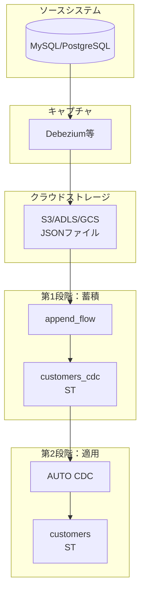
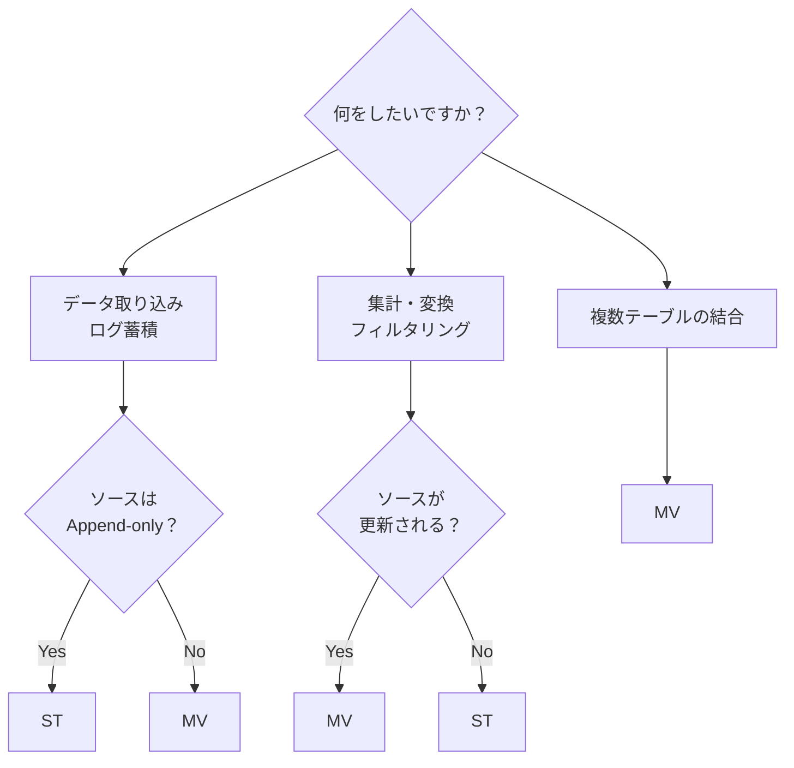
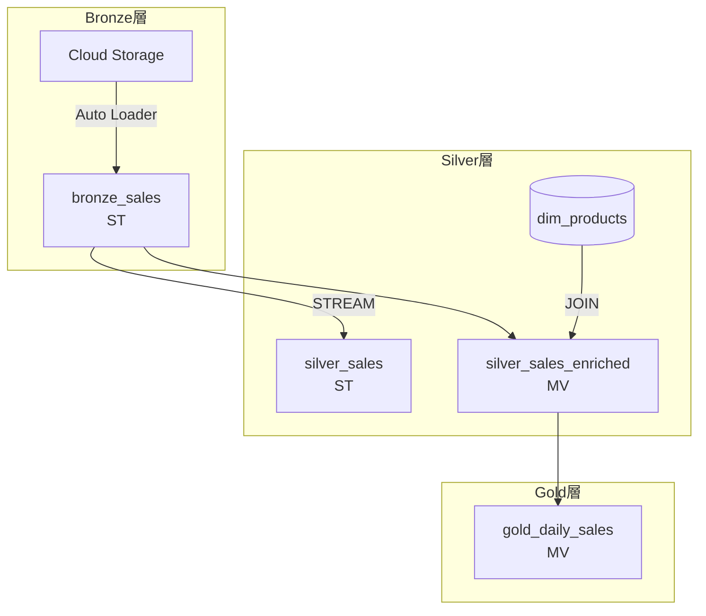

# はじめに

[Lakeflow Spark宣言型パイプライン(SDP)](https://docs.databricks.com/aws/ja/ldp/)を学び始めると、最初にぶつかる壁があります。それが[**ストリーミングテーブル(ST)**](/ldp/streaming-tables)と[**マテリアライズドビュー(MV)**](https://docs.databricks.com/aws/ja/ldp/materialized-views)の違いです。

「どっちもテーブルを作るんでしょ？何が違うの？」
「ストリーミングって書いてあるけど、バッチ処理でも使えるの？」
「どっちを使えばいいの？」

こうした疑問を持つのは当然です。本記事では、STとMVの**実態**、**動作原理**、**使い分け**、そして**よくあるつまづきポイント**を徹底解説します。

## 1. まず結論：STとMVの決定的な違い

最初に結論を示します。

| 項目 | ストリーミングテーブル(ST) | マテリアライズドビュー(MV) |
|------|----------------------|------------------------|
| **データの読み方** | 増分(新しいデータのみ) | 全件(毎回フルスキャン) |
| **内部の実態** | Delta Table + チェックポイント | Delta Table + クエリ定義 |
| **更新時の動作** | 前回の続きから処理 | 全データを再計算 |
| **適したユースケース** | データ取り込み、CDC、ログ蓄積 | 集計、結合、変換 |
| **ソースの制約** | Append-onlyのソース向き | 任意のソース |

一言でまとめると：

- **ストリーミングテーブル** = 増分処理でデータを蓄積するテーブル
- **マテリアライズドビュー** = 毎回再計算する実体化ビュー

## 2. ストリーミングテーブル(ST)の実態と動作原理

### 2.1 STの実態：Delta Table + チェックポイント

ストリーミングテーブルは、内部的には以下の2つで構成されています。

1. **Delta Table**: 実際のデータが格納される場所
2. **チェックポイント**: 「前回どこまで処理したか」を記録するメタデータ

### 2.2 STの動作原理：増分処理

STの最大の特徴は**増分処理**です。パイプラインを実行するたびに、前回処理した「続き」から処理を開始します。

```
【1回目の実行】
ソースデータ: [A, B, C, D, E]
処理対象:     [A, B, C, D, E]  ← 全件処理
チェックポイント: "Eまで処理済み"

【2回目の実行】(新しいデータ F, G が追加された場合)
ソースデータ: [A, B, C, D, E, F, G]
処理対象:     [F, G]  ← 新規分のみ処理
チェックポイント: "Gまで処理済み"
```

これにより、大量のデータがあっても効率的に処理できます。

### 2.3 STの重要なポイント：`STREAM`キーワード

STから別のSTにデータを流す場合、**必ず`STREAM`キーワードを使う**必要があります。

```sql
-- ✅ 正しい：STREAMキーワードを使用
CREATE FLOW my_flow AS
INSERT INTO downstream_st BY NAME
SELECT * FROM STREAM upstream_st;

-- ❌ 間違い：STREAMキーワードがない
CREATE FLOW my_flow AS
INSERT INTO downstream_st BY NAME
SELECT * FROM upstream_st;  -- これはバッチ読み取りになる
```

Pythonでも同様です：

```python
# ✅ 正しい：readStreamを使用
@dp.append_flow(target="downstream_st")
def flow():
    return spark.readStream.table("upstream_st")

# ❌ 間違い：readを使用
@dp.append_flow(target="downstream_st")
def flow():
    return spark.read.table("upstream_st")  # バッチ読み取りになる
```

## 3. マテリアライズドビュー(MV)の実態と動作原理

### 3.1 MVの実態：Delta Table + クエリ定義

マテリアライズドビューも内部的にはDelta Tableですが、STとは異なり**チェックポイントを持ちません**。代わりに、**クエリ定義**を保持しています。

- **Delta Table**: 計算結果が格納される場所
- **クエリ定義**: SELECT文などの変換ロジック

### 3.2 MVの動作原理：フル再計算

MVはパイプライン実行のたびに、**ソースデータ全体を再スキャン**して結果を計算し直します。

```
【1回目の実行】
ソースデータ: [A, B, C, D, E]
処理対象:     [A, B, C, D, E]  ← 全件処理
結果テーブル: 集計結果など

【2回目の実行】(新しいデータ F, G が追加された場合)
ソースデータ: [A, B, C, D, E, F, G]
処理対象:     [A, B, C, D, E, F, G]  ← 全件再処理
結果テーブル: 新しい集計結果(全データ反映)
```

「それって非効率じゃない？」と思うかもしれませんが、**集計や結合を含むクエリでは、増分処理が難しい**ケースが多いのです。

### 3.3 MVの重要なポイント：`STREAM`を使わない

MVでは`STREAM`キーワードを**使いません**。使うとエラーになります。

```sql
-- ✅ 正しい：通常のSELECT
CREATE OR REPLACE MATERIALIZED VIEW my_mv AS
SELECT * FROM source_table;

-- ❌ 間違い：STREAMを使用
CREATE OR REPLACE MATERIALIZED VIEW my_mv AS
SELECT * FROM STREAM source_table;  -- エラーになる
```

## 4. フローとは何か：STとMVの定義方法の違い

ここで、SDPの重要な概念である[**フロー(Flow)**](https://docs.databricks.com/aws/ja/ldp/flows)について説明します。

### 4.1 MVとSTの定義方法の違い

**マテリアライズドビュー：定義とデータソースが一体**
```sql
-- これ1つで「テーブル定義」と「データの取得方法」が決まる
CREATE MATERIALIZED VIEW sales_summary AS
SELECT product_id, SUM(amount) as total
FROM raw_sales
GROUP BY product_id;
```

**ストリーミングテーブル：「箱」と「データの流し込み方」が分離**
```sql
-- Step 1: 箱だけ作る(中身は空)
CREATE STREAMING TABLE sales_events;

-- Step 2: データの流し込み方を定義(これがフロー)
CREATE FLOW ingest_sales AS
INSERT INTO sales_events BY NAME
SELECT * FROM STREAM read_files('/path/to/data');
```

**フローとは「STにデータを入れる方法」を定義するもの**です。

### 4.2 なぜ分離されているのか

分離されていることで、以下が可能になります：

**1. 複数のソースから1つのSTに流し込める**
```sql
CREATE STREAMING TABLE all_logs;

-- ソースA
CREATE FLOW flow_a AS
INSERT INTO all_logs BY NAME
SELECT *, 'system_a' as source FROM STREAM read_files('/logs/a');

-- ソースB  
CREATE FLOW flow_b AS
INSERT INTO all_logs BY NAME
SELECT *, 'system_b' as source FROM STREAM read_files('/logs/b');
```

**2. 流し込み方を変えられる(append_flow vs AUTO CDC)**

これについては次のセクションで詳しく説明します。

### 4.3 2種類のフロー

SDPには主に2種類のフローがあります：

| フロー種類 | ターゲットSTへの操作 | 用途 |
|---------|-------------------|------|
| `append_flow` / `INSERT INTO` | 追記のみ | ログ蓄積、イベント収集 |
| `AUTO CDC ... INTO` | UPSERT / DELETE | マスターデータ同期 |

ここで重要なポイントがあります：

:::note info
**「STはappend-only」という説明は不正確です。**
 
- STの実態はDelta Table。Delta TableはUPDATE/DELETEができる
- append-onlyなのは**フローの種類**(append_flow)であって、ST自体ではない
:::


この違いを理解することが、CDC処理を理解する鍵です。

## 5. CDCパイプラインにおけるフローとストリーミングテーブル

[CDC(Change Data Capture)](https://docs.databricks.com/aws/ja/ldp/cdc)処理は、SDPの強力なユースケースの1つです。ここでは、フローとSTがどのように連携するかを詳しく見ていきます。

### 5.1 CDCパイプラインの2段階構造

CDCパイプラインは「**蓄積**」と「**適用**」の2段階で構成されます。

**全体の流れ:**

1. **ソースシステム**(MySQL/PostgreSQLなど)
2. → Debezium等でキャプチャ
3. → **クラウドストレージ**(S3/ADLS/GCS)にJSONファイルとして保存
4. → **【第1段階：蓄積】** `append_flow`で`customers_cdc`(ST)に追記
5. → **【第2段階：適用】** `AUTO CDC`で`customers`(ST)にUPSERT/DELETE




**第1段階のテーブル例(customers_cdc):**

| id | name | op | ts |
|----|------|--------|-------|
| 001 | 田中 | INSERT | 10:00 |
| 001 | 田中太郎 | UPDATE | 11:00 |
| 002 | 鈴木 | INSERT | 12:00 |
| 001 | (null) | DELETE | 13:00 |

4つのイベントが4行として追記されます。

**第2段階のテーブル例(customers):**

| id | name |
|----|------|
| 002 | 鈴木 |

AUTO CDCが適用され、最新状態のみが残ります(id=001は削除済み)。

### 5.2 第1段階：CDCイベントの蓄積(append_flow)

Debeziumなどから送られてくるCDCイベントは、以下のようなJSONです：

```json
{"id": "001", "name": "田中",     "op": "INSERT", "ts": "2025-01-01 10:00:00"}
{"id": "001", "name": "田中太郎", "op": "UPDATE", "ts": "2025-01-01 11:00:00"}
{"id": "002", "name": "鈴木",     "op": "INSERT", "ts": "2025-01-01 12:00:00"}
{"id": "001", "name": null,       "op": "DELETE", "ts": "2025-01-01 13:00:00"}
```

これを**append_flow**でSTに取り込みます：

```sql
-- CDCイベントを蓄積するST
CREATE STREAMING TABLE customers_cdc;

-- append_flowでイベントを追記
CREATE FLOW ingest_cdc AS
INSERT INTO customers_cdc BY NAME
SELECT * FROM STREAM read_files(
    '/Volumes/catalog/schema/cdc/customers',
    format => 'json'
);
```

この段階では、UPDATE/DELETEイベントも **「1つのレコード」として追記** されるだけです。`customers_cdc`テーブルには4行が入ります。

### 5.3 第2段階：最終テーブルへの適用(AUTO CDC)

蓄積されたCDCイベントを解釈して、最終テーブルに反映します：

```sql
-- 最終的な顧客テーブル
CREATE STREAMING TABLE customers;

-- AUTO CDCでイベントを適用
CREATE FLOW apply_changes
AS AUTO CDC INTO customers
FROM STREAM customers_cdc
KEYS (id)                              -- 主キー
SEQUENCE BY ts                         -- 順序を決めるカラム
APPLY AS DELETE WHEN op = 'DELETE'     -- DELETE条件
COLUMNS * EXCEPT (op, ts);             -- 除外するカラム
```

AUTO CDCは以下を自動的に行います：

1. **KEYS (id)** で同じidのレコードを特定
2. **SEQUENCE BY ts** でイベントの順序を判定(遅延データにも対応)
3. **INSERT** → 新規行を追加
4. **UPDATE** → 既存行を更新
5. **DELETE** → 既存行を削除

結果、`customers`テーブルには最新の状態のみが反映されます。

### 5.4 なぜ2段階に分けるのか

「AUTO CDCで直接取り込めばいいのでは？」と思うかもしれません。2段階に分ける理由があります：

**1. デバッグ・監査が容易**

生のCDCイベントが残っているので、問題発生時に原因を追跡できます。

```sql
-- 「id=001に何が起きた？」を調査できる
SELECT * FROM customers_cdc 
WHERE id = '001' 
ORDER BY ts;
```

**2. 再処理が可能**

AUTO CDCの設定を間違えた場合、customersテーブルを削除して再作成すれば、customers_cdcから再度適用できます。

**3. 複数の最終テーブルを作れる**

同じCDCイベントから、異なる形式のテーブルを作れます：

```sql
-- 最新状態のみ(SCD Type 1)
CREATE FLOW apply_scd1
AS AUTO CDC INTO customers
FROM STREAM customers_cdc
...
STORED AS SCD TYPE 1;

-- 履歴を残す(SCD Type 2)
CREATE FLOW apply_scd2
AS AUTO CDC INTO customers_history
FROM STREAM customers_cdc
...
STORED AS SCD TYPE 2;
```

### 5.5 フローの種類と動作のまとめ

| フロー | SQL構文 | Python | 動作 |
|------|--------|--------|------|
| append_flow | `CREATE FLOW ... AS INSERT INTO ...` | `@dp.append_flow(target="...")` | ターゲットに行を追記 |
| AUTO CDC | `CREATE FLOW ... AS AUTO CDC INTO ...` | `dp.create_auto_cdc_flow(...)` | ターゲットにUPSERT/DELETE |

**append_flowの特徴**
- ターゲットSTには**追記のみ**
- シンプルで高速
- ログ、イベント、CDCイベントの蓄積に最適

**AUTO CDCの特徴**
- ターゲットSTに**UPSERT/DELETE**を適用
- CDCイベントを解釈して最終状態を構築
- 重複排除、順序制御を自動で行う
- SCD Type 1/2をサポート

### 5.6 なぜCDC処理にSTが向いているのか

理由は**ソース側の特性**にあります：

- CDCイベント(Debeziumからのメッセージなど)は次々と**追加されていく**データ
- 過去のイベントは変更されない
- だから「新しく来たイベントだけ処理する」STの増分処理が効率的

MVだと毎回全イベントを再スキャンするので非効率です。

## 6. STとMVの使い分け：判断フローチャート

どちらを使うべきか迷ったときは、以下の基準で判断してください。

**判断基準:**

- **データ取り込み・ログ蓄積** → ソースがAppend-onlyなら**ST**、更新されるなら**MV**
- **集計・変換・フィルタリング** → ソースが更新されるなら**MV**、されないなら**ST**も可
- **複数テーブルの結合** → **MV**




### 6.1 ストリーミングテーブルを選ぶケース

1. **クラウドストレージからのデータ取り込み(Auto Loader)**
   - 新しいファイルだけを処理したい
   - S3/ADLS/GCSに継続的にファイルが追加される

2. **CDC(Change Data Capture)の処理**
   - Debezium等からの変更イベントを蓄積
   - `AUTO CDC`と組み合わせて使用

3. **ログデータの蓄積**
   - アプリケーションログ、イベントログ
   - 一度書いたら変更されないデータ

4. **Kafkaなどのメッセージキューからの取り込み**
   - リアルタイムストリーミング処理

### 6.2 マテリアライズドビューを選ぶケース

1. **集計処理**
   - SUM、COUNT、AVG などの集約関数を使用
   - GROUP BY を含むクエリ

2. **複数テーブルの結合**
   - JOINを使った変換処理
   - ディメンションテーブルとの結合

3. **ソースデータが更新される場合**
   - UPDATE/DELETEが発生するソース
   - 増分処理では整合性が取れないケース

4. **ウィンドウ関数を使った分析**
   - LAG、LEAD、ROW_NUMBER など

## 7. 実践編：メダリオンアーキテクチャでの使い分け

実際のパイプラインでは、STとMVを組み合わせて使います。典型的なパターンを見てみましょう。

### 7.1 Bronze層：ストリーミングテーブル

データ取り込みにはSTを使います。

```python
from pyspark import pipelines as dp

# Bronzeテーブルの定義
dp.create_streaming_table(
    name="bronze_sales",
    comment="Raw sales data from cloud storage"
)

@dp.append_flow(target="bronze_sales")
def ingest_sales():
    return (
        spark.readStream
            .format("cloudFiles")
            .option("cloudFiles.format", "json")
            .option("cloudFiles.inferColumnTypes", "true")
            .load("/Volumes/my_catalog/my_schema/raw_data/sales")
    )
```

### 7.2 Silver層：状況に応じて選択

**パターンA：フィルタリング・クレンジングのみ → ST**

```python
# Silver(ST)：単純なフィルタリングならSTで増分処理
dp.create_streaming_table(
    name="silver_sales",
    expect_all_or_drop={
        "valid_amount": "amount > 0",
        "valid_product": "product_id IS NOT NULL"
    }
)

@dp.append_flow(target="silver_sales")
def clean_sales():
    return (
        spark.readStream.table("bronze_sales")
            .select("product_id", "customer_id", "amount", "timestamp")
    )
```

**パターンB：ディメンションテーブルとの結合 → MV**

```python
# Silver(MV)：結合が必要な場合はMV
@dp.table(name="silver_sales_enriched")
def silver_sales_enriched():
    sales = spark.read.table("bronze_sales")
    products = spark.read.table("dim_products")
    
    return (
        sales.join(products, "product_id", "left")
            .select(
                sales["*"],
                products["product_name"],
                products["category"]
            )
    )
```

### 7.3 Gold層：マテリアライズドビュー

集計レイヤーにはMVを使います。

```python
# Gold(MV)：集計処理
@dp.table(name="gold_daily_sales")
def gold_daily_sales():
    return (
        spark.read.table("silver_sales")
            .withColumn("date", to_date("timestamp"))
            .groupBy("date", "product_id")
            .agg(
                sum("amount").alias("daily_total"),
                count("*").alias("transaction_count")
            )
    )
```

### 7.4 全体の構成

メダリオンアーキテクチャでの典型的な構成は以下の通りです:

1. **Cloud Storage** → `bronze_sales`(ST, Auto Loader)
2. `bronze_sales`(ST) → STREAM → `silver_sales`(ST)
3. `bronze_sales`(ST) + `dim_products`(外部) → JOIN → `silver_sales_enriched`(MV)
4. `silver_sales_enriched`(MV) → `gold_daily_sales`(MV)




## 8. よくあるつまづきポイントと解決策

### 8.1 ❌ STなのにSTREAMを忘れる

**症状：**
STからSTにデータを流しているのに、増分処理にならない。毎回全件処理される。

**原因：**
```python
# ❌ 間違い：spark.read を使っている
@dp.append_flow(target="downstream_st")
def flow():
    return spark.read.table("upstream_st")  # バッチ読み取り！
```

**解決策：**
```python
# ✅ 正しい：spark.readStream を使う
@dp.append_flow(target="downstream_st")
def flow():
    return spark.readStream.table("upstream_st")
```

### 8.2 ❌ MVでSTREAMを使おうとする

**症状：**
エラーが発生する。

**原因：**
```sql
-- ❌ 間違い：MVでSTREAMは使えない
CREATE OR REPLACE MATERIALIZED VIEW my_mv AS
SELECT * FROM STREAM source_table;
```

**解決策：**
```sql
-- ✅ 正しい：通常のSELECT
CREATE OR REPLACE MATERIALIZED VIEW my_mv AS
SELECT * FROM source_table;
```

### 8.3 ❌ 集計処理をSTでやろうとする

**症状：**
集計結果がおかしい。または実行時エラーになる。

**原因：**
append_flowは追記のみなので、GROUP BYなどの集計は過去データの再計算が必要になり、STには適しません。

```python
# ❌ 間違い：STで集計しようとしている
dp.create_streaming_table(name="sales_agg")

@dp.append_flow(target="sales_agg")
def agg():
    return (
        spark.readStream.table("sales")
            .groupBy("product_id")
            .agg(sum("amount"))  # 集計はSTに不向き
    )
```

**解決策：**
```python
# ✅ 正しい：MVで集計する
@dp.table(name="sales_agg")
def agg():
    return (
        spark.read.table("sales")
            .groupBy("product_id")
            .agg(sum("amount").alias("total"))
    )
```

### 8.4 ❌ フルリフレッシュしたいのにSTを使っている

**症状：**
ソースデータを修正したのに、下流のテーブルに反映されない。

**原因：**
STは増分処理なので、「既に処理済み」のデータは再処理されません。

**解決策：**

1. **Full Refreshを実行する**(UIまたはAPI)
2. **そもそもMVを使うべきケースかもしれない**

```python
# ソースデータが頻繁に更新される場合はMVが適切
@dp.table(name="my_table")
def my_table():
    return spark.read.table("frequently_updated_source")
```

### 8.5 ❌ STの依存関係でMVを挟んでしまう

**症状：**
パイプラインの一部が増分処理にならない。

**原因：**
ST(bronze) → MV(silver) → ST(gold) という構成の場合、MVは毎回フル再計算するため、その下流のSTも実質的に全件処理になってしまいます。

**解決策：**
増分処理を維持したい場合は、ST(bronze) → ST(silver) → ST(gold) のようにSTの連鎖を保ちます。

### 8.6 ❌ 「STはappend-only」を誤解する

**症状：**
CDC処理でSTを使えないと思い込む。または、AUTO CDCの動作が理解できない。

**誤解：**
「STはappend-onlyだから、UPDATE/DELETEはできない」

**正しい理解：**
- STの実態はDelta Table。Delta TableはUPDATE/DELETEができる
- append-onlyなのは**append_flow**というフローの種類
- **AUTO CDC**を使えば、STに対してUPSERT/DELETEを適用できる

```sql
-- AUTO CDCならSTにUPSERT/DELETEできる
CREATE FLOW apply_changes
AS AUTO CDC INTO customers  -- このSTにはUPSERT/DELETEが適用される
FROM STREAM customers_cdc
KEYS (id)
APPLY AS DELETE WHEN op = 'DELETE'
...
```

## 9. よくある質問

### Q: MVでAUTO CDCは使えますか？

A: 使えません。AUTO CDCのターゲットはSTのみです。MVは毎回フル再計算する設計なので、増分的にUPSERT/DELETEを適用するAUTO CDCとは相性が悪いためです。

### Q: append_flowとAUTO CDCを同じSTに対して使えますか？

A: 技術的には可能ですが、推奨されません。データの整合性が取りにくくなります。1つのSTには1種類のフローを使うのが基本です。

### Q: STとMVのどちらが高速ですか？

A: 状況によります。
- **データ量が多く、新規データが少ない場合**: STが高速(増分処理のため)
- **集計が必要な場合**: MVを使うしかない
- **毎回全件処理が必要な場合**: MVのほうがシンプル

### Q: STの「チェックポイント」はどこに保存されますか？

A: パイプラインのメタデータとして管理されます。ユーザーが直接操作することは基本的にありません。

## 10. まとめ：STとMVの選択基準

| 判断基準 | ストリーミングテーブル | マテリアライズドビュー |
|---------|----------------|-------------------|
| ソースがAppend-only | ✅ 最適 | ⚪ 使える |
| ソースが更新される | ⚪ Full Refresh必要 | ✅ 最適 |
| 集計処理 | ❌ 不向き | ✅ 最適 |
| JOIN処理 | △ 条件付き | ✅ 最適 |
| 大量データの増分取り込み | ✅ 最適 | ❌ 非効率 |
| CDC処理(イベント蓄積) | ✅ 最適 | ❌ 不向き |
| CDC処理(最終テーブル) | ✅ AUTO CDC使用 | ❌ 不可 |
| リアルタイム性が必要 | ✅ 最適 | ⚪ バッチ的 |

### 覚えておくべきポイント

1. **データ取り込み(Ingestion)はST**
2. **集計・結合(Aggregation/Join)はMV**
3. **STからSTには`STREAM`、MVでは使わない**
4. **「append-only」はフローの種類であり、STの制約ではない**
5. **AUTO CDCを使えばSTにUPSERT/DELETEできる**

これらを押さえておけば、SDPでのパイプライン構築がスムーズになるはずです。

## 参考リンク

- [Lakeflow Spark宣言型パイプライン公式ドキュメント](https://docs.databricks.com/aws/ja/ldp/)
- [ストリーミングテーブル](https://docs.databricks.com/aws/ja/ldp/streaming-tables)
- [マテリアライズドビュー](https://docs.databricks.com/aws/ja/ldp/materialized-views)
- [チュートリアル: CDCを使用してETLパイプラインを構築する](https://docs.databricks.com/aws/ja/ldp/tutorial-pipelines)
- [AUTO CDC APIs: パイプラインを使用して変更データ キャプチャを簡素化](https://docs.databricks.com/aws/ja/ldp/cdc)

### はじめてのDatabricks

[はじめてのDatabricks](https://qiita.com/taka_yayoi/items/8dc72d083edb879a5e5d)

### Databricks無料トライアル

[Databricks無料トライアル](https://databricks.com/jp/try-databricks)
