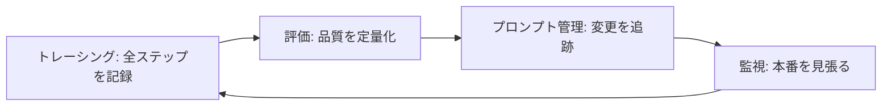

# はじめに

2026年4月20日に技術評論社から刊行した『MLflowで実践するLLMOps――生成AIアプリケーションの実験管理と品質保証』ですが、編集の方から「紙と電子をあわせて約1,000部」と連絡をいただきました。発売から4ヶ月、LLMOps×MLflowというかなり絞ったテーマの本としては、まずは良いスタートを切れたと思っています。手に取ってくださった皆さま、ありがとうございます。


- [書籍ページ(技術評論社)](https://gihyo.jp/book/2026/978-4-297-15573-5)
- [サンプルコードリポジトリ](https://github.com/takaaki-yayoi/mlflow_llmops)
- [刊行時の紹介記事](https://qiita.com/taka_yayoi/items/05f16a5bf5661cc2de02)
- [執筆の振り返り記事](https://qiita.com/taka_yayoi/items/1a3c0419afcb22595703)

節目なので、本を出した後に何をしていたかをまとめておきます。具体的には、サンプルコードリポジトリの更新状況、今週末(8月29日)の登壇で話す「LLMOpsの現在地」、そして10月の登壇予定です。本を読み終えた方にも、これから読む方にも「本の続き」として使ってもらえる内容にしています。

# サンプルコードリポジトリのその後

https://github.com/takaaki-yayoi/mlflow_llmops

刊行後、リポジトリには大きく3回の更新を入れています。4月末、5月、そして8月です。いずれも読者の方からのフィードバックが起点になっています。

## 本文よりリポジトリを正とする

まず方針から。READMEの冒頭に「本文中のコードと差分がある場合、本リポジトリを優先してください」と明記しました。

紙面の都合で本文のコードは抜粋・簡略化されていますし、MLflowは執筆中にも毎月のようにバージョンが上がっていました。本文を正として固定するより、動くコードを正としてリポジトリ側を更新し続ける方が読者の利益になる、という判断です。執筆中も「動くサンプルコードが先、原稿はそれに合わせる」で進めていたので、その延長線上の方針になります。

## CHAPTER_NOTES.md: 本文のリストとリポジトリの対応表

発売後にいただいた指摘で一番多かったのが「本文のリストとリポジトリのファイルの対応が分かりにくい」というものでした。Amazonのレビューでも同じ点が挙げられていました。

これを受けて、第3章から第9章まで各章に `CHAPTER_NOTES.md` を追加しています。内容は次の2つです。

- 本文の各リスト(コード片)がリポジトリのどのファイルに対応するか
- リポジトリと本文で挙動や出力が異なる箇所、本文で言及していてもリポジトリに未収録の機能

「本文と同じコードが載っているか」ではなく「リポジトリを実行したときに本文の説明と整合する結果が得られるか」を基準に書いています。読者の方は本を読みながらリポジトリを動かすので、そこでズレがあると一番困るからです。

5月には本文とリポジトリのコードを揃える作業(本書本文へのアライメント)も入れています。

## docs/why: 章別「なぜ嬉しいのか」サマリ

本書はMLflowの機能を体系的に解説する構成になっている分、「この機能がないと現場で何が痛いのか」「使わないとどうなるのか」の文脈を厚く書ききれていない箇所があります。そこを補うために `docs/why/` に章別のサマリを置きました。各章200〜300字程度で、次の3観点で書いています。

1. どんな現場課題に効くか
2. 使わないとどうなるか(アンチパターン)
3. 本書の該当節と一緒に読むと良い箇所

章を読む前に開いて「自分のチームではどの課題に効きそうか」を確認してから本文に入ると、機能解説に自分の文脈が乗ります。社内勉強会の素材としても使えるはずです。

## docs/external-refs.md: 脚注URLの要約集

本文の脚注で示しているMLflow公式ドキュメント等のURLについて、章ごとに分類し、2〜3行の要約と「本書のどの手順の前に読むと迷わないか」のヒントを添えています。本を読む流れを止めずに該当ページの要点を把握するためのものです。

## 8月の更新: 埋め込みモデルはOpenAI固定

ここが一番のハマりどころなので、少し詳しく書きます。

本書3.4節では、チャット用モデルをOpenAI以外(Anthropicなど)に差し替える手順を説明しています。ただし、この手順で変わるのはチャット用モデルだけです。ドキュメント検索用の埋め込みモデルは、次の2ファイルで `OpenAIEmbeddings` を使ったままになっています。

- `scripts/web_ingest.py`
- `agents/langgraph/tools/doc_search.py`

つまり、3.4節の手順だけでは `OPENAI_API_KEY` が引き続き必要です。本文3.3.1の「OpenAIの代わりに…3.4節で設定方法を説明しています」という記述は埋め込みモデルには当てはまらないため、正誤表の対象にしました。

8月の更新では、この点を各章のREADMEに注意書きとして追加し、`web_ingest.py` が `EMBEDDING_MODEL` 環境変数を参照するよう ch3/4/5/7/8 で統一しています。埋め込みモデルも差し替えたい場合の例として、Voyage AIへの変更手順を `ch3/CHAPTER_NOTES.md` に載せています。

```python
# 変更前
from langchain_openai import OpenAIEmbeddings
embeddings = OpenAIEmbeddings(model=os.environ.get("EMBEDDING_MODEL", "text-embedding-3-small"))

# 変更後
from langchain_voyageai import VoyageAIEmbeddings
embeddings = VoyageAIEmbeddings(model=os.environ.get("EMBEDDING_MODEL", "voyage-3.5"))
```

取り込み時と検索時で同じ埋め込みモデルを使う必要があるので、変更後は `make clean` → `make ingest` の再実行が必要です。Anthropicは埋め込みモデルを提供しておらず、公式ドキュメントではVoyage AIを案内しているので、Claude系に寄せたい方はこのルートになります。

## CIで毎週依存関係を確認

もう一つ、地味ですが効いているのがCIです。5月に静的チェック(ruff・compileall・ノートブックのnbformat検証・pyproject.tomlの妥当性)と `uv sync` のワークフローを追加し、毎週月曜朝に依存解決が通るかを自動で確認しています。

MLflowやLangChain系のパッケージは更新が速いので、読者がクローンした時点で `make install` が通らない、という事態を先に検知するための保険です。

## フィードバックの受け口

本書の記載と挙動が合わない箇所や、上記ドキュメントに未記載の差分を見つけた方は、GitHub Issuesで `errata` ラベルを付けて報告いただければ `CHAPTER_NOTES.md` を随時更新します。`docs/why` への補足や反論は `why-discussion` ラベルで歓迎しています。

# 今週末の登壇: LLMOpsの現在地

8月29日(土)の第115回 Machine Learning 15minutes! Hybridで、「LLMアプリ、雰囲気で運用してませんか？ 〜LLMOpsの現在地〜」というタイトルで15分話します。

<script defer class="speakerdeck-embed" data-id="38edadc557cc4bebb5de97aff0da7557" data-ratio="1.7777777777777777" src="//speakerdeck.com/assets/embed.js"></script>

- [第115回 Machine Learning 15minutes! Hybrid(connpass)](https://machine-learning15minutes.connpass.com/event/401182/)
- [スライド(Speaker Deck)](https://speakerdeck.com/taka_aki/llm-funiki-de-unyou-shi-temasen-ka-llmops-no-genzaichi)

本のテーマの「その後」、つまり2026年に入ってからLLMOpsの景色がどう変わったかを扱います。スライドは公開済みなので、ここでは要点だけ書きます。

## 「雰囲気で運用」あるある

- プロンプトを変えたら良くなった"気がする"。何がどれだけ良くなったのか数字で答えられない
- エージェントが中で何をしているか謎。ツール呼び出しが何回走ったか、どこで時間を食っているか分からない
- コストが気づいたら増えている。請求書を見て初めて気づく

これは担当者の頑張りや注意力の問題ではありません。出力が非決定的で、品質が多次元(正確さ・網羅性・安全性・トーン・コスト・レイテンシ)で、変更の影響範囲が読めない。仕組みがないと勘に頼るしかない構造になっています。

LLMOpsは、この「雰囲気」を「計測と根拠」に変える営みです。トレーシング・評価・プロンプト管理・監視の4本柱は本書の骨格そのままで、これらがループとして回ることに意味があります。



## 2026年の3つの変化

本を書いていた時点から、この1年で特に大きく動いた点が3つあります。

**トレーシングの標準化。** OpenTelemetryのGenAIセマンティック規約に各ツールが収斂しつつあります。v1.39でMCPツール呼び出しの規約が入り、v1.41でエージェント呼び出しスパンの定義が改善され、OSS・商用ツールのネイティブ対応が広がっています。トレース形式のベンダーロックインから解放され、エージェントの推論ステップやMCPツール呼び出しまで標準の語彙で記録でき、APMなど既存の可観測性基盤とLLMトレースが同じ土俵に乗る。本書の第4章・第8章で書いた内容は、今始めても資産として残る方向に進んでいます。

**評価の民主化。** LLM-as-a-JudgeをコードなしでUIから構築・改善できるようになり、Judgeづくりのハードルが下がりました。人間のフィードバックからJudgeを自動整合させる技術も進んでいて、「Judge自体が信用できない」問題への回答が出てきています。さらに、単発の出力評価から会話・セッション全体を対象にしたマルチターン評価へ。エージェント時代の品質保証はこちらが本丸です。評価は「専門チームの仕事」から「全員の日常」になりつつあります。

**エージェント可観測性。** 監視対象が「アプリ」から「エージェント」へ広がりました。トレース単位のコスト追跡とゲートウェイでの予算管理、エージェントの成功率・レイテンシ・品質の継続監視と自動での問題検出、ゲートウェイを「ルーティング係」から「統制点」に変えるガードレール。そしてClaude CodeやCodexといったコーディングエージェントの行動もトレースする時代になり、LLMOpsの守備範囲が開発現場まで広がっています。

## 他にもある2026年の動き

15分に収まらないので当日は割愛しますが、次のような動きもあります。

- エンタープライズ対応: RBAC・マルチワークスペースなどの統制機能がOSSのMLflowにも入った
- 評価エコシステム統合: DeepEval / RAGASなど評価ライブラリとの連携
- プロンプト管理の進化: プロンプトとモデル設定・実験の紐付けが密に
- LLMOps自体のAI化: トレース分析や問題調査をAIが行う自己言及的な進化

リンクは公開スライドの12ページ目にまとめてあります。

## 明日からやる3つのこと

登壇の締めは、これだけ持ち帰ってほしいという3点です。

1. まずトレーシングを入れる。自動計装なら数行で始められ、「見える」だけで議論の質が変わる
2. 評価データセットを5件作る。完璧な評価基盤は不要で、代表的な入出力5件と「良い回答の条件」を書き出すだけで変更の良し悪しが語れるようになる
3. コストをダッシュボードに出す。数字が見えれば、モデル選定やキャッシュの議論が始まる

当日はMLflowのトレース画面をDatabricks Free Editionでライブデモする予定です。

# 10月の登壇予定

10月にも登壇の機会をいただいています。

https://seisei-ai.connpass.com/

LPは9月に更新予定とのことです。

こちらは15分のLTではなく、より時間をかけて本の内容に踏み込む予定です。詳細が固まり次第、あらためて告知します。

# まとめ

- 『MLflowで実践するLLMOps』は発売4ヶ月で紙+電子あわせて約1,000部
- **本文とリポジトリに差分がある場合はリポジトリが正。** 各章の `CHAPTER_NOTES.md` に本文リストとの対応表と既知の挙動差分をまとめた
- `docs/why` に章別「なぜ嬉しいのか」、`docs/external-refs.md` に脚注URLの要約集を追加
- **3.4節でチャット用モデルを差し替えても埋め込みモデルはOpenAI固定。`OPENAI_API_KEY` は引き続き必要**(正誤表対象)。埋め込みモデルの差し替え手順は `ch3/CHAPTER_NOTES.md` に記載
- CIで毎週依存解決を確認し、クローン直後に `make install` が通らない事態を先に検知
- 8月29日(土)のML 15minutes!で「LLMOpsの現在地」を話す。トレーシングの標準化・評価の民主化・エージェント可観測性が2026年の3つの変化
- 10月にも登壇予定

本を出してから一番感じているのは、本の価値の半分はリポジトリ側にある、ということです。MLflowのように動きの速いツールを扱う本では、刊行時点の記述はどうしても古くなっていきます。それでも「測る・評価する・直す」というループの考え方は変わっていないし、この1年の変化はむしろその考え方が業界標準になっていく方向でした。本とリポジトリを一緒に走らせながら、2026年後半の変化も追いかけていきます。

# 参考リンク

- [『MLflowで実践するLLMOps』書籍ページ(技術評論社)](https://gihyo.jp/book/2026/978-4-297-15573-5)
- [サンプルコードリポジトリ](https://github.com/takaaki-yayoi/mlflow_llmops)
- [登壇スライド: LLMアプリ、雰囲気で運用してませんか？ 〜LLMOpsの現在地〜](https://speakerdeck.com/taka_aki/llm-funiki-de-unyou-shi-temasen-ka-llmops-no-genzaichi)
- [第115回 Machine Learning 15minutes! Hybrid](https://machine-learning15minutes.connpass.com/event/401182/)
- [MLflow GenAIドキュメント](https://mlflow.org/docs/latest/genai/)
- [Databricks MLflow 3 GenAIドキュメント(日本語)](https://docs.databricks.com/aws/ja/mlflow3/genai/)
- [OpenTelemetry Semantic Conventions for Generative AI](https://opentelemetry.io/docs/specs/semconv/gen-ai/)

### はじめてのDatabricks

[はじめてのDatabricks](https://qiita.com/taka_yayoi/items/8dc72d083edb879a5e5d)

### Databricks無料トライアル

[Databricks無料トライアル](https://databricks.com/jp/try-databricks)
