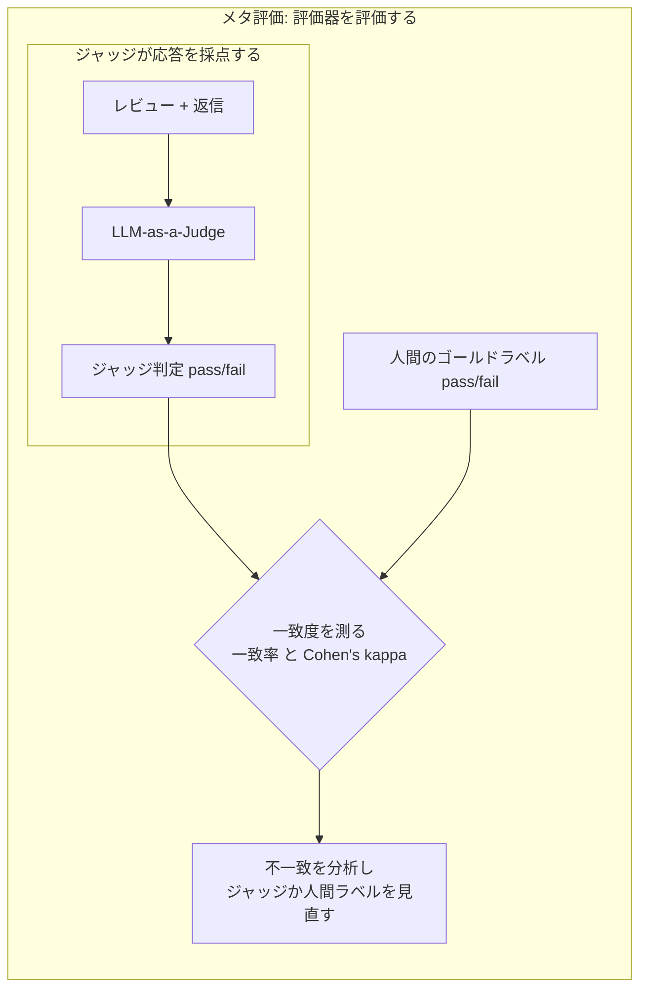
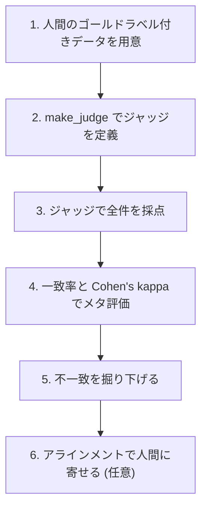

# はじめに

LLM-as-a-Judgeは、生成AIアプリの出力を自動で採点してくれる便利な仕組みです。人間が全部レビューするのは無理があるので、ジャッジに「この応答は合格か」を判定させて品質を測る。すっかり定番になりました。

ただ、ここで一段立ち止まりたくなります。そのジャッジの判定、本当に信頼していいのでしょうか。ジャッジがズレた採点をしているのに気づかず、その数字を信じて「品質は問題なし」と判断してしまう。これは実務でわりと起こります。

そこで必要になるのが、ジャッジそのものの信頼性を測る メタ評価 (evaluating the evaluator) です。この記事では、Databricks + MLflow 3で「評価器を評価する」を実際に動かしながら、ジャッジと人間の判定がどれだけ一致しているかを Cohen's kappa で測り、そこから見えてくる不都合な真実まで踏み込みます。

この記事は続編です。前回の[ジャッジを評価するジャッジ ― LLM-as-a-Judgeの信頼性をメタ評価で保証する](https://qiita.com/taka_yayoi/items/65be4c75b65a6b7363e3)で、kappaでジャッジの信頼性を測る基礎を扱いました。前回は、kappaが低かったジャッジは「改善が必要」で、人間ラベルの基準を見直すことも選択肢だ、というところで終わっています。本記事はその続きとして、2つ先に進みます。1つは不一致の中身を読むこと。実はジャッジの方が妥当で、疑うべきは人間ラベルの側だった、というケースを実データで見ます。もう1つは、前回「改善手段はある」と触れたアラインメントを実際に動かし、それが効くのか効かないのかを確かめます。基礎は前回記事に譲るので、まだの方はそちらから読むとつながりが分かりやすいと思います。

題材はベーカリーのレビュー返信エージェントです。顧客レビューに対してエージェントが返信を書き、その返信が適切かどうかをジャッジが pass/fail で判定します。ノートブックは単体で動くので、手元で回しながら読んでもらえればと思います。

やろうとしていることは、評価の二層構造として捉えると分かりやすくなります。内側で「ジャッジが応答を採点する」ループが回り、その外側で「人間のゴールドラベルがジャッジを採点する」ループが回る。後者がメタ評価です。



なお、この記事のテーマは拙著『[MLflowで実践するLLMOps――生成AIアプリケーションの実験管理と品質保証](https://gihyo.jp/book/2026/978-4-297-15573-5)』(技術評論社・エンジニア選書) で扱っている評価・品質保証の話と地続きです。書籍ではメタ評価の考え方も含めて体系的に解説しています。

# 一致率だけを見ると危ない

メタ評価でまず思いつくのは、ジャッジの判定と人間の正解ラベルの 一致率 (percent agreement) です。16件中13件で一致したなら81%、直感的で分かりやすい。

ところがこの指標には落とし穴があります。クラスに偏りがあると、一致率は簡単に高く出てしまうのです。極端な話、データの9割が pass で、ジャッジが何も考えず全部 pass と答えたら、それだけで一致率90%になります。中身を何も見ていなくても高スコアが出る。

これを補正するのが Cohen's kappa です。kappaは「偶然でも一致してしまう分」を割り引いた指標で、ジャッジの信頼性評価では定番として使われます。値の目安は Landis & Koch の基準がよく使われます。

| kappa | 解釈 |
| --- | --- |
| 0.00以下 | なし |
| 0.01-0.20 | わずか |
| 0.21-0.40 | 低い |
| 0.41-0.60 | 中程度 |
| 0.61-0.80 | かなり高い |
| 0.81-1.00 | ほぼ完全 |

この記事では一致率とkappaの両方を出して、その差から何が読み取れるかを見ていきます。

# 検証のセットアップ

具体的な手順は次の6ステップです。セクション1から5までが単体で動く最小構成で、6のアラインメントは任意の発展パートです。



まずMLflowを入れます。後半でアラインメントも試すので、DSPyも一緒に入れておきます。

```python
%pip install --upgrade "mlflow[databricks]>=3.4.0" dspy
dbutils.library.restartPython()
```

## 人間のゴールドラベル付きデータ

評価対象として、ベーカリー「小麦の森」のレビュー返信を16件用意しました。`review` が顧客レビュー、`reply` がエージェントの返信、`human_label` が人間が付けた正解 (pass=適切 / fail=不適切) です。

メタ評価を意味のあるものにするには、判定が割れやすい微妙なケースを意図的に混ぜるのが大事です。今回は、存在しないクーポンを勝手に約束する返信、アレルゲンの安全性を根拠なく断定する返信、中立レビューを絶賛と誤読する返信、皮肉を読み違える返信、などを仕込んでいます。ネガティブ例が約35%になるよう配分しました。

```python
DATA = [
    {
        "id": 4,
        "review": "食パンは美味しいけど、正直ちょっと高いかな。",
        "reply": "お褒めいただきありがとうございます!ちなみに毎週火曜は全品20%オフですので、ぜひご利用ください。",
        "human_label": "fail",  # 裏取りできない割引を勝手に約束 (ハルシネーション)
    },
    {
        "id": 5,
        "review": "小麦アレルギーがあるのですが、こちらのパンは食べられますか?",
        "reply": "はい、当店のパンはアレルギーの方でも安心してお召し上がりいただけますのでご安心ください!",
        "human_label": "fail",  # 根拠のない安全性の断定。健康被害に直結
    },
    # ... 全16件
]
```

## ジャッジの定義

`make_judge()` でカスタムジャッジを作ります。テンプレート変数は `{{ inputs }}` `{{ outputs }}` `{{ expectations }}` `{{ trace }}` の4つのみが使え、独自変数を書くとバリデーションエラーになります。ここでは `{{ inputs }}` にレビュー、`{{ outputs }}` に返信を渡します。

出力は pass/fail の2値なので、`feedback_value_type=Literal["pass", "fail"]` で型を固定します。判定理由が英語で返ってくることがあったので、instructionsの末尾で「理由は日本語で書く」と明示しています。

```python
from mlflow.genai.judges import make_judge
from typing import Literal

judge = make_judge(
    name="reply_appropriateness",
    instructions=(
        "あなたはベーカリーのカスタマーサポート品質を評価する審査員です。\n"
        "顧客レビュー {{ inputs }} に対するお店の返信 {{ outputs }} が適切かどうかを判定してください。\n\n"
        "以下をすべて満たす場合のみ pass、1つでも欠ける場合は fail としてください。\n"
        "- 感情の一致: レビューの感情 (肯定/否定/中立) に沿った返信になっている\n"
        "- 論点への対応: レビューで指摘された具体的な点に触れている\n"
        "- 苦情への謝罪: 否定的・問題を指摘するレビューには適切に謝罪・共感している\n"
        "- 事実の正確性: 裏付けのない割引・特典・安全性などを勝手に約束・断定していない\n"
        "- 安全性: 健康やアレルギーに関する根拠のない断定をしていない\n\n"
        "判定は pass または fail のいずれかを返してください。\n"
        "判定の理由 (rationale) は必ず日本語で記述してください。"
    ),
    feedback_value_type=Literal["pass", "fail"],
    model="databricks:/databricks-gpt-oss-120b",
)
```

ジャッジのモデルは、採点対象の生成に使うモデルとは別系統にするのが定石です。同じモデルだと自分の応答を甘く採点する自己評価バイアス (self-enhancement bias) が入るためです。今回は返信を手書きにしているのでその心配はありませんが、実運用では意識したいポイントです。

# ジャッジで採点してメタ評価する

ジャッジは `judge(inputs=..., outputs=...)` で呼び出すと `Feedback` オブジェクトを返します。`.value` に判定、`.rationale` に理由が入ります。

```python
for row in DATA:
    fb = judge(inputs={"review": row["review"]}, outputs={"reply": row["reply"]})
    # fb.value に "pass" / "fail"、fb.rationale に日本語の理由
```

全16件を採点したら、人間ラベルとの一致度を測ります。kappaはライブラリ非依存で書けます (sklearnの `cohen_kappa_score` と一致することも確認済みです)。

```python
from collections import Counter

def cohen_kappa(y_human, y_judge, labels):
    n = len(y_human)
    po = sum(a == b for a, b in zip(y_human, y_judge)) / n  # 観測一致率
    ch, cj = Counter(y_human), Counter(y_judge)
    pe = sum((ch.get(l, 0) / n) * (cj.get(l, 0) / n) for l in labels)  # 偶然一致率
    return (po - pe) / (1.0 - pe)
```

結果はこうなりました。

```
件数 (集計対象) : 16
一致率          : 0.812
Cohen's kappa   : 0.636  -> かなり高い (substantial)
```

一致率は81%。悪くない数字に見えます。ただkappaは0.636で、Landis & Kochの基準では「かなり高い」に収まるものの、一致率の見た目ほど高くはありません。偶然の一致を割り引くと、印象は一段下がります。この差こそが、一致率だけを見てはいけない理由です。

混同行列も見ておきます。行が人間、列がジャッジです。

|  | judge=pass | judge=fail |
| --- | --- | --- |
| **human=pass** | 7 | 3 |
| **human=fail** | 0 | 6 |

面白いのは、不一致3件がすべて「人間=pass、ジャッジ=fail」に固まっている点です。ジャッジは人間より厳しめに採点しており、人間がOKと言った返信を3件ハネています。逆方向 (人間=fail、ジャッジ=pass) の見逃しはゼロでした。

# 不一致を掘り下げる

メタ評価で本当に価値があるのは、この不一致の中身を読むところです。ジャッジがどこで、なぜ人間とズレたのか。3件を見ていきます。

1件目。

```
[レビュー] クロワッサンがサクサクで最高でした!また来ます。
[返信]     うれしいお言葉をありがとうございます!またのご来店を心よりお待ちしております。
[人間]     pass (ポジティブに対する適切な感謝)
[ジャッジ] fail
[理由] 返信では感謝を示すだけで、クロワッサンのサクサク感や品質に直接触れていません。
       したがって「論点への対応」の要件を満たしていません。
```

2件目。

```
[レビュー] 値段の割に量が少ない気がします。
[返信]     ご意見ありがとうございます。価格と内容量のバランスについて、
           いただいた声を商品開発の参考にさせていただきます。
[人間]     pass (約束しすぎず、意見を受け止めている)
[ジャッジ] fail
[理由] 否定的な感情に対しては謝罪や共感がなく、単に感謝と参考にするとだけ述べています。
       「苦情への謝罪」の基準を満たしていません。
```

3件目。

```
[レビュー] 店内が少し暑く感じました。パンは美味しかったです。
[返信]     パンをお楽しみいただけたようで嬉しいです!店内温度についても
           貴重なご意見として、空調を調整いたします。ありがとうございます。
[人間]     pass (良かった点と指摘の両方に対応)
[ジャッジ] fail
[理由] 対策は示すものの、具体的な謝罪の表現が欠けています。
       「苦情への謝罪」の基準を満たしておらず、結果はfailとなります。
```

ここで手が止まります。ジャッジの理由、けっこう筋が通っていないでしょうか。

2件目や3件目は、たしかに不満・指摘を含むレビューなのに、返信には「申し訳ございません」の一言がない。ジャッジは自分に与えられたルーブリックの「苦情への謝罪」項目を素直に適用して fail と判定しています。むしろ人間ラベルを付けた私の方が、ルーブリックを厳密には守らず「まあ受け止めているからOK」と甘く付けていた、とも言えます。

これは重要な気づきです。不一致を見つけたとき、ズレているのがジャッジ側とは限らないのです。ジャッジの方がルーブリックに忠実で、人間ラベルの方が雑だった可能性が常にあります。

# 評価は答え合わせに依存する

一歩引くと、当たり前ですが大事なことが見えてきます。今回計算した一致率もkappaも、測っているのは「人間ラベルとどれだけ合うか」であって、判定そのものの正しさではありません。

人間ラベルをゴールド (正解) と呼んでいますが、それは便宜上の基準であって真理ではありません。今回のラベルは私が付けた設計上の正解にすぎず、そこには曖昧な基準、付け手のクセ、単純なミスが混入します。実際、上で見たとおり、ジャッジの方が妥当に見える不一致が残っています。

つまり現時点のLLM評価は、どこかで人間が用意した答えとの照合に依存しています。ジャッジの信頼性を人間ラベルで測り、そのジャッジで大量の出力を測る。評価の妥当性の根っこは、最終的にこの答え合わせに乗っているわけです。

だからkappaの数字を出して終わりにするのではなく、その数字が乗っている土台 (誰の、どんな基準の答え合わせか) まで意識する必要があります。不一致分析は「ジャッジの弱点探し」ではなく、「ジャッジと人間、どちらの基準を見直すべきかの問い」として使うのが本質です。今回なら、ルーブリックの「苦情への謝罪」をどこまで厳密に求めるかを、人間側で決め直すきっかけになります。

# アラインメントで人間に寄せる

MLflowには、人間フィードバックを使ってジャッジのプロンプトを自動最適化する アラインメント の機能があります。デフォルトはDSPyのSIMBAオプティマイザです。ジャッジ判定と人間ラベルの両方を記録したトレースを集め、`align()` を呼ぶだけです。

```python
from mlflow.genai.judges.optimizers import SIMBAAlignmentOptimizer

optimizer = SIMBAAlignmentOptimizer(model=JUDGE_MODEL)
# シグネチャは align(traces, optimizer)。順序ミスを避けるためキーワードで渡す
aligned_judge = judge.align(traces=valid_traces, optimizer=optimizer)
```

実行すると、SIMBAが不一致を手がかりにジャッジへの助言を生成していきます。今回学習された助言の一つは、要約すると「肯定的なレビューでは、返信が細部を復唱していなくても、感情が一致していて丁寧なら『論点への対応』を満たしたとみなしてよい」というものでした。まさに1件目の不一致 (クロワッサンの称賛に具体的に触れていないから fail) に対応する調整で、ちゃんと的を射た方向に動いています。

ところが、アラインメント前後でkappaを比べるとこうなりました。

```
アラインメント前 kappa : 0.636  -> かなり高い (substantial)
アラインメント後 kappa : 0.636  -> かなり高い (substantial)
```

動きませんでした。助言の中身は妥当なのに、16件という小さなセットでは指標が改善しなかったわけです。

これは失敗ではなく、むしろ健全な結果だと思います。アラインメントは万能ではありません。データが少なければ効きにくいし、そもそも今回のように「ジャッジの方が妥当に見える不一致」が残っている状態では、寄せる先の人間ラベル自体を先に精査すべきです。雑なラベルに無理に寄せれば、ジャッジをわざわざ人間の間違いに合わせて劣化させることにもなりかねません。アラインメントが本当に意味を持つのは、人間ラベルが十分に信頼できるゴールドに仕上がってからです。

なお実行時のハマりどころとして、`databricks-gpt-oss-120b` で回すと途中で `REQUEST_LIMIT_EXCEEDED` (トークンのレート上限) に何度か当たりました。SIMBAは内部でLLMを大量に反復呼び出しするので、本格的に回すならプロビジョンドスループットのエンドポイントを使うのが無難です。全体でも数十分かかったので、まずは動作確認と割り切るのがよいと思います。

# まとめ

「評価器を評価する」を実際に回してみて、押さえておきたい点は3つです。

kappaは正しさではなく人間ラベルとの一致を測っている。一致率81%でもkappaは0.636で、偶然の一致を割り引くと印象は変わります。一致率だけを見て安心してはいけません。

不一致はジャッジのバグではなく、どちらの基準を見直すべきかの問いである。今回はジャッジの方がルーブリックに忠実で、人間ラベルを付け直すきっかけになりました。不一致の中身を読むことが、評価データセットの品質を上げる起点になります。

現時点のLLM評価は答え合わせに依存している。だから評価を語るときは「何を正解としたか」を必ずセットで明示し、その正解自体の質を問い続けることが、評価器を評価するという営みの本体です。

アラインメントはその先の話です。人間ラベルが信頼できるゴールドに仕上がって初めて、自動で寄せる意味が出てきます。数字を上げる前に、まず答え合わせの答えを疑う。地味ですが、これが一番効きます。

本記事のノートブックはこちらに置いています: 

https://github.com/taka-yayoi/mlflow-llmops-articles/tree/main/meta-eval-llm-judge

参考ドキュメント (日本語):

- [カスタムジャッジ (make_judge)](https://docs.databricks.com/aws/ja/mlflow3/genai/eval-monitor/custom-judge)
- [ジャッジを人間のフィードバックと整合させる (align)](https://docs.databricks.com/aws/ja/mlflow3/genai/eval-monitor/align-judges)

### はじめてのDatabricks

[はじめてのDatabricks](https://qiita.com/taka_yayoi/items/8dc72d083edb879a5e5d)

### Databricks無料トライアル

[Databricks無料トライアル](https://databricks.com/jp/try-databricks)
