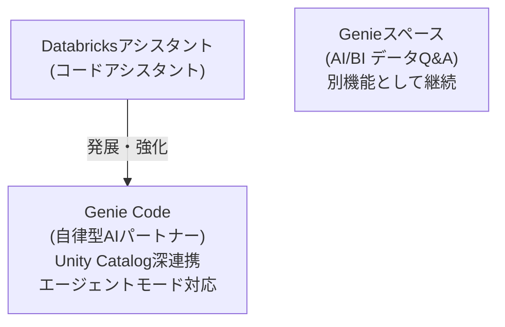

DatabricksにはこれまでにもAIアシスタント機能が存在していましたが、2026年に入り **Genie Code** という形で大きく再編・強化されました。本記事ではGenie Codeの概要と、これまでのGenieおよびDatabricksアシスタントとの関係を整理した上で、公式チュートリアルである顧客セグメンテーション分析の実行例を紹介します。

https://docs.databricks.com/aws/ja/genie-code

# GenieとDatabricksアシスタントの系譜

Databricksには、これまで大きく分けて2つのAI支援機能が存在していました。

**Databricksアシスタント** は、ノートブックやSQLエディターに組み込まれたAIコードアシスタントです。インラインでのコード補完、チャットによる質問応答、エラーのクイックフィックスといった機能を提供し、開発者の日常的なコーディング作業を支援してきました。

**Genieスペース** は、AI/BIの一機能として提供されるデータQ&Aインターフェースです。自然言語でデータに関する質問を投げかけると、SQLを自動生成して回答を返してくれます。データアナリストがダッシュボード上で直接データを探索する用途を想定して設計されています。



**Genie Code** は主に**Databricksアシスタントの発展形**です。単なるコード補完やチャットに留まらず、複数ステップのタスクを自律的に計画・実行する「エージェントモード」を備え、Unity Catalogとの深い統合によりデータエンジニアリングからMLまで一貫して支援します。

**Genieスペースは引き続き独立した機能として存在します** ([Genieスペースとは](https://docs.databricks.com/aws/ja/genie/))。Genie Codeとは別物であり、AI/BIダッシュボード上での自然言語データQ&Aという用途は変わりません。

# Genie Code とは

[Genie Code](https://docs.databricks.com/aws/ja/genie-code) は、Databricksでのデータ作業専用に構築された自律AIパートナーです。他のAIアシスタントと最も異なる点は、**Unity Catalogと深く統合されている**ことです。テーブル、列、リネージを含む完全なデータランドスケープを理解し、組織固有のデータやガバナンスモデルに自律的に適応します。

現在提供されているすべての機能は、**追加料金なし**で利用できます (コンピュートコストのみ)。

# Genie Codeの機能

## エージェントモード: 自律的なマルチステップ実行

Genie Codeの最大の特徴が「エージェントモード」です。セル出力を読み取り、エラーを自動修正し、結果に基づいてアプローチを調整しながら、複数ステップのタスクを自律的に処理します。製品サーフェスごとに特化した動作をします。

| サーフェス | Genie Codeの役割 |
|---|---|
| ノートブック | 探索的データ分析・モデルトレーニングの自動化 |
| LakeFlow Pipelines | ETLワークロードの自動化・宣言型パイプラインの構築 |
| ダッシュボード | 本番対応ダッシュボードの計画・生成 |
| MLflow | GenAIアプリケーションの理解・デバッグ・改善 |

## インラインアシスト機能

エージェントモードに加え、以下の日常的なアシスト機能も提供されています。

- **チャット**: Databricksドキュメントの引用を含む質問応答
- **インライン提案・オートコンプリート**: コード記述をリアルタイムで支援
- **クイックフィックス**: 基本的なエラーの自動修正提案
- **診断エラー**: 環境エラーなど複雑なエラーの分析と修正
- **/スラッシュコマンド**: 頻出プロンプトのショートカット
- **自然言語フィルタ**: 自然言語でデータをフィルタリング
- **カタログエクスプローラー連携**: サンプルデータの自然言語探索

# チュートリアル: 顧客セグメンテーション分析

[公式チュートリアル](https://docs.databricks.com/aws/ja/getting-started/genie-code-customer-segmentation)を使って、Genie Codeのエージェントモードを体験してみます。マーケティングキャンペーンデータを使ったK-meansクラスタリングによる顧客セグメンテーションをエンドツーエンドで実行します。

## 事前要件

- Genie Codeが有効なDatabricksワークスペース
- パートナー提供のAI機能がアカウント・ワークスペースの両方で有効
- Genie Code エージェントモードのプレビュー有効化 ([Databricksプレビューの管理](https://docs.databricks.com/aws/ja/admin/workspace-settings/manage-previews))

## ステップ1: データセットの準備

KaggleからMarketingキャンペーンデータセットをダウンロードし、Unity Catalogにテーブルとして登録します。


1. [マーケティングキャンペーンデータセット](https://www.kaggle.com/datasets/rodsaldanha/arketing-campaign)をKaggleからダウンロード
2. **新規 > データを追加またはアップロード** をクリック
3. **[テーブルの作成または変更]** を選択し、ファイルをアップロード
4. ターゲットカタログとスキーマを指定して **[テーブルを作成]** をクリック


## ステップ2: ノートブックを開く

サイドバーから **[新規] > [ノートブック]** を作成し、サーバレスコンピュートまたはクラスターにアタッチします。

## ステップ3: エージェントモードの起動

ノートブック右上のGenie Codeペインを開き、モードセレクターで **[Agent]** を選択します。


## ステップ4: セグメンテーションプロンプトの送信

以下のプロンプトを入力して送信します。

```
マーケティングキャンペーンの顧客をクラスタリングしてプロファイリングしてください。マーケティング目的に役立つ興味深いセグメントを特定したいです。
```

Genie Codeはプロンプトを受け取ると、以下のステップを自律的に実行します。

1. **コンテキストの理解** — プロンプトとノートブックの現在の状態を読み取る
2. **関連データの検索** — Unity Catalogで関連データアセットを検索・ロード
3. **コードの生成と実行** — ライブラリのインポート → データ前処理 → モデルトレーニング → 結果の可視化
4. **結果の要約** — 発見内容をわかりやすい言葉でまとめる

各ステップの実行前に承認を求められます。**[許可]** をクリックして進めます。**[このスレッドで許可]** を選べば現在の会話全体を一括承認できます。


## ステップ5: 結果の確認

Genie Codeが完了すると、生成されたノートブックセルと概要がペインに表示されます。概要には各顧客セグメントの特性が記載されます。たとえば以下のようなセグメントが識別されることがあります。

- **プレミアムロイヤリスト** — 高収入・高頻度購入層
- **バーゲンシーカー** — 価格感度が高くプロモーション重視


```
======================================================================
■ マーケティングセグメント サマリー
======================================================================

クラスタ 0: 🔍 ウィンドウショッパー
  説明: 閲覧は多いが購入に至らない層。コンバージョン施策が有効
  人数: 1223人 (55.3%)
  平均収入: ¥37,282 | 平均支出: ¥146
  平均年齢: 55歳 | 子供数: 1.2
  キャンペーン反応: 0.2回 | 購入回数: 9回

クラスタ 1: 🌟 プレミアム顧客
  説明: 高収入・高支出。キャンペーン反応率も高いVIP層
  人数: 989人 (44.7%)
  平均収入: ¥70,108 | 平均支出: ¥1,177
  平均年齢: 59歳 | 子供数: 0.6
  キャンペーン反応: 0.8回 | 購入回数: 22回
```

## ステップ6: フォローアップで深掘り

会話の文脈を保ちながら、追加プロンプトで分析を深掘りできます。

```
他に検討すべきクラスタリング手法はありますか？
```
```
クラスター数を増やすとどうなりますか？
```
```
過去90日以内に購入した顧客に絞り込んでください。
```


# まとめ

Genie Codeは、Databricksアシスタントを発展させた自律型AIパートナーです。Unity Catalogとの深い統合とエージェントモードによる自律実行能力が加わり、従来のコード補完・チャットの域を大きく超えました。GenieスペースはAI/BIダッシュボード上のデータQ&A機能として引き続き独立して存在しており、Genie Codeとは用途・位置づけが異なります。

| | Databricksアシスタント | Genieスペース | Genie Code |
|---|---|---|---|
| 主な用途 | コード補完・チャット | 自然言語データQ&A | 自律型マルチステップ作業 |
| Unity Catalog連携 | 限定的 | あり | 深い統合 |
| エージェントモード | なし | なし | あり |
| 対応サーフェス | ノートブック・SQLエディター | AI/BIダッシュボード | ノートブック・LakeFlow・ダッシュボード・MLflow |
| 料金 | 追加なし | 追加なし | 追加なし |

データエンジニアリングからデータサイエンス、BIまで幅広い作業を自律的にサポートするGenie Code。ぜひエージェントモードを試してみてください。

# 参考リンク

- [Genieコード (公式ドキュメント)](https://docs.databricks.com/aws/ja/genie-code)
- [チュートリアル: Genie Codeによる顧客セグメンテーション](https://docs.databricks.com/aws/ja/getting-started/genie-code-customer-segmentation)
- [データサイエンスにGenie Codeを使用する](https://docs.databricks.com/aws/ja/notebooks/ds-agent)
- [Genieコードを使用する](https://docs.databricks.com/aws/ja/genie-code/use-genie-code)
- [Genie Codeの応答を改善するためのヒント](https://docs.databricks.com/aws/ja/genie-code/tips)
- [Genieスペースとは](https://docs.databricks.com/aws/ja/genie/)

### はじめてのDatabricks

[はじめてのDatabricks](https://qiita.com/taka_yayoi/items/8dc72d083edb879a5e5d)

### Databricks無料トライアル

[Databricks無料トライアル](https://databricks.com/jp/try-databricks)
