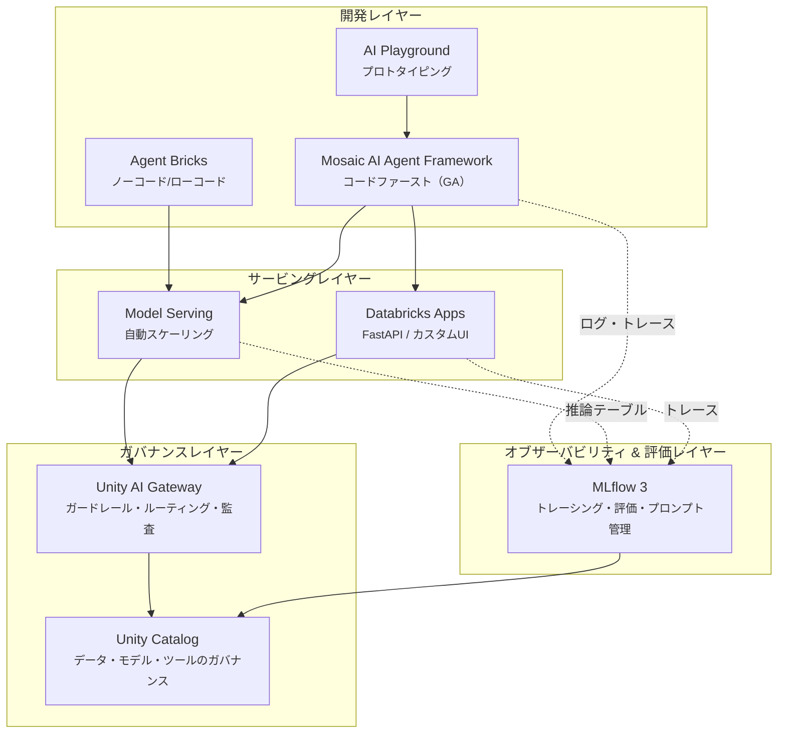
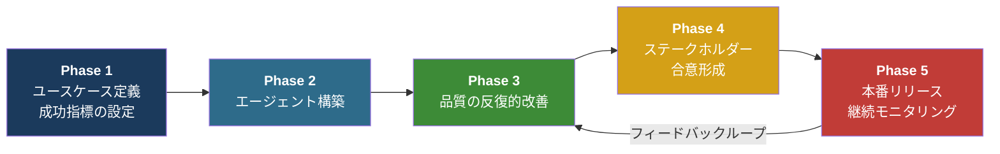
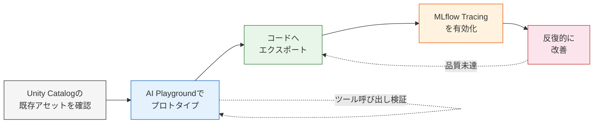
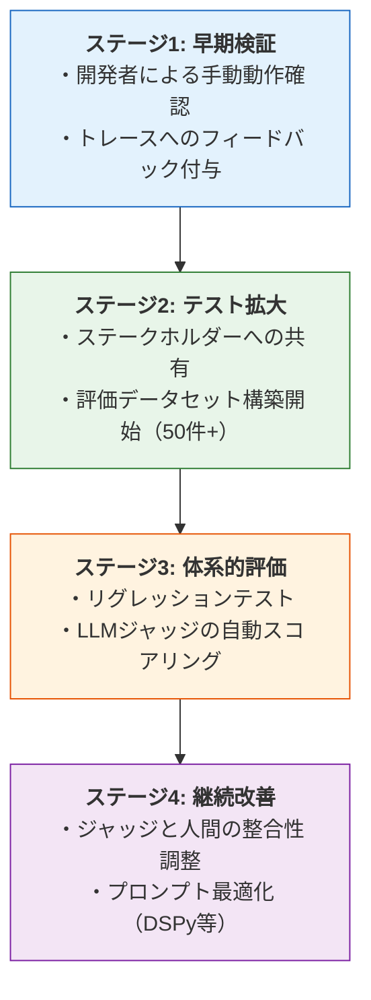
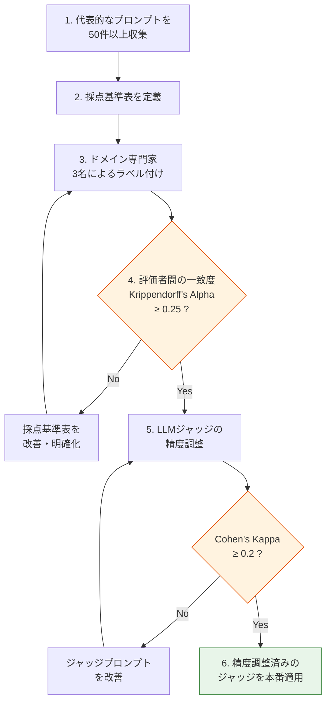
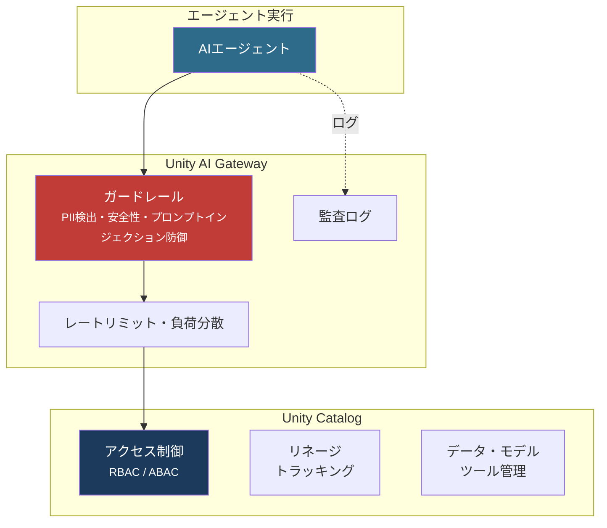

# はじめに

DatabricksのMosaic AIプラットフォームは、AIエージェントの**開発・評価・デプロイ・モニタリング**を統合的に管理するフレームワークを提供しています。

本記事では、公式ドキュメントやブログ記事を基に、エージェントのライフサイクル管理におけるベストプラクティスを体系的にまとめます。

# プラットフォームアーキテクチャ



| コンポーネント | 役割 |
|---|---|
| **Mosaic AI Agent Framework** | エージェントの構築・デプロイの統合フレームワーク（GA） |
| **Agent Bricks** | ノーコード/ローコードでのエージェント構築プラットフォーム |
| **MLflow 3** | トレーシング・評価・プロンプト管理・モニタリングの統合基盤 |
| **Unity Catalog** | データ・AIアセット・ツールのガバナンス基盤 |
| **Unity AI Gateway** | LLM/ツールアクセスのガバナンス・ガードレール・ルーティング |
| **Model Serving / Databricks Apps** | エージェントのサーバーレスデプロイ基盤 |

# ライフサイクルの全体像

Databricksが推奨する[エージェント開発ワークフロー](https://docs.databricks.com/ja/generative-ai/guide/agents-dev-workflow)は以下の5段階で構成されます。



# Phase 1: ユースケースの定義と成功指標の設定

- **エージェントの目的を明確化**: 入力の種類、期待される応答の振る舞い、品質基準（トーン、正確性、完全性、安全性、引用の有無）を定義する
- **システム要件の特定**: コスト、レイテンシ、スケーラビリティの要件を事前に明確化する
- **[複雑さの連続体（Complexity Continuum）](https://docs.databricks.com/ja/generative-ai/guide/agent-system-design-patterns)で最適なアプローチを選択**:
  - LLM + プロンプト（最もシンプル）
  - 決定論的チェーン（RAGなど）
  - シングルエージェント（多くのエンタープライズユースケースのスイートスポット）
  - マルチエージェント（最も複雑だが最も高機能）
- **評価基準を先に設計**: 自動化されたLLMジャッジの基準を、エージェント構築前に定義する
- **失敗モードの想定**: エッジケースや失敗シナリオを事前に洗い出す

# Phase 2: エージェントの開発

## 開発アプローチの選択

Databricksは3つの開発パスを提供しています（[AIエージェントを作成し、Databricks Appsにデプロイする](https://docs.databricks.com/ja/generative-ai/agent-framework/author-agent)を参照）。

| パス | 対象 | 特徴 |
|---|---|---|
| **ノーコード** | プロトタイプ・簡易ユースケース | AI Playground、Agent Bricks Knowledge Assistant |
| **ローコード** | 標準的なユースケース | Agent Bricks Supervisor Agent |
| **コードファースト** | カスタムエージェント | Agent Framework + 任意のフレームワーク |

**Agent Bricks** はTime-to-productionを重視する場合（業務ツール、文書Q&A、SQLチャット等）に適しています。一方、カスタム検索ロジックやマルチホップ推論、CI/CDパイプラインとの統合が必要な場合は **Agent Framework** を選択してください。

## 推奨される開発ワークフロー



1. **既存のUnity Catalogアセットを確認**: 新規作成前に既存のデータ・ツール・関数を探索する
2. **AI Playgroundでプロトタイプ**: ノーコードで素早く検証、ツール呼び出しの動作確認
3. **コードへエクスポート**: 「Get code > Create agent notebook」でNotebookに展開
4. **初日からMLflow Tracingを有効化**: 機能的正しさの検証のため、開発初期からトレーシングを組み込む

## フレームワーク選択

Databricksは[フレームワーク非依存のアプローチ](https://docs.databricks.com/ja/generative-ai/agent-framework/create-chat-model)を採用しています。

```python
# 推奨: MLflow ResponsesAgent インターフェースでラップ
import mlflow

class MyAgent(mlflow.pyfunc.ResponsesAgent):
    def predict(self, context, messages, custom_inputs=None):
        # 任意のフレームワーク（LangGraph, OpenAI Agents SDK, 素のPython等）で実装
        ...
```

**サポートされるフレームワーク**: OpenAI Agents SDK、LangGraph、LangChain、LlamaIndex、素のPython

`mlflow.pyfunc.ResponsesAgent` は `ChatAgent` を後継するプライマリインターフェースであり、MLflowトレーシング、ストリーミング、ツール呼び出し、モデルシグネチャ推論を自動処理します。新規開発では `ResponsesAgent` を使用してください（[生成AI対応MLflow](https://docs.databricks.com/ja/mlflow3/genai/overview/)を参照）。

## ツールの定義と管理

[AIエージェントツール](https://docs.databricks.com/ja/generative-ai/agent-framework/agent-tool)の選択肢は以下の通りです。

| ツール種別 | 用途 | 推奨度 |
|---|---|---|
| **[Managed MCPサーバー](https://docs.databricks.com/ja/generative-ai/mcp/managed-mcp)** | Vector Search、UC Functions、Genie Spaces | 新規開発で推奨 |
| **外部MCPサーバー** | サードパーティAPI連携 | 外部連携時に推奨 |
| **Unity Catalog関数** | カスタムツール | MCP移行を推奨 |
| **ローカルPython関数** | `@function_tool` / `@tool` | プロトタイプ向け |

ツールの関数名・パラメータ名・コメント（docstring）は、LLMがツール選択の判断に使用するメタデータとなるため、明確かつ具体的に記述しましょう。ツール関数では `*args/**kwargs` を避け、明示的な型ヒントとGoogle-styleのdocstringを記述してください。

## 認証ポリシーの設定

Databricksは2種類の認証ポリシーを提供しており、`mlflow.pyfunc.log_model()` の際に宣言的に指定します。プラットフォームがクレデンシャルの発行・ローテーション・スコープ制限を自動処理するため、開発者が認証ロジックを自前で実装する必要はありません。

```python
mlflow.pyfunc.log_model(
    ...
    resources=[
        SystemAuthPolicy(resources=[...]),  # エージェントがアクセスできるリソースの許可リスト
        UserAuthPolicy(scopes=[...]),       # ユーザートークンのスコープ制限
    ]
)
```

| ポリシー | 役割 | 動作 |
|---|---|---|
| **SystemAuthPolicy** | リソース許可リスト | エージェントがアクセスできるエンドポイント/インデックスを指定。デプロイ時に認証情報を自動発行。宣言されていないリソースにはアクセス不可（ゼロトラスト） |
| **UserAuthPolicy** | OAuthスコープ制限 | ユーザートークンの権限を必要最小限に絞り込み、エージェントが実行できる操作を制限 |

:::note warn
OBO（On-behalf-of-user）認証を使用する場合、エージェントは必ず `predict()` 関数の内部で初期化してください。クラスの初期化時ではなく、リクエストごとに新しいエージェントを初期化することで、ユーザー権限に基づく適切なツール提供とリソース分離を実現できます。
:::

# Phase 3: 品質の反復的改善

品質改善の全体的なアプローチについては[AIエージェントの評価と監視](https://docs.databricks.com/ja/mlflow3/genai/eval-monitor/)を参照してください。

## 評価の成熟度モデル

品質改善は以下の4段階で段階的に進めます。



### ステージ1: 早期検証（開発者による手動動作確認）
- 開発者が手動でクエリを実行し、トレースにフィードバックを付与
- [MLflow Tracing](https://docs.databricks.com/ja/mlflow3/genai/tracing/)で各ステップの入出力を確認

### ステージ2: テスト範囲の拡大
- ラベリングセッション（専門家が回答品質を評価・タグ付けする作業）でステークホルダー・ドメイン専門家にプロトタイプを共有
- 評価データセットの構築を開始（50件以上、理想的には100件以上）

### ステージ3: 体系的な評価
- 評価データセットを用いたリグレッションテスト
- 自動化されたLLMジャッジによるスコアリング
- MLflow TracingとAI Insightsで根本原因を分析

### ステージ4: 継続的な改善
- カスタムジャッジと人間のフィードバックの整合性を調整
- 問題に焦点を当てたデバッグデータセットを構築
- プロンプト最適化（DSPyによるデータ駆動最適化を含む）

## LLMジャッジの種類と使い分け

詳細は[スコアラー（評価関数）とLLMジャッジ](https://docs.databricks.com/ja/mlflow3/genai/eval-monitor/concepts/scorers)を参照してください。

| カテゴリ | ジャッジ | 評価内容 |
|---|---|---|
| 応答品質 | `Correctness` | 正解データとの比較 |
| 応答品質 | `Safety` | 有害・攻撃的・有毒なコンテンツの検出 |
| 応答品質 | `Fluency` | 文法・自然な文章の流れ |
| 応答品質 | `Completeness` | すべての質問に回答しているか |
| RAG固有 | `RetrievalGroundedness` | ハルシネーション検出（コンテキストとの整合性） |
| RAG固有 | `RelevanceToQuery` | 応答の関連性確認 |
| RAG固有 | `RetrievalSufficiency` | 検索コンテキストの十分性 |
| ツール関連 | `ToolCallCorrectness` | ツール呼び出しの正確性 |
| ツール関連 | `ToolCallEfficiency` | 冗長なツール使用の検出 |
| マルチターン会話 | `ConversationCompleteness` | 全質問への対応 |
| マルチターン会話 | `UserFrustration` | ユーザーのフラストレーション検出 |
| マルチターン会話 | `KnowledgeRetention` | ターン間の情報保持 |

上記の組み込みジャッジに加えて、以下のカスタマイズ手段があります。

- **ガイドラインジャッジ**: 自然言語ルールに基づく合格/不合格判定。スタイル、事実性、コンプライアンスの検証に適する
- **カスタムLLMジャッジ**: `make_judge()` で独自の評価基準を定義し、`judge.align()` でドメイン専門家のフィードバックと整合
- **Agent-as-a-Judge**: ジャッジの指示に `{{ trace }}` を含めると、トレースのどの部分を評価するか自動判定
- **コードベーススコアラー**: `@scorer` デコレータによるプログラム的・決定論的な評価

LLMジャッジの精度をさらに高める手法として、Databricks AI Researchが開発した[Grading Notes手法](https://www.databricks.com/blog/enhancing-llm-as-a-judge-with-grading-notes)があります。評価データセットの各質問に「どのポイントを押さえていれば正解とするか」の短い採点メモを付与することで、人間の判断との一致率を大幅に改善できます。

## カスタムジャッジ構築のベストプラクティス

ドメイン専門家と協働してカスタムLLMジャッジを構築・精度調整するための推奨ワークフローです（[カスタムLLMジャッジの構築](https://www.databricks.com/blog/building-custom-llm-judges-ai-agent-accuracy)、[パイロットから本番へ](https://www.databricks.com/blog/pilot-production-custom-judges)も参照）。



1. **代表的なプロンプトを50件以上収集**（最初は10件で反復的にプロセスと採点基準を磨く）
2. **採点基準表を定義**: 全体品質（5段階）、事実性、トーン、構造（3段階）等の評価軸とスコアリングルールを明文化
3. **ドメイン専門家によるラベル付け**: サンプルごとに3名の専門家が独立して評価
4. **評価者間の一致度を確認**: Krippendorff's Alpha（評価者間信頼性の指標）≥ 0.25を目標
5. **LLMジャッジの精度調整**: 専門家のコンセンサスとLLMジャッジの判定を比較し、Cohen's Kappa（一致度の指標）≥ 0.2を目指す
6. **ジャッジプロンプトを反復的に改善**

### ジャッジ設計の実践的教訓

- **複合ジャッジを分解する**: 「関連性があり、事実に基づき、簡潔」といった複合評価は、3つの独立したジャッジに分割しましょう。単一の総合ジャッジはスコア低下時の根本原因を隠します
- **ラベル付けはバッチ単位で実施する**: バッチ間で評価者間の一致度を確認でき、低い一致率が採点基準の改善議論を促します
- **自動プロンプト最適化を推奨**: DSPyやMLflowの自動プロンプト最適化ツールがサンプルに対して体系的にテストし効率的です
- **ジャッジは継続的に更新する**: 本番データを使った定期的なレビューで新たな障害パターンを発見し、ジャッジを更新しましょう

# Phase 4: ステークホルダーとの合意形成

- **評価指標をビジネスシグナルに変換**: 技術的メトリクスを経営層が理解できる指標に翻訳する
- **標準化された品質チェックの合格確認**: 安全性、正確性、レイテンシ等の閾値をクリアしていることを確認
- **運用準備の検証**: モニタリング体制、ガードレール設定、ロールアウト計画、ロールバック手順
- **リスクの文書化と承認取得**

# Phase 5: 本番リリースと継続的モニタリング

## デプロイ方式の選択

2026年3月以降、公式推奨は**「エージェントにはApps、モデルにはModel Serving」**となっています（[Databricks で生成AIアプリを構築する](https://docs.databricks.com/ja/generative-ai/agent-framework/build-genai-apps)を参照）。

| デプロイ方式 | 特徴 | 推奨ユースケース |
|---|---|---|
| **Databricks Apps** | フルコントロール、ホットリロード対応、FastAPIベース | **新規エージェント開発で推奨** |
| **Model Serving（`agents.deploy()`）** | ワンラインデプロイ、自動スケーリング、Review App自動設定 | 共有推論エンドポイント、AI Gatewayが必須の場合 |

`agents.deploy()` を使用すると、以下が自動的に設定されます。

- サーバーレスModel Servingエンドポイントの作成（自動スケーリング・負荷分散）
- セキュアな認証のプロビジョニング（短命クレデンシャルの自動ローテーション）
- リアルタイムトレーシングの有効化
- 推論テーブル（Inference Tables）の作成

## 本番モニタリング

オブザーバビリティは以下の三層で構成されます。

| レイヤー | 機能 | 推奨 |
|---|---|---|
| **MLflow Traces** | 完全な実行ツリー（入出力、スパン、メタデータ）、OpenTelemetryベース | 全エージェントで必須 |
| **AI Gateway推論テーブル** | リクエスト/レスポンスペイロード + トレースをDelta tableに自動記録 | Model Servingエンドポイントで有効化 |
| **AI Gateway** | レートリミット、PIIフィルタリング、ガードレール、使用量分析、コスト追跡 | 全サービングエンドポイントで設定 |

[Production Monitoring](https://docs.databricks.com/ja/mlflow3/genai/eval-monitor/production-monitoring)（Beta）では、評価関数の種別に応じたサンプリング戦略が重要です。

| 評価関数の種別 | 推奨サンプルレート | 理由 |
|---|---|---|
| 安全性・セキュリティ | `1.0`（全量） | リスク管理のため全トレースを評価 |
| 高コストの評価関数 | `0.05-0.2` | コスト管理 |
| 開発反復時 | `0.3-0.5` | 十分なカバレッジと効率のバランス |

# ガバナンスとセキュリティ



## [Unity Catalog](https://docs.databricks.com/ja/data-governance/unity-catalog/best-practices)によるガバナンス

- **最小権限の原則**: ユーザーに必要最小限のアクセスのみを付与
- **グループベースのオーナーシップ**: 本番カタログ/スキーマの所有権はグループに割り当て
- **本番環境はサービスプリンシパル**: 本番テーブルへの直接MODIFY権限はサービスプリンシパルに限定

## Unity AI Gateway

- エージェントからLLM/MCPサーバー/APIへのアクセスにガバナンスを適用
- **AI GatewayはModel Servingエンドポイント専用**（Databricks Appsでは利用不可）
- Appsベースのエージェントでは、基盤となるLLMエンドポイント側でガバナンスを適用する
- **ガードレール機能**: PII検出・マスキング、安全でないコンテンツの検出、プロンプトインジェクション防御、データ漏洩防止
- 編集可能なプロンプトと設定可能なモデルに基づくガードレール（硬直的なビルトインロジックではない）

:::note warn
AI Gatewayのガードレールはエージェントフレームワークとは直接連携しません。ガードレールはエージェントレベルではなく、LLMエンドポイントレベルで適用してください。
:::

# CI/CDとバージョニング

## DABsとCI/CDの役割分担

[DABs（Declarative Automation Bundles）](https://docs.databricks.com/ja/machine-learning/mlops/ci-cd-for-ml)とCI/CDは異なる概念です。

| 役割 | DABs | CI/CD |
|---|---|---|
| **目的** | 初期インフラセットアップ、リソース定義 | ソースコードの反復的デプロイ |
| **適するタイミング** | 新規リソース追加時 | コード変更のたび |
| **コマンド** | `databricks bundle deploy` | GitHub Actions / Azure DevOps |

## エージェントのテストピラミッド

標準的なDevOpsテスト（単体テスト、統合テスト、E2Eテスト）の**上に**エージェント評価を重ねます。

1. **単体テスト**: 個々のツール関数、パーサー、ユーティリティ
2. **統合テスト**: ツール呼び出しチェーン、外部API連携
3. **E2Eテスト**: エンドツーエンドのエージェント実行
4. **エージェント評価**: `mlflow.genai.evaluate()` による品質ゲート（CI/CDパイプラインに組み込み、スコアが閾値を下回ったらデプロイを阻止）

# エージェント設計パターン

Databricksは4つの[設計パターン](https://docs.databricks.com/ja/generative-ai/guide/agent-system-design-patterns)を複雑さの連続体として定義しています。

| パターン | 複雑さ | 予測可能性 | ユースケース |
|---|---|---|---|
| **LLM + プロンプト** | 最低 | 低 | 汎用Q&A、クイックプロトタイプ |
| **決定論的チェーン** | 低 | 最高 | 基本的なRAG（検索→拡張→生成） |
| **シングルエージェント** | 中 | 中 | エンタープライズユースケースのスイートスポット |
| **マルチエージェント** | 最高 | 低 | 複数の専門エージェントの連携 |

> 多くのエンタープライズユースケースでは「シングルエージェント」が最適なバランスポイントです。マルチエージェントよりデバッグが容易でありながら、動的なツール選択が可能です。

## 全パターン共通の本番ベストプラクティス

- **プロンプトは明確かつ最小限に**: 必要なツールとコンテキストのみを提供
- **MLflow Tracingで詳細ログ**: すべてのリクエスト、計画、ツール呼び出しを記録
- **モデルバージョンを固定**: 行動ドリフトを防止
- **高リスクアクションのサンドボックス化**: 人間の承認を要求
- **無限ループの防止**: 繰り返しや無効なツール呼び出しをガード

# 参考リソース

## 公式ドキュメント（日本語版）

- [ガイド: エージェント開発ワークフロー](https://docs.databricks.com/ja/generative-ai/guide/agents-dev-workflow)
- [エージェント システムの設計パターン](https://docs.databricks.com/ja/generative-ai/guide/agent-system-design-patterns)
- [AIエージェントを作成し、Databricks Appsにデプロイする](https://docs.databricks.com/ja/generative-ai/agent-framework/author-agent)
- [AIエージェントをコードで作成する](https://docs.databricks.com/ja/generative-ai/agent-framework/create-chat-model)
- [Databricks で生成AIアプリを構築する](https://docs.databricks.com/ja/generative-ai/agent-framework/build-genai-apps)
- [AIエージェントツール](https://docs.databricks.com/ja/generative-ai/agent-framework/agent-tool)
- [Databricks マネージド MCPサーバーを使用する](https://docs.databricks.com/ja/generative-ai/mcp/managed-mcp)
- [生成AI対応MLflow](https://docs.databricks.com/ja/mlflow3/genai/overview/)
- [MLflow Tracing - GenAI オブザーバビリティ](https://docs.databricks.com/ja/mlflow3/genai/tracing/)
- [AIエージェントの評価と監視](https://docs.databricks.com/ja/mlflow3/genai/eval-monitor/)
- [スコアラーとLLMジャッジ](https://docs.databricks.com/ja/mlflow3/genai/eval-monitor/concepts/scorers)
- [本番運用でGenAIアプリを監視する](https://docs.databricks.com/ja/mlflow3/genai/eval-monitor/production-monitoring)
- [Unity Catalogのベストプラクティス](https://docs.databricks.com/ja/data-governance/unity-catalog/best-practices)

## ブログ記事（日本語版）

- [Mosaic AI：本番運用のための複合AIシステムの構築とデプロイ](https://www.databricks.com/jp/blog/mosaic-ai-build-and-deploy-production-quality-compound-ai-systems)
- [MLflow 3.0：GenAIを安心して本番運用する統合MLOps基盤](https://www.databricks.com/jp/blog/mlflow-30-unified-ai-experimentation-observability-and-governance)
- [エージェントブリック：ガバナンス対応エンタープライズエージェントプラットフォーム](https://www.databricks.com/jp/blog/agent-bricks-governed-enterprise-agent-platform)
- [Unity AI Gatewayによるエージェントガバナンスの拡張](https://www.databricks.com/jp/blog/ai-gateway-governance-layer-agentic-ai)
- [プロダクションAIエージェント成功のカギは「評価」にあり](https://www.databricks.com/jp/blog/key-production-ai-agents-evaluations)
- [Data + AI Summit 2025で発表された Mosaic AI の新機能](https://www.databricks.com/jp/blog/mosaic-ai-announcements-data-ai-summit-2025)
- [Databricks AIガバナンスフレームワークで、安全・信頼・透明なAI運用を実現](https://www.databricks.com/jp/blog/introducing-databricks-ai-governance-framework)

## ブログ記事（英語版・評価とジャッジ関連）

- [From Pilot to Production with Custom Judges](https://www.databricks.com/blog/pilot-production-custom-judges)
- [Enhancing LLM-as-a-Judge with Grading Notes](https://www.databricks.com/blog/enhancing-llm-as-a-judge-with-grading-notes)
- [Building Custom LLM Judges for AI Agent Accuracy](https://www.databricks.com/blog/building-custom-llm-judges-ai-agent-accuracy)

---

*本記事は2026年4月時点の情報に基づいています。Databricksのプラットフォームは急速に進化しているため、最新の公式ドキュメントを併せて参照してください。*

### はじめてのDatabricks

[はじめてのDatabricks](https://qiita.com/taka_yayoi/items/8dc72d083edb879a5e5d)

### Databricks無料トライアル

[Databricks無料トライアル](https://databricks.com/jp/try-databricks)
