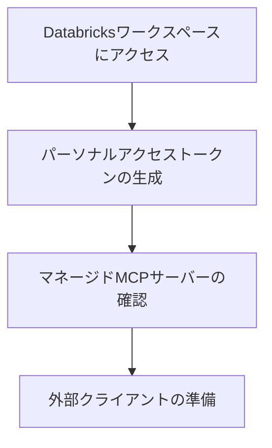

こちらの続きです。

https://qiita.com/taka_yayoi/items/1e790f430c1a2d4f9006

前回はローカルでMCPサーバーを動かしていました。

マニュアルを見ていたらこちらのページに気づきました。

https://docs.databricks.com/gcp/ja/generative-ai/mcp/connect-external-services

正直、マネージドMCPサーバーにClaudeからどう繋いだものかと悩んでいたの(単にリモートMCPサーバーへの接続方法がわかっていなかった)で助かりました。

CursorとClaude Desktopの例が記載されていますが、Claude Desktopで試してみます。

# Databricks MCPサーバーをClaude Desktopで活用する方法

Databricks MCPサーバーを外部の開発ツールやAIクライアントと連携させることで、データ分析とコード開発の効率が大幅に向上します。本記事では、Claude Desktopといった外部のMCPクライアントからDatabricksマネージドMCPサーバーに接続する具体的な設定方法を解説します。設定はJSON ファイルの編集だけで完了し、パーソナルアクセストークンを使用した安全な認証により、外部ツールから直接Databricksの機能を活用できるようになります。

## 機能概要

Databricks MCP (Model Context Protocol) サーバーは、外部のクライアントアプリケーションから Databricks のリソースや機能にアクセスできる仕組みです。この機能により以下のような連携が可能になります。

| 対応クライアント | 連携可能な機能 | 利用シーン |
|----------------|--------------|------------|
| Cursor | UC 関数の実行、データアクセス | コード開発時のリアルタイムデータ確認 |
| Claude Desktop | AI による分析支援、自動化 | 対話的なデータ分析とレポート生成 |
| その他 MCP 対応ツール | カスタム統合 | 独自ワークフローへの組み込み |

**重要な制約事項**
- Databricks で管理されている MCP サーバーのみが外部クライアントをサポート
- Databricks アプリでホストされているカスタム MCP サーバーは外部連携不可

# メリット、嬉しさ

## 開発効率の向上
普段使用している開発環境から直接Databricksのデータや機能にアクセスできるため、画面の切り替えや別のインターフェースでの操作が不要になります。

## シームレスな統合
JSON設定ファイルの編集だけで連携が完了し、複雑なセットアップ作業は必要ありません。

## 安全性の確保
パーソナルアクセストークン(PAT)による認証を使用することで、セキュアな接続が保証されます。

## 柔軟な活用方法
Unity Cataloの関数だけでなく、他のDatabricksマネージドMCPサーバーにも同様の設定で対応可能です。

DatabricksマネージドのリモートMCPサーバーでは、[Genie](https://docs.databricks.com/aws/ja/genie/)、Unity Catalogの関数、[Vector Search](https://docs.databricks.com/aws/ja/generative-ai/vector-search)がサポートされています。

# 設定方法

## 準備



アクセス先のDatabricksワークスペースのホスト名と[パーソナルアクセストークン](https://docs.databricks.com/gcp/ja/dev-tools/auth/pat)をコピーしておきます。

`claude_desktop_config.json`を編集していきます。

## Genie

アクセスするGenieスペースのスペースIDを以下に埋め込みます。

```json
{
  "mcpServers": {
    "uc-genie-mcp": {
      "command": "npx",
      "args": [
        "mcp-remote",
        "https://<ワークスペースホスト名>/api/2.0/mcp/genie/<GenieスペースID>",
        "--header",
        "Authorization: Bearer <パーソナルアクセストークン>"
      ]
    }
  } 
}
```

Claude Desktopを起動して当該MCPサーバーが**running**になっていることを確認します。


MCPサーバーを呼び出すような質問をすると、MCPサーバーが呼び出されるので許可します。


問題なく動きます。


アーティファクトも作れます。


## Unity Catalogの関数

今回は、ビルトインされている[コードインタープリターAIエージェントツール](https://docs.databricks.com/gcp/ja/generative-ai/agent-framework/code-interpreter-tools)を使います。

```json
{
  "mcpServers": {
    "uc-function-mcp": {
      "command": "npx",
      "args": [
        "mcp-remote",
        "https://<ワークスペースホスト名>/api/2.0/mcp/functions/system/ai",
        "--header",
        "Authorization: Bearer <パーソナルアクセストークン>"
      ]
    }
  } 
}
```


こちらも動きました。


## Vector Search

作成済みのベクトル検索インデックスを格納しているカタログとスキーマをメモしておきます。以下の例では、カタログは`takaakiyayoi_catalog`、スキーマは`vector_search`です。

```json
{
  "mcpServers": {
    "uc-function-mcp": {
      "command": "npx",
      "args": [
        "mcp-remote",
        "https://<ワークスペースホスト名>/api/2.0/vector-search/takaakiyayoi_catalog/vector_search",
        "--header",
        "Authorization: Bearer <パーソナルアクセストークン>"
      ]
    }
  } 
}
```

ここまでで、3つのMCPサーバーが登録されている状態です。


これは、お手軽にRAGを組めるということですね。


# 注意点

## セキュリティ関連
- **アクセストークンの管理**: 個人用アクセストークンは機密情報です。設定ファイルのアクセス権限を適切に設定し、バージョン管理システムにコミットしないよう注意してください
- **トークンの定期更新**: セキュリティ向上のため、定期的にトークンを更新することを推奨します

## 技術的制約
- **対応サーバーの限定**: Databricks AppsでホストされているカスタムMCPサーバーは外部クライアントと連携できません
- **ネットワーク要件**: 外部クライアントからDatabricksワークスペースへのネットワーク接続が必要です

## 設定時の注意
- **URLの正確性**: ワークスペースのホスト名、カタログ名、スキーマ名を正確に指定してください
- **JSON形式**: 設定ファイルのJSON形式が正しいことを確認し、構文エラーがないようにしてください
- **再起動の必要性**: 設定変更後は必ずクライアントアプリケーションを再起動してください

## まとめ

Databricks MCPサーバーと外部クライアントの連携により、開発環境とデータ分析プラットフォームの境界がなくなり、より効率的なワークフローを実現できます。Cursorでの開発時にリアルタイムでデータを確認したり、Claude Desktopで対話的な分析を行ったりと、用途に応じて柔軟に活用できる点が大きな魅力です。

設定自体はJSONファイルの編集だけで完了するため、技術的なハードルは低く抑えられています。ただし、セキュリティ面での配慮とDatabricks管理のMCPサーバーという制約を理解した上で導入することが重要です。

適切に設定することで、データドリブンな開発やAI支援による分析作業の効率が大幅に向上し、より価値の高いアウトプットの創出につながるでしょう。


### はじめてのDatabricks

[はじめてのDatabricks](https://qiita.com/taka_yayoi/items/8dc72d083edb879a5e5d)

### Databricks無料トライアル

[Databricks無料トライアル](https://databricks.com/jp/try-databricks)
