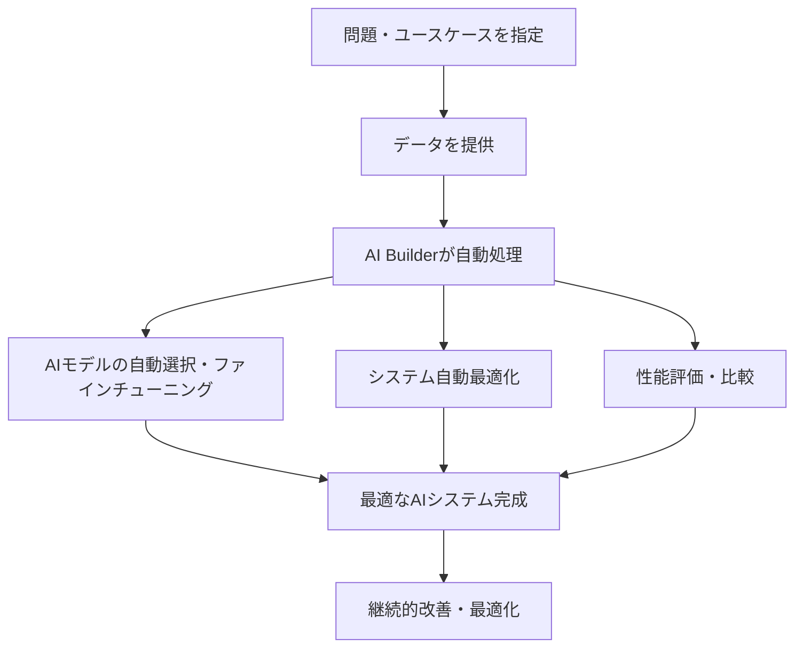

こちらの機能です。

https://docs.databricks.com/aws/ja/generative-ai/ai-builder/knowledge-assistant

:::note info
**注意**
執筆時点では[ベータ版](https://docs.databricks.com/aws/ja/release-notes/release-types)です。
:::

# AI Builderとは

**AI Builder**は、Databricks上で**ノーコード/ローコード**により**生成AIアプリを簡単に構築できる開発フレームワーク**です。

https://docs.databricks.com/aws/ja/generative-ai/ai-builder/

#### 🔧 AI Builderの動作メカニズム

問題に合わせた生成AIアプリをノーコードで構築することができます。現時点では、以下の問題タイプをサポートしています。

#### 📊 現在サポートされているユースケース

| ユースケース | 説明 | 適用例 |
|-------------|------|--------|
| **📄 ドキュメント構造化** | ラベルなしテキストを構造化テーブルに変換 | 契約書、レポートの自動データ化 |
| **✍️ カスタムテキスト生成** | 要約、分類、テキスト変換タスク | 文書要約、カテゴリ分類 |
| **💬 チャットボット構築** | ドキュメントベースの高品質Q&Aシステム | 社内FAQ、顧客サポート |

今回、3つ目の**チャットボット構築**が追加されました。

# ナレッジアシスタントの構築

[マニュアル](https://docs.databricks.com/aws/ja/generative-ai/ai-builder/knowledge-assistant)に従って構築してみます。

事前にRAGで使用するドキュメントを準備します。ボリュームにtxt、pdf、md、ppt/pptx、doc/docxを格納しておくか、ベクトル検索インデックスを準備しておきます。今回はボリュームにWordファイルをアップロードしておきます。これらは、[データブリックス クイックスタートガイド](https://www.amazon.co.jp/%E3%83%87%E3%83%BC%E3%82%BF%E3%83%96%E3%83%AA%E3%83%83%E3%82%AF%E3%82%B9-%E3%82%AF%E3%82%A4%E3%83%83%E3%82%AF%E3%82%B9%E3%82%BF%E3%83%BC%E3%83%88%E3%82%AC%E3%82%A4%E3%83%89-%E3%83%87%E3%83%BC%E3%82%BF%E3%83%96%E3%83%AA%E3%83%83%E3%82%AF%E3%82%B9%E3%83%BB%E3%82%B8%E3%83%A3%E3%83%91%E3%83%B3/dp/B09TWXN35R)の原稿です。

サイドメニューの**AI Builder**にアクセスすると、**ナレッジアシスタント**が追加されていますのでクリックします。

名前や説明文、アシスタントの構築に伴って生成されるテーブルやボリュームを格納するスキーマを指定し、**ナレッジソース**で、RAGで使用するドキュメントを指定します。**UCファイル**を選択し、ドキュメントを保存したボリュームパスを指定します。

エージェントの指示を指定したら、**エージェントを作成**をクリックします。

構築がスタートします。

数分すると、エンドポイントやナレッジソースの準備が整います。

**Playgroundで試す**をクリックします。問い合わせしてみます。

動きました！きちんと情報ソースも表示されています。

トレースも確認できます。

# 生成物

画面からわかるようにモデルサービングエンドポイントが作成されています。

また、エージェント設定時に指定したスキーマにアクセスすると、生のWordファイルからベクトル検索インデックスが作成されていることがわかります。

パースやチャンキングもされています。

リネージはこのようになっています。

お手軽にRAGを構築できるのはいいですね。

### はじめてのDatabricks

[はじめてのDatabricks](https://qiita.com/taka_yayoi/items/8dc72d083edb879a5e5d)

### Databricks無料トライアル

[Databricks無料トライアル](https://databricks.com/jp/try-databricks)
