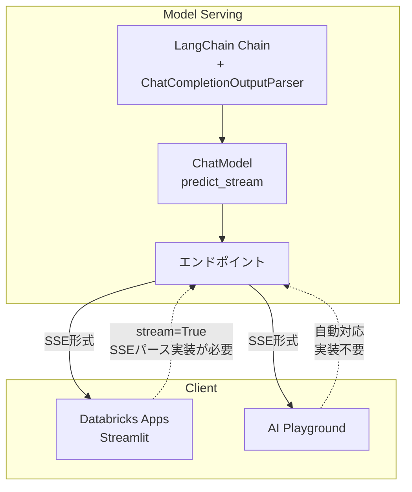

前回の記事「[どうやったらDatabricks上でRAGがストリーミングしてくれるのか](https://qiita.com/taka_yayoi/items/6e9a588e69f87feef564)」では、LangChain ベースの RAG を `ChatModel` 形式でラップして Model Serving にデプロイし、Playground からストリーミング利用する方法を紹介しました。

本記事では、その続きとして **Databricks Apps(Streamlit)をフロントエンドとしてストリーミング呼び出しする方法**と注意点をまとめます。

# エンドポイント側の要件

Streamlit からストリーミングで呼び出すには、エンドポイント側が **ChatCompletion 形式のストリーミングレスポンス**を返す必要があります。

前回の記事で紹介した通り、LangChain チェーンを `ChatModel` でラップし、以下を実装します:

- `predict_stream` メソッド
- `ChatCompletionOutputParser` による出力変換

# エンドポイント作成の完全なコード

以下のノートブックを Databricks で実行してエンドポイントを作成します。

```python
%pip install mlflow databricks-langchain langchain langchain-core langchain-community langchain-text-splitters faiss-cpu pyyaml --quiet
dbutils.library.restartPython()
```

```python
import os

WORKSPACE_PATH = "/Workspace/Users/your-user/streaming_rag"
CATALOG = "your_catalog"
SCHEMA = "your_schema"
MODEL_NAME = f"{CATALOG}.{SCHEMA}.rag_agent"
ENDPOINT_NAME = "rag-agent-streaming"
LLM_ENDPOINT = "databricks-meta-llama-3-3-70b-instruct"
EMBEDDING_ENDPOINT = "databricks-bge-large-en"

os.makedirs(WORKSPACE_PATH, exist_ok=True)
```

```python
# エージェント定義ファイル作成
AGENT_CODE = '''
import mlflow
from mlflow.pyfunc import ChatModel
from mlflow.types.llm import ChatMessage, ChatParams, ChatCompletionResponse, ChatCompletionChunk
from mlflow.langchain.output_parsers import ChatCompletionOutputParser
from databricks_langchain import ChatDatabricks, DatabricksEmbeddings
from langchain_text_splitters import RecursiveCharacterTextSplitter
from langchain_community.vectorstores import FAISS
from langchain_core.prompts import ChatPromptTemplate
from langchain_core.runnables import RunnablePassthrough
from typing import List, Generator

mlflow.langchain.autolog()

config = mlflow.models.ModelConfig(development_config="agent_config.yaml")

LLM_ENDPOINT = config.get("llm_endpoint")
EMBEDDING_ENDPOINT = config.get("embedding_endpoint")
MAX_TOKENS = config.get("max_tokens")
RETRIEVER_K = config.get("retriever_k")

DOCUMENTS = [
    "Databricks は、データエンジニアリング、データサイエンス、機械学習のための統合プラットフォームです。",
    "Unity Catalog は Databricks のデータガバナンスソリューションです。",
    "MLflow は機械学習のライフサイクル管理ツールです。",
    "Delta Lake はオープンソースのストレージレイヤーです。",
]

embeddings = DatabricksEmbeddings(endpoint=EMBEDDING_ENDPOINT)
text_splitter = RecursiveCharacterTextSplitter(chunk_size=200, chunk_overlap=50)
splits = text_splitter.create_documents(DOCUMENTS)
vectorstore = FAISS.from_documents(splits, embeddings)
retriever = vectorstore.as_retriever(search_kwargs={"k": RETRIEVER_K})

llm = ChatDatabricks(endpoint=LLM_ENDPOINT, max_tokens=MAX_TOKENS)

prompt = ChatPromptTemplate.from_template("""
コンテキスト:
{context}

質問: {question}

回答:
""")

def format_docs(docs):
    return "\\n\\n".join(doc.page_content for doc in docs)

chain = (
    {"context": retriever | format_docs, "question": RunnablePassthrough()}
    | prompt
    | llm
    | ChatCompletionOutputParser()
)

class RAGAgent(ChatModel):
    def __init__(self):
        self.chain = chain
    
    def _get_question(self, messages: List[ChatMessage]) -> str:
        for msg in reversed(messages):
            if msg.role == "user":
                return msg.content
        return ""
    
    def predict(self, context, messages: List[ChatMessage], params: ChatParams) -> ChatCompletionResponse:
        question = self._get_question(messages)
        response = self.chain.invoke(question)
        return ChatCompletionResponse.from_dict(response)
    
    def predict_stream(self, context, messages: List[ChatMessage], params: ChatParams) -> Generator[ChatCompletionChunk, None, None]:
        question = self._get_question(messages)
        for chunk in self.chain.stream(question):
            yield ChatCompletionChunk.from_dict(chunk)

mlflow.models.set_model(RAGAgent())
'''

agent_path = f"{WORKSPACE_PATH}/rag_agent.py"
with open(agent_path, "w") as f:
    f.write(AGENT_CODE)

CONFIG_YAML = f'''
llm_endpoint: "{LLM_ENDPOINT}"
embedding_endpoint: "{EMBEDDING_ENDPOINT}"
max_tokens: 500
retriever_k: 3
'''

config_path = f"{WORKSPACE_PATH}/agent_config.yaml"
with open(config_path, "w") as f:
    f.write(CONFIG_YAML)
```

```python
# モデルログ
import mlflow
from mlflow.models.resources import DatabricksServingEndpoint

mlflow.set_registry_uri("databricks-uc")

input_example = {"messages": [{"role": "user", "content": "MLflow について教えてください"}]}

with mlflow.start_run(run_name="rag_agent") as run:
    model_info = mlflow.pyfunc.log_model(
        python_model=agent_path,
        artifact_path="agent",
        model_config=config_path,
        input_example=input_example,
        pip_requirements=[
            "mlflow", "databricks-langchain", "langchain", "langchain-core",
            "langchain-community", "langchain-text-splitters", "faiss-cpu", "pyyaml",
        ],
        resources=[
            DatabricksServingEndpoint(endpoint_name=LLM_ENDPOINT),
            DatabricksServingEndpoint(endpoint_name=EMBEDDING_ENDPOINT),
        ],
        registered_model_name=MODEL_NAME,
    )
    print(f"Model URI: {model_info.model_uri}")
```

```python
# エンドポイント作成
from databricks.sdk import WorkspaceClient
from databricks.sdk.service.serving import EndpointCoreConfigInput, ServedEntityInput
from mlflow import MlflowClient

w = WorkspaceClient()
mlflow_client = MlflowClient()

model_versions = mlflow_client.search_model_versions(f"name='{MODEL_NAME}'")
latest_version = max(model_versions, key=lambda x: int(x.version)).version

config = EndpointCoreConfigInput(
    name=ENDPOINT_NAME,
    served_entities=[
        ServedEntityInput(
            entity_name=MODEL_NAME,
            entity_version=str(latest_version),
            workload_size="Small",
            scale_to_zero_enabled=True,
        )
    ],
)

try:
    w.serving_endpoints.get(ENDPOINT_NAME)
    w.serving_endpoints.update_config(ENDPOINT_NAME, served_entities=config.served_entities)
except:
    w.serving_endpoints.create(name=ENDPOINT_NAME, config=config)
```


# Streamlit 側の実装

## リクエスト

`stream=True` を payload と `requests.post()` の両方に指定します:

```python
payload = {
    "messages": [{"role": "user", "content": prompt}],
    "stream": True
}

with requests.post(url, headers=headers, json=payload, stream=True) as response:
    ...
```

## SSE レスポンスのパース

Model Serving のストリーミングレスポンスは Server-Sent Events(SSE)形式です。各行が `data: {JSON}` の形式で返されます:

```python
for line in response.iter_lines():
    if line:
        line_str = line.decode("utf-8")
        if line_str.startswith("data: "):
            data_str = line_str[6:]  # "data: " を除去
            if data_str == "[DONE]":
                break
            data = json.loads(data_str)
            content = data.get("choices", [{}])[0].get("delta", {}).get("content", "")
            if content:
                yield content
```

## st.write_stream() で表示

Streamlit の `st.write_stream()` にジェネレータを渡すと、トークンが順次表示されます:

```python
with st.chat_message("assistant"):
    response = st.write_stream(stream_response(prompt))
```

アプリを作成する際、エンドポイントをリソースとして設定します。


# 完全なサンプルコード

**app.py**
```python
import streamlit as st
import requests
import json
import os
from databricks.sdk import WorkspaceClient

ENDPOINT_NAME = os.environ.get("ENDPOINT_NAME", "rag-agent-streaming")

def stream_response(prompt: str):
    w = WorkspaceClient()
    
    host = w.config.host
    if not host.startswith("https://"):
        host = f"https://{host}"
    
    url = f"{host}/serving-endpoints/{ENDPOINT_NAME}/invocations"
    
    headers = w.config.authenticate()
    headers["Content-Type"] = "application/json"
    
    payload = {"messages": [{"role": "user", "content": prompt}], "stream": True}
    
    with requests.post(url, headers=headers, json=payload, stream=True) as response:
        if response.status_code != 200:
            yield f"エラー: {response.status_code} - {response.text}"
            return
        
        for line in response.iter_lines():
            if line:
                line_str = line.decode("utf-8")
                if line_str.startswith("data: "):
                    data_str = line_str[6:]
                    if data_str == "[DONE]":
                        break
                    try:
                        data = json.loads(data_str)
                        content = data.get("choices", [{}])[0].get("delta", {}).get("content", "")
                        if content:
                            yield content
                    except:
                        pass

st.title("RAG Streaming Demo")

if "messages" not in st.session_state:
    st.session_state.messages = []

for message in st.session_state.messages:
    with st.chat_message(message["role"]):
        st.write(message["content"])

if prompt := st.chat_input("質問を入力してください"):
    st.session_state.messages.append({"role": "user", "content": prompt})
    with st.chat_message("user"):
        st.write(prompt)
    
    with st.chat_message("assistant"):
        response = st.write_stream(stream_response(prompt))
        st.session_state.messages.append({"role": "assistant", "content": response})
```

**app.yaml**
```yaml
command:
  - streamlit
  - run
  - app.py

env:
  - name: ENDPOINT_NAME
    value: "your-endpoint-name"
  - name: DATABRICKS_HOST
    value: "https://your-workspace.cloud.databricks.com"
```

**requirements.txt**
```
streamlit
requests
databricks-sdk
```

Appでもストリーミングされました。


# まとめ



| クライアント | ストリーミング対応 | 必要な実装 |
|-------------|------------------|-----------|
| AI Playground | 自動 | なし(エンドポイントが`predict_stream`を実装していれば動作) |
| Databricks Apps (Streamlit) | 手動 | `stream=True`の指定、SSEパース、`st.write_stream()` |

| 層 | 要件 |
|------|--------|
| エンドポイント | `ChatModel` の `predict_stream` + `ChatCompletionOutputParser` |
| リクエスト | `stream=True` を payload と requests 両方に指定 |
| レスポンス | SSE 形式をパースして `delta.content` を抽出 |
| 表示 | `st.write_stream()` にジェネレータを渡す |


### はじめてのDatabricks

[はじめてのDatabricks](https://qiita.com/taka_yayoi/items/8dc72d083edb879a5e5d)

### Databricks無料トライアル

[Databricks無料トライアル](https://databricks.com/jp/try-databricks)
