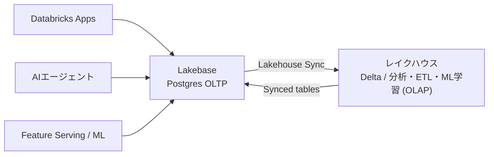
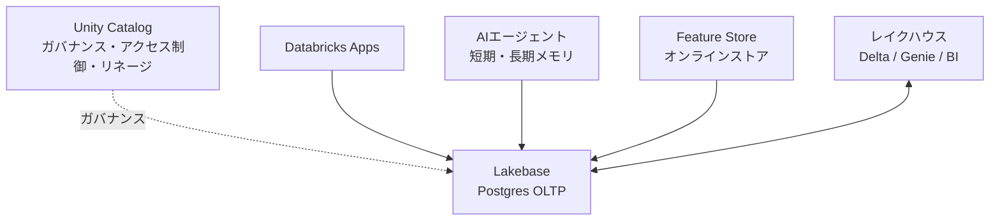

# 東京リージョン対応で何が変わるのか

2026年6月30日、Lakebase Autoscaling が AWS 東京リージョン (ap-northeast-1 / Asia Pacific - Tokyo) で利用可能になりました ([2026年6月のリリースノート](https://docs.databricks.com/aws/ja/release-notes/product/2026/june))。地味に聞こえるかもしれませんが、国内で本番運用を考える立場からするとインパクトの大きいアップデートです。

これまで Lakebase は日本リージョン未対応で、検証には AWS US リージョンのワークスペースを使う必要がありました。東京リージョンに来たことで、データレジデンシーの要件がある業務でも使いやすくなり、アプリケーションやエージェントからの読み書きレイテンシの面でも国内完結の構成が組めるようになります。

このタイミングで、改めて「Lakebase とは何か」「Databricks の中でどこに位置するのか」「他のコンポーネントとどう関係するのか」を整理しておきます。実際に手を動かす前の全体像として読んでください。手を動かす際の入口は[Postgresデータベースを取得する](https://docs.databricks.com/aws/ja/oltp/projects/get-started)がわかりやすいです。

# 改めて、Lakebase とは

[Lakebase](https://docs.databricks.com/aws/ja/oltp/projects) は、Databricks Data Intelligence Platform に統合された、フルマネージドの Postgres OLTP (オンライントランザクション処理) データベースです。

ポイントは「OLTP」であることです。Databricks の主戦場であるレイクハウスは、大量データの分析・集計・ML 学習といった OLAP (オンライン分析処理) が得意な一方、1件ずつの低レイテンシな読み書き、つまりアプリケーションやエージェントが必要とするトランザクション処理は苦手でした。Lakebase はこの OLTP の役割を、使い慣れた Postgres 互換のインターフェースで、しかもプラットフォームに統合された形で埋めるものです。

現行の Lakebase Autoscaling は、2026年3月12日以降に作成される新規インスタンスのデフォルトになっており、既存の Provisioned インスタンスも順次 Autoscaling へアップグレードされています。主な特徴は次のとおりです。

- コンピュートとストレージの分離: それぞれを独立してスケールでき、コスト効率が高い
- オートスケーリングと scale-to-zero: 負荷に応じて自動調整し、アイドル時はゼロまで縮退してコストを抑える
- ブランチング (copy-on-write): 本番のコピーを丸ごと作らず、変更差分だけで隔離環境を瞬時に作れる
- インスタントリストア / PITR: 履歴ウィンドウ内の任意の時点にブランチ作成・復元できる

開発・検証はブランチで隔離し、落ち着いたら scale-to-zero でコストを下げる、という運用が素直にできるのが Autoscaling の使いどころです。

# Databricks における位置付け

Lakebase を一言で言うと「レイクハウス (OLAP) の隣に置く、運用系の OLTP データベース」です。分析基盤とアプリケーション基盤を別々のシステムで管理していた従来構成に対し、Lakebase は両者を同じプラットフォーム上に置き、データを双方向にやり取りできるようにします。

データの流れは2方向あります。Synced tables は、Unity Catalog のテーブルを Lakebase 側へ取り込み、アプリケーションが低レイテンシで参照できるようにします。逆に Lakehouse Sync は、Lakebase 上の OLTP アプリのデータをレイクハウスへ戻し、分析や下流のパイプラインで使えるようにします。ETL やレプリカを別途組まなくても、運用データと分析データが地続きになるのがこの構成の狙いです。

# 他のコンポーネントとの関係性

Lakebase は単体で使うより、Databricks の他のコンポーネントと組み合わせて効いてきます。主な関係を整理します。

Unity Catalog は、Lakebase と同じプラットフォーム上のガバナンス層です。テーブルの同期やアクセス制御を通じて、運用データにもレイクハウスと同じガバナンスの傘をかけられます。

Databricks Apps は、Lakebase をバックエンドの永続ストアとして使う代表的な利用先です。アプリのリソースとして Lakebase プロジェクトを追加すれば、アプリの状態やデータを Postgres に保持できます。

Feature Store のオンラインストアは、Lakebase を前提とします。学習済み特徴量を低レイテンシでサービングするオンライン経路は、内部で Lakebase Autoscaling インスタンスを作成して実現されます。

AI エージェントの状態ストアも重要な用途です。LLM はステートレスなので、会話やワークフローの状態をリクエストをまたいで保持するには外部の永続ストアが要ります。Lakebase はこの「エージェントのメモリ」のバックエンドとして相性が良く、短期メモリ (会話セッション内の文脈) から長期メモリ (セッションを跨ぐ知見) までを Postgres 上でまかなえます。

# エージェントメモリとの関係 (概要)

Databricks の[エージェントメモリ](https://docs.databricks.com/aws/ja/agents/agent-framework/stateful-agents)には2つのアプローチがあります。Databricks が Unity Catalog 上でインフラを管理する[マネージドエージェントメモリ](https://docs.databricks.com/aws/ja/agents/agent-memory/managed-memory) (ベータ) と、Lakebase を自分の管理下で使う[セルフマネージド型エージェントメモリ](https://docs.databricks.com/aws/ja/agents/agent-memory/self-managed-memory)です。

ざっくり言えば、SQL への直接アクセスやカスタムスキーマが不要でガバナンス優先ならマネージド、メモリに直接 SQL でアクセスしたい・短期メモリも一元的に持ちたいならセルフマネージド (Lakebase)、という住み分けです。詳細な比較は別記事に譲りますが、東京リージョン対応で「セルフマネージド側の基盤である Lakebase が国内で使いやすくなった」という点は、エージェント開発の観点でも見逃せないポイントです。

# まとめと次のステップ

Lakebase は、レイクハウス (OLAP) の隣に置く運用系の Postgres OLTP データベースであり、Databricks Apps・Feature Store・AI エージェントといったアプリケーション層の永続ストアとしてプラットフォームに統合されています。東京リージョン対応により、これらの用途を国内完結の構成で本番に載せる道が開けました。

次回以降は、この全体像を踏まえて、Lakebase Autoscaling を東京リージョンで実際に作成し、エージェントのメモリストアとして動かすところまでを実践します。

Lakebase をメモリのバックエンドとして手組みで動かす流れは、以下の連載でも扱っています。あわせてどうぞ。

- [Lakebase × LangGraphでステートフルAIエージェント:Autoscaling対応版 (連載 第1回)](https://qiita.com/taka_yayoi/items/6d66759424c298ba7030)
- [Lakebase × LangGraph × Qwen3で作る、セッションを跨ぐ記憶を持つAIエージェント (連載 第2回)](https://qiita.com/taka_yayoi/items/c0da11faeb76b3233162)
- [ハーネスエンジニアリング入門:MLflow Tracing と LLM-as-a-Judge でAIエージェントを育てる (連載 第3回)](https://qiita.com/taka_yayoi/items/7d9323474bb8a9637c4b)

### はじめてのDatabricks

[はじめてのDatabricks](https://qiita.com/taka_yayoi/items/8dc72d083edb879a5e5d)

### Databricks無料トライアル

[Databricks無料トライアル](https://databricks.com/jp/try-databricks)
