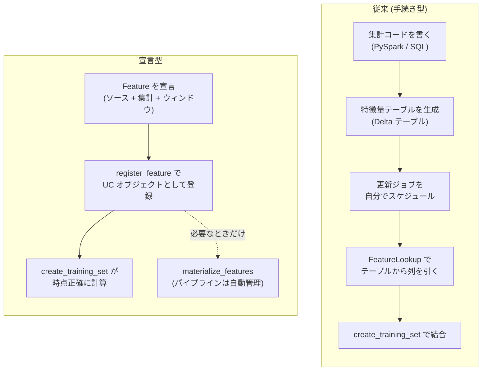
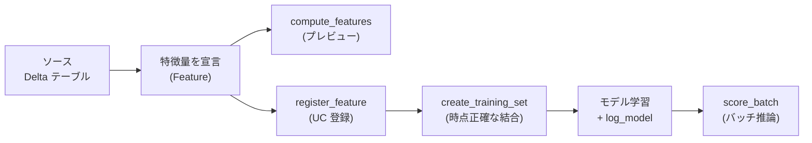

# はじめに

Databricks の Feature Store に「宣言型特徴量エンジニアリング (Declarative Feature Engineering)」という API が追加されました (本記事執筆時点ではベータ)。集計ロジックを自分で書かずに、特徴量の「定義」だけを宣言すると、計算・時点結合・テーブル化までをプラットフォームが引き受けてくれる仕組みです。

公式の[宣言的な特徴のクイックスタート](https://docs.databricks.com/aws/ja/machine-learning/feature-store/declarative-apis)を動かそうとしたところ、オンラインストアの作成でつまずきました。オンラインストアは Lakebase を前提とするため、今回は「宣言型特徴量とは何か」を理解することを目的に、オンライン機能を使わないオフライン経路だけで一通り動かすことにしました。

その過程で複数のエラーを踏みましたが、どれも宣言型特徴量の設計思想を理解するうえで示唆的なものでした。本記事では次の3点をまとめます。

- そもそも「宣言型」とは何で、従来の Feature Engineering と何が違うのか
- オフライン経路でのハンズオン (定義 → 登録 → 学習 → バッチ推論)
- 実際に踏んだハマりどころと回避方法

検証環境は Databricks Runtime 17.0 ML 以降、`databricks-feature-engineering>=0.15.0` です。

# 宣言型特徴量とは何か

## 一言でいうと

宣言型特徴量とは、特徴量の「定義 (何を計算したいか)」だけを書き、「計算の手続き (どう計算するか)」と「その実体化」をプラットフォームに任せる仕組みです。従来の Feature Engineering との違いは、突き詰めればこの一点に集約されます。

## 従来の Feature Engineering (手続き型)

従来のやり方では、特徴量とは実質的に「自分が作った特徴量テーブルの中の1列」でした。ワークフローはおおむね次の流れです。

1. PySpark や SQL で集計処理を自分で書く
2. 主キー付きの Delta テーブル (特徴量テーブル) を生成する
3. それを最新に保つジョブをスケジュールする
4. `FeatureLookup` で「このテーブルからこのキーでこの列を引く」と宣言する
5. `create_training_set` がその事前計算済みの値を結合する

つまり特徴量の存在は「自分が集計コードを実行してテーブルを作った」という事実と不可分でした。時点正確性 (point-in-time correctness) も自分の責任で、タイムスタンプキー付きの特徴量テーブルと正しい as-of 結合ロジックを自分で設計する必要がありました。

## 宣言型 Feature Engineering

宣言型では、特徴量は「ソース + 集計関数 + エンティティ + 時間ウィンドウ」という仕様オブジェクトであり、Unity Catalog の第一級オブジェクトとして登録されます。集計コードは一切書きません。

その1つの定義から、プラットフォームが次を引き受けます。

- `compute_features` でその場でプレビューする
- `create_training_set` で、宣言したウィンドウから時点正確な値を導出する
- 頼んだ場合にだけ `materialize_features` で LakeFlow パイプラインとテーブルを作成・管理する



## 何が変わったのか

切り口を整理すると、違いは次の4点に集約されます。

| 観点 | 従来 (手続き型) | 宣言型 |
| --- | --- | --- |
| 何を書くか | 変換コード (GROUP BY やウィンドウ関数) | 仕様オブジェクトのみ。集計コードは書かない |
| 定義と実体化 | テーブルが存在するから特徴量が存在する | 特徴量は定義として存在。マテリアライズなしでもプレビュー・学習できる |
| 時間の意味論 | as-of 結合を自分で作り込む | ウィンドウ種別が定義の一部。エンジンが時点正確性を保証 |
| 粒度・リネージ | テーブルの1列 | 名前とリネージを持つ UC オブジェクト |

特に「定義と実体化の分離」が体験的な核心です。従来は「テーブルが存在するから特徴量が存在する」でしたが、宣言型では特徴量は定義として存在し、何もマテリアライズせずにプレビューも学習もできます。`materialize_features` は独立した任意の最適化ステップで、実行するとパイプラインと更新の運用はプラットフォームが持ちます。

時間の意味論については、ローリング / タンブリング / スライディングの3種のウィンドウが `Feature` 定義の一部です。象徴的なのはローリングウィンドウで、時間的な忠実度が高いため、データポイントごとにオンザフライで生成され、マテリアライズできない仕様になっています。以前は自分で作り込んでいた時点正確性を、定義からエンジンが保証します。

## SQL とのアナロジー

この移行は、手書き ETL から宣言的パイプラインへの移行、あるいは手動のテーブルチューニングから Liquid Clustering への移行と同じ構図です。さらに根本的には、SQL のモデルを特徴量に適用したものと言えます。

SQL では欲しい結果を宣言し、オプティマイザがプランを決めます。宣言型特徴量は「`SELECT ... GROUP BY ... OVER window`」を、実行・運用するコードではなく、再利用可能でガバナンスされマテリアライズ可能なオブジェクトとして表現したものだと捉えると腑に落ちます。

# オフライン経路で動かす

## なぜオフラインか

宣言型特徴量には、特徴量をオンラインストアに具体化してリアルタイムサービングする経路もあります。ただし[オンライン特徴量ストア](https://docs.databricks.com/aws/ja/machine-learning/feature-store/online-feature-store)は Lakebase を前提とし、`create_online_store` は Lakebase Autoscaling インスタンスを作成します。

宣言型特徴量の中心的な概念 (宣言的な定義・時点正確性・学習と推論の整合性) は、オフライン経路だけで完全に確認できます。そこで本記事では、オンライン機能を使わず、ソーステーブルから計算される `DeltaTableSource` 特徴量だけで完結させます。



## セットアップ

**プレビュー**で**Feature Store Declarative Framework (Batch)** をオンにします。


宣言型特徴量はカスタムパッケージが必要です。ノートブックを実行するたびに次を実行します。

```python
%pip install databricks-feature-engineering>=0.15.0
dbutils.library.restartPython()
```

```python
from datetime import datetime, timedelta

import mlflow
from mlflow.tracking import MlflowClient
from sklearn.ensemble import RandomForestClassifier
from sklearn.model_selection import train_test_split
from sklearn.pipeline import Pipeline
from sklearn.impute import SimpleImputer

from databricks.feature_engineering import FeatureEngineeringClient
from databricks.feature_engineering.entities import (
    AggregationFunction, Avg, ColumnSelection, CronSchedule,
    DeltaTableSource, Feature, MaterializedFeaturePipelineScheduleState,
    OfflineStoreConfig, SlidingWindow, Sum, TumblingWindow,
)

CATALOG_NAME = "<catalog>"
SCHEMA_NAME = "features_quickstart"
TABLE_NAME = "transactions"
```

## ソースデータの準備

ソースとなるトランザクションテーブルを作成し、合成データを投入します (コードは省略。`user_id` / `transaction_time` / `amount` / `geo` を持つ Delta テーブルです)。

次に、学習用の観測データ (ラベル付きデータ) を `labeled_df` として用意します。ここで重要なのは、観測データに「エンティティ列・時系列列・ラベル列」だけを持たせることです。`create_training_set` は渡した DataFrame の全列を feature_spec に取り込むため、余計な列を入れると推論時の入力要件もその列を要求してしまいます (「ハマりどころ」で詳述)。

今回の `labeled_df` は次の3列だけで構成します。

| 列 | 役割 |
| --- | --- |
| `user_id` | エンティティ列 (集計の粒度) |
| `transaction_time` | 時系列列 (時点正確な結合の基準となるタイムスタンプ) |
| `target` | ラベル列 (モデルの予測対象) |

特徴量となる列 (例: 平均取引額) は観測データには持たせません。特徴量はあくまで定義側からソーステーブルを計算して得るものだからです。コードでは、この3列だけのスキーマを明示して DataFrame を作ります。

```python
from pyspark.sql.types import (
    StructType, StructField, StringType, TimestampType, IntegerType,
)

# 観測データのスキーマ: 特徴量となる列は持たせない
labeled_schema = StructType([
    StructField("user_id", StringType(), False),
    StructField("transaction_time", TimestampType(), False),
    StructField("target", IntegerType(), False),
])

# labeled_data は上記3列を持つ行の dict のリスト (合成データの生成ループは省略)
labeled_df = spark.createDataFrame(labeled_data, schema=labeled_schema)
```


## 特徴量を宣言的に定義する

ここが宣言型特徴量の中心です。集計の手続きは1行も書かず、「ソース + 集計関数 + ウィンドウ」を宣言します。この時点では計算もテーブル作成も行われません。

```python
source = DeltaTableSource(
    catalog_name=CATALOG_NAME,
    schema_name=SCHEMA_NAME,
    table_name=TABLE_NAME,
)

# 集計特徴量: 30日タンブリングウィンドウでの平均取引額
avg_feature = Feature(
    source=source,
    entity=["user_id"],
    timeseries_column="transaction_time",
    function=AggregationFunction(
        Avg(input="amount"),
        TumblingWindow(window_duration=timedelta(days=30)),
    ),
    name="avg_transaction_30d",
)

# ColumnSelection: エンティティごとの geo の最新値 (集計なし)
latest_geo = Feature(
    source=source,
    function=ColumnSelection("geo"),
    entity=["user_id"],
    timeseries_column="transaction_time",
    name="latest_geo",
)

# 集計特徴量: 7日ウィンドウ・1日スライドでの取引額合計
sum_feature = Feature(
    source=source,
    entity=["user_id"],
    timeseries_column="transaction_time",
    function=AggregationFunction(
        Sum(input="amount"),
        SlidingWindow(
            window_duration=timedelta(days=7),
            slide_duration=timedelta(days=1),
        ),
    ),
    # name を省略すると amount_sum_sliding_7d_1d が自動生成される
)

fe = FeatureEngineeringClient()
```

集計関数 (`Avg` / `Sum` など) は `AggregationFunction` でウィンドウとともに包みます。`ColumnSelection` は集計なしで列の最新値を選ぶパススルーで、`function` に直接渡します。サポートされる関数やウィンドウの詳細は[宣言型機能の API リファレンス](https://docs.databricks.com/aws/ja/machine-learning/feature-store/declarative-api-reference)を参照してください。

## compute_features で確認する

登録前でも、定義した特徴量をその場で計算してプレビューできます。「マテリアライズされたテーブルがゼロの状態で特徴量を扱える」というのが、手続き型では原理的に不可能だった宣言型ならではの体験です。

```python
feature_df = fe.compute_features(features=[avg_feature, latest_geo, sum_feature])
feature_df.display()
```


## Unity Catalog に登録する

`register_feature` で特徴量を UC オブジェクトとして永続化します。一度登録した特徴量を再実行すると「すでに存在する」エラーになるため、冪等なヘルパーにしておくと再実行で安定します。

```python
from databricks.sdk.errors import AlreadyExists, ResourceAlreadyExists


def register_or_get(feature):
    """登録済みなら get_feature で取得する冪等ヘルパー"""
    full_name = f"{CATALOG_NAME}.{SCHEMA_NAME}.{feature.name}"
    try:
        return fe.register_feature(
            feature=feature,
            catalog_name=CATALOG_NAME,
            schema_name=SCHEMA_NAME,
        )
    except (AlreadyExists, ResourceAlreadyExists):
        return fe.get_feature(full_name=full_name)


avg_feature = register_or_get(avg_feature)
latest_geo = register_or_get(latest_geo)
sum_feature = register_or_get(sum_feature)

# latest_geo は文字列特徴量のため学習からは除外し、集計特徴量のみを使う
training_features = [avg_feature, sum_feature]
```

登録された特徴量は、Unity Catalog のオブジェクトとして格納されます。Catalog Explorer で特徴量を開くと、その定義が YAML 仕様として確認できます。Python の `Feature(...)` はあくまでオーサリングの入口で、`register_feature` の時点で言語非依存の宣言的仕様に変換され永続化される、という構図です。例えば `SlidingWindow(window_duration=timedelta(days=7), slide_duration=timedelta(days=1))` は、YAML 上では `type: SlidingWindow` と `window_duration.seconds: 604800` / `slide_duration.seconds: 86400` として表現されます。学習後に Catalog Explorer でモデルのデータリネージを開くと、各特徴量がソースアセットとともにモデルへの依存関係として表示され、自動的に追跡されます。


## トレーニングセットの作成

`create_training_set` は、観測データの各行のタイムスタンプ時点で特徴量を計算して結合します。これにより未来データの漏洩を防ぎます (時点正確性)。

ここで `exclude_columns` を指定するのが重要です。エンティティ列 `user_id` と時系列列 `transaction_time` は特徴量の計算には必要ですが、モデルの入力特徴量そのものではありません。除外しないと推論時にモデルへ渡されてしまいます。

```python
training_set = fe.create_training_set(
    df=labeled_df,
    features=training_features,
    label="target",
    exclude_columns=["user_id", "transaction_time"],
)

training_set.load_df().display()
```


## モデルの学習

学習で守るべきルールが2つあります。

1つ目は、モデルは `load_df()` が返す DataFrame からラベル列だけを除いたもので学習することです。列を手で選び直すと、推論時に `score_batch` が渡す列構成と一致せず失敗します。これは[宣言型機能を使ったトレーニング](https://docs.databricks.com/aws/ja/machine-learning/feature-store/train-with-declarative-features)でも明記されている規約です。

2つ目は、集計特徴量はウィンドウ内に履歴が無い行で `null` になるため、欠損値補完をモデルのパイプラインに組み込むことです。`score_batch` は推論時に手作業の前処理を行わないので、補完をモデルに含めて学習時と推論時で同じ前処理が適用されるようにします。

```python
with mlflow.start_run():
    training_df = training_set.load_df()
    training_pdf = training_df.toPandas()

    # load_df() の出力からラベル列だけを除いたものが、そのままモデルの入力
    X = training_pdf.drop(columns=["target"])
    y = training_pdf["target"]

    X_train, X_test, y_train, y_test = train_test_split(
        X, y, test_size=0.2, random_state=42, stratify=y
    )

    # 欠損値補完 + 分類器をパイプライン化してまとめてログする
    model = Pipeline([
        ("imputer", SimpleImputer(strategy="constant", fill_value=0)),
        ("clf", RandomForestClassifier(
            n_estimators=100, max_depth=10, class_weight="balanced",
            random_state=42,
        )),
    ])
    model.fit(X_train, y_train)

    fe.log_model(
        model=model,
        artifact_path="recommendation_model",
        flavor=mlflow.sklearn,
        training_set=training_set,
        registered_model_name=f"{CATALOG_NAME}.{SCHEMA_NAME}.recommendation_model",
    )

# このノートブックで学習したバージョンを固定する
mlflow.set_registry_uri("databricks-uc")
MODEL_NAME = f"{CATALOG_NAME}.{SCHEMA_NAME}.recommendation_model"
MODEL_VERSION = max(
    int(mv.version)
    for mv in MlflowClient().search_model_versions(f"name='{MODEL_NAME}'")
)
```

`fe.log_model` はモデルに特徴量メタデータを同梱します。これにより、次の `score_batch` が同じ特徴量を自動的に再計算できます。


データリネージの画面。宣言型特徴量 `amount_sum_sliding_7d_1d` と `avg_transaction_30d` が UC の「関数」 (`fx` アイコン、`SUM:BIGINT` / `AVG:DOUBLE` の型バッジ付き) として表示され、生成元のソースアセットとともに `recommendation_model` (Version 1) へ依存関係が伸びています。宣言型特徴量の定義が UC 関数として格納され、特徴量・ソースからモデルへのリネージが自動追跡されていることがわかります。

## score_batch でバッチ推論

`score_batch` はオフラインのバッチ推論を行います。モデルに同梱された特徴量メタデータを使い、入力 DataFrame のエンティティ列と時系列列から、学習時とまったく同じ特徴量を時点正確に再計算します。

入力 DataFrame にはエンティティ列と時系列列だけがあれば十分です。集計特徴量はソーステーブルから自動的に計算されます。

```python
inference_df = labeled_df.select("user_id", "transaction_time").limit(100)

model_uri = f"models:/{MODEL_NAME}/{MODEL_VERSION}"

predictions = fe.score_batch(
    model_uri=model_uri,
    df=inference_df,
)
predictions.display()
```


## (オプション) オフラインマテリアライズ

特徴量を毎回計算する代わりに、オフラインの Delta テーブルに事前計算 (マテリアライズ) して再利用できます。`materialize_features` は LakeFlow のパイプラインを作成し、指定スケジュールで特徴量テーブルを更新します。実行するとバックグラウンドのパイプラインが作られて課金が続くため、検証後は片付けてください。

```python
materialized = fe.materialize_features(
    features=[avg_feature, sum_feature],
    offline_config=OfflineStoreConfig(
        catalog_name=CATALOG_NAME,
        schema_name=SCHEMA_NAME,
        table_name_prefix="customer_features",
    ),
    trigger=CronSchedule(
        quartz_cron_expression="0 0 * * * ?",  # 毎時
        timezone_id="UTC",
        pipeline_schedule_state=MaterializedFeaturePipelineScheduleState.ACTIVE,
    ),
)
```

詳細は[宣言的な機能を具体化する](https://docs.databricks.com/aws/ja/machine-learning/feature-store/materialized-features)を参照してください。

# ハマりどころ

ここからが実用的なところです。オフライン経路で踏んだエラーを、症状・原因・回避方法でまとめます。declarative features はベータのため、実環境で動かして初めて表面化するものが多くありました。

## オンラインストアの作成には Lakebase が必要

`create_online_store` はオンライン特徴量ストア、すなわち Lakebase Autoscaling インスタンスを作成します。Lakebase が使えない環境では作成時に失敗します。学習・検証だけが目的なら、本記事のようにオフライン経路 (`DeltaTableSource` 特徴量 + `score_batch`) で完結させるのが手早いです。オンライン提供が必要になった段階で、オンラインストアと `materialize_features` の `online_config` を追加すれば、同じ特徴量定義をそのまま拡張できます。

## RequestSource 特徴量は score_batch と相性が悪い

`RequestSource` は推論リクエスト時に渡される値を表す特徴量です。最初はこれを含めていましたが、`score_batch` で次のエラーになりました。

```
ValueError: The feature names should match those that were passed during fit.
Feature names unseen at fit time: amount_0, amount_1, user_age_0, user_age_1, ...
```

`RequestSource` 特徴量は、API 上「特徴量名を `ColumnSelection` の列名と一致させる」ことが強制されます。

```
ValueError: For a RequestSource feature, the feature name must equal
the ColumnSelection column name.
```

つまり特徴量名は必ず入力列名と同じになり、`score_batch` が組み立てる DataFrame の中で生の入力列と必ず重複します。`RequestSource` はリアルタイムのモデルサービングエンドポイント向けの仕組みで、`score_batch` のオフラインバッチ推論とは構造的に相性が悪い、というのが結論です。オフライン経路では `RequestSource` を使わず、`DeltaTableSource` 特徴量に寄せるのが無難です。

## 観測 DataFrame の余分な列が feature_spec に焼き込まれる

`RequestSource` を消したのに、`score_batch` が `KeyError: 'user_age'` で落ちました。

```
File .../training_set.py, in _validate_and_inject_dtypes
    ci._data_type = augmented_df_dtypes[ci.output_name]
KeyError: 'user_age'
```

原因は、`create_training_set` に渡した観測 DataFrame の全列が feature_spec に取り込まれることです。`RequestSource` の Feature 定義を消しても、観測 DataFrame に `user_age` 列が残っていれば、モデルの feature_spec に `user_age` が入り続け、推論時にその列を要求されます。

回避方法は、観測 DataFrame をエンティティ列・時系列列・ラベル列だけにすることです。観測データには特徴量となる列を持たせず、特徴量は定義側から計算させます。

## エンティティ列・時系列列は exclude_columns で除外する

次は、モデルが `user_id` と `transaction_time` まで受け取って落ちました。

```
ValueError: The feature names should match those that were passed during fit.
Feature names unseen at fit time: transaction_time, user_id
```

エンティティ列・時系列列は特徴量の計算には必要ですが、モデルの入力特徴量ではありません。`create_training_set` の `exclude_columns` に指定して、モデル入力から除外します。

```python
training_set = fe.create_training_set(
    df=labeled_df,
    features=training_features,
    label="target",
    exclude_columns=["user_id", "transaction_time"],
)
```

## モデルは load_df() の出力をそのまま使って学習する

上のエラーと表裏一体ですが、`X = training_pdf[特徴量名のリスト]` のように列を手で選び直して学習すると、モデルが学習した列と `score_batch` が渡す列がずれます。規約は「`load_df()` が返す DataFrame をそのまま (ラベル列だけ除いて) 使って学習する」です。

```python
X = training_pdf.drop(columns=["target"])  # 列を選び直さない
```

`exclude_columns` でキー列を除いてあれば、`load_df()` の出力は「特徴量列 + ラベル列」になり、ラベルを落とせばモデル入力 = 特徴量列になります。

## feature.name は名前部分のみ、API には3段階完全名

クリーンアップで次のエラーになりました。

```
InvalidParameterValue: Feature name 'avg_transaction_30d' must be a valid
three-level Unity Catalog name.
```

`feature.name` は `avg_transaction_30d` のような名前部分だけを返します。一方 `list_materialized_features` や `get_feature` など特徴量を指す API は、3段階の UC 完全名 (`カタログ.スキーマ.特徴量名`) を要求します。カタログ名とスキーマ名を補ってください。

```python
full_name = f"{CATALOG_NAME}.{SCHEMA_NAME}.{feature.name}"
for mf in fe.list_materialized_features(feature_name=full_name):
    ...
```

## 古いモデルバージョンを掴まないようバージョンを固定する

試行錯誤の過程でモデルを何度も再学習すると、レジストリに古い (壊れた) バージョンが溜まります。`score_batch` で「最新バージョンを取得」する実装にしていると、学習セルを再実行する前に推論セルだけ動かしたとき、古いバージョンを掴んでしまいます。学習セルで登録したバージョンをその場で変数に固定し、推論セルはそれを使うようにすると安定します。

# まとめ

宣言型特徴量エンジニアリングを、オンラインストアを使わないオフライン経路で一通り動かしました。

要点は「定義と実体化の分離」です。集計を手書きせず「ソース + 集計関数 + ウィンドウ」で宣言し、`create_training_set` がラベルの時点に合わせて特徴量を結合し (時点正確性)、`log_model` から `score_batch` までが同じ定義で特徴量を再計算して学習と推論の整合性を保ちます。マテリアライズされたテーブルがゼロの状態で特徴量を扱えることが、手続き型との体験的な違いです。

ハマりどころは `create_training_set` と `score_batch` が「観測 DataFrame の列をどう扱うか」という規約に集約されていました。観測データはキー列とラベルだけにする、`exclude_columns` でキー列をモデル入力から外す、`load_df()` の出力をそのまま学習に使う。この3つを押さえれば、オフライン経路は素直に通ります。

ベータ機能のため挙動は変わりうるので、最新の仕様は[宣言的な特徴](https://docs.databricks.com/aws/ja/machine-learning/feature-store/declarative-apis)および[API リファレンス](https://docs.databricks.com/aws/ja/machine-learning/feature-store/declarative-api-reference)を参照してください。

# コラム: メトリックビューとの関係

宣言型特徴量を触っていると、Unity Catalog の[メトリックビュー](https://docs.databricks.com/aws/ja/business-semantics/metric-views)と発想が似ていることに気づきます。実際、両者は「宣言的なセマンティックオブジェクトを Unity Catalog に置く」という同じ設計思想の、別ドメインへの適用と捉えられます。

共通点は4つあります。

1つ目は宣言的な定義です。標準ビューが作成時に集計とディメンションを固定するのに対し、メトリックビューはメトリックを一度定義すれば、利用可能な任意のディメンションでグループ化でき、クエリエンジンが正しい計算を生成します。宣言型特徴量が「集計コードを書かず、ソース + 集計 + ウィンドウを宣言する」のとまったく同じ構図で、どちらも「何を」だけを書き、「どう計算するか」をエンジンに委ねます。

2つ目は UC の第一級オブジェクトである点です。メトリックビューは UC のセキュリティ保護可能なオブジェクトで、他のビューと同じ権限モデル・リネージ・Catalog Explorer での発見性を持ちます。宣言型特徴量も `register_feature` で同じ性質を備えた UC オブジェクトになります。定義が物理テーブルから切り離されている点も共通です。

両者は「定義の格納形式」まで共通しています。メトリックビューが YAML で定義されるのはよく知られていますが、宣言型特徴量も Python から作ったあと、UC には YAML 仕様として格納されます (Catalog Explorer で確認できます)。Python は生成手段であって、永続化される実体は言語非依存の宣言的仕様だ、という点でメトリックビューと同じです。

3つ目は定義と計算の分離、そして任意のマテリアライズです。メトリックビューにもマテリアライゼーションがあり、宣言型特徴量には `materialize_features` があります。どちらも「まず論理的に定義し、マテリアライズは最適化として後から」という構造です。

4つ目はセマンティックレイヤーをカタログに寄せる (shift left) という思想です。BI ツールやフィーチャーパイプラインの中にロジックをサイロ化させず、データの近くである UC に置きます。

一方で違いもはっきりしています。

| 観点 | メトリックビュー | 宣言型特徴量 |
| --- | --- | --- |
| 主な消費者 | BI・分析 (KPI) | ML (学習・推論) |
| 消費の入口 | SQL / ダッシュボード / Genie / アラート | `create_training_set` / `score_batch` |
| オーサリング | YAML / SQL DDL / Catalog Explorer UI | Python (`Feature` オブジェクト) |
| 時間の扱い | レポート用のウィンドウ集計 | 時点正確性 (as-of 結合でリーク防止) |
| 粒度 | measure と dimension を分離し、クエリ時に任意の粒度 | エンティティ (粒度) を定義に固定 |

決定的な違いは時間の意味論です。メトリックビューにもウィンドウ集計はありますが、宣言型特徴量の時点正確性、すなわちラベルのタイムスタンプ時点での値を計算して未来データの漏洩を防ぐ仕組みは ML 固有の関心事で、メトリックビューには対応物がありません。

面白いのは、両者が同じ集計を表現しうることです。「ユーザーごとの7日間の取引額合計」は、メトリックビューでは KPI、宣言型特徴量ではモデル入力になります。違いは消費者と時間の扱いだけです。SQL が宣言的なクエリのモデルだとすれば、メトリックビューは宣言的な BI セマンティクス、宣言型特徴量は宣言的な ML セマンティクスであり、どちらも「宣言的なセマンティック層を Unity Catalog に統一する」という同じ動きの一部だと言えます。

### はじめてのDatabricks

[はじめてのDatabricks](https://qiita.com/taka_yayoi/items/8dc72d083edb879a5e5d)

### Databricks無料トライアル

[Databricks無料トライアル](https://databricks.com/jp/try-databricks)
