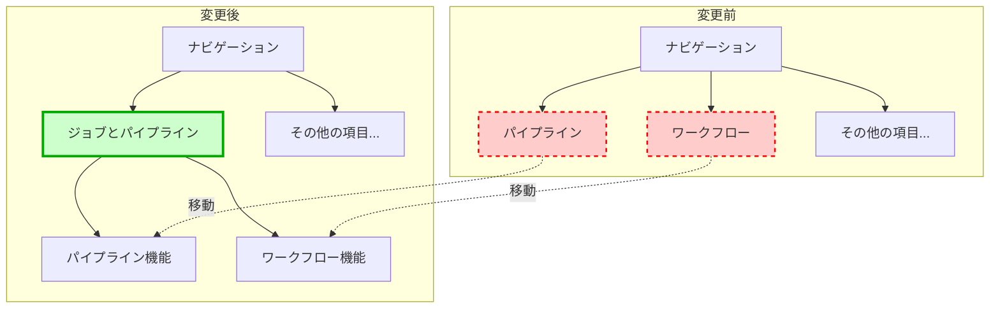

こちらのアップデートです。サイドメニューの構成が変更されました。

https://docs.databricks.com/aws/ja/release-notes/product/2025/june#jobs--pipelines-in-the-left-navigation-menu

> **左のナビゲーションメニューにおけるジョブとパイプライン**
> 左のナビゲーションの**ジョブとパイプライン**アイテムは、Databricksの統合データエンジニアリング機能であるLakeflowへのエントリーポイントです。左のナビゲーションにあった**パイプライン**と**ワークフロー**は削除され、それらの機能は**ジョブとパイプライン**から利用できるようになりました。

**変更前**

**変更後**

### はじめてのDatabricks

[はじめてのDatabricks](https://qiita.com/taka_yayoi/items/8dc72d083edb879a5e5d)

### Databricks無料トライアル

[Databricks無料トライアル](https://databricks.com/jp/try-databricks)
