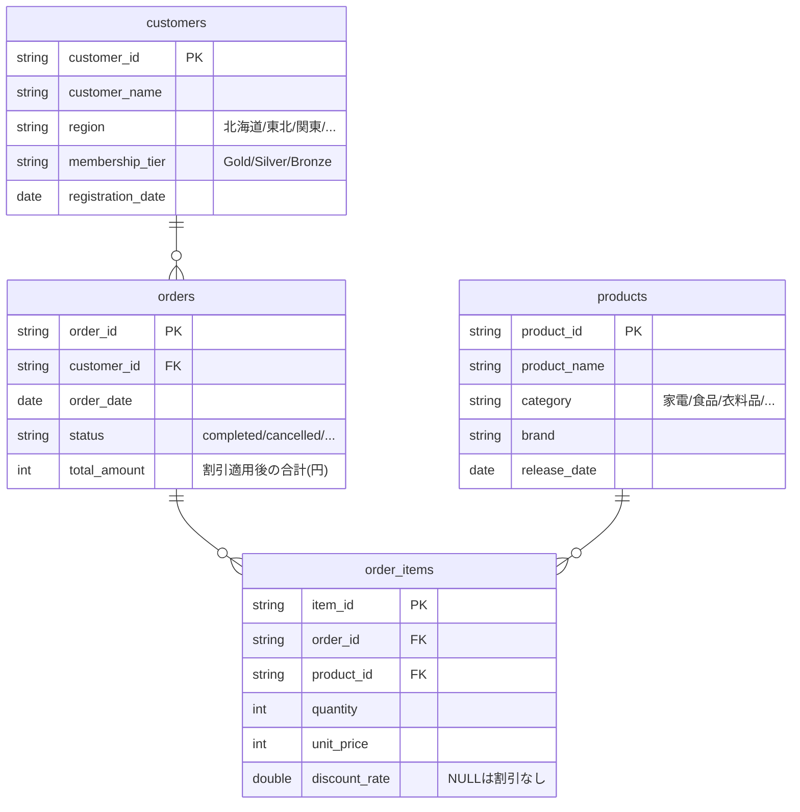

# はじめに

[AI/BI Genie](https://www.databricks.com/jp/product/business-intelligence/ai-bi-genie)は自然言語でデータに問い合わせできる強力な機能ですが、生成されるSQLクエリが常に意図通りとは限りません。「先月の売上」と聞いたとき、それは暦月なのか直近30日なのか。「売上」は完了済み注文だけなのか、配送中も含むのか。こうした曖昧性がクエリの精度に影響します。

2025年2月にベータ版として公開された[**検査モード(Inspection Mode)**](https://docs.databricks.com/aws/ja/genie/#%E6%A4%9C%E6%9F%BB%E3%83%A2%E3%83%BC%E3%83%89%E3%82%92%E4%BD%BF%E7%94%A8%E3%81%97%E3%81%A6%E5%BF%9C%E7%AD%94%E7%B2%BE%E5%BA%A6%E3%82%92%E5%90%91%E4%B8%8A%E3%81%95%E3%81%9B%E3%82%8B)は、Genie が生成したSQLクエリを高度な推論で自己検証し、精度を向上させる機能です。本記事では、検査モードの仕組みと、実際にデモ環境を構築して動作を確認する手順を紹介します。

:::note info
本記事の内容は2025年2月時点のベータ版に基づいています。GA時に仕様が変更される可能性があります。
:::


# 検査モードとは

検査モードは、Genie が生成したSQLクエリに対して**自動的にセルフチェック**を行い、問題があれば修正版を返す機能です。

## 処理フロー

検査モードを有効にすると、Genie は以下の手順で応答を生成します。

1. 通常通りSQLクエリを生成する
2. 生成したクエリの特定の側面を検証するための**小さなSQLステートメント群**を作成・実行する
3. 元のクエリのギャップや問題を特定する
4. 問題がある場合、改善版のSQLクエリを生成する
5. 元のクエリと改善版を比較し、最も正確なクエリを最終回答として返す

ステップ2で作成される検証用SQLは、例えば以下のような観点をチェックします。

- **フィルター値**: WHERE句で指定した値がテーブルに実在するか
- **日付範囲ロジック**: 「過去7日間」「先月」などの期間計算が正しいか
- **JOIN条件**: テーブル間の結合が適切か
- **集計**: GROUP BYやSUM/COUNTの使い方が意図と一致しているか

## どんなときに有効か

検査モードは特に以下のケースで効果を発揮します。

- 「先月」「今四半期」など**曖昧な日付表現**を含む質問
- 「ゴールド会員」「返品を除く」など**フィルター条件の解釈が複数ある**質問
- 3テーブル以上の**JOINと集計を組み合わせる**複雑な質問
- discount_rate が NULL = 割引なし、のような**NULLの意味を考慮する必要がある**計算

逆に、単一テーブルの単純なSELECTでは検査モードのオーバーヘッドに対して効果が薄いため、複雑なクエリが多いスペースでの利用が推奨されます。

# 検査モードの有効化

検査モードはベータ機能のため、ワークスペース管理者による有効化が必要です。

1. ワークスペースにアクセス
2. **プレビュー**ページを開く
3. **Genie Answer Inspection**を有効化


有効化するとワークスペース内のすべてのGenieスペースで検査モードが適用されます。スペースごとのオン/オフ切り替えは現時点(2025年2月)では提供されていません。

# デモ環境の構築

検査モードの効果を実感するために、意図的に「曖昧な質問が発生しやすい」データセットを用意します。

## テーブル構成

EC/小売の売上分析シナリオとして、以下の4テーブルを作成します。

| テーブル | 件数 | 概要 |
|---------|------|------|
| customers | 500件 | 会員ランク(Gold/Silver/Bronze)、地域情報 |
| products | 50件 | 5カテゴリ(家電/食品/衣料品/書籍/日用品)× 10商品 |
| orders | 5,000件 | 5種ステータス(completed/cancelled/returned/pending/shipping) |
| order_items | 約10,000件 | 数量、単価、割引率(70%がNULL=割引なし) |

## 検査モードが効くポイント

データ設計で意図的に以下の「曖昧性」を仕込んでいます。

**ステータスの多義性**: orders テーブルに5種のステータスを持たせています。「売上」と聞かれたとき、completed だけなのか shipping も含むのか、検査モードが検証します。

**NULLの意味**: order_items の discount_rate は70%がNULL(= 割引なし)です。割引込みの売上計算で NULL をどう扱うかが検証ポイントになります。

**地域のNULL**: customers の region に3%のNULLを混ぜています。地域別集計でNULL行がどう扱われるかをチェックできます。

**PK/FK制約**: テーブル間のリレーションシップを明示的に定義しており、Genie が正しい JOIN パスを推論できるようにしています。

## サンプルデータ生成ノートブック

以下のノートブックを Databricks ワークスペースにインポートして実行すると、`main.genie_inspection_demo` スキーマにテーブルが生成されます。

<details>
<summary>ノートブック全文(クリックで展開)</summary>

```python
# カタログ・スキーマの設定
CATALOG = "main"
SCHEMA = "genie_inspection_demo"

spark.sql(f"CREATE CATALOG IF NOT EXISTS {CATALOG}")
spark.sql(f"CREATE SCHEMA IF NOT EXISTS {CATALOG}.{SCHEMA}")
spark.sql(f"USE CATALOG {CATALOG}")
spark.sql(f"USE SCHEMA {SCHEMA}")
```

```python
import random
from datetime import datetime, timedelta
from pyspark.sql import Row
from pyspark.sql.types import (
    StructType, StructField, StringType, DateType, IntegerType
)

random.seed(42)

# ===== customers =====
regions = ["北海道", "東北", "関東", "中部", "近畿", "中国", "四国", "九州"]
tiers = ["Gold", "Silver", "Bronze"]
tier_weights = [0.15, 0.35, 0.50]

last_names = [
    "田中", "鈴木", "佐藤", "山田", "高橋", "伊藤", "渡辺", "中村",
    "小林", "加藤", "吉田", "松本", "井上", "木村", "斎藤", "清水",
    "山本", "森", "池田", "橋本", "阿部", "石川", "前田", "藤田",
]
first_names = [
    "太郎", "花子", "一郎", "美咲", "健太", "由美", "大輔", "さくら",
    "翔太", "愛", "直樹", "恵", "拓也", "裕子", "隆", "真由美",
]

customers = []
for i in range(1, 501):
    name = random.choice(last_names) + " " + random.choice(first_names)
    region = random.choice(regions) if random.random() > 0.03 else None
    tier = random.choices(tiers, weights=tier_weights, k=1)[0]
    reg_date = datetime(2022, 1, 1) + timedelta(days=random.randint(0, 1000))
    customers.append(Row(
        customer_id=f"C{i:04d}",
        customer_name=name,
        region=region,
        membership_tier=tier,
        registration_date=reg_date.date(),
    ))

customers_df = spark.createDataFrame(customers)
customers_df.write.mode("overwrite").option("overwriteSchema", "true").saveAsTable("customers")
```

```python
# ===== products =====
categories_brands = {
    "家電": ["パナソニック", "ソニー", "シャープ", "東芝", "日立"],
    "食品": ["カルビー", "明治", "森永", "日清", "味の素"],
    "衣料品": ["ユニクロ", "無印良品", "ワークマン", "GU", "ZARA"],
    "書籍": ["講談社", "集英社", "新潮社", "角川", "岩波書店"],
    "日用品": ["花王", "ライオン", "P&G", "ユニチャーム", "サラヤ"],
}

product_templates = {
    "家電": ["ワイヤレスイヤホン", "電動歯ブラシ", "空気清浄機", "炊飯器", "ドライヤー",
             "ロボット掃除機", "加湿器", "電気ケトル", "ヘアアイロン", "扇風機"],
    "食品": ["ポテトチップス", "チョコレート", "カップ麺", "グラノーラ", "冷凍餃子",
             "レトルトカレー", "プロテインバー", "ドレッシング", "ふりかけ", "お茶漬け"],
    "衣料品": ["Tシャツ", "デニムパンツ", "パーカー", "ダウンジャケット", "スニーカー",
              "ワンピース", "チノパン", "カーディガン", "マフラー", "レインコート"],
    "書籍": ["ビジネス書", "小説", "技術書", "漫画", "自己啓発本",
             "料理本", "旅行ガイド", "絵本", "参考書", "エッセイ"],
    "日用品": ["洗濯洗剤", "食器用洗剤", "シャンプー", "ハンドソープ", "歯磨き粉",
              "ティッシュペーパー", "除菌スプレー", "柔軟剤", "入浴剤", "ボディソープ"],
}

products = []
pid = 1
for category, brands in categories_brands.items():
    for template in product_templates[category]:
        brand = random.choice(brands)
        release_date = datetime(2021, 1, 1) + timedelta(days=random.randint(0, 1500))
        products.append(Row(
            product_id=f"P{pid:04d}",
            product_name=f"{brand} {template}",
            category=category,
            brand=brand,
            release_date=release_date.date(),
        ))
        pid += 1

products_df = spark.createDataFrame(products)
products_df.write.mode("overwrite").option("overwriteSchema", "true").saveAsTable("products")
```

```python
# ===== orders =====
statuses = ["completed", "cancelled", "returned", "pending", "shipping"]
status_weights = [0.65, 0.10, 0.08, 0.07, 0.10]
customer_ids = [c.customer_id for c in customers]

orders = []
for i in range(1, 5001):
    cid = random.choice(customer_ids)
    if random.random() < 0.7:
        order_date = datetime.now() - timedelta(days=random.randint(0, 180))
    else:
        order_date = datetime.now() - timedelta(days=random.randint(181, 365))
    status = random.choices(statuses, weights=status_weights, k=1)[0]
    if status in ("pending", "shipping") and (datetime.now() - order_date).days > 14:
        status = "completed"
    orders.append(Row(
        order_id=f"O{i:05d}",
        customer_id=cid,
        order_date=order_date.date(),
        status=status,
        total_amount=None,
    ))

orders_schema = StructType([
    StructField("order_id", StringType(), False),
    StructField("customer_id", StringType(), False),
    StructField("order_date", DateType(), False),
    StructField("status", StringType(), False),
    StructField("total_amount", IntegerType(), True),
])

orders_df = spark.createDataFrame(orders, schema=orders_schema)
orders_df.write.mode("overwrite").option("overwriteSchema", "true").saveAsTable("orders_temp")
```

```python
# ===== order_items =====
product_ids = [p.product_id for p in products]
order_ids = [o.order_id for o in orders]

category_prices = {
    "家電": (3000, 50000), "食品": (100, 2000),
    "衣料品": (1000, 15000), "書籍": (500, 5000), "日用品": (200, 3000),
}
product_category_map = {p.product_id: p.category for p in products}

order_items = []
item_id = 1
order_totals = {}

for oid in order_ids:
    n_items = random.choices([1, 2, 3, 4, 5], weights=[0.35, 0.30, 0.20, 0.10, 0.05], k=1)[0]
    selected_products = random.sample(product_ids, min(n_items, len(product_ids)))
    total = 0
    for pid in selected_products:
        cat = product_category_map[pid]
        low, high = category_prices[cat]
        unit_price = round(random.randint(low, high) / 10) * 10
        quantity = random.choices([1, 2, 3, 5], weights=[0.55, 0.25, 0.15, 0.05], k=1)[0]
        if random.random() < 0.70:
            discount_rate = None
        else:
            discount_rate = round(random.choice([0.05, 0.10, 0.15, 0.20, 0.25, 0.30]), 2)
        effective_price = unit_price * quantity
        if discount_rate:
            effective_price = effective_price * (1 - discount_rate)
        total += effective_price
        order_items.append(Row(
            item_id=f"I{item_id:06d}", order_id=oid, product_id=pid,
            quantity=quantity, unit_price=unit_price, discount_rate=discount_rate,
        ))
        item_id += 1
    order_totals[oid] = round(total)

order_items_df = spark.createDataFrame(order_items)
order_items_df.write.mode("overwrite").option("overwriteSchema", "true").saveAsTable("order_items")
```

```python
# ===== orders の total_amount を更新 =====
from pyspark.sql.functions import col

totals_rows = [Row(order_id=k, calculated_total=v) for k, v in order_totals.items()]
totals_df = spark.createDataFrame(totals_rows)

final_orders_df = (
    orders_df.drop("total_amount")
    .join(totals_df, on="order_id", how="left")
    .withColumnRenamed("calculated_total", "total_amount")
    .select("order_id", "customer_id", "order_date", "status", "total_amount")
)
final_orders_df.write.mode("overwrite").option("overwriteSchema", "true").saveAsTable("orders")
spark.sql("DROP TABLE IF EXISTS orders_temp")
```

```python
# ===== テーブルコメント・カラムコメント =====
# customers
spark.sql("ALTER TABLE customers SET TBLPROPERTIES ('comment' = '顧客マスタテーブル。会員ランク(Gold/Silver/Bronze)と地域情報を含む。')")
spark.sql("ALTER TABLE customers ALTER COLUMN customer_id COMMENT '顧客ID(例: C0001)'")
spark.sql("ALTER TABLE customers ALTER COLUMN customer_name COMMENT '顧客氏名'")
spark.sql("ALTER TABLE customers ALTER COLUMN region COMMENT '地域(北海道/東北/関東/中部/近畿/中国/四国/九州)。NULLの場合は未登録。'")
spark.sql("ALTER TABLE customers ALTER COLUMN membership_tier COMMENT '会員ランク: Gold(ゴールド), Silver(シルバー), Bronze(ブロンズ)'")
spark.sql("ALTER TABLE customers ALTER COLUMN registration_date COMMENT '会員登録日'")

# products
spark.sql("ALTER TABLE products SET TBLPROPERTIES ('comment' = '商品マスタテーブル。カテゴリ(家電/食品/衣料品/書籍/日用品)とブランド情報を含む。')")
spark.sql("ALTER TABLE products ALTER COLUMN product_id COMMENT '商品ID(例: P0001)'")
spark.sql("ALTER TABLE products ALTER COLUMN product_name COMMENT '商品名(ブランド名 + 商品種別)'")
spark.sql("ALTER TABLE products ALTER COLUMN category COMMENT '商品カテゴリ: 家電/食品/衣料品/書籍/日用品'")
spark.sql("ALTER TABLE products ALTER COLUMN brand COMMENT 'ブランド名'")
spark.sql("ALTER TABLE products ALTER COLUMN release_date COMMENT '商品発売日'")

# orders
spark.sql("ALTER TABLE orders SET TBLPROPERTIES ('comment' = '注文テーブル。注文ごとのステータスと合計金額を格納。ステータスはcompleted(完了)/cancelled(キャンセル)/returned(返品)/pending(処理中)/shipping(配送中)の5種。')")
spark.sql("ALTER TABLE orders ALTER COLUMN order_id COMMENT '注文ID(例: O00001)'")
spark.sql("ALTER TABLE orders ALTER COLUMN customer_id COMMENT '顧客ID(customersテーブルへの外部キー)'")
spark.sql("ALTER TABLE orders ALTER COLUMN order_date COMMENT '注文日'")
spark.sql("ALTER TABLE orders ALTER COLUMN status COMMENT '注文ステータス: completed(完了)/cancelled(キャンセル)/returned(返品)/pending(処理中)/shipping(配送中)'")
spark.sql("ALTER TABLE orders ALTER COLUMN total_amount COMMENT '注文合計金額(円、割引適用後)'")

# order_items
spark.sql("ALTER TABLE order_items SET TBLPROPERTIES ('comment' = '注文明細テーブル。各注文に含まれる商品、数量、単価、割引率を格納。discount_rateがNULLの場合は割引なし。')")
spark.sql("ALTER TABLE order_items ALTER COLUMN item_id COMMENT '明細ID(例: I000001)'")
spark.sql("ALTER TABLE order_items ALTER COLUMN order_id COMMENT '注文ID(ordersテーブルへの外部キー)'")
spark.sql("ALTER TABLE order_items ALTER COLUMN product_id COMMENT '商品ID(productsテーブルへの外部キー)'")
spark.sql("ALTER TABLE order_items ALTER COLUMN quantity COMMENT '購入数量'")
spark.sql("ALTER TABLE order_items ALTER COLUMN unit_price COMMENT '単価(税抜、円)'")
spark.sql("ALTER TABLE order_items ALTER COLUMN discount_rate COMMENT '割引率(0.05=5%, 0.30=30%)。NULLの場合は割引なし。'")
```

```python
# ===== PK/FK 制約 =====
# NOT NULL設定
for tbl, col in [("customers", "customer_id"), ("products", "product_id"),
                  ("orders", "order_id"), ("order_items", "item_id"),
                  ("orders", "customer_id"), ("order_items", "order_id"),
                  ("order_items", "product_id")]:
    spark.sql(f"ALTER TABLE {tbl} ALTER COLUMN {col} SET NOT NULL")

# Primary Keys
spark.sql("ALTER TABLE customers ADD CONSTRAINT pk_customers PRIMARY KEY (customer_id)")
spark.sql("ALTER TABLE products ADD CONSTRAINT pk_products PRIMARY KEY (product_id)")
spark.sql("ALTER TABLE orders ADD CONSTRAINT pk_orders PRIMARY KEY (order_id)")
spark.sql("ALTER TABLE order_items ADD CONSTRAINT pk_order_items PRIMARY KEY (item_id)")

# Foreign Keys
spark.sql("ALTER TABLE orders ADD CONSTRAINT fk_orders_customer FOREIGN KEY (customer_id) REFERENCES customers(customer_id)")
spark.sql("ALTER TABLE order_items ADD CONSTRAINT fk_items_order FOREIGN KEY (order_id) REFERENCES orders(order_id)")
spark.sql("ALTER TABLE order_items ADD CONSTRAINT fk_items_product FOREIGN KEY (product_id) REFERENCES products(product_id)")

print("PK/FK 制約を設定しました。")
```

```python
# ===== データ確認 =====
for table in ["customers", "products", "orders", "order_items"]:
    count = spark.table(table).count()
    print(f"  {table}: {count:,} 件")
```

</details>

## ER図

テーブル間のリレーションシップは以下の通りです。



# Genie スペースの作成

## スペースの基本設定

1. サイドバーから **Genie** を選択し、**新しい Genie スペース**をクリック
2. スペース名を「EC売上分析(検査モードデモ)」などに設定
3. SQL ウェアハウスを選択(Pro または Serverless)
4. `main.genie_inspection_demo` スキーマから4テーブルすべてを追加


## 一般的な手順の設定

スペースの「一般的な手順」に以下を追加すると、検査モードの検証精度がさらに分かりやすくなります。

```
- 「売上」と言われた場合、特に指定がなければ status が 'completed' の注文の total_amount の合計を指します。
- 「先月」は暦月(月初から月末)を意味します。
- discount_rate が NULL の場合は割引なしとして扱ってください。
- 地域別の集計では、region が NULL の顧客は「未登録」として表示してください。
```

# 検査モードの動作確認

検査モードの有無で応答がどう変わるかを比較してみましょう。

## テスト1: 日付範囲の検証

**質問**: 「先月の売上合計はいくらですか?」

この質問では「先月」の解釈が鍵になります。

**検査モードOFFの場合**: Genie は「先月」を直近30日と解釈する場合があり、暦月とずれた結果が返ることがあります。

**検査モードONの場合**: 検査モードは日付範囲ロジックを検証するSQLを追加実行し、`DATE_TRUNC('month', CURRENT_DATE - INTERVAL 1 MONTH)` のような正確な暦月計算に補正する可能性があります。


## テスト2: フィルター値の検証

**質問**: 「ゴールド会員の平均注文額は?」

**検査モードONの場合**: 検査モードは `membership_tier` カラムの実際の値を確認する検証SQLを実行し、`'Gold'` というフィルター値がテーブルに存在することを確かめます。


## テスト3: JOIN + 集計の検証

**質問**: 「カテゴリ別・地域別の売上ランキングを出して」

3テーブル(orders + order_items + products + customers)のJOINが必要な複雑なクエリです。

**検査モードONの場合**: JOIN条件の妥当性と集計ロジックを検証し、必要に応じてクエリを修正します。


## テスト4: NULLの扱い

**質問**: 「割引適用時と未適用時の平均注文額の差は?」

discount_rate が NULL(= 割引なし)のデータの扱いが正しいかを検査モードが検証します。


# 検査モードの確認方法

検査モードが動作した応答では、生成されたSQLの横に検査プロセスの詳細を確認できるUIが表示されます。


ここでは以下の情報が確認できます。

- 元のSQLクエリ
- 検証のために実行された小さなSQLステートメント群
- 特定された問題点
- 改善後のSQLクエリ(修正があった場合)

# ベストプラクティス

検査モードを効果的に活用するためのポイントをまとめます。

## メタデータを充実させる

検査モードの精度はテーブル・カラムのコメントに大きく依存します。本記事のデモデータでは、カラムコメントに同義語(例: `Gold(ゴールド)`)や取りうる値の一覧を含めています。これにより、検査モードがフィルター値を検証する際の精度が向上します。

## PK/FK制約を定義する

Unity Catalog の PK/FK 制約は、Genie が正しい JOIN パスを選択するための重要な手がかりです。検査モードが JOIN 条件を検証する際にも活用されます。

## 「一般的な手順」でビジネスルールを明示する

「売上 = completed の注文のみ」「先月 = 暦月」といったビジネスルールを一般的な手順に明記しておくと、検査モードの検証基準が明確になります。

## ベンチマークと併用する

検査モードの効果を定量的に測定するには、[ベンチマーク機能](https://docs.databricks.com/aws/ja/genie/benchmarks)と組み合わせて使います。検査モードのオン/オフでベンチマークスコアを比較することで、スペースごとの効果を数値で確認できます。

# 検査モードと Research Agent の違い

Genie には検査モードの他にも複数の SQL を実行して回答精度を高める機能として [**Research Agent**](https://docs.databricks.com/aws/ja/genie/research-agent)があります。どちらも「追加の SQL を実行する」という手法は共通していますが、目的とアプローチが異なります。

## 比較表

| | 検査モード(Inspection Mode) | Research Agent |
|---|---|---|
| **目的** | 1つのSQLクエリの精度を検証・修正する | 複雑な質問に複数のSQLを組み合わせて調査する |
| **対象の質問** | 「先月の売上は?」などの**What系**(事実確認) | 「なぜ売上が下がったのか?」などの**Why/How系**(探索的分析) |
| **処理内容** | 生成SQLのフィルター・日付・JOINを小さなSQLで事後検証し、問題があれば修正版を返す | リサーチプランを立て、仮説を並行検証しながら反復的に分析を深める |
| **出力** | 検証済みの1つのSQL結果 | 引用・可視化付きの調査レポート(PDF出力可) |
| **UIの違い** | 通常のGenieチャットで自動的に適用 | チャットボックスの専用アイコンから明示的に起動 |
| **ステータス** | ベータ版 | ベータ版 |

## 使い分けの指針

**検査モード**は、通常のGenie応答の「品質保証」として機能します。ユーザーが意識することなくバックグラウンドでSQLの正確性を検証するため、すべての質問に対して底上げ的に精度を向上させる**守りの機能**です。

一方、**Research Agent** は「なぜ関東地域の売上が前四半期比で落ちているのか?」のように、単一のSQLでは答えられない探索的な質問に対して、複数の仮説を立てて検証する**攻めの機能**です。ユーザーがResearch Agentアイコンをクリックして明示的に起動する点も、検査モードとは異なります。

# 注意点と制限事項

- 検査モードは追加のSQL実行を伴うため、**応答時間が長くなる**場合があります
- 現時点ではベータ版のため、**仕様が変更される可能性**があります
- 検査モードは万能ではなく、ナレッジストアの充実やメタデータの整備が引き続き重要です
- 単純なクエリに対しては検査モードのオーバーヘッドに見合わない場合もあります

# まとめ

検査モードは、Genie が生成するSQLの「思い込み」を自動検出し修正する強力な機能です。特に日付範囲の解釈やフィルター条件の検証、複雑なJOINの正確性確認において効果を発揮します。

ベータ版ではありますが、ビジネスユーザーが安心してGenieを利用できるようにするための重要な機能です。メタデータの充実やPK/FK制約の定義と合わせて活用することで、Genieスペースの信頼性を大きく向上させることができます。

# 参考リンク

- [AI/BI Genieスペースとは](https://docs.databricks.com/aws/ja/genie/)
- [ナレッジストアの構築](https://docs.databricks.com/aws/ja/genie/knowledge-store)
- [Genieスペースでのベンチマークの使用](https://docs.databricks.com/aws/ja/genie/benchmarks)
- [Databricksプレビューの管理](https://docs.databricks.com/aws/ja/admin/workspace-settings/manage-previews)

### はじめてのDatabricks

[はじめてのDatabricks](https://qiita.com/taka_yayoi/items/8dc72d083edb879a5e5d)

### Databricks無料トライアル

[Databricks無料トライアル](https://databricks.com/jp/try-databricks)
