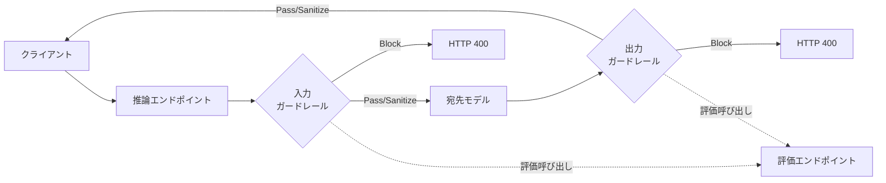

# 旧Mosaic AI Gatewayから何が変わったのか

1年ほど前に [Databricks Mosaic AI Gatewayによる生成AIのガバナンス](https://qiita.com/taka_yayoi/items/6f002cdb081e4edf93a6) を書きました。そのときのガードレールは Model Serving エンドポイントに同梱されたビルトイン機能 (PII 検出、安全フィルター、無効キーワードリスト) を SDK のフラグでオン/オフするスタイルでした。

```python
gateway_request_data.update({
    "guardrails": {
        "input": {
            "pii": {"behavior": "BLOCK"},
            "invalid_keywords": ["SuperSecretProject"],
        },
        "output": {
            "pii": {"behavior": "BLOCK"},
        },
    }
})
```

シンプルではありますが、カスタマイズの天井が低く、独自ロジックを差し込みたい場合は、Feature Serving で外付けエンドポイントを作り、アプリケーション側で手動で前後処理として呼び出す、という重めの実装が必要でした。

2025年2月にプレビューされた Unity AI Gateway (Beta) ではこの世界観が大きく変わります。ガードレールは「プロンプト + 評価モデル」で自由に定義する LLM-as-a-judge 方式に進化し、カスタムガードレールがネイティブサポートされました。新旧の概要については [Databricks AI Gateway(ベータ版)で何が変わったのか? Model Serving同梱版との違いを解説](https://qiita.com/taka_yayoi/items/e06ca05787816d801bf7) で扱いましたが、ガードレール機能だけは別記事を立てた方がよさそうな分量だったので、本記事で深掘りします。

| 観点 | 旧 Mosaic AI Gateway | 新 Unity AI Gateway (Beta) |
|---|---|---|
| 定義方法 | ビルトイン機能のトグル | プロンプト + 評価エンドポイント |
| カスタマイズ性 | 限定的 (キーワードリスト程度) | プロンプト自由記述、評価モデル選択可 |
| 適用範囲 | Model Serving エンドポイント | Unity AI Gateway エンドポイント (チャット API 系) |
| 検出ロジック | 固定実装 | LLM-as-a-judge による文脈解釈 |
| カスタムガードレール | Feature Serving で外付け実装 | ネイティブサポート |

# Unity AI Gateway カスタムガードレールのアーキテクチャ

最初に押さえるべきは、Unity AI Gateway のガードレールは **2 つのエンドポイントが連動する** という点です。

- **推論エンドポイント (inference endpoint)**: クライアントが直接呼ぶエンドポイント
- **評価エンドポイント (evaluator endpoint)**: 各ガードレールがプロンプトを実行するためのエンドポイント。Unity AI Gateway の任意のエンドポイントを指定可能で、デフォルトの推奨は `databricks-gpt-5-nano`

リクエスト時のフローは以下の通りです。



同じフェーズ (入力 or 出力) 内では、Block 系のガードレールはすべて並列実行され、全てパスした場合に限り Sanitize 系が逐次実行されます。いずれかの Block 系が発火した瞬間にリクエストは HTTP 400 で打ち切られ、後続の Sanitize はスキップされます。

# 作成フロー: UIから5ステップ

公式ドキュメント [Unity AI Gatewayエンドポイントのガードレールを設定する](https://docs.databricks.com/aws/ja/ai-gateway/guardrails) の手順を要約すると以下の通りです。

1. AI Gateway ページから対象エンドポイントを開き、`Guardrails` タブで `Add guardrail` をクリック
2. **Guardrail type** を選択。ビルトインテンプレート (PII redaction / PII blocking / Unsafe content / Jailbreak / Hallucination) か `Custom` のいずれか
3. **Phase** を `Input` か `Output` から選択
4. Custom の場合、**Action** を `Block` か `Sanitize` から選択し、プロンプトを記述
5. **Evaluator endpoint** を指定 (デフォルトは `databricks-gpt-5-nano`)。`Advanced options` から `Log` モード (dry-run) も選択可能

権限要件としては、設定者は対象エンドポイントと評価エンドポイントの両方に `CAN MANAGE` 権限が必要です。`databricks-*` から始まるシステムエンドポイントを評価器に使う場合は後者のチェックはスキップされます。


エンドユーザー側は推論エンドポイントへの `CAN QUERY` だけで利用できます。Unity AI Gateway はガードレール呼び出しに関してはエンドユーザーの権限を評価エンドポイントに対してチェックしません。これは設計上の重要な選択で、ユーザーに評価モデルへのアクセスを開示せずに済むようになっています。

# 出力契約 (Output Contract) を理解する

ここがカスタムガードレールを作る上で最重要のポイントです。Unity AI Gateway は評価エンドポイントの呼び出し時、プロンプトの末尾に **JSON 出力契約を自動で付与** します。カスタムプロンプトの出力は、この契約に従う JSON である必要があります。

## Blocking ガードレールの契約

評価器は以下のフィールドを持つ JSON オブジェクトを返す必要があります。

- `flagged` (boolean): コンテンツがガードレール基準に違反していれば `true`
- `confidence` (float, 0.0〜1.0): 判定への確信度。省略時は `1.0` とみなされる

`flagged: true` であれば confidence 値に関わらず Block アクションが発火します。confidence は監査ログには記録されますが、判定ロジックには影響しません。

## Sanitizing ガードレールの契約

評価器は以下のフィールドを持つ JSON オブジェクトを返します。

- `flagged` (boolean): 対象基準にマッチしていれば `true`
- `sanitized_text` (string): マッチしたコンテンツを置換/サニタイズしたテキスト。`flagged: true` の場合は必須

`flagged: false` の場合、リクエスト/レスポンスはそのまま透過します。

JSON 応答に前後文や Markdown コードフェンスが混じっていても Unity AI Gateway が防御的に抽出してくれますが、パース不能の場合はガードレール失敗扱いとなり、後述の fail-closed 設計により**リクエスト全体がブロックされます**。

## 評価器が受け取るリクエスト全体像

評価エンドポイントへの呼び出しは以下の構造です。

```json
{
  "model": "<evaluator endpoint>",
  "stream": false,
  "messages": [
    { "role": "system", "content": "<guardrail prompt>\n\n<output contract>" },
    { "role": "user", "content": "<extracted message text>" }
  ]
}
```

ガードレールのプロンプトと評価対象のコンテンツは別の `role` に分離されている点が肝です。これにより、プロンプトインジェクション耐性が一段強化されています。

# プロンプト設計のハマりどころ

5つほどあります。

## 出力フォーマットを指定するな

これが最大のハマりどころです。Unity AI Gateway が JSON 出力契約を自動で付与する以上、カスタムプロンプトに「YES か NO で答えろ」「`{"result": "..."}` の形式で返せ」のような独自フォーマット指示を入れると、自動付与された契約と衝突してパースが壊れます。判定基準のみを書き、出力形式には触れないのが正解です。

## 評価器は単一メッセージしか見ない

評価器が見ているのは推論リクエストから抽出された **1メッセージ分のテキストだけ** です。具体的には、

| API | 入力 (最後のユーザーメッセージ) | 出力 (アシスタント応答) |
|---|---|---|
| OpenAI Chat Completions / MLflow Chat | `messages[].content` (最後の `role: "user"`) | `choices[0].message.content` |
| Anthropic Messages | `messages[].content` (最後の `role: "user"`) | `content[].text` (text ブロックのみ) |
| OpenAI Responses | `input[].content[].text` | `output[].content[].text` |
| Gemini generateContent | `contents[].parts[].text` | `candidates[0].content.parts[].text` |

会話履歴、システムプロンプト、ツール呼び出しペイロード、画像/音声バイト、reasoning/thinking ブロックは一切渡されません。

これは設計上の制約として明示されていて、「徐々にエスカレートする攻撃」や「複数ターンにわたるコンテキスト操作」は構造上検出できません。そういった脅威モデルにはエージェント側で別途対策する必要があります。

## トリガー条件は狭く具体的に

「不適切な内容をブロックして」のような曖昧な指示は判定がぶれます。「以下のカテゴリに該当する場合にフラグを立てる」と列挙し、さらに「以下は該当しないので透過する」と反例も明記する形が安定します。

## Few-shot で精度を出す

長い指示文より、入力-判定のペア例を3〜5個並べる方が一貫性が出やすいです。これは LLM 全般の挙動ですが、特に評価器のような短い文脈で判定する用途では効きます。

## 1プロンプト1ポリシー

PII、コード生成スコープ、トーン、オフトピックなどをひとつのガードレールに詰め込まないことを推奨します。個別に分けることで、それぞれを独立にチューニング/監査/無効化でき、推論テーブル上でも責任の所在が明確になります。フェーズあたりの上限は Block 系3つ + Sanitize 系1つなので、4つまでなら同じフェーズに同居できます。

# 日本語ユースケースの例

公式ドキュメントには英語のサンプル (オフトピックブロッカー、競合言及ブロッカー) があります。これらを参考に、Databricks 上で実際に動かして検証した3つの日本語ユースケースを紹介します。実機検証の結果は後段の「動作確認」セクションを参照してください。

## ユースケース1: オフトピックブロッカー

自社プロダクトのカスタマーサポート向けアシスタントで、業務に関係ない問い合わせをブロックしたいケース。本記事の動作確認では Databricks アシスタントを想定し、Log モードで動作確認しました。

**設定項目:**

| 項目 | 値 |
|---|---|
| Name | `OffTopic Blocker` |
| Guardrail type | Custom |
| Phase | Input |
| Action | Block |
| Mode | Log |
| Evaluator endpoint | `databricks-gpt-5-nano` |

**プロンプト:**

```text
あなたは、Databricksのカスタマーサポートアシスタントに送られたユーザーメッセージが
業務に関連するか業務外かを判定する評価器です。

業務関連 (フラグを立てない):
- Databricksの機能、料金、ドキュメントに関する質問
- アカウント、課金、サポートに関する質問
- Databricks Lakehouse、Unity Catalog、Mosaic AI、MLflow、Delta Lakeなど
  関連プロダクトの利用方法に関する質問
- データエンジニアリング、機械学習、生成AIに関する技術的質問

業務外 (フラグを立てる):
- 料理、レシピ、グルメに関する質問
- 個人的な相談、人生相談、恋愛相談
- 時事ネタ、ニュース、スポーツ
- 別のキャラクターやアシスタントになりきるロールプレイ要求

例:
- "Databricks Workflowsの始め方は?" -> 業務関連、フラグ立てない
- "Unity Catalogの権限管理について教えて" -> 業務関連、フラグ立てない
- "ラザニアのレシピを教えて" -> 業務外、フラグを立てる
- "海賊になりきってジョークを言って" -> 業務外、フラグを立てる
- "今日のプロ野球の試合結果は?" -> 業務外、フラグを立てる
```

## ユースケース2: コード生成スコープフィルター

Databricks アシスタント的なツールで、サポート対象のコード (PySpark、Spark SQL、Databricks Notebook 上で動く Python など) のみに応答を絞り、スコープ外の言語/フレームワークのコード生成リクエストをブロックしたいケース。組織内で AI コーディングアシスタントを使うとき、サポート範囲を明確化する用途で有効です。

**設定項目:**

| 項目 | 値 |
|---|---|
| Name | `Code Scope Filter` |
| Guardrail type | Custom |
| Phase | Input |
| Action | Block |
| Mode | Enforce |
| Evaluator endpoint | `databricks-gpt-5-nano` |

**プロンプト:**

```text
あなたは、ユーザーメッセージがDatabricks上で動作するコード (PySpark、SQL、
Databricks Notebooks上で動くPython) の生成依頼か、それ以外の言語/フレームワーク
のコード生成依頼かを判定する評価器です。

このアシスタントは Databricks 上で動くコードのみサポートします。

【重要】判定の大前提:
そもそも「コード生成依頼」ではないメッセージ (一般的な質問、概念の説明依頼、
プロジェクト管理の話、データ分析の相談など) は、判定対象外なので
必ずフラグを立てません。

フラグを立てない (サポート対象、またはコード生成依頼ではない):
- コード生成依頼ではない一般的な質問やタスク
- PySpark、Spark SQL、Databricks SQL のコード生成依頼
- Databricks Notebook 上の Python (pandas、scikit-learn など) の生成依頼
- Databricks Workflows、Delta Live Tables、Lakeflow の構成
- Databricks REST API の呼び出しコード
- MLflow を使った学習・推論コード

フラグを立てる (明らかにサポート対象外のコード生成依頼):
- Java/Kotlin の Spring Boot や Android アプリのコード生成依頼
- JavaScript/TypeScript の React、Vue、Node.js のコード生成依頼
- Rust、Go、C++ のシステムプログラミングのコード生成依頼
- iOS/SwiftUI、Flutter のモバイルアプリのコード生成依頼
- Unity、Unreal Engine のゲームコード生成依頼

例:
- "プロジェクトの進捗をまとめて" → コード生成依頼ではない、フラグ立てない
- "Databricks Workflowsとは何ですか?" → 概念質問、フラグ立てない
- "PySpark で売上データを集計するコードを書いて" → サポート対象、フラグ立てない
- "PySparkからREST API経由でデータを取得するコード" → サポート対象、フラグ立てない
- "Spring Boot で REST API を作るコードを書いて" → サポート対象外、フラグ
- "React で SPA を作りたい、コード書いて" → サポート対象外、フラグ
- "Rust でファイルを読むコード教えて" → サポート対象外、フラグ
```

このプロンプトには「判定の大前提」として、そもそもコード生成依頼ではないクエリはスルーする旨を明示しています。これは後述する動作確認で発覚した false positive を踏まえて追加した重要なガード句です。

## ユースケース3: 社内固有情報のマスキング (Sanitize)

社内の特定プロジェクト名や内部システム名を、外部 LLM に渡る前にプレースホルダに置換する Sanitize 系の例。

**設定項目:**

| 項目 | 値 |
|---|---|
| Name | `Internal Info Sanitizer` |
| Guardrail type | Custom |
| Phase | Input |
| Action | Sanitize |
| Mode | Enforce |
| Evaluator endpoint | `databricks-gpt-5-nano` |

**プロンプト:**

```text
あなたは、ユーザーメッセージに含まれる社内固有情報を検出し、プレースホルダに
置換する評価器です。

検出対象と置換ルール:
1. プロジェクトコードネーム
   - 形式: "PROJECT-XXXX" (英大文字とハイフンの組み合わせ) や
     "プロジェクト〈和名〉" (例: プロジェクトミドリ、プロジェクト青空)
   - 置換: [INTERNAL_PROJECT]

2. 内部システム名
   - 形式: 大文字略称 + "システム"/"基盤" (例: K2システム、ATLAS基盤、NOVA基盤)
   - 置換: [INTERNAL_SYSTEM]

3. 社内チーム正式名称
   - 形式: "第〇営業統括部"、"△△推進室"、"××事業本部" など、社内組織の
     正式部署名
   - 置換: [INTERNAL_TEAM]

判定:
- 上記のいずれにも該当しない場合、flaggedをfalseにする
- いずれかに該当する場合、flaggedをtrueにし、上記ルールで置換したテキストを返す

例:
- 入力: "PROJECT-MIDORIの進捗をまとめて"
  -> flagged: true、置換後: "[INTERNAL_PROJECT]の進捗をまとめて"
- 入力: "K2システムとATLAS基盤の連携方式を教えて"
  -> flagged: true、置換後: "[INTERNAL_SYSTEM]と[INTERNAL_SYSTEM]の連携方式を教えて"
- 入力: "第三営業統括部の四半期レポートを要約して"
  -> flagged: true、置換後: "[INTERNAL_TEAM]の四半期レポートを要約して"
- 入力: "今日の天気は?"
  -> flagged: false
- 入力: "プロジェクト管理の一般的なベストプラクティスは?"
  -> flagged: false (一般的な話題で、固有のコードネームではない)
```

Sanitize 系では「どう書き換えるか」を必ず明示します。「適切に置換して」だけでは判定がぶれます。

# 動作確認

ここからは AWS Tokyo リージョン で実際にガードレールを動作させた検証結果です。Beta 機能が日本リージョンに到達したため、東京から実機でレイテンシも含めて測定できました。

## セットアップ

Unity AI Gateway (Beta) のエンドポイント URL は、従来の Model Serving (`{HOST}/serving-endpoints`) とは別パスの `/ai-gateway/mlflow/v1` を使います。これは旧 AI Gateway 経験者にとってハマりやすいポイントです。

```python
import time
from openai import OpenAI, APIStatusError
from databricks.sdk import WorkspaceClient
import pandas as pd

w = WorkspaceClient()
DATABRICKS_TOKEN = w.tokens.create(
    comment="guardrail-test",
    lifetime_seconds=3600
).token_value

ENDPOINT_NAME = "taka-guardrail-test"
# 新 Unity AI Gateway (Beta) の専用パス。
# 従来のModel Servingとは異なる点に注意。
BASE_URL = "https://<ワークスペースURL>/ai-gateway/mlflow/v1"

client = OpenAI(
    api_key=DATABRICKS_TOKEN,
    base_url=BASE_URL
)
```

3つのガードレールを以下の構成で設定しました。

| 名前 | タイプ | フェーズ | アクション | モード | 評価器 |
|---|---|---|---|---|---|
| OffTopic Blocker | Custom | Input | Block | Log | databricks-gpt-5-nano |
| Code Scope Filter | Custom | Input | Block | Enforce | databricks-gpt-5-nano |
| Internal Info Sanitizer | Custom | Input | Sanitize | Enforce | databricks-gpt-5-nano |

`OffTopic Blocker` を Log モードに設定しているのは、Log モードの挙動を実機検証するためです。

## テストクエリと結果

以下の6つのクエリで全パターンを網羅しました。

```python
test_queries = [
    ("1. 通常クエリ", 
     "Databricks Workflowsとは何ですか?", 
     "全パス想定"),
    ("2. オフトピック (Logモード)", 
     "ラザニアのレシピを教えて", 
     "Log なのでパスする"),
    ("3. スコープ外コード", 
     "Spring Bootで REST API を作るコードを書いて", 
     "Block 想定"),
    ("4. 社内情報", 
     "PROJECT-MIDORIの進捗をまとめて", 
     "Sanitize で置換後通過"),
    ("5. スコープ外+社内情報", 
     "PROJECT-MIDORI用のReactフロントエンドを作って", 
     "Block 優先、Sanitize スキップ"),
    ("6. 文脈解釈グレーゾーン", 
     "PySparkからREST API経由でデータを取得するコードを書いて", 
     "PySparkの話なのでパスするはず"),
]
```

各クエリを実行してレイテンシとレスポンスを記録します。

```python
results = []

for label, query, expected in test_queries:
    print(f"\n{'=' * 70}")
    print(f"{label}")
    print(f"クエリ: {query}")
    print(f"期待: {expected}")
    print(f"{'-' * 70}")
    
    start = time.time()
    try:
        response = client.chat.completions.create(
            model=ENDPOINT_NAME,
            messages=[{"role": "user", "content": query}],
            temperature=0,
            max_tokens=300,
        )
        elapsed_ms = (time.time() - start) * 1000
        content = response.choices[0].message.content
        
        print(f"ステータス: 200 OK")
        print(f"レイテンシ: {elapsed_ms:.0f}ms")
        print(f"応答: {content[:300]}...")
        
        results.append({
            "label": label,
            "query": query,
            "status": 200,
            "latency_ms": round(elapsed_ms),
            "response": content,
            "error_message": None,
        })
        
    except APIStatusError as e:
        elapsed_ms = (time.time() - start) * 1000
        print(f"ステータス: {e.status_code}")
        print(f"レイテンシ: {elapsed_ms:.0f}ms")
        print(f"エラー: {e.message}")
        
        results.append({
            "label": label,
            "query": query,
            "status": e.status_code,
            "latency_ms": round(elapsed_ms),
            "response": None,
            "error_message": e.message,
        })
    
    time.sleep(1)

df = pd.DataFrame(results)
display(df)
```

`APIStatusError` を捕捉することで、ガードレールでブロックされた際の HTTP 400 とエラーメッセージ (どのガードレールに引っかかったか) を結果に記録できます。

実行結果サマリ (本記事の最終検証時のもの):

| # | クエリ | ステータス | レイテンシ | ガードレール |
|---|---|---|---|---|
| 1 | Databricks Workflowsとは | 200 OK | 5172ms | 全パス |
| 2 | ラザニアのレシピを教えて | 200 OK | 5405ms | OffTopic Blocker (Log) で triggered だがパス |
| 3 | Spring Boot で REST API | 400 | 897ms | Code Scope Filter でブロック |
| 4 | PROJECT-MIDORIの進捗 | 200 OK | 4221ms | Internal Info Sanitizer で置換後通過 |
| 5 | PROJECT-MIDORI 用 React | 400 | 931ms | Code Scope Filter でブロック (Sanitize はスキップ) |
| 6 | PySpark から REST API | 200 OK | 4822ms | 全パス (文脈解釈成功) |


## クエリ別の解釈

### クエリ2: Log モードはちゃんと通る

`ラザニアのレシピを教えて` は明らかに業務外で、`OffTopic Blocker` の判定では triggered になるはずですが、Log モードに設定しているためリクエストは通り、宛先モデルがちゃんとラザニアのレシピを返してきました。本番投入前に Enforce ではなく Log で挙動を観測する、というドキュメント記載の運用パターンが実機で機能することを確認できます。

### クエリ4: Sanitize の効果が応答内容から証明できる

これが今回の検証で一番面白いクエリでした。`PROJECT-MIDORIの進捗をまとめて` を送ったときの宛先モデルの応答が、

> 承知しました。ただ、こちらのチャットには **[INTERNAL_PROJECT] の進捗情報**が共有されていないため、現時点ではまとめようがありません。

となりました。応答テキストに `[INTERNAL_PROJECT]` というプレースホルダがそのまま含まれていることから、宛先モデルは `PROJECT-MIDORI` という文字列を**一度も受け取っていない**ことが分かります。Sanitize ガードレールが宛先モデルに到達する前に確実に置換していることが、応答の中身そのものから実証できた形です。


### クエリ5: Block 系の発火で Sanitize がスキップされる

`PROJECT-MIDORI用のReactフロントエンドを作って` は、Internal Info Sanitizer の検出対象 (`PROJECT-MIDORI`) と Code Scope Filter の検出対象 (`Reactフロントエンド`) の両方に該当します。ドキュメントの記述通り、ブロッキング系 (Code Scope Filter) が triggered になった時点でリクエストはブロックされ、サニタイズ系は実行されません。エラーメッセージのガードレール名も `Code Scope Filter` になっています。


### クエリ6: 文脈解釈の成功例

`PySparkからREST API経由でデータを取得するコードを書いて` は、PySpark の質問ですが「REST API」という単語が含まれているため、ナイーブなキーワードマッチではブロックされてもおかしくありません。今回の結果では評価器が文脈を正しく解釈し、PySpark が主題であると判断してフラグを立てずに通しました。公式ドキュメントが LLM-as-a-judge の強みとして主張する文脈解釈能力が、適切なプロンプトのもとで実際に機能することを確認できました。

## 実測レイテンシ

| パターン | レイテンシ | 内訳 |
|---|---|---|
| ガードレール通過 + 宛先モデル応答 | 4〜5秒 | 大半は宛先モデルの推論時間 |
| ガードレールでブロック | 700〜1200ms | 評価器1回分が支配的 |

ガードレール起因のオーバーヘッドは、ブロッキング系が並列実行される設計のおかげで、評価器1回分程度に収まっています。ブロックされた場合は宛先モデルが呼ばれない分、レスポンスが早く返るのも特徴です。

# プロンプトチューニングのリアル

公式ドキュメントは LLM-as-a-judge の文脈解釈能力を強調していますが、実機で動かすと初版プロンプトのままでは想定外の挙動が起きます。検証で実際に遭遇した失敗パターンを共有します。

## 失敗例: スコープ外質問の扱いを書き忘れる

最初に書いた Code Scope Filter のプロンプトは、

> あなたは、ユーザーメッセージがDatabricks上で動作するコード (PySpark、SQL、Databricks Notebooks上で動くPython) の生成依頼か、それ以外の言語/フレームワークのコード生成依頼かを判定する評価器です。

と始まっており、「サポート対象のコード」と「サポート対象外のコード」の2分類だけを定義していました。これで動作させると、クエリ4 (`PROJECT-MIDORIの進捗をまとめて`) が Code Scope Filter でブロックされてしまいました。これはコード生成リクエストではなく、本来 Internal Info Sanitizer の出番のはずのクエリです。

評価器 (`databricks-gpt-5-nano`) の挙動を推測すると、

- プロンプトには「サポート対象」「サポート対象外」しか書かれていない
- `PROJECT-MIDORIの進捗をまとめて` はサポート対象 (PySpark/SQL) ではない
- → サポート対象外と分類 → フラグを立てる

という判断をしたと考えられます。「コード生成依頼ですらないクエリ」のカテゴリが定義されていなかったため、コード生成と無関係なクエリも巻き込まれてブロックされた、というわけです。

## 修正: 判定の大前提を明示する

修正版プロンプトでは、ユースケース2 のセクションで掲載した通り、

```text
【重要】判定の大前提:
そもそも「コード生成依頼」ではないメッセージ (一般的な質問、概念の説明依頼、
プロジェクト管理の話、データ分析の相談など) は、判定対象外なので
必ずフラグを立てません。
```

という節を冒頭に追加し、さらにフラグを立てない例の先頭に「コード生成依頼ではない一般的な質問やタスク」を加えました。これで再実行すると、クエリ4 は Code Scope Filter をスルーし、想定通り Internal Info Sanitizer が Sanitize として動作するようになりました。

## 教訓: ガードレールのスコープを3分割で明示する

カスタムガードレールのプロンプトには、必ず以下3つを明示することを推奨します。

- **判定対象外**: そもそもこのガードレールが関与しないクエリ (= 必ずフラグ立てない)
- **フラグを立てる**: このガードレールが守るべきポリシーに違反するクエリ
- **フラグを立てない (対象内)**: 一見ポリシー違反に見えるが、文脈上は問題ないクエリ

3つ目だけでなく、最初の「判定対象外」を書き忘れると、無関係なクエリまで巻き込んでブロックされます。LLM-as-a-judge は強力ですが、評価器は単一のメッセージしか見ないため、「自分のガードレールはこのカテゴリの判定に責任を持つ」というスコープを明示的に書く必要があります。

# 運用Tips

## Logモードで段階的ロールアウト

新しいガードレールをいきなり Enforce で本番投入すると、誤検知でユーザーリクエストがブロックされる事故が起きやすいです。`Advanced options` の `Log` モードを使うと、評価は走るがブロック/サニタイズは行わず、結果が推論テーブルに記録されるだけになります。これで一定期間トラフィックを観測し、誤検知率を確認してから Enforce に切り替えるのが安全です。

`Log` モードのガードレールが失敗/タイムアウトしても、リクエストはサイレントに透過します (Enforce モードの fail-closed 挙動とは逆) 。これは「ガードレール起因の本番障害」を防ぐための設計です。

## Fail-closed の挙動を理解する

Enforce モードのガードレールは fail-closed です。評価呼び出しが失敗、タイムアウト、または JSON パース不能だった場合、**リクエスト全体がブロック** されます。返ってくるエラーコードは

- タイムアウト → `DEADLINE_EXCEEDED`
- 評価器の HTTP エラー → 対応するコード (例: 403 → `PERMISSION_DENIED`)
- その他 → `INTERNAL_ERROR`

となり、エラーメッセージには失敗したガードレール名が含まれます。

これは安全側に倒した設計ですが、評価エンドポイントが落ちると推論エンドポイントごと使えなくなることを意味します。可用性を上げるには、評価エンドポイントに [フォールバック](https://docs.databricks.com/aws/ja/ai-gateway/configure-endpoints-beta) を設定するのが定石です。フォールバックはユーザー作成のエンドポイントでしか有効化できないので、推奨評価器の `databricks-gpt-5-nano` を使う場合は、これをラップしたユーザー作成エンドポイントを作り、そちらをガードレールに指定する形になります。

# 制約事項

ベータ版なので把握しておくべき制約が複数あります。

- **フェーズあたりの上限**: 入力/出力 それぞれで Block 系3つ + Sanitize 系1つまで
- **ストリーミング非対応**: 出力ガードレールが設定されたエンドポイントでは `stream=true` のリクエストは `INVALID_PARAMETER_VALUE` で拒否される。入力のみのガードレールなら streaming は可
- **マルチチョイス応答非対応**: 出力ガードレールがある場合、OpenAI/MLflow Chat の `n>1`、Gemini の `candidateCount>1` は拒否される。Anthropic Messages と OpenAI Responses API はそもそも複数候補パラメータが無いので影響なし
- **単一メッセージ評価のみ**: 前述の通り、複数ターンを跨ぐパターン検出は不可
- **Embedding 非対応**: チャット API 系のみ。Embedding エンドポイントには適用できない
- **Nested guardrails 非対応**: 評価エンドポイント自身にガードレールが設定されていても、ガードレール呼び出し時はスキップされる (再帰防止)

# おわりに

旧 Mosaic AI Gateway 時代の「ビルトイン機能をトグル」から、Unity AI Gateway (Beta) の「プロンプト + 評価モデル」方式への進化は、ガードレールというコンポーネントの位置づけを一段引き上げたと感じます。

実機検証を通じて、以下の3点が実運用で効くと確認できました。

- **Logモードでの段階的ロールアウト**: triggered なクエリも本番影響なしで観測でき、ガードレールチューニングのフィードバックループに使える
- **Sanitize の透明性**: 宛先モデルに到達するテキストが置換後のものになる挙動を、応答内容で実証できる
- **文脈解釈**: 単語マッチではなく文脈で判定できるが、プロンプトでスコープを3分割 (判定対象外 / フラグ立てる / フラグ立てない) しないと false positive が起きる

特に最後の「プロンプトのスコープ3分割」は、公式ドキュメントには明記されていない実機検証由来の知見です。カスタムガードレールを書くときは、判定対象外のクエリの扱いを冒頭で必ず明示してください。

一方でベータゆえの制約 (ストリーミング/マルチチョイスとの非互換、単一メッセージ評価、フェーズあたりの上限) は実装前に把握しておきたいところです。日本リージョンに到達したことで国内ユーザーも検証しやすくなったので、本記事を起点に各社のポリシーに合わせたカスタムガードレールを試していただければと思います。

ガードレールの判定結果を Unity Catalog の推論テーブルに蓄積して監査運用に乗せる方法は、別記事で扱う予定です。

# 参考リンク

- [Unity AI Gatewayエンドポイントのガードレールを設定する](https://docs.databricks.com/aws/ja/ai-gateway/guardrails)
- [Unity AI Gateway for LLMエンドポイント](https://docs.databricks.com/aws/ja/ai-gateway/overview-beta)
- [Unity AI Gatewayエンドポイントの構成](https://docs.databricks.com/aws/ja/ai-gateway/configure-endpoints-beta)
- [Unity AI Gatewayによるエージェントガバナンスの拡張 (公式ブログ)](https://www.databricks.com/jp/blog/ai-gateway-governance-layer-agentic-ai)
- [Databricks AI Gateway(ベータ版)で何が変わったのか? Model Serving同梱版との違いを解説](https://qiita.com/taka_yayoi/items/e06ca05787816d801bf7)
- [Databricks Mosaic AI Gatewayによる生成AIのガバナンス](https://qiita.com/taka_yayoi/items/6f002cdb081e4edf93a6)

### はじめてのDatabricks

[はじめてのDatabricks](https://qiita.com/taka_yayoi/items/8dc72d083edb879a5e5d)

### Databricks無料トライアル

[Databricks無料トライアル](https://databricks.com/jp/try-databricks)
