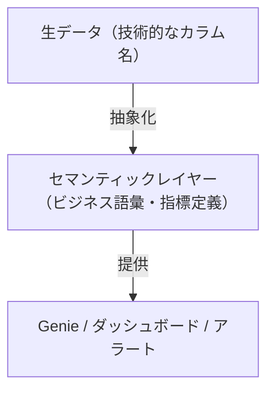
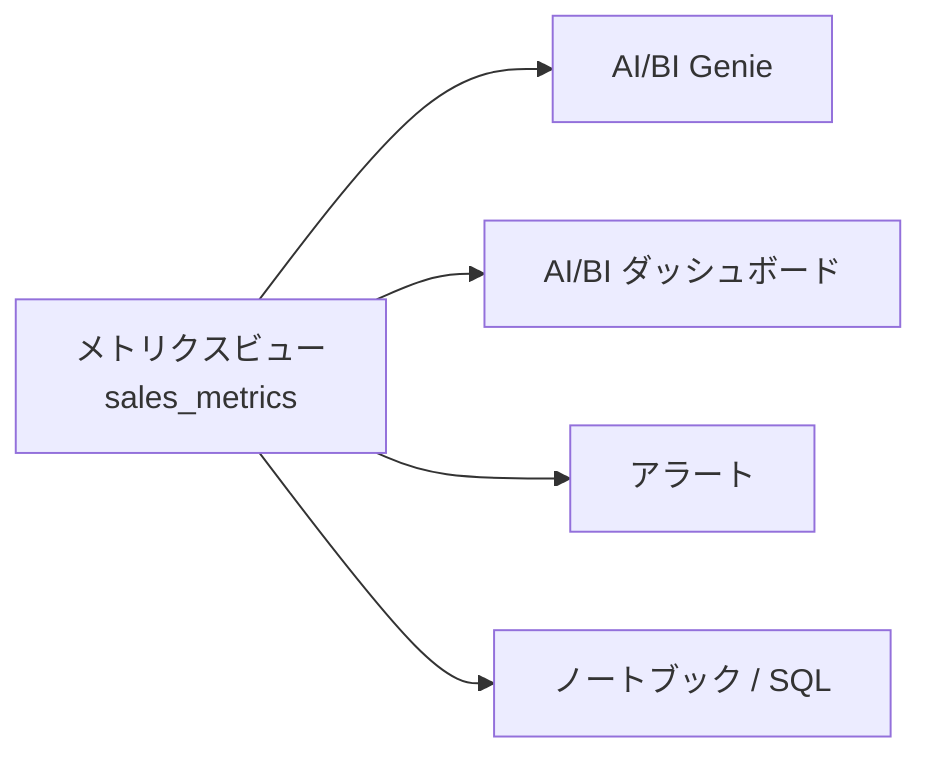
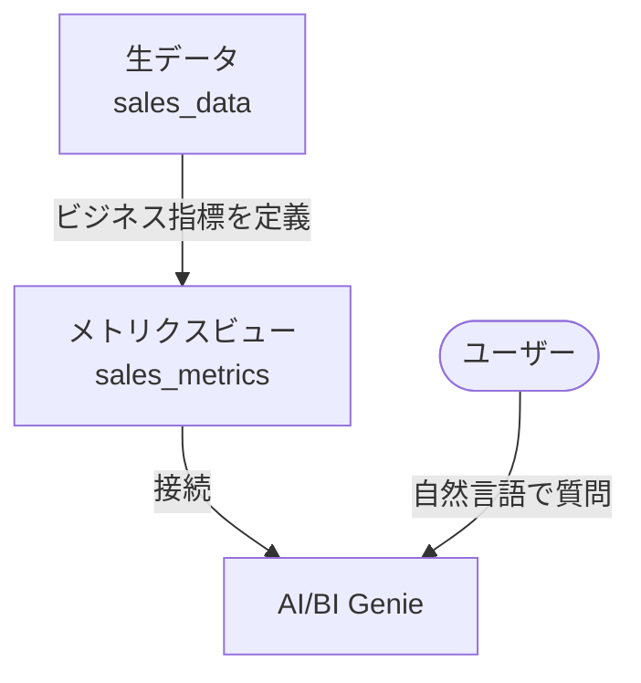
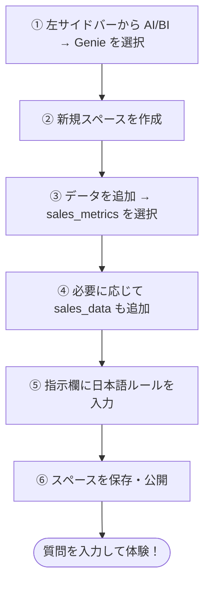

# はじめに

Databricksの[**AI/BI Genie**](https://www.databricks.com/jp/product/business-intelligence/ai-bi-genie)は自然言語でデータを分析できるツールですが、生テーブルに接続するだけでは回答精度に限界があります。ビジネス用語の定義が曖昧だったり、複雑な計算式をGenieが毎回解釈し直すため、同じ質問でも異なる結果が返ってくることがあります。

この問題を解決するのが[**Unity Catalogのメトリクスビュー（Metric Views）**](https://docs.databricks.com/aws/ja/metric-views)です。メトリクスビューはGenieにとっての**セマンティックレイヤー**として機能し、ビジネス指標を一元定義することでGenieの回答精度を大幅に向上させます。

本記事では、日本の小売売上データを使って、メトリクスビューとGenieの連携を実際に体験する方法を解説します。

# メトリクスビューはGenieのセマンティックレイヤー

## セマンティックレイヤーとは

**セマンティックレイヤー**とは、生データとBI/AIツールの間に置く「ビジネス語彙の翻訳層」です。エンジニアが定義したテーブルのカラム名（`amount`、`refund`など）を、ビジネスユーザーが使う言葉（「売上」「純売上」）にマッピングする役割を担います。



## メトリクスビューがセマンティックレイヤーとして機能する仕組み

Databricksのメトリクスビューは、以下の3つの要素でセマンティックレイヤーを実現します。

| 要素 | 役割 | Genieへの効果 |
|------|------|--------------|
| **ディメンション定義** | 「地域」「月」などの切り口を明示 | 「地域別に見せて」が正確に解釈される |
| **メジャー定義** | `SUM(amount - refund)` を `total_sales` として定義 | 「純売上」と聞かれたとき常に同じ計算が使われる |
| **セマンティックメタデータ** | 表示名・類義語・フォーマットを付与 | 「売上高」「売り上げ」などの表記ゆれにも対応 |

## セマンティックメタデータの活用（YAML v1.1）

YAML定義バージョン`1.1`以降では、`display_name`（表示名）・`synonyms`（類義語）・`format`（表示形式）を指定できます。これらはGenieがSQL生成時に参照するメタデータとして機能します。

```sql
CREATE OR REPLACE VIEW takaakiyayoi_catalog.metrics_view.sales_metrics
WITH METRICS
LANGUAGE YAML
AS $$
  version: 1.1
  source: takaakiyayoi_catalog.metrics_view.sales_data
  dimensions:
    - name: region
      expr: region_name
      display_name: 販売地域
      synonyms:
        - エリア
        - 地域
        - 都市
  measures:
    - name: total_sales
      expr: "SUM(amount - refund)"
      display_name: 純売上合計
      synonyms:
        - 売上
        - 売上高
        - 純売上
        - 売り上げ
      format:
        type: number
$$;
```

`synonyms`に「売上高」「売り上げ」を登録しておくことで、ユーザーがどの表記でGenieに質問してもメトリクスビューの定義が参照されます。

## 「一度定義、どこでも使える」の意義

メトリクスビューはUnity Catalogに登録されるため、Genie以外のツールでも同じ定義が使われます。



「売上」の定義を変えたいときはメトリクスビューを1か所修正するだけで、すべての消費先に反映されます。

# デモの構成



## なぜメトリクスビューがGenieを強化するのか

| 課題 | 生テーブルのみ | メトリクスビュー利用 |
|------|--------------|-------------------|
| 指標の一貫性 | ❌ 毎回SQL定義が必要 | ✅ 定義済みの指標を再利用 |
| ビジネス用語 | ❌ 技術的なカラム名 | ✅ 日本語コメント・類義語付き |
| 複雑な計算 | ❌ Genieが毎回計算 | ✅ メジャーとして事前定義済み |
| 表記ゆれへの対応 | ❌ 質問の言葉次第で結果が変わる | ✅ synonymsで複数表記を吸収 |

# 前提条件

- Databricksワークスペース（Unity Catalog有効）
- ProまたはサーバーレスSQLウェアハウス
- Databricks Runtime **17.2以降**（メトリクスビュー対応）
- メトリクスビューは**パブリックプレビュー**機能

# ステップ1: 生データの確認

まず、元となる生データを確認します。本デモでは日本の小売売上データを使います。

```sql
SELECT *
FROM takaakiyayoi_catalog.metrics_view.sales_data
ORDER BY order_date
LIMIT 10
```

|order_date|region_name|product_category|customer_id|amount|refund|
|---|---|---|---|---|---|
|2024-01-15|東京|家電|C001|50000|0|
|2024-01-16|大阪|アパレル|C002|30000|5000|
|2024-01-17|東京|食品|C003|20000|0|
|2024-01-18|名古屋|家電|C001|80000|0|
|2024-01-20|東京|アパレル|C004|45000|0|
|2024-02-01|大阪|家電|C002|60000|10000|
|2024-02-05|東京|食品|C005|15000|0|
|2024-02-10|名古屋|アパレル|C003|35000|0|
|2024-02-15|東京|家電|C001|90000|5000|
|2024-02-20|大阪|食品|C006|25000|0|

| カラム名 | 型 | 内容 |
|---------|-----|------|
| `order_date` | STRING | 注文日（例: `2024-01-15`） |
| `region_name` | STRING | 販売地域（東京、大阪、名古屋など） |
| `product_category` | STRING | 商品カテゴリ（家電、アパレル、食品など） |
| `customer_id` | STRING | 顧客ID |
| `amount` | INT | 注文金額（円） |
| `refund` | INT | 返金額（円） |

**課題：** 生データのまま「売上合計」を分析しようとすると、毎回 `amount - refund` の計算が必要です。Genieがこの計算を常に正しく行うとは限りません。

# ステップ2: メトリクスビューの作成

メトリクスビューは `CREATE OR REPLACE VIEW ... WITH METRICS` 構文でYAMLを使って定義します。ディメンション（切り口）とメジャー（集計値）を明示的に分けて定義するのが特徴です。

```sql
CREATE OR REPLACE VIEW takaakiyayoi_catalog.metrics_view.sales_metrics
WITH METRICS
LANGUAGE YAML
AS $$
  version: 1.1
  comment: "日本の小売売上メトリクスビュー"
  source: takaakiyayoi_catalog.metrics_view.sales_data
  dimensions:
    - name: order_date
      expr: order_date
      comment: 注文日
    - name: order_month
      expr: "DATE_TRUNC('MONTH', CAST(order_date AS DATE))"
      comment: 注文月
    - name: region
      expr: region_name
      comment: 販売地域
    - name: product_category
      expr: product_category
      comment: 商品の分類
  measures:
    - name: total_sales
      expr: "SUM(amount - refund)"
      comment: 返品控除後の純売上
    - name: order_count
      expr: "COUNT(*)"
      comment: 注文の総数
    - name: avg_order_value
      expr: "AVG(amount - refund)"
      comment: 1注文あたりの平均金額
    - name: customer_count
      expr: "COUNT(DISTINCT customer_id)"
      comment: ユニーク顧客数
$$;
```

**ポイント：**
- `total_sales` = `amount - refund`（返品控除済み）として**一度だけ定義**
- 日本語コメントを付けることでGenieがビジネス用語を正確に理解
- ディメンションとメジャーが明確に分離されているので、Genieが誤った集計をしにくくなる

## メトリクスビューの構造確認

```sql
DESCRIBE TABLE takaakiyayoi_catalog.metrics_view.sales_metrics
```

| カラム名 | 型 | コメント |
|---------|-----|---------|
| `order_date` | STRING | 注文日 |
| `order_month` | TIMESTAMP | 注文月 |
| `region` | STRING | 販売地域 |
| `product_category` | STRING | 商品の分類 |
| `total_sales` | LONG | **返品控除後の純売上** |
| `order_count` | LONG | 注文の総数 |
| `avg_order_value` | DOUBLE | 1注文あたりの平均金額 |
| `customer_count` | LONG | ユニーク顧客数 |

カタログエクスプローラでも確認できます。


プレビューでUIでの編集もできるようになっていました。


# ステップ3: メトリクスビューのクエリ

メトリクスビューのクエリには **`MEASURE()`関数** が必要です。メジャーカラムを`MEASURE()`でラップしないとエラーになります。

```
[METRIC_VIEW_MISSING_MEASURE_FUNCTION] The usage of measure column [total_sales]
of a metric view requires a MEASURE() function to produce results.
```

また、メトリクスビューは **`SELECT *` に非対応**です。取得するディメンションとメジャーを明示的に指定してください。

## MEASURE()関数の使い方

```sql
-- ✅ 正しい書き方：メジャーカラムはMEASURE()でラップ
SELECT region, MEASURE(total_sales) FROM sales_metrics GROUP BY region

-- ❌ エラーになる書き方
SELECT region, total_sales FROM sales_metrics GROUP BY region

-- ❌ SELECT * は非対応
SELECT * FROM sales_metrics
```

また、日本語エイリアスはバッククォートで囲む必要があります。

```sql
-- ✅ 正しい書き方（AS句・ORDER BY句ともにバッククォート）
MEASURE(total_sales) AS `純売上合計`
ORDER BY `純売上合計` DESC

-- ❌ エラーになる書き方
MEASURE(total_sales) AS 純売上合計
ORDER BY 純売上合計 DESC
```

## 月別売上推移

```sql
SELECT
    order_month,
    MEASURE(total_sales)     AS `純売上合計`,
    MEASURE(order_count)     AS `注文数`,
    MEASURE(avg_order_value) AS `平均注文金額`,
    MEASURE(customer_count)  AS `顧客数`
FROM takaakiyayoi_catalog.metrics_view.sales_metrics
GROUP BY order_month
ORDER BY order_month
```

|order_month|純売上合計|注文数|平均注文金額|顧客数|
|---|---|---|---|---|
|2024-01-01T00:00:00.000+00:00|220000|5|44000|4|
|2024-02-01T00:00:00.000+00:00|210000|5|42000|5|

## 地域別売上ランキング

```sql
SELECT
    region,
    MEASURE(total_sales)     AS `純売上合計`,
    MEASURE(order_count)     AS `注文数`,
    MEASURE(avg_order_value) AS `平均注文金額`,
    MEASURE(customer_count)  AS `顧客数`
FROM takaakiyayoi_catalog.metrics_view.sales_metrics
GROUP BY region
ORDER BY `純売上合計` DESC
```

|region|純売上合計|注文数|平均注文金額|顧客数|
|---|---|---|---|---|
|東京|215000|5|43000|4|
|名古屋|115000|2|57500|2|
|大阪|100000|3|33333.333333333336|2|

## 商品カテゴリ別パフォーマンス

```sql
SELECT
    product_category,
    MEASURE(total_sales)     AS `純売上合計`,
    MEASURE(order_count)     AS `注文数`,
    MEASURE(avg_order_value) AS `平均注文金額`
FROM takaakiyayoi_catalog.metrics_view.sales_metrics
GROUP BY product_category
ORDER BY `純売上合計` DESC
```

|product_category|純売上合計|注文数|平均注文金額|
|---|---|---|---|
|家電|265000|4|66250|
|アパレル|105000|3|35000|
|食品|60000|3|20000|

# ステップ4: GenieスペースにメトリクスビューをHTMLで追加する

Genieスペースを作成し、データソースとしてメトリクスビューを追加します。

## UIからの設定手順




## Genieスペースの指示（Instructions）

Genieスペースの「指示」欄に以下を入力すると、日本語での応答精度がさらに向上します。

```
- 日本語で回答してください
- 売上の集計には必ず返品控除後の純売上（total_sales）を使用してください
- 金額は円単位で表示し、カンマ区切りで表示してください
- グラフで表示できる場合はグラフを使ってください
```

# ステップ5: Genieで自然言語クエリを体験

メトリクスビューを接続したGenieスペースに、以下の質問を日本語で入力してみましょう。

## 基本的な質問

```
月別の売上合計を教えてください
```


```
地域別の売上ランキングを教えてください
```

```
平均注文金額が最も高い商品カテゴリはどれですか？
```

## 分析的な質問

```
東京と大阪の売上を月別に比較してください
```


```
家電カテゴリの売上トレンドを見せてください
```

```
前月比で売上が最も伸びた地域はどこですか？
```

## ビジネスインサイトを引き出す質問

```
返品控除後の純売上が最も高い月はいつですか？
```


```
顧客一人あたりの平均注文金額を地域別に教えてください
```

メトリクスビューに`total_sales`が「返品控除後の純売上」として定義されているため、「純売上」という言葉を使った質問にも正確に答えられます。

# メトリクスビューなしとの比較

| 質問 | 生テーブルのみ | メトリクスビュー利用 |
|------|------------|------------------|
| 「売上合計を教えて」 | `amount`の合計か`amount-refund`かが不明確 | `total_sales`（返品控除済み）を使用 |
| 「純売上は？」 | 毎回計算ロジックが異なる可能性 | 定義済みの`total_sales`を参照 |
| 「地域別ランキング」 | 集計定義が曖昧になりやすい | ディメンション定義に従って正確に集計 |
| 「顧客数」 | `COUNT(*)`か`COUNT(DISTINCT)`か不明 | `customer_count`（ユニーク）として定義済み |

# まとめ

メトリクスビューをGenieに接続することで：

- ✅ **ビジネス指標の「信頼できる唯一の情報源（SSOT）」** として機能
- ✅ **日本語コメント付きのカラム定義**でGenieの理解度が向上
- ✅ **返品控除後の純売上**など複雑な指標も自動的に正しく計算
- ✅ **誰がいつ聞いても同じ定義**で一貫した回答が得られる

## クエリ作成時の注意点まとめ

| 項目 | ルール |
|------|-------|
| メジャーカラムの取得 | `MEASURE(カラム名)` でラップ必須 |
| `SELECT *` | **非対応**。ディメンション・メジャーを明示的に指定 |
| 日本語エイリアス（AS句） | バッククォートで囲む（例: `` AS `純売上合計` ``） |
| 日本語エイリアス（ORDER BY句） | バッククォートで囲む（例: `` ORDER BY `純売上合計` DESC ``） |
| 必要なコンピュート | DBR 17.2以降、またはProもしくはサーバーレスSQLウェアハウス |

# 参考リンク

- [Unity Catalog メトリクスビュー概要](https://docs.databricks.com/ja/metric-views/index.html)
- [メトリクスビューの作成（SQL）](https://docs.databricks.com/ja/metric-views/create/sql.html)
- [メトリクスビューのYAMLリファレンス](https://docs.databricks.com/ja/metric-views/yaml-ref.html)（本文は英語）
- [メトリクスビューでセマンティックメタデータを使用する](https://docs.databricks.com/ja/metric-views/data-modeling/semantic-metadata.html)
- [MEASURE集計関数リファレンス](https://docs.databricks.com/ja/sql/language-manual/functions/measure.html)
- [AI/BI Genieスペースとは](https://docs.databricks.com/ja/genie/index.html)
- [AI/BI Genieスペースの設定と管理](https://docs.databricks.com/ja/genie/set-up.html)
- [Databricks AI/BI](https://docs.databricks.com/ja/ai-bi/index.html)
- [Databricksのメトリクスビュー（過去記事）](https://qiita.com/taka_yayoi/items/0b57f38c05b2c4720ed1)

### はじめてのDatabricks

[はじめてのDatabricks](https://qiita.com/taka_yayoi/items/8dc72d083edb879a5e5d)

### Databricks無料トライアル

[Databricks無料トライアル](https://databricks.com/jp/try-databricks)
