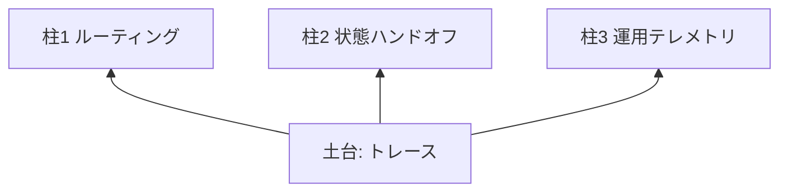
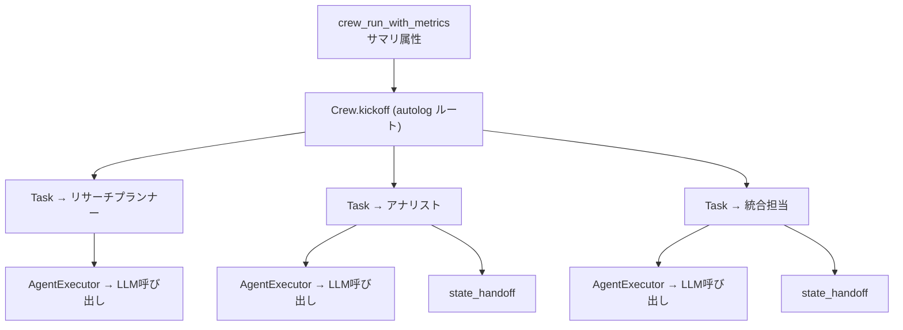
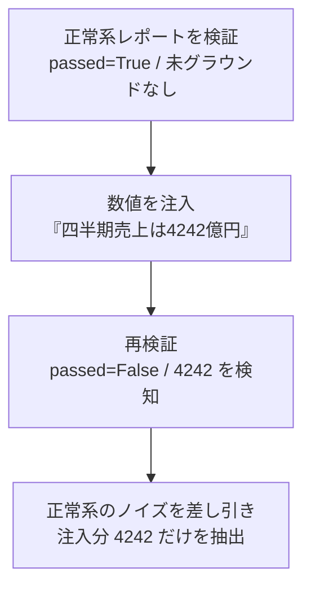

# はじめに

マルチエージェントを組むこと自体は、いまや難しくありません。難しいのは、エージェント同士が会話を始めて初めて表面化する subtle な失敗を捕まえることです。あるエージェントの誤った数値が下流に伝播するカスケードエラー、ハルシネーションが共有コンテキストに書き込まれて「事実」になる共有メモリ汚染、応答待ちのまま静かに停止するループ。これらは最終出力が一見もっともらしく見えるため、入出力だけ眺めていても気づけません。

MLflowのブログ [Seeing Inside Your Multi-Agent System with MLflow](https://mlflow.org/blog/observability-multi-agent-part-1/) は、この問題を「モニタリングから可観測性へ」という言葉で整理しています。本記事は、このブログのローカル例 ([公式リポジトリ](https://github.com/oleksandrabovkun/mlflow-examples/tree/main/mlflow-crewai-observability)) を、Databricksのマネージド MLflow と基盤モデルで動くように書き換えて再現したものです。あわせて、再現の過程でぶつかったバージョン依存の落とし穴も共有します。 本記事で使った完全なノートブックは [こちらのリポジトリ](https://github.com/taka-yayoi/mlflow-llmops-articles/tree/main/mlflow-crewai-observability-databricks) に置いています。本文には要点の抜粋を載せ、省略している箇所 (`...` で詰めた部分など) を含む動く完全版はそちらを参照してください。

# モニタリングと可観測性は何が違うのか

最初に、記事の背骨になる対比を押さえておきます。

単一エージェントなら、何が入って何が出たかを見れば十分です。おかしければプロンプトと応答を読めば原因にたどり着けます。これは入出力の **モニタリング** で足りる、線形の世界です。

マルチエージェントになると、最終出力が一見まともでも、その裏でオーケストレーターがなぜその委任をしたのか、エージェント間で何が受け渡されたのか、どこで狂い始めたのかが、入出力だけでは見えません。だから分析の単位が「プロンプト」から「状態遷移 (state transition)」へ移り、内部を後から辿れる **可観測性** が必要になります。

なお、ここでいう可観測性は「品質を採点する評価 (Evaluation)」とは別の軸です。評価は出てきたものが良いか悪いかを判定する話、可観測性は中で何が起きたかを辿れるようにする話で、本記事の主題は後者です。

この再現サンプルは、可観測性を二層構成で実現します。トレースが「何が起きたか」を、メトリクスが「それが許容範囲だったか」を教えます。



# 作るものの全体像

題材は「国内製造業における生成AI導入の利点と課題」を分析する、3エージェントの逐次パイプラインです。プランナーが調査計画を立て、アナリストが分析し、統合担当がレポートにまとめます。元記事もこの逐次 (sequential) 構成で、オーケストレーターが委任先を動的に選ぶスーパーバイザー型ではありません。


実装はこの順で進みます。括弧内が対応する可観測性の要素です。

1. 共有状態とハンドオフ効率スコア (柱2の道具を先に用意)
2. ルーティング追跡と状態ハンドオフの記録ロジック (柱1・柱2)
3. エージェントとタスクの定義 (記録ロジックをコールバックで配線)
4. 運用テレメトリでクルー全体をラップ (柱3)
5. 異常系の注入 (メトリクスが点灯することを確認)

# Databricksでのセットアップ

トラッキングサーバーを自前で立てる必要はありません。トラッキングURIを `databricks` にして自動トレースを有効化するだけです。LLMはDatabricksのOpenAI互換エンドポイント (基盤モデル) を呼びます。

```python
import mlflow
from crewai import LLM

# CrewAIワークフローのネストされたトレースを自動キャプチャ
mlflow.crewai.autolog()

mlflow.set_tracking_uri("databricks")
mlflow.set_experiment("/Shared/crewai-observability-demo")

# ノートブックコンテキストからホストとトークンを取得
ctx = dbutils.notebook.entry_point.getDbutils().notebook().getContext()
DATABRICKS_HOST = ctx.apiUrl().get()
DATABRICKS_TOKEN = ctx.apiToken().get()

# OpenAI互換エンドポイント経由でLLMを呼ぶ
llm = LLM(
    model="openai/databricks-llama-4-maverick",  # 環境に合わせて変更
    base_url=f"{DATABRICKS_HOST}/serving-endpoints",
    api_key=DATABRICKS_TOKEN,
    temperature=0.2,
)
```

エンドポイント名 (`databricks-llama-4-maverick` 等) は環境に合わせて差し替えてください。`mlflow.crewai.autolog()` が、各タスクと実行エージェント、すべてのLLM呼び出しの入出力、各操作のレイテンシーを自動でキャプチャします。詳細は [CrewAIトレース (Databricks 日本語ドキュメント)](https://docs.databricks.com/gcp/ja/mlflow3/genai/tracing/integrations/crewai) を参照してください。サーバーレスコンピュートでは自動有効化されないため、この一行を明示的に呼ぶ必要があります。

本番ではトークンをハードコードせず、Databricksシークレットまたは AI Gateway を使ってください。

# ハマりどころ (再現時に踏んだ3つ)

同じ構成を試す人がほぼ確実に踏むので、回避策込みで残しておきます。

## 1. イベントループのガード

Databricksノートブックのカーネルはすでにasyncioイベントループを動かしているため、CrewAIの同期 `kickoff()` が次のエラーで弾かれます。

```
RuntimeError: Agent execution was invoked synchronously from within a running event loop.
```

`kickoff_async()` に切り替えるとMLflowのCrewAIトレースが取れなくなる (同期実行のみ対応) ため、ここはイベントループを持たないワーカースレッドで `kickoff()` を回して回避します。注意点は、単純にスレッドを起こすとMLflowのトレースコンテキストが伝播せず親子関係が切れることです。`contextvars.copy_context()` でコピーして渡すと、トレースのネストを維持できます。

```python
import contextvars
from concurrent.futures import ThreadPoolExecutor

def _kickoff_sync_in_worker_thread(crew):
    ctx = contextvars.copy_context()  # アクティブなスパンごとコピー
    with ThreadPoolExecutor(max_workers=1) as ex:
        return ex.submit(ctx.run, crew.kickoff).result()
```

## 2. cache_breakpoint が弾かれる

LLM呼び出しが次のエラーで失敗することがあります。

```
BadRequestError: ... Bad request: json: unknown field "cache_breakpoint"
```

これはCrewAIの既知の不具合 ([issue #5886](https://github.com/crewAIInc/crewAI/issues/5886)) で、非Anthropicプロバイダー向けにも `cache_breakpoint` がメッセージに差し込まれ、基盤モデルのエンドポイントに「未知のフィールド」として弾かれます。プロバイダーを変えても直らないので、breakpointを付与する関数を無効化して回避します。

```python
try:
    import crewai.llms.cache as _crewai_cache
    _crewai_cache.mark_cache_breakpoint = lambda msg: msg
except Exception:
    pass
```

## 3. autolog の非致命的な ERROR

セットアップ時に、次のERRORがログに出ることがあります。

```
ERROR mlflow.crewai: An exception happens when applying auto-tracing to crewai.
Exception: No module named 'crewai.agents.agent_builder.base_agent_executor_mixin'
```

これは長期メモリ用スパンのパッチ1つだけが、CrewAIのバージョン差でモジュール解決に失敗しているもので、Crew / Task / Agent / LLM のトレースは正常に効きます。メモリ機能を使っていなければ実害はありません。むしろ、ERRORログ1行に埋もれて処理が続行し、一見成功して見えるこの挙動こそ、元記事が戒める「subtle な失敗はログの奥で静かに進む」の好例です。判断はログの断片ではなく、トレースツリーという一次情報で行うべき、という教訓になります。

# クルーの定義と実行

各タスクの `callback` で出力を共有状態に書き込み、前段から次段へのハンドオフを記録します。クルー全体は `@mlflow.trace` のラッパーで包み、総実行時間などのサマリ指標をルート付近のスパンに載せます。

```python
@mlflow.trace(name="crew_run_with_metrics", span_type="CHAIN")
def run_crew_with_metrics(crew):
    delegation_counts.clear()  # 実行間でリセットしループ誤検知を防ぐ
    result = _kickoff_sync_in_worker_thread(crew)
    span = mlflow.get_current_active_span()
    if span is not None:
        span.set_attributes({
            "crew.total_duration_s": ...,
            "planner.output_chars": ...,
            "analyst.output_chars": ...,
            "synthesist.output_chars": ...,
        })
    return result

crew = Crew(
    agents=[planner, analyst, synthesist],
    tasks=[plan_task, analysis_task, synthesis_task],
    process=Process.sequential,
    step_callback=track_routing,  # 柱1
    verbose=True,
)
result = run_crew_with_metrics(crew)
```

# トレースの確認 (土台)

ここが元記事の一番の見どころです。autologが効くと、ブラックボックスだった実行が、ネストされた状態遷移のマップになります。`crew_run_with_metrics` の下に autolog の `Crew.kickoff` があり、その下に各タスク、エージェント、LLM呼び出しがぶら下がります。




実行時の詳細なグラフはこのトレースUIで見られます。一方、エージェント構成は逐次の一本道なので、設計上の全体像は前掲のパイプライン図 (プランナー → アナリスト → 統合担当) がそのまま対応します。両方を併せて見ると、どう組んだかと、実際にどう動いたかがつながります。

# 3つのメトリクスの柱 (上層)

トレースが見えるようになった上に、挙動の良し悪しを判定する数値を載せます。

**柱1 ルーティング** は「スーパーバイザーが適切な相手に効率よく振っているか」を見ます。`step_callback` で委任回数やループの兆候 (`routing.loop_detected`) を記録します。

**柱2 状態ハンドオフ** は「あるエージェントの微妙に誤った出力が、下流で真実として扱われていないか」を捉えます。前段の出力が次段にどれだけ引き継がれたかを、文字bigram (隣り合う2文字の組) の重複で測ります。元記事は英語前提で空白区切りの単語重複を使っていましたが、日本語は空白で区切られないため文字bigramに替えています。追加のLLM呼び出しなしで計算できる軽い指標です。

```python
def handoff_efficiency_score(output_text, next_input_text):
    a = _char_bigrams(output_text)
    b = _char_bigrams(next_input_text)
    return len(a & b) / len(a) if a else 0.0
```

**柱3 運用テレメトリ** は「正しい答えが、壊滅的な運用上の失敗を覆い隠していないか」を見ます。正解を返していても、その裏で再帰呼び出しやリトライ、応答待ちで時間を浪費しているかもしれません。総実行時間やトークンコスト、レイテンシーのボトルネックを記録します。

# 異常系で点灯させる

ここまでは正常に完了するパイプラインでした。元記事の主眼は「カメラを設置すること」ではなく「カメラが何を映すか」です。そこで、今回の逐次構成で意味を持つ2つの失敗モードをわざと注入し、メトリクスが点灯する様子を確認します。LLMの非決定性のため毎回の自然な再現は困難なので、決定論的に注入して検知ロジックが反応することを示します。

## 失敗モード1: カスケードした数値エラー

専門エージェントが制約を取り違え、その誤った数値が下流のレポートに伝播する状況です。検知は、レポートに出てくる数値が、ソース (分析結果) にも存在するかを突き合わせる **簡易チェック (機械的な数値の突き合わせ)** で行います。意味を理解しているわけではなく、数値の集合を比較しているだけです。

流れは「正常系を検証 → 誤った数値を注入 → 再検証 → 注入分だけを抽出」です。



実行すると、各ステップの意味が上から追える形でログが出ます。

```text
[1] 正常系ランの結果を取得  (ソース 1644字 / レポート 1214字)
[2] 正常系レポートを検証     -> passed=True / ソースに無い数値=なし
    レポート中の数値はすべてソースに裏づけられており、健全な状態です。
[3] カスケードエラーを注入   -> 追記した一文:「なお試算では四半期売上は4242億円に達する見込みです。」
[4] 汚染レポートを検証       -> passed=False / ソースに無い数値=['4242']
[5] 正常系のノイズを差し引いて、注入で新たに増えた数値だけを抽出
    -> 検知された注入数値: ['4242']
結論: でっち上げられた数値 4242 だけが、ソース未裏づけとしてフラグされました。
```


正常系を先に検証するのは、簡易チェックに乗るノイズ (言い換えや表記揺れによる誤検知) を基準として差し引き、注入した数値だけをきれいに分離するためです。

## 失敗モード2: コンテキストの取りこぼし

共有メモリ汚染や情報落ちの前兆を、柱2のハンドオフ効率で見ます。次段が受け取るコンテキストをわざと切り詰めて、スコアが落ちる様子を正常値と並べます。

```python
healthy = handoff_efficiency_score(plan, analysis)        # 0.618
starved = handoff_efficiency_score(plan, analysis[:150])  # 0.162
```

```text
正常なハンドオフ効率: 0.618
コンテキスト切り詰め後: 0.162
=> スコアの低下が情報落ちのシグナルになります。
```


スコアが0.618から0.162へ落ちることで、コンテキストの取りこぼしがメトリクスとして観測できることが分かります。なお、この指標は段を通り抜ける間にどれだけ前段の内容が残ったかを簡易的に見るもので、引き継ぎ度合いのあくまで目安です。

# 限界と正直な注意

説得力のために、この再現サンプルの限界も明記しておきます。

数値の突き合わせは簡易チェックです。数字が一致しても意味が正しいとは限らず (「売上20%増」と「コスト20%増」は区別できない) 、表記揺れにも弱いです。1桁数字の除外や桁区切りの正規化で粗は減らしていますが、完璧ではありません。

より本質的な点として、今回はソース自体がLLM生成です。そのため、この検証が保証しているのは「レポートの数値がソースと整合しているか (段間の一貫性)」であって、「その数値が事実か (現実との一致)」ではありません。元記事の公式リポジトリは、World Bankの実データを返すツールをエージェントに持たせることで、ここを本当のグラウンディング検証に格上げしています。Databricksなら、Unity Catalogのテーブルや `ai_query`、公開APIなどを同じ役割のツールに据えると、トレースに「エージェント → ツール → 外部データ」の実際のホップが現れ、検証が事実性まで踏み込めます。

ループ (同じエージェントの過剰な再実行や応答待ちでの停止) は、今回の一本道の逐次構成では構造的に発生しにくいため扱っていません。`routing.loop_detected` のような指標は、スーパーバイザー型やツールを持つ構成で効いてきます。

# まとめ

土台のトレース (autologによるネストされたエージェントグラフ) と、その上のメトリクス (3つの柱) が揃って初めて、「状態遷移を可視化したうえで挙動の良し悪しを判定する」可観測性が成立します。Databricksでは、マネージド MLflow と基盤モデルのおかげで、トラッキングサーバーを立てずにこの二層をそのまま再現できました。

元記事はシリーズのPart 1で、ここまでは受動的な観察です。続くPart 2では、安全性の強制・コスト管理・問題の未然防止といった能動的なステアリング (ガバナンス) が扱われます。本記事のサンプルは、その土台に当たります。トレースをUnity Catalogに蓄積すれば、アクセス制御やSQL・ダッシュボードからのクエリにもつながり、可観測性を運用面まで広げられます。

# 参考

- 本記事のノートブック (完全版): https://github.com/taka-yayoi/mlflow-llmops-articles/tree/main/mlflow-crewai-observability-databricks
- 元ブログ (Part 1): https://mlflow.org/blog/observability-multi-agent-part-1/
- 元リポジトリ (ローカル例): https://github.com/oleksandrabovkun/mlflow-examples/tree/main/mlflow-crewai-observability
- CrewAIトレース (Databricks 日本語ドキュメント): https://docs.databricks.com/gcp/ja/mlflow3/genai/tracing/integrations/crewai

### はじめてのDatabricks

[はじめてのDatabricks](https://qiita.com/taka_yayoi/items/8dc72d083edb879a5e5d)

### Databricks無料トライアル

[Databricks無料トライアル](https://databricks.com/jp/try-databricks)
