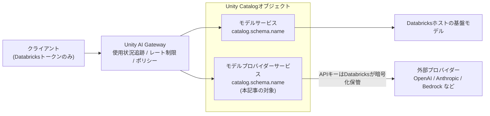
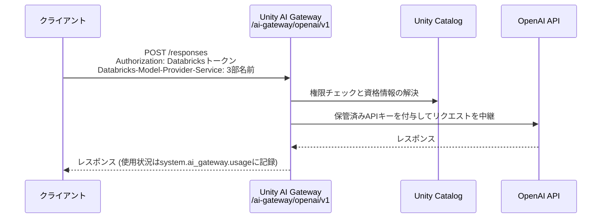

# はじめに

先日の[Databricks Unity AI Gateway 最新ガイド — 新しいタブ構成 (モデル/プロバイダー/MCP) を実機で触る](https://qiita.com/taka_yayoi/items/ad26c6ce5165ef691e00)では、Unity AI Gateway (ベータ) の新しい5タブ構成を実機でウォークスルーしました。その際、プロバイダータブについては「ベータの専用操作ドキュメントが現時点では見当たりません」と書いていたのですが、その約2週間後に公式ドキュメントが整備されました。

- [モデルプロバイダーサービス](https://docs.databricks.com/aws/ja/ai-gateway/model-provider-services)

そこで本記事では、このモデルプロバイダーサービスを実機 (東京リージョンのワークスペース) で作成し、クエリ、権限、使用状況追跡まで一通り検証します。ポイントは一つで、**モデルサービスに続いて、外部モデルプロバイダー (OpenAI/Anthropic/Bedrockなど) もUnity Catalogのセキュラブルオブジェクトとして登録・統治できるようになった**ということです。

なお、Unity AI Gatewayは現時点でベータ版です。アカウント管理者がアカウントコンソールの[プレビューページ](https://docs.databricks.com/aws/ja/admin/workspace-settings/manage-previews)から有効化する必要があります。ベータ期間中は料金が発生しません。

# モデルプロバイダーサービスとは

モデルプロバイダーサービスは、外部の基盤モデルプロバイダーをUnity Catalogに登録するためのセキュラブルオブジェクトです。テーブルやボリュームと同じく`catalog.schema.name`の3部構成の名前を持ち、UCの権限モデルでアクセス制御されます。

Unity AI Gateway全体の中での位置づけを図にすると以下のようになります。



モデルサービスとモデルプロバイダーサービスは、どちらもUnity Catalogオブジェクトとして登録され、Unity AI Gatewayのガバナンス (権限、レート制限、ポリシー、使用状況追跡) を等しく受けます。違いはリクエストの行き先だけで、モデルサービスはDatabricksホストの基盤モデルへ、モデルプロバイダーサービスは外部プロバイダーへ中継されます。

旧来の仕組みと対比すると、この刷新の意味がはっきりします。従来、外部プロバイダーのモデルを使うには[外部モデル](https://docs.databricks.com/aws/ja/generative-ai/external-models/)サービングエンドポイントを作成していました。認証情報はエンドポイント単位で保持され、アクセス制御もCan Query/Can Manageというエンドポイント固有の体系でした。新構成では、外部プロバイダーそのものがUCオブジェクトになり、テーブルと同じ流儀の権限付与、リネージ、クロスワークスペースのガバナンスの対象になります。

APIキーなどの資格情報はDatabricksが暗号化して保管し、一度登録すると読み取りで返されることはありません。クライアント側にAPIキーを配布する必要がなくなるのが、運用上の大きなメリットです。

対応プロバイダーは、OpenAI、Azure OpenAI、Anthropic、Microsoft Foundry、Gemini Enterprise、Amazon Bedrock、カスタムです。

# モデルプロバイダーサービスの作成

サイドバーのAIゲートウェイからプロバイダータブを開き、作成画面に進みます。今回はOpenAIのgpt-5.4-nanoを登録します。


設定項目は以下の通りです。

- **名前**: カタログ、スキーマ、名前を指定します。今回は`takaakiyayoi_catalog.openai.external_openai_gpt5_4_nano`としました。名前は作成後に変更できません。UCオブジェクトらしい制約です。
- **プロバイダー**: OpenAI、Azure OpenAI、Anthropic、Microsoft Foundry、Gemini Enterprise、Amazon Bedrock、カスタムから選択します。
- **認証**: APIキーを入力します。ベースURLはオプションです (OpenAIの場合デフォルトは`https://api.openai.com/v1`)。
- **モデル**: このプロバイダーサービスで提供するモデルを選択します。

モデル選択画面で面白いのは、100万トークンあたりの外部価格 (IN/OUT) が一覧表示されることです。gpt-5.5 (IN: $5.00 / OUT: $30.00) からgpt-5.4-nano (IN: $0.20 / OUT: $1.25) まで、日付付きスナップショット込みで単価を見比べながらモデルを選べます。

また、「Allow all and auto-import new models」というチェックボックスがあり、プロバイダーが新モデルをリリースした際に自動で取り込むかを選べます。統制を重視するなら個別選択、利便性を重視するなら自動取り込みという、運用ポリシーの分岐点になる設定です。

作成をクリックすると、モデルプロバイダーサービスが登録されます。

# 詳細画面: モデルサービスと同じガバナンスパネル

作成直後に表示される詳細画面です。


概要タブには、公開しているモデルの一覧と外部価格、そして「始めましょう」ウィザードが表示されます。ウィザードはアクセストークンの生成と、最初のリクエスト送信のサンプル (cURL/Python/Codex) を案内してくれます。

右ペインには「ガバナンス設定」パネルがあり、4つのタスクのうち使用状況の追跡 (`system.ai_gateway.usage`への記録) は最初から有効です。残る推論テーブル、レート制限、ポリシーは個別にセットアップできます。このパネルはモデルサービスの詳細画面とまったく同じ構成で、外部プロバイダーがDatabricksホストのモデルと対等な統治対象になったことがUIからも見て取れます。ポリシー (ガードレール) の詳細については、以前書いた[Databricks Unity AI Gateway (Beta) のカスタムガードレールを LLM-as-a-judge で実装する](https://qiita.com/taka_yayoi/items/72d460292cdf90f5eda5)をご覧ください。

# クエリする: ヘッダーでUCオブジェクトを指定するルーティング

ここが本記事の技術的な見どころの一つです。ウィザードに表示されるcURLの例を見てみます。

```bash
curl https://<ワークスペースURL>/ai-gateway/openai/v1/responses \
  -H "Content-Type: application/json" \
  -H "Authorization: Bearer $DATABRICKS_TOKEN" \
  -H "Databricks-Model-Provider-Service: takaakiyayoi_catalog.openai.external_openai_gpt5_4_nano" \
  -d '{
    "model": "gpt-5.4-nano",
    "max_output_tokens": 256,
    "input": [
      {
        "role": "user",
        "content": [{"type": "input_text", "text": "Databricksとは何ですか"}]
      }
    ]
  }'
```

注目ポイントは3つあります。

まずエンドポイントのパスです。`{ワークスペースURL}/ai-gateway/openai/v1`となっており、Unity AI Gatewayエンドポイントの`/ai-gateway/mlflow/v1`とも、旧来のModel Servingの`/serving-endpoints`とも異なる、OpenAI互換の専用パスです。

次に、ルーティングの鍵となる`Databricks-Model-Provider-Service`ヘッダーです。ここにUnity Catalogの3部名前を指定することで、Gatewayがどのプロバイダーサービスに中継するかを解決します。エンドポイントを個別にデプロイするのではなく、**HTTPヘッダーでUCオブジェクトを名指しする**という設計です。

最後に、リクエストのボディがOpenAIの**Responses API**形式 (`input` / `input_text` / `output_text`) である点です。Chat Completionsではないので、既存コードを流用する際は注意が必要です。

このときのリクエストの流れを整理すると以下のようになります。クライアントが持つのはDatabricksトークンだけで、OpenAIのAPIキーは一切登場しません。



## ブラウザで試す

詳細画面の「ブラウザで試す」から、その場でクエリを実行できます。


「Databricksとは何ですか」というリクエストに対して、gpt-5.4-nanoからの日本語の応答が返ってきました。UIから一切コードを書かずに疎通確認できるのは便利です。

## ノートブックからOpenAI SDKでクエリ

次にノートブックからOpenAI SDKでクエリします。ライブラリを準備します。

```python
%pip install -U openai
%restart_python
```

`base_url`と`default_headers`の2点を設定するだけで、通常のOpenAI SDKの流儀のままクエリできます。

```python
from databricks.sdk import WorkspaceClient
from openai import OpenAI

w = WorkspaceClient()
DATABRICKS_TOKEN = w.tokens.create(
    comment="model-provider-service-test",
    lifetime_seconds=3600
).token_value

# モデルプロバイダーサービスの3部名前
PROVIDER_SERVICE = "takaakiyayoi_catalog.openai.external_openai_gpt5_4_nano"

# OpenAI互換の専用パス
BASE_URL = "https://<ワークスペースURL>/ai-gateway/openai/v1"

client = OpenAI(
    api_key=DATABRICKS_TOKEN,
    base_url=BASE_URL,
    default_headers={
        "Databricks-Model-Provider-Service": PROVIDER_SERVICE
    },
)

response = client.responses.create(
    model="gpt-5.4-nano",
    max_output_tokens=256,
    input=[
        {
            "role": "user",
            "content": [
                {"type": "input_text", "text": "Databricksとは何ですか"}
            ],
        }
    ],
)

print(response.output_text)
```

実行結果です。

```
Databricks は、データ分析・データ活用 (AI を含む) を行うためのクラウド/プラットフォームです。主に「大量のデータを集めて、加工して、分析して、学習に使う」ための仕組みを提供します。

主な特徴は次のとおりです。

- Apache Spark を基盤にしている (高速に大規模データを処理できる)
- データレイク (Data Lake) を活用できる設計 (いろいろな形式のデータをまとめて扱える)
- データ統合・前処理・分析・機械学習までを一つの環境で進めやすい
- 共同開発 (ノートブック等) がしやすい (チームで同じ環境を使える)

よく使われる用途としては、たとえば ETL (データ加工)、BI/可視化、需要予測などの機械学習、データ基盤の構築など
```

APIキーの管理をDatabricksに委ねたまま、OpenAI SDKの書き味そのままで外部モデルを利用できました。

# Unity Catalogオブジェクトとしての実証

「UCのセキュラブルオブジェクトになった」ことを、カタログエクスプローラーと権限の両面から確認します。

## カタログエクスプローラーでの見え方

カタログエクスプローラーでスキーマ`openai`を開くと、「モデル」と並んで「サービス」というカテゴリが表示され、その配下に`external_openai_gpt5_4_nano`が現れます。


つまりモデルプロバイダーサービスは、テーブルやモデルと同じようにカタログツリーの住人です。さらに、ツリーからオブジェクトを選択すると、AI Gatewayページとまったく同じ詳細画面 (始めましょうウィザードとガバナンス設定パネル) が開きます。専用UIが別にあるのではなく、同じUCオブジェクトへの入口が2つある、という構造です。

## 権限

詳細画面の権限タブから権限を付与できます。


付与できる権限は以下の4種です。

| 権限 | 説明 |
|---|---|
| EXECUTE | 機能、モデル、またはサービスを使用できる権限を付与する |
| READ METADATA | オブジェクトのすべてのメタデータ (権限やポリシーを含む) を表示できるようにする |
| ALL PRIVILEGES | すべての権限を付与 |
| MANAGE | 権限の管理、削除、名前の変更など、オブジェクトの所有権のような機能を提供 |

UC関数などでおなじみの`EXECUTE`権限が、外部モデルへのアクセス制御にそのまま拡張されています。旧来の外部モデルサービングエンドポイントにおけるCan Query/Can Manageという独自体系から、テーブルやボリュームと同じUC権限モデルへの統合です。「この部署にはこの外部モデルの利用を許可する」といった統制を、データと同じ流儀で運用できます。

なお、モデルプロバイダーサービスの作成には、スキーマに対する`CREATE SERVICE`と`CREATE CONNECTION`権限が必要です。インラインで資格情報を指定して作成すると、裏側でUnity Catalogの接続オブジェクトがプロビジョニングされる、という内部挙動になっています。

# 使用状況の追跡: system.ai_gateway.usage

使用状況は`system.ai_gateway.usage`システムテーブルに記録されます。まずスキーマを確認します。

```sql
DESCRIBE TABLE system.ai_gateway.usage;
```

実機でスキーマを確認したところ、モデルプロバイダーサービスの観点で注目すべきカラムがありました。

| カラム | 内容 |
|---|---|
| service_type | `MODEL_SERVICE` / `MCP_SERVICE` / `MODEL_PROVIDER_SERVICE`の3種 |
| service_name | サービスのUnity Catalog完全修飾名 (3部名前) |
| destination_model | 基盤モデル名 (例: `gpt-5.4-nano`) |
| input_tokens / output_tokens / total_tokens | トークン数 |
| token_details | キャッシュ読み取り、キャッシュ作成、推論トークンの内訳 |
| routing_information | プライマリとフォールバックの試行の詳細 |
| latency_ms / status_code | レイテンシとHTTPステータス |

`service_type`に`MODEL_PROVIDER_SERVICE`という値が定義されており、モデルサービス、MCPサービス、モデルプロバイダーサービスという3種のAI資産の使用状況が1つのテーブルに統合されています。`service_name`にはUCの3部名前がそのまま入るので、以下のようにフィルタできます。

```sql
SELECT
  event_time,
  service_type,
  service_name,
  destination_model,
  api_type,
  requester,
  input_tokens,
  output_tokens,
  total_tokens,
  latency_ms,
  status_code
FROM system.ai_gateway.usage
WHERE service_type = 'MODEL_PROVIDER_SERVICE'
  AND service_name = 'takaakiyayoi_catalog.openai.external_openai_gpt5_4_nano'
ORDER BY event_time DESC;
```

実行結果です。「ブラウザで試す」からの1件と、ノートブックからの1件が記録されています。

| event_time | service_type | destination_model | api_type | input_tokens | output_tokens | total_tokens | latency_ms | status_code |
|---|---|---|---|---|---|---|---|---|
| 2026-07-10T01:27:12 | MODEL_PROVIDER_SERVICE | gpt-5.4-nano | openai/v1/responses | 34 | 256 | 290 | 3380 | 200 |
| 2026-07-10T01:26:39 | MODEL_PROVIDER_SERVICE | gpt-5.4-nano | openai/v1/responses | 33 | 193 | 226 | 8560 | 200 |

`api_type`には`openai/v1/responses`と、どのAPI形式で呼ばれたかまで記録されています。また、ノートブックからのリクエスト (1件目) の`output_tokens`が256ちょうどになっており、`max_output_tokens=256`の上限で応答が打ち切られたことがテーブル側からも読み取れます。先ほどの実行結果が「〜など」で途切れていたのはこれが理由です。

作成画面で確認した外部価格を使えば、コストの推定もSQLで書けます。

```sql
SELECT
  service_name,
  destination_model,
  SUM(input_tokens) AS input_tokens,
  SUM(output_tokens) AS output_tokens,
  ROUND(SUM(input_tokens) * 0.20 / 1e6
      + SUM(output_tokens) * 1.25 / 1e6, 6) AS estimated_cost_usd
FROM system.ai_gateway.usage
WHERE service_type = 'MODEL_PROVIDER_SERVICE'
  AND destination_model = 'gpt-5.4-nano'
GROUP BY service_name, destination_model;
```

注意点が2つあります。まず、このテーブルの参照はアカウント管理者に限定されています。また、システムテーブルはリアルタイム反映ではなく、データは1日を通して更新されます。本検証でも、リクエスト直後のクエリではレコードがゼロで、しばらく待ってから上記の結果が確認できました。直近のリクエストが見えなくても、時間を置いてから確認してください。詳細は[Unity AI Gatewayサービスのモデル使用状況](https://docs.databricks.com/aws/ja/ai-gateway/usage-tracking-beta)をご覧ください。

# まとめ

モデルプロバイダーサービスによって、外部モデルプロバイダーの扱いは「サービングエンドポイントの設定項目」から「Unity Catalogのセキュラブルオブジェクト」へと変わりました。モデルサービスに続く、AI資産のUC一級市民化です。

実機で確認できたことを整理すると以下の通りです。

- APIキーはDatabricksが暗号化保管し、クライアントはDatabricksトークンだけで外部モデルをクエリできる
- ルーティングは`Databricks-Model-Provider-Service`ヘッダーによるUCオブジェクトの名指しで、エンドポイントの個別デプロイは不要
- カタログエクスプローラーのツリーに「サービス」として現れ、`EXECUTE`などのUC権限モデルでアクセス制御できる
- 使用状況は`system.ai_gateway.usage`に`MODEL_PROVIDER_SERVICE`として記録され、モデルサービスやMCPサービスと統合的に追跡できる

APIキーの集中管理、UC権限によるアクセス制御、統合された使用状況追跡が、テーブルやボリュームと同じ流儀で揃ったことになります。外部モデルの利用統制に悩んでいる組織にとって、試す価値のある機能だと思います。

# 参考リンク

- [モデルプロバイダーサービス](https://docs.databricks.com/aws/ja/ai-gateway/model-provider-services)
- [Unity AI GatewayによるAIガバナンス](https://docs.databricks.com/aws/ja/ai-gateway/)
- [Unity AI Gatewayサービスのモデル使用状況](https://docs.databricks.com/aws/ja/ai-gateway/usage-tracking-beta)
- [Databricks Unity AI Gateway 最新ガイド — 新しいタブ構成 (モデル/プロバイダー/MCP) を実機で触る](https://qiita.com/taka_yayoi/items/ad26c6ce5165ef691e00)
- [Databricks Unity AI Gateway (Beta) のカスタムガードレールを LLM-as-a-judge で実装する](https://qiita.com/taka_yayoi/items/72d460292cdf90f5eda5)

## はじめてのDatabricks

[はじめてのDatabricks](https://qiita.com/taka_yayoi/items/8dc72d083edb879a5e5d)

### Databricks無料トライアル

[Databricks無料トライアル](https://databricks.com/jp/try-databricks)
