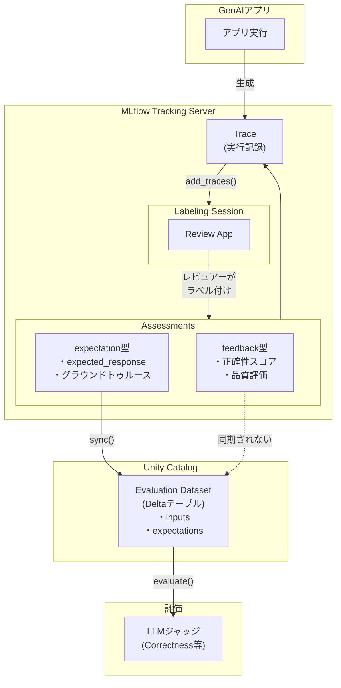

[前回の記事](https://qiita.com/taka_yayoi/items/0ab0e5cd21f5296bd938)では、MLflow 3の[ヒューマンフィードバック](https://docs.databricks.com/aws/ja/mlflow3/genai/human-feedback/)機能の全体像と使い方の流れを説明しました。本記事では、[ラベリングセッション](https://docs.databricks.com/aws/ja/mlflow3/genai/human-feedback/concepts/labeling-sessions)のデータモデルを深掘りし、実際に使う上で押さえておきたいポイントを整理します。

# ラベリングセッションのデータモデル

ここを理解するとスムーズに使えます。

## トレースとAssessmentの関係

**[トレース](https://docs.databricks.com/aws/ja/mlflow3/genai/tracing/)に対するAssessment(ラベル)は直感的です:**

```
Trace (本体) ←── Assessment (ラベル)
```

## ラベリングセッションとは何か？


ラベリングセッションは**作業タスク**または**ビュー**です。データの保存先ではありません。

```
Labeling Session = 「これらのトレースにラベル付けしてください」という作業指示
```

技術的には **[MLflow Run](https://docs.databricks.com/aws/ja/mlflow/tracking-runs)の特殊な形式** として実装されています。

## 例えるなら

| 概念 | 例え |
|------|------|
| Trace | 書類 |
| Assessment | 書類に貼る付箋 |
| Labeling Session | 「この10枚の書類をレビューして」という依頼 |

## データの流れ

```
                   add_traces()
Trace A ─────────────────┐
Trace B ─────────────────┼──→ Labeling Session
Trace C ─────────────────┘         │
   ↑                               │
   │                               ▼
   │                          Review App
   │                               │
   └─── assessmentは ←─────────────┘
        トレースに付く
        (セッションではない)
```

重要なポイント:

- セッションはトレースを**参照**するだけ
- Assessmentはセッションではなく**トレースに**保存される
- セッションを削除しても、トレースとassessmentは残る

この理解があると、なぜ:

- セッション名が一意でなくてもいいのか → 参照してるだけだから
- セッションがRunningのままなのか → 作業が終わっても参照は残るから
- sync()が必要なのか → トレースのexpectationをデータセットにコピーするため

が腑に落ちます。

# セッション作成時のパラメータ

```python
from mlflow.genai.labeling import create_labeling_session

labeling_session = create_labeling_session(
    name="my_review_session",
    label_schemas=[accuracy_schema.name],  # ← 必須: 最低1つ
    assigned_users=["reviewer@company.com"],  # ← 他ユーザーに依頼する場合
)
```

| パラメータ | 必須 | 説明 |
|-----------|------|------|
| `name` | ✅ | セッション名（一意でなくてもよい） |
| `label_schemas` | ✅ | Review Appで何を入力させるか。最低1つ必要 |
| `assigned_users` | ❌ | 他のユーザーにレビューを依頼する場合に指定 |

# `assigned_users`の役割

自分がエクスペリメントの作成者であれば、`assigned_users`を指定しなくてもReview Appでラベル付けできます。

`assigned_users`は**他のユーザーにレビューを依頼する場合**に重要です。

[ドキュメント](https://docs.databricks.com/aws/ja/mlflow3/genai/human-feedback/concepts/labeling-sessions)によると:

> ユーザーをラベル付けセッションに割り当てると、システムは、ラベル付けセッションを含むMLflowエクスペリメントに対する必要な`WRITE`権限を自動的に付与します。これにより、割り当てられたユーザーには、エクスペリメントデータを表示および操作するためのアクセス権が付与されます。

## assigned_usersで付与される権限

指定されたユーザーに対して自動的に以下の権限が付与されます:

- MLflowエクスペリメントへのWRITE権限
- モデルサービングエンドポイントへのQUERY権限(エージェント設定時)
- データセットのDeltaテーブルへのSELECT権限(データセット追加時)

## 監査証跡

保存されたassessmentの`source.source_id`には、ラベル付けを行ったユーザーのメールアドレスが記録されます:

```python
{
    'source': {
        'source_type': 'HUMAN', 
        'source_id': 'reviewer@company.com'
    }
}
```

# ラベルスキーマのタイプ: feedback vs expectation

[ラベルスキーマ](https://docs.databricks.com/aws/ja/mlflow3/genai/human-feedback/concepts/labeling-schemas)には2つのタイプがあります:

| タイプ | 用途 | sync()で同期 |
|--------|------|-------------|
| `feedback` | 実際の出力に対する評価結果 | ❌ |
| `expectation` | 期待される出力（グラウンドトゥルース） | ✅ |

```python
from mlflow.genai.label_schemas import create_label_schema, InputCategorical, InputText

# feedback型: 品質評価（sync対象外）
accuracy_schema = create_label_schema(
    name="response_accuracy",
    type="feedback",
    title="この応答は正確ですか？",
    input=InputCategorical(options=["正確", "部分的に正確", "不正確"]),
    overwrite=True
)

# expectation型: 正解データ（sync対象）
expected_response_schema = create_label_schema(
    name="expected_response",
    type="expectation",
    title="理想的な応答は何ですか？",
    input=InputText(),
    overwrite=True
)
```

[Correctnessスコアラー](https://docs.databricks.com/aws/ja/mlflow3/genai/eval-monitor/built-in-judges#correctness)でグラウンドトゥルースとして活用したい場合は、`type="expectation"`でスキーマを作成してください。

# assessmentのデータ構造

assessmentsの値を取得する際は、ラベルのタイプによってキーが異なります:

```python
labeled_traces = mlflow.search_traces(run_id=labeling_session.mlflow_run_id)
assessments = labeled_traces.iloc[0]['assessments']

for a in assessments:
    name = a.get('assessment_name')
    # feedback型とexpectation型で取得方法が異なる
    value = a.get('feedback', {}).get('value') or a.get('expectation', {}).get('value')
    print(f"{name}: {value}")
```

# sync()と評価データセット

## sync()の前にデータセットを作成する

`sync()`はテーブルを自動作成しません。先にデータセットを作成する必要があります:

```python
import mlflow.genai.datasets

# Step 1: データセットを作成（初回のみ）
eval_dataset = mlflow.genai.datasets.create_dataset(
    name="catalog.schema.my_eval_dataset"
)

# Step 2: sync()でexpectation型のラベルを同期
labeling_session.sync(to_dataset="catalog.schema.my_eval_dataset")
```

## 評価データセットを保存する目的

[評価データセット](https://docs.databricks.com/aws/ja/mlflow3/genai/eval-monitor/build-eval-dataset)を[Unity Catalog](https://docs.databricks.com/aws/ja/data-governance/unity-catalog/)に保存する目的は**継続的な品質管理**です:

| 目的 | 説明 |
|------|------|
| リグレッション防止 | 新バージョンでも正しく動作すべき「ゴールデンセット」 |
| バージョン比較 | 同じデータセットで異なるプロンプト・モデルを比較 |
| 再現性 | 評価結果を再現可能に |
| LLMOps | CI/CDパイプラインで自動評価を実行 |

```
開発サイクル:
アプリ改修 → 同じデータセットで評価 → 品質劣化してないか確認 → デプロイ
```

## その場限りの評価ならデータセット不要

単発の評価なら、トレースやDataFrameを直接[`evaluate()`](https://docs.databricks.com/aws/ja/mlflow3/genai/eval-monitor/evaluate-app)に渡せば十分です:

```python
# データセット保存なしでも評価は可能
mlflow.genai.evaluate(
    data=labeled_traces,  # または pd.DataFrame
    predict_fn=my_chatbot,
    scorers=[Correctness()]
)
```

# その他の注意点

## セッション名は一意ではない

[ドキュメント](https://docs.databricks.com/aws/ja/mlflow3/genai/human-feedback/concepts/labeling-sessions)に明記されています:

> セッション名は一意ではない可能性があります。MLflow実行ID(`session.mlflow_run_id`)を使用してセッションを保存および参照します。

同じ名前で`create_labeling_session()`を呼ぶと、毎回**新しいセッション**が作成されます。既存セッションにトレースを追加したい場合は:

```python
# 既存セッションをrun_idで取得
session = labeling.get_labeling_session(run_id="既存のmlflow_run_id")
session.add_traces(traces)
```

## セッションのステータスが「Running」のまま

これは正常な動作です。ラベリングセッションは意図的に終了しない設計になっており、レビュアーがいつでもラベルを追加・修正できるようになっています。

# まとめ

| ポイント | 説明 |
|---------|------|
| セッションは作業タスク | データはトレースに保存される |
| `label_schemas`必須 | 最低1つのスキーマが必要 |
| `assigned_users` | 他ユーザーに依頼する場合のみ（自分は不要） |
| feedback型 | 評価結果の記録(sync対象外) |
| expectation型 | 正解データ(sync対象) |
| セッション名は一意でない | `mlflow_run_id`で管理する |
| sync()前にcreate_dataset() | テーブルは自動作成されない |

# データモデル全体像



ポイント:

- **Trace**: アプリの実行記録
- **Assessment**: トレースに付けるラベル
  - feedback型 → 評価結果の記録(sync対象外)
  - expectation型 → 正解データ(sync対象)
- **Labeling Session**: 作業タスク(トレースを参照するだけ)
- **Evaluation Dataset**: expectationを集めた評価用テーブル(Unity Catalog)

# 参考リンク

- [人間によるフィードバックのクイックスタート](https://docs.databricks.com/aws/ja/mlflow3/genai/getting-started/human-feedback)
- [ラベル付けセッションの作成と管理](https://docs.databricks.com/aws/ja/mlflow3/genai/human-feedback/concepts/labeling-sessions)
- [ラベリングスキーマの作成と管理](https://docs.databricks.com/aws/ja/mlflow3/genai/human-feedback/concepts/labeling-schemas)
- [評価データセットの構築](https://docs.databricks.com/aws/ja/mlflow3/genai/eval-monitor/build-eval-dataset)
- [開発中のラベル付け](https://docs.databricks.com/aws/ja/mlflow3/genai/human-feedback/dev-annotations)

### はじめてのDatabricks

[はじめてのDatabricks](https://qiita.com/taka_yayoi/items/8dc72d083edb879a5e5d)

### Databricks無料トライアル

[Databricks無料トライアル](https://databricks.com/jp/try-databricks)
