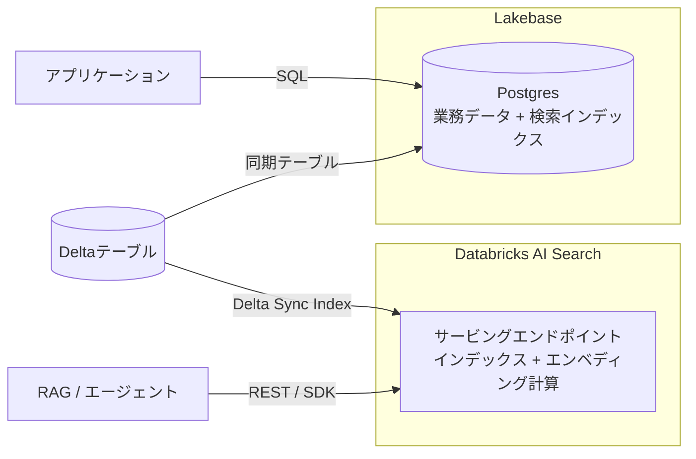
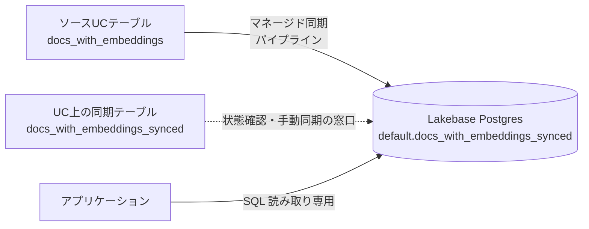

# はじめに

Lakebase Autoscalingプロジェクトにハイブリッド検索機能を追加するLakebase Searchがベータ版として利用できるようになっています。

- [Lakebase Search](https://docs.databricks.com/aws/ja/oltp/projects/lakebase-search)
- [lakebase_vector](https://docs.databricks.com/aws/ja/oltp/projects/lakebase-vector)
- [lakebase_text](https://docs.databricks.com/aws/ja/oltp/projects/lakebase-text)

`lakebase_vector`と`lakebase_text`という2つのPostgres拡張機能によって、pgvector互換のベクトル検索とBM25キーワード検索、そしてその組み合わせであるハイブリッド検索をLakebase上で構成できるというものです。個人的に注目したのは、同期テーブルと組み合わせることで「レイクハウス側でai_queryを使ってエンベディングを生成し、Lakebaseで低レイテンシに検索する」という構成が組める点です。

実際に試してみたところ、ドキュメント通りに動く部分と、現時点のベータならではのギャップやハマりどころの両方がありました。また、Databricksユーザーであれば「Databricks AI Searchと何が違うの？」が最初の疑問になるはずなので、先にそこも整理します。そのあたりも含めて書いていきます。

# Lakebase Searchとは

Lakebase Searchが提供する検索方法は3つの観点で整理できます。

- **ベクトル(セマンティック)検索**: 共通の単語がなくても、クエリに意味が近い行を見つけます。自然言語の質問、レコメンデーション、RAG向け
- **キーワード(全文)検索**: BM25スコアリングで、クエリの用語との一致度に応じて行をランク付けします。名前、コード、正確な用語の検索向け。BM25はElasticsearchなどでも標準的に使われるランキング手法で、単語の出現頻度に加えて、コーパス全体での単語の希少性(珍しい語のマッチほど重視)と文書の長さ(長い文書ほど偶然マッチしやすい分を割り引く)を考慮してスコアを計算します
- **ハイブリッド検索**: 両方を実行して1つのランキングに統合します。意味と特定用語が混在する、実際の検索で最も一般的なケース向け

これを支えるのが2つのPostgres拡張機能です。`lakebase_vector`は`lakebase_ann`インデックスタイプによる近似最近傍(ANN)検索を提供します。pgvectorのコンパニオンとして設計されており、同じベクトル型、距離演算子、クエリ構文がそのまま使えます。内部的にはRaBitQ量子化を伴うIVFパーティショニングを採用し、単一インデックスで10億超のベクトルをサポート、HNSWより最大50〜100倍高速に構築できるとされています。

`lakebase_text`は`lakebase_bm25`インデックスタイプによるBM25全文検索を提供します。PostgreSQL標準の`tsvector`型と互換性があり、Top-Kプッシュダウン(Block-Max WAND)によって全マッチをスコアリングせずに上位K件だけを取得します。

pgvector自体は以前からPostgresで使えたので「PostgresでベクトルDB」は目新しくありませんが、pgvectorのHNSWインデックスは大規模データでの構築時間とメモリが実用上のボトルネックでした。lakebase_annはここを置き換えるもので、ベクトルの保存・インデックス・検索については専用のベクトルDBを別途立てなくてもLakebase単体で完結する、というのがLakebase Searchの基盤にある価値だと理解しています(エンベディングの生成はどの構成でも外部のモデル呼び出しが必要ですが、これは専用ベクトルDBを使う場合も同じです)。本記事で扱う同期テーブル連携は、そのベクトルDBへのデータ搬入をマネージドにするDatabricksならではの追加価値、という位置づけです。

# Databricks AI Searchとどう使い分けるのか

Databricksユーザーであれば、ここまで読んで「それDatabricks AI Search(旧Mosaic AI Vector Search)でできるのでは？」と思ったはずです。手を動かす前に、まずこの疑問を解きほぐしておきます。

- [Databricks AI Search](https://docs.databricks.com/aws/ja/ai-search/ai-search)

AI SearchもDeltaテーブルからの同期、エンベディング計算、ハイブリッド検索(RRFベース)までマネージドで提供しています。プラットフォーム内で完結するという点では両者に差はなく、むしろAI SearchのDelta Sync Indexはエンベディング計算までマネージドでやってくれるので、レイクハウス内での完結度はAI Searchの方が高いとも言えます。機能の表面だけ見ると重なって見えるのは当然です。

違いは検索の出口、つまり「誰がどこから検索するか」に集約されます。



AI Searchは検索専用のサービングエンドポイントが出口で、アプリやエージェントはAPIで問い合わせます。Lakebase Searchは業務データと同じPostgresが出口で、検索は通常のSQLの一部になります。

| | Databricks AI Search | Lakebase Search |
| --- | --- | --- |
| 検索の出口 | サービングエンドポイント(API) | アプリのPostgres(SQL) |
| 主な消費者 | RAG、エージェント | Postgresを使うアプリケーション |
| エンベディング生成 | Delta Sync Indexでマネージド計算可 | 自分で用意(ai_query、アプリからのモデル呼び出し等) |
| ハイブリッド検索 | RRF(チューニング済みの組み込み実装) | SQLで自由に実装・調整 |
| 業務データとの結合 | 検索結果を取得後にアプリ側で結合 | 1つのSQLでJOIN可能 |

AI Searchは検索用のサービングエンドポイントを立てて、そこにAPI(SDK/REST)で問い合わせる形です。消費者がRAGやエージェントであれば、この形が最短で、リランキングなどの検索品質向上の機能も揃っています。

一方Lakebase Searchは、アプリケーションが使うPostgresそのものに検索が入ります。検索結果を業務データとSQLでJOINできる(「在庫のある商品だけを意味検索」が1つのクエリで書ける)、RRFの定数やフュージョン方法をSQLで自由に調整できる、アプリが既にLakebaseを使っていればサービングインフラが増えない、という点が効きます。

ざっくり言えば、エージェントのRAG検索ならAI Search、Databricks Appsのようなアプリケーション内の検索機能ならLakebase Search、という使い分けになると考えています。

# Lakebase Searchの有効化

## プロジェクト設定から有効化する

ワークスペースのプレビューでLakebase Searchを有効にした上で、Lakebaseプロジェクトの **設定** から **Enable Lakebase Search** をクリックします。


ここで注意が必要なのは、有効化の際に表示される警告です。

- プロジェクト内のすべてのコンピュートが再起動し、アクティブな接続がすべて切断される
- 一度有効にすると無効化できない


拡張機能が入るだけで既存データに影響はありませんが、稼働中のアプリケーションがある場合はタイミングに注意してください。私は検証用に`taka-lakebase-search`というプロジェクトを新規作成して進めました。使い捨てプロジェクトで試すのが安心です。

## 拡張機能のインストール

有効化が完了したら、SQL Editorで拡張機能をインストールします。

```sql
CREATE EXTENSION IF NOT EXISTS lakebase_vector CASCADE;
CREATE EXTENSION IF NOT EXISTS lakebase_text;
```

`CASCADE`を付けると依存関係のpgvectorも一緒にインストールされます。確認してみます。

```sql
SELECT extname, extversion FROM pg_extension
WHERE extname IN ('lakebase_vector', 'lakebase_text', 'vector');
```

| extname | extversion |
| --- | --- |
| vector | 0.8.0 |
| lakebase_vector | 1.0.1 |
| lakebase_text | 0.1.1 |

pgvector 0.8.0が依存として入っていることが分かります。なお、私の環境はプライベートネットワーキングを使っているためSQL Editorに「Limited SQL Editor」の表示が出ますが(トランザクション、SET、一時テーブル、LISTEN/NOTIFYが非サポート)、今回のDDLと検索クエリはすべてこの制限下で問題なく実行できました。

# ドキュメントの例でハイブリッド検索を試す

## ベクトル検索とBM25検索

まずはドキュメントの例をそのまま流して動作を確認します。ベクトル列と`tsvector`列を持つ`documents`テーブルを作り、それぞれのインデックスを張ります。`tsvector`はPostgreSQLの全文検索用の型で、テキストをトークン(検索単位の語)に分解した状態で保持します。

```sql
CREATE TABLE documents (
  id        SERIAL PRIMARY KEY,
  title     TEXT NOT NULL,
  body      TEXT NOT NULL,
  embedding VECTOR(3),
  body_tsv  TSVECTOR
);

CREATE INDEX ON documents USING lakebase_ann (embedding vector_cosine_ops);

INSERT INTO documents (title, body, embedding, body_tsv) VALUES
  ('Postgres overview', 'Postgres is an open-source relational database.', '[0.1, 0.2, 0.3]', to_tsvector('english', 'Postgres is an open-source relational database.')),
  ('Vector search guide', 'Vector search finds semantically similar results.', '[0.4, 0.5, 0.6]', to_tsvector('english', 'Vector search finds semantically similar results.')),
  ('Full-text search', 'BM25 ranking improves keyword search relevance.', '[0.7, 0.8, 0.9]', to_tsvector('english', 'BM25 ranking improves keyword search relevance.'));

CREATE INDEX documents_body_bm25 ON documents USING lakebase_bm25 (body_tsv);
```

BM25インデックスはコーパス統計(単語の希少性の計算に使う全体統計)をビルド時に計算するため、データ投入後に作成する順序になっている点に注意してください。検索を実行します。

```sql
-- ベクトル類似検索
SELECT id, title
FROM documents
ORDER BY embedding <=> '[0.1, 0.2, 0.3]'
LIMIT 5;

-- BM25キーワード検索
SELECT id, title,
  body_tsv <@> to_bm25query(to_tsvector('english', 'database'), 'documents_body_bm25') AS score
FROM documents
ORDER BY score
LIMIT 5;
```

`<=>`はpgvectorのコサイン距離演算子です(値が小さいほど類似)。


BM25検索の結果で面白かったのは2点です。`LIMIT 5`を指定しても「database」を含む1件しか返ってきません。マッチしないドキュメントをスコアリングしないTop-Kプッシュダウンの挙動そのものです。また、スコアは-0.98のような負の値で返ってきます。スコアが低いほど関連度が高い仕様なので、距離と同じように`ORDER BY score`がそのまま使えます。

## RRFによるハイブリッド検索

ベクトル検索とキーワード検索の結果を1つのランキングに統合するには、Reciprocal Rank Fusion(RRF)という手法を使います。各検索結果の「順位」だけを使い、順位の逆数(1/(定数+順位))を足し合わせてスコアにするシンプルな方法です。ベクトル検索の距離とBM25のスコアは尺度がまったく違うので直接足せませんが、順位に変換してしまえば正規化なしに組み合わせられる、というのがポイントです。ドキュメントにはこのRRFのクエリ例が載っています。

```sql
WITH vector_ranked AS (
  SELECT id, RANK() OVER (ORDER BY dist) AS rank
  FROM (
    SELECT id, embedding <=> '[0.1, 0.2, 0.3]' AS dist
    FROM documents
    ORDER BY dist
    LIMIT 40
  ) v
),
keyword_ranked AS (
  SELECT id, RANK() OVER (ORDER BY score) AS rank
  FROM (
    SELECT id, body_tsv <@> to_bm25query(to_tsvector('english', 'database'), 'documents_body_bm25') AS score
    FROM documents
    ORDER BY score
    LIMIT 40
  ) k
)
SELECT d.id, d.title,
  COALESCE(1.0 / (60 + v.rank), 0) + COALESCE(1.0 / (60 + k.rank), 0) AS rrf_score
FROM documents d
LEFT JOIN vector_ranked v ON d.id = v.id
LEFT JOIN keyword_ranked k ON d.id = k.id
WHERE v.id IS NOT NULL OR k.id IS NOT NULL
ORDER BY rrf_score DESC, d.id
LIMIT 10;
```


結果を検算すると、RRFの計算通りになっていることが確認できます。

- id=1: ベクトル1位 + キーワード1位 → 1/61 + 1/61 = 0.03279
- id=2: ベクトル2位のみ → 1/62 = 0.01613
- id=3: ベクトル3位のみ → 1/63 = 0.01587

両方の検索でヒットしたid=1が明確に浮上する、というRRFの狙い通りの挙動です。

# レイクハウスのデータを検索する: 同期テーブル編

ここからが本題です。Lakebase Searchの真価は、Postgresに直接書き込んだデータだけでなく、レイクハウス由来のデータに検索を提供できる点にあります。

- [同期テーブルを使用したレイクハウスデータの提供](https://docs.databricks.com/aws/ja/oltp/projects/sync-tables)

従来、レイクハウス上のデータをアプリの検索機能として提供するには、検索エンジンやベクトルDBを別途立てて、そこへのETLパイプラインを自作・運用する必要がありました。同期テーブルを使う構成では、配信はマネージドな同期に任せ、エンベディング生成のような重い前処理はコンピュートとモデルが揃っているレイクハウス側で実行し、権限管理はソースも同期先もUnity Catalogに乗せたまま、アプリが使うPostgresそのものに検索能力を持たせられます。検索専用インフラを増やすのではなく、業務データと検索が同じデータベースに同居するのがポイントです。

## ai_queryでエンベディングを生成する

前置きとして、エンベディングの生成自体はどの構成でもPostgresの外のモデル呼び出しが必要です。アプリケーションがModel Servingを呼んでベクトルを作り、Lakebaseに直接INSERTするパターンでも構いません(アプリが生むライブなデータはむしろこちらが自然です)。今回は「既にレイクハウスにあるデータを検索可能にする」ことをテーマに、バッチ生成が容易な`ai_query`でエンベディングを作り、同期テーブルで搬入するパターンを試します。

ソースとなるUnity Catalogテーブルをノートブックで準備します。エンベディングの生成には`ai_query`でDatabricksホストのエンベディングモデルを呼びます。

```sql
%sql
-- ノートブック (SQL) またはDatabricks SQLで実行
CREATE OR REPLACE TABLE takaakiyayoi_catalog.default.docs_with_embeddings AS
SELECT
  id,
  title,
  body,
  ai_query('databricks-gte-large-en', body) AS embedding
FROM VALUES
  (1, 'Lakebase概要', 'LakebaseはDatabricksが提供するマネージドPostgresです。'),
  (2, 'ベクトル検索入門', 'ベクトル検索は意味的に類似した結果を見つけます。'),
  (3, 'BM25とは', 'BM25はキーワード検索の関連度ランキングアルゴリズムです。')
AS t(id, title, body);
```

`databricks-gte-large-en`は1024次元のエンベディングを返します。この次元数は後の型マッピングで使うので覚えておいてください。

## 同期テーブルのカスタム型マッピング

カタログエクスプローラーでソーステーブルを開き、**作成 > 同期テーブル** から同期テーブルを作成します。プロジェクト、ブランチ、Postgresデータベースを指定し、同期モードは今回の検証ではオンデマンドにしました。LTAPダイレクト書き込み(ベータ版)というチェックボックスもあり、これはスナップショット同期の際に稼働中のコンピュートを経由せずストレージレイヤーに直接ロードする機能です。今回のデータ量では違いは出ませんが、チェックしたままにしています。


そして今回の肝が、Schemaセクションにある **Customize column types** です。「New」のバッジが付いています。


ここでソース列からPostgres型へのマッピングを列単位で上書きできます。`embedding`列(`array<double>`)のDestination typeを開くと、デフォルトの`jsonb`に加えて`vector`(フルプレシジョン)と`halfvec`(半精度)が選べます。`vector`を選ぶと次元の入力欄が現れるので、1024を指定します。指定可能な範囲は1〜16,000と表示されていました。


「pgvector is required for embedding」という警告が出ますが、先ほど`CASCADE`でpgvectorはインストール済みなのでこのまま進めて問題ありません。

なお、同期テーブルを作成するとUnity Catalog上にも同期テーブルというエンティティが作られます。初見だと「なぜUCにもう1つテーブルができるのか」と戸惑いますが、これは同期パイプラインを参照する管理用の窓口で、実体は3つの関係になっています。



1. ソースUCテーブル: `docs_with_embeddings`
2. UC上の同期テーブル: `docs_with_embeddings_synced`(同期状態の確認や手動同期のトリガーに使う)
3. Lakebase上のPostgresテーブル: `"default".docs_with_embeddings_synced`(アプリケーションがクエリする実体)

UCのスキーマ名がそのままPostgresのスキーマ名になるため、Postgres側では`"default"`スキーマ配下に作られます。

## tsvector列はUIからは作れない

ドキュメントには「キーワード検索用に、ソーステキストから`tsvector`列を生成します」という記載があります。しかし、2026年8月時点のUIでは`body`列(`string`)のDestination typeの選択肢は`text`と`varchar`のみで、`tsvector`は現れませんでした。


ベータならではのドキュメントと実装のギャップと思われます。ではキーワード検索は構成できないのかというと、そんなことはありませんでした。次のセクションで回避策を示します。

## Postgres側でインデックスを作成する

同期が完了したら、Lakebase側のSQL Editorに移ります。同期テーブルは読み取り専用の扱いですが、読み取りクエリ、インデックス作成、テーブル削除は許可された操作です。まず型マッピングの結果を確認します。

```sql
SELECT column_name, udt_name
FROM information_schema.columns
WHERE table_schema = 'default'
  AND table_name = 'docs_with_embeddings_synced';
```

| column_name | udt_name |
| --- | --- |
| id | int4 |
| title | text |
| body | text |
| embedding | vector |

`embedding`列が`vector`型になっています。カスタム型マッピングを設定しなかった場合はデフォルトの`jsonb`になるので、この確認は重要です。ベクトルインデックスを作成します。

```sql
CREATE INDEX docs_synced_ann ON "default".docs_with_embeddings_synced
  USING lakebase_ann (embedding vector_cosine_ops);
```

## 式インデックスでBM25を構成する

`tsvector`列がない状態でBM25検索を構成できるのか。`lakebase_bm25`が式インデックスをサポートしていれば可能なはずです。試してみます。

```sql
CREATE INDEX docs_synced_bm25 ON "default".docs_with_embeddings_synced
  USING lakebase_bm25 (to_tsvector('english', body));
```

これが通りました。**`tsvector`列を用意できない同期テーブルでも、式インデックスでBM25検索を構成できます**。UIの制約に対する実用的な回避策になります。

## インデックス名はスキーマ修飾が必要

BM25検索を実行しようとしたところ、最初のクエリで`relation "docs_synced_bm25" does not exist`というエラーになりました。ここがハマりどころです。

`to_bm25query`の第2引数はインデックス名を文字列で受け取り、Postgresのオブジェクト名解決の仕組み(regclass)で実体を探します。このとき検索パスにスキーマが含まれていないと見つかりません。ドキュメントの例は`public`スキーマ前提なのでインデックス名を裸で渡していますが、同期テーブルはUCスキーマ名由来のスキーマ(今回は`default`)に作られるため、スキーマ修飾が必要になります。Limited SQL Editorでは`SET search_path`も使えないので、修飾で渡すのが確実です。

```sql
SELECT id, title,
  to_tsvector('english', body) <@> to_bm25query(
    to_tsvector('english', 'Postgres'),
    '"default".docs_synced_bm25'
  ) AS score
FROM "default".docs_with_embeddings_synced
ORDER BY score
LIMIT 5;
```

`'"default".docs_synced_bm25'`と、シングルクォートの中にダブルクォート付きで書くのがポイントです。式インデックスの場合、クエリ側もインデックスと同じ式(`to_tsvector('english', body)`)を書く必要があります。

## 実エンベディングでのベクトル検索

ベクトル検索を確認します。クエリベクトルには既存行のエンベディングを使うと、ノートブックを介さずSQL Editorだけで動作確認できます。

```sql
SELECT id, title,
  embedding <=> (
    SELECT embedding FROM "default".docs_with_embeddings_synced WHERE id = 1
  ) AS dist
FROM "default".docs_with_embeddings_synced
ORDER BY dist;
```

| id | title | dist |
| --- | --- | --- |
| 1 | Lakebase概要 | 0 |
| 3 | BM25とは | 0.31006836881591604 |
| 2 | ベクトル検索入門 | 0.34432770981766114 |

id=1自身がdist=0で最上位に来て、残りが意味の近さ順に並びます。「ai_queryでエンベディングを生成 → カスタム型マッピングで`vector(1024)`として同期 → `lakebase_ann`で検索」というレイクハウス起点のエンドツーエンドが成立しました。

# 日本語テキストとBM25

もう一つ、日本語圏の読者には重要な検証結果を共有します。先ほどのBM25クエリ、実は日本語本文に対して「Postgres」で検索すると全行がスコア-0、つまり1件もマッチしません。id=1の本文には「マネージドPostgresです」と確かに含まれているのに、です。

原因はトークナイズにあります。実際に確認してみます。

```sql
SELECT to_tsvector('english', 'LakebaseはDatabricksが提供するマネージドPostgresです。') AS tsv;
```

```
'lakebaseはdatabricksが提供するマネージドpostgresです':1
```

**日本語文はスペースで区切られないため、文全体(埋め込まれた英単語も含めて)が丸ごと1トークンになります**。これでは「postgres」でも「lakebase」でもマッチしません。日本語テキストをそのまま`lakebase_text`に投げてもキーワード検索は機能しない、ということです。

一方、スペースで分かち書きされていればどうなるか。

```sql
SELECT to_tsvector('simple', 'Lakebase は Databricks が 提供 する マネージド Postgres です') AS tsv;
```

```
'databricks':3 'lakebase':1 'postgres':8 'が':4 'する':6 'です':9 'は':2 'マネージド':7 '提供':5
```

日本語トークンも英単語も、位置情報付きで独立したトークンになりました。辞書に`english`ではなく`simple`を使っているのは、英語向けのステミング(語形をまとめる正規化。runningをrunにする等)やストップワード除去(theやisのような頻出語の無視)が日本語には意味を持たないためです。

つまり日本語でBM25を実用にするには、索引前の分かち書きが必要です。幸い、今回の構成ではソースがレイクハウス側にあるので、UC側で形態素解析(SudachiPyやMeCab)を実行して分かち書き済みの列を持たせ、それを同期して`simple`辞書の式インデックスを張る、という設計が素直に組めます。前処理はレイクハウスの得意領域なので、この役割分担はむしろ同期テーブル構成の強みと言えそうです。分かち書きパイプラインの実装は、稿を改めて書きます。

# まとめ

Lakebase Searchを同期テーブルと組み合わせて試してみて分かったことをまとめます。

- **Databricks AI Searchとの使い分けは「検索の出口」で決まる。エージェントのRAG検索ならAI Search(エンドポイントにAPIで問い合わせ)、アプリケーション内の検索機能ならLakebase Search(業務データと同じPostgresの中でSQLとして検索)**
- `lakebase_vector` / `lakebase_text`はSQL Editorから数分でセットアップできる。Limited SQL Editor(プライベートネットワーキング)の制限下でもすべての検証クエリが動作した
- BM25はマッチしない行を返さない(Top-Kプッシュダウン)。スコアは負の値で、低いほど関連度が高い
- 同期テーブルの **Customize column types** で、エンベディング列をデフォルトの`jsonb`ではなく`vector(n)`にマッピングできる。`halfvec`も選択可能
- **`tsvector`列は2026年8月時点のUIからは作成できない。ただし`lakebase_bm25`は式インデックスをサポートしており、`to_tsvector('english', body)`を直接インデックス化することで回避できる**
- **同期テーブルのインデックスを`to_bm25query`に渡す際は、`'"default".docs_synced_bm25'`のようにスキーマ修飾が必要**。ドキュメントの例は`public`スキーマ前提
- **日本語テキストは文全体が1トークンになるため、そのままではBM25検索が機能しない**。スペースで分かち書きすれば`simple`辞書で正しくトークン化される

一番の収穫は、ドキュメントに書かれている「同期テーブルで`tsvector`列を生成」がUIにまだ実装されていないことを確認し、式インデックスという回避策にたどり着けたことでした。ベータ機能はドキュメントと実装のギャップがあって当然なので、書いてある通りに動かないときに手が止まらないよう、代替手段を試しながら進めるのが良さそうです。日本語検索の分かち書きパイプラインは続編で扱います。

# 参考リンク

- [Lakebase Search](https://docs.databricks.com/aws/ja/oltp/projects/lakebase-search)
- [lakebase_vector](https://docs.databricks.com/aws/ja/oltp/projects/lakebase-vector)
- [lakebase_text](https://docs.databricks.com/aws/ja/oltp/projects/lakebase-text)
- [同期テーブルを使用したレイクハウスデータの提供](https://docs.databricks.com/aws/ja/oltp/projects/sync-tables)
- [Databricks AI Search](https://docs.databricks.com/aws/ja/ai-search/ai-search)
- [エンべディングモデルをクエリーする](https://docs.databricks.com/aws/ja/machine-learning/model-serving/query-embedding-models)

### はじめてのDatabricks

[はじめてのDatabricks](https://qiita.com/taka_yayoi/items/8dc72d083edb879a5e5d)

### Databricks無料トライアル

[Databricks無料トライアル](https://databricks.com/jp/try-databricks)
