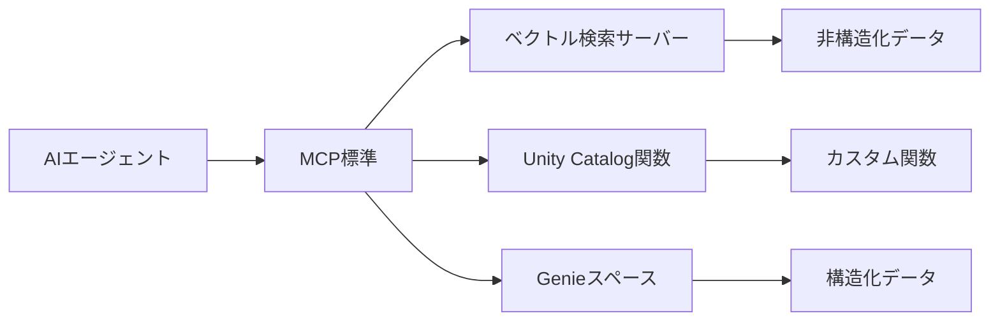

こちらのアップデートです。

https://docs.databricks.com/aws/ja/release-notes/product/2025/june#model-context-protocol-mcp-for-ai-agents-is-in-beta

> **AIエージェント向けモデルコンテキストプロトコル(MCP)がベータに**
> Databricksで、AIエージェントが一貫性のあるインタフェースを用いてセキュアにツール、リソース、プロンプト、その他の文脈情報にアクセスできるようにするオープン標準であるMCPをサポートしました。
>
> - **マネージドMCPサーバー:** Unity Catalogのデータやツールに簡単かつ、メンテナンス不要でアクセスできるDatabricksがホスティングするインタフェースを使用します。
> - **カスタムMCPサーバー:** Databricks Appとして、自身のMCPサーバーやサードパーティのサーバーをホスティングします。
>
> [Databricksにおけるモデルコンテキストプロトコル(MCP)](https://docs.databricks.com/aws/ja/generative-ai/agent-framework/mcp)をご覧ください。

:::note info
**注意**
執筆時点では[ベータ版](https://docs.databricks.com/aws/ja/release-notes/release-types)です。
:::

これまで、いくつかDatabricksにおけるMCPについて記事を書きました。

https://qiita.com/taka_yayoi/items/eea79a88bd638847beb8

https://qiita.com/taka_yayoi/items/92f52b665d8d424f9855

https://qiita.com/taka_yayoi/items/32b73524e62ee716a442

これらはすべてローカルでMCPサーバーを動かしていましたが、今回、ベータ版ではありますがプラットフォームでりもーtMCPがサポートされました。

# 機能概要

**MCP(モデルコンテキストプロトコル)** とは、AIエージェントをツールやデータ、リソースに接続するためのオープンソース標準です。Databricksでは、この標準を活用してエンタープライズデータとAIエージェントを簡単に連携できる仕組みを提供しています。

## Databricksで利用可能なMCPサーバー

| MCPサーバー | 機能 | URL形式 |
|------------|------|---------|
| **ベクトル検索** | 非構造化データの検索 | `https://<workspace>/api/2.0/mcp/vector-search/<schema>` |
| **Unity Catalog関数** | カスタムPython/SQL関数の実行 | `https://<workspace>/api/2.0/mcp/functions/<schema>` |
| **Genieスペース** | 構造化データのクエリ | `https://<workspace>/api/2.0/mcp/genie/<space_id>` |

## MCPの仕組み



## メリット、嬉しさ

### 標準化による恩恵
- **ツールの再利用性**: 一度作成したツールを、どのAIエージェントでも使用可能
- **互換性**: 自作エージェントでもサードパーティ製でも同じ方法で接続
- **チーム間での共有**: 他のチームが開発したツールも簡単に利用

### セキュリティと権限管理
- **Unity Catalogの権限**: 既存の権限設定がそのまま適用
- **安全なアクセス**: エージェントとユーザーは許可されたデータのみにアクセス
- **認証**: Databricks標準のOAuth認証を使用

### 開発効率の向上
| 従来の方法 | MCPを使用した場合 |
|-----------|-----------------|
| 各データソースごとに個別実装 | 標準APIで統一的にアクセス |
| エージェントごとに接続コード作成 | 一度の実装で複数エージェントで利用 |
| 権限管理の個別実装 | Unity Catalogの権限が自動適用 |

# ウォークスルー

## 機能の有効化

**プレビュー**で**Managed MCP Servers**をオンにします。


以降はローカルで作業します。

## Step 1: 認証設定
```bash
# ワークスペースにOAuth認証でログイン
databricks auth login --host https://<your-workspace-hostname>
```

認証を行う際にCLIプロファイル名を聞かれるのでメモしておきます。


## Step 2: 必要なライブラリをインストール
```bash
pip install -U --pre databricks-mcp "mcp>=1.9" databricks-sdk mlflow databricks-agents
```

## Step 3: MCPサーバーへの接続テスト

```py
import asyncio

from mcp.client.streamable_http import streamablehttp_client
from mcp.client.session import ClientSession
from databricks_mcp import DatabricksOAuthClientProvider
from databricks.sdk import WorkspaceClient

# TODO: Databricks ワークスペースへの認証を設定した際に指定した CLI プロファイル名に更新してください。
databricks_cli_profile = "<CLIプロファイル名>"
assert databricks_cli_profile != "YOUR_DATABRICKS_CLI_PROFILE", "databricks_cli_profile を、ワークスペース認証設定時に指定した Databricks CLI プロファイル名に設定してください"
workspace_client = WorkspaceClient(profile=databricks_cli_profile)
workspace_hostname = workspace_client.config.host
mcp_server_url = f"{workspace_hostname}/api/2.0/mcp/functions/system/ai"

# このスニペットは、Unity Catalog 関数 MCP サーバーを使用して、組み込み AI ツール `system.ai` を公開します。
# 例えば、`system.ai.python_exec` コードインタープリターツールなどです。
async def test_connect_to_server():
   async with streamablehttp_client(f"{mcp_server_url}", auth=DatabricksOAuthClientProvider(workspace_client)) as (
         read_stream,
         write_stream,
         _,
   ):
      async with ClientSession(
            read_stream,
            write_stream,
      ) as session:
         # MCP サーバーからツールをリストアップし、呼び出す
         await session.initialize()
         list_tools_result = await session.list_tools()
         print(f"MCP サーバー {mcp_server_url} から発見したツール: {[tool.name for tool in list_tools_result.tools]}")
         tool_call_result = await session.call_tool("system__ai__python_exec", {"code": "print('Hello, world!')"})
         print(f"system__ai__python_exec ツールを呼び出し、結果を取得: {tool_call_result.content}")

if __name__ == "__main__":
   asyncio.run(test_connect_to_server())
```

MCPサーバー経由で[コードインタプリタツール](https://docs.databricks.com/aws/ja/generative-ai/agent-framework/code-interpreter-tools)`system.ai.python_exec`を呼び出しています。


## Step 4: MCPを使用したシングルターンエージェントの構築

必要に応じてライブラリを追加します。

```sh
pip install -U openai
```


```py
from contextlib import asynccontextmanager
import json
import uuid
import asyncio
from typing import Any, Callable, List
from pydantic import BaseModel

import mlflow
from mlflow.pyfunc import ResponsesAgent
from mlflow.types.responses import ResponsesAgentRequest, ResponsesAgentResponse

from databricks_mcp import DatabricksOAuthClientProvider
from databricks.sdk import WorkspaceClient
from mcp.client.session import ClientSession
from mcp.client.streamable_http import streamablehttp_client

# 1) エンドポイントとプロファイルの設定
LLM_ENDPOINT_NAME       = "databricks-claude-3-7-sonnet"
SYSTEM_PROMPT           = "あなたは有能なアシスタントです"
DATABRICKS_CLI_PROFILE  = "e2-demo-tokyo"
workspace_client        = WorkspaceClient(profile=DATABRICKS_CLI_PROFILE)
host                    = workspace_client.config.host
MCP_SERVER_URL          = f"{host}/api/2.0/mcp/functions/system/ai"


# 2) ResponsesAgent の「メッセージ辞書」と ChatCompletions 形式の変換ヘルパー
def _to_chat_messages(msg: dict[str, Any]) -> List[dict]:
   """
   ResponsesAgent 形式の dict を受け取り、ChatCompletions 互換の dict エントリに変換します。
   """
   msg_type = msg.get("type")
   if msg_type == "function_call":
      return [{
         "role":    "assistant",
         "content": None,
         "tool_calls": [{
            "id": msg["call_id"],
            "type": "function",
            "function": {
               "name":      msg["name"],
               "arguments": msg["arguments"],
            }
         }]
      }]
   elif msg_type == "message" and isinstance(msg["content"], list):
      return [
         { "role": "assistant" if msg["role"] == "assistant" else msg["role"],
         "content": content["text"] }
         for content in msg["content"]
      ]
   elif msg_type == "function_call_output":
      return [{
         "role":         "tool",
         "content":      msg["output"],
         "tool_call_id": msg["tool_call_id"],
      }]
   else:
      # plain な {"role": ..., "content": ...} などのフォールバック
      return [{k: v for k, v in msg.items() if k in ("role", "content", "name", "tool_calls", "tool_call_id")}]


# 3) MCP セッションとツール呼び出し関数
@asynccontextmanager
async def _mcp_session(server_url: str, ws: WorkspaceClient):
   async with streamablehttp_client(
         url=server_url,
         auth=DatabricksOAuthClientProvider(ws)
   ) as (reader, writer, _):
      async with ClientSession(reader, writer) as session:
         await session.initialize()
         yield session

def _list_tools(server_url: str, ws: WorkspaceClient):
   async def inner():
      async with _mcp_session(server_url, ws) as sess:
         return await sess.list_tools()
   return asyncio.run(inner())

def _make_exec_fn(server_url: str, tool_name: str, ws: WorkspaceClient) -> Callable[..., str]:
   def exec_fn(**kwargs):
      async def call_it():
         async with _mcp_session(server_url, ws) as sess:
            resp = await sess.call_tool(name=tool_name, arguments=kwargs)
            return "".join([c.text for c in resp.content])
      return asyncio.run(call_it())
   return exec_fn

class ToolInfo(BaseModel):
   name: str
   spec: dict
   exec_fn: Callable

def _fetch_tool_infos(ws: WorkspaceClient, server_url: str) -> List[ToolInfo]:
   infos: List[ToolInfo] = []
   mcp_tools = _list_tools(server_url, ws).tools
   for t in mcp_tools:
      schema = t.inputSchema.copy()
      if "properties" not in schema:
         schema["properties"] = {}
      spec = {
         "type": "function",
         "function": {
            "name":        t.name,
            "description": t.description,
            "parameters":  schema,
         }
      }
      infos.append(
         ToolInfo(
            name=t.name,
            spec=spec,
            exec_fn=_make_exec_fn(server_url, t.name, ws)
         )
      )
   return infos


# 4) シングルターン型エージェントクラス
class SingleTurnMCPAgent(ResponsesAgent):
   def _call_llm(self, history: List[dict], ws: WorkspaceClient):
      """
      現在の履歴を LLM に送信し、生のレスポンス辞書を返します。
      """
      client = ws.serving_endpoints.get_open_ai_client()
      flat_msgs = []
      for msg in history:
         flat_msgs.extend(_to_chat_messages(msg))

      return client.chat.completions.create(
         model=LLM_ENDPOINT_NAME,
         messages=flat_msgs,
         tools=[ti.spec for ti in _fetch_tool_infos(ws, MCP_SERVER_URL)]
      )

   def predict(self, request: ResponsesAgentRequest) -> ResponsesAgentResponse:
      ws = WorkspaceClient(profile=DATABRICKS_CLI_PROFILE)

      # 1) 初期履歴（system + user）を構築
      history: List[dict] = [
         { "role": "system", "content": SYSTEM_PROMPT }
      ]
      for inp in request.input:
         history.append(inp.model_dump())  # [{"role": "user", "content": "..."}]

      # 2) LLM を一度呼び出す
      llm_resp = self._call_llm(history, ws)
      raw_choice = llm_resp.choices[0].message.to_dict()
      raw_choice["id"] = uuid.uuid4().hex
      history.append(raw_choice)

      # 3) LLM がちょうど1つのツール呼び出しを要求したか？
      tool_calls = raw_choice.get("tool_calls") or []
      if tool_calls:
         # (この「シングルターン」例ではツールは1つのみサポート）
         fc = tool_calls[0]
         name    = fc["function"]["name"]
         args    = json.loads(fc["function"]["arguments"])
         try:
            result = next(t.exec_fn(**args) for t in _fetch_tool_infos(ws, MCP_SERVER_URL) if t.name == name)
         except Exception as e:
            result = f"Error invoking {name}: {e}"

         # 4) 「tool」出力を履歴に追加
         history.append({
            "type":         "function_call_output",
            "role":         "tool",
            "id":           uuid.uuid4().hex,
            "tool_call_id": fc["id"],
            "output":       result
         })

         # 5) LLM を2回目呼び出し、その返答を最終とする
         followup = self._call_llm(history, ws).choices[0].message.to_dict()
         followup["id"] = uuid.uuid4().hex

         assistant_text = followup.get("content", "")
         return ResponsesAgentResponse(
            output=[{
               "id":      uuid.uuid4().hex,
               "type":    "message",
               "role":    "assistant",
               "content": [{ "type": "output_text", "text": assistant_text }]
            }],
            custom_outputs=request.custom_inputs
         )

      # 6) tool_calls がなければ、アシスタントの元の返答を返す
      assistant_text = raw_choice.get("content", "")
      return ResponsesAgentResponse(
         output=[{
            "id":      uuid.uuid4().hex,
            "type":    "message",
            "role":    "assistant",
            "content": [{ "type": "output_text", "text": assistant_text }]
         }],
         custom_outputs=request.custom_inputs
      )


# 5) エージェントのテスト
mlflow.models.set_model(SingleTurnMCPAgent())

if __name__ == "__main__":
   req = ResponsesAgentRequest(
      input=[{ "role": "user", "content": "100番目のフィボナッチ数は何ですか？" }]
   )
   resp = SingleTurnMCPAgent().predict(req)
   for item in resp.output:
      print(item)
```

結果が得られました。


# 注意点

## ベータ版機能であることの留意点
- **機能制限**: 現在ベータ版のため、一部機能に制限がある可能性
- **変更の可能性**: 正式版リリース時にAPIや仕様が変更される場合あり
- **サポート**: ベータ版登録が必要な機能があります

## セキュリティ要件
- **認証必須**: DatabricksのMCPサーバーは認証が必要
- **権限設定**: Unity Catalogの適切な権限設定が前提
- **ネットワーク**: HTTPSでの通信が必要

## 実装時の考慮事項
| 項目 | 注意点 |
|------|--------|
| **Python環境** | Python 3.12以降が必要 |
| **ライブラリ管理** | 依存関係の適切な管理（requirements.txt） |
| **リソース指定** | デプロイ時に必要なリソースを全て指定 |
| **エラーハンドリング** | ツール実行時のエラー処理を適切に実装 |

## カスタムMCPサーバーの制約
- **HTTP互換**: ストリーム可能なHTTPトランスポートの実装が必要
- **ポート設定**: デフォルトはポート8000（設定変更可能）
- **Databricksアプリ**: カスタムサーバーはDatabricksアプリとしてホスト

# まとめ

DatabricksのMCP機能は、AIエージェントとエンタープライズデータの連携を**標準化**し、**セキュア**で**効率的**な開発を可能にする仕組みです。

## 主なポイント
1. **標準化による再利用性**: 一度作成したツールを複数のエージェントで活用
2. **セキュリティ**: Unity Catalogの権限管理がそのまま適用
3. **開発効率**: 統一されたAPIで様々なデータソースにアクセス
4. **柔軟性**: マネージドサーバーとカスタムサーバーの両方をサポート

現在ベータ版として提供されているため、実際の利用前には最新の仕様確認と適切なテストを行うことをお勧めします。MCPを活用することで、より強力で実用的なAIエージェントを効率的に構築できるようになります。

### はじめてのDatabricks

[はじめてのDatabricks](https://qiita.com/taka_yayoi/items/8dc72d083edb879a5e5d)

### Databricks無料トライアル

[Databricks無料トライアル](https://databricks.com/jp/try-databricks)
