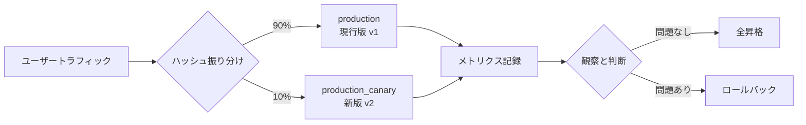
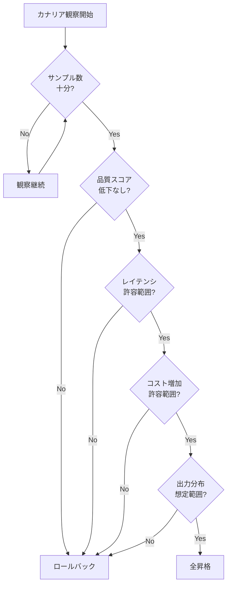

# はじめに

LLMアプリケーションの本番運用で「プロンプトを改善したいが、いきなり全置き換えするのは怖い」と感じたことはないでしょうか。オフライン評価ではv2の方が良いスコアを出した、それでも本番に流すと何が起きるか完全には分からない。

この不安に対処するための型がカナリアリリースです。本記事ではMLflow Prompt Registryのalias機能を使い、新プロンプトを一部のトラフィックにだけ流す仕組みを実装します。カナリアリリースの概念から始め、実装、メトリクス比較、昇格判断までを一通り辿ります。

題材は問い合わせトリアージのLLMアプリです。ユーザーからの問い合わせ本文を入力し、カテゴリ・優先度・回答案を出力する想定で、v1からv2への安全な移行をカナリアで実現します。

なお、MLflow Prompt RegistryとDatabricks Free EditionでのLLMOpsコアループは前回記事「[Databricks Free EditionだけでLLMOpsのコアループを1周する](https://qiita.com/taka_yayoi/items/dbea1db0e651b9773d35)」で扱いました。本記事はその続編として運用設計に踏み込みます。

# カナリアリリースとは

カナリアリリースは、新バージョンを本番環境の一部にだけ展開し、問題がないことを確認してから全体に展開するデプロイ戦略です。

名前の由来は、かつて炭鉱夫が有毒ガスの検知のためにカナリアをカゴに入れて坑道に持ち込んだ習慣にあります。カナリアは人間より先に異変を察知して鳴き止む。これになぞらえて、新版を「カナリア」として一部トラフィックに流し、問題があれば早期に検知する、というアイデアです。

類似する手法との違いを整理しておきます。

| 手法 | 目的 | 切替方法 |
| --- | --- | --- |
| ブルーグリーンデプロイ | 全切替を瞬時に、ロールバックを容易にする | 100%を一気に新版へ |
| A/Bテスト | どちらが良いかを定量的に比較する | 統計的に有意な差を出すまで継続 |
| カナリアリリース | 新版を安全に本番に流す | 小さな比率から徐々に拡大 |

LLMアプリケーションでカナリアが特に重要な理由は3つあります。

第一に、プロンプトの変更は影響範囲が読みにくいことです。指示文の一文を足しただけで、特定パターンの入力に対して挙動が大きく変わることがあります。

第二に、オフライン評価とオンライン挙動が乖離することです。評価データセットは本番の入力分布を完全にはカバーできないため、評価で良くても本番で予期せぬ挙動が出ることがあります。

第三に、品質以外の指標も変化することです。出力トークン数が増えればレイテンシとコストに直結します。新プロンプトが「丁寧に説明する」方向に変わると、品質スコアは同じでもコストが30%増えていた、というケースは珍しくありません。

カナリアリリースはこれらを「本番のごく一部で先に観察する」ことで早期発見する仕組みです。全体像をイメージしておきましょう。



# 設計: 2つのaliasで実装する

MLflow Prompt Registryのalias機能を使い、カナリアリリースを次のように設計します。

- `production`: 現行版のプロンプト (例: v1)
- `production_canary`: 新版のプロンプト (例: v2)

呼び出し側では、ユーザーIDのハッシュ値から振り分けを決定し、ハッシュ値が一定の範囲に入るユーザーだけ `production_canary` を使う実装にします。例えば10%のカナリア比率なら、ハッシュ値を100で割った剰余が0から9のユーザーがカナリア対象です。

:::note warn
MLflow Prompt Registryのalias名は、英字で始まり、英数字とアンダースコアのみが使えます。ハイフン (`-`) は使えないため、`production-canary` ではなく `production_canary` のように命名する必要があります。違反すると `INVALID_PARAMETER_VALUE: SetPromptAlias: Invalid alias name` というエラーが発生します。
:::

この設計の利点は次の通りです。

- alias操作だけで「全昇格」「ロールバック」「比率変更」が完結する
- 呼び出し側のコード変更が不要 (aliasを取得する処理は固定)
- 同一ユーザーは常に同じ版に当たるため、ユーザー体験が安定する
- MLflow Tracingに `prompt_alias` タグを残せば、後からメトリクス比較が容易

振り分けロジックの方式は、ユーザーIDハッシュベースと単純乱数ベースの2つが考えられます。LLMアプリケーションでは「同じユーザーが同じ質問をしたのに、毎回違う回答が返ってくる」状態は混乱を生むため、本記事ではユーザーIDハッシュベースを採用します。

# 実装1: プロンプト登録と振り分けロジック

問い合わせトリアージアプリのプロンプトをUnity Catalog配下のPrompt Registryに登録します。v1は優先度を3段階 (`高 / 中 / 低`) で判定する版、v2は5段階 (`緊急 / 高 / 中 / 低 / 情報`) に拡張した版です。「より細かい粒度で優先度を判定したい」という現場でよくある改善動機を想定しています。

```python
import mlflow

CATALOG = "workspace"
SCHEMA = "llmops_canary_demo"
PROMPT_NAME = f"{CATALOG}.{SCHEMA}.triage_assistant"

PROMPT_V1 = """あなたは顧客サポートのトリアージ担当です。
以下の問い合わせを分類し、JSON形式で出力してください。

出力スキーマ:
{
  "category": "billing | technical | account | other",
  "priority": "高 | 中 | 低",
  "draft_reply": "回答案 (200文字以内)"
}

問い合わせ:
{{inquiry}}
"""

PROMPT_V2 = """あなたは顧客サポートのトリアージ担当です。
以下の問い合わせを分類し、JSON形式で出力してください。

出力スキーマ:
{
  "category": "billing | technical | account | other",
  "priority": "緊急 | 高 | 中 | 低 | 情報",
  "draft_reply": "回答案 (200文字以内)"
}

優先度の判定基準:
- 緊急: サービス停止や金銭的損失に直結する事象
- 高: 業務に重大な支障があるが回避策はある
- 中: 利用に支障はあるが緊急性は低い
- 低: 改善要望や軽微な不便
- 情報: 単なる質問や情報共有

問い合わせ:
{{inquiry}}
"""

prompt_v1 = mlflow.genai.register_prompt(
    name=PROMPT_NAME,
    template=PROMPT_V1,
    commit_message="v1: 優先度3段階",
)

prompt_v2 = mlflow.genai.register_prompt(
    name=PROMPT_NAME,
    template=PROMPT_V2,
    commit_message="v2: 優先度を5段階に拡張",
)

# v1をproduction、v2をcanaryに設定
mlflow.genai.set_prompt_alias(name=PROMPT_NAME, alias="production", version=prompt_v1.version)
mlflow.genai.set_prompt_alias(name=PROMPT_NAME, alias="production_canary", version=prompt_v2.version)
```

ここまで実行したら、Unity CatalogのPrompts画面で状態を確認します。

- プロンプト `workspace.llmops_canary_demo.triage_assistant` が一覧に表示される
- バージョン v1, v2 の2つが並ぶ
- v1にコミットメッセージ「v1: 優先度3段階」、`production` aliasのバッジ
- v2にコミットメッセージ「v2: 優先度を5段階に拡張」、`production_canary` aliasのバッジ


詳細は[MLflow Prompt Registryのドキュメント](https://docs.databricks.com/aws/ja/mlflow3/genai/prompt-registry)を参照してください。

続いて、ユーザーIDから振り分けを決定する関数を実装します。

```python
import hashlib

def is_canary_user(user_id: str, canary_pct: int) -> bool:
    """ユーザーIDのハッシュ値からカナリア対象かを判定する。

    Args:
        user_id: ユーザーの一意な識別子
        canary_pct: カナリア比率 (0-100)

    Returns:
        Trueならカナリア (新版)、Falseなら現行版
    """
    h = hashlib.md5(user_id.encode("utf-8")).hexdigest()
    bucket = int(h, 16) % 100
    return bucket < canary_pct
```

ハッシュ関数にmd5を使っているのは、暗号学的な強度ではなく単純な分散性だけが必要だからです。同じuser_idは常に同じbucketに割り当てられるため、特定ユーザーが版を行き来することはありません。

振り分けロジックを使ってプロンプトを取得し、LLMを呼び出す関数は次のようになります。

```python
import json
import mlflow
from databricks.sdk import WorkspaceClient

w = WorkspaceClient()
client = w.serving_endpoints.get_open_ai_client()
MODEL_ENDPOINT = "databricks-meta-llama-3-3-70b-instruct"

CANARY_PCT = 10  # カナリア比率10%

@mlflow.trace
def triage(user_id: str, inquiry: str) -> dict:
    # ユーザーIDから振り分けを決定
    is_canary = is_canary_user(user_id, CANARY_PCT)
    alias = "production_canary" if is_canary else "production"

    # プロンプトをロード
    prompt_obj = mlflow.genai.load_prompt(f"prompts:/{PROMPT_NAME}@{alias}")
    prompt = prompt_obj.format(inquiry=inquiry)

    # トレースに版情報をタグとして記録
    mlflow.update_current_trace(
        tags={
            "prompt_alias": alias,
            "prompt_version": str(prompt_obj.version),
            "user_id": user_id,
        }
    )

    response = client.chat.completions.create(
        model=MODEL_ENDPOINT,
        messages=[{"role": "user", "content": prompt}],
        temperature=0.0,
        response_format={"type": "json_object"},
    )
    return json.loads(response.choices[0].message.content)
```

ポイントは2つあります。

1つ目は、`@mlflow.trace` で呼び出し全体をトレース対象にしていることです。これにより、後から「どのユーザーにどのaliasが当たり、何を出力したか」を全件追跡できます。

2つ目は、`mlflow.update_current_trace` でタグを残していることです。`prompt_alias` タグをキーにすればトレースをaliasごとに集計でき、これがメトリクス比較の基盤になります。

実際に複数ユーザーで `triage()` を呼び出してみましょう。Databricksノートブックで実行する場合、トレースはノートブックに紐づくExperimentに自動で記録されます。

カナリア比率10%の振り分けを画面上で確認するには、ある程度のサンプル数が必要です。10件しか流さなければカナリア対象が0件のことも珍しくないため、ここでは100件を流す例を示します。問い合わせ本文5パターンを user_001 から user_100 までのユーザーで反復する形にします。

```python
# 問い合わせの雛形 (実運用ではアプリの受信トラフィックがこれに相当)
inquiry_templates = [
    "決済画面でエラーが出て購入できません。至急対応してください。",
    "パスワードを忘れたのですが、リセット方法を教えてください。",
    "請求書のPDFが文字化けしています。",
    "アカウント解約の手続きを教えてください。",
    "ログインできず、ビジネスに支障が出ています。",
]

# user_001 〜 user_100 に問い合わせを割り当てる
sample_inquiries = [
    (f"user_{i:03d}", inquiry_templates[i % len(inquiry_templates)])
    for i in range(1, 101)
]

# 一括で呼び出してトレースを蓄積
results = []
for user_id, inquiry in sample_inquiries:
    result = triage(user_id, inquiry)
    results.append({"user_id": user_id, **result})

import pandas as pd
df = pd.DataFrame(results)
df.head()
```

呼び出した分だけトレースがMLflowに記録されます。`is_canary_user()` の振り分けにより、ユーザーIDのハッシュ値に応じて `production` または `production_canary` のいずれかが選ばれます。本例の100件では、`user_032`、`user_043`、`user_053`、`user_069`、`user_081`、`user_098` の6件がカナリア対象になります (ハッシュ値の分布の偶然により、期待値10%から多少ぶれます)。

ここでMLflowのTracing画面を開いて挙動を確認しましょう。

- トレース一覧に `triage` 呼び出しの履歴100件が並ぶ
- 各トレースに `prompt_alias` `prompt_version` `user_id` のタグが付与されている
- `prompt_alias` でフィルタすると、`production` (94件) と `production_canary` (6件) のトレースを分離して見られる
- カナリア対象のユーザーは毎回必ずカナリアに当たるため、再実行しても結果は同じになる (ハッシュベース振り分けの一貫性が確認できる)


:::note warn
ハッシュベース振り分けは「同一ユーザーが常に同じ版に当たる」のが利点ですが、ユーザー識別子が取得できない匿名アクセスでは機能しません。匿名トラフィックを含むサービスでは、セッションIDをuser_idの代替に使うなどの工夫が必要です。
:::

# 実装2: メトリクス比較

カナリアリリースの本質は「観察」です。流したあとに何を見るかを設計しないと、ただ振り分けただけで終わってしまいます。

LLMアプリケーションのカナリアで観察すべき指標を整理します。

| 指標カテゴリ | 具体的なメトリクス |
| --- | --- |
| 品質 | 評価ジャッジによるスコア、ユーザーフィードバック |
| パフォーマンス | レイテンシ (p50、p95)、エラー率 |
| コスト | 平均入力トークン数、平均出力トークン数 |
| 挙動の分布 | 出力カテゴリの分布、優先度の分布 |

最後の「挙動の分布」が特に重要です。品質スコアが同じでも、新版の方が「緊急」と判定する割合が大幅に増えていれば、運用現場のオペレーションに影響が出ます。

ここで、本記事の検証シナリオで起きると想定するメトリクス変化を見てみましょう。模擬データで生成した結果です。

```python
import pandas as pd
import numpy as np

# 模擬データ生成 (実運用ではMLflowトレースから集計)
np.random.seed(42)
n_prod = 900
n_canary = 100

metrics = pd.DataFrame({
    "alias": ["production"] * n_prod + ["production_canary"] * n_canary,
    "quality_score": np.concatenate([
        np.random.normal(0.82, 0.05, n_prod),
        np.random.normal(0.83, 0.05, n_canary),  # 品質はほぼ同等
    ]),
    "latency_ms": np.concatenate([
        np.random.normal(1200, 150, n_prod),
        np.random.normal(1450, 180, n_canary),  # レイテンシ微増
    ]),
    "output_tokens": np.concatenate([
        np.random.normal(180, 30, n_prod),
        np.random.normal(230, 40, n_canary),  # 出力トークン増
    ]),
})

# サマリー集計
summary = metrics.groupby("alias").agg(
    n=("quality_score", "size"),
    quality_mean=("quality_score", "mean"),
    latency_p50=("latency_ms", "median"),
    output_tokens_mean=("output_tokens", "mean"),
).round(3)
print(summary)
```

集計結果のイメージは次の通りです。

| alias | n | quality_mean | latency_p50 | output_tokens_mean |
| --- | --- | --- | --- | --- |
| production | 900 | 0.820 | 1198 | 180.2 |
| production_canary | 100 | 0.832 | 1448 | 229.8 |

品質スコアはほぼ同等ですが、レイテンシが20%増、出力トークン数が27%増しています。v2では優先度判定の基準が5段階に拡張され、各基準の説明がプロンプトに加わったことで、モデルがより詳細に思考した結果として出力が長くなっていると考えられます。

さらに、出力の分布を見ると別の問題が見えてきます。

| 優先度 | production | production_canary |
| --- | --- | --- |
| 緊急 | - | 22% |
| 高 | 30% | 28% |
| 中 | 45% | 30% |
| 低 | 25% | 15% |
| 情報 | - | 5% |

v1で「高」と判定されていたケースの多くが、v2では「緊急」に格上げされています。運用現場では「緊急」がインシデント対応チームへの即時通知に連動している、といった運用が組まれているはずです。22%が「緊急」と判定される世界は、運用キャパシティを超える可能性が高いと言えます。

# 昇格判断とロールバック

カナリア観察の結果を踏まえて、昇格・継続・ロールバックのどれを選ぶかを判断します。

判断のチェックリスト例を示します。

- 最低サンプル数を満たしているか (例: カナリア側で100件以上)
- 品質スコアが現行版以上か (有意な低下がないか)
- レイテンシp95が許容範囲内か
- コスト (トークン数) の増加が許容範囲内か
- 出力分布が想定範囲内か
- エラー率に異常な変化がないか

判断フローを図にすると次のようになります。



品質スコアの差については、サンプル数があれば簡単な統計的有意性検定で確認できます。t検定を使う例を示します。

```python
from scipy import stats

prod_scores = metrics[metrics["alias"] == "production"]["quality_score"]
canary_scores = metrics[metrics["alias"] == "production_canary"]["quality_score"]

t_stat, p_value = stats.ttest_ind(prod_scores, canary_scores)
print(f"t統計量: {t_stat:.3f}, p値: {p_value:.4f}")
```

p値が0.05より大きい場合、品質スコアに統計的に有意な差があるとは言えません。本シナリオでは品質スコアは同等で、有意差なしとなります。

:::note warn
t検定は「差があるかを統計的に判定する」道具であって、「差がないことを証明する」道具ではありません。p値が大きい場合は「有意な差は確認できなかった」と解釈すべきで、「差がない」と断定するには等価性検定 (equivalence test) など別の手法が必要です。本記事では概念紹介に留めますが、本格的な運用では統計の知見を持つメンバーと相談することをお勧めします。
:::

本シナリオの判断は次のようになります。

- 品質: 同等 (t検定でも有意差なし)
- レイテンシ: 20%増 (許容範囲を超える)
- 出力トークン: 27%増 (コスト影響大)
- 出力分布: 「緊急」判定が22%発生 (運用キャパ超過リスク)

総合的に「昇格すべきでない」という判断になります。v2はプロンプト自体を再設計するか、優先度基準の説明をより簡潔にする方向で改善が必要です。

カナリアを停止して現行版に戻すのは、alias操作だけで完結します。

```python
# カナリアaliasを削除して現行版だけに戻す
mlflow.genai.delete_prompt_alias(name=PROMPT_NAME, alias="production_canary")
```

Prompts画面で状態を確認します。

- v1に `production` aliasのバッジが残っている
- v2からは `production_canary` aliasのバッジが消えている (v2自体は履歴として残る)
- これがロールバック完了の状態


仮に全昇格すべきと判断できた場合は、aliasを付け替えるだけです。

```python
# v2を本番昇格
mlflow.genai.set_prompt_alias(name=PROMPT_NAME, alias="production", version=prompt_v2.version)
mlflow.genai.delete_prompt_alias(name=PROMPT_NAME, alias="production_canary")
```

全昇格を行った場合の画面状態は次のようになります。

- v2に `production` aliasのバッジが移動している
- v1からは alias が消える (v1自体は履歴として残り、緊急時のロールバック先として参照可能)
- v2が「本番」になったことが視覚的に確認できる

この「alias操作だけで本番切替が完結する」のがPrompt Registryによるカナリア設計の最大の利点です。コードもジョブも変更不要で、Unity Catalogの権限管理下でガバナンスを効かせながら本番影響を制御できます。

# カナリア運用のアンチパターン

実装は意外と簡単ですが、運用で形骸化しやすいポイントもあります。

1つ目はカナリア比率が小さすぎて判断できないケースです。「不安だから1%だけ流す」と設定したが、1日に来るトラフィックが少なくサンプルが集まらず、いつまでも判断できないというパターン。最低サンプル数を先に決め、そこに到達するまでの期間を見積もってから比率を決めるべきです。

2つ目は品質スコアしか見ないケースです。LLM-as-a-Judgeのスコアだけ見て「同等だから昇格」と判断すると、本記事のシナリオのようにコストやレイテンシ、出力分布の問題を見落とします。複数指標を組み合わせて判断する設計が必要です。

3つ目はカナリアを放置するケースです。「とりあえずカナリア」で流したまま、判断もせずに放置されると、`production_canary` aliasが長期間残ったまま、現行版とどちらが「正」なのか分からなくなることがあります。カナリア期間と判断期限をルールとして決めるべきです。

4つ目は振り分けの一貫性が壊れるケースです。ハッシュベース振り分けの利点は同一ユーザーが同じ版に当たることですが、aliasの定義を頻繁に変えると、同じユーザーが昨日は新版、今日は別の新版、と複数の版を体験することになります。カナリア期間中はaliasの定義を固定する運用が望ましいです。

# まとめ

MLflow Prompt Registryのalias機能を使い、プロンプトのカナリアリリースを実装しました。本記事のポイントは次の通りです。

- `production` と `production_canary` の2つのaliasを使い分け、alias操作だけで切替・ロールバックが完結する設計
- ユーザーIDハッシュベースの振り分けで、同一ユーザーの体験を一貫させる
- 品質スコアだけでなく、レイテンシ・コスト・出力分布の複数指標を観察する
- 統計的有意性検定で品質判定を補強する (ただし「差がない証明」ではないことに注意)
- カナリア期間と判断基準を事前に決めておく運用設計が重要

カナリアリリースは「不安を減らすための型」であって、評価や監視を不要にする魔法ではありません。前回記事の評価ループと組み合わせて初めて、LLMアプリケーションの継続的改善が安全に回ります。

# 書籍のご紹介

本記事で扱ったPrompt Registryの運用設計を、より体系的に学びたい方には共著で執筆した『[MLflowで実践するLLMOps──生成AIアプリケーションの実験管理と品質保証](https://www.amazon.co.jp/dp/4297155737)』(技術評論社・エンジニア選書、2026年4月発売) をお勧めします。

MLflow 3の4つのコアコンポーネント (Tracing / Evaluate & Monitor / Prompt Registry / AI Gateway) を軸に、シンプルなチャットボットからRAGシステム、マルチエージェントまで、「作って終わり」ではなく「運用し続けられる」LLMアプリケーションの構築方法を一冊にまとめています。日本語では初となるMLflow LLMOps専門書です。

本記事で扱ったaliasによる本番切替やカナリアリリースは、書籍第7章のPrompt Registry運用や、運用編 (第9-10章) のガバナンス・監視の議論と組み合わせるとさらに深く理解できます。

### はじめてのDatabricks

[はじめてのDatabricks](https://qiita.com/taka_yayoi/items/8dc72d083edb879a5e5d)

### Databricks無料トライアル

[Databricks無料トライアル](https://databricks.com/jp/try-databricks)
