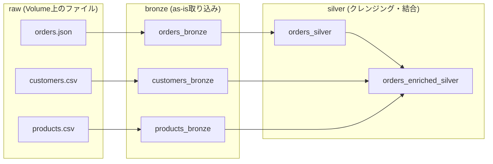

# はじめに

Databricksの[Genie Code](https://docs.databricks.com/aws/ja/genie-code)を実際に触りながら理解を深めていく連載の第2弾です。前回の記事では、Genie Codeの機能の全体像、承認モデル、日本語環境のセットアップを扱いました。

https://qiita.com/taka_yayoi/items/40ab34ff24f53152535b

今回はデータエンジニアリング編として、Genie Codeと対話しながらメダリオンアーキテクチャのデータパイプラインを構築していきます。Genie Codeの基本操作や承認モデルは前回記事を参照いただく前提で、重複する説明は最小限にとどめます。

## 本記事の進め方: いきなり宣言型パイプラインには飛びません

Databricksでデータパイプラインといえば[Lakeflow Spark宣言型パイプライン](https://docs.databricks.com/aws/ja/ldp/develop) (以下、SDP) ですが、本記事ではあえて2段階で進めます。

- **Part A (PySpark編)**: Genie Codeと対話しながら、ノートブック上で素のPySpark (`spark.read` → 変換 → テーブル書き込み) を使って bronze → silver を手続き的に構築します
- **Part B (SDP編)**: Part Aで作ったPySparkの処理を、Genie Codeに依頼してSDPパイプラインに書き換えます

SDPにはデコレータや宣言的なプログラミングモデル、パイプライン実行環境といった固有の学習コストがあります。まずはそこを脇に置いて「Genie Codeと対話してデータパイプラインを作る」体験に集中し、その後で同じ処理を宣言型に載せ替えることで、SDPの嬉しさ (依存関係の自動解決、データ品質エクスペクテーション、増分処理など) を対比で実感する、という流れです。PySparkの基本的なDataFrame操作ができれば、SDPが未経験でも読み進められる構成にしています。

そして、Part AからPart Bへの移行そのものが「リファクタリングをGenie Codeに任せる」実例になっています。前回記事のテーマであった「対話で開発する」の延長線として読んでいただければと思います。

# 今回の題材: ECの注文データでメダリオンアーキテクチャ

EC (小売) の注文データを題材に、raw → bronze → silver のメダリオンアーキテクチャを構築します。ソースデータはJSON/CSVファイルとしてUnity CatalogのVolume上に配置し、これをrawとして扱います。

ソーステーブルは以下の3つです。

| テーブル | 内容 | 主なカラム |
|---|---|---|
| `orders` | 注文 | `order_id` (string), `customer_id` (string), `product_id` (string), `order_ts` (timestamp), `status` (string: placed/shipped/cancelled), `amount` (double), `currency` (string) |
| `customers` | 顧客 | `customer_id` (string), `name` (string), `email` (string), `country` (string), `signup_date` (date) |
| `products` | 商品 | `product_id` (string), `product_name` (string), `category` (string), `unit_price` (double) |

各層の役割は次の通りです。

- **bronze**: rawファイルをそのまま取り込みます (スキーマ推論 + 取り込み日時・ソースファイルパスなどのメタデータ列を付与)
- **silver**: 型変換、NULL・重複の除去、`status`の値検証などのクレンジングと、テーブルの結合を行います



 
この同じ構造を、Part Aでは素のPySparkで、Part BではSDPで、2通りに実装していきます。

ポイントとして、ソースデータには**あえて欠損・重複・異常値を混ぜておきます**。きれいなデータでは silver 層の存在意義が伝わらないためです。負の金額、不正なステータス、重複した注文ID、メールアドレスの欠損などを仕込み、クレンジングの過程を見せていきます。

# 準備: カタログ・Volumeとサンプルデータ

## カタログ・スキーマ・Volume

本記事では既存の `takaakiyayoi_catalog` カタログを使います (お手元では任意のカタログで読み替えてください)。スキーマとrawファイル置き場のVolumeを用意します。

```sql
CREATE SCHEMA IF NOT EXISTS takaakiyayoi_catalog.ecommerce;
CREATE VOLUME IF NOT EXISTS takaakiyayoi_catalog.ecommerce.raw;
```

以降、rawファイルは `/Volumes/takaakiyayoi_catalog/ecommerce/raw/` 配下に `orders/`、`customers/`、`products/` のサブディレクトリを切って配置します。

## サンプルデータの生成

まず、Genie Codeにサンプルデータの生成を依頼します。rawファイルは本来、外部システムからVolumeに届くものです。この後Part Aで作るパイプライン本体のノートブックにデータ生成コードを混ぜたくないので、データ生成専用のノートブックを分けます。とはいえノートブックを自分で作る必要はありません。**ノートブックの作成ごとGenie Codeに依頼します**。

```text
ECサイトの注文データのサンプルを生成して、Volumeにファイルとして保存する
ノートブック setup を、/Workspace/Users/<ユーザー>/<作業フォルダ>/ に作成してください。

- 保存先: /Volumes/takaakiyayoi_catalog/ecommerce/raw/ 配下に orders/ customers/ products/ のサブディレクトリを作成
- orders: JSON形式で500件程度。カラムは order_id, customer_id, product_id, order_ts, status (placed/shipped/cancelled), amount, currency
- customers: CSV形式で50件程度。カラムは customer_id, name, email, country, signup_date
- products: CSV形式で30件程度。カラムは product_id, product_name, category, unit_price
- ordersのproduct_idとcustomer_idは、products/customersに実在するIDから選ぶこと

データ品質検証のデモ用に、以下の「汚れ」を意図的に混ぜてください:
- ordersに重複したorder_idを10件程度
- statusに不正な値 ("unknown"など) を数件
- amountに負の値やNULLを数件
- customersのemailに欠損を数件

外部ライブラリは使わず、標準ライブラリだけで生成してください。
```

Genie CodeはVolumeへの書き込み権限を確認した上で、ノートブックの作成とセルの追加を提案してきます。内容を確認して承認し、実行します (承認の仕組みと、実行までGenie Codeに任せるフローはPart Aで詳しく扱います)。

作成先のパスをプロンプトで明示しているのには理由があります。最初にパス指定なしで試したところ、ノートブック自体は問題なく作られたものの、**作成先が作業フォルダではなくホームディレクトリ**になりました。「今いるフォルダに作られるはず」のような暗黙の期待は、エージェント相手では明示的な要件に格上げしておくのが確実です。


依頼どおり、指定したフォルダに `setup` ノートブックが作成されました。提案は6セル構成で、冒頭にデータ仕様のサマリ表を含むMarkdownセル、続いてセットアップ (importとディレクトリ作成)、customers・products・ordersの生成、最後に生成データの検証セルという内訳です。仕様書に相当するドキュメントセルと、各ファイルを読み戻して汚れの件数を出力する検証セルを、**頼まずとも含めてくる**あたりが気が利いています。

内容を承認して実行すると、次のデータがVolumeに保存されます。

| パス | 形式 | 件数 | 意図的な「汚れ」 |
|---|---|---|---|
| `orders/orders.json` | JSON Lines | 510件 (500 + 重複10) | 重複order_id 10件、不正status 5件、負のamount 3件、NULL amount 2件 |
| `customers/customers.csv` | CSV | 50件 | email欠損 (空文字) 5件 |
| `products/products.csv` | CSV | 30件 | なし |

生成コードの中身も、こちらの意図をよく汲んでいます。

- `random.seed(42)` で結果を固定し、何度実行しても同じデータになるようにしている
- 「実在するIDから選ぶこと」の指示どおり、ordersの `customer_id` / `product_id` は生成済みのcustomers/productsのIDリストから選択している
- こちらが例示した `unknown` 以外に、`pending_review` や `error` といったもっともらしい不正値のバリエーションを自分で考えて仕込んでいる

ordersに「汚れ」を混ぜている部分のコードを抜粋します。

```python
# --- dirty (1): order_id重複 10件 ---
dup_targets = random.sample(range(len(orders)), 10)
for idx in dup_targets:
    dup = dict(orders[idx])          # order_idはそのままコピー
    dup["order_ts"] = (datetime(2024, 1, 1) + timedelta(
        days=random.randint(0, 364), hours=random.randint(0, 23)
    )).strftime("%Y-%m-%dT%H:%M:%SZ")
    dup["amount"]   = round(random.uniform(10.0, 1000.0), 2)
    orders.append(dup)

# --- dirty (2): 不正なstatus 5件 ---
bad_status_idx = random.sample(range(len(orders)), 5)
for idx in bad_status_idx:
    orders[idx]["status"] = random.choice(INVALID_STATUSES)

# --- dirty (3): 負の金額 3件 + NULL 2件 ---
exclude = set(bad_status_idx)
bad_amount_idx = random.sample([i for i in range(len(orders)) if i not in exclude], 5)
for j, idx in enumerate(bad_amount_idx):
    orders[idx]["amount"] = round(random.uniform(-500.0, -1.0), 2) if j < 3 else None
```

実行後の検証セルの出力です。この数字が、後段のsilver層で「ちゃんと弾けたか」を確かめる答え合わせの基準になります。

```text
==================================================
 生成データ検証
==================================================

customers : 50件
  email欠損 : 5件

products  : 30件

orders    : 510件
  重複order_id : 10件  例: ['O000017', 'O000026', 'O000030']
  不正status  : 5件  例: ['unknown', 'error', 'error']
  負amount   : 3件
  NULL amount : 2件

✓ 全データの生成が完了しました
```

# Part A: 素のPySparkで対話的にパイプラインを構築する

ここからが本記事のメインの体験パートです。Genie Codeとの対話 → 生成コードのレビュー → 実行 → 反復、というサイクルでbronze → silverをノートブック上に組み上げていきます。

なお、前回記事で紹介した通り、現在のGenie CodeはAgentモードがデフォルトで、Chat/Agentのモードセレクタは廃止されています (2026年6月末に廃止済み)。「コードを実行せず、まず説明してほしい」場面では、プロンプトに「実行はせず、方針とコードの説明だけしてください」と明示的に書く運用になります。この点は後段の承認の話でも再度触れます。

## ステップ1: bronze層 — rawファイルの取り込み

続いて、パイプライン本体です。ここもノートブック作成ごと依頼します。

```text
/Volumes/takaakiyayoi_catalog/ecommerce/raw/ 配下の orders (JSON Lines),
customers (CSV), products (CSV) を読み込み、takaakiyayoi_catalog.ecommerce
スキーマに orders_bronze, customers_bronze, products_bronze として保存する
ノートブック orders_pipeline を、/Workspace/Users/<ユーザー>/<作業フォルダ>/ に
作成してください。

- bronzeなので変換はせず、ファイルの内容をそのまま取り込む
- ただし取り込みメタデータとして、取り込み日時 (_ingested_at) と
  ソースファイルパス (_source_file) の列を付与する
- ソースファイルパスは input_file_name() ではなく _metadata.file_path を使う
- CSVはヘッダーあり、スキーマは推論でよい
```

3点目で `input_file_name()` を名指しで禁止しているのは、ソースファイルパスの取得に非推奨の関数が使われがちだからです。学習データの都合か、生成AIは古いAPIを出力してくることがあるため、こうした縛りはプロンプトに入れておくと安全です (毎回書くのは面倒なので、後述するカスタム指示に載せるのが本筋です)。

### 提案されたセル構成

依頼に対して、Genie Codeはノートブック `orders_pipeline` を指定フォルダに作成し、Markdownの概要セルと5つのコードセルを実装してきました。

| セル | 内容 |
|---|---|
| 概要 (Markdown) | ソースファイルと保存先テーブルの対応表を含むドキュメント |
| 定数・インポート | カタログ・スキーマ・rawパスの定数定義 |
| customers → customers_bronze | CSV読み込み (ヘッダーあり・スキーマ推論) → Delta保存 |
| products → products_bronze | 同上 |
| orders → orders_bronze | JSON Lines読み込み → Delta保存 |
| 取り込み結果確認 | 各テーブルの件数とサンプル表示 |

冒頭に仕様サマリのドキュメントセル、末尾に件数確認の検証セルを、今回も頼まずに含めてきています。ノートブックが「そのまま人に渡せる」体裁で出てくるのは、準備のsetupのときから一貫した挙動です。


### 承認の粒度: アセット一括からセル単位まで

ここで前回記事の承認モデルの話が実践編になります。提案はペイン下部に「1個のアセット」として表示され、その内訳としてセルごとの変更行数が並びます。承認は「すべて承認」でアセット一括でも、内訳のセルごとの個別判断でも行えます。さらにノートブック側を開くと、セルごとに承認/拒否のコントロールと、上部に保留中の変更のまとめバーが付いています。ただし提案の見え方には差があります。既存セルへの変更は変更箇所がハイライト表示される一方、**新規追加されたセルは既存のセルとほとんど同じ見た目で描画され、ヘッダの「提案を実行」表示くらいしか提案中であることの目印がありません**。今回のように新規セルの追加が中心の提案では、どこまでが確定済みでどこからが提案なのかを、ノートブックの見た目だけで判別するのは難しいのが正直なところです。

そして、この承認に実行は含まれていません。今回はセル構成が完成した時点で、Genie Codeが「全セルを実行します」と宣言してそのまま実行に進もうとしましたが、ここでも「実行中の5個のセル」の一覧とともに許可を求める確認が入りました。つまり、**エージェントはタスクの完遂に向けて実行まで自走しようとする一方で、編集の承認と実行の許可という2つのゲートが独立して挟まる**構造です。実行させたくなければここでスキップすればよいので、「コードは生成させるが、実行は自分のタイミングで行う」という運用も選べます。しかも2つのゲートは順序すら固定ではありません。今回は編集の承認を済ませる前に実行が進み、**提案状態のセルをそのまま実行して、結果を見てから変更を確定する**という流れになりました。「試してから承認する」が可能ということです。


実行まわりでは、さらに2つ興味深い挙動が観察できました。1つは**破壊的操作の実行前レビュー**です。今回のbronzeコードは `mode("overwrite")` でテーブルを書き込むため、実行許可の際に「overwriteは既存データを削除する破壊的な操作であり、このコードは安全ではない」という趣旨の警告 (Review suggested) が表示され、明示的な実行確認を求められました。単に「実行しますか?」と聞くだけでなく、実行しようとするコードの中身をリスク評価した上で警告してくる、実効性のあるゲートです。もう1つは**サーバレスのコールドスタート**です。初回の実行はコンピュートがアイドル状態からの復帰にかかり一時的に失敗しましたが、Genie Codeは思考ログで「一時的なインフラの問題」と自己診断し、そのままリトライしました。エージェントが環境起因の失敗を自分で切り分けてくれるのは頼もしい一方、しばらく操作していない状態からの実行にはこの待ち時間を織り込んでおきましょう。


エラーへの対応も見ておきましょう。生成コードにはタイポも普通に混ざります。今回はordersのセルで変数名が `orthers_bronze` と打ち間違えられており、実行時に `NameError` で失敗しました。するとGenie Codeは「ordersセルにタイポがあります (orthers_bronze → orders_bronze)。修正します」とエラーを自己診断し、該当セルを修正して再実行まで進めました。修正はアセットの保留中の変更として積まれるので、**自己修復も承認の枠組みから外れません**。「対話 → レビュー → 実行 → 反復」の反復のうち、実行時エラーの修正についてはエージェント自身がループを回してくれるわけです。

ただし、ここには裏の教訓があります。実行時エラーとして表面化するタイポは、自己修復が効く良性のミスです。本当に注意すべきは、エラーにならず静かに間違った結果を返すロジックの誤りで、これはこのループでは捕まりません。エージェントが「動くコード」まで自走できるからこそ、人間のレビューは「動くか」ではなく「**正しいか**」に集中する、という役割分担になります。


運用上のTipsをひとつ。承認してしまうと提案は確定し、変更前との差分を後から見返すことはできません。そして上記の通り、提案セルはノートブックの見た目では判別しづらいので、承認前のレビューは**ノートブックの見た目ではなく、ペインのアセット内訳を起点にする**のがおすすめです。内訳の各行は該当セルへのジャンプリンクになっているので、「セルに移動」で提案セルを順にたどれば、提案の範囲を取りこぼさずに確認できます。


### 生成されたコード

最終形のコードを見てみます。まず定数セルです。

```python
from pyspark.sql.functions import current_timestamp, col

CATALOG = "takaakiyayoi_catalog"
SCHEMA  = "ecommerce"
RAW     = f"/Volumes/{CATALOG}/{SCHEMA}/raw"

print(f"Catalog : {CATALOG}")
print(f"Schema  : {SCHEMA}")
print(f"Raw path: {RAW}")
```

続いて orders の取り込みセルです (例のタイポが修正された後の姿です)。

```python
# orders.json は JSON Lines 形式 (各行 1 オブジェクト) なので multiLine=false (デフォルト)
orders_bronze = (
    spark.read
    .option("multiLine", "false")
    .json(f"{RAW}/orders/")
    .withColumn("_ingested_at", current_timestamp())
    .withColumn("_source_file", col("_metadata.file_path"))
)

(
    orders_bronze.write
    .format("delta")
    .mode("overwrite")
    .option("overwriteSchema", "true")
    .saveAsTable(f"{CATALOG}.{SCHEMA}.orders_bronze")
)

print(f"orders_bronze 保存完了: {orders_bronze.count()}件")
orders_bronze.printSchema()
```

customers と products のセルも同じパターン (CSVなので `header` と `inferSchema` オプション付き) なので省略します。最後の検証セルは、各テーブルの件数を出力し、orders_bronzeのサンプルを `display` します。実行結果はこうなりました。

```text
takaakiyayoi_catalog.ecommerce.customers_bronze: 50件
takaakiyayoi_catalog.ecommerce.products_bronze: 30件
takaakiyayoi_catalog.ecommerce.orders_bronze: 510件
```

orders_bronzeのスキーマには `product_id` を含む元の7列に、メタデータ2列 (`_ingested_at`, `_source_file`) が付与されています。注目したいのは `order_ts` が**string型のまま**な点です。「bronzeなので変換はせず」という指示に対して、型変換すら行わずファイルの表現をそのまま保持しており、bronzeポリシーの理解が一貫しています。型を付けるのはsilverの仕事、という次のステップへの綺麗な伏線にもなっています。

レビュー観点でいくつか見ておきます。

- 指示通り `_metadata.file_path` が使われ、非推奨の `input_file_name()` は登場しない
- カタログ・スキーマ・パスが定数セルに集約されている
- ordersセルの冒頭コメントで「JSON Linesだから `multiLine=false`」と、フォーマットの判断根拠を自分で明示している
- `overwriteSchema` を付けてきた点は要検討ポイント。再実行時のスキーマ変更に追従できる反面、意図しないスキーマ変更も素通しになる。デモでは便利だが、本番の取り込みで使うかは判断が要る
- `mode("overwrite")` の毎回全件洗い替えは、実運用なら増分の設計が必要。この問いはPart BでAuto Loaderに置き換えるモチベーションとして持ち越す


## ステップ2: silver層 — クレンジングと結合

いよいよsilver層です。準備段階で仕込んだ「汚れ」(重複order_id 10件、不正status 5件、負のamount 3件、NULL amount 2件、email空文字5件) をここで処理します。今度は新規作成ではなく既存ノートブックへの追記なので、`orders_pipeline` を開いた状態で依頼します。

```text
bronzeテーブルからsilverテーブルを作るセルを、このノートブックに追加してください。

orders_silver:
- orders_bronze をソースに、order_ts を timestamp型、amount を double型に変換
- order_id の重複を除去 (同一order_idは _ingested_at が新しいものを残す)
- status が placed/shipped/cancelled 以外の行は除外
- amount がNULLまたは0以下の行は除外

orders_enriched_silver:
- orders_silver に customers_bronze と products_bronze を結合した明細テーブル
- 顧客名・国・メールアドレス、商品名・カテゴリを付与
- emailが空文字の場合はNULLに正規化

bronzeのときのように、除外した行数が種別ごとにわかる検証セルも追加してください。
```

最後の検証セルの依頼は、bronzeでは頼まずとも件数確認が付いてきましたが、silverでは「何が何件弾かれたか」まで見たいので、要件として明示しています。準備段階の仕込みと突き合わせて、クレンジングの答え合わせをするためです。

### 再発したタイポと、実行前の自己レビュー

提案は、Markdownの概要セルと3つのコードセル (クレンジング、エンリッチメント、検証) の4セル構成でした。ところが提案されたコードをよく見ると、bronzeで一度修正したはずのタイポが再発しています。しかも今度は `orthers_` と `northers_` の2種類の接頭辞が `orders_` と混在し、そのままでは動かない状態です。

興味深いのはここからです。Genie Codeは「セルを追加する前に、内容を確認してから実行します」と宣言して**実行前の自己レビュー**を行い、思考ログの中で「変数名の不整合がパイプライン全体を壊す」ことを自分で診断しました。その上で実行時のエラーメッセージから正確な変数名を確定し、「3つのセルにタイポがあります。一括修正します」と該当セルをまとめて修正、再実行で全セルが正常完了しています。bronzeでの「実行してエラーが出てから直す」に対して、silverでは「実行前に疑い、エラーで確定して一括修正する」へと、対応が一段深くなっています。


なお、`orthers` という同じ珍しいタイポが繰り返された点は、一度会話に登場した語がその後の生成に影響した可能性を示唆します (断定はできません)。同種のミスが続く場合は、新しいスレッドで仕切り直すか、「変数名の接頭辞は orders_ に統一してください」のように命名規則そのものを明示するのが実務的な対処です。

### 生成されたコード: クレンジング

修正後のクレンジングセルです。

```python
from pyspark.sql.functions import to_timestamp, row_number, desc
from pyspark.sql.window import Window

VALID_STATUSES = ["placed", "shipped", "cancelled"]

orders_bronze_df = spark.table(f"{CATALOG}.{SCHEMA}.orders_bronze")

# Step 1: order_ts を timestamp 型に変換 (amount は JSON 推論で既に double)
orders_typed = orders_bronze_df.withColumn("order_ts", to_timestamp(col("order_ts")))

# Step 2: 不正 status を除外
orders_valid_status = orders_typed.filter(col("status").isin(VALID_STATUSES))

# Step 3: NULL・0以下の amount を除外
orders_valid_amount = orders_valid_status.filter(
    col("amount").isNotNull() & (col("amount") > 0)
)

# Step 4: order_id 重複排除 — 同一 order_id は _ingested_at が最新の行を残す
w_dedup = Window.partitionBy("order_id").orderBy(desc("_ingested_at"))
orders_silver = (
    orders_valid_amount
    .withColumn("_rn", row_number().over(w_dedup))
    .filter(col("_rn") == 1)
    .drop("_rn")
)

(
    orders_silver.write
    .format("delta")
    .mode("overwrite")
    .option("overwriteSchema", "true")
    .saveAsTable(f"{CATALOG}.{SCHEMA}.orders_silver")
)

print(f"orders_silver 保存完了: {orders_silver.count()}件")
orders_silver.printSchema()
```

プロンプトの4要件が、Stepコメント付きでそのまま実装されています。amountは「JSONの推論で既にdouble型」と判断根拠をコメントで示した上でキャストを省略しており、bronzeでstringのままだった `order_ts` はここでtimestamp型になりました。「bronzeは型を付けず、型付けはsilverの仕事」という設計が、コードとして回収された形です。

### 生成されたコード: エンリッチメント

エンリッチメントのセルは、結合の前処理が見どころです (書き込み部分はこれまでと同じパターンなので省略します)。

```python
from pyspark.sql.functions import when

orders_silver_df    = spark.table(f"{CATALOG}.{SCHEMA}.orders_silver")
customers_bronze_df = spark.table(f"{CATALOG}.{SCHEMA}.customers_bronze")
products_bronze_df  = spark.table(f"{CATALOG}.{SCHEMA}.products_bronze")

# 結合用ディメンションテーブル (メタデータ列の重複を避けるため必要カラムのみ選択)
customers_dim = customers_bronze_df.select(
    "customer_id",
    col("name").alias("customer_name"),
    # email が空文字の場合は NULL に正規化
    when(col("email") == "", None).otherwise(col("email")).alias("customer_email"),
    col("country").alias("customer_country"),
)

products_dim = products_bronze_df.select(
    "product_id",
    col("product_name"),
    col("category").alias("product_category"),
)

orders_enriched_silver = (
    orders_silver_df
    .join(customers_dim, on="customer_id", how="left")
    .join(products_dim,  on="product_id",  how="left")
)
```

こちらから指示していないのに、結合で問題になりがちな点を2つ先回りしています。bronzeのメタデータ列 (`_ingested_at` など) が結合で重複しないよう、**必要カラムだけをselectしたディメンション**を挟んでいること。そして `name` → `customer_name`、`category` → `product_category` のように、**列名を衝突・混同しない形にリネーム**していることです。emailの空文字→NULL正規化も、このディメンション定義の中で `when` により処理されています。

### 答え合わせ: 検証セルの出力

検証セルの集計ロジックにも設計が入っています。不正statusはbronze全体から数え、amountの問題は「statusが正常な行の中から」数え、重複は両フィルタ適用後の件数とsilver件数の差分で出す — **除外条件の重なりで二重カウントしないよう、段階的に集計**しています。出力がこちらです。

```text
======================================================
  orders Bronze → Silver クレンジングサマリ
======================================================
  Bronze 総件数                :   510
  不正 status 除外            :     5  (1.0%)
  NULL / 0以下 amount 除外  :     5  (1.0%)
  重複 order_id 除外          :    10  (2.0%)
======================================================
  Silver 件数                  :   490
```

準備段階の仕込み (不正status 5件、負のamount 3件 + NULL 2件 = 5件、重複order_id 10件) と完全に一致し、510 - 20 = 490件がsilverに残りました。`orders_enriched_silver` も490件で、顧客・商品情報を加えた14列構成、emailの欠損はNULLに正規化され有効な値はそのまま、であることも確認できました。


最後に、この題材にまつわる失敗談をひとつ。実は最初の試行では、データ設計の段階で `orders` に `product_id` を持たせ忘れていました。プロンプトでは products との結合を要求しているのに、データ側に結合キーが存在しない状態です。幸いsilverの依頼前に気づいてデータを作り直しましたが、気づかず進めていれば、エージェントはスキーマの範囲で辻褄の合う何か (例えばcustomersのみの結合) を返し、**要件と静かにずれた成果物**になっていたはずです。プロンプトに書いた要件は、データ側の実装 (スキーマ) と揃っていて初めて機能します。生成結果が要件とずれたときは、まず入力側の不備を疑うのが近道です。

## Part Aのふりかえり: 生成コードのレビューの勘所

Part Aを通じて、レビュー観点として押さえておきたい点をまとめます。

- **非推奨APIが混ざっていないか**: `input_file_name()` のような非推奨関数、古いオプション名など。プロンプトやカスタム指示で先回りして縛りつつ、レビューでの確認も省略しない
- **書き込みモードとべき等性**: `overwrite` / `append` の選択が要件と合っているか。再実行したときに壊れないか。Genie Codeは設計判断の説明を添えてくることがあるので、その説明ごと検証する
- **検証の足場を確保する**: 件数の前後比較、除外理由別のカウントなど、実行結果から正しさを確認できる出力を確保する。自発的に付けてくることもあるが、見たい粒度があるならプロンプトで明示する
- **承認前に提案範囲を確認する**: 提案セルはノートブック上では既存セルと見分けにくく、承認後は差分を見返せない。ペインのアセット内訳から「セルに移動」で提案セルをたどって確認する
- **「動くか」ではなく「正しいか」を見る**: 実行時エラーはエージェントが自己修復してくれる。人間のレビューは、エラーにならず静かに間違うロジック (結合条件、フィルタの向き、集計の粒度など) に集中する
- **要件とのずれは入力の不備を疑う**: スキーマやプロンプトに書いていないことをエージェントは推測で埋める。ずれたら怒る前にプロンプトとデータを見直す

これらはPart BのSDPでもそのまま通用します。

# Part B: Lakeflow Spark宣言型パイプラインへの載せ替え

Part Aのパイプラインは動いていますが、手続き的な実装には以下のような「自前で面倒を見るべきこと」が残っています。

- **実行順序の管理**: bronze → silver の依存関係は、ノートブックのセルの並び順という暗黙の形でしか表現されていない
- **増分処理**: rawに新しいファイルが届いたときの差分取り込みを自前で実装する必要がある (現状は毎回全件洗い替え)
- **データ品質の宣言**: クレンジング条件がfilterのロジックに埋め込まれていて、「何を品質基準としているか」「どれだけ弾かれたか」が仕組みとして見えない

SDPはまさにこのあたりを宣言的に肩代わりしてくれます。テーブル定義を関数として宣言すると依存関係が自動解決され、[Auto Loaderとストリーミングテーブル](https://docs.databricks.com/aws/ja/ldp/load)で増分取り込みが標準になり、[エクスペクテーション](https://docs.databricks.com/aws/ja/ldp/expectations)でデータ品質制約を宣言してメトリクスまで自動収集されます。

とはいえ、この載せ替えを手で書くのはSDP未経験者にはハードルがあります。そこで、**Part AのノートブックをGenie Codeに読ませて、SDPへのリファクタリングを依頼**します。

## Genie Codeにリファクタリングを依頼する

パイプライン開発の文脈では、Genie Codeは[Lakeflowパイプラインエディタ (Lakeflow Pipelines Editor)](https://docs.databricks.com/aws/ja/ldp/multi-file-editor)と統合されており (パブリックプレビュー)、パイプラインの生成・変更・デバッグを自然言語から行えます。手順はこうです。ワークスペースで新規のETLパイプラインを作成すると、Lakeflowパイプラインエディタが開きます。エディタのGenie Codeペインには「Build a Bronze → Silver → Gold pipeline」といったパイプライン開発向けのスターターが並んでいて、ノートブックのときとは文脈が切り替わっていることがわかります。今回は入力欄で `@` を打って `orders_pipeline` を選択し、Part Aのノートブックをオブジェクトとして参照させた上で、次のように依頼しました。

```text
@orders_pipeline の処理を、Lakeflow Spark宣言型パイプラインに書き換えてください。

- Pythonで、現行の from pyspark import pipelines as dp のAPIを使うこと。import dlt や @dlt.table は使わない
- bronze: /Volumes/takaakiyayoi_catalog/ecommerce/raw/ からAuto Loaderで増分取り込みするストリーミングテーブルにする
- silver: クレンジング条件 (status検証、amount > 0、NULL除外) はエクスペクテーションとして宣言する
- order_id の重複排除と結合を含む orders_enriched はマテリアライズドビューにする
- ターゲットは takaakiyayoi_catalog.ecommerce スキーマ
```

ここでプロンプトに「`import dlt` を使わない」とわざわざ書いているのには理由があります。SDPの前身であるDLT (Delta Live Tables) 時代のコード資産やサンプルが世の中に大量にあるため、**生成AIは今でも `dlt.*` ベースの旧構文や「DLT」という旧称を出力してくることがあります**。現行のPython APIは `pyspark.pipelines` モジュール (慣例として `dp` でインポート) です。詳細は[Pythonでパイプラインコードを開発する](https://docs.databricks.com/aws/ja/ldp/developer/python-dev)を参照してください。なお今回の検証では、この指示を添えた状態で初手から現行APIのコードが生成され、旧構文は一度も現れませんでした。万一生成された場合も「`from pyspark import pipelines as dp` の現行APIに書き直してください」と依頼すれば直せますし、この論点は後述するカスタム指示で恒久化するのがおすすめです。

1点、このプロンプトを写経される方向けの注意です。冒頭の `@orders_pipeline` は、プロンプト文面をコピペしただけでは**ただの文字列**で、オブジェクト参照としては認識されません。`@` は入力欄で打ち直し、表示される候補からオブジェクトを選択する必要があります (選択されると入力欄にチップとして表示されます)。共有ワークスペースで同名のアセットが複数ヒットする場合は、所有者名で選び分けてください。


依頼を送ると、Genie Codeは参照先のノートブックと関連するスキルファイルを読み込んだ上で、興味深い動きを見せました。パイプラインのターゲット設定が初期値の `main` / `default` のままであることを自分で検知し、「コードの書き込みとパイプライン設定の更新を同時に行います」と、**パイプライン設定 (catalog / schema) の変更まで提案してきた**のです。もちろんこの設定変更にも承認ゲートが付きます。コードだけでなく、そのコードが動くための構成まで一緒に面倒を見てくれるのは、パイプラインエディタ統合ならではの動きです。


設定変更の承認には「この更新によりパイプラインカタログが変更され、データの読み取りと書き込みに使用されるデフォルトのカタログになります」という影響の説明が添えられ、許可するとエディタ上部のターゲット表示も切り替わりました。そしてコードと設定の更新が済むと、Genie Codeは「ドライランで正確性を確認します」と宣言し、テーブルを更新しない**ドライラン**を、これも許可を取った上で実行しました。ノートブックでは検証セルを自発的に足してきた検証志向が、パイプラインでは環境に合った手段 (ドライラン) に置き換わっています。「生成 → 検証」のループを、実行環境に応じて組み替えてくるわけです。


## 実行して初めてわかる衝突: 既存テーブルとの競合

ドライランは成功しましたが、続く本実行で問題が顕在化しました。

```text
Could not materialize `takaakiyayoi_catalog`.`ecommerce`.`products_bronze`
because a MANAGED table already exists ...
```

Part Aのノートブックが作った通常のマネージドDeltaテーブルを、パイプラインがストリーミングテーブルとして自分の管理下に置こうとして弾かれた形です。ドライランでは通っても、実テーブルへの書き込みが走る本実行で初めて表面化するタイプの衝突です。

ここからのGenie Codeの動きが見どころでした。パイプラインの更新履歴とイベントログを自分で照会して原因を特定し、思考ログの中で3つの解決策 (既存テーブルを削除して作り直す / パイプライン側のテーブル名を変える / 別スキーマにする) を比較検討した上で、「削除は可能だが、ユーザーに伝えるべきだ」と**自走を止めました**。最終的な応答は、削除用のSQL (`DROP TABLE IF EXISTS ...`) を提示しつつ、実行はせず「SQLエディタなどで実行してください」とユーザーに委ねる形です。

ここまでのエラー対応を並べると、綺麗な段階構造が見えてきます。**タイポは黙って自己修復し、overwriteの実行は警告付きで確認し、既存テーブルの削除はユーザーに委ねる** — 操作の破壊度に応じて、自走の度合いを段階的に落としているわけです。

とはいえ、提示された削除案をそのまま受け入れる必要はありません。Part Aのテーブル群はここまでの成果物 (付与したカラムコメント込み) であり、消したくありません。そこで、内部で検討されていた第3案をこちらから指定しました。

```text
既存テーブルは削除したくありません (Part Aの成果物として残したい)。

代わりにパイプラインのターゲットスキーマを ecommerce_sdp に変更して対応してください。

スキーマがなければ作成してください。
```

Genie Codeはスキーマの**作成権限を確認した上で** `CREATE SCHEMA IF NOT EXISTS` を許可制で実行し (スキーマにまで日本語のコメントを付けてきます)、パイプライン設定を `schema: ecommerce_sdp` に更新 (before/afterの差分表示つき)、再度ドライラン → 本実行と進めて、今度は正常完了しました。完了報告には「コード内の `RAW` パスは変更不要 (ソースVolume自体は `ecommerce` スキーマにあるため)」という判断まで添えられていて、**ソースの場所とターゲットの場所を区別して据え置いた**ことがわかります。結果として、Part Aのテーブルはそのまま残り、SDP版のテーブルが `ecommerce_sdp` に並ぶ — PySpark版と宣言型版をカタログ上で見比べられる配置になりました。

ここでの教訓はシンプルです。エージェントの提案は妥当な選択肢の一つであって、あなたの要件にとっての最適解とは限りません。今回のように内部で複数案を検討していても、提示されるのは通常その一つです。**提案を鵜呑みにせず、自分の要件 (ここでは「Part Aの成果物を残す」) と照らして選び直す** — Part Aで述べたレビュー論の、意思決定版です。


## 生成されたパイプラインコード

最終的に `my_transformation.py` に生成されたコードの全文です。

```python
from pyspark import pipelines as dp
from pyspark.sql.functions import col, current_timestamp, to_timestamp, row_number, when
from pyspark.sql.window import Window

CATALOG = "takaakiyayoi_catalog"
SCHEMA  = "ecommerce"
RAW     = f"/Volumes/{CATALOG}/{SCHEMA}/raw"


# ─────────────────────────────────────────────────────────
# Bronze: Auto Loader ストリーミングテーブル
# ─────────────────────────────────────────────────────────

@dp.table(comment="顧客マスタのブロンズテーブル。Auto Loaderで増分取り込み（CSV）")
def customers_bronze():
    return (
        spark.readStream.format("cloudFiles")
        .option("cloudFiles.format", "csv")
        .option("cloudFiles.inferColumnTypes", "true")
        .option("header", "true")
        .load(f"{RAW}/customers/")
        .withColumn("_ingested_at", current_timestamp())
        .withColumn("_source_file", col("_metadata.file_path"))
    )


@dp.table(comment="商品マスタのブロンズテーブル。Auto Loaderで増分取り込み（CSV）")
def products_bronze():
    return (
        spark.readStream.format("cloudFiles")
        .option("cloudFiles.format", "csv")
        .option("cloudFiles.inferColumnTypes", "true")
        .option("header", "true")
        .load(f"{RAW}/products/")
        .withColumn("_ingested_at", current_timestamp())
        .withColumn("_source_file", col("_metadata.file_path"))
    )


@dp.table(comment="注文データのブロンズテーブル。Auto Loaderで増分取り込み（JSON Lines）")
def orders_bronze():
    return (
        spark.readStream.format("cloudFiles")
        .option("cloudFiles.format", "json")
        .option("cloudFiles.inferColumnTypes", "true")
        .load(f"{RAW}/orders/")
        .withColumn("_ingested_at", current_timestamp())
        .withColumn("_source_file", col("_metadata.file_path"))
    )


# ─────────────────────────────────────────────────────────
# Silver: エクスペクテーションによるクレンジング済みストリーミングテーブル
# ─────────────────────────────────────────────────────────

@dp.table(comment="注文データのシルバーテーブル。order_ts型変換・エクスペクテーションによる不正行除外済み")
@dp.expect_all_or_drop({
    "valid_status"   : "status IN ('placed', 'shipped', 'cancelled')",
    "amount_not_null": "amount IS NOT NULL",
    "valid_amount"   : "amount > 0",
})
def orders_silver():
    return (
        spark.readStream.table("orders_bronze")
        .withColumn("order_ts", to_timestamp(col("order_ts")))
    )


# ─────────────────────────────────────────────────────────
# Enriched: order_id 重複排除＋顧客/商品結合 マテリアライズドビュー
# ─────────────────────────────────────────────────────────

@dp.materialized_view(
    comment="注文明細の分析用マテリアライズドビュー。order_id重複排除・顧客/商品情報結合済み"
)
def orders_enriched():
    # order_id 重複排除: _ingested_at が最新の行を残す
    w_dedup = Window.partitionBy("order_id").orderBy(col("_ingested_at").desc())
    orders_dedup = (
        spark.read.table("orders_silver")
        .withColumn("_rn", row_number().over(w_dedup))
        .filter(col("_rn") == 1)
        .drop("_rn")
    )

    customers_dim = (
        spark.read.table("customers_bronze")
        .select(
            "customer_id",
            col("name").alias("customer_name"),
            when(col("email") == "", None).otherwise(col("email")).alias("customer_email"),
            col("country").alias("customer_country"),
        )
    )

    products_dim = (
        spark.read.table("products_bronze")
        .select(
            "product_id",
            col("product_name"),
            col("category").alias("product_category"),
        )
    )

    return (
        orders_dedup
        .join(customers_dim, on="customer_id", how="left")
        .join(products_dim,  on="product_id",  how="left")
    )
```

コードのポイントを整理します。

- **bronzeはAuto Loaderのストリーミングテーブル**: `spark.readStream.format("cloudFiles")` による増分取り込みです。rawディレクトリに新しいファイルが届いたら、次回の実行でその差分だけが取り込まれます。Part Aの「毎回全件洗い替え」問題がAPIレベルで解消されます
- **silverはストリーミングテーブル + `@dp.expect_all_or_drop`**: Part Aで `filter` に埋め込まれていたクレンジング条件が、辞書形式の3つの宣言に昇格しています。条件に違反した行は除外され、**違反件数はパイプラインのメトリクスとして自動記録**されます。Part Aで手作りした「除外件数の検証セル」が仕組みに置き換わったわけです
- **重複排除と結合はマテリアライズドビュー**: プロンプトの指定通り、窓関数による重複排除と2つの結合は `@dp.materialized_view` の `orders_enriched` に寄せられています。状態管理が絡む処理をストリーミングに持ち込まず、MV側でまとめて再計算する素直な設計です。Part Aのエンリッチメントで見たディメンション分離と列リネームのパターンも、そのまま踏襲されています
- **全テーブルに `comment=` 付き**: 3点セットの (1) で付けたコメント文化が、新しく生成されるパイプラインにも引き継がれています。カタログに文脈を蓄積すると、その流儀ごと再生産される好例です
- **依存関係はコードに書かない**: `orders_silver` が `orders_bronze` を読んでいることから、SDPが実行順序 (DAG) を自動で解決します。ノートブックのセル順という暗黙の依存が、明示的なリネージに変わります

## 実行結果: DAGとエクスペクテーションの答え合わせ

実行が完了すると、パイプライングラフにDAGが描画されます。bronze 3本のストリーミングテーブルから `orders_silver` を経て、マテリアライズドビューの `orders_enriched` に合流する、狙い通りのメダリオン構造です。

数字を確認します。`orders_bronze` の出力510件に対して `orders_silver` は500件 — エクスペクテーションで**10件がドロップ**され、UIには3つの宣言すべてで違反が検出されたことが表示されています。内訳は不正status 5件、NULL amount 2件、負のamount 3件で、準備段階の仕込みと完全に一致します。残る重複10件は `orders_enriched` の重複排除で処理される分担です。Part Aでは検証セルを手作りしてこの答え合わせをしましたが、SDPでは**同じ情報が最初からUIのメトリクスとして見える**。この差が、エクスペクテーションを使う一番の実利だと思います。


## 増分取り込みを実際に確かめる

データ生成をパイプライン本体とは別の `setup` ノートブックに分けておいたことが、ここで効いてきます。`setup` を開き、追加データの生成を依頼します。

```text
/Volumes/takaakiyayoi_catalog/ecommerce/raw/orders/ に、追加の注文データを
新しいファイル (orders_2.json など既存と別名) として100件程度生成するセルを、
このノートブックに追加してください。
スキーマと汚れの混ぜ方はさっきと同じで、customer_id/product_idは実在IDから。
```

生成されたセルは既存のordersセルのパターンを踏襲しつつ、細かい気配りが効いていました。`order_id` の採番を O000501〜O000600 として**既存と重複しない範囲**にしてあります (指示していませんが、既存IDと衝突すると重複排除に食われて増分の件数が濁ります)。汚れも同じ比率のミニチュア (重複2・不正status 1・負のamount 1・NULL amount 1、計102件) で再現され、今回も簡易検証のprintが自前で付いてきました。

ファイルを追加してパイプラインを再実行した結果がこちらです。

- `orders_bronze` の出力レコードは**102件** — 全612件の再取り込みではなく、**追加されたファイルの分だけ**が処理されました。Auto Loaderの増分取り込みが数字で確認できます
- `orders_silver` は+99件 (追加102件からエクスペクテーションで3件ドロップ = 不正status 1 + 負1 + NULL 1)
- 新しいファイルのない `customers_bronze` / `products_bronze` の取り込みはゼロ
- `orders_enriched` はマテリアライズドビューなのでフルリコンピュートで再計算

Part Aの `mode("overwrite")` による毎回全件洗い替えと比べたとき、SDPに載せ替える価値が最も端的に現れる数字だと思います。


## UIの用語もその場で聞ける: 「フルリコンピュート」の正体

ところで、いま「フルリコンピュート」という表示が出てきました。パイプラインUIのインクリメンタリゼーション欄に出るこの用語、SDPが初めての方には馴染みがないはずです。これもGenie Codeにそのまま聞いてみました。「インクリメンタリゼーションにある『フルリコンピュート』って何を意味しているの? 他に何が表示されることがあるの?」

返ってきた説明は的確でした。フルリコンピュートはMVのデータを全件削除して最初から再計算すること (毎回ソース全体をスキャンするため高コスト)、対になるインクリメンタルは前回更新以降の差分のみ処理 (低コスト)。さらに一般論にとどまらず、**このパイプラインの `orders_enriched` がフルリコンピュートになる理由**として、ウィンドウ関数による重複排除がインクリメンタル処理に非対応であること、ソーステーブルでrow trackingやdeletion vectorsが有効になっていないことを挙げ、インクリメンタル化に近づけるための `ALTER TABLE ... SET TBLPROPERTIES` の具体的なSQLと、「重複排除をシルバー層 (ストリーミングテーブル) に移動すればMV側がシンプルな結合になり、インクリメンタルが適用されやすくなる」という**設計改善案**まで提示してきました。

つまり、生成されたパイプラインは「動く完成品」であって、最適化の余地は残っている — そしてその改善の相談相手も、同じエージェントだということです。冒頭で「SDPには固有の学習コストがある」と書きましたが、UIに出てくる用語を見かけたその場で質問し、**自分のパイプラインを題材にした説明**が返ってくるという学び方は、この学習コストをかなり下げてくれると感じます。


## PySpark版とSDP版の対比

| 観点 | Part A (PySpark) | Part B (SDP) |
|---|---|---|
| 実行順序 | セルの並び順で暗黙的に管理 | テーブル参照から依存関係を自動解決 |
| 増分取り込み | 自前実装 (今回は全件洗い替え) | Auto Loader + ストリーミングテーブルで標準対応 |
| データ品質 | filterロジックに埋め込み、検証セルで手作り確認 | エクスペクテーションとして宣言、メトリクス自動収集 |
| 再実行・リカバリ | べき等性を自分で設計 | パイプラインが状態を管理 |
| 学習コスト | PySparkの知識のみ | デコレータ・宣言的モデル・実行環境の理解が必要 |

最後の行が示す通り、SDPが常に正解というわけではありません。アドホックな検証や小さな一回きりの処理ならPart Aのスタイルで十分です。ただ、**定常運用するパイプラインであれば、SDPに載せ替えることで自前実装していた運用ロジックの多くが宣言に置き換わる**ことが、この対比から見て取れると思います。そしてその載せ替え作業自体、今回のようにGenie Codeへのリファクタリング依頼としてかなりの部分を任せられます。

# パイプライン実行と承認モデル

承認モデルの全体像は前回記事で扱ったので、ここでは本記事で実際に見えたことの整理に絞ります。

Part A / Part Bを通じて、承認は「アセットへの変更」「設定の変更」「ドライラン」「実行」のそれぞれに独立して挟まりました。そしてエラーへの対応は、**タイポは黙って自己修復、overwriteの実行は警告付きで確認、既存テーブルの削除はユーザーに委譲**と、操作の破壊度に応じて自走の度合いが段階的に変わります。エージェントは完遂に向けて自走しようとしますが、動く前には必ず止まる — この構造が「自動運転感」と統制を両立させています。なお、モードセレクタは廃止されているため、そもそも実行させたくない場合は「実行せず、コードの生成と説明までにしてください」とプロンプトで明示するのが確実です。

1点、必ず押さえておきたいのは、**Databricksは承認モードをセキュリティ境界とは位置づけていない**ということです。Genie Codeができることの範囲はあくまでUnity Catalogの権限で決まります。承認は「意図しない操作を防ぐための運用上のゲート」であって、権限設計の代わりにはなりません。パイプラインはテーブルへの書き込みを伴うので、エージェントに触らせる環境では検証用のカタログ・スキーマをあらかじめ分離しておくことをおすすめします (今回の検証でも、結果的にPart AとSDPでスキーマを分けることになりました。最初から分けておけば、あの衝突自体が起きません)。

また、Genie Codeの実行系はサーバレスコンピュート前提です。しばらく操作していない状態から実行するとコールドスタートの待ち時間が発生することがあります (Part Aでも実際に、アイドルからの復帰で初回実行が一時的に失敗し、リトライで復帰する場面がありました)。デモや検証の際は織り込んでおきましょう。

# エージェントにコンテキストを与える3点セット

ここまでで見えてきたのは、生成の品質が「プロンプトにどれだけ文脈を書き込めるか」に強く依存することです。とはいえ、毎回の依頼にすべてを書き切るのは現実的ではありません。Genie Codeには、プロンプトの外からエージェントに文脈を渡す仕組みが3つあります。**データ側の文脈**を渡すUnity Catalogメタデータ、**プロジェクトの規約**を渡すカスタム指示とスキル、そして**外部ツールの文脈**を渡すMCPです。順に見ていきます。

## (1) Unity Catalogメタデータ: パイプラインを作った本人に文書化させる

Genie CodeはUnity Catalogのテーブル・カラム・コメントといったメタデータを文脈として利用します。つまりカタログのコメントが充実しているほど、プロンプトで説明しなくても汲んでくれる範囲が広がります。そして、そのコメント付け自体もGenie Codeに任せられます。パイプラインが完成した同じスレッドで、次のように依頼しました。

```text
takaakiyayoi_catalog.ecommerce のbronze/silverの全テーブルに、
テーブルコメントとカラムコメントを日本語で付けてください。
データの内容がわかる実用的な説明にしてください。
```

Genie Codeは `orders_pipeline` にテーブルごとのコメント付与セルを追加する形で実装し、`COMMENT ON TABLE` とカラムごとの `ALTER TABLE ... ALTER COLUMN ... COMMENT` を合計50件 (テーブル5 + カラム45) 実行して、5テーブルすべてを完了させました。orders_silverのセルを抜粋します。

```python
# ---- orders_silver ----
_tbl = f"{CATALOG}.{SCHEMA}.orders_silver"

spark.sql(f"""COMMENT ON TABLE {_tbl} IS
'注文データのシルバーテーブル。orders_bronzeをクレンジング済み。
処理内容: order_tsをTIMESTAMP型に変換 / 不正statusを除外（placed・shipped・cancelledのみ残存） /
NULLおよび0以下のamountを除外 / 同一order_idの重複は_ingested_at最新の行を残して排除。'""")

_cols = {
    "amount"      : "クレンジング済み注文金額（null・0以下を除外済み、DOUBLE型）",
    "currency"    : "通貨コード（JPY / USD / EUR）",
    "customer_id" : "注文顧客のID",
    "order_id"    : "注文ID。同一IDの重複は_ingested_atが最新の行のみ残して排除済み",
    "order_ts"    : "注文日時（bronzeの文字列からTIMESTAMP型に変換済み）",
    "product_id"  : "注文商品のID",
    "status"      : "注文ステータス（placed / shipped / cancelled のみ。不正値除外済み）",
    "_ingested_at": "ブロンズテーブルへの取り込み日時",
    "_source_file": "取り込み元ファイルのフルパス",
}
for _c, _cmt in _cols.items():
    spark.sql(f"ALTER TABLE {_tbl} ALTER COLUMN `{_c}` COMMENT '{_cmt}'")
```

注目すべきはコメントの中身です。「bronzeの文字列からTIMESTAMP型に変換済み」「同一IDの重複は_ingested_atが最新の行のみ残して排除済み」といった**処理の履歴**、「品質検証用に空文字の欠損が5件含まれる。Silverテーブルではnullに正規化される」といった**品質情報**、通貨コードやカテゴリの**実際の値域**、IDの形式と例まで書き込まれています。これはスキーマを静的に眺めて書ける説明ではなく、**このデータを生成し、パイプラインを実装した本人だから書ける内容**です。エージェントで作ったものをエージェント自身に文書化させると、リネージと品質情報の入ったドキュメントが手に入る、という好例だと思います。

カタログエクスプローラで各テーブルを開くと、テーブル説明とカラム説明が日本語で表示されます。そしてこのコメントは、次にGenie Codeへ何かを依頼するときの文脈として働きます。「エージェントで作る → エージェントに文書化させる → その文書が次のエージェント作業の入力になる」というループが回りはじめるわけです。


この効果は簡単に確かめられます。**会話履歴のない新しいスレッド**で「orders_enriched_silverについて説明して」とだけ聞いてみると、作成ロジック (結合キー、emailの正規化)、カテゴリ別に整理したカラム構成、さらには「orders_silver由来のため不正status・不正amount・重複order_idは除外済み」「顧客・商品が存在しない注文も左結合により保持される」という品質面の含意まで含んだ、仕様書級の説明が返ってきました。根拠として実装セルとコメント付与セルへの参照つきです。これまでの対話の記憶に頼ったのではなく、ノートブックとカタログという**資産の側に蓄積された文脈**だけで、この解像度の応答になっています。「プロンプトの外に文脈を置く」ことの意味がよくわかる結果です。


1点だけレビューの注意を。コメントも生成物なので、中身の確認は必要です。特に今回のコメントには「5件」のような、この時点のデータに固有の揮発的な事実が焼き付いています。デモとしては文脈がひと目でわかって便利ですが、実運用では件数のような変わりゆく事実ではなく、性質や制約 (「空文字が混入しうる。Silver層でnullに正規化される」) を書かせる方がメンテナブルです。こうした書き方の好みも、次に述べるカスタム指示で規約化できます。

## (2) カスタム指示とスキル: プロジェクト規約を守らせる

Part Bで「`import dlt` を使わない」、Part Aで「`input_file_name()` ではなく `_metadata.file_path` を使う」とプロンプトに書きましたが、毎回書くのは現実的ではありません。こうしたプロジェクト規約は[カスタム指示やエージェントスキル](https://docs.databricks.com/aws/ja/genie-code/skills)として永続化するのが本筋です (機能の位置づけは[Databricksブログの解説](https://www.databricks.com/jp/blog/personalizing-genie-code-instructions-skills-memory-and-mcp)も参考になります)。

前回記事では日本語環境向けのスターター指示を紹介しましたが、今回はデータエンジニアリング向けのスターター指示ブロックを用意しました。カスタム指示にそのまま貼り付けて使えます。

```text
## データエンジニアリング規約

- パイプラインコードは Lakeflow Spark宣言型パイプラインの現行APIで書くこと。
  Pythonでは必ず `from pyspark import pipelines as dp` を使い、
  `import dlt` および `dlt.*` の旧構文は使用禁止。「DLT」という旧称も使わない。
- 非推奨APIを使わない。ソースファイルパスは input_file_name() ではなく
  _metadata.file_path を使う。
- ファイル取り込みは原則 Auto Loader (cloudFiles) によるストリーミングテーブルとする。
- データ品質条件は filter に埋め込まず、エクスペクテーション
  (@dp.expect / @dp.expect_or_drop) として宣言する。
- テーブル名は {エンティティ}_{層} 形式 (例: orders_bronze, orders_silver)。
- 破壊的な操作 (DROP、overwrite書き込み) を行うコードを生成する場合は、
  その旨を実行前に明示的に説明する。
```

本記事の検証では、これらの規約を毎回プロンプトに書いて対応しました (結果として、今回の環境では初手から現行APIのコードが生成されています)。カスタム指示に載せておけば、依頼のたびに書く必要がなくなります。指示が規約の遵守に効くこと自体は前回記事のplotlyの例で確認した通りで、そのときの教訓と同じく、**「〜を使う」という推奨形だけでなく「〜は使用禁止」という禁止形をセットで書く**のが効果的です。

さらに再現可能な一連のワークフロー (例: 「メダリオン構成の雛形パイプラインを規約通りに生成する」) をスキルとして切り出しておけば、チームで同じ品質のパイプライン生成を再現できます。エージェントモードではリクエスト内容に応じて関連スキルが自動で読み込まれるほか、`@` メンションで明示的に呼び出すこともできます。

## (3) MCPサーバー連携でできること (概念の紹介)

本記事では実際の接続手順までは扱いませんが、Genie CodeはMCP (Model Context Protocol) サーバーを通じて外部ツールと連携できます。ワークスペースにMCPサーバーが追加されており利用権限がある環境であれば、データエンジニアリングの文脈では次のようなユースケースが考えられます。

- **GitHub連携**: パイプラインのコードベースをGenie Codeに検索・参照させ、既存の実装パターンに沿ったコード生成やレビューを行う。GitHubについてはネイティブコネクタも用意されています ([GitHub連携のドキュメント](https://docs.databricks.com/aws/ja/genie-code/github-mcp)、ベータ版)
- **チケット管理ツール連携**: Jiraなどのチケットからそのままパイプラインのバグ修正や改修に着手する
- **社内ナレッジ連携**: 設計ドキュメントやデータ仕様書を参照させ、仕様に沿った変換ロジックを生成する

MCPサーバーの利用可否や種類はワークスペース管理者の設定に依存するため、環境が整っていればこうした連携が可能、という位置づけで捉えてください。Databricks上のMCPの全体像は[Model Context Protocol (MCP) のドキュメント](https://docs.databricks.com/aws/ja/generative-ai/mcp/)を参照してください。

# 料金と機能ステータスに関する注意 (2026年7月時点)

最後に、検証・導入の前に押さえておきたい現時点の情報です。

- **料金は従量課金 (PAYG) に移行済み**: 2026年7月6日以降、Genie製品群は従量課金モデルになりました。ユーザーごとに月150 DBU (約$10.5相当) の無料枠があり、この予算はGenie、Genieスペース、Genie Codeを横断して共有されます。サービスプリンシパルによる利用には無料枠がない点に注意してください。以前の「追加料金なし」という情報は古いので、最新は[料金に関するドキュメント](https://docs.databricks.com/aws/ja/genie/)を確認してください
- **機能ごとのステータス**: フルページGenie Codeはベータ、Lakeflowパイプラインエディタ統合はパブリックプレビュー、マネージドエージェントメモリはベータです。バックグラウンド監視エージェントは発表済みですが未GA (coming soon) です。本番運用の計画にはステータスを織り込んでください

# まとめ

Genie Codeと対話しながら、ECの注文データを題材にメダリオンアーキテクチャを2段階で構築しました。

- 準備段階では、データ生成をパイプライン本体と別のノートブックに分離し、rawファイルを外部由来のものとして扱う構成にしました
- Part Aでは素のPySparkで bronze → silver を手続き的に構築し、ノートブックの作成からセル実装・実行までを対話で完結させる「対話 → レビュー → 実行 → 反復」の開発サイクルと、承認と実行の独立したゲート、生成コードのレビューの勘所を確認しました
- Part BではPart Aの処理をGenie CodeにSDPへリファクタリングさせ、依存関係の自動解決・エクスペクテーションによる品質宣言を対比で確認し、追加ファイルの102件だけが取り込まれるAuto Loaderの増分動作まで数字で実証しました
- 実行時の既存テーブルとの衝突では、エージェントが破壊的な解決策を自走せずユーザーに委ね、人間が要件と照らして方針を選び直す、という協働の形を確認しました
- パイプラインを作ったエージェント自身にテーブル・カラムコメントを書かせることで、処理履歴と品質情報の入ったカタログドキュメントが得られ、それが次のエージェント作業の文脈になることを確認しました

第1弾のデータサイエンス編と比べて感じるのは、**データエンジニアリングの方がプロンプトに要求される正確性が一段高い**ということです。EDAであれば、指示が多少曖昧でも結果はグラフや集計として目に見えるので、ずれていればその場で気づいて直せます。一方データパイプラインでは、プロンプトの曖昧さは「もっともらしく埋められた仕様」としてテーブルに焼き付き、下流に静かに伝播します。実際、本記事でうまく機能したプロンプトはどれも、カラム定義・フォーマット・品質条件・パスまで書き切った、要件定義書に近いものでした。逆に唯一暗黙のままにした要件 (ordersにproduct_idを持たせること) は、そのまま設計ミスとして返ってきています。DEにおけるプロンプトは意図の伝達というより仕様書であり、毎回すべてを書き切れないからこそ、カスタム指示・スキル・カタログメタデータでプロジェクトの前提を補う仕組みが効いてきます。

検証を終えての率直な感想は、**「使い方をきちんと理解していれば、しっかり使い物になる」** です。承認の粒度とレビューの動線、@参照の作法、プロンプトを仕様書として書く姿勢、規約と文脈をプロンプトの外に置く設計 — 本記事で確認してきたのは、突き詰めればこの「使い方」です。それさえ押さえれば、ノートブックの作成からパイプラインの設定変更、エラーの自己修復まで対話で進む開発体験は、間違いなく実務の道具になります。逆に言えば、生成されたコードを鵜呑みにせず「動くか」ではなく「正しいか」をレビューする姿勢は、エージェントに任せる範囲が広がるほど重要になります。

次回は、dbtからLakeflowへの移行やMLflowによる可観測性など、さらに深掘りしたトピックを扱う予定です。

# 参考リンク

- [Genie Code](https://docs.databricks.com/aws/ja/genie-code)
- [Genie Codeを使用する](https://docs.databricks.com/aws/ja/genie-code/use-genie-code)
- [全ページGenie Code](https://docs.databricks.com/aws/ja/genie-code/full-page)
- [エージェントスキルでGenie Codeを拡張する](https://docs.databricks.com/aws/ja/genie-code/skills)
- [LakeFlow Spark宣言型パイプラインの開発](https://docs.databricks.com/aws/ja/ldp/develop)
- [Pythonでパイプラインコードを開発する](https://docs.databricks.com/aws/ja/ldp/developer/python-dev)
- [パイプラインのエクスペクテーションによるデータ品質の管理](https://docs.databricks.com/aws/ja/ldp/expectations)
- [Lakeflow宣言型パイプラインを使用したデータの読み込み](https://docs.databricks.com/aws/ja/ldp/load)
- [LakeflowパイプラインエディターによるETLパイプラインの開発とデバッグ](https://docs.databricks.com/aws/ja/ldp/multi-file-editor)

### はじめてのDatabricks

[はじめてのDatabricks](https://qiita.com/taka_yayoi/items/8dc72d083edb879a5e5d)

### Databricks無料トライアル

[Databricks無料トライアル](https://databricks.com/jp/try-databricks)
