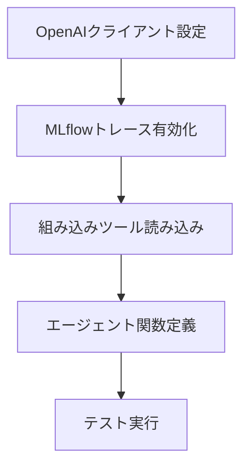

先日のDatabricks Free Editionの発表は個人的には衝撃的でした。以下の記事でも書いた通り、従来存在した無料版のCommunity Editionは機能の制限が多かったのですが、今回新たに生まれ変わったFree EditionではほとんどのDatabricksの機能が**無料**で利用できるようになったのです。

https://qiita.com/taka_yayoi/items/33e9cfa7ca9ca9febe72

今回は、Free Editionにサインアップすると表示されるチュートリアルをウォークスルーしていきたいと思います。


英語表記で恐縮ですが、サインアップを完了するとホームページに3つのチュートリアルが表示されます。左から、

- **自然言語を用いてあなたのデータと会話する** 新たな洞察を発見、可視化するために架空のパン屋の売上、在庫データに関して自然言語でAI/BI Genieに質問しましょう
- **AIを活用したノートブックでデータを探索** クエリーを生成し、結果を可視化するためにどのようにサンプルデータを分析し、人工知能(AI)を活用するのかを学びましょう
- **はじめてのAIエージェントの構築** 統制された洞察のために関数を作成し、Unity Catalogに登録して、アクション可能な洞察を生成するためにチャットベースのAIを構築しましょう

となっています。今回は右端にある**初めてのAIエージェントの構築**をウォークスルーします。

これまでのDatabricks Free Editionチュートリアルの記事はこちら:

- [Databricks Free Editionで学ぶAI/BI Genie](https://qiita.com/taka_yayoi/items/d2d7b74f0806975a8d63)
- [Databricks Free Editionで学ぶDatabricksノートブック](https://qiita.com/taka_yayoi/items/3d7c642cbdda4669b8c4)
- [Databricks Free Editionで学ぶAIエージェント](https://qiita.com/taka_yayoi/items/a0f5eafb23d736039512)

# Databricks Mosaic AI Agent Frameworkで始めるはじめてのAIエージェント開発

DatabricksのMosaic AI Agent Frameworkを使用すると、プログラミング初心者でも簡単にAIエージェントを作成・デプロイできます。このフレームワークでは、大規模言語モデル(LLM)とPythonコード実行などのツールを組み合わせ、単なるテキスト生成を超えた高度な処理が可能なエージェントを構築できます。本記事では、セットアップから実際のデプロイまでの全手順を、図表を用いて分かりやすく解説します。

## 機能概要

Mosaic AI Agent Frameworkは、インテリジェントなAIエージェントを簡単に構築・デプロイできるフレームワークです。

### エージェントの構成要素

| 構成要素 | 説明 | 例 |
|---------|------|-----|
| **大規模言語モデル (LLM)** | 推論と意思決定を行う基盤 | Claude 3.7 Sonnet |
| **ツール** | LLMが実行できる機能 | Pythonコード実行、データ取得 |
| **フレームワーク** | エージェントの統合・管理基盤 | Mosaic AI Agent Framework |


### アーキテクチャ図

```
[ユーザープロンプト]
        ↓
[Mosaic AI Agent Framework]
        ↓
[LLM (Claude 3.7 Sonnet)]
        ↓
[ツール実行 (Python実行等)]
        ↓
[結果をユーザーに返却]
```

### 必要な環境

- **Unity Catalog**: データガバナンス機能
- **Mosaic AI Agent Framework**: エージェント開発基盤
- **基盤モデル**: LLMへのアクセス(トークン課金、プロビジョニング、外部モデル対応)

## メリット、嬉しさ

### 1. 開発の簡素化

| メリット | 従来の方法 | Mosaic AI Framework |
|---------|-----------|-------------------|
| **セットアップ時間** | 数日〜数週間 | 数時間 |
| **必要な専門知識** | 高度なAI/ML知識 | 基本的なPython知識 |
| **インフラ管理** | 複雑な構成が必要 | 自動化されたデプロイ |

### 2. 豊富な機能

**主な利点:**
- **自動トレース機能**: エージェントの動作を詳細に追跡・デバッグ可能
- **組み込みツール**: Pythonコード実行機能がプリインストール
- **スケーラブル**: Databricksの分散処理能力を活用
- **セキュア**: Unity Catalogによる安全なデータアクセス

### 3. 実用的な応用例

- **データ分析の自動化**: 複雑な計算(フィボナッチ数列など)を自動実行
- **レポート生成**: データからインサイトを自動抽出
- **コード生成**: 要求に応じたPythonスクリプト作成

## 使い方の流れ

### ステップ1: 環境準備

**必要なパッケージのインストール**
```python
%pip install -U -qqqq mlflow databricks-openai databricks-agents
dbutils.library.restartPython()
```

### ステップ2: エージェント定義

**コア機能の実装**



**主要コンポーネント:**
1. **OpenAIクライアント**: Databricksモデルサービングエンドポイントへの接続
2. **MLflowトレース**: デバッグとモニタリング機能
3. **UC Function Toolkit**: Pythonコード実行ツール
4. **run_agent関数**: ユーザープロンプトの処理と応答生成

### ステップ3: エージェントテスト

**テスト例**
```python
answer = run_agent("100番目のフィボナッチ数は？")
```

この例では、エージェントが自動的にPythonコードを生成・実行し、100番目のフィボナッチ数を計算します。

### ステップ4: デプロイ準備

**ChatAgentインターフェースの実装**

| 要素 | 役割 |
|------|------|
| **predict()関数** | ユーザーメッセージの処理 |
| **ChatAgentResponse** | 標準化された応答形式 |
| **エージェントファイル** | デプロイ用の統合コード |

### ステップ5: 登録とデプロイ

**プロセスフロー**

```
[エージェントコード] → [MLflowによる記録] → [Unity Catalogへの登録] → [サービングエンドポイント] → [本番運用]
```

**設定項目:**
- **モデル名**: `main.default.quickstart_agent`
- **リソース指定**: 必要なエンドポイントと関数を定義
- **認証**: 自動設定によるセキュアなアクセス


## 注意点

### 技術的制約

| 注意事項 | 詳細 | 対策 |
|---------|------|------|
| **地域制限** | 一部機能は限定的な地域でのみ利用可能 | [機能地域サポート](https://docs.databricks.com/aws/ja/resources/feature-region-support)を確認 |
| **権限設定** | Unity Catalogとモデルサービングの適切な権限が必要 | 管理者と連携して事前設定 |
| **コスト管理** | LLM使用によるトークン課金 | 使用量モニタリングの実装 |

### 開発・運用上の留意点

**セキュリティ:**
- Unity Catalogによるデータアクセス制御を必ず設定
- 機密データへのアクセス権限は最小限に制限

**パフォーマンス:**
- 大量のリクエスト処理時はエンドポイントのスケーリング設定を調整
- トレース機能は開発時のみ有効化（本番では無効化を検討）

**メンテナンス:**
- 定期的なライブラリバージョンアップデート
- エージェントの動作ログと品質メトリクスの継続的監視

# ウォークスルー

**Start building**をクリックすると、ノートブックが開くのでアシスタントで翻訳しながら進めます。


## クイックスタート: Mosaic AI Agent Frameworkを使用してエージェントを構築、テスト、デプロイする

このクイックスタートノートブックでは、Mosaic AI Agent Framework ([AWS](https://docs.databricks.com/aws/ja/generative-ai/guide/introduction-generative-ai-apps#what-are-gen-ai-apps) | [Azure](https://learn.microsoft.com/ja-jp/azure/databricks/generative-ai/guide/introduction-generative-ai-apps#what-are-gen-ai-apps) | [GCP](https://docs.databricks.com/gcp/ja/generative-ai/guide/introduction-generative-ai-apps)) を使用して、Databricks上で生成AIエージェントを構築、テスト、デプロイする方法を示します。([AWS](https://docs.databricks.com/aws/ja/generative-ai/agent-framework/build-genai-apps#-mosaic-ai-agent-framework) | [Azure](https://learn.microsoft.com/ja-jp/azure/databricks/generative-ai/agent-framework/build-genai-apps#-mosaic-ai-agent-framework) | [GCP](https://docs.databricks.com/gcp/ja/generative-ai/agent-framework/build-genai-apps#-mosaic-ai-agent-framework))

## エージェントの定義とテスト
このセクションでは、以下の属性を持つシンプルなエージェントを定義し、テストします。

- エージェントは、Databricks Foundation Model APIで提供されるLLMを使用します。([AWS](https://docs.databricks.com/aws/ja/machine-learning/foundation-model-apis) | [Azure](https://learn.microsoft.com/ja-jp/azure/databricks/machine-learning/foundation-model-apis/) | [GCP](https://docs.databricks.com/gcp/ja/machine-learning/foundation-model-apis))
- エージェントは、Databricks Unity Catalog上の組み込みPythonコードインタープリターツールにアクセスできます。このツールを使用して、ユーザーの質問に応答するためにLLM生成コードを実行できます。([AWS](https://docs.databricks.com/aws/ja/generative-ai/agent-framework/code-interpreter-tools#built-in-python-executor-tool) | [Azure](https://learn.microsoft.com/ja-jp/azure/databricks/generative-ai/agent-framework/code-interpreter-tools) | [GCP](https://docs.databricks.com/gcp/ja/generative-ai/agent-framework/code-interpreter-tools))

LLMエンドポイントをクエリするために`databricks_openai` SDKを使用します。([AWS](https://docs.databricks.com/aws/ja/generative-ai/agent-framework/author-agent#requirements) | [Azure](https://learn.microsoft.com/ja-jp/azure/databricks/generative-ai/agent-framework/author-agent#requirements) | [GCP](https://docs.databricks.com/gcp/ja/generative-ai/agent-framework/author-agent#requirements))

```py
%pip install -U -qqqq mlflow databricks-openai databricks-agents
dbutils.library.restartPython()
```

```py
# 以下のスニペットは、候補の中からDatabricksワークスペースで利用可能な最初のLLM APIを選択しようとします。
# LLM_ENDPOINT_NAMEを指定するだけにオーバーライドして簡略化できます。
LLM_ENDPOINT_NAME = None

from databricks.sdk import WorkspaceClient
def is_endpoint_available(endpoint_name):
  try:
    client = WorkspaceClient().serving_endpoints.get_open_ai_client()
    client.chat.completions.create(model=endpoint_name, messages=[{"role": "user", "content": "AIとは何ですか？"}])
    return True
  except Exception:
    return False
  
client = WorkspaceClient()
for candidate_endpoint_name in ["databricks-claude-3-7-sonnet", "databricks-meta-llama-3-3-70b-instruct"]:
    if is_endpoint_available(candidate_endpoint_name):
      LLM_ENDPOINT_NAME = candidate_endpoint_name
assert LLM_ENDPOINT_NAME is not None, "LLM_ENDPOINT_NAMEを指定してください"
```

```py
import json
import mlflow
from databricks.sdk import WorkspaceClient
from databricks_openai import UCFunctionToolkit, DatabricksFunctionClient

# LLM呼び出しからのトレースを自動的にログに記録してデバッグを容易にする
mlflow.openai.autolog()

# Databricksモデルサービングエンドポイントと通信するように構成されたOpenAIクライアントを取得
# これを使用してエージェント内のLLMにクエリを送信する
openai_client = WorkspaceClient().serving_endpoints.get_open_ai_client()

# Databricks組み込みツールをロード（ステートレスなPythonコードインタープリターツール）
client = DatabricksFunctionClient()
builtin_tools = UCFunctionToolkit(
    function_names=["system.ai.python_exec"], client=client
).tools
for tool in builtin_tools:
    del tool["function"]["strict"]


def call_tool(tool_name, parameters):
    if tool_name == "system__ai__python_exec":
        return DatabricksFunctionClient().execute_function(
            "system.ai.python_exec", parameters=parameters
        )
    raise ValueError(f"未知のツール: {tool_name}")


def run_agent(prompt):
    """
    ユーザープロンプトをLLMに送信し、LLMの応答メッセージのリストを返す
    LLMは必要に応じてコードインタープリターツールを呼び出してユーザーに応答することができる
    """
    result_msgs = []
    response = openai_client.chat.completions.create(
        model=LLM_ENDPOINT_NAME,
        messages=[{"role": "user", "content": prompt}],
        tools=builtin_tools,
    )
    msg = response.choices[0].message
    result_msgs.append(msg.to_dict())

    # モデルがツールを実行した場合、それを呼び出す
    if msg.tool_calls:
        call = msg.tool_calls[0]
        tool_result = call_tool(call.function.name, json.loads(call.function.arguments))
        result_msgs.append(
            {
                "role": "tool",
                "content": tool_result.value,
                "name": call.function.name,
                "tool_call_id": call.id,
            }
        )
    return result_msgs
```

動作確認します。

```py
answer = run_agent("429の平方根は何ですか？")
for message in answer:
    print(f'{message["role"]}: {message["content"]}')
```

ツールが呼び出され、計算結果が返されます。

```
/local_disk0/.ephemeral_nfs/envs/pythonEnv-937ae92a-8aff-4378-92f7-e961934a251e/lib/python3.11/site-packages/databricks/connect/session.py:454: UserWarning: Ignoring the default notebook Spark session and creating a new Spark Connect session. To use the default notebook Spark session, use DatabricksSession.builder.getOrCreate() with no additional parameters.
  warnings.warn(new_notebook_session_msg)
assistant: None
tool: 20.71231517720798
```

トレースも確認できます。


## エージェントコードの準備

エージェントの定義をMLflowの[ChatAgentインターフェース](https://mlflow.org/docs/latest/api_reference/python_api/mlflow.pyfunc.html#mlflow.pyfunc.ChatAgent)でラップして、コードをログに記録する準備をします。

MLflowの標準エージェント作成インターフェースを使用することで、エージェントとチャットしたり、デプロイ後に他の人と共有したりするための組み込みUIを利用できます。([AWS](https://docs.databricks.com/aws/ja/generative-ai/agent-framework/author-agent#-use-chatagent-to-author-agents) | [Azure](https://learn.microsoft.com/ja-jp/azure/databricks/generative-ai/agent-framework/author-agent) | [GCP](https://docs.databricks.com/gcp/ja/generative-ai/agent-framework/author-agent))

```py
import uuid
import mlflow
from typing import Any, Optional

from mlflow.pyfunc import ChatAgent
from mlflow.types.agent import ChatAgentMessage, ChatAgentResponse, ChatContext

mlflow.openai.autolog()

class QuickstartAgent(ChatAgent):
    def predict(
        self,
        messages: list[ChatAgentMessage],
        context: Optional[ChatContext] = None,
        custom_inputs: Optional[dict[str, Any]] = None,
    ) -> ChatAgentResponse:
        # 1. 入力メッセージから最後のユーザープロンプトを抽出
        prompt = messages[-1].content

        # 2. run_agentを呼び出して、応答メッセージのリストを取得
        raw_msgs = run_agent(prompt)

        # 3. 各応答メッセージをChatAgentMessageにマップし、応答を返す
        out = []
        for m in raw_msgs:
            out.append(ChatAgentMessage(id=uuid.uuid4().hex, **m))

        return ChatAgentResponse(messages=out)
```

```py
AGENT = QuickstartAgent()
for response_message in AGENT.predict(
    {"messages": [{"role": "user", "content": "429の平方根は何ですか？"}]}
).messages:
    print(f"role: {response_message.role}, content: {response_message.content}")
```
```
/local_disk0/.ephemeral_nfs/envs/pythonEnv-937ae92a-8aff-4378-92f7-e961934a251e/lib/python3.11/site-packages/databricks/connect/session.py:454: UserWarning: Ignoring the default notebook Spark session and creating a new Spark Connect session. To use the default notebook Spark session, use DatabricksSession.builder.getOrCreate() with no additional parameters.
  warnings.warn(new_notebook_session_msg)
role: assistant, content: None
role: tool, content: 20.71231517720798
```

## エージェントの記録

エージェントをログに記録し、Unity Catalogにモデルとして登録します ([AWS](https://docs.databricks.com/aws/ja/machine-learning/manage-model-lifecycle/) | [Azure](https://learn.microsoft.com/ja-jp/azure/databricks/machine-learning/manage-model-lifecycle/) | [GCP](https://docs.databricks.com/gcp/ja/machine-learning/manage-model-lifecycle/))。このステップでは、エージェントコードとその依存関係を単一のアーティファクトにパッケージ化し、サービングエンドポイントにデプロイします。

以下のコードセルは次のことを行います：

1. 上記のエージェントコードをコピーして、単一のセルに結合します。
1. セルの先頭に `%%writefile` セルマジックコマンドを追加して、エージェントコードを `quickstart_agent.py` というファイルに保存します。
1. セルの下部に [mlflow.models.set_model()](https://mlflow.org/docs/latest/model#models-from-code) 呼び出しを追加します。これにより、エージェントがデプロイされたときに予測を行うために使用するPythonエージェントオブジェクトをMLflowに伝えます。
1. MLflow APIを使用して `quickstart_agent.py` ファイル内のエージェントコードをログに記録します ([AWS](https://docs.databricks.com/aws/ja/generative-ai/agent-framework/log-agent) | [Azure](https://learn.microsoft.com/ja-jp/azure/databricks/generative-ai/agent-framework/log-agent) | [GCP](https://docs.databricks.com/gcp/ja/generative-ai/agent-framework/log-agent))。

以下のセルを実行することで、エージェントコードがファイルに保存されます。

```py
%%writefile quickstart_agent.py

import json
import uuid
from databricks.sdk import WorkspaceClient
from databricks_openai import UCFunctionToolkit, DatabricksFunctionClient
from typing import Any, Optional

import mlflow
from mlflow.pyfunc import ChatAgent
from mlflow.types.agent import ChatAgentMessage, ChatAgentResponse, ChatContext

# Databricksのモデルサービングエンドポイントと通信するために設定されたOpenAIクライアントを取得
# これを使ってエージェント内でLLMに問い合わせる
openai_client = WorkspaceClient().serving_endpoints.get_open_ai_client()

# 以下のスニペットは、Databricksワークスペース内で利用可能な最初のLLM APIを
# 複数の候補から選択しようとします。必要に応じてLLM_ENDPOINT_NAMEを直接指定して簡略化可能です。
LLM_ENDPOINT_NAME = None

def is_endpoint_available(endpoint_name):
  try:
    client = WorkspaceClient().serving_endpoints.get_open_ai_client()
    client.chat.completions.create(model=endpoint_name, messages=[{"role": "user", "content": "AIとは何ですか？"}])
    return True
  except Exception:
    return False
  
for candidate_endpoint_name in ["databricks-claude-3-7-sonnet", "databricks-meta-llama-3-3-70b-instruct"]:
    if is_endpoint_available(candidate_endpoint_name):
      LLM_ENDPOINT_NAME = candidate_endpoint_name
assert LLM_ENDPOINT_NAME is not None, "LLM_ENDPOINT_NAMEを指定してください"

# LLM呼び出しの自動トレースを有効化
mlflow.openai.autolog()

# Databricks組み込みツール（ステートレスなPythonコードインタプリターツール）をロード
client = DatabricksFunctionClient()
builtin_tools = UCFunctionToolkit(function_names=["system.ai.python_exec"], client=client).tools
for tool in builtin_tools:
    del tool["function"]["strict"]

def call_tool(tool_name, parameters):
    if tool_name == "system__ai__python_exec":
        return DatabricksFunctionClient().execute_function("system.ai.python_exec", parameters=parameters)
    raise ValueError(f"不明なツールです: {tool_name}")

def run_agent(prompt):
    """
    ユーザープロンプトをLLMに送信し、LLMの応答メッセージのリストを返す
    必要に応じて、LLMはコードインタプリターツールを呼び出してユーザーに応答可能
    """
    result_msgs = []
    response = openai_client.chat.completions.create(
        model=LLM_ENDPOINT_NAME,
        messages=[{"role": "user", "content": prompt}],
        tools=builtin_tools,
    )
    msg = response.choices[0].message
    result_msgs.append(msg.to_dict())

    # モデルがツールを実行した場合は呼び出す
    if msg.tool_calls:
        call = msg.tool_calls[0]
        tool_result = call_tool(call.function.name, json.loads(call.function.arguments))
        result_msgs.append({"role": "tool", "content": tool_result.value, "name": call.function.name, "tool_call_id": call.id})
    return result_msgs

class QuickstartAgent(ChatAgent):
    def predict(
        self,
        messages: list[ChatAgentMessage],
        context: Optional[ChatContext] = None,
        custom_inputs: Optional[dict[str, Any]] = None,
    ) -> ChatAgentResponse:
        prompt = messages[-1].content
        raw_msgs = run_agent(prompt)
        out = []
        for m in raw_msgs:
            out.append(ChatAgentMessage(
                id=uuid.uuid4().hex,
                **m
            ))

        return ChatAgentResponse(messages=out)

AGENT = QuickstartAgent()
mlflow.models.set_model(AGENT)
```
```
Writing quickstart_agent.py
```

上のファイルから`import`するため、Pythonカーネルを再起動します。

```py
dbutils.library.restartPython()
```

```py
import mlflow
from mlflow.models.resources import DatabricksFunction, DatabricksServingEndpoint
from pkg_resources import get_distribution
from quickstart_agent import LLM_ENDPOINT_NAME

# モデルをワークスペースのデフォルトカタログに登録
# 必要に応じてカタログ（例: "main"）およびスキーマ名（例: "custom_schema"）を指定し、
# エージェントを別の場所に登録する
catalog_name = spark.sql("SELECT current_catalog()").collect()[0][0]
schema_name = "default"
registered_model_name = f"{catalog_name}.{schema_name}.quickstart_agent"

# Databricks製品リソースを指定し、エージェントがこれらのリソースにアクセスできるようにする
# （組み込みのPythonコードインタプリターツールとLLMサービングエンドポイント）
# これにより、エージェントがデプロイされる際にDatabricksが自動的に認証を構成できるようにする
resources = [
    DatabricksServingEndpoint(endpoint_name=LLM_ENDPOINT_NAME),
    DatabricksFunction(function_name="system.ai.python_exec"),
]

mlflow.set_registry_uri("databricks-uc")
with mlflow.start_run():
    logged_agent_info = mlflow.pyfunc.log_model(
        artifact_path="agent",
        python_model="quickstart_agent.py",
        extra_pip_requirements=[
            f"databricks-connect=={get_distribution('databricks-connect').version}"
        ],
        resources=resources,
        registered_model_name=registered_model_name,
    )
```

サイドメニューの**カタログ**で、モデルが登録されていることを確認できます。


## エージェントのデプロイ

以下のセルを実行してエージェントをデプロイします ([AWS](https://docs.databricks.com/aws/ja/generative-ai/agent-framework/deploy-agent) | [Azure](https://learn.microsoft.com/ja-jp/azure/databricks/generative-ai/agent-framework/deploy-agent) | [GCP](https://docs.databricks.com/gcp/ja/generative-ai/agent-framework/deploy-agent))。エージェントエンドポイントが起動すると、AI Playground ([AWS](https://docs.databricks.com/aws/ja/large-language-models/ai-playground) | [Azure](https://learn.microsoft.com/ja-jp/azure/databricks/large-language-models/ai-playground) | [GCP](https://docs.databricks.com/gcp/ja/large-language-models/ai-playground)) を介してエージェントとチャットしたり、ステークホルダーと共有して初期フィードバックを得たり ([AWS](https://docs.databricks.com/aws/ja/generative-ai/agent-evaluation/review-app) | [Azure](https://learn.microsoft.com/ja-jp/azure/databricks/generative-ai/agent-evaluation/review-app) | [GCP](https://docs.databricks.com/gcp/ja/generative-ai/agent-evaluation/review-app)) することができます。

```py
from databricks import agents

deployment_info = agents.deploy(
    model_name=registered_model_name,
    model_version=logged_agent_info.registered_model_version,
)
```

サイドメニューの**サービング**にアクセスすると、モデルサービングエンドポイントが作成されていることを確認できます。数分待つとエンドポイントが利用可能(**Ready**)になります。


右上の**Use**ボタンの右側の下向き矢印を展開し、**Try in Playground**をクリックします。


AI Playgroundでは、チャットインタフェースを通じてエージェントの動作確認を行うことができます。


こちらでもツールが呼び出されていることを確認できます。


# まとめ

DatabricksのMosaic AI Agent Frameworkは、AI初心者でも本格的なエージェントを効率的に開発できる強力なツールです。Unity Catalogとの統合により、セキュアなデータアクセスと高度な分析能力を両立できます。

**主なポイント:**
- わずか数ステップで高機能なAIエージェントを構築可能
- 組み込みツールにより、コード実行からデータ分析まで幅広い処理に対応
- MLflowによる詳細なトレース機能でデバッグが容易
- Unity Catalogとの連携でエンタープライズレベルのセキュリティを確保

今後は、エージェント評価機能を活用した品質改善や、RAG(Retrieval-Augmented Generation)を使った高度なエージェント開発に挑戦してみてください。Databricksプラットフォームのさまざまな機能を活用することで、ビジネスの課題解決に直結するAIソリューションを構築できるでしょう。

### はじめてのDatabricks

[はじめてのDatabricks](https://qiita.com/taka_yayoi/items/8dc72d083edb879a5e5d)

### Databricks無料トライアル

[Databricks無料トライアル](https://databricks.com/jp/try-databricks)
