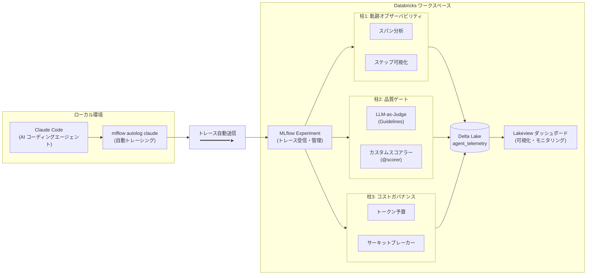
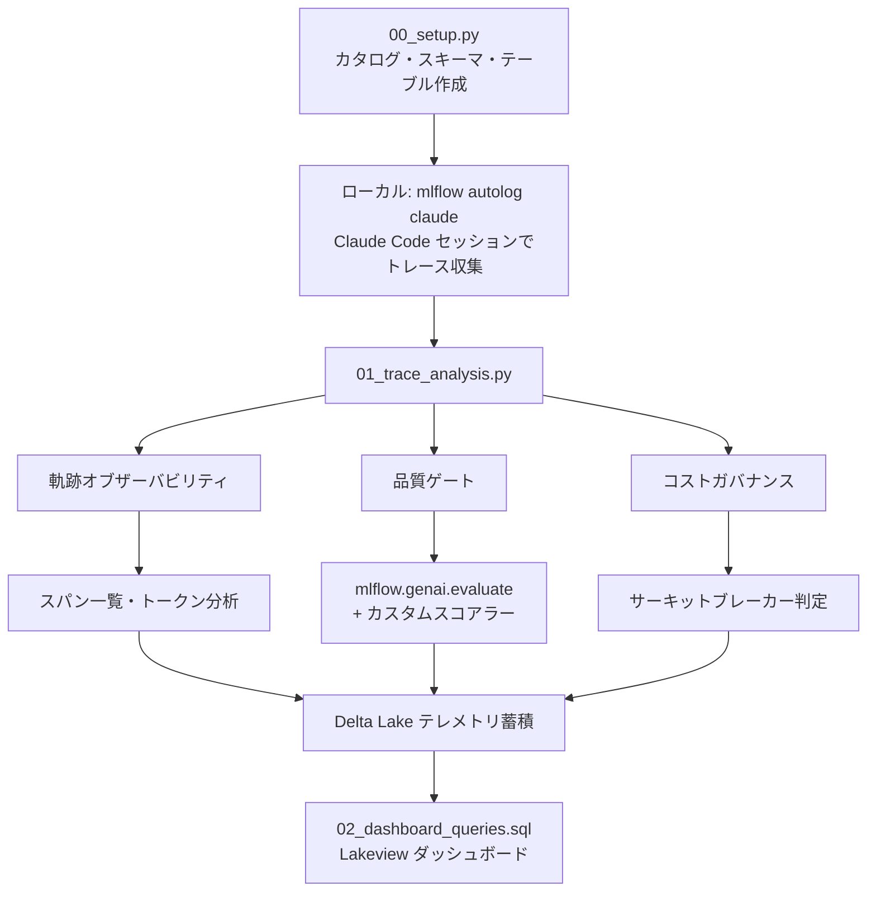

> **前編**: [CodingAgentOps——LLMOpsの先にあるコーディングエージェント時代の運用フレームワーク](https://qiita.com/taka_yayoi/items/b795a609a039387d8d23)

# はじめに

[前編](https://qiita.com/taka_yayoi/items/b795a609a039387d8d23)では、コーディングエージェント時代に求められる運用フレームワーク「**CodingAgentOps**」の6つの柱を提案しました。

- **柱1**: 軌跡オブザーバビリティ
- **柱2**: 品質ゲート
- **柱3**: コストガバナンス
- **柱4**: セキュリティ
- **柱5**: ガバナンス・監査
- **柱6**: 実験管理・ベンチマーク

本記事（実践編）では、このうち **柱1〜3** を **Databricks + MLflow 3.x** で実際に動かします。ローカルの Claude Code セッションから自動収集したトレースを Databricks 上で分析・評価・蓄積する、エンドツーエンドの実装を解説します。

# 全体アーキテクチャ

まず、今回構築するシステムの全体像を示します。



ポイントは以下の通りです:

- **ローカル環境**: `mlflow autolog claude` が Claude Code の全操作を自動トレースし、Databricks に送信
- **Databricks ワークスペース**: 受信したトレースに対して3本柱（オブザーバビリティ・品質ゲート・コストガバナンス）の分析を実行
- **Delta Lake**: テレメトリデータを蓄積し、Lakeview ダッシュボードで時系列分析

# デモのワークフロー

本デモは3つのノートブックで構成されます。



| ノートブック | 役割 |
|---|---|
| `00_setup.py` | カタログ・スキーマ・テレメトリテーブルの作成 |
| `01_trace_analysis.py` | トレース分析・品質評価・コストガバナンス・Delta Lake 蓄積 |
| `02_dashboard_queries.sql` | Lakeview ダッシュボード用 SQL クエリ集 |

加えて、Claude Code に分析させるサンプルデータとして以下を使用します:

| ファイル | 用途 |
|---|---|
| `sales_data_sample.csv` | 売上サンプルデータ |
| `sales_pipeline.py` | Claude Code が生成した売上分析パイプライン |

# 前提条件

- Databricks ワークスペース（Unity Catalog 有効）
- Claude Code（ローカルにインストール済み）
- Python 3.10+
- MLflow 3.x（`mlflow[databricks]>=3.4`）

---

# Step 1: セットアップ（`00_setup.py`）

最初に、テレメトリデータを格納する Unity Catalog のスキーマとテーブルを作成します。

## 1.1 カタログ・スキーマの作成

```python
CATALOG = "takaakiyayoi_catalog"
SCHEMA = "coding_agent_ops"

spark.sql(f"CREATE SCHEMA IF NOT EXISTS {CATALOG}.{SCHEMA}")
```

## 1.2 テレメトリテーブルの作成

```python
spark.sql(f"""
CREATE TABLE IF NOT EXISTS {CATALOG}.{SCHEMA}.agent_telemetry (
    session_id STRING NOT NULL,
    task_description STRING,
    model_name STRING,
    timestamp TIMESTAMP,
    -- 軌跡オブザーバビリティ
    total_steps INT,
    step_details STRING,           -- JSON: 各ステップの詳細
    trace_id STRING,               -- MLflow trace ID
    -- 品質ゲート
    score_correctness DOUBLE,
    score_security DOUBLE,
    score_maintainability DOUBLE,
    quality_details STRING,        -- JSON: 評価理由
    -- コストガバナンス
    total_input_tokens INT,
    total_output_tokens INT,
    total_cost_usd DOUBLE,
    cost_breakdown STRING,         -- JSON: ステップ別コスト
    -- メタデータ
    generated_code STRING,
    execution_time_seconds DOUBLE
)
USING DELTA
COMMENT 'CodingAgentOps テレメトリデータ'
""")
```

テーブル設計のポイント:

- **軌跡**: `total_steps`, `step_details`（JSON）, `trace_id` でエージェントの行動履歴を記録
- **品質**: `score_correctness`, `score_security`, `score_maintainability` で3軸の品質スコアを保持
- **コスト**: `total_input_tokens`, `total_output_tokens`, `total_cost_usd` でトークン消費とコストを追跡

# Step 2: ローカルで Claude Code のトレースを有効化

Databricks ワークスペース側の準備が完了したら、ローカル環境で Claude Code の自動トレースを設定します。

```bash
#  1. 仮想環境の作成・有効化
python -m venv .venv
source .venv/bin/activate

#  2. MLflow のインストール
WHENEVER_NO_BUILD_RUST_EXT=1 pip install --upgrade "mlflow[databricks]>=3.4"

#  3. 環境変数の設定
export DATABRICKS_HOST="https://<ワークスペースURL>"
export DATABRICKS_TOKEN="<パーソナルアクセストークン>"

#  4. Claude Code の自動トレースを有効化
mlflow autolog claude -u databricks -e <実験ID>

#  5. Claude Code を起動してタスクを実行
claude
```

:::note info
**`-u databricks` が必須です!** このフラグを付けないとトレースがローカルにしか保存されず、Databricks ワークスペースに送信されません。
:::

## Claude Code でタスクを実行

今回のデモでは、Claude Code に以下のようなタスクを依頼します:

> 「`sales_data_sample.csv` を読み込んで、異常値除外・カテゴリ別集計・月次トレンド計算を行う PySpark パイプラインを作成してください」

Claude Code がファイルの読み取り、コード生成、テスト実行などを行う **すべてのステップが自動的にトレースとして記録** されます。


> **[スクリーンショット]** `mlflow autolog claude` の設定とClaude Code セッション実行の様子
---

# Step 3: 柱1 — 軌跡オブザーバビリティ

ここからは `01_trace_analysis.py` ノートブックの内容です。まず、自動収集されたトレースを取得・分析します。

## 3.1 トレースの取得

```python
import mlflow
import mlflow.genai
from mlflow.genai.scorers import Guidelines, scorer
from mlflow.entities import Feedback, Trace
import json

EXPERIMENT_NAME = "/Users/<ユーザー名>/CodingAgentOps_Demo"
mlflow.set_experiment(EXPERIMENT_NAME)
experiment = mlflow.get_experiment_by_name(EXPERIMENT_NAME)

#  トレース一覧の取得
traces_df = mlflow.search_traces(
    experiment_ids=[experiment.experiment_id],
)
print(f"取得したトレース数: {len(traces_df)}")
```


> **[スクリーンショット]** `traces_df` の一覧表示 — 各トレースの ID、ステータス、タイムスタンプが確認できます


## 3.2 スパン（ステップ）の分析

トレースは複数の **スパン**（＝エージェントの個々のステップ）で構成されます。Claude Code が行ったファイル読み取り、LLM 推論、コード生成などの各操作がスパンとして階層的に記録されています。

```python
#  最新のトレースを取得
trace = mlflow.get_trace(latest_trace_id)
spans = trace.data.spans

print(f"スパン数（エージェントのステップ数）: {len(spans)}")
print()
print("=" * 80)
print(f"{'スパン名':<30s} {'タイプ':<15s} {'所要時間(ms)':>12s}")
print("-" * 80)

for span in spans:
    name = span.name[:28]
    span_type = span.span_type or "-"
    duration = (span.end_time_ns - span.start_time_ns) / 1_000_000 \
               if span.end_time_ns and span.start_time_ns else 0
    print(f"  {name:<28s} {span_type:<15s} {duration:>12.0f}")
```

出力例:

```
スパン数（エージェントのステップ数）: 12

================================================================================
スパン名                          タイプ              所要時間(ms)
--------------------------------------------------------------------------------
  ChatCompletion                  CHAT_MODEL             3,421
  tool_call: read_file            TOOL                      45
  ChatCompletion                  CHAT_MODEL             5,892
  tool_call: write_file           TOOL                      32
  ...
```

これにより、エージェントが **どのような順序で** **何を行ったか** が完全に可視化されます。前編で述べた「AI生成コードのバグがデプロイ後30〜90日で顕在化する」問題に対して、**事後追跡可能な監査証跡** を確保できます。

## 3.3 トークン消費・コストの確認

```python
#  MLflow 3.x API: trace.info から取得
total_usage = getattr(trace.info, "token_usage", None)
total_cost_info = getattr(trace.info, "cost", None)
```

:::note warn
MLflow のバージョンによっては `trace.info.cost` 属性が存在しない場合があります。`getattr` で安全にアクセスし、`None` の場合はスパンレベルのトークン情報にフォールバックしてください。
:::


> **[スクリーンショット]** トレースレベルおよびスパン別のトークン消費量表示


> **[スクリーンショット]** MLflow Experiment UI でのトレース詳細表示 — スパンの階層構造やトークン使用量がビジュアルに確認できます

---

# Step 4: 柱2 — 品質ゲート

## 4.1 カスタムコードスコアラー（`@scorer`）

MLflow の `@scorer` デコレータを使い、プログラム的にコード品質をチェックするスコアラーを定義します。

```python
@scorer
def code_structure_check(trace: Trace) -> list[Feedback]:
    """トレースの出力からコード構造を評価"""
    output_str = json.dumps(
        trace.data.spans[0].outputs or {}, ensure_ascii=False
    ) if trace.data.spans else ""

    results = []

    # エラーハンドリングの存在チェック
    has_error_handling = any(kw in output_str for kw in ["try", "except", "raise"])
    results.append(Feedback(
        name="has_error_handling",
        value="yes" if has_error_handling else "no",
        rationale="try/except または raise 文の存在を確認"
    ))

    # ハードコードされた認証情報のチェック
    has_hardcoded_secrets = any(
        kw in output_str.lower()
        for kw in ["password", "secret", "api_key=", "token="]
    )
    results.append(Feedback(
        name="no_hardcoded_secrets",
        value="yes" if not has_hardcoded_secrets else "no",
        rationale="ハードコードされた認証情報の有無を確認"
    ))

    return results
```

このスコアラーは **LLM を呼び出さず**、ルールベースで高速にチェックします。前編で「セキュリティ脆弱性が人間の2.74倍」というデータを紹介しましたが、こうしたプログラム的チェックはその対策の第一歩です。

## 4.2 Guidelines スコアラー（LLM-as-Judge）

次に、Databricks Foundation Model API のエンドポイント経由で **LLM-as-Judge** による評価を設定します。

```python
correctness_judge = Guidelines(
    name="code_correctness",
    guidelines=(
        "コーディングエージェントが生成したコードが要件を正しく実装しているか評価してください。"
        "カテゴリ別集計、異常値フィルタ、月次トレンド計算が正しく含まれているか確認してください。"
    ),
    model="endpoints:/databricks-claude-sonnet-4",
)

security_judge = Guidelines(
    name="code_security",
    guidelines=(
        "生成されたコードにセキュリティ上の脆弱性がないか評価してください。"
        "SQLインジェクション、ハードコードされた認証情報、不適切なファイルアクセスなどを確認してください。"
    ),
    model="endpoints:/databricks-claude-sonnet-4",
)

maintainability_judge = Guidelines(
    name="code_maintainability",
    guidelines=(
        "生成されたコードの保守性を評価してください。"
        "適切な関数分割、命名規則、コメント、可読性の観点で確認してください。"
    ),
    model="endpoints:/databricks-claude-sonnet-4",
)
```

:::note info
**Databricks Foundation Model API** を使うことで、外部 API キーの管理が不要になり、ガバナンスも一元管理できます。`endpoints:/databricks-claude-sonnet-4` のように、ワークスペースに登録済みのエンドポイントを指定するだけです。
:::

## 4.3 評価の実行

```python
eval_results = mlflow.genai.evaluate(
    data=traces_df.head(1),  # 最新のトレース1件
    scorers=[
        correctness_judge,
        security_judge,
        maintainability_judge,
        code_structure_check,
    ],
)
```


> **[スクリーンショット]** 評価メトリクスの集計結果


> **[スクリーンショット]** 評価結果の詳細 — 各スコアラーの判定結果と rationale（評価理由）


> **[スクリーンショット]** MLflow UI の Evaluation タブ — 評価結果がビジュアルに確認できます

`mlflow.genai.evaluate()` の結果は **MLflow に自動保存** されるため、MLflow UI からも確認できます。これにより、前編で述べた「PRあたりのインシデント増加率 +242.7%」に対する **継続的な品質モニタリング** が可能になります。

---

# Step 5: 柱3 — コストガバナンス

## 5.1 サーキットブレーカー

前編で「エージェントトークンの70%が浪費」「複雑タスクで100万〜350万トークン消費」というデータを示しました。サーキットブレーカーは、この問題に対する実践的な対策です。

```python
#  サーキットブレーカー: トークン上限設定
TOKEN_BUDGET = 50000    # 上限: 5万トークン
COST_BUDGET_USD = 0.50  # 上限: $0.50

#  トークン数の取得
if total_usage:
    if isinstance(total_usage, dict):
        current_tokens = total_usage.get("total_tokens", 0)
    else:
        current_tokens = getattr(total_usage, "total_tokens", 0)
else:
    current_tokens = 0

#  コストの取得
if total_cost_info:
    if isinstance(total_cost_info, dict):
        actual_cost = total_cost_info.get("total_cost", 0)
    else:
        actual_cost = getattr(total_cost_info, "total_cost", 0) or 0
else:
    # Claude Sonnet 4 pricing: $3/1M input, $15/1M output
    _in = total_usage.get("input_tokens", 0) if isinstance(total_usage, dict) \
          else getattr(total_usage, "input_tokens", 0) or 0 if total_usage else 0
    _out = total_usage.get("output_tokens", 0) if isinstance(total_usage, dict) \
           else getattr(total_usage, "output_tokens", 0) or 0 if total_usage else 0
    actual_cost = (_in * 3.0 + _out * 15.0) / 1_000_000

budget_usage_pct = current_tokens / TOKEN_BUDGET * 100

if current_tokens > TOKEN_BUDGET:
    print("サーキットブレーカー発動! トークン上限を超過しました。")
elif budget_usage_pct > 80:
    print("警告: トークン予算の80%を超過しています。")
else:
    print("予算内で正常に完了しました。")
```

出力例:

```
============================================================
サーキットブレーカー
============================================================
  トークン予算: 12,345 / 50,000 (24.7%)
  コスト予算:   $0.003210 / $0.50

  予算内で正常に完了しました。
```

:::note info
本デモでは事後分析として実装していますが、実運用では **エージェント実行中にリアルタイムで予算チェック** を行い、上限超過時に自動停止させる仕組みと組み合わせることを推奨します。
:::

---

# Step 6: テレメトリの Delta Lake 蓄積

3本柱の分析結果を Delta Lake テーブルに蓄積します。これにより、**セッションを跨いだ時系列分析** が可能になります。

```python
from pyspark.sql import Row
from pyspark.sql.types import StructType, StructField, StringType, IntegerType, DoubleType, TimestampType
from datetime import datetime

exec_time_ms = getattr(trace.info, "execution_time_ms", None) or getattr(trace.info, "execution_time", 0) or 0

telemetry_row = Row(
    session_id=latest_trace_id[:8],
    task_description="Claude Code セッション（自動トレース）",
    model_name="claude-code (autolog)",
    timestamp=datetime.now(),
    total_steps=len(spans),
    step_details=json.dumps([{"name": s.name, "span_type": str(s.span_type)} for s in spans], ensure_ascii=False),
    trace_id=latest_trace_id,
    score_correctness=float(eval_results.metrics.get("code_correctness/pass_rate", 0) or 0),
    score_security=float(eval_results.metrics.get("code_security/pass_rate", 0) or 0),
    score_maintainability=float(eval_results.metrics.get("code_maintainability/pass_rate", 0) or 0),
    quality_details=json.dumps(eval_results.metrics, default=str, ensure_ascii=False),
    total_input_tokens=int(total_usage.get("input_tokens", 0)) if isinstance(total_usage, dict) else int(getattr(total_usage, "input_tokens", 0) or 0) if total_usage else 0,
    total_output_tokens=int(total_usage.get("output_tokens", 0)) if isinstance(total_usage, dict) else int(getattr(total_usage, "output_tokens", 0) or 0) if total_usage else 0,
    total_cost_usd=float(actual_cost),
    cost_breakdown=json.dumps({"token_usage": str(total_usage), "cost": str(total_cost_info)}, ensure_ascii=False),
    generated_code=None,
    execution_time_seconds=exec_time_ms / 1000 if exec_time_ms else 0,
)

TABLE = f"{CATALOG}.{SCHEMA}.agent_telemetry"

telemetry_schema = StructType([
    StructField("session_id", StringType(), False),
    StructField("task_description", StringType()),
    StructField("model_name", StringType()),
    StructField("timestamp", TimestampType()),
    StructField("total_steps", IntegerType()),
    StructField("step_details", StringType()),
    StructField("trace_id", StringType()),
    StructField("score_correctness", DoubleType()),
    StructField("score_security", DoubleType()),
    StructField("score_maintainability", DoubleType()),
    StructField("quality_details", StringType()),
    StructField("total_input_tokens", IntegerType()),
    StructField("total_output_tokens", IntegerType()),
    StructField("total_cost_usd", DoubleType()),
    StructField("cost_breakdown", StringType()),
    StructField("generated_code", StringType()),
    StructField("execution_time_seconds", DoubleType()),
])

df_telemetry = spark.createDataFrame([telemetry_row], schema=telemetry_schema)
df_telemetry.write.mode("append").saveAsTable(TABLE)

print(f"テレメトリを {TABLE} に書き込みました")
```

:::note warn
**実装上の注意点**: `spark.createDataFrame()` に `Row` オブジェクトを渡す際、`None` 値を含むカラムがあると `[CANNOT_DETERMINE_TYPE]` エラーが発生します。これを回避するために、`schema` 引数で明示的に `StructType` を指定しています。
:::

---

# Step 7: ダッシュボード（`02_dashboard_queries.sql`）

蓄積されたテレメトリデータを Lakeview ダッシュボードで可視化するための SQL クエリ集です。

## クエリ1: 品質スコアの推移（折れ線グラフ）

```sql
SELECT
  session_id,
  timestamp,
  model_name,
  score_correctness,
  score_security,
  score_maintainability,
  (score_correctness + score_security + score_maintainability) / 3 AS avg_score
FROM takaakiyayoi_catalog.coding_agent_ops.agent_telemetry
ORDER BY timestamp
```

## クエリ2: セッション別コスト比較（棒グラフ）

```sql
SELECT
  session_id,
  timestamp,
  model_name,
  total_input_tokens,
  total_output_tokens,
  total_cost_usd,
  execution_time_seconds
FROM takaakiyayoi_catalog.coding_agent_ops.agent_telemetry
ORDER BY timestamp
```

## クエリ3: KPI サマリー（カウンター）

```sql
SELECT
  COUNT(*) AS total_sessions,
  ROUND(AVG(score_correctness), 2) AS avg_correctness,
  ROUND(AVG(score_security), 2) AS avg_security,
  ROUND(AVG(score_maintainability), 2) AS avg_maintainability,
  SUM(total_input_tokens) AS total_input_tokens,
  SUM(total_output_tokens) AS total_output_tokens,
  ROUND(SUM(total_cost_usd), 6) AS total_cost_usd,
  ROUND(AVG(execution_time_seconds), 1) AS avg_execution_time_sec
FROM takaakiyayoi_catalog.coding_agent_ops.agent_telemetry
```

## ダッシュボード設定ガイド

| ウィジェット | クエリ | チャートタイプ | X軸 | Y軸 |
|---|---|---|---|---|
| 品質スコア推移 | クエリ1 | 折れ線グラフ | timestamp | score_correctness, score_security, score_maintainability |
| セッション別コスト | クエリ2 | 棒グラフ | session_id | total_cost_usd |
| KPIサマリー | クエリ3 | カウンター | - | total_sessions, total_cost_usd, avg_correctness |


> **[スクリーンショット]** 完成したダッシュボード — 品質スコアの推移、セッション別コスト、KPI サマリーを一覧表示

---

# Claude Code が生成したコードの例

参考として、Claude Code に依頼して生成された売上分析パイプライン（`sales_pipeline.py`）の主要部分を示します。このコードが品質ゲートの評価対象になります。

```python
from pyspark.sql import functions as F
from pyspark.sql import Window

#  データ読み込み
df_raw = spark.table(f"{CATALOG}.{SCHEMA}.sales_data")

#  異常値フィルタ
df_filtered = df_raw.filter(
    (F.col("quantity") < 999) & (F.col("unit_price") < 1_000_000)
)

#  売上金額の計算
df_sales = df_filtered.withColumn(
    "sales_amount",
    F.round(
        F.col("quantity") * F.col("unit_price") * (1 - F.col("discount_rate")), 0
    ).cast("long"),
).withColumn(
    "order_month", F.date_format(F.col("order_date"), "yyyy-MM")
)

#  カテゴリ別集計
df_category_summary = (
    df_sales
    .groupBy("category")
    .agg(
        F.count("order_id").alias("order_count"),
        F.sum("quantity").alias("total_quantity"),
        F.sum("sales_amount").alias("total_sales"),
        F.avg("sales_amount").alias("avg_sales_per_order"),
        F.avg("discount_rate").alias("avg_discount_rate"),
    )
    .orderBy(F.desc("total_sales"))
)

#  月次トレンド + 前月比
window_prev = Window.partitionBy("category").orderBy("order_month")
df_monthly_trend = (
    df_sales
    .groupBy("order_month", "category")
    .agg(F.sum("sales_amount").alias("total_sales"))
    .withColumn("prev_month_sales", F.lag("total_sales").over(window_prev))
    .withColumn(
        "mom_growth_rate",
        F.when(
            F.col("prev_month_sales").isNotNull() & (F.col("prev_month_sales") > 0),
            F.round(
                (F.col("total_sales") - F.col("prev_month_sales"))
                / F.col("prev_month_sales"), 4
            ),
        ),
    )
)
```

---

# 実装で得られた知見とハマりポイント

## MLflow 3.x の API 差異に注意

MLflow 3.x は活発に開発が進んでおり、バージョンによって `TraceInfo` のアトリビュートが異なります。

| アトリビュート | 対応方法 |
|---|---|
| `trace.info.cost` | `getattr(trace.info, "cost", None)` で安全にアクセス |
| `trace.info.token_usage` | 同上。dict の場合と object の場合があるため `isinstance` で分岐 |
| `EvaluationResult.metrics_df` | MLflow 3.x では `metrics`（dict）に変更。表示時は `pd.DataFrame([eval_results.metrics])` |
| `EvaluationResult.eval_results_df` | `result_df` に変更 |

## Spark DataFrame の型推論エラー

`spark.createDataFrame()` に `None` を含む `Row` を渡すと `[CANNOT_DETERMINE_TYPE]` エラーが発生します。`StructType` でスキーマを明示的に定義することで回避できます。

---

# 前編の課題データとの対応

前編で提示した課題が、本実装でどのように対応されるかを整理します。

| 前編の課題 | 本実装での対応 |
|---|---|
| AI生成コードの問題発生率が1.7倍 | **品質ゲート**: `mlflow.genai.evaluate()` による自動品質チェック |
| セキュリティ脆弱性が2.74倍 | **カスタムスコアラー**: ハードコード認証情報のチェック + LLM-as-Judge によるセキュリティ評価 |
| エージェントトークンの70%が浪費 | **サーキットブレーカー**: トークン予算による上限管理 |
| バグがデプロイ後30〜90日で顕在化 | **軌跡オブザーバビリティ**: 全ステップの記録による事後追跡 |
| ガバナンスプロセス保有チーム38%のみ | **Delta Lake テレメトリ**: 構造化された監査証跡の自動蓄積 |

---

# まとめと次のステップ

本記事では、CodingAgentOps の **柱1〜3**（軌跡オブザーバビリティ、品質ゲート、コストガバナンス）を Databricks + MLflow 3.x で実装しました。

**実装したもの:**

1. **`mlflow autolog claude`** によるローカル Claude Code セッションの自動トレース
2. **`mlflow.search_traces()` / `mlflow.get_trace()`** によるトレース取得とスパン分析
3. **`@scorer` + `Guidelines`** によるプログラム的 & LLM-as-Judge 品質評価
4. **サーキットブレーカー** によるトークン予算管理
5. **Delta Lake** へのテレメトリ蓄積と **Lakeview ダッシュボード** による可視化

**次のステップ:**

残る柱4〜6（セキュリティ、ガバナンス・監査、実験管理）については、以下のような拡張が考えられます:

- **柱4（セキュリティ）**: プロンプトインジェクション検出スコアラーの追加、Databricks AI Gateway によるガードレール
- **柱5（ガバナンス・監査）**: Unity Catalog のアクセス制御と監査ログの統合
- **柱6（実験管理）**: 複数モデル（Claude Opus / Sonnet / Haiku）の A/B テストと MLflow Experiment による比較

コーディングエージェントの導入で差がつくのは「エージェント自体の性能ではなく、その周囲の運用基盤」です。本記事で構築した基盤を起点に、組織に合った CodingAgentOps を発展させてください。

---

# 参考資料

- [CodingAgentOps——LLMOpsの先にあるコーディングエージェント時代の運用フレームワーク（前編）](https://qiita.com/taka_yayoi/items/b795a609a039387d8d23)
- [MLflow Tracing — GenAI オブザーバビリティ](https://docs.databricks.com/ja/mlflow/mlflow-tracing.html)
- [AIエージェントの評価と監視](https://docs.databricks.com/ja/generative-ai/agent-evaluation/index.html)
- [基盤モデルを使用する — Foundation Model APIs](https://docs.databricks.com/ja/machine-learning/model-serving/score-foundation-models.html)
- [ダッシュボード（Lakeview）](https://docs.databricks.com/ja


### はじめてのDatabricks

[はじめてのDatabricks](https://qiita.com/taka_yayoi/items/8dc72d083edb879a5e5d)

### Databricks無料トライアル

[Databricks無料トライアル](https://databricks.com/jp/try-databricks)
