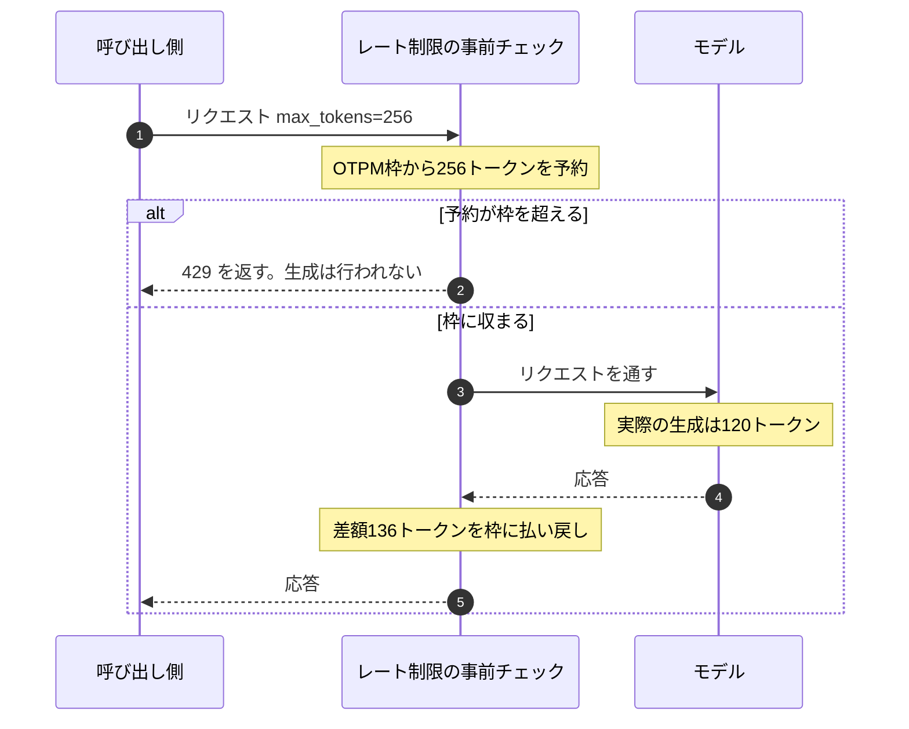

# はじめに

Databricksで基盤モデルを呼ぶ方法は大きく2つあります。Foundation Model APIs (以下FMAPI) のエンドポイントをPythonから直接叩く方法と、SQLの `ai_query` などのAI Functionsを使う方法です。

どちらも同じDatabricksホストのモデルを利用しますが、レート制御とスケーリングの責任範囲が違う、という話を聞きました。ドキュメントにも次の記述があります。

- [ai_query を使用する](https://docs.databricks.com/aws/ja/large-language-models/ai-query) — 「AI Functions は並列処理、再試行、スケーリングを自動的に処理します」
- [Foundation Model API の制限とクォータ](https://docs.databricks.com/aws/ja/machine-learning/foundation-model-apis/limits)
- [AI Functions で非構造化データを変換する](https://docs.databricks.com/aws/ja/large-language-models/ai-functions)

言われてみればそうなのですが、実際にどれくらい違うのかが数字で分かりません。そこで、同じ行数・同じプロンプト・同じ `max_tokens` で3通りの呼び方を試し、レート制限に当たったあとに何が起きるかを実測しました。想定と違う結果もあったので、そのあたりも含めて書いていきます。

コードはノートブックにそのまま貼れる形で、上から順に全部載せています。

# FMAPI直接呼び出しとAI Functionsの違い

本題に入る前に、2つの呼び方の関係を整理します。

| 観点 | FMAPI直接呼び出し | AI Functions |
| --- | --- | --- |
| 呼び出し方 | ノートブックからPython (OpenAI互換クライアント等) で個別に呼び出す | SQL一発 (`ai_query`) でテーブル全体を処理 |
| 並列・リトライ・スケール | 呼び出し側で実装・運用する (同時実行制御、再試行の間隔調整等) | エンジン側が自動管理する |
| レート制御の主体 | 呼び出し側 (自身で上限内に収める) | エンジン側 (バッチ推論として最適化) |
| 主な利用者 | Python開発者 | SQL利用者も可 |

要点は、レート制御とスケーリングの責任が「呼び出し側」にあるか「エンジン側」にあるか という違いです。

この記事で確かめたいのは、2行目の **「呼び出し側で実装・運用する」が具体的に何をやることなのか** です。同時実行制御と再試行の間隔調整、と書かれていますが、それを実際に書くと何行になり、どこで判断を迫られるのか。そして3つ目の呼び方では、それがどこまで消えるのか。ここを実物で見ていきます。

# 検証の設計

同じ200行のテキストを日本語で3文に要約させるタスクを、3通りの呼び方で処理します。

| # | 呼び出し方 | リトライ |
| --- | --- | --- |
| 1 | FMAPI直接呼び出し | なし |
| 2 | FMAPI直接呼び出し | 自前バックオフあり |
| 3 | `ai_query` で一括実行 | Databricks側が自動 |

条件は次のとおりです。

- エンドポイント: `databricks-claude-haiku-4-5` (従量課金)
- 行数: 200行、`max_tokens`: 256、`temperature`: 0
- 直接呼び出し側の同時実行数: 64

## 実行する前に

:::note warn
**この検証は、意図的にワークスペースのレート枠を使い切りにいく設計です。**
:::

実験1と2を実行している数十秒のあいだ、同じワークスペースで動いている他のジョブやアプリ、AI Playgroundからの呼び出しが429を受ける可能性があります。

枠は1分程度で回復するので壊れるものはありませんが、本番の推論経路が同居しているワークスペースでの実行は避けてください。検証用のワークスペースか、影響の少ない時間帯でお願いします。

もうひとつ、地味ですが重要な条件があります。**3つの実験の間に70秒のクールダウンを挟んでいます。** 挟まないと前の実験で消費した枠が残っていて、比較が成立しません。ここを飛ばして最初に測ったときは、実験2と実験3の数字が意味不明になりました。

# 準備

パッケージを入れてPythonを再起動します。

```python
%pip install -q --upgrade "openai>=1.0" databricks-sdk
%restart_python
```

パラメータをまとめて定義します。カタログとスキーマは自分の環境に合わせてください。

```python
# 検証対象のエンドポイント。従量課金の基盤モデルを指定します
ENDPOINT = "databricks-claude-haiku-4-5"

NUM_ROWS = 200     # 処理する行数
MAX_TOKENS = 256   # 1リクエストあたりの最大出力トークン。OTPMの予約量を決める値です
MAX_WORKERS = 64   # 直接呼び出し側の同時実行数
COOLDOWN_SEC = 70  # 実験の間に挟む待ち時間。レート枠を回復させます

SOURCE_TABLE = "main.default.pacing_demo_reviews"          # 検証データの置き場
RESULT_TABLE = "main.default.pacing_demo_ai_query_result"  # 実験3の結果の置き場
```

クライアントを用意します。個人アクセストークンは不要で、ノートブックのコンテキストから認証されます。

```python
from databricks.sdk import WorkspaceClient

# ノートブックのコンテキストから認証されます
w = WorkspaceClient()

# OpenAI互換クライアント。model にエンドポイント名を渡して使います
client = w.serving_endpoints.get_open_ai_client()
```

検証データを作ります。行ごとに違うテキストにしているのがポイントです。全行同じにするとプロンプトキャッシュが効いて、トークン消費と応答時間の両方が実態からずれます。

```python
import random

# レビュー文の断片。ここから3つ選んで連結し、行ごとに異なるテキストを作ります
FRAGMENTS = [
    "配送が指定日より2日遅れて届きました。梱包は丁寧でしたが、追跡番号の反映が遅く問い合わせが必要でした。",
    "想像していたよりも本体が小さく、机の上に置いても邪魔になりません。ただし付属のケーブルが短すぎます。",
    "3ヶ月使っていますがバッテリーの持ちが目に見えて落ちてきました。初期不良ではなさそうですが残念です。",
    "アプリとの連携がスムーズで、初期設定は5分で終わりました。マニュアルを読む必要がほとんどありませんでした。",
    "価格帯を考えれば十分な品質です。高級感はありませんが、日常使いで不満を感じる場面はありませんでした。",
    "サポートの返信が早く、交換対応も迅速でした。製品自体のトラブルは残念でしたが対応には満足しています。",
    "動作音が思ったより大きく、寝室での使用には向きません。リビングであれば気にならないレベルです。",
    "デザインは気に入っていますが、ボタンの配置が直感的ではなく、慣れるまで何度も押し間違えました。",
]

random.seed(42)  # 再実行しても同じデータになるよう固定します

# 先頭に連番を入れているのは、断片の組み合わせが偶然かぶっても
# 行として同一のテキストにならないようにするためです
rows = [
    (i, f"【レビュー #{i:04d}】" + " ".join(random.sample(FRAGMENTS, k=3)))
    for i in range(NUM_ROWS)
]

df = spark.createDataFrame(rows, "id INT, review STRING")
df.write.mode("overwrite").saveAsTable(SOURCE_TABLE)

# 実験1と2はPythonから直接投げるので、リストとしても持っておきます
texts = [r.review for r in df.orderBy("id").collect()]
```

プロンプトは3つの実験で共通です。

```python
# 3つの実験で共通のプロンプト。出力が短くなりすぎないよう3文の要約にしています。
# 出力量がOTPMの枠に効くので、ここを変えると429の出方も変わります
PROMPT_TEMPLATE = (
    "次の商品レビューを、日本語で3文に要約してください。"
    "1文目は総評、2文目は良かった点、3文目は改善してほしい点にしてください。\n\n"
    "レビュー:\n{text}"
)
```

計測用の入れ物と表示関数です。1リクエストごとの結果を `CallResult` に集めて、最後に集計します。

```python
import time
from dataclasses import dataclass
from typing import Optional

@dataclass
class CallResult:
    """1リクエストぶんの結果。成功でも失敗でもこの形で返します"""
    ok: bool
    status: Optional[int] = None         # HTTPステータス。429かどうかの判定に使います
    latency: float = 0.0                 # 再送の待ち時間も含めた1件あたりの所要時間
    attempts: int = 1                    # 試行回数。実験2でのみ2以上になります
    waited: float = 0.0                  # 自前のsleepで待った合計時間
    output_tokens: Optional[int] = None  # 実際に生成された出力トークン数
    raw_error: Optional[str] = None      # エラーレスポンスのボディをそのまま保持します
    error_headers: Optional[dict] = None


def show(label, results, elapsed):
    lat = sorted(r.latency for r in results)
    # パーセンタイル。p95はバックオフのコストが出る場所なので必ず見ます
    pct = lambda p: lat[min(len(lat) - 1, int(len(lat) * p))] if lat else 0.0
    ok = sum(1 for r in results if r.ok)
    print(f"--- {label} ---")
    print(f"  経過時間        : {elapsed:8.1f} 秒")
    print(f"  成功 / 全体     : {ok} / {len(results)}")
    print(f"  429             : {sum(1 for r in results if r.status == 429)}")
    print(f"  レイテンシ p50  : {pct(0.50):8.2f} 秒")
    print(f"  レイテンシ p95  : {pct(0.95):8.2f} 秒")
    print(f"  自前の待機合計  : {sum(r.waited for r in results):8.1f} 秒")
    print(f"  出力トークン計  : {sum(r.output_tokens or 0 for r in results):,}")
    # 成功した件数だけで割っています。落ちた行はここに含まれません
    print(f"  スループット    : {ok / elapsed:8.2f} 行/秒")
```

例外からレスポンスの中身を取り出すヘルパーも用意します。429のレスポンス形式は将来変わりうるので、決め打ちでパースせずボディとヘッダをそのまま保持しておきます。ここが後で効いてきます。

```python
def _error_detail(exc):
    """例外からレスポンスのボディとヘッダを取り出します。

    429のレスポンス形式を決め打ちでパースせず、生のまま持っておくのが狙いです。
    中身は実験1で確認します。
    """
    body, headers = None, None
    resp = getattr(exc, "response", None)
    if resp is not None:
        try:
            body = resp.text
        except Exception:
            pass
        try:
            headers = dict(resp.headers)
        except Exception:
            pass
    # レスポンスが取れない例外 (接続エラー等) は例外の文字列で代用します
    return (body or str(exc)), headers
```

準備は以上です。

# 実験1: 直接呼び出し、リトライなし

OpenAI互換クライアントで、64並列のまま素直に投げます。「何も考えずに並列で投げる」実装のベースラインです。

```python
def call_naive(text: str) -> CallResult:
    """1件を投げて、成功でも失敗でも CallResult にして返します。
    例外を外に投げないのは、落ちた件数を数えたいからです。"""
    t0 = time.perf_counter()
    try:
        resp = client.chat.completions.create(
            model=ENDPOINT,
            messages=[{"role": "user", "content": PROMPT_TEMPLATE.format(text=text)}],
            max_tokens=MAX_TOKENS,  # この値ぶんの出力枠が事前に予約されます
            temperature=0,
        )
        usage = getattr(resp, "usage", None)
        return CallResult(
            ok=True,
            status=200,
            latency=time.perf_counter() - t0,
            # 実際に生成された出力トークン数。予約した max_tokens とは別物です
            output_tokens=getattr(usage, "completion_tokens", None) if usage else None,
        )
    except Exception as exc:
        # ステータスコードの取り出し方はSDKのバージョンで変わるので両方見ます
        status = getattr(exc, "status_code", None) or getattr(
            getattr(exc, "response", None), "status_code", None
        )
        body, headers = _error_detail(exc)
        return CallResult(
            ok=False,
            status=status,
            latency=time.perf_counter() - t0,
            raw_error=body,
            error_headers=headers,
        )
```

これを200件投げます。ここから枠を使い始めるので、実行前にもう一度ワークスペースを確認してください。

```python
from concurrent.futures import ThreadPoolExecutor

t0 = time.perf_counter()
# pool.map は入力順に結果を返すので、texts と results_naive の並びは対応します
with ThreadPoolExecutor(max_workers=MAX_WORKERS) as pool:
    results_naive = list(pool.map(call_naive, texts))
elapsed_naive = time.perf_counter() - t0

show("実験1: 直叩き / リトライなし", results_naive, elapsed_naive)
```

結果です。

```
--- 実験1: 直叩き / リトライなし ---
  経過時間        :      8.4 秒
  成功 / 全体     : 143 / 200
  429             : 57
  レイテンシ p50  :     1.81 秒
  レイテンシ p95  :     3.16 秒
  自前の待機合計  :      0.0 秒
  出力トークン計  : 23,959
  スループット    :    16.99 行/秒
```

8.4秒で終わっていますが、200行中57行が落ちています。完了率は71.5%です。

## 429が出るのは当然の投げ方だった

なぜ落ちたのかは、[制限のドキュメント](https://docs.databricks.com/aws/ja/machine-learning/foundation-model-apis/limits)を読むとはっきりします。エンタープライズ層のワークスペースで `databricks-claude-haiku-4-5` に設定されているのは、ITPM 200,000 / OTPM 20,000 / QPH 360,000 です。

ここで効いてくるのが、事前入場チェックの仕組みです。ドキュメントには、`max_tokens` を指定するとDatabricksはその値を使って、**リクエストが処理のために許可される前に**出力トークンの容量を見積もって予約する、と書かれています。実際の出力が予約より少なければ、差額はレート制限の許容量に払い戻されます。

1リクエストが辿る順番にすると、こうなります。



見てのとおり、枠の判定はモデルが動く前に終わっています。払い戻しが起きるのは応答が返ったあとです。この順番が、次の数字の意味を決めます。

今回は200件がそれぞれ `max_tokens=256` を宣言しているので、合計51,200トークンぶんの出力枠を予約しにいったことになります。OTPMの枠は20,000です。実際に生成されたのは23,959トークンなので差額は払い戻されますが、払い戻しが効くのは応答が返ったあとです。同時に走っている64件のバーストには間に合いません。

**429を踏むかどうかを決めているのは、実際の出力量ではなく `max_tokens` の宣言値です。** ここは実務でも効きます。念のため大きめの `max_tokens` を指定しておく、という習慣は、レート制限のある環境では枠を余計に押さえることになります。実際の出力長に近い値を指定するほうが、同じ枠でより多くのリクエストが通ります。

## 429レスポンスの中身

どの制限に当たったのかはレスポンスから分かります。

```python
# 最初に429を受けたリクエストを取り出します
first_429 = next((r for r in results_naive if r.status == 429), None)

print(first_429.raw_error)

# レート制限まわりのヘッダだけ絞り込みます。retry-after があればここに出ます
print({
    k: v for k, v in (first_429.error_headers or {}).items()
    if "rate" in k.lower() or "retry" in k.lower()
})
```

返ってきたのはこれだけでした。

```json
{
  "error_code": "REQUEST_LIMIT_EXCEEDED",
  "message": "REQUEST_LIMIT_EXCEEDED: Exceeded workspace output tokens per minute rate limit for databricks-claude-haiku-4-5. Work with your Databricks account team to request a higher FMAPI rate limit tier."
}
```

出力トークン/分の制限に当たったことがメッセージに明記されています。ITPM (入力トークン/分) でもQPH (クエリ/時) でもなく、OTPMです。今回のように長めの出力を大量に生成するワークロードでは、まずOTPMが効いてくる、というのが分かります。

一方で、**待機時間のヒントは返ってきませんでした。** ヘッダを絞り込んだ結果は空の辞書です。次にいつ再送してよいかを示す値は、ボディにもヘッダにも含まれていません。

制限のドキュメントには、`limit_type` や `retry_after` を含む429レスポンスの例が載っています。今回返ってきたのはその形式ではありませんでした。エンドポイントや経路によって差があるのかもしれませんが、少なくとも今回の構成では待機時間を教えてもらえない前提で実装する必要があります。ここが実験2に効いてきます。

次の実験に進む前にクールダウンを入れます。

```python
# 実験1で消費した枠が残っていると比較にならないので、回復を待ちます
time.sleep(COOLDOWN_SEC)
```

# 実験2: 直接呼び出し、自前バックオフあり

実験1に「429を受けたら待って再送する」ロジックを足します。

## 指数バックオフとジッター

再送に使う2つの考え方を先に整理しておきます。

**指数バックオフ**は、再送のたびに待ち時間を倍にしていくやり方です。1秒、2秒、4秒、8秒と伸ばし、どこかで頭打ちにします。固定間隔で再送すると、混雑が解消するまで同じ頻度で叩き続けることになり、相手の回復を邪魔します。回を重ねるほど間隔を空けることで、諦めずに粘りながら負荷はかけない、という形にします。

**ジッター**は、その待ち時間に乱数を足してばらつかせることです。これがないと何が起きるかというと、同時に429を受けた53件は、どれも同じ計算式で待ち時間を出すので、**同じ秒数待って同じ瞬間に再送します。** 結果、また全員で枠を叩いて全員が429を踏む。これが何度か繰り返されます。1秒未満の乱数を足しておくだけで再送のタイミングが散り、この足並みが揃う状態を避けられます。

今回の実装では、上限32秒の指数バックオフに0から1秒の乱数を足しています。

## 再送のコード

まず、レスポンスから待機時間のヒントを読む関数です。ヘッダを優先し、なければボディのメタデータを見にいきます。

```python
import json

def _retry_after_seconds(headers, body):
    """待機時間のヒントを探します。見つからなければ None を返します"""

    # 1) ヘッダを優先。大文字小文字とミリ秒表記の両方に備えます
    for key in ("retry-after", "Retry-After", "retry-after-ms"):
        if headers and key in headers:
            try:
                val = float(headers[key])
                return val / 1000.0 if key.endswith("-ms") else val
            except (TypeError, ValueError):
                pass

    # 2) ヘッダになければボディのメタデータを見にいきます
    try:
        payload = json.loads(body)
    except Exception:
        return None

    # トップレベルと error 配下の両方を探します
    candidates = (payload, payload.get("error", {}) if isinstance(payload, dict) else {})
    for container in candidates:
        if isinstance(container, dict):
            for key in ("retry_after", "retry_after_seconds"):
                if key in container:
                    try:
                        return float(container[key])
                    except (TypeError, ValueError):
                        pass
    return None
```

これを使って再送する呼び出し関数です。ヒントが取れなければ指数バックオフにフォールバックし、ジッターを足して再送のタイミングをばらします。

```python
MAX_ATTEMPTS = 8  # 1件あたりの試行回数の上限

def call_with_retry(text: str) -> CallResult:
    """429を受けたら待って再送します。call_naive との差分がそのまま
    「自前でペーシングを組む」という作業の分量です。"""
    t0 = time.perf_counter()
    waited = 0.0  # このリクエストがsleepで待った合計
    last_body, last_headers, last_status = None, None, None

    for attempt in range(MAX_ATTEMPTS):
        try:
            resp = client.chat.completions.create(
                model=ENDPOINT,
                messages=[{"role": "user", "content": PROMPT_TEMPLATE.format(text=text)}],
                max_tokens=MAX_TOKENS,
                temperature=0,
            )
            usage = getattr(resp, "usage", None)
            return CallResult(
                ok=True,
                status=200,
                latency=time.perf_counter() - t0,
                attempts=attempt + 1,
                waited=waited,
                output_tokens=getattr(usage, "completion_tokens", None) if usage else None,
            )
        except Exception as exc:
            status = getattr(exc, "status_code", None) or getattr(
                getattr(exc, "response", None), "status_code", None
            )
            body, headers = _error_detail(exc)
            last_body, last_headers, last_status = body, headers, status

            # 429と5xx以外は再試行しても意味がないので即座に諦めます
            if status != 429 and not (status and 500 <= status < 600):
                break

            # ヒントが取れればそれに従い、なければ指数バックオフにフォールバックします
            hinted = _retry_after_seconds(headers, body)
            backoff = hinted if hinted is not None else min(2 ** attempt, 32)
            # ジッター。再送が同じ瞬間に集中しないよう待ち時間をばらします
            backoff += random.uniform(0, 1.0)
            time.sleep(backoff)
            waited += backoff

    # MAX_ATTEMPTS を使い切った場合。最後に受けたエラーを持って返します
    return CallResult(
        ok=False,
        status=last_status,
        latency=time.perf_counter() - t0,
        attempts=MAX_ATTEMPTS,
        waited=waited,
        raw_error=last_body,
        error_headers=last_headers,
    )
```

実験1と同じ条件で回します。

```python
t0 = time.perf_counter()
with ThreadPoolExecutor(max_workers=MAX_WORKERS) as pool:
    results_retry = list(pool.map(call_with_retry, texts))
elapsed_retry = time.perf_counter() - t0

show("実験2: 直叩き / 自前バックオフあり", results_retry, elapsed_retry)

# 再送が発生したリクエストだけ抜き出して、待機の実態を見ます
retried = [r for r in results_retry if r.attempts > 1]
print(f"再送が発生したリクエスト : {len(retried)} / {len(results_retry)}")
if retried:
    print(f"最大試行回数             : {max(r.attempts for r in retried)}")
    print(f"1リクエストあたり最大待機: {max(r.waited for r in retried):.1f} 秒")
```

結果です。

```
--- 実験2: 直叩き / 自前バックオフあり ---
  経過時間        :     48.3 秒
  成功 / 全体     : 200 / 200
  429             : 0
  レイテンシ p50  :     1.87 秒
  レイテンシ p95  :    42.83 秒
  自前の待機合計  :   1094.7 秒
  出力トークン計  : 33,476
  スループット    :     4.14 行/秒

再送が発生したリクエスト : 53 / 200
最大試行回数             : 6
1リクエストあたり最大待機: 34.9 秒
```

200行すべてが完走しました。実験1で落ちた57行と、実験2で再送が発生した53行がほぼ一致しているのも、現象として再現性があることを示しています。

ここから読み取れることが3つあります。

## 待機時間は呼び出し側が決めることになる

上で用意した `_retry_after_seconds()` は、**一度も発火しませんでした。** 実験1で見たとおりヒントが返ってこないので、53件すべてが `min(2 ** attempt, 32)` の指数バックオフで処理されています。

つまり待機時間の決め方は、呼び出し側に委ねられています。長めに取ればスループットが落ち、短ければまた429を踏んで試行回数を消費する。そのバランスを自分で選ぶことになります。今回は最大6回の試行、1リクエストあたり最大34.9秒の待機に落ち着きました。

補足すると、制限のドキュメントの「再試行ロジックを実装する」に載っているサンプルコードも、`retry_after` を読まずに純粋な指数バックオフで実装されています。実装としてはこちらに寄せておくのが安全そうです。

これは、レート制御が「呼び出し側の責任」であることの実体だと思います。責任が来るのは制御の実装だけでなく、制御に必要なパラメータを自分で推定する部分も含む、ということです。

## 64スレッドのうち22.7本が常に寝ている

自前の待機合計は1094.7秒でした。経過時間は48.3秒です。割ると22.66になります。**平均して22.7本のスレッドが、常時sleepしていた計算です。**

64並列のうち3分の1が、仕事をせずに待つためだけに存在していたことになります。並列度を上げれば速くなるという直感が、レート制限のある世界では成立しない。ここは数字で見せられると納得感があります。

## テールレイテンシは13倍になる

p50は実験1の1.81秒に対して実験2は1.87秒で、ほとんど変わりません。ところがp95は3.16秒から42.83秒へ、**13.5倍**になっています。

バックオフのコストは平均には現れず、末尾に集中します。バッチ処理なら気にしなくてよいのですが、同じ実装をオンラインのAPIに持ち込むと、95パーセンタイルだけが突然40秒を超えることになります。SLAを持っている経路でこの実装を使うなら、リトライ回数の上限とタイムアウトを別に設計する必要があります。

もう一度クールダウンを入れます。

```python
# 実験2で消費した枠を回復させてから実験3に入ります
time.sleep(COOLDOWN_SEC)
```

# 実験3: ai_queryで一括実行

同じ200行を、SQLから一括で投げます。並列度もリトライも指定しません。ドキュメントの推奨どおり、データセット全体を1クエリで渡します。

```python
# SQL文字列に埋め込むので、改行はエスケープした形で持ちます。
# 内容は PROMPT_TEMPLATE と同じです
prompt_head = (
    "次の商品レビューを、日本語で3文に要約してください。"
    "1文目は総評、2文目は良かった点、3文目は改善してほしい点にしてください。\\n\\nレビュー:\\n"
)

# 200行を1クエリで渡します。並列度もリトライも指定しません
query = f"""
SELECT
  id,
  ai_query(
    '{ENDPOINT}',
    CONCAT('{prompt_head}', review),
    modelParameters => named_struct('max_tokens', {MAX_TOKENS}, 'temperature', 0.0),
    failOnError => false
  ) AS r
FROM {SOURCE_TABLE}
"""
```

`failOnError => false` を付けているのがポイントです。これを付けると、失敗した行は例外ではなく `errorMessage` 列として結果に残ります。「何行落ちたか」を数えられる形にしておかないと、実験1と比較できません。

```python
t0 = time.perf_counter()
(
    spark.sql(query)
    # failOnError => false のとき、ai_query は result と errorMessage を持つ
    # struct を返します。両方を列に展開しておきます
    .selectExpr("id", "r.result AS result", "r.errorMessage AS error_message")
    # 書き込みまで実行して、全行が確実に処理されるようにします
    .write.mode("overwrite")
    .saveAsTable(RESULT_TABLE)
)
elapsed_ai_query = time.perf_counter() - t0

res = spark.table(RESULT_TABLE)
ok_rows = res.filter("error_message IS NULL AND result IS NOT NULL").count()
err_rows = res.filter("error_message IS NOT NULL").count()  # 実験1の429に相当する行

print(f"  経過時間     : {elapsed_ai_query:8.1f} 秒")
print(f"  成功 / 全体  : {ok_rows} / {NUM_ROWS}")
print(f"  エラー行     : {err_rows}")
print(f"  スループット : {ok_rows / elapsed_ai_query:8.2f} 行/秒")
```

`saveAsTable` まで実行しているのは、Sparkの遅延評価で計測が空振りしないようにするためです。`count()` だけだと最適化で処理が省かれることがあります。

結果です。

```
  経過時間     :     53.2 秒
  成功 / 全体  : 200 / 200
  エラー行     : 0
  スループット :     3.76 行/秒
```

エラー行はゼロでした。呼び出し側は同時実行数もバックオフも指定していません。ここまでで書いたレート制御のコードは0行です。

# 3つを並べて見る

最初の比較表にあった「並列・リトライ・スケール」の行を、実験ごとに分解するとこうなります。

| | 実験1 | 実験2 | 実験3 |
| --- | --- | --- | --- |
| 同時実行数 | 自分で64と決めた | 自分で64と決めた | 指定なし |
| 再試行するか | しない | する | 指定なし |
| 再試行の間隔 | — | ヒントがないので指数関数で推定 | 指定なし |
| 試行回数の上限 | — | 自分で8と決めた | 指定なし |
| 経過時間 | 8.4秒 | 48.3秒 | 53.2秒 |
| 完了 | 143/200 | 200/200 | 200/200 |
| 429として表面化 | 57件 | 0件。内部で53件再送 | 0件 |
| p95レイテンシ | 3.16秒 | 42.83秒 | 測定なし |
| 自前の待機合計 | 0秒 | 1094.7秒 | 0秒 |
| そのために書いたコード | なし | `call_with_retry` と `_retry_after_seconds` | なし |

:::note info
処理時間はワークスペースのレート制限ティア、モデル、リージョン、そのときの混み具合で変わります。以下の数字は今回の計測環境でのものとして読んでください。
:::

実験1は、左列を**実装しなかった**場合です。責任が空欄のままなので、57行が失われます。エラーとして返ってくるので気づけますが、気づいたあとに書くものは実験2と同じです。

実験2が、左列を実際に果たすとどうなるかです。同時実行数、再試行の有無、その間隔、試行回数の上限。**この4つを全部、自分で決めています。** しかも間隔については、429が待機時間を教えてくれないので推定するしかありません。決めた値が妥当かどうかを確かめる手段も、この経路にはありません。

実験3は右列です。4つのどれも指定していません。SQLを1本書いただけで、完了率は実験2と同じになりました。

**比較表の「エンジン側が自動管理する」という一行は、この4つを決めなくてよい、という意味でした。**

## 完走させると処理時間はほぼ並ぶ

48.3秒と53.2秒。`ai_query` はレート枠を無視して速く回っているわけではなく、実験2の自前バックオフとほぼ同じ天井に張り付いています。同じ基盤モデルを同じワークスペースの枠で呼んでいるのだから、当然といえば当然です。

自動管理されるのは4つの値を決める作業であって、天井そのものが上がるわけではない。ここは期待しすぎないほうがよさそうです。スループットが足りないなら、プロビジョニングスループットのエンドポイントを検討する話になります。

なお、それぞれ1回ずつの実行なので、数秒の差を云々するデータではありません。

## 実験1の「16.99行/秒」は速さではない

実験1のスループット16.99行/秒は、3つの中で圧倒的に速く見えます。ただしこれは、落ちた57行を無視した数字です。

200行を完了させる必要があるなら、落ちた分を再投入することになり、結局同じ天井に戻ります。ここは自分でも一度誤読しかけました。レート制限のある環境でスループットを測るときは、必ず完了率とセットで見る必要があります。

# 後片付け

検証用のテーブルを消しておきます。

```python
# 追試するときは残しておいても構いません
spark.sql(f"DROP TABLE IF EXISTS {SOURCE_TABLE}")
spark.sql(f"DROP TABLE IF EXISTS {RESULT_TABLE}")
```

# まとめ

同じモデルを3通りの呼び方で叩いてみて分かったことをまとめます。

- 200行・64並列の直接呼び出しでは、8.4秒で429が57件発生した。当たったのはOTPM (出力トークン/分) の制限で、エラーメッセージにどの制限かが明記される
- **429を踏むかどうかは、実際の出力量ではなく `max_tokens` の宣言値で決まる。** 事前入場チェックが `max_tokens` ぶんの出力枠を予約するので、念のため大きめに取っておく習慣は枠を余計に押さえることになる
- **429レスポンスには、次にいつ再送してよいかを示す待機時間のヒントは含まれていなかった。** 再送の間隔は指数バックオフで見積もることになる
- 自前バックオフを書けば200行は完走する。ただし同時実行数・再試行の有無・その間隔・試行回数の上限という**4つの値を自分で決めることになり、どれも正解を確かめる手段がない**
- 完走までは48.3秒。このとき自前の待機合計は1094.7秒で、64スレッドのうち平均22.7本が常時sleepしていた
- **バックオフのコストは平均ではなくテールに出る。** p50は1.81秒→1.87秒でほぼ変わらないが、p95は3.16秒→42.83秒で13.5倍
- `ai_query` の一括実行は53.2秒でエラー行ゼロ。上の4つはどれも指定しておらず、呼び出し側が書いたレート制御のコードは0行
- **「エンジン側が自動管理する」は、速くなるという意味ではない。** 自前バックオフの48.3秒と桁が変わるような差はなく、この4つを決めなくてよいという意味だった
- 完了率を見ずにスループットだけ比べると、429で行を捨てている実装が一番速く見えてしまう
- 処理時間はワークスペースのティア、モデル、リージョン、混み具合で変わる。上の秒数は今回の計測環境での値

一番の収穫は、「AI Functionsは並列処理、再試行、スケーリングを自動的に処理します」という一文の中身を、決めなくてよくなる4つの値として具体化できたことでした。バッチでテーブル全体を処理するなら `ai_query` を選ぶ理由は明確です。逆に、直接呼び出しを選ぶ場面 — オンラインの推論経路や、SQLに乗らない前処理が挟まる場合 — では、その4つの決定とテールレイテンシの設計が自分の仕事として残ります。どちらを選ぶかの判断材料として使えると思います。

数字はワークスペースのティアやモデルによって変わります。手元で回すときは `MAX_WORKERS` を8から順に上げていくと、何並列から429が出始めるかの境界が見えて、自分の環境の感覚がつかめます。`MAX_TOKENS` を256から128に下げて同じ実験を回すと、予約される枠が半分になるので、429の出方が変わるはずです。こちらのほうが効き目は大きいかもしれません。

# 参考リンク

- [ai_query を使用する](https://docs.databricks.com/aws/ja/large-language-models/ai-query)
- [Foundation Model API の制限とクォータ](https://docs.databricks.com/aws/ja/machine-learning/foundation-model-apis/limits)
- [AI Functions で非構造化データを変換する](https://docs.databricks.com/aws/ja/large-language-models/ai-functions)
- [ai_query 関数](https://docs.databricks.com/aws/ja/sql/language-manual/functions/ai_query)

### はじめてのDatabricks

[はじめてのDatabricks](https://qiita.com/taka_yayoi/items/8dc72d083edb879a5e5d)

### Databricks無料トライアル

[Databricks無料トライアル](https://databricks.com/jp/try-databricks)
