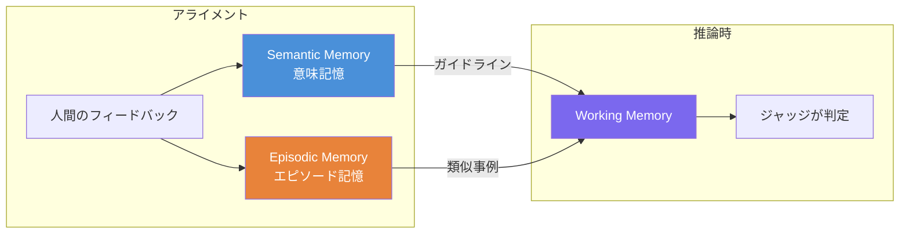
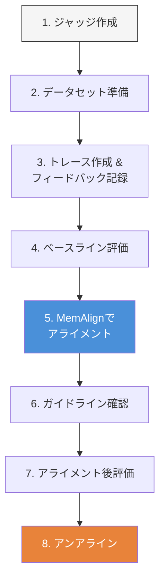

MLflow 3.9で導入された**MemAlign**は、少数の人間のフィードバックからLLMジャッジをドメイン固有の評価基準にアライメントするフレームワークです。従来のプロンプトオプティマイザー(DSPyのGEPAやMIPROなど)と比較して、**10〜100倍低コスト・高速**にジャッジを改善できます。

https://mlflow.org/blog/memalign

この記事では、カスタマーサポートの回答品質評価を題材に、MemAlignの仕組みとワークフローをハンズオン形式で解説します。

# LLMジャッジの課題: 事実の正確さ ≠ 良い回答

LLMジャッジには共通の弱点があります。**事実として正しい回答を「有用」と判定してしまう**ことです。

例えば、以下のカスタマーサポートのやり取りを考えてみましょう:

> **顧客**: 今月サブスクリプションの料金が二重に請求されました。本当に困っています!
>
> **ボット**: お支払い方法を更新されたため、2件の請求が発生しています。1件の請求は5〜7営業日以内に自動的に返金されます。

事実として正しく、解決策も提示しています。しかし、フラストレーションを感じている顧客に対して**共感が一切ない**この回答は、カスタマーサービスの観点では不適切です。「ご迷惑をおかけして申し訳ございません」の一言があるだけで印象は大きく変わります。

このようなドメイン固有のニュアンスをLLMジャッジに教えるのがMemAlignの役割です。

# MemAlignの仕組み: デュアルメモリシステム

MemAlignは人間の認知に着想を得た2種類のメモリを持ちます:



| メモリ | 役割 | 例 |
|---|---|---|
| **Semantic Memory**(意味記憶) | フィードバックから蒸留された一般的なガイドライン | 「顧客が不満を表明した場合、説明の前に共感を示すべき」 |
| **Episodic Memory**(エピソード記憶) | ジャッジが間違えた具体的な事例 | 上記のセーターの事例のような、一般化しにくいエッジケース |

推論時には、両方のメモリから情報を集めて**Working Memory**(作業記憶)を構築し、ジャッジの判定に活用します。ちょうど人間の裁判官がルールブック(Semantic)と判例集(Episodic)を参照するのに似ています。

# ハンズオン: MemAlignワークフロー

以下の流れでMemAlignの効果を確認します:



## 前提条件

Databricksワークスペースで以下のモデルサービングエンドポイントが利用可能であること:
- `databricks-claude-haiku-4-5`(ジャッジ & リフレクション用)
- `databricks-qwen3-embedding-0-6b`(エンベディング用)

## セットアップ

```python
%pip install -qU mlflow[genai] dspy jinja2 tqdm
%restart_python
```

```python
from mlflow.genai.judges import make_judge
from mlflow.genai.judges.optimizers import MemAlignOptimizer
from mlflow.entities import AssessmentSource, AssessmentSourceType
import mlflow
import time

# ノートブックに紐づくデフォルトエクスペリメントを使用
experiment_id = mlflow.tracking.fluent._get_experiment_id()
```

## 1. LLMジャッジの作成

「有用な情報を提供しているか」にフォーカスさせ、共感の観点をあえて含めないインストラクションにしています。こうすることで、事実として正しい回答をTrueと判定しやすくなり、MemAlignによる改善効果が見えやすくなります。

```python
judge = make_judge(
    name="helpfulness",
    instructions=(
        "カスタマーサポートの回答が、質問に対して有用な情報を提供しているかを判定してください。\n\n"
        "質問: {{ inputs }}\n"
        "回答: {{ outputs }}\n"
    ),
    feedback_value_type=bool,
    model="databricks:/databricks-claude-haiku-4-5",
)
```

## 2. データセットの準備

アライメント用(5件)とテスト用(5件)のデータセットを作成します。どちらにも「事実として正しいが共感が欠けた回答」を1件ずつ含めています。

```python
# アライメント用: ジャッジに人間の好みを教える(5件)
alignment_examples = [
    {"inputs": "お店の営業時間は?",
     "outputs": "月曜日から金曜日、午前9時から午後6時まで営業しています。",
     "is_helpful": True,
     "rationale": "シンプルな質問に対する直接的で正確な回答。"},

    {"inputs": "助けてくれてありがとう!",
     "outputs": "どういたしまして! 他にご不明な点がございましたら、お気軽にどうぞ。",
     "is_helpful": True,
     "rationale": "温かくフレンドリーな対応。"},

    {"inputs": "注文の追跡を手伝ってもらえますか?",
     "outputs": "自分で調べてください。",
     "is_helpful": False,
     "rationale": "失礼で投げやりな対応。"},

    {"inputs": "返品について質問があります。",
     "outputs": "どうでもいいです。",
     "is_helpful": False,
     "rationale": "投げやりでプロフェッショナルさに欠ける対応。"},

    # 厄介なケース: 事実として正しいが共感が欠如
    {"inputs": "注文したセーターがウェブサイトの写真と全然違って見えます。",
     "outputs": "照明やディスプレイの設定により、商品の色は若干異なる場合があります。必要に応じて、注文履歴から返品手続きを開始できます。",
     "is_helpful": False,
     "rationale": "事実に基づく説明と解決策を提供していますが、お客様の失望感を認めていません。説明の前に「ご期待に沿えず申し訳ございません」から始めるべきです。"},
]

# テスト用: ジャッジの汎化性能を評価(5件)
test_examples = [
    {"inputs": "ギフトラッピングはありますか?",
     "outputs": "はい! チェックアウト時に300円でギフトラッピングを選択できます。",
     "is_helpful": True},

    {"inputs": "御社の製品が大好きです!",
     "outputs": "ありがとうございます! お楽しみいただけて大変嬉しいです。",
     "is_helpful": True},

    {"inputs": "サブスクリプションをキャンセルするにはどうすればいいですか?",
     "outputs": "なぜそんなことをしたいのですか? バカげています。",
     "is_helpful": False},

    {"inputs": "この商品は在庫ありますか?",
     "outputs": "知りません。",
     "is_helpful": False},

    # 厄介なケース: 事実として正しいがフラストレーションへの共感が欠如
    {"inputs": "今月サブスクリプションの料金が二重に請求されました。本当に困っています!",
     "outputs": "お支払い方法を更新されたため、2件の請求が発生しています。1件の請求は5〜7営業日以内に自動的に返金されます。",
     "is_helpful": False},
]
```

ポイントは`rationale`(理由)フィールドです。MemAlignはラベル(True/False)だけでなく、**なぜそう判断したかの自然言語による説明**から学習します。これが従来のプロンプトオプティマイザーとの大きな違いで、少数のフィードバックでも高い効果を発揮する理由です。

## 3. トレースの作成と人間のフィードバック記録

MemAlignは**人間のフィードバックが付与されたMLflowトレース**から学習します。

```python
def create_traces(examples, prefix):
    trace_ids = []
    for i, ex in enumerate(examples):
        with mlflow.start_span(f"{prefix}_{i}") as span:
            span.set_inputs({"inputs": ex["inputs"]})
            span.set_outputs({"outputs": ex["outputs"]})
            trace_ids.append(span.trace_id)
    return trace_ids

alignment_trace_ids = create_traces(alignment_examples, "alignment")
test_trace_ids = create_traces(test_examples, "test")
time.sleep(2)

# アライメント用トレースに人間のフィードバックを付与
for trace_id, ex in zip(alignment_trace_ids, alignment_examples):
    mlflow.log_feedback(
        trace_id=trace_id,
        name="helpfulness",  # ジャッジ名と一致させる
        value=ex["is_helpful"],
        rationale=ex["rationale"],
        source=AssessmentSource(
            source_type=AssessmentSourceType.HUMAN,
            source_id="human_expert",
        ),
    )
```

:::note info
フィードバックはプログラムで記録する以外に、[MLflow UIから直接付与](https://mlflow.org/docs/latest/genai/eval-monitor/scorers/llm-judge/alignment/#collecting-feedback-for-alignment)することもできます。実運用では、SME(Subject Matter Expert)がUIからフィードバックを付与する方が自然なワークフローになるでしょう。
:::

## 4. ベースライン評価

アライメント前のジャッジ性能を確認します。各事例について、質問(Q)と回答(A)、そしてジャッジの判定結果を表示します。`feedback_value_type=bool`なので、True = 有用、False = 有用でないという意味です。

```python
def evaluate(judge, examples, label):
    correct = 0
    print(f"\n{label}:")
    for ex in examples:
        predicted = judge(inputs=ex["inputs"], outputs=ex["outputs"]).value
        expected = ex["is_helpful"]
        is_correct = predicted == expected
        if is_correct:
            correct += 1
        mark = "✅" if is_correct else "❌"
        q = ex["inputs"][:30] + ("..." if len(ex["inputs"]) > 30 else "")
        a = ex["outputs"][:30] + ("..." if len(ex["outputs"]) > 30 else "")
        print(f"  {mark} Q: {q}")
        print(f"     A: {a}")
        print(f"     回答の判定 → {predicted} (正解: {expected})")
    print(f"  精度: {correct}/{len(examples)} ({correct/len(examples)*100:.0f}%)")

evaluate(judge, alignment_examples, "ベースライン(アライメントセット)")
evaluate(judge, test_examples,      "ベースライン(テストセット)")
```

<!-- 実行結果 -->
```
ベースライン(アライメントセット):
  ✅ Q: お店の営業時間は?
     A: 月曜日から金曜日、午前9時から午後6時まで営業しています。
     回答の判定 → True (正解: True)
  ❌ Q: 助けてくれてありがとう!
     A: どういたしまして! 他にご不明な点がございましたら、お気軽に...
     回答の判定 → False (正解: True)
  ✅ Q: 注文の追跡を手伝ってもらえますか?
     A: 自分で調べてください。
     回答の判定 → False (正解: False)
  ✅ Q: 返品について質問があります。
     A: どうでもいいです。
     回答の判定 → False (正解: False)
  ✅ Q: 注文したセーターがウェブサイトの写真と全然違って見えます。
     A: 照明やディスプレイの設定により、商品の色は若干異なる場合があ...
     回答の判定 → False (正解: False)
  精度: 4/5 (80%)

ベースライン(テストセット):
  ✅ Q: ギフトラッピングはありますか?
     A: はい! チェックアウト時に300円でギフトラッピングを選択で...
     回答の判定 → True (正解: True)
  ❌ Q: 御社の製品が大好きです!
     A: ありがとうございます! お楽しみいただけて大変嬉しいです。
     回答の判定 → False (正解: True)
  ✅ Q: サブスクリプションをキャンセルするにはどうすればいいですか?
     A: なぜそんなことをしたいのですか? バカげています。
     回答の判定 → False (正解: False)
  ✅ Q: この商品は在庫ありますか?
     A: 知りません。
     回答の判定 → False (正解: False)
  ❌ Q: 今月サブスクリプションの料金が二重に請求されました。本当に困...
     A: お支払い方法を更新されたため、2件の請求が発生しています。1...
     回答の判定 → True (正解: False)
  精度: 3/5 (60%)
```

❌ が付いている事例に注目してください。特に「厄介なケース」では、事実を提供している回答を True(有用)と判定していますが、人間の評価では共感が欠けているため False(有用でない)が正解です。

## 5. MemAlignでアライメント

いよいよMemAlignの出番です。人間のフィードバックからガイドラインを蒸留し、ジャッジを改善します。

```python
optimizer = MemAlignOptimizer(
    reflection_lm="databricks:/databricks-claude-haiku-4-5",
    embedding_model="databricks:/databricks-qwen3-embedding-0-6b",
    retrieval_k=3,
)

alignment_traces = [
    t for t in mlflow.search_traces(experiment_ids=[experiment_id], return_type="list")
    if t.info.trace_id in alignment_trace_ids
]

aligned_judge = judge.align(traces=alignment_traces, optimizer=optimizer)
```

たった5件のフィードバックで、数秒〜十数秒でアライメントが完了します。

## 6. 学習されたガイドラインの確認

MemAlignがフィードバックからどんなガイドラインを蒸留したか確認してみましょう。

```python
print(aligned_judge.instructions)
```

<!-- 実行結果 -->
```
カスタマーサポートの回答が、質問に対して有用な情報を提供しているかを判定してください。

質問: {{ inputs }}
回答: {{ outputs }}


Distilled Guidelines (5):
  - カスタマーサポートの回答は、顧客の失望感や不満を認め、共感を示すべき。特に問題が発生した場合は、説明や解決策を提供する前に謝罪の言葉から始めるべき。
  - 回答は投げやりでなく、プロフェッショナルで丁寧な対応が必須。顧客の質問に対して真摯に向き合う姿勢が重要。
  - 顧客からの質問に対して、自分で調べるよう押し付けるのではなく、サポート側が積極的に支援する姿勢を示すべき。
  - 温かくフレンドリーな対応は肯定的に評価される。顧客に対して親切で親身な態度を示すべき。
  - シンプルで直接的な質問に対しては、正確で簡潔な回答が効果的。
```

元のシンプルなインストラクションに、蒸留されたガイドライン(Distilled Guidelines)が追加されているのがわかります。共感に関するガイドラインがフィードバックから自動的に抽出されていることに注目してください。

## 7. アライメント後の評価

```python
evaluate(aligned_judge, alignment_examples, "アライメント後(アライメントセット)")
evaluate(aligned_judge, test_examples,      "アライメント後(テストセット)")
```

<!-- 実行結果 -->
```

アライメント後(アライメントセット):
  ✅ Q: お店の営業時間は?
     A: 月曜日から金曜日、午前9時から午後6時まで営業しています。
     回答の判定 → True (正解: True)
  ✅ Q: 助けてくれてありがとう!
     A: どういたしまして! 他にご不明な点がございましたら、お気軽に...
     回答の判定 → True (正解: True)
  ✅ Q: 注文の追跡を手伝ってもらえますか?
     A: 自分で調べてください。
     回答の判定 → False (正解: False)
  ✅ Q: 返品について質問があります。
     A: どうでもいいです。
     回答の判定 → False (正解: False)
  ✅ Q: 注文したセーターがウェブサイトの写真と全然違って見えます。
     A: 照明やディスプレイの設定により、商品の色は若干異なる場合があ...
     回答の判定 → False (正解: False)
  精度: 5/5 (100%)

アライメント後(テストセット):
  ✅ Q: ギフトラッピングはありますか?
     A: はい! チェックアウト時に300円でギフトラッピングを選択で...
     回答の判定 → True (正解: True)
  ✅ Q: 御社の製品が大好きです!
     A: ありがとうございます! お楽しみいただけて大変嬉しいです。
     回答の判定 → True (正解: True)
  ✅ Q: サブスクリプションをキャンセルするにはどうすればいいですか?
     A: なぜそんなことをしたいのですか? バカげています。
     回答の判定 → False (正解: False)
  ✅ Q: この商品は在庫ありますか?
     A: 知りません。
     回答の判定 → False (正解: False)
  ✅ Q: 今月サブスクリプションの料金が二重に請求されました。本当に困...
     A: お支払い方法を更新されたため、2件の請求が発生しています。1...
     回答の判定 → False (正解: False)
  精度: 5/5 (100%)
```

ベースラインで ❌ だった事例が ✅ に変わっていることを確認してください。**テストセット(未見データ)でも改善が見られる**ことがポイントです。MemAlignは単にフィードバックを暗記するのではなく、汎化可能なガイドラインを学習しています。

## 8. アンアライン(フィードバックの削除)

MemAlignのもう一つの特徴は、特定のフィードバックを**選択的に削除**できることです。要件が変わった場合や、誤ったフィードバックを取り消したい場合に便利です。

ここでは、共感に関するフィードバック(最後のアライメント事例)を削除してみます。

```python
traces_to_remove = [t for t in alignment_traces if t.info.trace_id == alignment_trace_ids[-1]]
updated_judge = aligned_judge.unalign(traces=traces_to_remove)

print("アンアライン後のガイドライン:")
print(updated_judge.instructions)
```

<!-- 実行結果 -->
```
アンアライン後のガイドライン:
カスタマーサポートの回答が、質問に対して有用な情報を提供しているかを判定してください。

質問: {{ inputs }}
回答: {{ outputs }}


Distilled Guidelines (4):
  - 回答は投げやりでなく、プロフェッショナルで丁寧な対応が必須。顧客の質問に対して真摯に向き合う姿勢が重要。
  - 顧客からの質問に対して、自分で調べるよう押し付けるのではなく、サポート側が積極的に支援する姿勢を示すべき。
  - 温かくフレンドリーな対応は肯定的に評価される。顧客に対して親切で親身な態度を示すべき。
  - シンプルで直接的な質問に対しては、正確で簡潔な回答が効果的。
```

```python
evaluate(updated_judge, test_examples, "アンアライン後(テストセット)")
```

<!-- 実行結果 -->
```
アンアライン後(テストセット):
  ✅ Q: ギフトラッピングはありますか?
     A: はい! チェックアウト時に300円でギフトラッピングを選択で...
     回答の判定 → True (正解: True)
  ✅ Q: 御社の製品が大好きです!
     A: ありがとうございます! お楽しみいただけて大変嬉しいです。
     回答の判定 → True (正解: True)
  ✅ Q: サブスクリプションをキャンセルするにはどうすればいいですか?
     A: なぜそんなことをしたいのですか? バカげています。
     回答の判定 → False (正解: False)
  ✅ Q: この商品は在庫ありますか?
     A: 知りません。
     回答の判定 → False (正解: False)
  ❌ Q: 今月サブスクリプションの料金が二重に請求されました。本当に困...
     A: お支払い方法を更新されたため、2件の請求が発生しています。1...
     回答の判定 → True (正解: False)
  精度: 4/5 (80%)
```

共感に関するガイドラインが削除され、先ほど ✅ になった事例が再び ❌ に戻っていることが確認できます。これはMemAlignのメモリが実際にジャッジの判定に効いていることの証拠です。

# GEPAとの違い

MLflowにはMemAlignの他にもGEPA(Genetic-Pareto)というプロンプト最適化アルゴリズムが統合されています。両者の使い分けを整理します。

|  | GEPA | MemAlign |
|---|---|---|
| **目的** | プロンプトの最適化 | ジャッジの人間フィードバックへのアライメント |
| **アプローチ** | 遺伝的アルゴリズム的な探索(突然変異 + パレート選択) | デュアルメモリによる学習(ガイドライン蒸留 + 事例検索) |
| **入力** | トレーニングデータ + 評価メトリクス | 人間のフィードバック(ラベル + 自然言語の理由) |
| **コスト** | 1サイクルあたり$1〜$5 | 1ステージあたり$0.01〜$0.12 |
| **速度** | 数分〜数十分 | 数秒〜数分 |
| **API** | `mlflow.genai.optimize_prompts()` | `judge.align()` |

ざっくり言えば、**プロンプトを良くしたいならGEPA、ジャッジを人間の評価に寄せたいならMemAlign**です。

https://qiita.com/taka_yayoi/items/ab5873b4d9b4d633c715

# まとめ

| ステップ | API |
|---|---|
| ジャッジ作成 | `make_judge()` |
| フィードバック記録 | `mlflow.log_feedback()` |
| アライメント | `judge.align()` + `MemAlignOptimizer` |
| アンアライン | `judge.unalign()` |
| 登録(永続化) | `judge.register()`(`databricks-agents`が必要) |

MemAlignの強みは、少数のフィードバックで即座に効果が出ることと、フィードバックの追加・削除が柔軟にできることです。プロンプトエンジニアリングのように試行錯誤を繰り返す必要がなく、SMEのフィードバックループを高速に回せます。

# 参考リンク

- [MemAlign Optimizer ドキュメント(MLflow)](https://mlflow.org/docs/latest/genai/eval-monitor/scorers/llm-judge/memalign/)
- [Judge Alignment ドキュメント(MLflow)](https://mlflow.org/docs/latest/genai/eval-monitor/scorers/llm-judge/alignment/)
- [MemAlign ブログ(Databricks)](https://www.databricks.com/jp/blog/memalign-building-better-llm-judges-human-feedback-scalable-memory)
- [公式デモノートブック(英語)](https://www.databricks.com/sites/default/files/demos/memalign-demo.html)

### はじめてのDatabricks

[はじめてのDatabricks](https://qiita.com/taka_yayoi/items/8dc72d083edb879a5e5d)

### Databricks無料トライアル

[Databricks無料トライアル](https://databricks.com/jp/try-databricks)
