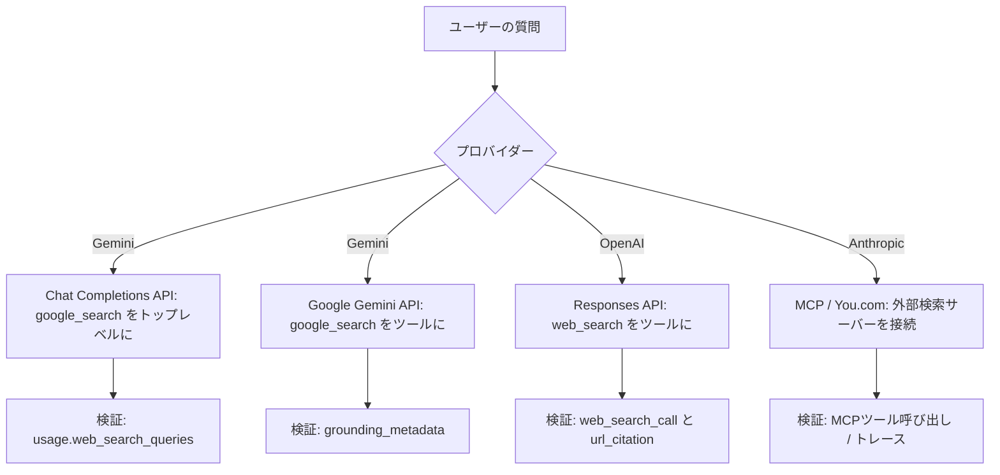

# はじめに

新しいマニュアルのページが作成されていて、Databricksの基盤モデルがそのままweb検索できるようになっていました。

https://docs.databricks.com/aws/ja/machine-learning/model-serving/web-search

LLMは学習データのカットオフ以降の出来事を知りません。なので時事的な質問や最新の数値を尋ねると、それっぽいけど古い (あるいは間違った) 答えが返ってきがちです。web検索はこの問題に対する定番の対処で、モデルが応答を生成する途中でインターネットから最新の情報を取得し、それを回答に織り込みます。要するに、回答をリアルタイムの情報でグラウンディングする仕組みです。

以前書いた[音声・動画モデルに対するクエリー](https://qiita.com/taka_yayoi/items/5d9f01f739ed74c1ad35)の記事は「入力できるモダリティが画像から音声・動画にも広がった」という入力側の話でした。今回のweb検索は「出力を外部の最新情報で裏付ける」という出力側の話なので、別の軸の機能です。

ひとつ最初に押さえておきたいのは、有効化のやり方がモデルプロバイダーによってバラバラだという点です。同じ「web検索」でも、Gemini・OpenAI・Anthropicの3系統で使うAPIも渡し方も違います。本記事ではネイティブ対応しているGeminiとOpenAIを実際に動かし、「本当にweb検索が走ったのか」をレスポンスのフィールドと、検索オフ／オンの対照で確認します。Anthropicは外部MCP経由になるので、最後に補足として触れます。

# web検索とは何か

web検索が有効になっていると、モデルはユーザーの質問に応じてweb上の関連情報を探し、見つけた内容を応答に組み込みます。時事問題・最新データ・リアルタイムの情報があると回答が改善されるようなトピックで効果を発揮します。

ポイントは、検索クエリの作成も結果の統合もモデルがやってくれるところです。こちらは「web検索を使ってよい」と渡してやるだけで、何をどう検索するかはモデルが判断します。逆に言うと、回答の質はモデルの検索クエリ作成能力と結果を統合する能力に依存します。

# 3系統の全体像

有効化の方法はプロバイダーとAPIで異なります。まず全体像を整理しておきます。

| プロバイダー | 使うAPI | 有効化の方法 |
| --- | --- | --- |
| Gemini | Chat Completions API | リクエストボディのトップレベルに `google_search` を渡す |
| Gemini | Google Gemini API | ツールとして `google_search` を渡す |
| OpenAI | Responses API | ツールとして `web_search` を渡す |
| Anthropic | MCP (You.comなど) | web検索MCPサーバーをツールとして接続する |

GeminiとOpenAIは基盤モデルAPIを通じてネイティブに提供されます。一方Anthropicモデルは、Databricksの基盤モデルAPIからはネイティブのweb検索ツールが使えないため、MCP (Model Context Protocol) 経由で外部の検索プロバイダーをつなぎます。

図にするとこうです。有効化の方法と、後述する「検索が走ったことの確認方法」もあわせて載せています。



ここで先に注意をひとつ。OpenAIモデルのweb検索はResponses API経由でのみ利用でき、Chat Completions APIではサポートされていません。Geminiは `google_search` をトップレベルに渡すのに対し、OpenAIは `web_search` をツールとして渡す、という違いも地味に混乱しやすいので意識しておくとよいです。

# 検証の考え方

実際に動かす前に、検証方法を決めておきます。これが今回いちばん大事なところです。

web検索を有効にして質問を投げ、それっぽい最新情報を含む答えが返ってきても、テキストを眺めるだけでは「本当にwebを検索したのか、学習データから答えただけなのか」は区別できません。

結論から言うと、これはレスポンスのフィールドを見れば確実に判定できます。モデルが実際に投げた検索クエリ、引用元URL、検索回数といった情報がレスポンスに含まれていて、これらが取れていれば検索は間違いなく走っています。ただし見る場所が系統ごとに違うのが厄介で、

- Gemini (Chat Completions): `usage.web_search_queries` (検索回数)
- Gemini (Google Gemini API): `grounding_metadata` (検索クエリと引用元)
- OpenAI (Responses): `web_search_call` と `url_citation` (検索呼び出しと引用元)

と取り出し方が分かれます。各セクションで実際に取り出し、さらに検索オフ／オンの対照でも確かめます。

なお、MLflowのautologでトレースも取れます。後述するとおりGeminiはトレースのスパン出力にもグラウンディング情報が入りますが、入力側のツール指定やOpenAIの `web_search_call` はトレースに出てこないなど系統差があるので、横断的に確実なのはレスポンスのフィールドを直接見ることです。

# 共通のセットアップ

ライブラリをインストールします。

```python
%pip install -U databricks-openai google-genai mlflow
%restart_python
```

あわせてMLflowのautologを有効にしておきます (任意)。呼び出しのレイテンシーや履歴を眺められ、Geminiについては後述のとおりトレースのスパン出力にグラウンディング情報も入ります。不要なら飛ばして構いません。

```python
import mlflow

mlflow.openai.autolog()

# MLflowのバージョンによっては未対応の場合があるのでtry/exceptで囲む
try:
    mlflow.gemini.autolog()
except Exception as e:
    print(f"gemini autolog はスキップしました: {e}")
```

クライアントを用意します。Databricksのノートブック内であれば、認証情報 (base_urlとトークン) は `DatabricksOpenAI` が自動で解決してくれます。これ1つでGeminiのChat CompletionsにもOpenAIのResponsesにも使えます。

```python
from databricks_openai import DatabricksOpenAI

client = DatabricksOpenAI()

# 時事的で、出典がないと答えられない質問にしておくと検索の効果が分かりやすい
PROMPT = "2026年に入ってから発表された、生成AI関連の主要なニュースを3つ、それぞれ出典のURLとともに教えてください。"
```

ノートブックの外で動かす場合は、`OpenAI(api_key=..., base_url=...)` に `DATABRICKS_TOKEN` とエンドポイント (`https://<workspace_host>.databricks.com/serving-endpoints`) を渡してください。

# 1. Gemini × Chat Completions API

Chat Completions APIでGeminiのweb検索を有効にするには、`extra_body` 経由でリクエストボディのトップレベルに `google_search` を渡します。

```python
response = client.chat.completions.create(
    model="databricks-gemini-2-5-pro",
    messages=[{"role": "user", "content": PROMPT}],
    extra_body={"google_search": {}},
)

print(response.choices[0].message.content)
```

最新の出来事に関する回答が、出典URL付きで返ってきます (回答本文は長いので一部だけ抜粋します)。

```
### 1. NVIDIA、デスクサイドで大規模AI開発を可能にする新製品を発表

2026年6月1日、NVIDIAはWindowsを搭載したデスクサイドAIスーパーコンピューター...

**出典:**
*   PR TIMES: https://prtimes.jp/main/html/rd/p/000000523.000012662.html
...
```

検索が走ったかどうかを確認します。このChat Completionsの形状では、構造化された引用 (`message.annotations`) は `null` で返ってきます。出典URLは本文テキストの中に書かれている形です。代わりに、`usage` の中の `web_search_queries` でモデルが実行した検索の回数を確認できます。

```python
usage = response.usage.model_dump()
print("検索回数:", usage.get("web_search_queries"))
```

```
検索回数: 4
```

検索回数が1以上であれば、モデルがweb検索を実行したことが分かります。引用元を構造化データとして扱いたい場合は、次のGoogle Gemini APIのほうが向いています。

# 2. Gemini × Google Gemini API

[Google Gemini API](https://docs.databricks.com/aws/ja/machine-learning/model-serving/query-gemini-api)を使う場合は、`google_search` を「ツール」として渡します。Chat Completions APIではトップレベルのフィールドでしたが、こちらは `tools` に入れる形になる点に注意してください。こちらのネイティブな形状では、検索クエリと引用元が `grounding_metadata` にきれいに入ってくるので検証しやすいです。

```python
from google import genai
from google.genai import types

# ノートブックのコンテキストからトークンとホストを取得
ctx = dbutils.notebook.entry_point.getDbutils().notebook().getContext()
DATABRICKS_TOKEN = ctx.apiToken().get()
DATABRICKS_HOST = ctx.apiUrl().get()

genai_client = genai.Client(
    api_key="databricks",
    http_options=types.HttpOptions(
        base_url=f"{DATABRICKS_HOST}/serving-endpoints/gemini",
        headers={"Authorization": f"Bearer {DATABRICKS_TOKEN}"},
    ),
)

gemini_response = genai_client.models.generate_content(
    model="databricks-gemini-2-5-pro",
    contents=[
        types.Content(role="user", parts=[types.Part(text=PROMPT)]),
    ],
    config=types.GenerateContentConfig(
        tools=[types.Tool(google_search=types.GoogleSearch())],
    ),
)

print(gemini_response.text)
```

検索クエリと引用元を取り出します。`grounding_chunks[].web` には `domain` / `title` / `uri` が入っています。

```python
cand = gemini_response.candidates[0]
gm = cand.grounding_metadata

print("検索クエリ:", gm.web_search_queries)
for chunk in (gm.grounding_chunks or []):
    if chunk.web:
        print(f"  - {chunk.web.domain}: {chunk.web.uri}")
```

```
検索クエリ: ['2026年 生成AI 主要ニュース', '2026年 AI 新モデル 発表', '2026年 生成AI 規制動向', '2026年 AI 業界動向']
  - impress.co.jp: https://vertexaisearch.cloud.google.com/grounding-api-redirect/AUZIYQ...
  - dxmagazine.jp: https://vertexaisearch.cloud.google.com/grounding-api-redirect/AUZIYQ...
  - publickey1.jp: https://vertexaisearch.cloud.google.com/grounding-api-redirect/AUZIYQ...
  ...
```

モデルが実際に投げた検索クエリと、参照した情報源がそのまま見えます。いくつか注意点があります。`uri` は元サイトへの直リンクではなく `vertexaisearch.cloud.google.com` 経由のリダイレクトリンクなので、表示用のラベルには `domain` (または `title`、こちらもドメイン名が入ります) を使うとよいです。

さらに `grounding_metadata` には、本文のどの区間がどのチャンクに対応するかを示す `grounding_supports` (各要素が `segment.start_index` / `segment.end_index` / `segment.text` と `grounding_chunk_indices` を持つ) も入っているので、インライン引用を組み立てられます。`search_entry_point.rendered_content` にはGoogle検索サジェストのチップHTMLも含まれます (Googleの利用規約上、グラウンディング結果を見せる際はこのサジェストの表示が求められます)。

```python
# 本文の区間と引用元の対応 (インライン引用用)
for sup in (gm.grounding_supports or []):
    seg = sup.segment
    print(seg.start_index, seg.end_index, sup.grounding_chunk_indices)
```


# 3. OpenAI × Responses API

OpenAIモデルのweb検索を有効にするには、[OpenAI Responses API](https://docs.databricks.com/aws/ja/machine-learning/model-serving/query-openai-responses)を使い、`web_search` をツールとして渡します。繰り返しになりますが、OpenAIのweb検索はResponses API経由でのみ利用可能で、Chat Completions APIではサポートされていません。ここはハマりどころなので強調しておきます。

```python
openai_response = client.responses.create(
    model="databricks-gpt-5",
    input=[{"role": "user", "content": PROMPT}],
    tools=[{"type": "web_search"}],
)

print(openai_response.output_text)
```

Responses APIは、出力に `web_search_call` アイテム (検索の実行) と、メッセージ本文の `url_citation` アノテーション (引用元) を含めて返してくれます。3系統の中ではこれがいちばん素直で、引用元も元サイトへの直リンクです。次のように取り出します。

```python
for item in openai_response.output:
    if getattr(item, "type", None) == "web_search_call":
        print(f"[web_search_call] id={item.id}")
    if getattr(item, "type", None) == "message":
        for content in item.content:
            for ann in (getattr(content, "annotations", None) or []):
                if getattr(ann, "type", None) == "url_citation":
                    print(f"  - {ann.title}: {ann.url}")
```

```
[web_search_call] id=ws_05c58430573270e7016a1f810014608198b43dd6ed3e5c5457
[web_search_call] id=ws_05c58430573270e7016a1f8104cd648198a3e7f8d113e34b46
...
  - Introducing GPT-5.5 | OpenAI: https://openai.com/index/introducing-gpt-5-5/
  - Google updates its Gemini app to take on ChatGPT and Claude at IO 2026 | TechCrunch: https://techcrunch.com/2026/05/19/...
  - Microsoft's first advanced reasoning AI is here | The Verge: https://www.theverge.com/tech/941664/...
```

`web_search_call` が複数並んでいるのは、モデルが1つの質問に答えるために複数回検索したからです。各 `url_citation` には `title` と `url` のほか、本文中のどの位置を引用したかを示す `start_index` / `end_index` も入っているので、UIでインライン引用を作りたいときに使えます。

# オフ／オンの対照

検索フィールドの意味をいちばんはっきりさせるには、web検索を「使わない」場合と比べるのが手っ取り早いです。同じ質問を、検索を渡さずに投げてみます。

```python
# Gemini (Chat Completions): google_search を渡さない
gemini_off = client.chat.completions.create(
    model="databricks-gemini-2-5-pro",
    messages=[{"role": "user", "content": PROMPT}],
)
print(gemini_off.choices[0].message.content)
print("検索回数:", gemini_off.usage.model_dump().get("web_search_queries"))
```

```
ご指摘の2026年は未来のため、現時点ではニュースをお伝えすることができません。
おそらく「2024年」の誤りかと存じますので、2024年に入ってから発表された...
(GPT-4o、Claude 3、Gemini 1.5 Pro など2024年の話に終始)
...
検索回数: None
```

検索を渡さないと、Geminiは2026年を未来扱いして答えられず、学習データにある2024年の話にすり替えてきました。`web_search_queries` も `None` です。

OpenAIも同様です。

```python
# OpenAI (Responses): web_search ツールを渡さない
openai_off = client.responses.create(
    model="databricks-gpt-5",
    input=[{"role": "user", "content": PROMPT}],
)
print(openai_off.output_text)
has_search = any(getattr(i, "type", None) == "web_search_call" for i in openai_off.output)
print("web_search_call あり?:", has_search)
```

```
申し訳ありませんが、私は現在リアルタイムのウェブ参照ができず、知識は2024年10月までです。
そのため、2026年に入ってからの最新ニュースを正確なURL付きで提示することができません。
...
web_search_call あり?: False
```

リアルタイム参照ができないと明言して、回答そのものを断ってきました。`web_search_call` もありません。

オン (各セクション) とオフ (ここ) を並べると、差が一目で分かります。

| | オフ | オン |
| --- | --- | --- |
| Gemini (Chat Completions) | `web_search_queries`: None、最新の出来事に答えられず2024年の話にすり替え | `web_search_queries`: 4、出典付きで最新情報を回答 |
| OpenAI (Responses) | `web_search_call` なし、リアルタイム不可と回答を拒否 | `web_search_call` 7件 + `url_citation`、出典付きで最新情報を回答 |

「最新情報っぽい答えが返ってきた」だけでは検索の有無は分かりませんが、検索フィールドと、この対照を見れば確実です。web検索が実際に効いていることの裏取りとして使えます。

# 補足: Anthropic は MCP 経由 (You.com など)

GeminiとOpenAIは基盤モデルAPIにネイティブで載った機能ですが、Anthropicモデルだけは事情が違います。Anthropicのネイティブのweb検索ツールはDatabricksの基盤モデルAPIからは利用できないため、You.comのような外部の検索プロバイダーをMCP (Model Context Protocol) で外付けする形になります。外部サービスのAPIキーが別途必要で、前提も仕組みも上の2系統とは別物なので、ここでは概要だけ触れておきます。

Marketplaceからの具体的なセットアップ手順 (MCPサーバーのインストール、接続設定、`USE CONNECTION` 権限の付与) は公式ドキュメントにまとまっています。

https://docs.databricks.com/aws/ja/generative-ai/mcp/external-mcp

セットアップが済むと、MCPサーバーはAI Playground・エージェント・その他のMCP互換クライアントからツールとして使えるようになります。プロキシエンドポイントのURLは `https://<workspace_host>.databricks.com/api/2.0/mcp/external/<connection_name>` の形式です。

おまけとして、Databricksの基盤モデルAPIでClaude Codeを使う場合に、You.com MCPサーバーを足してweb検索を持たせることもできます。

```bash
claude mcp add youcom-search \
  --transport http \
  --url "https://<workspace_host>.databricks.com/api/2.0/mcp/external/<connection_name>" \
  --header "Authorization: Bearer <your-databricks-pat>"
```

`<workspace_host>` `<connection_name>` `<your-databricks-pat>` はお手元の値に置き換えてください。`claude mcp list` で追加を確認できます。

# 補足: MLflowトレースでの見え方

`mlflow.openai.autolog()` や `mlflow.gemini.autolog()` を有効にすると、各呼び出しがトレースされます。web検索まわりの見え方には系統差があるので、まとめておきます。

Geminiの呼び出し (Google Gemini API) は、スパンの出力に前述の `grounding_metadata` 一式 (検索クエリ・引用元・`grounding_supports`・検索サジェスト) がそのまま入ります。そのため、検索クエリや引用元、本文との対応をトレース上でも確認できます。

一方で、リクエストに渡した `google_search` / `web_search` のツール指定はトレースの入力には現れず、OpenAI (Responses) の `web_search_call` もトレースには出てきませんでした。実行時に `Failed to set tool definitions` や `unhashable type: 'list'` といった警告も出ており、autologがツール定義やレスポンスの一部をうまく取り込めていないようです。また、web検索はプロバイダー側 (サーバー側) で実行されるため、`web_search` 専用の独立したスパンは生成されません。

まとめると、Geminiはトレース上でもグラウンディングを確認できますが、プロバイダーをまたいで確実に「検索が走ったか」を判定するなら、各セクションのレスポンスのフィールド (`usage.web_search_queries` / `grounding_metadata` / `web_search_call` と `url_citation`) とオフ／オンの対照を見るのが手堅いです。トレースはレイテンシーや呼び出し履歴をまとめて眺める観測用途として併用するとよいでしょう。

# 対応モデル

web検索は、すべてのGeminiおよびOpenAIの仮想単位の従量課金基盤モデルでサポートされています。利用可能なリージョンについては[基盤モデルAPIsで利用可能なDatabricksホスト型基盤モデル](https://docs.databricks.com/aws/ja/machine-learning/foundation-model-apis/supported-models)を参照してください。

Geminiモデル:

- `databricks-gemini-3-1-pro`
- `databricks-gemini-3-1-flash-lite`
- `databricks-gemini-3-pro`
- `databricks-gemini-3-flash`
- `databricks-gemini-2-5-pro`
- `databricks-gemini-2-5-flash`

OpenAIモデル:

- `databricks-gpt-5-5-pro`
- `databricks-gpt-5-5`
- `databricks-gpt-5-4` / `databricks-gpt-5-4-mini` / `databricks-gpt-5-4-nano`
- `databricks-gpt-5-3-codex`
- `databricks-gpt-5-2` / `databricks-gpt-5-2-codex`
- `databricks-gpt-5-1` / `databricks-gpt-5-1-codex-max` / `databricks-gpt-5-1-codex-mini`
- `databricks-gpt-5` / `databricks-gpt-5-mini` / `databricks-gpt-5-nano`

Anthropicモデル (MCP経由):

MCPによるweb検索は、ツールの使用をサポートするすべてのAnthropic基盤モデルで利用できます。

- `databricks-claude-sonnet-4-6` / `databricks-claude-sonnet-4-5` / `databricks-claude-sonnet-4`
- `databricks-claude-opus-4-7` / `databricks-claude-opus-4-6` / `databricks-claude-opus-4-5` / `databricks-claude-opus-4-1`

# 制限事項

導入前に押さえておきたい制限です。

- web検索は仮想単位の従量課金基盤モデルエンドポイントでのみ利用できます。プロビジョンドスループットのエンドポイントはweb検索をサポートしていません。
- 外部モデルはDatabricks経由のweb検索をサポートしていません。
- web検索クエリはHIPAAに準拠していない外部の検索サービスに送信されるため、HIPAA/BAAコンプライアンスが有効になっているワークスペースではweb検索を利用できません。
- 回答の質は、モデルが検索クエリを作成し結果を統合する能力に依存します。安定して同じ品質が出るとは限りません。今回の実行でも、出典の取り違えや真偽の怪しい情報が混ざることがありました。出力をそのまま信じず、引用元を必ず確認してください。
- OpenAIモデルではweb検索はResponses API経由でのみ利用可能です (Chat Completions APIは非対応)。
- 地域間処理が無効になっている場合、Geminiモデルのweb検索は利用できません。Geminiは地域内での検索処理をサポートしていないため、データ所在地の制約があるワークスペースは対象外になります。
- 地域間処理が無効になっている場合、OpenAIモデルのweb検索はワークスペースが対象地域 (南北アメリカまたはヨーロッパ) にない限り利用できません。OpenAIはこれらの地域での地域内検索処理をサポートしています。

# おわりに

同じ「web検索」でも、Geminiは `google_search`、OpenAIは Responses API の `web_search` ツール、AnthropicはMCP (You.com) 経由、と3系統で渡し方がはっきり分かれているのが今回のポイントでした。そして「本当に検索したのか」は、Chat Completionsなら `usage.web_search_queries`、Google Gemini APIなら `grounding_metadata`、Responsesなら `web_search_call` と `url_citation`、とレスポンスのフィールドを見れば系統ごとに確実に判定できます。公式ドキュメントは応答テキストを出すところで終わっているので、この「効いているかの確かめ方」こそが実務で効いてくる部分だと思います。

学習データのカットオフを回避してリアルタイムの情報で回答を裏付けたい、というニーズはエージェントを作っているとすぐに出てきます。Databricks上の基盤モデルだけで完結できるようになったのは素直に便利です。Claude CodeにYou.com MCPを足してweb検索を持たせる手順まで用意されているので、まずはそのあたりから試してみるのがとっつきやすいと思います。

参考までに、関連するドキュメントを挙げておきます。

- [Databricks 上での関数呼び出し](https://docs.databricks.com/aws/ja/machine-learning/model-serving/function-calling)
- [チャットモデルを照会する](https://docs.databricks.com/aws/ja/machine-learning/model-serving/query-chat-models)
- [OpenAI Responses API を使用してクエリーを実行する](https://docs.databricks.com/aws/ja/machine-learning/model-serving/query-openai-responses)
- [Google Gemini API を使用してクエリーを実行する](https://docs.databricks.com/aws/ja/machine-learning/model-serving/query-gemini-api)

### はじめてのDatabricks

[はじめてのDatabricks](https://qiita.com/taka_yayoi/items/8dc72d083edb879a5e5d)

### Databricks無料トライアル

[Databricks無料トライアル](https://databricks.com/jp/try-databricks)
