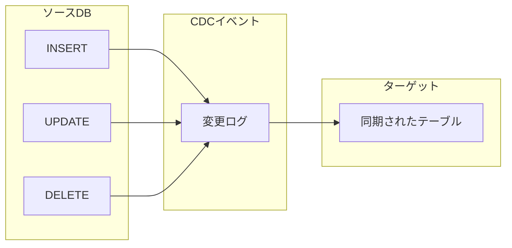

# はじめに

これまでのLevelでは、ストリーミングテーブル(ST)を使った**追記型**のデータ処理を学んできました。ログやイベントデータのように、新しいデータが追加されていく場合はこれで十分です。

しかし、マスターデータ(顧客情報、商品情報など)は違います:
- 顧客が住所を変更した → **更新**が必要
- 顧客が退会した → **削除**が必要
- 変更履歴を残したい → **履歴管理**が必要

このような「変更データの取り込み(CDC: Change Data Capture)」を簡単に実現するのが**AUTO CDC**です。

## Lakeflow SDP入門：基礎から実践まで

本記事は、SDPを段階的に学ぶ学習パス「**Lakeflow SDP入門：基礎から実践まで**」の最終回です。

| Level | タイトル | 所要時間 | 学ぶ概念 |
|-------|---------|---------|--------|
| 1 | [SQLだけで始めるLakeflow SDP](https://qiita.com/taka_yayoi/items/e6368446040c9e979d0f) | 30分 | MV、パイプライン |
| 2 | [Lakeflow SDPでデータ品質を守るエクスペクテーション](https://qiita.com/taka_yayoi/items/0b525cb05a095ad0bbe1) | 30分 | エクスペクテーション |
| 3 | [Lakeflow SDPの増分処理とストリーミングテーブル](https://qiita.com/taka_yayoi/items/c38069b6ddd93fbaacab) | 45分 | ST、増分処理 |
| 4 | [Lakeflow SDPのフローを理解する](https://qiita.com/taka_yayoi/items/3e966dee494d0800ec0c) | 45分 | フロー、append_flow |
| **5** | **Lakeflow SDPのAUTO CDCでマスターデータ同期(本記事)** | **60分** | **AUTO CDC、SCD** |

## この記事で学ぶこと

- CDCとは何か、なぜ必要か
- AUTO CDCの基本的な使い方
- SCD Type 1(上書き)とSCD Type 2(履歴保持)の違い
- マスターデータの同期パターン

## 前提条件

- Level 4までを完了している、またはSTとフローの基本を理解している
- SQLの基本が書ける

# CDCとは

## Change Data Capture

CDC(Change Data Capture)は、ソースシステムで発生したデータの変更(INSERT、UPDATE、DELETE)をキャプチャして、ターゲットシステムに反映する技術です。



## 従来のCDC処理の課題

CDCイベントを正しく処理するのは、実は非常に複雑です:

1. **順序の保証**: イベントが順番通りに届くとは限らない
2. **重複の処理**: 同じイベントが複数回届くことがある
3. **DELETE処理**: 削除されたレコードをどう扱うか
4. **履歴管理**: 変更前の値を残すかどうか

従来は、これらを自前で実装する必要がありました:

```sql
-- 従来のCDC処理(疑似コード)
MERGE INTO target t
USING (
    SELECT *, ROW_NUMBER() OVER (PARTITION BY id ORDER BY timestamp DESC) as rn
    FROM cdc_events
) s
ON t.id = s.id AND s.rn = 1
WHEN MATCHED AND s.operation = 'DELETE' THEN DELETE
WHEN MATCHED AND s.operation = 'UPDATE' THEN UPDATE SET ...
WHEN NOT MATCHED AND s.operation != 'DELETE' THEN INSERT ...
```

## AUTO CDCならシンプル

AUTO CDCを使えば、上記の複雑な処理がこれだけになります:

```sql
CREATE STREAMING TABLE customers;

CREATE FLOW sync_customers AS
AUTO CDC INTO customers
FROM STREAM cdc_source
KEYS (id)
SEQUENCE BY timestamp;
```

- **順序**: `SEQUENCE BY`で自動的に正しい順序で処理
- **重複**: 同じキーの古いイベントは自動的にスキップ
- **DELETE**: `APPLY AS DELETE WHEN`で条件指定
- **履歴**: `STORED AS SCD TYPE 2`で自動的に履歴管理

# SCD Type 1とType 2

AUTO CDCでは、2種類の履歴管理方式をサポートしています。

## SCD Type 1(上書き)

最新の状態のみを保持します。変更があれば上書きされ、過去の値は残りません。

```
【初期状態】
id=1, name="田中太郎", address="東京"

【住所変更後】
id=1, name="田中太郎", address="大阪"  ← 東京の履歴は消える
```

**用途**: 最新の状態だけが必要な場合(現在の顧客情報など)

## SCD Type 2(履歴保持)

変更のたびに新しい行を追加し、過去の状態も保持します。

```
【初期状態】
id=1, name="田中太郎", address="東京", __START_AT=2024-01-01, __END_AT=null

【住所変更後】
id=1, name="田中太郎", address="東京", __START_AT=2024-01-01, __END_AT=2024-06-15  ← 終了
id=1, name="田中太郎", address="大阪", __START_AT=2024-06-15, __END_AT=null        ← 新規
```

**用途**: 変更履歴が必要な場合(監査、時点分析など)

## 比較

| 項目 | Type 1 | Type 2 |
|------|--------|--------|
| 過去の値 | 保持しない | 保持する |
| レコード数 | 1レコード/キー | 複数レコード/キー |
| ストレージ | 少ない | 多い |
| クエリ | シンプル | 時点指定が必要 |
| 用途 | 最新状態の参照 | 履歴分析、監査 |

# ハンズオン: AUTO CDCでマスターデータを同期する

顧客マスターの変更をAUTO CDCで処理してみましょう。

## シナリオ

ソースシステムから顧客の変更イベント(INSERT/UPDATE/DELETE)が届きます。これをDatabricksのテーブルに同期します。

## Step 1: パイプラインとボリュームを準備

```sql
-- ボリュームを作成(SQLエディタで実行)
CREATE VOLUME IF NOT EXISTS workspace.sdp.cdc_volume;
```

ノートブックでディレクトリを作成:

```python
dbutils.fs.mkdirs("/Volumes/workspace/sdp/cdc_volume/customers/")
print("ディレクトリを作成しました")
```

## Step 2: 初期データ(INSERT)を作成

まず、3人の顧客を登録するCDCイベントを作成します。

```python
# 初期データ: 3人の顧客をINSERT
initial_data = """id,name,email,address,operation,event_time
1,田中太郎,tanaka@example.com,東京都渋谷区,INSERT,2024-01-01T10:00:00
2,鈴木花子,suzuki@example.com,大阪府大阪市,INSERT,2024-01-01T10:01:00
3,佐藤次郎,sato@example.com,愛知県名古屋市,INSERT,2024-01-01T10:02:00
"""

dbutils.fs.put("/Volumes/workspace/sdp/cdc_volume/customers/batch1_insert.csv", initial_data, overwrite=True)
print("初期データを作成しました(3件のINSERT)")
```


## Step 3: AUTO CDC(SCD Type 1)でテーブルを作成

パイプラインエディタで:

```sql
-- CDCソースを取り込むストリーミングテーブル
CREATE STREAMING TABLE customers_cdc_raw;

CREATE FLOW ingest_cdc AS
INSERT INTO customers_cdc_raw BY NAME
SELECT *
FROM STREAM read_files(
    '/Volumes/workspace/sdp/cdc_volume/customers/',
    format => 'csv',
    header => 'true',
    schema => 'id INT, name STRING, email STRING, address STRING, operation STRING, event_time TIMESTAMP'
);

-- AUTO CDCでマスターテーブルに同期(SCD Type 1)
CREATE STREAMING TABLE customers;

CREATE FLOW sync_customers AS
AUTO CDC INTO customers
FROM STREAM customers_cdc_raw
KEYS (id)
APPLY AS DELETE WHEN operation = 'DELETE'
SEQUENCE BY event_time
COLUMNS * EXCEPT (operation, event_time);
```

**ポイント:**
- `KEYS (id)`: 主キーを指定。同じIDのレコードは上書きされる
- `APPLY AS DELETE WHEN operation = 'DELETE'`: operation列が'DELETE'の場合は削除
- `SEQUENCE BY event_time`: この列で順序を決定(古いイベントは無視)
- `COLUMNS * EXCEPT (...)`: 出力テーブルから除外する列

**パイプラインを実行**をクリックします。

## Step 4: 結果を確認

実行後、`customers`テーブルを確認:

| id | name | email | address |
|----|------|-------|---------|
| 1 | 田中太郎 | tanaka@example.com | 東京都渋谷区 |
| 2 | 鈴木花子 | suzuki@example.com | 大阪府大阪市 |
| 3 | 佐藤次郎 | sato@example.com | 愛知県名古屋市 |


## Step 5: UPDATE/DELETEイベントを追加

顧客情報の変更と削除をシミュレートします。

```python
# 変更データ: UPDATE 2件、DELETE 1件
change_data = """id,name,email,address,operation,event_time
1,田中太郎,tanaka@example.com,神奈川県横浜市,UPDATE,2024-02-15T14:30:00
3,佐藤次郎,sato@example.com,愛知県名古屋市,DELETE,2024-02-20T09:00:00
2,鈴木花子,suzuki.new@example.com,大阪府大阪市,UPDATE,2024-03-01T11:00:00
"""

dbutils.fs.put("/Volumes/workspace/sdp/cdc_volume/customers/batch2_changes.csv", change_data, overwrite=True)
print("変更データを作成しました(UPDATE 2件、DELETE 1件)")
```

パイプラインを再実行します。

## Step 6: 変更結果を確認

`customers`テーブルを確認:

| id | name | email | address |
|----|------|-------|---------|
| 1 | 田中太郎 | tanaka@example.com | 神奈川県横浜市 |
| 2 | 鈴木花子 | suzuki.new@example.com | 大阪府大阪市 |


- id=1: 住所が「東京都渋谷区」→「神奈川県横浜市」に更新
- id=2: メールが「suzuki@example.com」→「suzuki.new@example.com」に更新
- id=3: 削除されてテーブルから消えた

これがSCD Type 1の動作です。最新の状態のみが保持されます。

# ハンズオン: SCD Type 2で履歴を保持する

次に、変更履歴を残すSCD Type 2を試してみましょう。

## Step 1: 履歴テーブルを追加

パイプラインに以下を追加:

```sql
-- AUTO CDCで履歴テーブルに同期(SCD Type 2)
CREATE STREAMING TABLE customers_history;

CREATE FLOW sync_customers_history AS
AUTO CDC INTO customers_history
FROM STREAM customers_cdc_raw
KEYS (id)
APPLY AS DELETE WHEN operation = 'DELETE'
SEQUENCE BY event_time
COLUMNS * EXCEPT (operation, event_time)
STORED AS SCD TYPE 2;
```

**追加されたオプション:**
- `STORED AS SCD TYPE 2`: 履歴を保持するモード

## Step 2: 実行して確認

**パイプラインを実行**をクリックします。

`customers_history`テーブルを確認:

| id | name | email | address | __START_AT | __END_AT |
|----|------|-------|---------|------------|----------|
| 1 | 田中太郎 | tanaka@example.com | 東京都渋谷区 | 2024-01-01 10:00:00 | 2024-02-15 14:30:00 |
| 1 | 田中太郎 | tanaka@example.com | 神奈川県横浜市 | 2024-02-15 14:30:00 | null |
| 2 | 鈴木花子 | suzuki@example.com | 大阪府大阪市 | 2024-01-01 10:01:00 | 2024-03-01 11:00:00 |
| 2 | 鈴木花子 | suzuki.new@example.com | 大阪府大阪市 | 2024-03-01 11:00:00 | null |
| 3 | 佐藤次郎 | sato@example.com | 愛知県名古屋市 | 2024-01-01 10:02:00 | 2024-02-20 09:00:00 |


**自動的に追加される列:**
- `__START_AT`: このレコードが有効になった時刻
- `__END_AT`: このレコードが無効になった時刻(nullは現在有効)

## Step 3: 履歴テーブルのクエリ

**現在有効なレコードのみ取得:**

```sql
SELECT * FROM customers_history
WHERE __END_AT IS NULL;
```

|id|name|email|address|__START_AT|__END_AT|
|---|---|---|---|---|---|
|1|田中太郎|tanaka@example.com|神奈川県横浜市|2024-02-15T14:30:00.000+00:00|-|
|2|鈴木花子|suzuki.new@example.com|大阪府大阪市|2024-03-01T11:00:00.000+00:00|-|

**特定時点のレコードを取得:**

```sql
-- 2024年2月1日時点の顧客情報
SELECT * FROM customers_history
WHERE __START_AT <= '2024-02-01'
  AND (__END_AT IS NULL OR __END_AT > '2024-02-01');
```

|id|name|email|address|__START_AT|__END_AT|
|---|---|---|---|---|---|
|1|田中太郎|tanaka@example.com|東京都渋谷区|2024-01-01T10:00:00.000+00:00|2024-02-15T14:30:00.000+00:00|
|2|鈴木花子|suzuki@example.com|大阪府大阪市|2024-01-01T10:01:00.000+00:00|2024-03-01T11:00:00.000+00:00|
|3|佐藤次郎|sato@example.com|愛知県名古屋市|2024-01-01T10:02:00.000+00:00|2024-02-20T09:00:00.000+00:00|

# AUTO CDCの構文詳細

## 基本構文

```sql
CREATE STREAMING TABLE ターゲットテーブル;

CREATE FLOW フロー名 AS
AUTO CDC INTO ターゲットテーブル
FROM STREAM ソーステーブル
KEYS (主キー列, ...)
[APPLY AS DELETE WHEN 削除条件]
SEQUENCE BY 順序列
[COLUMNS 列指定]
[STORED AS SCD TYPE {1 | 2}];
```

## オプション詳細

| オプション | 必須 | 説明 |
|-----------|------|------|
| `KEYS` | ✅ | 主キー列(複数可) |
| `SEQUENCE BY` | ✅ | 順序を決定する列(タイムスタンプなど) |
| `APPLY AS DELETE WHEN` | | 削除条件(省略時は削除なし) |
| `COLUMNS` | | 出力する列の指定 |
| `STORED AS SCD TYPE` | | 1(デフォルト)または2 |

## COLUMNS指定のパターン

```sql
-- すべての列
COLUMNS *

-- 特定の列を除外
COLUMNS * EXCEPT (operation, event_time, _rescued_data)

-- 特定の列のみ
COLUMNS id, name, email
```

# 実践パターン

## パターン1: 複合キー

```sql
CREATE FLOW sync_order_items AS
AUTO CDC INTO order_items
FROM STREAM order_items_cdc
KEYS (order_id, item_id)  -- 複合キー
SEQUENCE BY updated_at;
```

## パターン2: ソフトデリート(論理削除)

物理的に削除せず、フラグで管理する場合:

```sql
-- 削除フラグを追加(APPLY AS DELETE WHENを使わない)
CREATE FLOW sync_customers AS
AUTO CDC INTO customers
FROM STREAM customers_cdc
KEYS (id)
SEQUENCE BY event_time
COLUMNS id, name, email, address, 
        CASE WHEN operation = 'DELETE' THEN true ELSE false END AS is_deleted;
```

## パターン3: SCD Type 2 + 現在ビュー

履歴テーブルと、現在の状態を見るビューを組み合わせる:

```sql
-- 履歴テーブル
CREATE STREAMING TABLE customers_history;

CREATE FLOW sync_history AS
AUTO CDC INTO customers_history
FROM STREAM customers_cdc
KEYS (id)
SEQUENCE BY event_time
STORED AS SCD TYPE 2;

-- 現在の状態を見るビュー
CREATE MATERIALIZED VIEW customers_current AS
SELECT * EXCEPT (__START_AT, __END_AT)
FROM customers_history
WHERE __END_AT IS NULL;
```

# 注意点とベストプラクティス

## 1. SEQUENCE BY列は必ず指定

```sql
-- ❌ 間違い: SEQUENCE BYがない
CREATE FLOW sync AS
AUTO CDC INTO target
FROM STREAM source
KEYS (id);

-- ✅ 正しい: SEQUENCE BYで順序を保証
CREATE FLOW sync AS
AUTO CDC INTO target
FROM STREAM source
KEYS (id)
SEQUENCE BY event_time;
```

順序が保証されないと、古いイベントが新しいイベントを上書きする可能性があります。

## 2. ソースにoperation列がない場合

すべてUPSERT(INSERT or UPDATE)として処理されます。DELETEは処理されません。

```sql
-- operation列がない場合、APPLY AS DELETE WHENは使えない
CREATE FLOW sync AS
AUTO CDC INTO target
FROM STREAM source
KEYS (id)
SEQUENCE BY updated_at;
-- 削除は処理されない(UPSERTのみ)
```

## 3. SCD Type 2のストレージ考慮

SCD Type 2は変更のたびにレコードが増えるため、頻繁に更新されるテーブルではストレージが急増する可能性があります。

```sql
-- 対策: 古い履歴を定期的にアーカイブ
-- (パイプライン外で実行)
DELETE FROM customers_history
WHERE __END_AT < DATEADD(YEAR, -2, CURRENT_DATE());
```

## 4. キー列は変更しない

AUTO CDCはKEYS列でレコードを識別します。ソース側でキー値を変更すると、別レコードとして扱われます。

```
-- ❌ ソース側でidを変更すると...
id=1, name="田中" → id=100, name="田中"

-- 結果: id=1とid=100の2レコードが存在
```

## 5. _rescued_data列

スキーマ外の列があると`_rescued_data`に格納されます。通常は除外します。

```sql
COLUMNS * EXCEPT (operation, event_time, _rescued_data)
```

# まとめ

## 今日できるようになったこと

- CDCの概念とAUTO CDCの使い方を理解した
- SCD Type 1(上書き)とType 2(履歴保持)を使い分けられる
- マスターデータの同期パイプラインを構築できる

## AUTO CDCの価値

| 課題 | AUTO CDCによる解決 |
|------|-------------------|
| イベント順序の処理 | SEQUENCE BYで自動処理 |
| DELETE処理 | APPLY AS DELETE WHENで宣言的に指定 |
| 履歴管理 | SCD TYPE 2で自動的に履歴保持 |
| 重複イベント | 同じキー・古いシーケンスは自動スキップ |

## 学習パス完了！

これで「**Lakeflow SDP入門：基礎から実践まで**」の全5レベルが完了しました。

| Level | 学んだこと |
|-------|-----------|
| 1 | MV、パイプラインの基本 |
| 2 | エクスペクテーションによるデータ品質管理 |
| 3 | STと増分処理 |
| 4 | フローによる柔軟なデータ統合 |
| 5 | AUTO CDCによるマスターデータ同期 |

これらを組み合わせることで、本格的なデータパイプラインを構築できます。

## 次のステップ

さらに学びたい方は:

- [Lakeflow Connectでデータベースから自動CDC](https://docs.databricks.com/aws/ja/ingestion/lakeflow-connect) - ソースDBからのCDCを自動設定
- [Kafka連携](https://docs.databricks.com/aws/ja/structured-streaming/kafka) - メッセージングシステムとの連携
- [本番運用のベストプラクティス](https://docs.databricks.com/aws/ja/ldp/develop) - パイプライン開発の推奨事項

# 参考リンク

- [Lakeflow Spark宣言型パイプライン公式ドキュメント](https://docs.databricks.com/aws/ja/ldp/)
- [AUTO CDC API](https://docs.databricks.com/aws/ja/ldp/what-is-change-data-capture)
- [RDBMSテーブルのレプリケーション](https://docs.databricks.com/aws/ja/ldp/database-replication)
- [チュートリアル: CDCを使用してETLパイプラインを構築する](https://docs.databricks.com/aws/ja/ldp/tutorial-pipelines)


### はじめてのDatabricks

[はじめてのDatabricks](https://qiita.com/taka_yayoi/items/8dc72d083edb879a5e5d)

### Databricks無料トライアル

[Databricks無料トライアル](https://databricks.com/jp/try-databricks)
