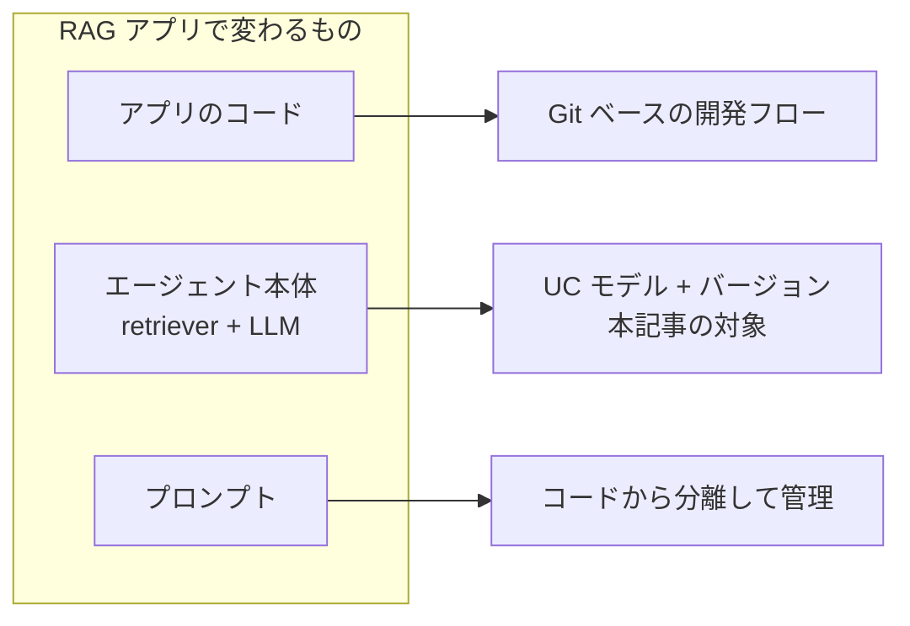
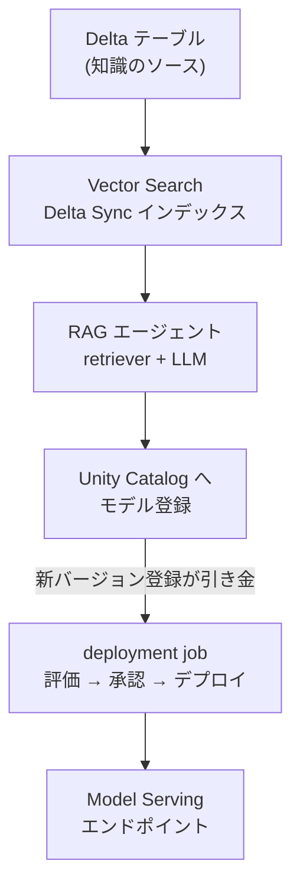
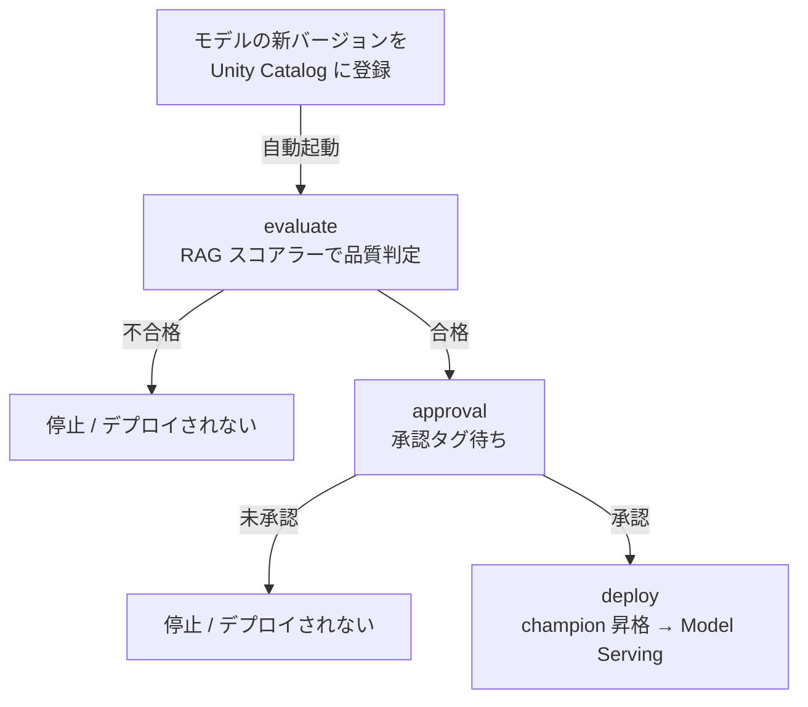

# RAG の CI/CD は意外と語られていない

生成 AI アプリケーションの運用、いわゆる LLMOps では、プロンプト管理・エージェント設計・評価・ガードレールといったテーマが活発に議論されています。一方で、出来上がった RAG アプリを「どう安全に本番へ送り出し、更新し続けるか」という CI/CD の話は、意外と手薄なままです。

評価やガードレールは PoC の段階から関心を集めますが、CI/CD はアプリが本番化し、更新が繰り返されるようになって初めて痛みとして表面化します。本記事では、この見落とされがちな RAG の CI/CD を、Databricks でどう組むかという考え方を中心に整理します。検証は Databricks Free Edition で行い、エンドツーエンドで動かしたところまでを示します。コスト按分は次回のテーマとし、ここでは扱いません。

# Databricks では DAB と deployment job が鍵になる
RAG アプリの CI/CD を考えるとき、まず「何が独立して変わるのか」を分解します。変化するものは性質の異なる3つに分かれます。



これらを1つのデプロイ単位に混ぜると、些細な変更でもアプリ全体を再デプロイする羽目になります。分離しておけば、それぞれが独自のリズムで昇格できます。本記事はこのうち「エージェント本体のバージョン昇格」を統制する仕組みを扱います。

Databricks でこれを実現する鍵が2つあります。ひとつは Declarative Automation Bundles (DAB、旧 Databricks Asset Bundles) で、ジョブ・ノートブック・設定をコードとして1つの単位で管理・デプロイします。2026年3月の改称ですが、CLI コマンドやバンドル設定はそのまま使えます。もうひとつが MLflow 3 の deployment job で、Unity Catalog のモデルに新しいバージョンが登録されたことを引き金に、評価・承認・デプロイを自動で実行します。DAB が「何をデプロイするか」をコード化し、deployment job が「どう昇格させるか」を統制する、という役割分担です。

# 全体の流れ

データの取り込みからエンドポイント公開までの流れは次のとおりです。



各ステップでやっていることは次のとおりです。

インデックス構築では、知識を入れた Delta テーブルから Delta Sync インデックスを作ります。Free Edition では手動でベクトルを投入する Direct Vector Access が使えないため、テーブルを同期する Delta Sync を使います。埋め込みは Foundation Model API の埋め込みエンドポイントに任せます。

エージェント登録では、インデックスを引く retriever と LLM を束ねたエージェントを Unity Catalog にモデルとして登録します。この登録が deployment job の引き金になります。

deployment job では、登録されたバージョンに対して評価・承認・デプロイが走ります。ここが本記事の中心なので、次節で詳しく見ます。

# deployment job の中身

deployment job は「評価 (evaluate)」「承認 (approval)」「デプロイ (deploy)」の3タスクで構成します。



## 起動とジョブパラメータ

deployment job は、モデルに新バージョンが登録されると自動起動します。このとき Databricks がジョブに注入するのは model_name と model_version の2つだけで、これらは必ずジョブレベルのパラメータとして定義しておく必要があります。タスクレベルに置くとモデルへの紐付けに失敗します。

```yaml
parameters:
  - name: model_name
    default: ""
  - name: model_version
    default: ""
```

## 評価タスク

評価では、RAG に適したスコアラーで品質を測ります。今回使ったのは、検索したコンテキストが回答に十分かを測る RetrievalSufficiency、回答がコンテキストに根拠づいているかを測る RetrievalGroundedness、期待事実に対する正確性を測る Correctness の3つです。

スコアラーは内部で LLM-as-a-Judge として LLM を呼びます。判定モデルを明示指定しておくと、環境による差異を避けられます。

```python
from mlflow.genai.scorers import RetrievalSufficiency, RetrievalGroundedness, Correctness

JUDGE = "endpoints:/databricks-meta-llama-3-3-70b-instruct"
results = mlflow.genai.evaluate(
    data=eval_dataset,
    predict_fn=predict_fn,
    scorers=[
        RetrievalSufficiency(model=JUDGE),
        RetrievalGroundedness(model=JUDGE),
        Correctness(model=JUDGE),
    ],
)
```

検索系スコアラーが機能する前提として、エージェント側の検索処理を RETRIEVER 型の span としてトレースし、取得結果を page_content と metadata の形で返す必要があります。これがないとスコアラーがコンテキストを抽出できません。

```python
@mlflow.trace(span_type=SpanType.RETRIEVER)
def _retrieve(self, query):
    res = self._index.similarity_search(
        query_text=query, columns=["id", "text"], num_results=self._k
    )
    rows = res.get("result", {}).get("data_array", []) or []
    return [{"page_content": r[1], "metadata": {"id": r[0]}} for r in rows]
```

そして、閾値に満たなければ確実にタスクを止めます。ここで notebook の exit を使うとタスクが正常終了扱いになり、後続のデプロイへ素通りしてしまうため、例外で止めます。

```python
if reasons:
    raise Exception("評価ゲート不合格: " + " / ".join(reasons))
```

## 承認タスク

評価を通っても自動ではデプロイしません。人がモデルバージョンを承認するまで、承認タスクは失敗 (停止) し続けます。ここが human-in-the-loop です。

承認の仕組みは Unity Catalog のタグで実現されています。承認タスクはタスク名が approval で始まるものとして識別され、UI の承認ボタンを押すと「キーが承認タスク名、値が Approved」のタグがモデルバージョンに付与され、ジョブが自動で再開されます。承認チェックはこのタグを見る形にします。

```python
# UI の Approve は「キー = 承認タスク名、値 = Approved」のタグを付ける
tags = client.get_model_version(model_name, model_version).tags
if tag_name not in tags:
    raise Exception("未承認")
elif tags.get(tag_name).lower() == "approved":
    print("APPROVED")
else:
    raise Exception("未承認")
```

なお、初回の実行は承認タグがまだ無いため、承認タスクで必ず失敗します。これは仕様どおりの挙動です。承認タスクはリトライを無効にし、ジョブの同時実行数は1にすることが推奨されます。

## デプロイタスクとロールバック

デプロイでは、承認済みバージョンを champion エイリアスへ昇格し、Model Serving エンドポイントへ出します。エイリアスで参照することで、利用側はバージョン番号ではなく champion という名前でモデルを指せます。ロールバックも champion を前のバージョンへ戻すだけで完了します。


# ウォークスルー (Free Edition)

実際に Free Edition で動かす手順です。

DAB をデプロイします。

```bash
databricks bundle deploy -t dev
```

インデックスを構築します (ノートブック 01 を実行)。Delta テーブルを作り、Delta Sync インデックスを同期します。オンラインになり、件数がソースと一致すれば成功です。


エージェントを登録します (ノートブック 02 を実行)。ローカルで動作確認したあと、Unity Catalog にモデルとして登録します。この登録がバージョンを生み、deployment job の引き金になります。


deployment job をモデルに紐付けます。モデルページの概要タブから接続します。ジョブパラメータに model_name と model_version がジョブレベルで定義されていることが紐付けの条件です。


新しいバージョンを登録すると、deployment job が自動起動します。評価が走り、品質に満たなければ承認の手前で停止します。下の例では Correctness が閾値に届かず、ゲートが正しくデプロイを止めています。これは失敗ではなく、ゲートが機能している証拠です。


内容を確認して問題なければ、モデルバージョン画面で承認します。承認するとタグが付与され、ジョブが自動で再開してデプロイへ進みます。


デプロイが完了すると、Model Serving エンドポイントが作成されます。Playground やクエリで動作確認すると、検索したコンテキストに基づく回答と、参照したソースが返ります。


これで、インデックス構築から評価ゲート・承認・デプロイ・推論まで、Free Edition で一周通りました。

# 学び

実際に動かして見えた、RAG の CI/CD を Databricks で組むうえでの勘所をまとめます。

deployment job の自動起動で注入されるのは model_name と model_version の2つだけです。評価の閾値や評価データは、外部パラメータにすると変更のたびに再デプロイが必要になるため、評価ノートブックの内側に持たせるのが運用上扱いやすいです。

評価データが少ないと、判定の揺らぎで簡単に閾値を割ります。少数の評価データに高い閾値を組み合わせると不安定になるため、閾値とデータ規模はセットで考える必要があります。まずスコアの実測値を見てから閾値を決めるのが現実的です。

承認は Unity Catalog タグで動きます。UI の承認ボタンが付けるタグ (キーが承認タスク名、値が Approved) を、承認チェック側が見ているかを揃えることが肝心です。初回は必ず承認タスクで失敗するので、リトライは無効にしておきます。

RAG スコアラーは、retriever span (RETRIEVER 型) と page_content / metadata 形式の取得結果が前提です。エージェント側のトレースをこの形にしておかないと、検索系の評価が機能しません。

Free Edition 固有の点として、Model Serving は scale-to-zero が必須、Vector Search は1エンドポイントで Delta Sync、judge 用 LLM は明示指定、利用可能な Foundation Model は事前確認、が挙げられます。また、モデル登録時に依存を手書きするとサービング用の環境定義に mlflow が含まれず失敗することがあるため、依存は自動推論に任せるのが無難です。

# 実装一式

以下を同じフォルダにフラットに配置します (サブフォルダは作りません)。カタログは workspace、埋め込みは databricks-qwen3-embedding-0-6b、LLM は databricks-meta-llama-3-3-70b-instruct を前提にしています。利用可能な Foundation Model は環境により異なるため、`databricks serving-endpoints list` で確認して合わせてください。

## databricks.yml

```yaml
bundle:
  name: rag-cicd-free

variables:
  vs_endpoint:
    default: rag_cicd_vs
  vs_index:
    default: workspace.rag_cicd.docs_index
  source_table:
    default: workspace.rag_cicd.docs
  embedding_endpoint:
    default: databricks-qwen3-embedding-0-6b
  llm_endpoint:
    default: databricks-meta-llama-3-3-70b-instruct
  uc_model_name:
    default: workspace.rag_cicd.rag_agent

include:
  - deployment_gate_job.yml

targets:
  dev:
    mode: development
    default: true
```

## deployment_gate_job.yml

deployment job の本体です。model_name と model_version をジョブレベルパラメータに、承認タグ名を承認タスク名に揃え (`{{task.name}}`)、承認タスクのリトライを無効、同時実行を1にしています。

```yaml
resources:
  jobs:
    eval_gate_job:
      name: "[${bundle.target}] rag-eval-gate"
      max_concurrent_runs: 1
      parameters:
        - name: model_name
          default: ""
        - name: model_version
          default: ""
      tasks:
        - task_key: evaluate
          notebook_task:
            notebook_path: 03_eval_gate.py
            base_parameters:
              model_name: "{{job.parameters.model_name}}"
              model_version: "{{job.parameters.model_version}}"
        - task_key: approval
          depends_on:
            - task_key: evaluate
          max_retries: 0
          notebook_task:
            notebook_path: _approval_check.py
            base_parameters:
              model_name: "{{job.parameters.model_name}}"
              model_version: "{{job.parameters.model_version}}"
              approval_tag_name: "{{task.name}}"
        - task_key: deploy
          depends_on:
            - task_key: approval
          notebook_task:
            notebook_path: _deploy.py
            base_parameters:
              model_name: "{{job.parameters.model_name}}"
              model_version: "{{job.parameters.model_version}}"
      queue:
        enabled: true
```

## agent.py

retriever を RETRIEVER 型の span でトレースし、page_content / metadata 形式で返す RAG エージェントです。models-from-code として `mlflow.models.set_model` で登録します。

```python
import mlflow
from mlflow.entities import SpanType
from mlflow.pyfunc import ChatAgent
from mlflow.types.agent import ChatAgentMessage, ChatAgentResponse
from mlflow.deployments import get_deploy_client
from databricks.vector_search.client import VectorSearchClient

_cfg = mlflow.models.ModelConfig(
    development_config={
        "vs_endpoint": "rag_cicd_vs",
        "vs_index": "workspace.rag_cicd.docs_index",
        "llm_endpoint": "databricks-meta-llama-3-3-70b-instruct",
        "num_results": 3,
    }
)

_SYSTEM = (
    "あなたは Databricks のサポートアシスタントです。"
    "与えられたコンテキストだけに基づいて簡潔に日本語で回答し、"
    "コンテキストに無い場合は分からないと答えてください。"
)


class RAGAgent(ChatAgent):
    def __init__(self):
        vsc = VectorSearchClient(disable_notice=True)
        self._index = vsc.get_index(
            endpoint_name=_cfg.get("vs_endpoint"), index_name=_cfg.get("vs_index")
        )
        self._llm = get_deploy_client("databricks")

    @mlflow.trace(span_type=SpanType.RETRIEVER)
    def _retrieve(self, query):
        res = self._index.similarity_search(
            query_text=query, columns=["id", "text"], num_results=_cfg.get("num_results")
        )
        rows = res.get("result", {}).get("data_array", []) or []
        return [{"page_content": r[1], "metadata": {"id": r[0]}} for r in rows]

    def predict(self, messages, context=None, custom_inputs=None) -> ChatAgentResponse:
        q = messages[-1].content
        docs = self._retrieve(q)
        ctx = "\n\n".join(d["page_content"] for d in docs)
        resp = self._llm.predict(
            endpoint=_cfg.get("llm_endpoint"),
            inputs={
                "messages": [
                    {"role": "system", "content": _SYSTEM},
                    {"role": "user", "content": f"コンテキスト:\n{ctx}\n\n質問: {q}"},
                ],
                "max_tokens": 512,
                "temperature": 0,
            },
        )
        answer = resp["choices"][0]["message"]["content"]
        return ChatAgentResponse(messages=[ChatAgentMessage(role="assistant", content=answer, id="0")])


mlflow.models.set_model(RAGAgent())
```

## 01_build_rag_index.py

```python
# Databricks notebook source
# MAGIC %pip install -U databricks-vectorsearch
# MAGIC %restart_python

# COMMAND ----------

dbutils.widgets.text("source_table", "workspace.rag_cicd.docs")
dbutils.widgets.text("vs_endpoint", "rag_cicd_vs")
dbutils.widgets.text("vs_index", "workspace.rag_cicd.docs_index")
dbutils.widgets.text("embedding_endpoint", "databricks-qwen3-embedding-0-6b")

SOURCE_TABLE = dbutils.widgets.get("source_table")
VS_ENDPOINT = dbutils.widgets.get("vs_endpoint")
VS_INDEX = dbutils.widgets.get("vs_index")
EMBED = dbutils.widgets.get("embedding_endpoint")

# COMMAND ----------

spark.sql("CREATE CATALOG IF NOT EXISTS workspace")
spark.sql("CREATE SCHEMA IF NOT EXISTS workspace.rag_cicd")

docs = [
    (1, "Unity Catalog は catalog.schema.table の3階層名前空間でデータと AI 資産を統治する。"),
    (2, "Auto Loader のファイル検出は directory listing と file notification の2モードがある。"),
    (3, "MLflow Prompt Registry はプロンプトをコードから分離し、エイリアスで環境間昇格できる。"),
    (4, "Delta Lake の Liquid Clustering はパーティション設計なしにクラスタリングキーで最適化する。"),
    (5, "MLflow 3 の deployment job は評価・承認・デプロイを自動化する。"),
]
df = spark.createDataFrame(docs, ["id", "text"])
df.write.mode("overwrite").saveAsTable(SOURCE_TABLE)
spark.sql(f"ALTER TABLE {SOURCE_TABLE} SET TBLPROPERTIES (delta.enableChangeDataFeed = true)")

# COMMAND ----------

from databricks.vector_search.client import VectorSearchClient

vsc = VectorSearchClient(disable_notice=True)
existing = [e["name"] for e in vsc.list_endpoints().get("endpoints", [])]
if VS_ENDPOINT not in existing:
    vsc.create_endpoint_and_wait(name=VS_ENDPOINT, endpoint_type="STANDARD")

# COMMAND ----------

try:
    index = vsc.get_index(endpoint_name=VS_ENDPOINT, index_name=VS_INDEX)
    index.sync()
except Exception:
    index = vsc.create_delta_sync_index_and_wait(
        endpoint_name=VS_ENDPOINT,
        index_name=VS_INDEX,
        source_table_name=SOURCE_TABLE,
        pipeline_type="TRIGGERED",
        primary_key="id",
        embedding_source_column="text",
        embedding_model_endpoint_name=EMBED,
    )

# COMMAND ----------

print(index.similarity_search(query_text="プロンプトの環境間昇格は?", columns=["id", "text"], num_results=2))
```

## 02_rag_agent.py

agent.py を読み込んでローカル動作確認し、Unity Catalog に登録します。`pip_requirements` は指定せず、依存は自動推論に任せます (指定すると conda.yaml に mlflow が含まれずサービングが失敗するため)。

```python
# Databricks notebook source
# MAGIC %pip install -U "mlflow[genai]>=3.1" databricks-vectorsearch databricks-sdk
# MAGIC %restart_python

# COMMAND ----------

dbutils.widgets.text("uc_model_name", "workspace.rag_cicd.rag_agent")
dbutils.widgets.text("vs_endpoint", "rag_cicd_vs")
dbutils.widgets.text("vs_index", "workspace.rag_cicd.docs_index")
dbutils.widgets.text("embedding_endpoint", "databricks-qwen3-embedding-0-6b")
dbutils.widgets.text("llm_endpoint", "databricks-meta-llama-3-3-70b-instruct")

UC_MODEL = dbutils.widgets.get("uc_model_name")
VS_ENDPOINT = dbutils.widgets.get("vs_endpoint")
VS_INDEX = dbutils.widgets.get("vs_index")
EMBED = dbutils.widgets.get("embedding_endpoint")
LLM = dbutils.widgets.get("llm_endpoint")

CFG = {"vs_endpoint": VS_ENDPOINT, "vs_index": VS_INDEX, "llm_endpoint": LLM, "num_results": 3}

# COMMAND ----------

import os, shutil

nb = dbutils.notebook.entry_point.getDbutils().notebook().getContext().notebookPath().get()
src = f"/Workspace{os.path.dirname(nb)}/agent.py"
if os.path.exists(src) and not os.path.exists("agent.py"):
    shutil.copy(src, "agent.py")
assert os.path.exists("agent.py"), "agent.py を同じフォルダに置いてください"

# COMMAND ----------

import importlib.util, mlflow
from mlflow.types.agent import ChatAgentMessage

spec = importlib.util.spec_from_file_location("agent_mod", "agent.py")
mod = importlib.util.module_from_spec(spec)
spec.loader.exec_module(mod)
mod._cfg = mlflow.models.ModelConfig(development_config=CFG)
agent = mod.RAGAgent()
print(agent.predict([ChatAgentMessage(role="user", content="プロンプトの環境間昇格は?")]).messages[-1].content)

# COMMAND ----------

from mlflow.models.resources import DatabricksVectorSearchIndex, DatabricksServingEndpoint

mlflow.set_registry_uri("databricks-uc")
mlflow.set_experiment("/Shared/rag-cicd")

with mlflow.start_run():
    info = mlflow.pyfunc.log_model(
        name="rag_agent",
        python_model="agent.py",
        model_config=CFG,
        resources=[
            DatabricksVectorSearchIndex(index_name=VS_INDEX),
            DatabricksServingEndpoint(endpoint_name=LLM),
            DatabricksServingEndpoint(endpoint_name=EMBED),
        ],
        registered_model_name=UC_MODEL,
        input_example={"messages": [{"role": "user", "content": "Liquid Clustering とは?"}]},
    )
print(f"registered: {UC_MODEL} v{info.registered_model_version}")
```

## 03_eval_gate.py

評価タスクです。閾値はこのノートブック内で管理します。判定モデルは明示指定し、不合格は例外で止めます。

```python
# Databricks notebook source
# MAGIC %pip install -U "mlflow[genai]>=3.1" databricks-vectorsearch databricks-sdk
# MAGIC %restart_python

# COMMAND ----------

dbutils.widgets.text("model_name", "")
dbutils.widgets.text("model_version", "")

MODEL = dbutils.widgets.get("model_name").strip() or "workspace.rag_cicd.rag_agent"
VERSION = dbutils.widgets.get("model_version").strip()

# 閾値はこのノートブック内で管理 (自動起動では model_name / model_version しか注入されないため)
THRESHOLDS = {"correctness": 0.5, "groundedness": 0.5, "sufficiency": 0.5}

# COMMAND ----------

import mlflow

mlflow.set_registry_uri("databricks-uc")
mlflow.set_experiment("/Shared/rag-cicd")
client = mlflow.MlflowClient()

if not VERSION:
    VERSION = str(max(int(v.version) for v in client.search_model_versions(f"name='{MODEL}'")))
print(f"evaluating {MODEL} v{VERSION}")

agent = mlflow.pyfunc.load_model(f"models:/{MODEL}/{VERSION}")

# COMMAND ----------

eval_dataset = [
    {"inputs": {"question": "Unity Catalog の名前空間は何階層?"},
     "expectations": {"expected_facts": ["3階層", "catalog.schema.table"]}},
    {"inputs": {"question": "Auto Loader のファイル検出モードは?"},
     "expectations": {"expected_facts": ["directory listing", "file notification"]}},
    {"inputs": {"question": "MLflow Prompt Registry の利点は?"},
     "expectations": {"expected_facts": ["コードから分離", "エイリアスで昇格"]}},
]


def predict_fn(question):
    return agent.predict({"messages": [{"role": "user", "content": question}]})["messages"][-1]["content"]

# COMMAND ----------

from mlflow.genai.scorers import RetrievalSufficiency, RetrievalGroundedness, Correctness

JUDGE = "endpoints:/databricks-meta-llama-3-3-70b-instruct"
results = mlflow.genai.evaluate(
    data=eval_dataset,
    predict_fn=predict_fn,
    scorers=[
        RetrievalSufficiency(model=JUDGE),
        RetrievalGroundedness(model=JUDGE),
        Correctness(model=JUDGE),
    ],
)
metrics = results.metrics
print(metrics)

# COMMAND ----------

def score_for(name):
    for k, v in metrics.items():
        kl = k.lower()
        if name in kl and ("mean" in kl or "rate" in kl or "score" in kl):
            try:
                return float(v)
            except (TypeError, ValueError):
                pass
    return None


reasons = []
for name, th in THRESHOLDS.items():
    s = score_for(name)
    print(f"{name}: {s} (閾値 {th})")
    if s is None:
        reasons.append(f"{name} のスコア取得不可")
    elif s < th:
        reasons.append(f"{name} {s:.3f} < {th}")

if reasons:
    raise Exception("評価ゲート不合格: " + " / ".join(reasons))

client.set_registered_model_alias(MODEL, "candidate", VERSION)
print(f"PASS candidate -> v{VERSION}")
```

## _approval_check.py

承認タスクです。UI の承認ボタンが付けるタグ (キー = 承認タスク名、値 = Approved) を見ます。

```python
# Databricks notebook source
dbutils.widgets.text("model_name", "")
dbutils.widgets.text("model_version", "")
dbutils.widgets.text("approval_tag_name", "approval")

MODEL = dbutils.widgets.get("model_name").strip() or "workspace.rag_cicd.rag_agent"
VERSION = dbutils.widgets.get("model_version").strip()
TAG = dbutils.widgets.get("approval_tag_name").strip() or "approval"

# COMMAND ----------

import mlflow

client = mlflow.MlflowClient(registry_uri="databricks-uc")

if not VERSION:
    VERSION = client.get_model_version_by_alias(MODEL, "candidate").version

tags = client.get_model_version(MODEL, VERSION).tags
if TAG not in tags:
    raise Exception(f"未承認: {MODEL} v{VERSION}。モデルバージョン画面の Approve を押してください。")
elif tags.get(TAG).lower() == "approved":
    print("APPROVED")
else:
    raise Exception(f"未承認: {MODEL} v{VERSION} (tag {TAG}={tags.get(TAG)})")
```

## _deploy.py

デプロイタスクです。champion エイリアスへ昇格し、Model Serving へデプロイします。Free Edition のため scale_to_zero を有効にします。

```python
# Databricks notebook source
# MAGIC %pip install -U databricks-agents mlflow
# MAGIC %restart_python

# COMMAND ----------

dbutils.widgets.text("model_name", "")
dbutils.widgets.text("model_version", "")

MODEL = dbutils.widgets.get("model_name").strip() or "workspace.rag_cicd.rag_agent"
VERSION = dbutils.widgets.get("model_version").strip()

# COMMAND ----------

import mlflow

client = mlflow.MlflowClient(registry_uri="databricks-uc")

if not VERSION:
    VERSION = client.get_model_version_by_alias(MODEL, "candidate").version

client.set_registered_model_alias(MODEL, "champion", VERSION)

# COMMAND ----------

from databricks import agents

print(agents.deploy(MODEL, int(VERSION), scale_to_zero=True))
```

# 次回: コスト管理へ

今回は CI/CD に絞りました。LLMOps でもうひとつ見落とされがちなのがコストの按分です。誰が・どのプロジェクトが・どのモデルでどれだけ使ったかを把握し、チャージバックや予算管理につなげる仕組みは、本番運用で効いてきます。

Databricks では Unity AI Gateway やシステムテーブルでこれを実現できますが、これらはアカウントレベルの機能であり、Free Edition の範囲を超えます。次回は業務ワークスペースを前提に、トークンとコストの按分、cost-per-successful-output という単位指標、予算アラートといったコスト管理を、今回の CI/CD と組み合わせて掘り下げる予定です。

# 参考ドキュメント

- MLflow 3 deployment jobs: https://docs.databricks.com/aws/ja/mlflow/deployment-job
- LLMOps ワークフロー: https://docs.databricks.com/aws/ja/machine-learning/mlops/llmops
- Declarative Automation Bundles (旧 Databricks Asset Bundles): https://docs.databricks.com/aws/ja/dev-tools/bundles/
- Vector Search (Delta Sync インデックス): https://docs.databricks.com/aws/ja/generative-ai/create-query-vector-search
- 生成 AI アプリの評価 (mlflow.genai): https://docs.databricks.com/aws/ja/mlflow3/genai/eval-monitor/
- エージェントのデプロイ (Model Serving): https://docs.databricks.com/aws/ja/generative-ai/agent-framework/deploy-agent
- Databricks Free Edition の制限: https://docs.databricks.com/aws/ja/getting-started/free-edition-limitations

### はじめてのDatabricks

[はじめてのDatabricks](https://qiita.com/taka_yayoi/items/8dc72d083edb879a5e5d)

### Databricks無料トライアル

[Databricks無料トライアル](https://databricks.com/jp/try-databricks)
